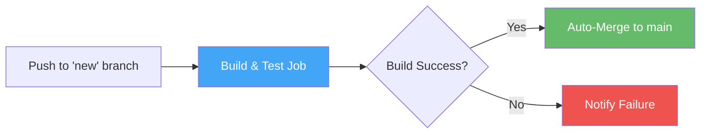

# GitHub Actions Workflows

This directory contains automated CI/CD workflows for the Salesforce DevOps Learning Hub.

## Workflows

### Auto-Merge to Main (`auto-merge-to-main.yml`)

**Purpose:** Automatically merge the `new` branch to `main` after successful build and tests.

**Trigger:** Push to `new` branch

**Process:**
1. **Build & Test Job:**
   - Checks out code
   - Sets up Node.js 20
   - Installs dependencies
   - Builds Docusaurus site
   - Runs tests (if any)
   - Uploads build artifacts

2. **Auto-Merge Job** (only if build succeeds):
   - Fetches all branches
   - Merges `new` into `main`
   - Pushes to `main`
   - Creates merge summary

3. **Notify Failure Job** (only if build fails):
   - Comments on commit with failure details
   - Blocks merge until issues are fixed

**Benefits:**
- ✅ Automated quality gates
- ✅ No manual merge needed
- ✅ Build verification before merge
- ✅ Clear audit trail
- ✅ Prevents broken code in main

## How It Works



## Setup Requirements

1. **Default GITHUB_TOKEN has required permissions** - No additional secrets needed for basic setup

2. **Branch Protection (Optional but Recommended):**
   - Require status checks to pass before merging
   - Require pull request reviews
   - Restrict who can push to main

## Usage

Simply push to the `new` branch:

```bash
git add .
git commit -m "Add new feature"
git push origin new
```

GitHub Actions will automatically:
- Run build
- Run tests
- Merge to main (if successful)
- Or notify you (if failed)

## Viewing Results

1. Go to **Actions** tab in GitHub
2. Find your workflow run
3. View logs for each job
4. See merge summary in job summary

## Customization

To modify the workflow behavior, edit `.github/workflows/auto-merge-to-main.yml`:

- **Add more tests:** Add steps to the `build-and-test` job
- **Change Node version:** Modify `node-version` in setup step
- **Add deployment:** Add a new job after successful merge
- **Customize notifications:** Modify the `notify-failure` job

## DevOps Best Practices Demonstrated

This workflow demonstrates enterprise DevOps practices:

1. **Automated Testing** - No manual build verification needed
2. **Quality Gates** - Build must pass before merge
3. **Audit Trail** - Every merge has clear commit message
4. **Fail Fast** - Catch issues before they reach main
5. **Self-Service** - Developers can deploy without manual intervention

## Troubleshooting

**Merge fails with "permission denied":**
- Ensure GITHUB_TOKEN has write permissions
- Check branch protection rules

**Build succeeds but merge doesn't happen:**
- Check workflow logs
- Verify `auto-merge` job ran
- Check for merge conflicts

**Want to skip auto-merge for a commit:**
- Create a pull request instead of direct push
- Or temporarily disable the workflow

## Portfolio Note

This CI/CD setup is a great talking point for DevOps Lead interviews at Australia Post:

**Interview Question:** "How would you implement automated deployments?"

**Your Answer:** "I've implemented GitHub Actions workflows that automatically build, test, and merge code. When developers push to the dev branch, the pipeline:
1. Builds the application
2. Runs all tests
3. Automatically merges to main if successful
4. Notifies if there are issues

This reduces deployment time from hours to minutes and eliminates manual merge errors. Similar to what we'll need at Australia Post for Salesforce deployments across multiple teams."

## Learn More

**New to GitHub Actions?** Check out our comprehensive beginner tutorial:

📚 **[GitHub Actions for Beginners](../../docs/pipelines/github-actions-beginner.md)**

This tutorial uses this exact auto-merge workflow as a teaching example, breaking down:
- Core concepts (workflows, jobs, steps, actions)
- How each part works
- Real problems we solved (permissions, MDX errors, broken links)
- Interview talking points
- Hands-on exercises

Perfect for DevOps Lead interview preparation!
