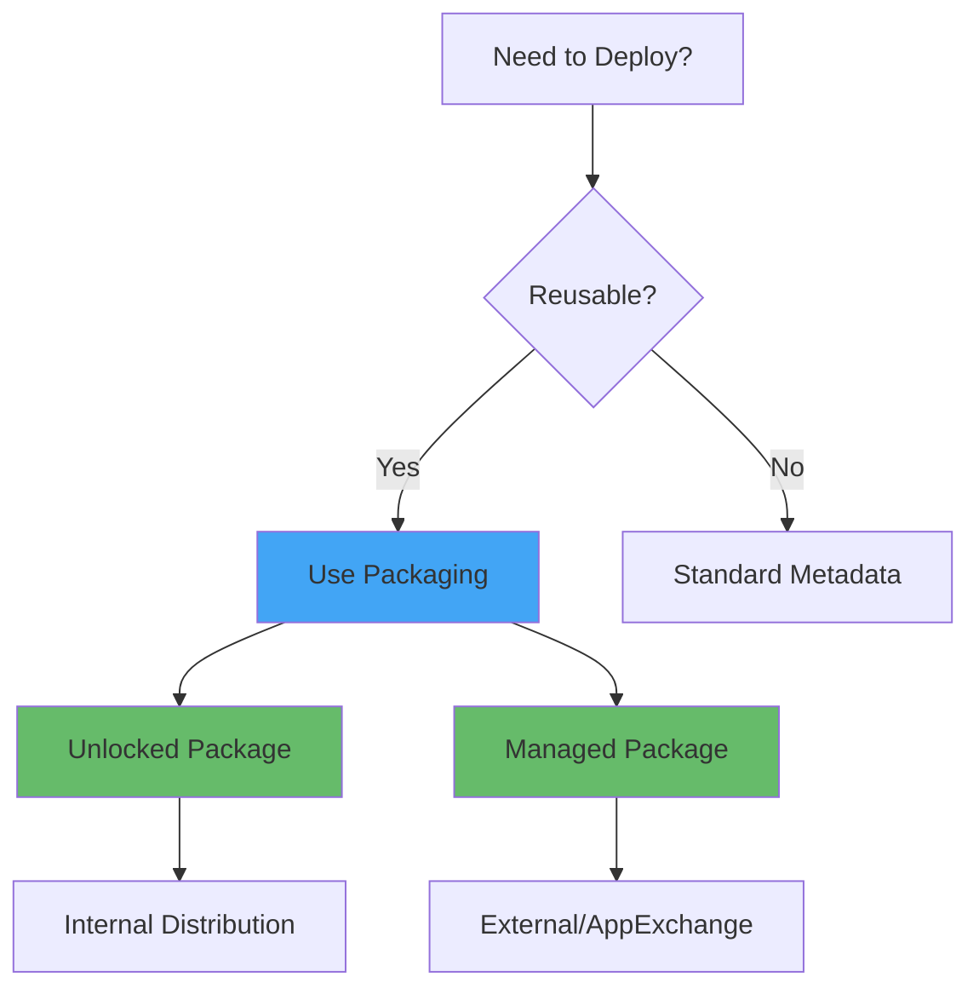

# Complex Org Strategies (Packaging, Scratch Orgs)

**Learning Objective**: Implement advanced Salesforce org management patterns including packaging, scratch orgs, and multi-org architectures.

## Overview

Enterprise Salesforce projects require sophisticated org management strategies. This guide covers packaging for reusability, scratch orgs for development isolation, and managing complex multi-org scenarios.

## Packaging Strategies

### When to Use Packaging



### Unlocked Packages

**Best for**: Internal applications, modular architecture, flexible updates

```yaml
# Create unlocked package
- name: Create Unlocked Package
  run: |
    # Create package
    sf package create \
      --name "Sales Cloud Extensions" \
      --package-type Unlocked \
      --path force-app/sales \
      --target-dev-hub devhub

    # Create package version
    sf package version create \
      --package "Sales Cloud Extensions" \
      --installation-key-bypass \
      --wait 20 \
      --target-dev-hub devhub \
      --json > package-version.json

    VERSION_ID=$(jq -r '.result.SubscriberPackageVersionId' package-version.json)
    echo "Package Version: $VERSION_ID"
    echo "version_id=$VERSION_ID" >> $GITHUB_OUTPUT

- name: Install in Target Org
  run: |
    sf package install \
      --package ${{ steps.create-package.outputs.version_id }} \
      --wait 20 \
      --target-org target-org \
      --no-prompt
```

### Second-Generation Managed Packages

```yaml
# Create managed package version
- name: Create Managed Package Version
  run: |
    sf package version create \
      --package "MyApp" \
      --installation-key mySecretKey \
      --wait 30 \
      --target-dev-hub devhub \
      --code-coverage \
      --json > package-version.json

    # Promote to released
    VERSION_ID=$(jq -r '.result.SubscriberPackageVersionId' package-version.json)

    sf package version promote \
      --package "$VERSION_ID" \
      --target-dev-hub devhub \
      --no-prompt
```

### Package Dependency Management

```json
// sfdx-project.json with dependencies
{
  "packageDirectories": [
    {
      "path": "force-app/core",
      "package": "Core",
      "versionName": "ver 1.0",
      "versionNumber": "1.0.0.NEXT",
      "default": false
    },
    {
      "path": "force-app/sales",
      "package": "Sales",
      "versionName": "ver 1.0",
      "versionNumber": "1.0.0.NEXT",
      "default": true,
      "dependencies": [
        {
          "package": "Core",
          "versionNumber": "1.0.0.LATEST"
        }
      ]
    }
  ],
  "namespace": "",
  "sourceApiVersion": "59.0"
}
```

### Automated Package Versioning

```yaml
name: Create and Promote Package

on:
  push:
    branches: [main]
    paths:
      - 'force-app/**'

jobs:
  package:
    runs-on: ubuntu-latest
    steps:
      - uses: actions/checkout@v4

      - name: Authenticate to Dev Hub
        run: |
          echo "${{ secrets.DEVHUB_AUTH_URL }}" > auth.txt
          sf org login sfdx-url --sfdx-url-file auth.txt --alias devhub --set-default-dev-hub

      - name: Create Package Version
        id: create-version
        run: |
          # Increment version automatically
          CURRENT_VERSION=$(jq -r '.packageDirectories[0].versionNumber' sfdx-project.json | sed 's/.NEXT//')
          echo "Current version: $CURRENT_VERSION"

          sf package version create \
            --package "MyPackage" \
            --installation-key-bypass \
            --wait 30 \
            --target-dev-hub devhub \
            --json | tee package-result.json

          VERSION_ID=$(jq -r '.result.SubscriberPackageVersionId' package-result.json)
          echo "version_id=$VERSION_ID" >> $GITHUB_OUTPUT

      - name: Tag Release
        run: |
          VERSION=$(jq -r '.result.Version' package-result.json)
          git tag "v$VERSION"
          git push origin "v$VERSION"

      - name: Create GitHub Release
        run: |
          gh release create "v$VERSION" \
            --title "Package Version $VERSION" \
            --notes "Package ID: ${{ steps.create-version.outputs.version_id }}"
```

## Scratch Org Development

### Scratch Org Definition

```json
// config/project-scratch-def.json
{
  "orgName": "Dev Scratch Org",
  "edition": "Developer",
  "features": ["Communities", "ServiceCloud", "MarketingUser"],
  "settings": {
    "lightningExperienceSettings": {
      "enableS1DesktopEnabled": true
    },
    "securitySettings": {
      "passwordPolicies": {
        "minimumPasswordLength": 8
      }
    },
    "languageSettings": {
      "enableTranslationWorkbench": true
    }
  },
  "objectSettings": {
    "account": {
      "sharingModel": "ReadWrite"
    }
  }
}
```

### Automated Scratch Org Workflows

```yaml
name: PR Validation with Scratch Org

on:
  pull_request:
    branches: [main]

jobs:
  validate:
    runs-on: ubuntu-latest
    steps:
      - uses: actions/checkout@v4

      - name: Authenticate to Dev Hub
        run: |
          echo "${{ secrets.DEVHUB_AUTH_URL }}" > auth.txt
          sf org login sfdx-url --sfdx-url-file auth.txt --set-default-dev-hub

      - name: Create Scratch Org
        id: create-scratch
        run: |
          sf org create scratch \
            --definition-file config/project-scratch-def.json \
            --alias pr-validation-${{ github.event.pull_request.number }} \
            --duration-days 1 \
            --set-default \
            --json | tee scratch-org.json

          ORG_ID=$(jq -r '.result.orgId' scratch-org.json)
          echo "org_id=$ORG_ID" >> $GITHUB_OUTPUT

      - name: Push Source to Scratch Org
        run: |
          sf project deploy start \
            --source-dir force-app \
            --target-org pr-validation-${{ github.event.pull_request.number }}

      - name: Assign Permission Sets
        run: |
          sf org assign permset \
            --name SalesUser \
            --target-org pr-validation-${{ github.event.pull_request.number }}

      - name: Load Test Data
        run: |
          sf data import tree \
            --plan data/sample-data-plan.json \
            --target-org pr-validation-${{ github.event.pull_request.number }}

      - name: Run Apex Tests
        run: |
          sf apex run test \
            --target-org pr-validation-${{ github.event.pull_request.number }} \
            --code-coverage \
            --result-format json \
            --output-dir test-results \
            --wait 20

      - name: Post Scratch Org URL to PR
        uses: actions/github-script@v7
        with:
          script: |
            const orgId = '${{ steps.create-scratch.outputs.org_id }}';
            github.rest.issues.createComment({
              owner: context.repo.owner,
              repo: context.repo.repo,
              issue_number: context.payload.pull_request.number,
              body: `## Scratch Org Created ✅\n\n**Org ID**: ${orgId}\n\nOpen with: \`sf org open --target-org pr-validation-${{ github.event.pull_request.number }}\``
            });

      - name: Delete Scratch Org
        if: always()
        run: |
          sf org delete scratch \
            --target-org pr-validation-${{ github.event.pull_request.number }} \
            --no-prompt
```

### Scratch Org Pooling

```yaml
name: Maintain Scratch Org Pool

on:
  schedule:
    - cron: '0 */6 * * *'  # Every 6 hours
  workflow_dispatch:

jobs:
  maintain-pool:
    runs-on: ubuntu-latest
    strategy:
      matrix:
        org-type: [dev, qa, demo]
    steps:
      - name: Count Active Orgs
        id: count
        run: |
          ACTIVE_ORGS=$(sf org list --json | jq '[.result.scratchOrgs[] | select(.alias | startswith("pool-${{ matrix.org-type }}"))] | length')
          echo "active=$ACTIVE_ORGS" >> $GITHUB_OUTPUT

      - name: Create Additional Orgs
        if: steps.count.outputs.active < 3
        run: |
          NEEDED=$((3 - ${{ steps.count.outputs.active }}))

          for i in $(seq 1 $NEEDED); do
            ALIAS="pool-${{ matrix.org-type }}-$(date +%s)"

            sf org create scratch \
              --definition-file config/${{ matrix.org-type }}-scratch-def.json \
              --alias "$ALIAS" \
              --duration-days 7 \
              --no-namespace \
              --target-dev-hub devhub

            # Setup org
            sf project deploy start --source-dir force-app --target-org "$ALIAS"
            sf data import tree --plan data/sample-data.json --target-org "$ALIAS"
          done
```

## Multi-Org Architecture

### Org-Per-Developer Strategy

```yaml
# Assign developer-specific scratch org
- name: Get or Create Developer Org
  run: |
    DEVELOPER="${{ github.actor }}"
    ORG_ALIAS="dev-${DEVELOPER}"

    # Check if org exists
    if sf org list --json | jq -e ".result.scratchOrgs[] | select(.alias == \"$ORG_ALIAS\")" > /dev/null; then
      echo "Using existing org: $ORG_ALIAS"
    else
      echo "Creating new org for $DEVELOPER"
      sf org create scratch \
        --definition-file config/dev-scratch-def.json \
        --alias "$ORG_ALIAS" \
        --duration-days 30
    fi

    # Deploy latest changes
    sf project deploy start --source-dir force-app --target-org "$ORG_ALIAS"
```

### Shared Development Org

```yaml
# Synchronize shared dev org
- name: Deploy to Shared Dev Org
  run: |
    # Generate delta package
    sfdx sgd:source:delta \
      --from "origin/main" \
      --to "HEAD" \
      --output delta \
      --generate-delta

    # Deploy only changes
    sf project deploy start \
      --target-org shared-dev \
      --manifest delta/package/package.xml \
      --test-level NoTestRun \
      --wait 20
```

## Modular Monorepo Structure

### Directory Structure

```
salesforce-monorepo/
├── packages/
│   ├── core/               # Foundational package
│   │   ├── force-app/
│   │   └── sfdx-project.json
│   ├── sales/              # Sales-specific features
│   │   ├── force-app/
│   │   └── sfdx-project.json
│   └── service/            # Service-specific features
│       ├── force-app/
│       └── sfdx-project.json
├── .github/
│   └── workflows/
│       ├── deploy-core.yml
│       ├── deploy-sales.yml
│       └── deploy-service.yml
└── sfdx-project.json       # Root project file
```

### Selective Package Deployment

```yaml
name: Deploy Changed Packages

on:
  push:
    branches: [main]

jobs:
  detect-changes:
    runs-on: ubuntu-latest
    outputs:
      core: ${{ steps.changes.outputs.core }}
      sales: ${{ steps.changes.outputs.sales }}
      service: ${{ steps.changes.outputs.service }}
    steps:
      - uses: actions/checkout@v4
      - id: changes
        run: |
          if git diff --name-only HEAD~1 | grep -q "^packages/core/"; then
            echo "core=true" >> $GITHUB_OUTPUT
          fi
          if git diff --name-only HEAD~1 | grep -q "^packages/sales/"; then
            echo "sales=true" >> $GITHUB_OUTPUT
          fi
          if git diff --name-only HEAD~1 | grep -q "^packages/service/"; then
            echo "service=true" >> $GITHUB_OUTPUT
          fi

  deploy-core:
    needs: detect-changes
    if: needs.detect-changes.outputs.core == 'true'
    runs-on: ubuntu-latest
    steps:
      - name: Deploy Core Package
        run: |
          cd packages/core
          sf project deploy start --target-org production --manifest manifest/package.xml

  deploy-sales:
    needs: [detect-changes, deploy-core]
    if: needs.detect-changes.outputs.sales == 'true'
    runs-on: ubuntu-latest
    steps:
      - name: Deploy Sales Package
        run: |
          cd packages/sales
          sf project deploy start --target-org production --manifest manifest/package.xml
```

## Environment Promotion Strategy

### Progressive Deployment

```yaml
name: Progressive Environment Deployment

on:
  push:
    branches: [release/*]

jobs:
  deploy-dev:
    runs-on: ubuntu-latest
    steps:
      - name: Deploy to Dev
        run: sf project deploy start --target-org dev

  deploy-qa:
    needs: deploy-dev
    runs-on: ubuntu-latest
    steps:
      - name: Deploy to QA
        run: sf project deploy start --target-org qa --test-level RunLocalTests

  deploy-uat:
    needs: deploy-qa
    runs-on: ubuntu-latest
    environment:
      name: uat
    steps:
      - name: Deploy to UAT
        run: sf project deploy start --target-org uat --test-level RunLocalTests

  deploy-prod:
    needs: deploy-uat
    runs-on: ubuntu-latest
    environment:
      name: production
      url: https://production.my.salesforce.com
    steps:
      - name: Deploy to Production
        run: sf project deploy start --target-org production --test-level RunLocalTests
```

## Best Practices

### 1. Package Version Tagging

```bash
# Semantic versioning for packages
MAJOR=1
MINOR=0
PATCH=$((GITHUB_RUN_NUMBER))

VERSION="${MAJOR}.${MINOR}.${PATCH}"
echo "version=$VERSION" >> $GITHUB_OUTPUT
```

### 2. Scratch Org Templates

Create multiple scratch org definitions for different purposes:
- `dev-scratch-def.json` - Minimal features for development
- `qa-scratch-def.json` - Full features for QA testing
- `demo-scratch-def.json` - Production-like for demos

### 3. Package Testing

```yaml
- name: Test Package Installation
  run: |
    # Create test scratch org
    sf org create scratch --definition-file config/test-scratch-def.json --alias package-test

    # Install package
    sf package install --package $VERSION_ID --target-org package-test --wait 20

    # Run tests
    sf apex run test --target-org package-test --test-level RunLocalTests
```

## Interview Talking Points

1. **"We use unlocked packages for modular architecture"**
   - Shows modern Salesforce development practices
   - Demonstrates scalability thinking

2. **"We maintain a pool of pre-configured scratch orgs for rapid development"**
   - Shows efficiency focus
   - Demonstrates developer experience thinking

3. **"We use monorepo structure with selective deployment"**
   - Shows architectural sophistication
   - Demonstrates CI/CD optimization

4. **"We have separate scratch org definitions for different purposes"**
   - Shows organizational maturity
   - Demonstrates practical thinking

5. **"We automate package versioning and promotion"**
   - Shows automation expertise
   - Demonstrates release management knowledge

## Next Steps

- **Related**: [Custom Runners & Docker](./custom-runners-docker) - Infrastructure for packaging
- **Related**: [Performance Optimization](./performance-optimization) - Optimize package deployment
- **Related**: [Monitoring & Improvement](./monitoring-improvement) - Track package metrics

---

**Key Takeaway**: Complex org strategies enable scalable Salesforce development. Use packaging for reusability, scratch orgs for isolation, and modular architecture for maintainability. Start simple, add complexity only when it solves real problems.
