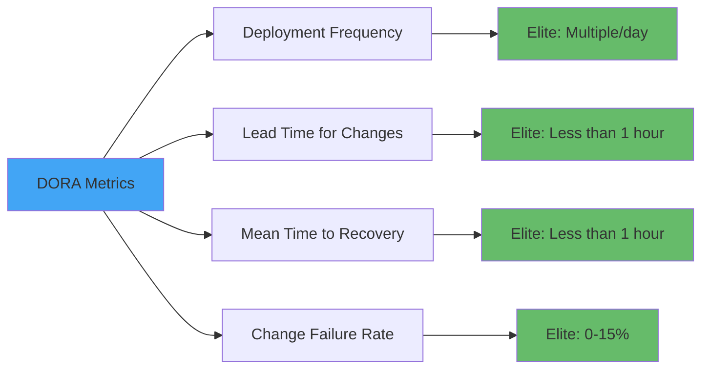

# Monitoring, Observability, and Continuous Improvement

**Learning Objective**: Measure and improve DevOps performance over time through metrics, monitoring, and data-driven optimization.

## Overview

You can't improve what you don't measure. This guide shows you how to instrument your Salesforce CI/CD pipelines, track meaningful metrics, and use data to continuously improve your DevOps practice.

## DORA Metrics

### The Four Key Metrics

DORA (DevOps Research and Assessment) identified four metrics that predict software delivery performance:



### Track Deployment Frequency

```yaml
name: Track Deployment Frequency

on:
  push:
    branches: [main]

jobs:
  deploy-and-track:
    runs-on: ubuntu-latest
    steps:
      - name: Deploy to Production
        id: deploy
        run: |
          sf project deploy start \
            --target-org production \
            --manifest manifest/package.xml \
            --wait 30

      - name: Record Deployment Metric
        if: success()
        run: |
          # Send to metrics system
          curl -X POST https://metrics.company.com/api/deployments \
            -H "Content-Type: application/json" \
            -d '{
              "metric": "deployment_frequency",
              "timestamp": "'$(date -u +%Y-%m-%dT%H:%M:%SZ)'",
              "environment": "production",
              "deployer": "${{ github.actor }}",
              "commit": "${{ github.sha }}",
              "success": true
            }'
```

### Track Lead Time for Changes

```yaml
- name: Calculate Lead Time
  run: |
    # Time from first commit to deployment
    FIRST_COMMIT_TIME=$(git log --reverse --format=%ct ${{ github.event.before }}..${{ github.sha }} | head -1)
    DEPLOY_TIME=$(date +%s)

    LEAD_TIME_SECONDS=$((DEPLOY_TIME - FIRST_COMMIT_TIME))
    LEAD_TIME_HOURS=$((LEAD_TIME_SECONDS / 3600))

    echo "Lead time: ${LEAD_TIME_HOURS} hours"

    # Record metric
    curl -X POST https://metrics.company.com/api/metrics \
      -H "Content-Type: application/json" \
      -d '{
        "metric": "lead_time_for_changes",
        "value": '${LEAD_TIME_HOURS}',
        "unit": "hours",
        "timestamp": "'$(date -u +%Y-%m-%dT%H:%M:%SZ)'"
      }'
```

### Track Mean Time to Recovery (MTTR)

```yaml
name: Track Incident Recovery

on:
  workflow_dispatch:
    inputs:
      incident_id:
        description: 'Incident ID'
        required: true
      started_at:
        description: 'Incident start time (ISO8601)'
        required: true

jobs:
  track-recovery:
    runs-on: ubuntu-latest
    steps:
      - name: Calculate MTTR
        run: |
          START_TIME=$(date -d "${{ inputs.started_at }}" +%s)
          RECOVERY_TIME=$(date +%s)

          MTTR_SECONDS=$((RECOVERY_TIME - START_TIME))
          MTTR_MINUTES=$((MTTR_SECONDS / 60))

          echo "MTTR: ${MTTR_MINUTES} minutes"

          # Record metric
          curl -X POST https://metrics.company.com/api/incidents \
            -H "Content-Type: application/json" \
            -d '{
              "incident_id": "${{ inputs.incident_id }}",
              "mttr_minutes": '${MTTR_MINUTES}',
              "recovered_at": "'$(date -u +%Y-%m-%dT%H:%M:%SZ)'",
              "recovered_by": "${{ github.actor }}"
            }'
```

### Track Change Failure Rate

```yaml
- name: Track Deployment Outcome
  if: always()
  run: |
    if [ "${{ job.status }}" == "success" ]; then
      FAILED=false
    else
      FAILED=true
    fi

    # Record outcome
    curl -X POST https://metrics.company.com/api/deployments \
      -H "Content-Type: application/json" \
      -d '{
        "deployment_id": "${{ github.run_id }}",
        "failed": '${FAILED}',
        "timestamp": "'$(date -u +%Y-%m-%dT%H:%M:%SZ)'",
        "commit": "${{ github.sha }}"
      }'

- name: Calculate Change Failure Rate
  run: |
    # Get last 30 days of deployments
    TOTAL=$(curl -s https://metrics.company.com/api/deployments?days=30 | jq 'length')
    FAILED=$(curl -s https://metrics.company.com/api/deployments?days=30\&failed=true | jq 'length')

    CFR=$(echo "scale=2; ($FAILED / $TOTAL) * 100" | bc)

    echo "Change Failure Rate: ${CFR}%"
    echo "### 📊 Change Failure Rate" >> $GITHUB_STEP_SUMMARY
    echo "${CFR}% (${FAILED} failures out of ${TOTAL} deployments)" >> $GITHUB_STEP_SUMMARY
```

## Pipeline Performance Tracking

### Comprehensive Pipeline Metrics

```yaml
- name: Track Pipeline Performance
  if: always()
  run: |
    cat > pipeline-metrics.json << EOF
    {
      "pipeline_id": "${{ github.run_id }}",
      "pipeline_name": "${{ github.workflow }}",
      "timestamp": "$(date -u +%Y-%m-%dT%H:%M:%SZ)",
      "branch": "${{ github.ref_name }}",
      "commit": "${{ github.sha }}",
      "trigger": "${{ github.event_name }}",
      "actor": "${{ github.actor }}",
      "duration": {
        "total_seconds": ${SECONDS},
        "checkout_seconds": ${CHECKOUT_TIME},
        "build_seconds": ${BUILD_TIME},
        "test_seconds": ${TEST_TIME},
        "deploy_seconds": ${DEPLOY_TIME}
      },
      "resources": {
        "runner": "${{ runner.os }}",
        "runner_name": "${{ runner.name }}"
      },
      "outcome": {
        "status": "${{ job.status }}",
        "conclusion": "${{ job.conclusion }}"
      },
      "tests": {
        "total": $(jq '.result.summary.testsRan' test-results/test-result.json),
        "passed": $(jq '.result.summary.passing' test-results/test-result.json),
        "failed": $(jq '.result.summary.failing' test-results/test-result.json),
        "coverage": $(jq '.result.summary.orgWideCoverage' test-results/test-result.json)
      },
      "deployment": {
        "components_deployed": $(jq '.result.numberComponentsDeployed' deploy-result.json),
        "components_total": $(jq '.result.numberComponentsTotal' deploy-result.json)
      }
    }
    EOF

    # Send to metrics system
    curl -X POST https://metrics.company.com/api/pipeline-metrics \
      -H "Content-Type: application/json" \
      -d @pipeline-metrics.json
```

### Real-Time Performance Dashboard

```yaml
- name: Update Performance Dashboard
  run: |
    # Generate performance summary
    cat > performance-summary.md << 'EOF'
    # Pipeline Performance Report

    ## Overall Metrics
    | Metric | Current | Target | Status |
    |--------|---------|--------|--------|
    | Total Duration | ${SECONDS}s | <1800s | $([ ${SECONDS} -lt 1800 ] && echo "✅" || echo "⚠️") |
    | Test Duration | ${TEST_TIME}s | <600s | $([ ${TEST_TIME} -lt 600 ] && echo "✅" || echo "⚠️") |
    | Deploy Duration | ${DEPLOY_TIME}s | <900s | $([ ${DEPLOY_TIME} -lt 900 ] && echo "✅" || echo "⚠️") |
    | Test Coverage | ${COVERAGE}% | >75% | $([ ${COVERAGE} -gt 75 ] && echo "✅" || echo "⚠️") |

    ## Stage Breakdown
    - Checkout: ${CHECKOUT_TIME}s
    - Dependencies: ${DEPS_TIME}s
    - Build: ${BUILD_TIME}s
    - Tests: ${TEST_TIME}s
    - Deploy: ${DEPLOY_TIME}s

    ## Trend
    $(python scripts/generate_trend.py)
    EOF

    echo "$(<performance-summary.md)" >> $GITHUB_STEP_SUMMARY
```

### Automated Performance Regression Detection

```yaml
- name: Detect Performance Regression
  run: |
    # Get average pipeline time from last 10 runs
    AVG_DURATION=$(curl -s https://metrics.company.com/api/pipeline-metrics?limit=10 \
      | jq '[.[] | .duration.total_seconds] | add / length')

    CURRENT_DURATION=${SECONDS}
    THRESHOLD=$(echo "$AVG_DURATION * 1.5" | bc)

    if (( $(echo "$CURRENT_DURATION > $THRESHOLD" | bc -l) )); then
      echo "⚠️ Performance regression detected!"
      echo "Current: ${CURRENT_DURATION}s, Average: ${AVG_DURATION}s"

      # Alert team
      curl -X POST ${{ secrets.SLACK_WEBHOOK }} \
        -H 'Content-Type: application/json' \
        -d '{
          "text": "⚠️ Pipeline performance regression detected",
          "attachments": [{
            "color": "warning",
            "fields": [
              {"title": "Current Duration", "value": "'${CURRENT_DURATION}'s", "short": true},
              {"title": "Average Duration", "value": "'${AVG_DURATION}'s", "short": true},
              {"title": "Pipeline", "value": "${{ github.workflow }}", "short": true},
              {"title": "Branch", "value": "${{ github.ref_name }}", "short": true}
            ]
          }]
        }'
    fi
```

## Observability Dashboards

### Grafana Dashboard Configuration

```json
{
  "dashboard": {
    "title": "Salesforce DevOps Metrics",
    "panels": [
      {
        "title": "Deployment Frequency",
        "type": "graph",
        "targets": [
          {
            "expr": "sum(rate(deployments_total[1d]))",
            "legendFormat": "Deployments per day"
          }
        ]
      },
      {
        "title": "Lead Time for Changes",
        "type": "graph",
        "targets": [
          {
            "expr": "avg(lead_time_hours)",
            "legendFormat": "Average lead time (hours)"
          }
        ]
      },
      {
        "title": "Change Failure Rate",
        "type": "stat",
        "targets": [
          {
            "expr": "(sum(deployments_failed) / sum(deployments_total)) * 100",
            "legendFormat": "Failure rate %"
          }
        ]
      },
      {
        "title": "Mean Time to Recovery",
        "type": "graph",
        "targets": [
          {
            "expr": "avg(mttr_minutes)",
            "legendFormat": "Average MTTR (minutes)"
          }
        ]
      }
    ]
  }
}
```

### Export Metrics to Prometheus

```yaml
- name: Export Prometheus Metrics
  run: |
    # Write metrics in Prometheus format
    cat > /metrics/salesforce_metrics.prom << EOF
    # HELP deployment_duration_seconds Time taken for deployment
    # TYPE deployment_duration_seconds gauge
    deployment_duration_seconds{environment="production",branch="main"} ${DEPLOY_TIME}

    # HELP test_duration_seconds Time taken for tests
    # TYPE test_duration_seconds gauge
    test_duration_seconds{environment="production",branch="main"} ${TEST_TIME}

    # HELP test_coverage_percent Code coverage percentage
    # TYPE test_coverage_percent gauge
    test_coverage_percent{environment="production",branch="main"} ${COVERAGE}

    # HELP deployments_total Total number of deployments
    # TYPE deployments_total counter
    deployments_total{environment="production",status="success"} 1

    # HELP deployment_size_components Number of components deployed
    # TYPE deployment_size_components gauge
    deployment_size_components{environment="production"} ${COMPONENTS_DEPLOYED}
    EOF
```

### Datadog Integration

```yaml
- name: Send Metrics to Datadog
  env:
    DD_API_KEY: ${{ secrets.DATADOG_API_KEY }}
  run: |
    # Send deployment event
    curl -X POST "https://api.datadoghq.com/api/v1/events" \
      -H "Content-Type: application/json" \
      -H "DD-API-KEY: ${DD_API_KEY}" \
      -d '{
        "title": "Salesforce Deployment",
        "text": "Deployed commit ${{ github.sha }} to production",
        "priority": "normal",
        "tags": ["environment:production", "service:salesforce"],
        "alert_type": "info"
      }'

    # Send metrics
    TIMESTAMP=$(date +%s)

    curl -X POST "https://api.datadoghq.com/api/v1/series" \
      -H "Content-Type: application/json" \
      -H "DD-API-KEY: ${DD_API_KEY}" \
      -d '{
        "series": [
          {
            "metric": "salesforce.deployment.duration",
            "points": [['${TIMESTAMP}', '${DEPLOY_TIME}']],
            "type": "gauge",
            "tags": ["environment:production", "team:devops"]
          },
          {
            "metric": "salesforce.test.coverage",
            "points": [['${TIMESTAMP}', '${COVERAGE}']],
            "type": "gauge",
            "tags": ["environment:production", "team:devops"]
          }
        ]
      }'
```

## Continuous Improvement Process

### Weekly Performance Review

```yaml
name: Weekly DevOps Review

on:
  schedule:
    - cron: '0 9 * * 1'  # Every Monday at 9 AM

jobs:
  generate-review:
    runs-on: ubuntu-latest
    steps:
      - name: Collect Weekly Metrics
        run: |
          # Get metrics from last 7 days
          START_DATE=$(date -d '7 days ago' +%Y-%m-%d)

          curl -s "https://metrics.company.com/api/summary?since=${START_DATE}" \
            > weekly-metrics.json

      - name: Generate Performance Report
        run: |
          python << 'EOF'
          import json
          from datetime import datetime, timedelta

          with open('weekly-metrics.json') as f:
              metrics = json.load(f)

          # Calculate DORA metrics
          deployment_frequency = len(metrics['deployments']) / 7
          avg_lead_time = sum(d['lead_time_hours'] for d in metrics['deployments']) / len(metrics['deployments'])
          failed_deployments = len([d for d in metrics['deployments'] if d['failed']])
          change_failure_rate = (failed_deployments / len(metrics['deployments'])) * 100
          avg_mttr = sum(i['mttr_minutes'] for i in metrics['incidents']) / len(metrics['incidents']) if metrics['incidents'] else 0

          # Generate report
          report = f"""
          # Weekly DevOps Performance Review
          **Week of {datetime.now().strftime('%Y-%m-%d')}**

          ## DORA Metrics

          | Metric | Value | Target | Status |
          |--------|-------|--------|--------|
          | Deployment Frequency | {deployment_frequency:.1f}/day | >1/day | {'✅' if deployment_frequency > 1 else '⚠️'} |
          | Lead Time for Changes | {avg_lead_time:.1f}h | <24h | {'✅' if avg_lead_time < 24 else '⚠️'} |
          | Change Failure Rate | {change_failure_rate:.1f}% | <15% | {'✅' if change_failure_rate < 15 else '⚠️'} |
          | Mean Time to Recovery | {avg_mttr:.0f}m | <60m | {'✅' if avg_mttr < 60 else '⚠️'} |

          ## Key Insights

          ### Deployment Activity
          - Total deployments: {len(metrics['deployments'])}
          - Successful: {len(metrics['deployments']) - failed_deployments}
          - Failed: {failed_deployments}
          - Average deployment size: {sum(d['components'] for d in metrics['deployments']) / len(metrics['deployments']):.0f} components

          ### Test Performance
          - Average test duration: {sum(d['test_duration'] for d in metrics['deployments']) / len(metrics['deployments']):.0f}s
          - Average test coverage: {sum(d['coverage'] for d in metrics['deployments']) / len(metrics['deployments']):.1f}%

          ### Pipeline Performance
          - Average pipeline duration: {sum(d['total_duration'] for d in metrics['deployments']) / len(metrics['deployments']):.0f}s
          - Slowest stage: {max(metrics['stages'], key=lambda x: x['avg_duration'])['name']}

          ## Recommendations
          """

          # Add recommendations based on metrics
          if deployment_frequency < 1:
              report += "\n- 🎯 Increase deployment frequency by implementing automated deployments for low-risk changes"

          if avg_lead_time > 24:
              report += "\n- 🎯 Reduce lead time by optimizing PR review process and automated testing"

          if change_failure_rate > 15:
              report += "\n- 🎯 Improve deployment quality by expanding test coverage and implementing canary deployments"

          if avg_mttr > 60:
              report += "\n- 🎯 Improve incident response by automating rollback procedures and improving monitoring"

          print(report)

          # Save report
          with open('weekly-report.md', 'w') as f:
              f.write(report)
          EOF

      - name: Post to Slack
        run: |
          curl -X POST ${{ secrets.SLACK_WEBHOOK }} \
            -H 'Content-Type: application/json' \
            -d '{
              "text": "📊 Weekly DevOps Performance Review",
              "attachments": [{
                "color": "good",
                "text": "'"$(cat weekly-report.md)"'"
              }]
            }'

      - name: Create GitHub Issue
        run: |
          gh issue create \
            --title "Weekly DevOps Review - $(date +%Y-%m-%d)" \
            --body-file weekly-report.md \
            --label "devops,metrics,weekly-review"
```

### Automated Improvement Suggestions

```python
#!/usr/bin/env python3
# scripts/suggest_improvements.py

import json
import sys
from collections import defaultdict

def analyze_metrics(metrics_file):
    with open(metrics_file) as f:
        metrics = json.load(f)

    suggestions = []

    # Analyze deployment patterns
    deployment_times = [d['duration']['total_seconds'] for d in metrics['deployments']]
    avg_deployment_time = sum(deployment_times) / len(deployment_times)

    if avg_deployment_time > 1800:  # 30 minutes
        suggestions.append({
            'category': 'Performance',
            'priority': 'High',
            'issue': f'Average deployment time is {avg_deployment_time/60:.0f} minutes',
            'recommendation': 'Implement delta deployments to reduce deployment size',
            'impact': 'Could reduce deployment time by 60-80%'
        })

    # Analyze test performance
    test_times = [d['duration']['test_seconds'] for d in metrics['deployments']]
    avg_test_time = sum(test_times) / len(test_times)

    if avg_test_time > 600:  # 10 minutes
        suggestions.append({
            'category': 'Testing',
            'priority': 'High',
            'issue': f'Average test time is {avg_test_time/60:.0f} minutes',
            'recommendation': 'Implement parallel test execution or selective test runs',
            'impact': 'Could reduce test time by 40-60%'
        })

    # Analyze failure patterns
    failures = [d for d in metrics['deployments'] if d['outcome']['status'] != 'success']
    failure_rate = len(failures) / len(metrics['deployments']) * 100

    if failure_rate > 15:
        # Find common failure reasons
        failure_reasons = defaultdict(int)
        for f in failures:
            reason = f.get('failure_reason', 'Unknown')
            failure_reasons[reason] += 1

        top_reason = max(failure_reasons.items(), key=lambda x: x[1])

        suggestions.append({
            'category': 'Reliability',
            'priority': 'Critical',
            'issue': f'Change failure rate is {failure_rate:.1f}%',
            'recommendation': f'Address top failure reason: {top_reason[0]} ({top_reason[1]} occurrences)',
            'impact': 'Could reduce failure rate by 50%'
        })

    # Analyze coverage trends
    coverages = [d['tests']['coverage'] for d in metrics['deployments'] if 'coverage' in d['tests']]
    avg_coverage = sum(coverages) / len(coverages)

    if avg_coverage < 75:
        suggestions.append({
            'category': 'Quality',
            'priority': 'Medium',
            'issue': f'Average code coverage is {avg_coverage:.1f}%',
            'recommendation': 'Increase test coverage, especially for critical business logic',
            'impact': 'Improves change failure rate and confidence in deployments'
        })

    # Print suggestions
    print("# 🎯 Improvement Suggestions\n")

    for priority in ['Critical', 'High', 'Medium', 'Low']:
        priority_suggestions = [s for s in suggestions if s['priority'] == priority]
        if priority_suggestions:
            print(f"## {priority} Priority\n")
            for s in priority_suggestions:
                print(f"### {s['category']}: {s['issue']}")
                print(f"**Recommendation**: {s['recommendation']}")
                print(f"**Expected Impact**: {s['impact']}\n")

    return suggestions

if __name__ == '__main__':
    metrics_file = sys.argv[1] if len(sys.argv) > 1 else 'pipeline-metrics.json'
    analyze_metrics(metrics_file)
```

## Alerting and Notifications

### Threshold-Based Alerts

```yaml
- name: Check Performance Thresholds
  run: |
    ALERTS=()

    # Check deployment duration
    if [ ${SECONDS} -gt 1800 ]; then
      ALERTS+=("⚠️ Deployment exceeded 30 minutes (${SECONDS}s)")
    fi

    # Check test coverage
    if [ ${COVERAGE} -lt 75 ]; then
      ALERTS+=("⚠️ Code coverage below 75% (${COVERAGE}%)")
    fi

    # Check failure rate
    RECENT_FAILURES=$(curl -s https://metrics.company.com/api/deployments?days=1\&failed=true | jq 'length')
    if [ ${RECENT_FAILURES} -gt 3 ]; then
      ALERTS+=("🚨 ${RECENT_FAILURES} deployment failures in last 24 hours")
    fi

    # Send alerts if any
    if [ ${#ALERTS[@]} -gt 0 ]; then
      ALERT_TEXT=$(printf '%s\n' "${ALERTS[@]}")

      curl -X POST ${{ secrets.SLACK_WEBHOOK }} \
        -H 'Content-Type: application/json' \
        -d '{
          "text": "🔔 DevOps Performance Alerts",
          "attachments": [{
            "color": "warning",
            "text": "'"${ALERT_TEXT}"'",
            "footer": "Pipeline: ${{ github.workflow }}"
          }]
        }'
    fi
```

### Anomaly Detection

```python
#!/usr/bin/env python3
# scripts/detect_anomalies.py

import json
import numpy as np
from datetime import datetime, timedelta

def detect_anomalies(metrics, metric_name, threshold_stddev=2):
    """Detect anomalies using standard deviation method"""

    values = [m[metric_name] for m in metrics]
    mean = np.mean(values)
    std = np.std(values)

    anomalies = []
    for i, value in enumerate(values):
        z_score = abs((value - mean) / std)
        if z_score > threshold_stddev:
            anomalies.append({
                'index': i,
                'value': value,
                'z_score': z_score,
                'expected_range': (mean - threshold_stddev * std, mean + threshold_stddev * std)
            })

    return anomalies

# Example usage in workflow
with open('pipeline-metrics.json') as f:
    metrics = json.load(f)

# Check for deployment time anomalies
deployment_times = [m['duration']['total_seconds'] for m in metrics]
anomalies = detect_anomalies(metrics, 'duration.total_seconds')

if anomalies:
    print(f"⚠️ Detected {len(anomalies)} anomalies in deployment times")
    for a in anomalies:
        print(f"  - Run {a['index']}: {a['value']}s (expected: {a['expected_range'][0]:.0f}-{a['expected_range'][1]:.0f}s)")
```

## Trend Analysis

### Historical Trend Visualization

```yaml
- name: Generate Trend Report
  run: |
    python << 'EOF'
    import json
    import matplotlib.pyplot as plt
    from datetime import datetime, timedelta

    # Fetch last 30 days of metrics
    # (In real implementation, fetch from metrics API)

    # Example: Plot deployment frequency trend
    dates = []
    deployments = []

    for i in range(30, 0, -1):
        date = datetime.now() - timedelta(days=i)
        dates.append(date.strftime('%m/%d'))
        # Get deployment count for that day
        count = get_deployments_for_day(date)  # Your API call
        deployments.append(count)

    plt.figure(figsize=(12, 6))
    plt.plot(dates, deployments, marker='o')
    plt.title('Deployment Frequency - Last 30 Days')
    plt.xlabel('Date')
    plt.ylabel('Deployments')
    plt.xticks(rotation=45)
    plt.grid(True)
    plt.tight_layout()
    plt.savefig('deployment-trend.png')

    print("Trend chart saved to deployment-trend.png")
    EOF

      - name: Upload Trend Chart
        uses: actions/upload-artifact@v3
        with:
          name: trend-charts
          path: '*.png'
```

### Month-over-Month Comparison

```yaml
- name: Compare Month-over-Month
  run: |
    python << 'EOF'
    import json
    from datetime import datetime, timedelta

    # Get current month metrics
    current_month_start = datetime.now().replace(day=1)
    current_metrics = fetch_metrics(current_month_start)

    # Get previous month metrics
    prev_month_start = (current_month_start - timedelta(days=1)).replace(day=1)
    prev_metrics = fetch_metrics(prev_month_start)

    # Calculate comparisons
    comparison = {
        'deployment_frequency': {
            'current': len(current_metrics['deployments']) / 30,
            'previous': len(prev_metrics['deployments']) / 30,
            'change_percent': ((len(current_metrics['deployments']) - len(prev_metrics['deployments'])) / len(prev_metrics['deployments'])) * 100
        },
        'lead_time': {
            'current': avg([d['lead_time'] for d in current_metrics['deployments']]),
            'previous': avg([d['lead_time'] for d in prev_metrics['deployments']]),
            'change_percent': calculate_change_percent(...)
        }
    }

    print("# Month-over-Month Comparison\n")
    print("| Metric | This Month | Last Month | Change |")
    print("|--------|------------|------------|--------|")

    for metric, values in comparison.items():
        trend = "📈" if values['change_percent'] > 0 else "📉"
        print(f"| {metric} | {values['current']:.1f} | {values['previous']:.1f} | {trend} {abs(values['change_percent']):.1f}% |")
    EOF
```

## Best Practices

### 1. Start Small, Scale Up

```yaml
# Phase 1: Basic metrics
- Track deployment frequency
- Track success rate

# Phase 2: Add DORA metrics
- Measure lead time
- Track MTTR
- Calculate change failure rate

# Phase 3: Advanced observability
- Add detailed performance metrics
- Implement alerting
- Create dashboards

# Phase 4: Continuous improvement
- Weekly reviews
- Automated suggestions
- Trend analysis
```

### 2. Automate Everything

```yaml
# Automated data collection
- name: Collect Metrics
  if: always()
  run: |
    # Automatically collect on every run
    ./scripts/collect-metrics.sh

# Automated reporting
- name: Generate Reports
  schedule:
    - cron: '0 9 * * 1'  # Weekly
  run: |
    ./scripts/generate-report.sh

# Automated alerting
- name: Check Thresholds
  if: always()
  run: |
    ./scripts/check-alerts.sh
```

### 3. Make Metrics Visible

```yaml
# Add to PR comments
- name: Add Metrics to PR
  uses: actions/github-script@v7
  with:
    script: |
      github.rest.issues.createComment({
        owner: context.repo.owner,
        repo: context.repo.repo,
        issue_number: context.payload.pull_request.number,
        body: `## 📊 Performance Metrics\n\n${metrics_summary}`
      });

# Add to commit status
- name: Update Commit Status
  run: |
    gh api repos/${{ github.repository }}/statuses/${{ github.sha }} \
      -f state=success \
      -f description="Deployment: ${DEPLOY_TIME}s | Coverage: ${COVERAGE}%" \
      -f context="ci/metrics"
```

### 4. Act on Insights

```yaml
# Create improvement issues automatically
- name: Create Improvement Issue
  if: env.SLOW_BUILD == 'true'
  run: |
    gh issue create \
      --title "Performance: Build time exceeding threshold" \
      --body "Build took ${BUILD_TIME}s, exceeding threshold of 300s" \
      --label "performance,automation"
```

## Interview Talking Points

1. **"We track all four DORA metrics and review them weekly"**
   - Shows data-driven approach
   - Demonstrates continuous improvement mindset

2. **"Our dashboards provide real-time visibility into pipeline performance"**
   - Shows observability maturity
   - Demonstrates operational excellence

3. **"We use automated anomaly detection to catch performance regressions"**
   - Shows proactive monitoring
   - Demonstrates advanced DevOps practices

4. **"We reduced deployment time by 60% through metrics-driven optimization"**
   - Shows concrete impact
   - Demonstrates problem-solving with data

5. **"Our change failure rate dropped from 25% to 8% through systematic improvement"**
   - Shows measurable results
   - Demonstrates quality focus

## Next Steps

- **Related**: [Performance Optimization](./performance-optimization) - Apply optimization techniques
- **Related**: [Security & Compliance](./security-compliance) - Track security metrics
- **Practice**: Set up basic DORA metrics tracking for your team

---

**Key Takeaway**: Measurement drives improvement. Start with the four DORA metrics, make them visible, and use them to guide your optimization efforts. The goal isn't perfect metrics - it's continuous improvement toward better, faster, safer deployments.
