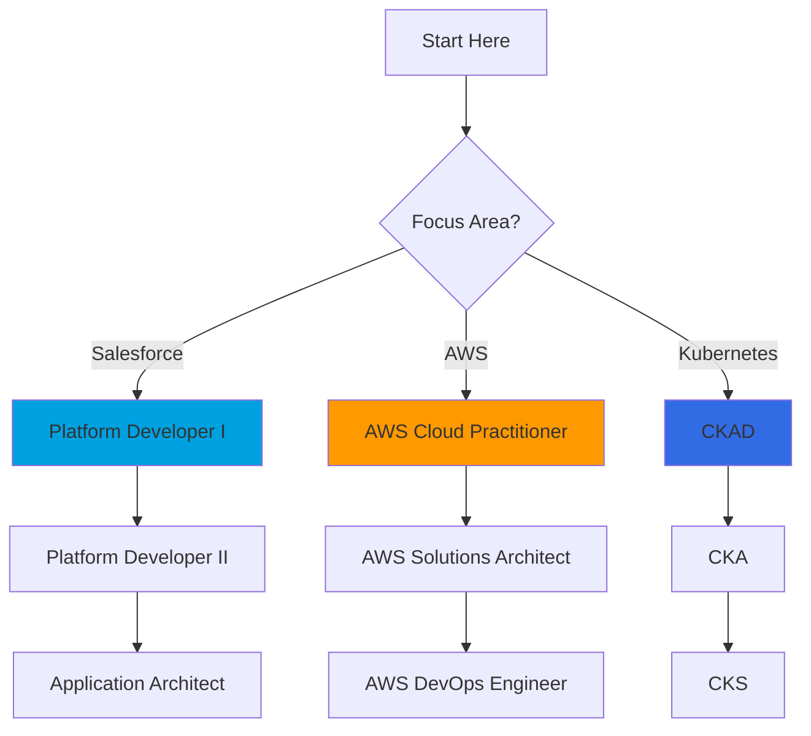

# Certification Prep Guide

**Purpose**: Comprehensive guide to DevOps-related certifications that boost your career, with study plans and resources.

---

## Certification Roadmap



---

## Salesforce Certifications

### Platform Developer I

**Why Get It**:
- Foundation for Salesforce development
- Required for many DevOps roles
- Demonstrates Apex and LWC proficiency

**Exam Details**:
- Questions: 60 multiple choice
- Time: 105 minutes
- Passing score: 68%
- Cost: $200 USD
- Prerequisites: None

**Topics Covered**:
1. Developer Fundamentals (23%)
   - Understand multi-tenant concepts
   - Design apps using Salesforce features
   - Describe customization options

2. Process Automation (30%)
   - Flows, Process Builder
   - Approval processes
   - Scheduled actions

3. User Interface (25%)
   - Lightning Web Components
   - Visualforce basics
   - Mobile considerations

4. Testing, Debugging, Deployment (22%)
   - Apex test classes
   - Debugging techniques
   - Deployment methods

**Study Plan (8 Weeks)**:

```markdown
Week 1-2: Developer Fundamentals
- Complete Trailhead: Apex Basics & Database
- Build: 3 simple Apex classes with tests
- Practice: Governor limits exercises

Week 3-4: Process Automation
- Complete Trailhead: Flow Basics
- Build: 2 screen flows, 2 record-triggered flows
- Practice: Approval process scenarios

Week 5-6: User Interface
- Complete Trailhead: Lightning Web Components
- Build: 3 LWC components
- Practice: Aura vs LWC comparison

Week 7: Testing & Deployment
- Complete Trailhead: Testing & Debugging
- Build: Test classes for all previous work
- Practice: Change sets and packages

Week 8: Practice Exams
- Take 3 practice exams
- Review weak areas
- Schedule exam
```

**Resources**:
- Trailhead: [Platform Developer I Certification Path](https://trailhead.salesforce.com/credentials/platformdeveloperi)
- Study Guide: Official Salesforce Exam Guide
- Practice Exams: Focus on Force, Udemy
- Community: Salesforce Developer Forums

**DevOps Relevance**: ⭐⭐⭐⭐⭐
Essential for anyone working with Salesforce deployments.

---

### Platform Developer II

**Why Get It**:
- Advanced Apex programming
- Integration patterns
- Design best practices
- Required for architect track

**Exam Details**:
- Part 1: 60 multiple choice (68% to pass)
- Part 2: Proctored programming assignment
- Time: 3 hours for both parts
- Cost: $200 (Part 1) + $400 (Part 2)
- Prerequisites: Platform Developer I

**Topics Covered**:
1. Advanced Apex (38%)
   - Design patterns
   - Collections optimization
   - Batch, Queueable, Scheduled Apex
   - Platform events

2. Integration (23%)
   - REST and SOAP APIs
   - OAuth authentication
   - Callouts and external services
   - Middleware patterns

3. Data Modeling (13%)
   - Complex relationships
   - Schema design
   - Large data volumes
   - Data migration strategies

4. Testing & Debugging (16%)
   - Mock testing
   - Performance optimization
   - Debug log analysis

5. UI Development (10%)
   - Advanced LWC patterns
   - JavaScript optimization

**Study Plan (12 Weeks)**:

```markdown
Weeks 1-3: Advanced Apex
- Master design patterns (Singleton, Factory, Strategy)
- Build asynchronous processes
- Platform events implementation

Weeks 4-6: Integration
- Build REST API integration
- Implement OAuth flow
- Create middleware layer

Weeks 7-8: Data Modeling
- Design complex data model
- Handle large data volumes
- Migration scripts

Weeks 9-10: Testing & Advanced Topics
- Write comprehensive test suite
- Performance optimization
- Mock external services

Weeks 11-12: Practice
- Complete 5 programming assignments
- Take practice exam
- Review weak areas
```

**Resources**:
- Trailhead: Platform Developer II Certification Path
- Book: "Advanced Apex Programming" by Dan Appleman
- Practice: SuperBadge assignments
- Community: Salesforce Stack Exchange

**DevOps Relevance**: ⭐⭐⭐⭐
Advanced patterns used in enterprise DevOps implementations.

---

## AWS Certifications

### AWS Certified Cloud Practitioner

**Why Get It**:
- Foundation for AWS knowledge
- Understand cloud concepts
- Gateway to advanced AWS certs
- Shows cloud literacy

**Exam Details**:
- Questions: 65 multiple choice
- Time: 90 minutes
- Passing score: 700/1000
- Cost: $100 USD
- Prerequisites: None

**Topics Covered**:
1. Cloud Concepts (26%)
2. Security & Compliance (25%)
3. Technology (33%)
4. Billing & Pricing (16%)

**Study Plan (4 Weeks)**:

```markdown
Week 1: Cloud Concepts
- What is cloud computing
- AWS global infrastructure
- Cloud architecture principles

Week 2: Security & Compliance
- IAM (users, roles, policies)
- Security best practices
- Compliance programs

Week 3: Technology
- Compute (EC2, Lambda, ECS)
- Storage (S3, EBS)
- Databases (RDS, DynamoDB)
- Networking (VPC, CloudFront)

Week 4: Billing & Practice
- Pricing models
- Cost optimization
- Take practice exams
```

**Resources**:
- AWS Training: Free digital training
- Practice: AWS Skill Builder
- YouTube: freeCodeCamp AWS course
- Community: AWS subreddit

**DevOps Relevance**: ⭐⭐⭐
Useful for hosting Salesforce CI/CD infrastructure.

---

### AWS Certified DevOps Engineer - Professional

**Why Get It**:
- Industry-recognized DevOps expertise
- Covers CI/CD, IaC, monitoring
- High salary premium
- Required for many senior roles

**Exam Details**:
- Questions: 75 multiple choice/multiple select
- Time: 180 minutes
- Passing score: 750/1000
- Cost: $300 USD
- Prerequisites: Solutions Architect Associate OR Developer Associate

**Topics Covered**:
1. SDLC Automation (22%)
   - CI/CD pipelines
   - CodePipeline, CodeBuild, CodeDeploy
   - Blue-green deployments
   - Testing automation

2. Configuration Management (19%)
   - CloudFormation
   - OpsWorks
   - Systems Manager
   - Parameter Store

3. Monitoring & Logging (15%)
   - CloudWatch
   - X-Ray
   - CloudTrail
   - Log aggregation

4. Policies & Standards (10%)
   - Compliance automation
   - Security scanning
   - Governance

5. Incident Response (18%)
   - Auto-recovery
   - Disaster recovery
   - Rollback strategies

6. High Availability (16%)
   - Multi-region architectures
   - Fault tolerance
   - Load balancing

**Study Plan (16 Weeks)**:

```markdown
Weeks 1-4: CI/CD Fundamentals
- Build CodePipeline for sample app
- Implement CodeBuild with tests
- Create CodeDeploy blue-green deployment
- Hands-on: Deploy 5 different app types

Weeks 5-8: Infrastructure as Code
- Master CloudFormation
- Terraform deep dive
- Create reusable templates
- Hands-on: Deploy complete infrastructure

Weeks 9-12: Monitoring & Security
- Implement comprehensive CloudWatch dashboards
- X-Ray distributed tracing
- Security Hub automation
- Hands-on: Monitor 3 production systems

Weeks 13-15: Advanced Topics
- Multi-region deployment
- Disaster recovery automation
- Cost optimization
- Hands-on: Implement DR solution

Week 16: Exam Prep
- 5 practice exams
- Review all weak areas
- Exam day
```

**Resources**:
- A Cloud Guru: DevOps Engineer course
- Udemy: Stephane Maarek courses
- AWS Docs: Whitepapers on DevOps
- GitHub: Sample CloudFormation templates
- Practice: Tutorials Dojo practice exams

**DevOps Relevance**: ⭐⭐⭐⭐⭐
Directly applicable to running Salesforce DevOps infrastructure on AWS.

---

## Kubernetes Certifications

### Certified Kubernetes Application Developer (CKAD)

**Why Get It**:
- Practical, hands-on exam
- Shows container orchestration skills
- Relevant for scaling CI/CD
- Industry standard for K8s

**Exam Details**:
- Format: Performance-based (command line)
- Questions: 15-20 tasks
- Time: 2 hours
- Passing score: 66%
- Cost: $395 USD
- Prerequisites: None (but K8s experience recommended)

**Topics Covered**:
1. Application Design & Build (20%)
2. Application Deployment (20%)
3. Application Observability (18%)
4. Application Environment (16%)
5. Application Maintenance (26%)

**Study Plan (8 Weeks)**:

```markdown
Weeks 1-2: K8s Fundamentals
- Install minikube/kind locally
- Pods, Deployments, Services
- ConfigMaps, Secrets
- Daily: 1 hour hands-on practice

Weeks 3-4: Deployments & Scaling
- Rolling updates
- HPA (Horizontal Pod Autoscaler)
- Resource limits
- Liveness/Readiness probes
- Daily: Practice deployments

Weeks 5-6: Networking & Storage
- Services (ClusterIP, NodePort, LoadBalancer)
- Ingress
- PersistentVolumes
- StatefulSets
- Daily: Networking scenarios

Week 7: Observability & Troubleshooting
- Logs, metrics
- Debugging pods
- Performance tuning
- Daily: Troubleshooting scenarios

Week 8: Practice Exam
- Killer.sh practice exam (included with registration)
- Time yourself
- Review solutions
```

**Key Commands to Memorize**:

```bash
# Essential CKAD commands
kubectl run nginx --image=nginx
kubectl create deployment nginx --image=nginx
kubectl expose deployment nginx --port=80 --type=LoadBalancer
kubectl scale deployment nginx --replicas=3
kubectl set image deployment/nginx nginx=nginx:1.16
kubectl rollout status deployment/nginx
kubectl rollout undo deployment/nginx
kubectl get pods -o wide
kubectl logs pod-name
kubectl exec -it pod-name -- /bin/bash
kubectl apply -f manifest.yaml
kubectl delete -f manifest.yaml
kubectl get events --sort-by=.metadata.creationTimestamp
```

**Resources**:
- Killer.sh: Practice environment (2 sessions included)
- Udemy: Mumshad Mannambeth CKAD course
- GitHub: dgkanatsios/CKAD-exercises
- YouTube: TechWorld with Nana
- Practice: Daily K8s tasks

**DevOps Relevance**: ⭐⭐⭐⭐
Essential for running Salesforce CI/CD runners on Kubernetes.

---

### Certified Kubernetes Administrator (CKA)

**Why Get It**:
- Cluster administration skills
- Required for managing K8s infrastructure
- Higher salary than CKAD
- Foundation for CKS

**Topics Covered**:
1. Cluster Architecture (25%)
2. Workloads & Scheduling (15%)
3. Services & Networking (20%)
4. Storage (10%)
5. Troubleshooting (30%)

**Difference from CKAD**:
- CKA: Focus on cluster management, administration
- CKAD: Focus on application deployment, development

**DevOps Relevance**: ⭐⭐⭐⭐
Useful if you're managing K8s clusters for CI/CD infrastructure.

---

## Other Relevant Certifications

### GitHub Actions Certification

**Why Get It**:
- Shows GitHub Actions expertise
- Relevant for Salesforce CI/CD
- Free exam
- Quick to obtain (1-2 weeks study)

**How to Prepare**:
- Complete GitHub Learning Lab
- Build 5+ workflows
- Read Actions documentation
- Take practice exam

**DevOps Relevance**: ⭐⭐⭐⭐
Directly applicable to Salesforce CI/CD.

---

### HashiCorp Terraform Associate

**Why Get It**:
- IaC is critical for DevOps
- Industry-standard tool
- Shows automation skills
- Required by many companies

**Exam Details**:
- Questions: 57 multiple choice
- Time: 60 minutes
- Passing score: ~70%
- Cost: $70 USD
- Prerequisites: None

**Topics Covered**:
1. IaC concepts
2. Terraform basics
3. Terraform CLI
4. Modules
5. State management
6. Provider configuration

**Study Plan (6 Weeks)**:

```markdown
Week 1-2: Terraform Fundamentals
- Install Terraform
- Learn HCL syntax
- Create first infrastructure
- Complete HashiCorp tutorials

Week 3-4: Advanced Concepts
- Modules
- State management
- Workspaces
- Build 3 real projects

Week 5: Practice
- Review all concepts
- Take practice exams
- Build complex infrastructure

Week 6: Exam
- Final review
- Take exam
```

**DevOps Relevance**: ⭐⭐⭐⭐
Essential for provisioning CI/CD infrastructure.

---

## Certification Strategy by Career Stage

### Entry-Level DevOps Engineer

**Recommended Path**:
1. Platform Developer I (3 months)
2. AWS Cloud Practitioner (1 month)
3. GitHub Actions (1 week)

**Total time**: 4-5 months
**Total cost**: ~$300

**Expected salary bump**: +$10-15K

---

### Mid-Level DevOps Engineer

**Recommended Path**:
1. Platform Developer II (3 months)
2. AWS Solutions Architect Associate (2 months)
3. CKAD (2 months)

**Total time**: 7 months
**Total cost**: ~$1,000

**Expected salary bump**: +$20-30K

---

### Senior DevOps Engineer / Architect

**Recommended Path**:
1. Application Architect (4 months)
2. AWS DevOps Engineer Professional (4 months)
3. CKA (2 months)
4. Terraform Associate (1 month)

**Total time**: 11 months
**Total cost**: ~$1,500

**Expected salary bump**: +$30-50K

---

## Study Tips

### General Advice

1. **Hands-on over reading**: Do, don't just read
2. **Practice exams**: Take at least 3 before real exam
3. **Study groups**: Join study groups or forums
4. **Daily practice**: 1 hour daily better than 7 hours on weekend
5. **Real projects**: Build actual things, not just tutorials

### Time Management

```markdown
Best study schedule:
- Morning (30 min): Review flashcards
- Lunch (30 min): Watch tutorial video
- Evening (1 hour): Hands-on practice
- Weekend (3 hours): Project work
```

### Common Mistakes

1. ❌ Memorizing without understanding
2. ❌ Skipping hands-on practice
3. ❌ Not taking practice exams
4. ❌ Studying only theory
5. ❌ Waiting too long to schedule exam

### Exam Day Tips

1. ✅ Read questions carefully (especially negative questions)
2. ✅ Flag uncertain questions, come back later
3. ✅ Watch time (don't spend 10 min on one question)
4. ✅ Use process of elimination
5. ✅ Get good sleep the night before

---

## Certification ROI

| Certification | Study Time | Cost | Avg Salary Increase | ROI |
|---------------|------------|------|---------------------|-----|
| Platform Developer I | 150 hours | $200 | +$10K/year | 50x |
| Platform Developer II | 250 hours | $600 | +$15K/year | 25x |
| AWS DevOps Engineer | 300 hours | $600 | +$25K/year | 40x |
| CKAD | 150 hours | $395 | +$20K/year | 50x |
| CKA | 200 hours | $395 | +$25K/year | 60x |

*ROI = (Annual Salary Increase) / (Cost + Value of Study Time at $50/hour)*

---

## Employer Reimbursement

Many companies reimburse certification costs. **Ask before paying**!

**Typical policies**:
- Pass exam → Full reimbursement
- Fail exam → Pay yourself or 50% reimbursement
- Must stay with company for 1 year after passing

**How to ask**:
> "Hi [Manager], I'm interested in getting the [Certification Name] to improve my skills in [area]. Does our company have a certification reimbursement policy? This would help me contribute more effectively to [specific project]."

---

## Free Resources

- Trailhead (Salesforce): 100% free
- AWS Skill Builder: Free tier available
- Kubernetes documentation: Free
- YouTube: Free tutorials
- GitHub Learning Lab: Free
- Practice exams: Limited free options

**You can pass most exams with only free resources + exam fee.**

---

## Certification Maintenance

Most certifications require renewal:

| Certification | Validity | Renewal Method |
|---------------|----------|----------------|
| Platform Developer I | Never expires (but check version) | Optional: Release maintenance |
| Platform Developer II | Never expires | Optional: Release maintenance |
| AWS DevOps Engineer | 3 years | Re-take exam or earn 50 CE credits |
| CKAD/CKA | 3 years | Re-take exam |
| Terraform Associate | 2 years | Re-take exam |

---

## Which Certifications Matter for Interviews?

**Always mentioned in job postings**:
1. ✅ Platform Developer I/II
2. ✅ AWS DevOps Engineer
3. ✅ CKA/CKAD

**Nice to have**:
- AWS Solutions Architect
- Terraform Associate
- GitHub Actions

**Rarely required but impressive**:
- Application Architect
- CKS (Kubernetes Security)

**Verdict**: Certifications help get interviews, but hands-on experience gets you hired.

---

**Pro tip**: Don't collect certifications for the sake of it. Get certifications that directly improve your ability to do your job. One well-utilized certification is better than five that sit on your LinkedIn gathering dust.
