# Advanced DevOps Center Scenarios

## Learning Objective

Handle complex real-world DevOps Center challenges including merge conflicts, emergency hotfixes, large releases, and team collaboration.

## Scenario 1: Multiple Developers on Same Work Item

**Situation:** You're building a complex Customer Portal that requires multiple developers working simultaneously.

### Collaboration Flow


### Best Practices for Team Collaboration

#### 1. Communication is Key

**Before starting work:**
```
Slack Message to Team:
"Working on W-0001 Customer Portal
I'm building:
- Lightning Web Component for portal UI
- Contact search functionality

Available components for others:
- Apex controller (needs implementation)
- Test classes (needs implementation)
- Portal configuration (needs implementation)

Let's coordinate! 🚀"
```

#### 2. Frequent Syncing

**Sync every few hours:**
- DevOps Center → Work Item → "Sync"
- Pulls latest changes from other developers
- Deploys to your sandbox
- Prevents large conflicts

#### 3. Component Isolation

**Assign different components to different developers:**

| Developer | Components | Files |
|-----------|------------|-------|
| Dev 1 | Lightning UI | `lwc/customerPortal/**` |
| Dev 2 | Apex Controller | `classes/CustomerPortalController.cls` |
| Dev 3 | Test Classes | `classes/CustomerPortalControllerTest.cls` |
| Dev 4 | Configuration | Custom settings, permissions |

**Minimizes conflicts when different files are modified.**

#### 4. Small, Frequent Commits

```
✅ Good: Commit every 1-2 hours
"feat: Add customer search LWC component"

❌ Bad: Commit once at end of day
"feat: Everything for customer portal"
```

---

## Scenario 2: Merge Conflicts in DevOps Center

**Situation:** Two developers modify the same file. How do you resolve the conflict?

### Conflict Detection Flow

```mermaid
graph TD
    COMMIT[Developer commits changes]
    CONFLICT{Conflict<br/>Detected?}

    COMMIT --> CONFLICT

    CONFLICT -->|No conflicts| AUTO[✅ Auto-commit to Git]
    CONFLICT -->|Conflicts found| ALERT[⚠️ Alert Developer]

    ALERT --> OPTIONS[Resolution Options]

    OPTIONS --> OPT1[Option 1:<br/>Pull changes & reapply]
    OPTIONS --> OPT2[Option 2:<br/>Manual Git resolution]
    OPTIONS --> OPT3[Option 3:<br/>Coordinate with other dev]

    OPT1 --> RESOLVE1[Sync work item<br/>Reapply your changes<br/>Commit again]

    OPT2 --> RESOLVE2[Clone repo locally<br/>Resolve in VS Code<br/>Push resolution]

    OPT3 --> RESOLVE3[Talk to teammate<br/>Decide who keeps what<br/>One person commits]

    RESOLVE1 & RESOLVE2 & RESOLVE3 --> SUCCESS[✅ Conflict Resolved]

    style CONFLICT fill:#fff59d
    style ALERT fill:#ffab91
    style SUCCESS fill:#a5d6a7
```



### Example Conflict Scenario

**What happened:**
- Dev1 changes Account page layout (adds "Industry" field)
- Dev2 changes Account page layout (adds "Revenue" field)
- When Dev2 tries to commit, DevOps Center detects conflict

### Resolution Approach A: In DevOps Center

```
Step 1: DevOps Center shows conflict
"⚠️ Cannot commit: Conflicts detected with recent changes by Dev1"

Step 2: View what changed
Click "View Conflicts"
Shows: Account-Account Layout.layout-meta.xml
- Their changes: Added Industry field
- Your changes: Added Revenue field

Step 3: Sync work item
Click "Sync" to get Dev1's changes
Dev1's Industry field now appears in your sandbox

Step 4: Reapply your changes
Manually add Revenue field again in sandbox
Now layout has BOTH Industry and Revenue

Step 5: Commit again
Click "Commit Changes"
DevOps Center successfully commits (conflict resolved)
```

### Resolution Approach B: In VS Code (Advanced)

```bash
# Clone repository locally
git clone https://github.com/your-org/salesforce-australia-post-devops.git
cd salesforce-australia-post-devops

# Checkout feature branch
git checkout feature/W-0001

# Pull latest changes
git pull origin feature/W-0001

# Open conflicted file
code force-app/main/default/layouts/Account-Account\ Layout.layout-meta.xml

# You'll see conflict markers:
<<<<<<< HEAD
<layoutItems>
    <field>Industry</field>
</layoutItems>
=======
<layoutItems>
    <field>Revenue</field>
</layoutItems>
>>>>>>> feature/W-0001

# Resolve by keeping BOTH:
<layoutItems>
    <field>Industry</field>
</layoutItems>
<layoutItems>
    <field>Revenue</field>
</layoutItems>

# Add and commit resolution
git add .
git commit -m "merge: Resolve Account layout conflict - keep both fields"
git push origin feature/W-0001

# DevOps Center automatically syncs
```

### Prevention Tips

1. **Communicate before working on same files**
2. **Use component-based architecture** (LWC, separate Apex classes)
3. **Sync frequently** (multiple times per day)
4. **Small work items** (less chance of conflicts)

---

## Scenario 3: Emergency Hotfix (Skip Normal Pipeline)

**Situation:** Production bug! Validation rule blocking all Opportunity saves. Business is DOWN. You need to deploy immediately.

### Hotfix Workflow


### Step-by-Step Hotfix Process

#### 1. Identify Critical Bug

```
Issue: Production validation rule has syntax error
Impact: All Opportunity saves failing
Business Impact: Sales team completely blocked
Severity: P0 - Critical
ETA for fix: 15 minutes
```

#### 2. Create Hotfix Work Item

```
Type: Hotfix
Priority: Critical
Title: Fix Opportunity validation rule syntax error

Description:
Validation rule "Validate_Close_Date" has incorrect syntax:
ISBLANK(CloseDate) & Amount > 10000

Should be:
ISBLANK(CloseDate) && Amount > 10000

Impact: Blocking all Opportunity saves
Requires immediate production deployment
```

#### 3. Create Hotfix Branch

In DevOps Center:
- Work Item → "Start Hotfix"
- DevOps Center creates: `hotfix/W-0005-validation-fix`
- Branch created from current **Production** (not Dev)

#### 4. Fix in Hotfix Sandbox

```
Hotfix Sandbox (mirrors production exactly)

Setup → Object Manager → Opportunity
Validation Rules → Validate_Close_Date
Change: & to &&
Save

Test immediately:
1. Create test Opportunity
2. Set Amount > 10000
3. Leave CloseDate blank
4. Save - should show validation error (correct behavior)
5. Add CloseDate
6. Save - should succeed
```

#### 5. Fast-Track to Production

**NO Test, NO UAT - Emergency deployment:**

```
DevOps Center → Work Item W-0005
Click "Deploy to Production"

⚠️ Skip normal pipeline stages
Reason: Critical production bug
Approved by: VP Engineering (verbal approval)
Deployment window: NOW

Tests to run: RunLocalTests (faster than all tests)
Backup: Automatic via DevOps Center
Rollback plan: Revert to previous Git commit
```

#### 6. Verify Fix in Production

```
2:15 PM - Deployed successfully
2:16 PM - Test in Production:
  ✅ Create Opportunity with Amount > 10000, no CloseDate
  ✅ Validation error shows (correct)
  ✅ Add CloseDate and save
  ✅ Success!
2:17 PM - Monitor error logs
  ✅ No errors
2:18 PM - Business confirmation
  ✅ Sales team can create Opportunities again
```

#### 7. Backport to Lower Environments

**Important:** Keep all environments in sync

```
Deploy same fix to:
1. UAT Sandbox
2. Test Sandbox
3. Dev Sandbox

Why? Next time you deploy from Dev → Test → UAT → Prod,
the fix is already there (won't get overwritten)
```

#### 8. Post-Mortem

```
Root Cause Analysis:

What happened?
- Validation rule deployed with syntax error
- Error used single & instead of &&
- Passed validation because not all tests covered this scenario

Why did it reach production?
- Test coverage for validation rules insufficient
- Code review missed the syntax error

How to prevent?
1. Add specific test class for all validation rules
2. Update code review checklist
3. Add validation rule linting to CI pipeline
4. Require 2 reviewers for validation rule changes

Action items assigned with due dates
```

---

## Scenario 4: Large Release with Dependencies

**Situation:** Q1 Release with 10+ work items and complex dependencies.

### Large Release Architecture

```mermaid
graph TD
    RELEASE[Major Release: Q1 Features]

    subgraph "Work Items (10+)"
        WI1[W-001: New Dashboard]
        WI2[W-002: Apex Controller]
        WI3[W-003: Integration]
        WI4[W-004: New Object]
        WI5[W-005-010: More features...]
    end

    subgraph "Dependencies"
        WI4 -->|Requires| WI2
        WI1 -->|Uses| WI4
        WI3 -->|Needs| WI2
    end

    RELEASE --> COORD[Release Coordination]
    WI1 & WI2 & WI3 & WI4 & WI5 --> COORD

    COORD --> ORDER[Deploy Order:<br/>1. WI-004 (Object)<br/>2. WI-002 (Controller)<br/>3. WI-003 (Integration)<br/>4. WI-001 (Dashboard)<br/>5-10. Others]

    ORDER --> BUNDLE[Create Release Bundle<br/>(All work items together)]

    BUNDLE --> VALIDATE[Validate Complete Bundle]
    VALIDATE --> PROMOTE[Promote as One Package]
    PROMOTE --> VERIFY[Verify All Features Together]

    style RELEASE fill:#e3f2fd
    style COORD fill:#fff59d
    style BUNDLE fill:#c5e1a5
```

### Managing Large Releases

#### 1. Create Release Record

```
DevOps Center → Releases → New

Name: Q1 2025 Release
Target Date: March 31, 2025
Description: All Q1 features including:
- Customer Portal
- Enhanced reporting
- MuleSoft integration foundation
- Mobile app improvements

Work Items Included: W-001 through W-010 (10 items)
```

#### 2. Analyze Dependencies

```
Dependency Graph:

W-004 (Custom Object: Customer_Portal_User__c)
  ↓
W-002 (Apex Controller: CustomerPortalController)
  ↓
W-003 (Integration: Portal API Integration)
W-001 (Lightning Component: Portal Dashboard)
  ↓
W-005 through W-010 (Additional features)

Deploy Order: W-004 → W-002 → [W-001, W-003] → W-005-010
```

#### 3. Create Release Bundle

```
DevOps Center → Release: Q1 2025
Click "Create Release Bundle"

DevOps Center analyzes:
✅ 10 work items
✅ 45 metadata components
✅ 12 Apex classes
✅ 8 Lightning components
✅ 5 custom objects
✅ Deployment order resolved automatically

Bundle created: Q1-2025-Release-v1.0
```

#### 4. Staged Promotion Strategy

```
Week 1: Promote to Test
- Deploy all 10 work items together
- Run comprehensive test suite
- Integration testing (test features working together)
- Performance testing

Week 2: Promote to UAT
- Business validation of complete release
- User acceptance testing
- Train end users

Week 3: Deploy to Production
- Weekend deployment window
- Full team on standby
- Rollback plan ready
- Monitoring dashboard active
```

#### 5. Release Day Runbook

```
Q1 Release - Production Deployment Runbook

Pre-Deployment (T-24 hours):
□ All UAT sign-offs received
□ Production backup completed
□ Rollback plan documented and tested
□ Team availability confirmed
□ Stakeholders notified

Deployment (Sunday 2:00 AM):
□ T-0:00 - Begin deployment
□ T-0:05 - Monitor progress
□ T-0:30 - Deployment complete
□ T-0:35 - Smoke tests begin
□ T-1:00 - Full verification complete
□ T-1:15 - Stakeholder notification

Post-Deployment:
□ Monitor for 24 hours
□ Document any issues
□ Collect feedback
□ Close all work items
```

#### 6. Handling Partial Failures

**What if one feature fails during release?**


**Decision criteria:**
- Is the failing feature critical to release?
- Are other features dependent on it?
- Business impact of delay vs partial release?

---

## Scenario 5: DevOps Center + Custom CI/CD (Hybrid)

**Situation:** DevOps Center works great for standard Salesforce metadata, but you need custom automation for complex scenarios.

### Hybrid Architecture


### When to Use Hybrid Approach

**Use DevOps Center for:**
- Standard metadata deployments (fields, objects, layouts)
- Lightning components
- Flows and process automation
- Admin-led changes
- Teams learning DevOps

**Use Custom CI/CD for:**
- Data migration scripts
- External system integration
- MuleSoft deployments
- Performance testing
- Advanced security scanning
- Custom pre/post-deployment logic

### Implementation Example

**Scenario:** Customer Portal with both Salesforce metadata and custom data scripts.

#### DevOps Center handles:
```
- Lightning Web Components
- Apex Classes
- Custom Objects
- Page Layouts
- Permissions

Deployed via DevOps Center UI
```

#### Custom GitLab Pipeline handles:
```yaml
# .gitlab-ci.yml
stages:
  - pre-deploy
  - deploy-salesforce
  - post-deploy
  - verify

pre-deploy:
  script:
    - echo "Running pre-deployment checks"
    - node scripts/validate-dependencies.js
    - sfdx scanner:run --target "force-app/**/*.cls"

deploy-salesforce:
  script:
    - echo "DevOps Center handles this"
    - echo "Waiting for DevOps Center webhook..."

post-deploy:
  script:
    - echo "Running post-deployment tasks"
    - node scripts/migrate-portal-users.js
    - node scripts/seed-default-data.js
    - sfdx force:apex:execute -f scripts/setup-portal-settings.apex

verify:
  script:
    - echo "Running integration tests"
    - npm run test:integration
    - node scripts/performance-test.js
```

### Australia Post Example

```
As DevOps Lead, you implement:

Simple Changes (70%): DevOps Center
- Sales Cloud updates
- Service Cloud enhancements
- Admin configuration
- Lightning page updates

Complex Changes (30%): GitLab CI/CD
- MuleSoft API deployments
- Data Cloud configuration
- Agentforce model deployments
- Multi-system orchestration
- Performance testing

Both approaches share same Git repository
Both trackable in work item system
Both follow approval processes
```

---

## Quick Check

Before moving on, make sure you can answer:

1. **How do you handle merge conflicts in DevOps Center?**
   - Answer: Sync work item to pull latest changes, reapply your changes, commit again. Or resolve manually in VS Code and push.

2. **What's a hotfix workflow?**
   - Answer: Emergency process that skips normal Test/UAT stages to deploy critical fixes directly to production, then backport to lower environments.

3. **When would you use a hybrid approach?**
   - Answer: When you need DevOps Center's simplicity for standard deployments but also need custom automation for complex scenarios like data scripts or multi-system integration.

4. **How do you manage large releases with dependencies?**
   - Answer: Create release bundle with all work items, let DevOps Center analyze dependencies and deployment order, promote as one package through environments.

## Next Steps

You've mastered complex scenarios. Now let's learn how to make strategic decisions about which DevOps approach to use.

**Continue to:** [DevOps Decision Framework](./decision-framework.md)

## Additional Resources

- [Resolving Conflicts in DevOps Center](https://help.salesforce.com/s/articleView?id=sf.devops_center_resolve_conflicts.htm)
- [Emergency Deployments Best Practices](https://developer.salesforce.com/docs/atlas.en-us.devops_deploy_basics.meta/devops_deploy_basics/devops_deploy_emergency.htm)
- [Release Management Strategies](https://trailhead.salesforce.com/content/learn/modules/release-management)
