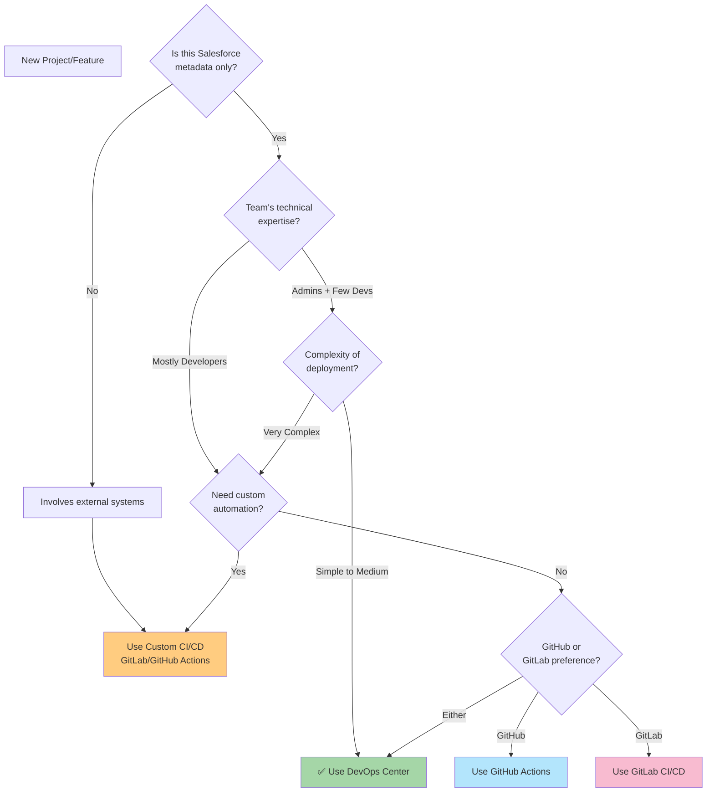

# DevOps Decision Framework (When to Use What)

## Learning Objective

Make informed decisions about which DevOps approach to use for different scenarios at Australia Post.

## The DevOps Leader's Decision Matrix

As DevOps Lead at Australia Post, you'll face this question constantly: **"Which tool should we use for this project?"** Here's how to decide.

### Comprehensive Decision Flowchart



## Decision Criteria Table

| Scenario | DevOps Center | GitHub Actions | GitLab CI/CD | Manual |
|----------|--------------|----------------|--------------|---------|
| **Simple field/object addition** | ⭐⭐⭐ Best | ⭐⭐ Good | ⭐⭐ Good | ⭐ Ok |
| **Flow or Lightning component** | ⭐⭐⭐ Best | ⭐⭐ Good | ⭐⭐ Good | ❌ No |
| **Complex Apex with dependencies** | ⭐⭐ Good | ⭐⭐⭐ Best | ⭐⭐⭐ Best | ❌ No |
| **MuleSoft integration deployment** | ❌ Can't do | ⭐⭐ Possible | ⭐⭐⭐ Best | ❌ No |
| **Data Cloud configuration** | ⭐ Limited | ⭐⭐ Good | ⭐⭐⭐ Best | ⭐ Ok |
| **Multi-org deployment (managed package)** | ⭐ Limited | ⭐⭐⭐ Best | ⭐⭐⭐ Best | ❌ No |
| **Emergency hotfix** | ⭐⭐⭐ Best | ⭐⭐ Good | ⭐⭐ Good | ⭐⭐ Ok |
| **Scheduled maintenance deployment** | ⭐⭐ Good | ⭐⭐⭐ Best | ⭐⭐⭐ Best | ❌ No |
| **Admin learning DevOps** | ⭐⭐⭐ Best | ⭐ Hard | ⭐ Hard | ⭐⭐ Familiar |

## Real-World Australia Post Scenarios

### Scenario A: Sales Cloud - Add Custom Field to Opportunity

**Context:**
- Simple metadata change
- Sales team (mostly admins)
- Need quick turnaround
- Low risk

**Decision: DevOps Center ✅**

**Why:**
- ✅ Simple point-and-click
- ✅ Admins can manage
- ✅ Version control included
- ✅ Fast setup
- ✅ Audit trail automatic

**Workflow:**
1. Create work item in DevOps Center
2. Admin adds field in Dev sandbox
3. Commit through DevOps Center
4. Promote: Dev → Test → Production
5. **Done in 2 days**

---

### Scenario B: MuleSoft Integration with Salesforce + SAP

**Context:**
- External systems involved
- Complex data transformation
- MuleSoft Anypoint platform
- Multiple environments
- Needs custom scripts

**Decision: GitLab CI/CD ✅**

**Why:**
- ✅ MuleSoft deployment automation
- ✅ Custom validation scripts
- ✅ Multi-system orchestration
- ✅ Flexible pipeline stages
- ✅ Already using GitLab (from job description)

**Workflow:**
1. Developers work in feature branches
2. GitLab pipeline:
   - Deploy MuleSoft API
   - Deploy Salesforce metadata
   - Run integration tests
   - Validate end-to-end flow
3. Custom deployment scripts
4. **Done in 1 week**

---

### Scenario C: Community Cloud Portal Development

**Context:**
- Lightning web components
- Apex controllers
- Custom themes
- Mix of developers and admins
- Moderate complexity

**Decision: Hybrid Approach ✅**
- DevOps Center for admins (page layouts, fields)
- GitHub Actions for developers (LWC, Apex)

**Why:**
- ✅ Empowers both teams
- ✅ Each team uses familiar tools
- ✅ Components integrate at Git level
- ✅ Flexibility for both groups

**Workflow:**
1. Admins: DevOps Center work items
2. Developers: GitHub feature branches
3. Both commit to same repository
4. Automated testing in GitHub Actions
5. Promotion through DevOps Center
6. **Done in 3 weeks**

---

### Scenario D: Agentforce Implementation (New Tech)

**Context:**
- Cutting edge Salesforce feature
- Not much documentation
- Experimentation needed
- Will evolve quickly
- Mix of AI configuration + code

**Decision: Start with DevOps Center, evolve to GitLab ✅**

**Phase 1 (Exploration):**
- DevOps Center for quick iterations
- Easy rollback during experiments
- Simple version control

**Phase 2 (Production):**
- Move to GitLab for:
  - Custom testing
  - AI model versioning
  - Complex orchestration
  - Integration with other systems

**Why phased:**
- ✅ Fast start (DevOps Center)
- ✅ Mature to sophisticated (GitLab)
- ✅ Learn before committing to complex setup

---

## The DevOps Lead's Checklist

For every project, ask these questions:

### 1. What's Being Deployed?

```
□ Metadata only? → DevOps Center
□ Code + external systems? → Custom CI/CD
□ Mix of both? → Hybrid approach
```

### 2. Who's Doing the Work?

```
□ Admins? → DevOps Center
□ Developers? → GitHub Actions / GitLab
□ Mixed team? → Hybrid approach
```

### 3. How Complex Is It?

```
□ Simple/Medium? → DevOps Center
□ Very complex? → Custom CI/CD
□ Evolving complexity? → Start simple, scale up
```

### 4. What's the Timeline?

```
□ Quick turnaround? → DevOps Center (faster setup)
□ Long-term project? → Custom CI/CD (more investment)
□ Iterative development? → DevOps Center first
```

### 5. What's Already in Place?

```
□ Nothing? → DevOps Center (fast start)
□ GitLab already set up? → Use it
□ GitHub preferred? → GitHub Actions
```

### 6. Future Scalability?

```
□ Will grow complex? → Start custom CI/CD
□ Stay simple? → DevOps Center is fine
□ Unknown? → DevOps Center, migrate later if needed
```

## Building Your DevOps Strategy (Australia Post Example)

As the NEW DevOps Lead, here's a recommended rollout:

### Month 1: Quick Wins

```
Goal: Build credibility and momentum

Actions:
✅ Set up DevOps Center
✅ Onboard 1 pilot team (Sales Cloud)
✅ Complete 5 successful deployments
✅ Document processes
✅ Gather feedback

Success Metrics:
- 5 deployments completed
- 0 production issues
- Team satisfaction: 8/10
```

### Month 2-3: Expand DevOps Center

```
Goal: Scale to all teams

Actions:
✅ Onboard remaining teams (Service Cloud, Marketing)
✅ Train admins and junior developers
✅ Create internal documentation
✅ Establish promotion policies
✅ Set up monitoring dashboards

Success Metrics:
- All teams using version control
- 50+ deployments completed
- Deployment time reduced 40%
```

### Month 4-6: Add GitLab for Complex Projects

```
Goal: Handle advanced scenarios

Actions:
✅ Set up GitLab runners
✅ Create pipeline templates
✅ MuleSoft integration first project
✅ Data Cloud automation
✅ Performance testing framework

Success Metrics:
- Complex deployments automated
- GitLab + DevOps Center working together
- Custom scripts repository created
```

### Month 7-12: Mature Practices

```
Goal: Optimize and innovate

Actions:
✅ Metrics dashboards (DORA metrics)
✅ Optimize pipeline performance
✅ Advanced features (blue-green deploys)
✅ AI-assisted testing (Agentforce)
✅ Cross-team collaboration patterns

Success Metrics:
- 80% reduction in deployment time
- 95% deployment success rate
- Lead time for changes: < 1 day
```

## Cost Comparison

| Approach | Setup Cost | Ongoing Cost | Team Effort |
|----------|------------|--------------|-------------|
| **DevOps Center** | Free (included) | Free | Low - Admin managed |
| **GitHub Actions** | Free tier | ~$200/month (medium team) | Medium - Some coding |
| **GitLab CI/CD** | Free tier or self-host | ~$500/month or hosting | High - DevOps skills |
| **Hybrid** | Initial setup time | Combined | High initially, low later |
| **Manual (Change Sets)** | Free | Free | Very High - Error-prone |

### ROI Calculation Example

**Before DevOps Center (Manual Change Sets):**
```
Deployments per month: 10
Time per deployment: 4 hours
Developer cost: $75/hour
Monthly cost: 10 × 4 × $75 = $3,000
Error rate: 40%
Rollback cost: 2 hours × $75 = $150 per incident
```

**After DevOps Center:**
```
Deployments per month: 25 (increased frequency)
Time per deployment: 1 hour
Developer cost: $75/hour
Monthly cost: 25 × 1 × $75 = $1,875
Error rate: 10%
Rollback cost: 15 minutes × $75 = $19 per incident

Savings: $3,000 - $1,875 = $1,125/month
Plus: Fewer errors, faster time to market
```

## Interview Answer Template

**When asked in interview: "How would you decide which DevOps tool to use?"**

### Good Answer

"I'd evaluate based on four key factors:

**1. Team Composition** - If mostly admins, I'd start with DevOps Center for ease of adoption. If mostly developers, custom CI/CD gives more control.

**2. Project Complexity** - Simple metadata changes work great in DevOps Center. Complex multi-system integrations need GitLab or GitHub Actions.

**3. Scalability Needs** - For a new DevOps practice at Australia Post, I'd start with DevOps Center for quick wins and team buy-in, then layer in custom CI/CD as needs grow.

**4. Existing Infrastructure** - The job description mentions GitLab, so I'd leverage that investment while also using DevOps Center where appropriate.

My strategy would be **pragmatic: right tool for the right job**, not one-size-fits-all."

### Even Better Answer (Shows Strategic Thinking)

"I'd take a phased approach aligned with Australia Post's maturity:

**Phase 1 (Months 1-3): Foundation**
- Start with DevOps Center for Sales and Service Cloud
- Quick wins build credibility
- Train teams on version control concepts

**Phase 2 (Months 4-6): Scale**
- Introduce GitLab for MuleSoft integrations
- Complex scenarios need custom automation
- Hybrid approach for medium complexity

**Phase 3 (Months 7-12): Optimize**
- Metrics-driven optimization
- Agentforce and Data Cloud automation
- Continuous improvement culture

This balances **immediate value** (DevOps Center) with **long-term scalability** (GitLab), while building team capabilities incrementally."

## Final Recommendation for Australia Post

### Primary: DevOps Center (70% of Deployments)

**Use for:**
- Sales Cloud changes
- Service Cloud updates
- Standard Community Cloud
- Admin-led projects
- Lightning page modifications
- Flow and Process Builder

**Why:**
- Team is new to DevOps
- Mix of admins and developers
- Need quick wins
- Easy to learn
- Built-in best practices

### Secondary: GitLab CI/CD (30% of Deployments)

**Use for:**
- MuleSoft integrations (mentioned in job description)
- Agentforce complex scenarios
- Data Cloud orchestration
- Developer-heavy projects
- Multi-system deployments
- Performance testing

**Why:**
- Already mentioned in job description
- Powerful and flexible
- Handles complex scenarios
- Enterprise-grade

### Success Metrics

Track these metrics quarterly:

```
Deployment Metrics:
✅ Deployment frequency: Weekly (from monthly)
✅ Lead time: Hours (from days)
✅ Failure rate: <15% (from 40%)
✅ MTTR (Mean Time to Recover): <1 hour

Team Metrics:
✅ Team satisfaction: >8/10
✅ Time saved per deployment: 3+ hours
✅ Teams using version control: 100%
✅ Automated test coverage: >75%

Business Metrics:
✅ Features delivered: 2x increase
✅ Production incidents: 50% reduction
✅ Time to market: 60% faster
✅ Developer productivity: 40% improvement
```

### Review and Adjust

**Quarterly review:**
- What's working?
- What's not?
- Where are bottlenecks?
- New tools needed?
- Team feedback?

**Adjust strategy** based on data, not assumptions.

## Quick Check

Before moving on, make sure you can answer:

1. **When would you choose DevOps Center over GitLab?**
   - Answer: For simple Salesforce metadata changes, admin-heavy teams, or when starting a new DevOps practice. Also when you need quick wins and easy adoption.

2. **How do you decide for a hybrid approach?**
   - Answer: When you have mixed team (admins + developers), moderate complexity, or need different tools for different parts of the system. Let each team use their strengths.

3. **What's your strategy for Australia Post's first 6 months?**
   - Answer: Start with DevOps Center for quick wins (Months 1-3), add GitLab for complex scenarios (Months 4-6), focus on team training and adoption throughout.

4. **How do you measure success?**
   - Answer: Track deployment frequency, lead time, failure rate, and team satisfaction. Adjust strategy based on data.

## Next Steps

You've completed the DevOps Center section! You now understand:
- ✅ What DevOps Center is and when to use it
- ✅ GitHub integration options
- ✅ Complete setup and workflow
- ✅ Advanced scenarios
- ✅ Strategic decision-making

**Return to:** [DevOps Center Section Index](./index.md)

Or explore related topics:
- [GitLab CI/CD Basics](../pipelines/gitlab-basics.md)
- [Interview Prep](../interview-prep/)
- [Building Pipelines](../pipelines/gitlab-basics.md)

## Additional Resources

- [Salesforce DevOps Center Documentation](https://help.salesforce.com/s/articleView?id=sf.devops_center.htm)
- [DevOps Decision Framework Template (Download)](https://trailhead.salesforce.com/sample-decision-framework)
- [DORA Metrics for Salesforce](https://developer.salesforce.com/blogs/2023/03/measuring-devops-success-with-dora-metrics)
- [Australia Post Tech Blog](https://techblog.auspost.com.au/) (if available)
