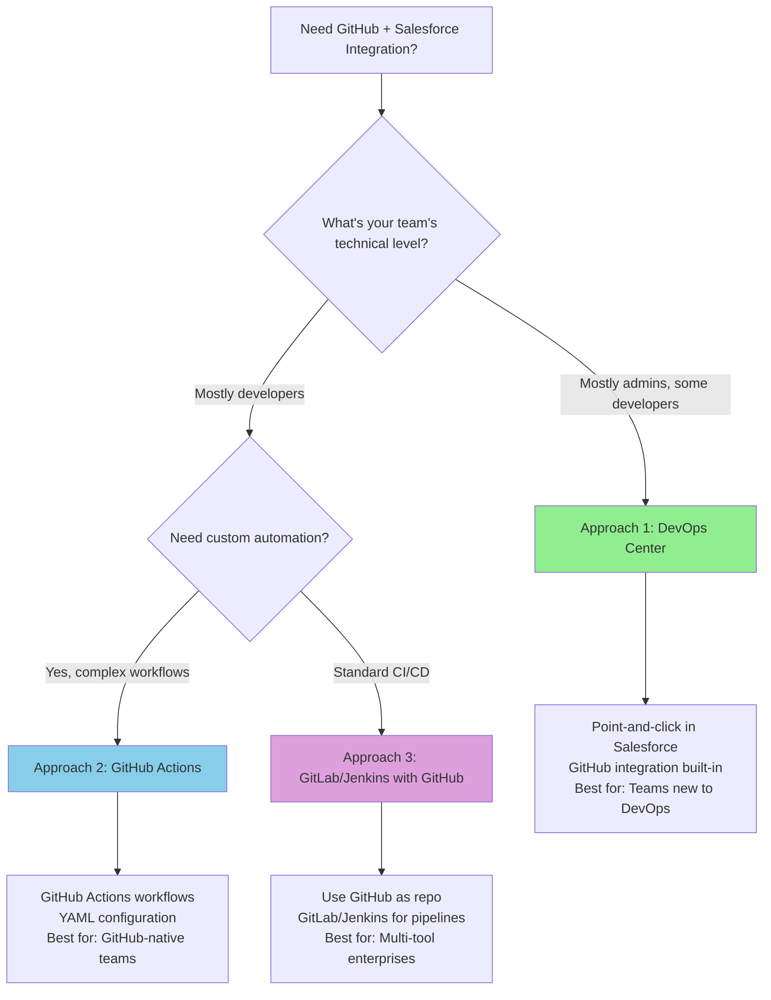
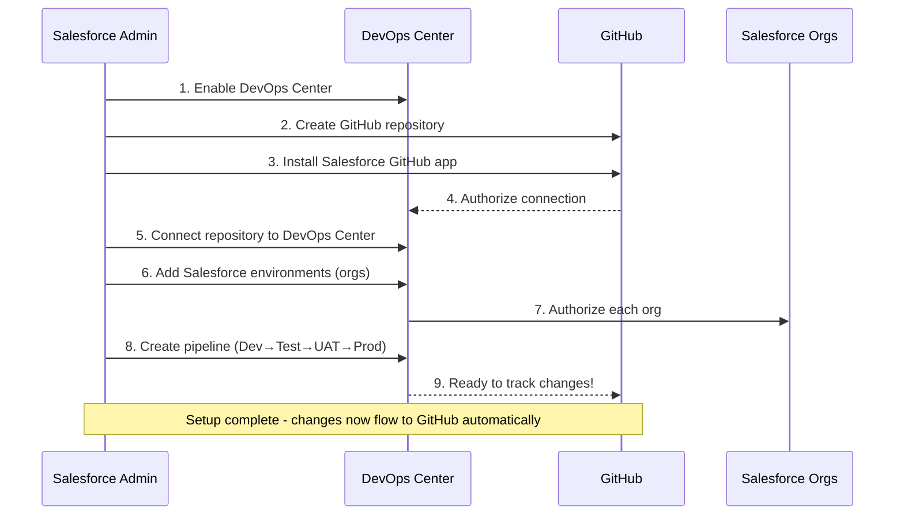
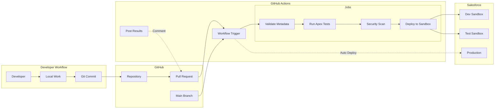
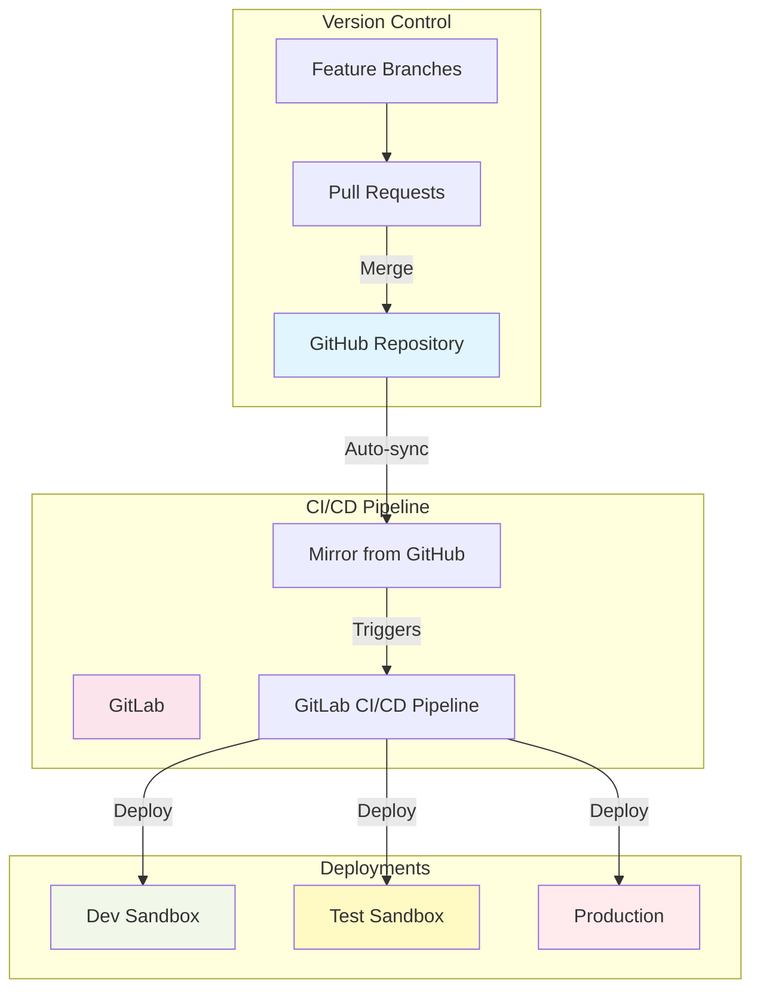

# GitHub Integration with Salesforce

## Learning Objective

Master GitHub integration patterns with Salesforce and understand which approach to use for different scenarios.

## Why GitHub + Salesforce?

GitHub is the world's largest code hosting platform. Integrating it with Salesforce gives you:

- ✅ **Version control for all metadata** - Track every change
- ✅ **Pull request workflows** - Code review built-in
- ✅ **Collaboration across teams** - Multiple developers, one codebase
- ✅ **Backup and disaster recovery** - Git is your backup
- ✅ **Integration with DevOps Center or custom CI/CD** - Flexible automation
- ✅ **Audit trail** - Who changed what, when, and why

## Three Integration Approaches

There are three main ways to integrate GitHub with Salesforce. Let's understand when to use each:

### Decision Flowchart



## Approach 1: GitHub + DevOps Center (Salesforce Native)

**Best for:** Admin-heavy teams, teams new to DevOps, simple to medium complexity

### Setup Flow



### Step-by-Step Setup

#### 1. Enable DevOps Center in Your Org

- Setup → DevOps Center → Enable
- Requires appropriate Salesforce edition (Enterprise, Unlimited, or Performance)

#### 2. Create GitHub Repository

```bash
# In GitHub
New Repository → salesforce-australia-post
Initialize with README
Add .gitignore (Salesforce template)
```

#### 3. Install Salesforce GitHub App

- GitHub Marketplace → Salesforce DevOps Center
- Install on your repository
- Authorize the app

#### 4. Connect in DevOps Center

- DevOps Center → Setup → Connect Repository
- Select GitHub
- Choose repository
- Authorize access

#### 5. Add Environments

- DevOps Center → Environments → Add Named Credential
- Authorize each Salesforce org (Dev, Test, UAT, Prod)

#### 6. Create Pipeline

- DevOps Center → Pipelines → New
- Define stages: Dev → Test → UAT → Production
- Set promotion policies

### Advantages

- ✅ **No YAML required** - Configure through UI
- ✅ **Built for Salesforce** - Understands metadata dependencies
- ✅ **Easy onboarding** - Admins can manage
- ✅ **Automatic Git operations** - No need to learn Git commands

### Limitations

- ❌ **Salesforce only** - Can't deploy external systems
- ❌ **Limited customization** - No custom scripts
- ❌ **Only GitHub/Bitbucket** - No GitLab support

## Approach 2: GitHub Actions (Code-First)

**Best for:** Developer-heavy teams, GitHub-native organizations, need custom automation

### GitHub Actions Workflow



### Sample GitHub Actions Workflow

Create `.github/workflows/salesforce-ci.yml`:

```yaml
name: Salesforce CI/CD

on:
  pull_request:
    branches: [ main ]
  push:
    branches: [ main ]

jobs:
  validate-and-test:
    runs-on: ubuntu-latest
    steps:
      # Checkout code
      - name: Checkout
        uses: actions/checkout@v3

      # Install Salesforce CLI
      - name: Install SFDX
        run: |
          npm install -g sfdx-cli

      # Authenticate to Salesforce
      - name: Authenticate
        run: |
          echo "${{ secrets.SFDX_AUTH_URL }}" > authfile
          sfdx auth:sfdxurl:store -f authfile -a target-org

      # Validate deployment
      - name: Validate Metadata
        run: |
          sfdx force:source:deploy -x manifest/package.xml --checkonly --testlevel RunLocalTests -u target-org

      # Run tests
      - name: Run Apex Tests
        run: |
          sfdx force:apex:test:run --wait 10 --resultformat human -u target-org

      # Security scan
      - name: Scan Code
        run: |
          sfdx scanner:run --target "force-app/**/*.cls" --format table

      # Comment on PR
      - name: Post Results
        uses: actions/github-script@v6
        if: always()
        with:
          script: |
            github.rest.issues.createComment({
              issue_number: context.issue.number,
              owner: context.repo.owner,
              repo: context.repo.repo,
              body: '✅ Validation passed! All tests green.'
            })

  deploy-to-production:
    runs-on: ubuntu-latest
    if: github.ref == 'refs/heads/main'
    needs: validate-and-test
    steps:
      - name: Checkout
        uses: actions/checkout@v3

      - name: Deploy to Production
        run: |
          echo "${{ secrets.PROD_AUTH_URL }}" > authfile
          sfdx auth:sfdxurl:store -f authfile -a prod-org
          sfdx force:source:deploy -x manifest/package.xml -u prod-org
```

### Advantages

- ✅ **Full control** - Custom logic, any script
- ✅ **GitHub native** - Deep integration
- ✅ **Free tier generous** - 2,000 minutes/month
- ✅ **Multi-platform** - Deploy to multiple systems

### Limitations

- ❌ **Requires coding** - YAML configuration
- ❌ **Manual setup** - More complex than DevOps Center
- ❌ **Git knowledge required** - Team needs Git skills

## Approach 3: GitHub + GitLab (Hybrid)

**Best for:** Enterprises with existing GitLab infrastructure, complex pipelines

### Why This Approach?

You use GitHub for version control (team is familiar with it) but GitLab for CI/CD (more powerful pipelines). Common in enterprises.

### Hybrid Architecture



### Setup

#### 1. Configure GitHub → GitLab Mirror

- GitLab → New Project → Import from GitHub
- Or: Set up repository mirroring

#### 2. GitLab CI/CD Triggers on Changes

- `.gitlab-ci.yml` in GitHub repo
- GitLab reads it when mirrored
- Pipelines run in GitLab

### Advantages

- ✅ **Best of both worlds** - GitHub UX + GitLab power
- ✅ **Leverage existing tools** - Use what teams know
- ✅ **GitLab features** - Advanced pipelines, built-in registry
- ✅ **Team flexibility** - Different teams, different tools

### Limitations

- ❌ **Complex setup** - Two systems to manage
- ❌ **Sync delays** - Mirror may lag
- ❌ **Additional maintenance** - More moving parts

## Comparison Table

| Aspect | DevOps Center + GitHub | GitHub Actions | GitHub + GitLab |
|--------|------------------------|----------------|-----------------|
| **Configuration** | 👆 UI-based | 💻 YAML in repo | 💻 YAML in repo |
| **Learning Curve** | Easy | Medium | Hard |
| **Flexibility** | Limited | High | Very High |
| **Salesforce Integration** | Native | Manual setup | Manual setup |
| **Best For** | Admins, simple workflows | GitHub-native teams | Complex enterprises |
| **Cost** | Included | Free tier limited | Self-hosted option |
| **Custom Scripts** | ❌ No | ✅ Yes | ✅ Yes |
| **Multi-platform** | ❌ No | ✅ Yes | ✅ Yes |

## Acme Corp Consideration

Acme Corp likely uses GitLab (mentioned in job description). But GitHub might be used for:
- Open source contributions
- Specific project teams
- Acquisitions/subsidiaries using different tools

**As DevOps Lead, you need to support multiple approaches and know when to use each.**

## Authentication and Security

### GitHub App vs Personal Access Token

#### GitHub App (Recommended)


**Advantages:**
- ✅ Org-level installation
- ✅ Fine-grained permissions
- ✅ Doesn't expire with user accounts
- ✅ Audit trail of app actions

#### Personal Access Token (Legacy)


**Disadvantages:**
- ❌ Tied to user account
- ❌ Broader permissions
- ❌ Expires and needs renewal
- ❌ User leaves = broken integration

### Securing Secrets

For GitHub Actions, store credentials in GitHub Secrets:

```bash
# Settings → Secrets → Actions → New repository secret
SFDX_AUTH_URL = force://PlatformCLI::5Aep861...@yourinstance.salesforce.com
PROD_AUTH_URL = force://PlatformCLI::5Aep861...@login.salesforce.com
```

Never commit credentials to your repository!

## Quick Check

Before moving on, make sure you can answer:

1. **Name three ways to integrate GitHub with Salesforce**
   - Answer: DevOps Center, GitHub Actions, GitHub + GitLab hybrid

2. **When would you use GitHub Actions vs GitLab?**
   - Answer: GitHub Actions for GitHub-native teams; GitLab when you have existing GitLab infrastructure or need advanced pipeline features

3. **What's the advantage of the hybrid approach?**
   - Answer: Combines GitHub's UX for version control with GitLab's powerful CI/CD capabilities; good for enterprises with mixed tooling

4. **Why use a GitHub App instead of Personal Access Token?**
   - Answer: More secure, org-level, fine-grained permissions, doesn't depend on individual user accounts

## Next Steps

Now that you understand GitHub integration options, let's do a complete hands-on setup of DevOps Center.

**Continue to:** [Setting Up DevOps Center](./setup-walkthrough.md)

## Additional Resources

- [GitHub Marketplace: Salesforce DevOps Center](https://github.com/marketplace/salesforce-devops-center)
- [GitHub Actions for Salesforce](https://github.com/marketplace/actions/salesforce-cli-action)
- [Salesforce CLI GitHub Action](https://github.com/sfdx-actions/setup-sfdx)
