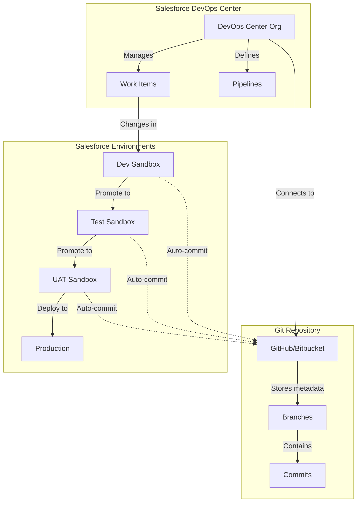
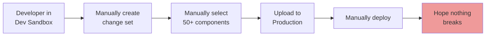
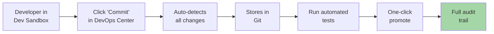

# Salesforce DevOps Center Overview

## Learning Objective

Understand Salesforce's native DevOps tool and when to use it vs traditional CI/CD.

## What is Salesforce DevOps Center?

"In 2022, Salesforce launched DevOps Center - a native, point-and-click tool built directly into Salesforce. Think of it as 'CI/CD without code' for teams who want DevOps practices but don't want to maintain GitLab pipelines."

## The Problem It Solves

Before DevOps Center, you had two options:

1. **Manual deployments with change sets** - painful, error-prone
2. **Custom CI/CD with GitLab/Jenkins** - powerful but requires DevOps expertise

DevOps Center gives you a middle ground - automated deployments with Git version control, but configured through Salesforce UI instead of YAML files.

## Comparison: Different Deployment Approaches

| Feature | Manual Change Sets | DevOps Center | Custom CI/CD (GitLab) |
|---------|-------------------|---------------|----------------------|
| Version Control | ❌ No | ✅ Yes (GitHub/Bitbucket) | ✅ Yes (any Git) |
| Automated Testing | ❌ Manual | ✅ Yes | ✅ Yes |
| Pipeline Configuration | N/A | 👆 Point-and-click | 💻 Code (.gitlab-ci.yml) |
| Deployment Automation | ❌ Manual | ✅ Yes | ✅ Yes |
| Learning Curve | Easy | Medium | Hard |
| Flexibility | Low | Medium | Very High |
| Cost | Free | Included in some editions | Self-managed |
| Custom Scripts | ❌ No | ❌ Limited | ✅ Full control |
| Rollback Capability | ⚠️ Manual | ✅ Git-based | ✅ Full control |

## Key Concepts

### 1. Work Items

A work item is a unit of work - like a user story or bug fix. DevOps Center tracks what changes belong to which work item.

### 2. Pipelines

Not the GitLab kind - these are visual deployment paths showing how changes flow from Dev → Test → UAT → Production.

### 3. Environments

Your Salesforce orgs connected to DevOps Center (dev sandboxes, UAT, production).

### 4. Change Bundles

A collection of metadata changes ready to deploy - like a package of everything that changed for a feature.

## DevOps Center Architecture

## When to Use DevOps Center

### ✅ Good Fit

- **Teams transitioning from manual change sets** - Easy step up from manual processes
- **Admin-heavy teams** - Less Apex development, more declarative customization
- **Want version control without learning Git deeply** - Point-and-click interface
- **Salesforce-only shop** - No multi-platform deployment needs
- **Medium complexity** - Not too simple, not too complex

### ❌ Not Ideal

- **Complex deployment scripts needed** - Custom logic required
- **Multi-platform deployments** - Salesforce + Heroku + external systems
- **Need custom pipeline logic** - Advanced automation requirements
- **Very large scale with complex orchestration** - Hundreds of components
- **Team already has strong CI/CD expertise** - Better to leverage existing skills

## Acme Corp Context

Given that Acme Corp is:
- Large enterprise with multiple teams
- Introducing new tech (MuleSoft, Agentforce, Data Cloud)
- Creating a NEW DevOps role (you)
- Likely has a mix of admin and developer work

**You'll probably use BOTH approaches:**
- DevOps Center for simpler, admin-focused changes
- GitLab CI/CD for complex integrations and custom orchestration

Your job as DevOps Lead is to decide which tool for which use case.

## Real-World Benefits

### Version Control Without Git Complexity

"Your admin team doesn't need to learn `git push` and `git merge`. They click 'Commit Changes' in DevOps Center, and it handles Git automatically."

### Audit Trail Built-In

"Every change is tracked:
- Who made it
- When it was made
- What work item it's associated with
- Which environments it's deployed to"

### Simplified Rollbacks

"Made a mistake? DevOps Center can roll back to any previous commit through the UI. No need to understand Git revert commands."

### Promotes Best Practices

"DevOps Center enforces:
- Feature branching
- Code review workflows
- Promotion through environments
- Testing before production"

## DevOps Center vs Manual Change Sets

### The Old Way (Change Sets)

**Problems:**
- ❌ Easy to forget components
- ❌ No version control
- ❌ No way to track who changed what
- ❌ Difficult rollbacks
- ❌ No automated testing

### The New Way (DevOps Center)

**Benefits:**
- ✅ Auto-detects all changes
- ✅ Full version history in Git
- ✅ Clear audit trail
- ✅ Easy rollbacks
- ✅ Automated testing

## Quick Check

Before moving on, make sure you can answer:

1. **What's the main advantage of DevOps Center over change sets?**
   - Answer: Automated version control with Git, without requiring deep Git knowledge

2. **When would you choose GitLab CI/CD over DevOps Center?**
   - Answer: Complex deployments involving multiple systems, custom scripts, or when team already has CI/CD expertise

3. **What Git providers work with DevOps Center?**
   - Answer: GitHub and Bitbucket

4. **Can DevOps Center handle MuleSoft deployments?**
   - Answer: No, you'd need custom CI/CD for multi-platform deployments

## Next Steps

Now that you understand what DevOps Center is and when to use it, let's dive into the GitHub integration that powers it.

**Continue to:** [GitHub Integration with Salesforce](./github-integration.md)

## Additional Resources

- [Salesforce DevOps Center Documentation](https://developer.salesforce.com/docs/atlas.en-us.devops_center.meta/devops_center/devops_center_intro.htm)
- [DevOps Center Trailhead Module](https://trailhead.salesforce.com/content/learn/modules/devops-center-quick-look)
- [DevOps Center Setup Guide](./setup-walkthrough.md)
