# Setting Up DevOps Center (Complete Walkthrough)

## Learning Objective

Complete hands-on setup of Salesforce DevOps Center from scratch - you'll have a fully functioning DevOps pipeline in 30 minutes.

## Prerequisites Checklist

Before you start, make sure you have:

- [ ] Salesforce org with DevOps Center enabled (Enterprise, Unlimited, or Performance Edition)
- [ ] GitHub account (or Bitbucket)
- [ ] At least 2 Salesforce sandboxes (Dev and Test minimum)
- [ ] Production org access
- [ ] System Administrator permissions in all orgs
- [ ] 30 minutes of uninterrupted time

## Complete Setup Flow (30 Minutes)

### High-Level Setup Sequence

```mermaid
sequenceDiagram
    participant You as You (Admin)
    participant Setup as Salesforce Setup
    participant DC as DevOps Center
    participant GH as GitHub
    participant Dev as Dev Sandbox
    participant Test as Test Sandbox
    participant Prod as Production

    Note over You,Prod: Phase 1: Enable DevOps Center
    You->>Setup: Navigate to Setup
    You->>Setup: Search "DevOps Center"
    Setup->>DC: Enable DevOps Center
    DC-->>You: DevOps Center App Available

    Note over You,Prod: Phase 2: GitHub Setup
    You->>GH: Create new repository
    GH-->>You: Repository created
    You->>GH: Add .gitignore (Salesforce)
    You->>GH: Install Salesforce app
    GH-->>DC: App installed

    Note over You,Prod: Phase 3: Connect Repository
    You->>DC: Open DevOps Center app
    You->>DC: Connect Repository
    DC->>GH: Request authorization
    GH-->>You: Authorize?
    You->>GH: Approve
    GH-->>DC: Connection established

    Note over You,Prod: Phase 4: Add Environments
    You->>DC: Add Dev environment
    DC->>Dev: Request authorization
    Dev-->>DC: Authorized

    You->>DC: Add Test environment
    DC->>Test: Request authorization
    Test-->>DC: Authorized

    You->>DC: Add Production environment
    DC->>Prod: Request authorization
    Prod-->>DC: Authorized

    Note over You,Prod: Phase 5: Create Pipeline
    You->>DC: Create new pipeline
    You->>DC: Define stages: Dev→Test→Prod
    You->>DC: Set promotion policies
    DC-->>You: Pipeline ready!

    Note over You,Prod: Setup Complete ✅
```



## PHASE 1: Enable DevOps Center (5 Minutes)

### Step 1: Log into Your Salesforce Org

Log into your Salesforce org (Production or Developer Edition with DevOps Center).

### Step 2: Navigate to Setup

Click gear icon (⚙️) → Setup

### Step 3: Search for "DevOps Center"

Quick Find box → Type "DevOps Center" → Click "DevOps Center Settings"

### Step 4: Enable DevOps Center

1. Toggle "Enable DevOps Center" to **ON**
2. Accept terms of service
3. Click **Save**

### Step 5: Verify Installation

1. App Launcher (9 dots) → Search "DevOps Center"
2. Open DevOps Center app
3. You should see welcome screen

**You'll see the DevOps Center welcome screen with options to:**
- Connect Repository
- Add Environments
- Create Pipeline
- View Documentation

### Troubleshooting

**Problem:** "DevOps Center is not available for your organization"

**Solution:** Check your Salesforce edition. DevOps Center requires:
- Enterprise Edition
- Unlimited Edition
- Performance Edition

If you have the right edition but still don't see it, contact Salesforce Support to enable it.

---

## PHASE 2: Create GitHub Repository (5 Minutes)

### Step 1: Go to GitHub

Navigate to [github.com](https://github.com) and sign in (or create account).

### Step 2: Create New Repository

1. Click green **"New"** button
2. Fill in repository details:
   - **Repository name:** `salesforce-australia-post-devops`
   - **Description:** "Salesforce DevOps Center managed repository"
   - **Visibility:** Private (recommended for production)
   - ✅ **Add README**
   - ✅ **Add .gitignore** → Select **"Salesforce"** template
   - **License:** None (or choose based on your needs)
3. Click **"Create repository"**

### Step 3: What the .gitignore Does

The Salesforce .gitignore tells Git to ignore files that shouldn't be version controlled:

```gitignore
# Salesforce cache
.sfdx/
.localdevserver/
deploy-options.json

# LWC Jest
**/__tests__/**

# Logs
*.log
.sf/

# IDE
.idea/
*.iml
.vscode/
*.swp

# Credentials
config/local.json
```

### Step 4: Install Salesforce DevOps Center GitHub App

1. Go to **GitHub Marketplace**
2. Search **"Salesforce DevOps Center"**
3. Click **"Install"**
4. Select your repository
5. Click **"Install & Authorize"**
6. You'll be redirected to Salesforce

**Important:** The GitHub App provides secure, fine-grained access. Don't use personal access tokens.

---

## PHASE 3: Connect Repository to DevOps Center (5 Minutes)

### Repository Connection Flow

```mermaid
graph TD
    START[DevOps Center]
    CONNECT[Click 'Connect Repository']
    CHOOSE[Choose Git Provider]
    AUTH[Authorize GitHub]
    SELECT[Select Repository]
    VERIFY[Verify Connection]
    DONE[✅ Repository Connected]

    START --> CONNECT
    CONNECT --> CHOOSE
    CHOOSE --> AUTH
    AUTH --> SELECT
    SELECT --> VERIFY
    VERIFY --> DONE

    style DONE fill:#a5d6a7
```



### Step 1: Open DevOps Center App

In Salesforce, open DevOps Center from the App Launcher.

### Step 2: Click "Connect Repository"

You'll see a button to connect your first repository.

### Step 3: Choose Git Provider

- Select **"GitHub"**
- (Or Bitbucket if that's what you're using)

### Step 4: Authorize Connection

1. Click **"Authorize GitHub"**
2. GitHub will ask for permissions
3. Click **"Authorize"** to allow DevOps Center to access your repos

**Permissions requested:**
- Read repository contents
- Write commits
- Create branches
- Read/write pull requests

### Step 5: Select Repository

1. From dropdown, choose `salesforce-australia-post-devops`
2. Click **"Connect"**

### Step 6: Verify Connection

You should see: **"✅ Repository connected successfully"**

The repository now shows in DevOps Center with:
- Repository name
- Last sync time
- Connection status

---

## PHASE 4: Add Salesforce Environments (10 Minutes)

### Environment Setup Architecture

```mermaid
graph TD
    DC[DevOps Center]

    subgraph "Environments to Connect"
        DEV[Dev Sandbox<br/>devbox@company.com.dev]
        TEST[Test Sandbox<br/>testbox@company.com.test]
        UAT[UAT Sandbox<br/>uat@company.com.uat]
        PROD[Production<br/>admin@company.com]
    end

    DC -->|Named Credential| DEV
    DC -->|Named Credential| TEST
    DC -->|Named Credential| UAT
    DC -->|Named Credential| PROD

    DEV -.->|Promote| TEST
    TEST -.->|Promote| UAT
    UAT -.->|Deploy| PROD

    style DEV fill:#c8e6c9
    style TEST fill:#fff9c4
    style UAT fill:#ffcc80
    style PROD fill:#ef9a9a
```

### Adding Each Environment

You'll repeat these steps for each environment (Dev, Test, UAT, Production).

### Step 1: Navigate to Environments

In DevOps Center:
1. Click **"Environments"** tab
2. Click **"Add Environment"**

### Step 2: Configure Named Credential

1. **Environment Name:** "Dev Sandbox" (descriptive name)
2. **Environment Type:** "Sandbox - Developer"
3. Click **"Create Named Credential"**

### Step 3: Authorize the Org

1. You'll be redirected to Salesforce login
2. **Log in to the Dev Sandbox** (use the sandbox-specific username)
3. Click **"Allow"** to authorize DevOps Center
4. You'll be redirected back to DevOps Center

### Step 4: Configure Environment Details

1. **Stage:** Select "Development"
2. **Description:** "Developer sandbox for feature development"
3. **Is Production:** ❌ No
4. Click **"Save"**

### Step 5: Repeat for Other Environments

#### Test Sandbox

- **Name:** "Test Sandbox"
- **Type:** "Sandbox - Test"
- **Stage:** "Testing"
- **Description:** "QA testing environment"

#### UAT Sandbox

- **Name:** "UAT Sandbox"
- **Type:** "Sandbox - Staging"
- **Stage:** "Staging"
- **Description:** "User acceptance testing environment"

#### Production

- **Name:** "Production"
- **Type:** "Production"
- **Stage:** "Production"
- **Description:** "Live production environment"
- **Is Production:** ✅ Yes

### Environment Connection Summary

After completing all environments, verify:

| Environment | Status | Stage | Last Connected |
|-------------|--------|-------|----------------|
| Dev Sandbox | ✅ Connected | Development | Just now |
| Test Sandbox | ✅ Connected | Testing | Just now |
| UAT Sandbox | ✅ Connected | Staging | Just now |
| Production | ✅ Connected | Production | Just now |

### Troubleshooting Common Issues

#### ❌ "Unable to authorize org"

**Possible causes:**
- Not a System Administrator in that org
- Sandbox expired
- Wrong username/password

**Solution:**
- Verify you have System Administrator profile
- Check sandbox is active
- Reset password if needed

#### ❌ "Named Credential failed"

**Possible causes:**
- My Domain not set up
- OAuth settings incorrect

**Solution:**
- Verify My Domain is deployed in target org
- Check Setup → Named Credentials in DevOps Center org

#### ❌ "Connection timeout"

**Possible causes:**
- Network issues
- IP restrictions

**Solution:**
- Check your network connection
- Verify IP restrictions allow connection

---

## PHASE 5: Create Your First Pipeline (5 Minutes)

### Pipeline Architecture


### Step 1: Navigate to Pipelines

In DevOps Center:
1. Click **"Pipelines"** tab
2. Click **"New Pipeline"**

### Step 2: Configure Pipeline Basics

1. **Pipeline Name:** "Main Deployment Pipeline"
2. **Description:** "Dev → Test → UAT → Production flow"
3. Click **"Next"**

### Step 3: Add Stages (in order)

#### Stage 1: Dev Sandbox (Development)

- **Environment:** Dev Sandbox
- **Stage Name:** "Development"
- **Auto-promote to next:** ❌ No (requires review)
- **Run tests:** ✅ Yes (local tests)

#### Stage 2: Test Sandbox (Testing)

- **Environment:** Test Sandbox
- **Stage Name:** "Testing"
- **Auto-promote to next:** ❌ No (requires QA sign-off)
- **Run tests:** ✅ Yes (all tests)
- **Required approvers:** 1

#### Stage 3: UAT Sandbox (Staging)

- **Environment:** UAT Sandbox
- **Stage Name:** "Staging"
- **Auto-promote to next:** ❌ No (requires business approval)
- **Run tests:** ✅ Yes (all tests)
- **Required approvers:** 2 (QA + Business user)

#### Stage 4: Production

- **Environment:** Production
- **Stage Name:** "Production"
- **Run tests:** ✅ Yes (all tests)
- **Required approvers:** 2 (DevOps Lead + Release Manager)
- **Rollback enabled:** ✅ Yes

### Step 4: Set Promotion Policies

**Policy settings:**
- ✅ **Require work item validation** - All changes must be linked to work item
- ✅ **Run tests before promotion** - Tests must pass
- ✅ **Require code review** - At least 1 approval
- ❌ **Auto-promote on success** - Manual promotion only

### Step 5: Save Pipeline

Click **"Save"** - Pipeline is now active!

### Verification

Your pipeline should show:

```
Development → Testing → Staging → Production
```

With status indicators:
- 🟢 All environments connected
- 🟢 Git repository linked
- 🟢 Ready to accept work items

---

## Final Verification Checklist

After setup is complete, verify everything works:

### ✅ DevOps Center

- [ ] DevOps Center app is accessible
- [ ] Can navigate between tabs (Work Items, Pipelines, Environments)
- [ ] No error messages

### ✅ GitHub Integration

- [ ] GitHub repository is connected
- [ ] Can see repository in DevOps Center
- [ ] Repository shows recent activity

### ✅ Environments

- [ ] All 4 environments are connected
- [ ] Each environment shows "✅ Connected" status
- [ ] Can click into each environment and see details

### ✅ Pipeline

- [ ] Pipeline is created with all 4 stages
- [ ] Each stage shows correct environment
- [ ] Promotion policies are configured

### ✅ Ready to Work

- [ ] Can create a new work item
- [ ] Can assign work item to yourself
- [ ] Can start development on work item

## What You've Accomplished

Congratulations! You've set up a complete DevOps pipeline with:

1. **Version Control** - GitHub tracking all changes
2. **Multiple Environments** - Dev, Test, UAT, Production
3. **Automated Workflow** - Clear promotion path
4. **Quality Gates** - Tests and approvals at each stage
5. **Audit Trail** - Full history of who changed what

**This is production-grade DevOps setup used by enterprise Salesforce teams worldwide.**

## Quick Check

Before moving on, make sure you can answer:

1. **What editions of Salesforce support DevOps Center?**
   - Answer: Enterprise, Unlimited, and Performance editions

2. **Why do you need a Named Credential for each org?**
   - Answer: To securely connect and authorize DevOps Center to deploy to each environment

3. **What's the minimum number of environments needed?**
   - Answer: Technically 2 (Dev and Production), but best practice is 4 (Dev, Test, UAT, Production)

4. **Can you skip the Test stage in the pipeline?**
   - Answer: Not recommended - each stage validates changes and catches issues before production

## Next Steps

Now that DevOps Center is set up, let's see it in action with a complete end-to-end workflow.

**Continue to:** [DevOps Center Workflow](./workflow-complete.md)

## Additional Resources

- [DevOps Center Setup Guide](https://help.salesforce.com/s/articleView?id=sf.devops_center_setup_workflow.htm)
- [Connecting Environments](https://help.salesforce.com/s/articleView?id=sf.devops_center_connect_environments.htm)
- [GitHub App Installation](https://github.com/apps/salesforce-devops-center)
