# DevOps Center Workflow (End-to-End)

## Learning Objective

Master the complete DevOps Center workflow from feature request to production deployment using a real-world example.

## The Complete Workflow

Let's walk through a real scenario that you'll face at Acme Corp:

**Feature Request:** The sales team needs a new custom field on the Opportunity object to track **"Competitor Name"**.

We'll take this from idea to production using DevOps Center.

### Complete Workflow Diagram


---

## STEP 1: Create Work Item (2 Minutes)

### Why Work Items Matter

Work items are the foundation of Dev Ops Center. They:
- Track what needs to be done
- Associate changes with requirements
- Provide audit trail
- Enable rollback if needed

### Creating the Work Item

In DevOps Center:

1. Click **"Work Items"** tab
2. Click **"New Work Item"**
3. Fill in details:

```
Title: Add Competitor Name field to Opportunity

Type: Feature

Priority: Medium

Description:
Sales team needs to track competitor names for reporting.

Requirements:
- Custom field: Competitor_Name__c
- Type: Text(100)
- Help Text: 'Name of primary competitor for this opportunity'
- Required: No
- Add to Opportunity page layout
- Add to relevant reports

Acceptance Criteria:
- Field visible on Opportunity page
- Users can enter competitor names
- Field appears in standard reports
- No impact to existing functionality
```

4. **Assign to:** Your name (or team member)
5. **Team:** Sales Cloud Team
6. **Sprint:** Current sprint
7. Click **"Save"**

### Result

- Work Item number created: **W-0001234**
- Status: **"New"**
- Visible to team in DevOps Center

---

## STEP 2: Start Development (5 Minutes)

### Development Sequence

```mermaid
sequenceDiagram
    participant Dev as Developer
    participant DC as DevOps Center
    participant GH as GitHub
    participant Sandbox as Dev Sandbox

    Dev->>DC: Select Work Item W-0001234
    Dev->>DC: Click "Start Development"

    DC->>GH: Create feature branch<br/>"feature/W-0001234-competitor-field"
    GH-->>DC: Branch created

    DC->>Sandbox: Link to Dev Sandbox
    DC-->>Dev: "Ready to develop!"

    Dev->>Sandbox: Create custom field<br/>Competitor_Name__c
    Dev->>Sandbox: Add to page layout
    Dev->>Sandbox: Test the field

    Dev->>DC: Click "Commit Changes"
    DC->>Sandbox: Retrieve metadata
    DC->>GH: Commit to feature branch
    GH-->>DC: Commit successful
    DC-->>Dev: "Changes committed ✅"
```



### Step-by-Step Development

#### 1. Open Work Item W-0001234

- In DevOps Center, find your work item
- Click **"Start Development"**
- Select environment: **"Dev Sandbox"**

#### 2. DevOps Center Automatically:

- Creates Git branch: `feature/W-0001234-competitor-field`
- Links branch to work item
- Opens your Dev Sandbox

#### 3. Make Changes in Dev Sandbox

**Create the custom field:**

```
Setup → Object Manager → Opportunity
Fields & Relationships → New

Field Type: Text
Field Label: Competitor Name
Field Name: Competitor_Name__c
Length: 100
Help Text: Name of primary competitor for this opportunity
Required: No
Default Value: (blank)

Click Next → Next → Save
```

**Add to page layout:**

```
Setup → Object Manager → Opportunity
Page Layouts → Opportunity Layout
Drag "Competitor Name" field to Opportunity Information section
Save
```

**Add field-level security:**

```
Setup → Object Manager → Opportunity
Fields & Relationships → Competitor_Name__c
Set Field-Level Security
✅ Visible for all profiles
Save
```

#### 4. Test Your Change

1. Navigate to any Opportunity
2. See the new "Competitor Name" field
3. Enter test data: "Competitor ABC"
4. Save
5. Verify field displays correctly
6. Test on mobile layout (if applicable)

#### 5. Commit Changes

Back in DevOps Center:

1. Click **"Commit Changes"** on work item
2. Add commit message:
   ```
   feat: Add Competitor Name field to Opportunity object

   - Created Competitor_Name__c text field (100 char)
   - Added to Opportunity page layout
   - Set field-level security for all profiles
   - Tested field functionality

   Work Item: W-0001234
   ```
3. Click **"Commit"**

#### 6. What Happens Behind the Scenes

DevOps Center automatically:
- Retrieves metadata from Dev Sandbox
- Detects what changed:
  - `objects/Opportunity/fields/Competitor_Name__c.field-meta.xml`
  - `layouts/Opportunity-Opportunity Layout.layout-meta.xml`
  - `profiles/*.profile-meta.xml`
- Commits to Git branch
- Updates work item status

---

## STEP 3: Promote to Test (5 Minutes)

### Creating the Change Bundle


### Step 1: Create Change Bundle

In DevOps Center → Work Item W-0001234:

1. Click **"Create Change Bundle"**
2. DevOps Center analyzes what changed:
   ```
   ✅ Custom Field: Competitor_Name__c
   ✅ Page Layout: Opportunity Layout
   ✅ Profiles: 5 profiles updated
   ```
3. Review the bundle - verify all necessary components included
4. Click **"Create Bundle"**

### Step 2: Validate Bundle

DevOps Center automatically runs validation:

```
⏳ Checking dependencies...
⏳ Validating metadata...
⏳ Running syntax checks...
✅ Validation Passed!

Results:
- 0 errors
- 0 warnings
- 3 components to deploy
- Estimated time: 2 minutes
```

### Step 3: Promote to Test

1. Click **"Promote"**
2. Select target: **"Test Sandbox"**
3. Options:
   - ✅ Run local tests
   - ❌ Run all tests (not needed for simple field)
   - ✅ Check only (do a test deployment first)
4. Add promotion notes:
   ```
   Ready for QA testing

   Test scenarios:
   - Verify field visible on Opportunity
   - Test data entry
   - Check field in reports
   - Verify mobile layout
   ```
5. Click **"Promote Now"**

### Step 4: Monitor Deployment

DevOps Center shows real-time progress:

```
⏳ Deploying metadata... (Step 1 of 4)
⏳ Running tests... (Step 2 of 4)
⏳ Updating permissions... (Step 3 of 4)
⏳ Verifying deployment... (Step 4 of 4)

✅ Deployed to Test Sandbox

Deployment Summary:
- Components Deployed: 3
- Tests Run: 12
- Tests Passed: 12
- Duration: 2 minutes 34 seconds
```

### Step 5: Notify QA Team

Send notification (Slack, email, or Chatter):

```
🚀 W-0001234 ready for testing

Feature: Competitor Name field on Opportunity
Environment: Test Sandbox
Test Instructions: [Link to test plan]
Expected completion: End of day

@qa-team
```

---

## STEP 4: QA Testing (Varies)

### QA Workflow


### Test Scenarios

QA Engineer tests:

**Scenario 1: Field Visibility**
```
✅ Navigate to Opportunity
✅ Verify "Competitor Name" field visible
✅ Field appears in correct section
✅ Help text displays correctly
```

**Scenario 2: Data Entry**
```
✅ Enter competitor name: "Competitor ABC"
✅ Save Opportunity
✅ Reload page - data persists
✅ Edit and update - works correctly
```

**Scenario 3: Field in Reports**
```
✅ Create new Opportunity report
✅ Add "Competitor Name" column
✅ Run report - field appears
✅ Filter by competitor name - works
```

**Scenario 4: Mobile Layout**
```
✅ Open Salesforce Mobile app
✅ Navigate to Opportunity
✅ Verify field visible on mobile
✅ Test data entry on mobile
```

**Scenario 5: Permissions**
```
✅ Test with different profiles
✅ Verify correct field-level security
✅ Standard users can see/edit
```

**Scenario 6: No Regressions**
```
✅ Existing Opportunity fields still work
✅ Opportunity save still functions
✅ Related lists unaffected
✅ Workflows still trigger
```

### QA Updates Work Item

In DevOps Center → Work Item W-0001234:

Add comment:
```
✅ QA Testing Complete

All test scenarios passed successfully:
- Field visibility: ✅ Pass
- Data entry: ✅ Pass
- Reports: ✅ Pass
- Mobile layout: ✅ Pass
- Permissions: ✅ Pass
- No regressions: ✅ Pass

Recommendation: Ready for UAT

Tested by: Jane Smith (QA Engineer)
Date: 2025-10-29
Environment: Test Sandbox
```

Change status to: **"Ready for UAT"**

---

## STEP 5: Promote to UAT (5 Minutes)

### UAT Promotion Flow


### Step 1: Business Approval

Sales Manager reviews:

```
Work Item: W-0001234
Feature: Competitor Name tracking
Business Value: Competitive analysis for sales reporting

Approved by: Michael Chen (Sales Manager)
Notes: This will help us analyze win/loss patterns
```

### Step 2: Promote to UAT

In DevOps Center:

1. Click **"Promote"**
2. Select target: **"UAT Sandbox"**
3. Options:
   - ✅ Run all tests (UAT requires comprehensive testing)
   - ✅ Generate release notes
4. Click **"Promote"**

### Step 3: UAT Testing

Business users validate with real-world scenarios:

**Sales Rep Tests:**
- Create opportunity for real customer
- Document actual competitor
- Verify field meets their needs

**Sales Manager Tests:**
- Run competitive analysis report
- Verify data quality
- Confirm meets requirements

### Step 4: UAT Sign-Off

Business users update work item:

```
✅ UAT Complete

Business validation successful:
- Sales reps can easily track competitors
- Field integrates well with workflow
- Reports provide needed insights
- Meets all acceptance criteria

Approved for Production by:
- Michael Chen (Sales Manager)
- Sarah Williams (VP of Sales)

Ready for production deployment
```

---

## STEP 6: Deploy to Production (10 Minutes)

### Production Deployment Flow


### Pre-Deployment Checklist

Before deploying to production:

```
Pre-Deployment Checklist for W-0001234

✅ All tests passed in UAT
✅ Business sign-off received (2 approvers)
✅ Production metadata backup completed
✅ Rollback plan documented
✅ DevOps Lead approval (you!)
✅ Release Manager approval
✅ Deployment window scheduled: Sunday 2:00 AM AEST
✅ Team availability confirmed
✅ Stakeholders notified
✅ Communication plan ready
```

### Schedule Deployment Window

For Acme Corp (large enterprise):

```
Deployment Window
Date: Sunday, November 3, 2025
Time: 2:00 AM - 4:00 AM AEST
Reason: Minimize business impact
Attendees:
- DevOps Lead (you)
- Release Manager
- On-call support engineer
```

Send notification:

```
Subject: Production Deployment - Competitor Name Field

Deployment scheduled for Sunday, November 3 at 2:00 AM AEST

What's being deployed:
- Work Item W-0001234: Competitor Name field on Opportunity

Impact: Low risk, new field only
Rollback: Available if needed
Expected duration: 15 minutes
Downtime: None expected

Point of contact: [Your name]
```

### Execute Deployment

At 2:00 AM Sunday:

1. **Log into DevOps Center**
2. Navigate to Work Item W-0001234
3. Click **"Deploy to Production"**
4. Confirm deployment:
   ```
   Deploy to: Production
   Run tests: ✅ All tests
   Test level: RunAllTestsInOrg
   Rollback on failure: ✅ Yes
   ```
5. Click **"Deploy Now"**

### Monitor Deployment

Watch real-time progress:

```
⏳ 2:01 AM - Deploying metadata...
⏳ 2:02 AM - Running Apex tests...
⏳ 2:05 AM - 150/243 tests completed...
⏳ 2:08 AM - All tests passed (243/243)
⏳ 2:09 AM - Updating permissions...
⏳ 2:10 AM - Verifying deployment...

✅ 2:11 AM - Deployment Successful!

Summary:
- Components Deployed: 3
- Tests Run: 243
- Tests Passed: 243 (100%)
- Test Coverage: 89%
- Duration: 11 minutes 34 seconds
- No errors or warnings
```

### Post-Deployment Verification

Immediately after deployment:

**Smoke Tests (5 minutes):**

```
✅ Log into Production
✅ Navigate to Opportunity
✅ Verify "Competitor Name" field visible
✅ Enter test data and save
✅ Check field in reports
✅ Verify existing functionality unchanged
✅ Check for any error logs
✅ Test critical user journeys
```

### Notify Stakeholders

Send success notification:

```
Subject: ✅ Deployment Complete - Competitor Name Field

The Competitor Name field is now live in Production!

Deployment Details:
- Work Item: W-0001234
- Deployed: November 3, 2:11 AM AEST
- Duration: 11 minutes
- Result: Success (no issues)
- Tests: 243/243 passed

What's New:
Sales reps can now track competitor names on Opportunities

Documentation: [Link to user guide]

Questions? Contact DevOps team

Thank you!
```

### Close Work Item

In DevOps Center:

1. Navigate to Work Item W-0001234
2. Add completion notes:
   ```
   ✅ Deployed to Production Successfully

   Deployment Date: November 3, 2025 at 2:11 AM AEST
   Result: Success
   Tests: 243/243 passed
   Verification: Complete
   Documentation: Updated

   Total Timeline:
   - Created: October 29
   - Development: October 29
   - Testing: October 30
   - UAT: October 31-November 1
   - Production: November 3

   No issues encountered. Feature working as expected.
   ```
3. Status: **"Completed"**
4. Click **"Close Work Item"**

---

## Complete Workflow Timeline

| Phase | Duration | Who | Outcome |
|-------|----------|-----|---------|
| Create Work Item | 2 minutes | Product Owner | W-0001234 created |
| Development | 30 minutes | Developer | Code committed to Git |
| Commit to Git | 2 minutes | DevOps Center | Auto-committed |
| Promote to Test | 5 minutes | Developer | Deployed to Test |
| QA Testing | 2 hours | QA Engineer | All tests passed |
| Promote to UAT | 5 minutes | Developer | Deployed to UAT |
| UAT Testing | 1 day | Business Users | Business approved |
| Production Deploy | 11 minutes | DevOps Lead (you!) | Live in Production |
| Verification | 15 minutes | Team | Success confirmed |
| **Total Elapsed** | **~5 days** | **Multiple roles** | **Feature live!** |

## Git Activity Behind the Scenes

While you're clicking in DevOps Center, Git is working:

```bash
# Work item started → Branch created
git checkout -b feature/W-0001234-competitor-field

# Developer commits changes → Auto commit
git add force-app/main/default/objects/Opportunity/fields/Competitor_Name__c.field-meta.xml
git add force-app/main/default/layouts/Opportunity-Opportunity\ Layout.layout-meta.xml
git commit -m "feat: Add Competitor Name field to Opportunity

- Created Competitor_Name__c text field (100 char)
- Added to Opportunity page layout
- Set field-level security

Work-Item: W-0001234"
git push origin feature/W-0001234-competitor-field

# Promoted to Test → Merge to test branch
git checkout test
git merge feature/W-0001234-competitor-field
git push origin test

# Promoted to UAT → Merge to uat branch
git checkout uat
git merge test
git push origin uat

# Deployed to Production → Merge to main
git checkout main
git merge uat
git tag v1.2.0-competitor-name
git push origin main --tags
```

**You don't write these commands - DevOps Center does it automatically!**

## Key Takeaways

1. **Work Items Track Everything** - Every change is traceable
2. **Automated Git Operations** - No manual Git commands needed
3. **Multiple Approval Gates** - QA, UAT, Production approvals
4. **Full Audit Trail** - Know who changed what, when, and why
5. **Easy Rollback** - Can revert to any previous version
6. **Team Collaboration** - Developers, QA, Business all involved
7. **Production-Grade Process** - Enterprise-quality deployment

## Quick Check

Before moving on, make sure you can answer:

1. **What happens when you click 'Start Development'?**
   - Answer: DevOps Center creates a Git feature branch and links it to the work item

2. **How do you promote a change from Test to UAT?**
   - Answer: Click "Promote", select UAT as target, choose test options, and click "Promote Now"

3. **What's a Change Bundle?**
   - Answer: A collection of metadata changes (fields, layouts, etc.) packaged together for deployment

4. **Why do we have multiple environments (Dev, Test, UAT, Prod)?**
   - Answer: Each environment provides a quality gate - catching issues before they reach production

## Next Steps

You've seen a simple change flow through the pipeline. Now let's explore complex scenarios like merge conflicts, hotfixes, and large releases.

**Continue to:** [Advanced DevOps Center Scenarios](./advanced-scenarios.md)

## Additional Resources

- [Work Items Best Practices](https://help.salesforce.com/s/articleView?id=sf.devops_center_work_items_best_practices.htm)
- [Change Bundles Explained](https://help.salesforce.com/s/articleView?id=sf.devops_center_change_bundles.htm)
- [Promoting Changes](https://help.salesforce.com/s/articleView?id=sf.devops_center_promote_changes.htm)
