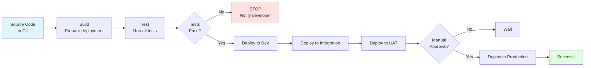

# CI/CD Concepts for Beginners

**Learning Objective**: Understand continuous integration and deployment principles before building actual pipelines.

---

## The Manual Deployment Nightmare

It's 11 PM on Sunday. You've been manually deploying to production for 3 hours.

Here's what you've done so far:

1. Logged into production org
2. Created a change set
3. Selected components (waited 10 minutes for the list to load)
4. Added 47 components one by one
5. Uploaded the change set
6. Validated it (35 minutes)
7. Deployment failed - missing dependency
8. Figured out which component was missing
9. Added it to change set
10. Uploaded again
11. Validated again (35 minutes)
12. Deployment failed - test coverage only 73% (need 75%)
13. Wrote quick test to bump coverage
14. Deployed test class
15. Started validation again (35 minutes)
16. Finally passed validation
17. Started deployment
18. One validation rule failed
19. Now you're troubleshooting at midnight

Your eyes are tired. You're making mistakes. Users will be online in 8 hours. You're stressed.

**This is what happens without CI/CD.**

---

##

 What IS CI/CD?

Let's break down these acronyms without the buzzwords:

### Continuous Integration (CI)

**What it means**: Automatically test every change as soon as it's committed to Git.

**Why it matters**: Catch bugs immediately, not days later.

**Example**:
- Developer commits Apex class at 2 PM
- Automated tests run at 2:01 PM
- Developer gets notification at 2:03 PM: "Your code broke 3 tests"
- Developer fixes immediately while the code is fresh in their mind

**Without CI**: Bugs discovered days later during manual testing. Developer has moved on to other work. Context switching is expensive.

### Continuous Deployment (CD)

**What it means**: Automatically push tested changes through environments.

**Why it matters**: Deploy in minutes, not hours. Same process every time. No human error.

**Example**:
- Code passes tests
- Pipeline automatically deploys to Dev sandbox
- If Dev deployment succeeds, deploys to Integration
- If Integration succeeds, deploys to UAT
- Manual approval gate before Production
- Deploy to Production on schedule

**Without CD**: Manual deployments. Copy/paste errors. Forgotten steps. Inconsistent process.

### The Goal

**From commit to production in minutes, not days. Safely. Reliably. Repeatably.**

---

## How Automation Saves You

Let's compare manual vs automated:

### Manual Deployment Process

**Steps** (you do all of these):
1. Remember what changed since last deployment
2. Log into source org
3. Create change set
4. Find and select all components
5. Hope you didn't miss any dependencies
6. Upload change set
7. Log into target org
8. Find the change set
9. Validate it
10. Wait 30+ minutes
11. If it fails, troubleshoot, go back to step 2
12. If it passes, deploy
13. Wait another 30+ minutes
14. If it fails, troubleshoot, start over
15. If it succeeds, manually verify in UI
16. Update documentation
17. Notify team

**Time**: 2-4 hours (if everything goes well)

**Error rate**: 20-30% (missed dependencies, typos, forgot a step)

**Stress level**: High

### Automated CI/CD Pipeline

**Steps** (you do these):
1. Commit code to Git
2. Push to GitLab
3. (Everything else is automatic)

**Steps** (pipeline does these):
1. Detect new commit
2. Pull code from Git
3. Authenticate to Salesforce
4. Run static code analysis
5. Run all Apex tests
6. Check test coverage
7. If tests pass, deploy to Dev sandbox
8. Run smoke tests in Dev
9. If successful, deploy to Integration
10. Run full test suite in Integration
11. If successful, wait for approval
12. On approval, deploy to Production
13. Run production smoke tests
14. Send notifications (Slack, email)
15. Update deployment dashboard
16. Log everything for audit trail

**Time**: 8-15 minutes

**Error rate**: Less than 5% (same automated process every time)

**Stress level**: Low (you just review results)

**Key difference**: You describe WHAT to deploy once (in the pipeline config). The pipeline does HOW every time.

---

## The Pipeline Concept

Think of a pipeline like an assembly line in a factory.

Raw materials (your code) go in one end. Finished product (deployed feature) comes out the other end.

In between, there are stations that each do one thing:



**Key principle**: If ANY step fails, the pipeline STOPS. Bad code never reaches production.

---

## Pipeline Components Explained

### 1. Source Control (Git)

**What it does**: Tracks all changes, triggers pipeline when code is pushed

**Why it matters**: Single source of truth. History of every change.

**In practice**:
```bash
git push origin main
# GitLab detects push, starts pipeline
```

### 2. Build

**What it does**: Prepares code for deployment, resolves dependencies

**Why it matters**: Catches syntax errors, ensures everything is ready

**In Salesforce context**:
- Convert metadata to deployment format
- Generate package.xml manifest
- Resolve dependencies
- Bundle everything together

### 3. Test

**What it does**: Runs automated tests (unit tests, integration tests)

**Why it matters**: Catches bugs before they reach users

**In Salesforce context**:
- Run Apex tests
- Check code coverage (must be ≥75%)
- Run Lightning component tests
- Validate business logic

**Critical rule**: If tests fail, pipeline stops. No exceptions.

### 4. Deploy

**What it does**: Pushes metadata to Salesforce org

**Why it matters**: Actual deployment happens here

**In Salesforce context**:
```bash
sfdx force:source:deploy -p force-app/ -u TargetOrg
```

Deployment includes:
- Connect to org
- Upload metadata
- Wait for Salesforce to process
- Get deployment results
- Log outcome

### 5. Monitor

**What it does**: Checks if deployment actually worked, sends notifications

**Why it matters**: Deployment "succeeds" but functionality might be broken

**In Salesforce context**:
- Run smoke tests (can users log in? Can they create records?)
- Check error logs
- Send Slack notification to team
- Update deployment dashboard

---

## Real Scenario Walkthrough

Let's follow a change from developer's computer to production:

**Monday 3:00 PM**: Sarah commits new Apex class

```bash
git add force-app/main/default/classes/OpportunityHandler.cls
git commit -m "Add automatic opportunity prioritization logic

This class assigns priority scores to opportunities based on:
- Account size
- Historical close rate
- Opportunity amount

Closes ticket SF-1234"

git push origin feature/opportunity-scoring
```

**Monday 3:01 PM**: GitLab pipeline starts automatically

```
[STAGE 1: Source]
✓ Code pulled from Git
✓ Feature branch detected

[STAGE 2: Build]
✓ Metadata validated
✓ Dependencies resolved
✓ Package.xml generated

[STAGE 3: Test]
✓ Static code analysis passed (no bugs detected)
✓ Running Apex tests...
  - OpportunityHandlerTest: PASS (4 tests, 95% coverage)
  - Existing tests: PASS (127 tests)
✓ Overall code coverage: 78% (meets minimum)

[STAGE 4: Deploy to Dev Sandbox]
✓ Authenticated to Dev org
✓ Deploying...
✓ Deployment successful (12 components, 2 minutes)
```

**Monday 3:08 PM**: Sarah gets Slack notification

> Pipeline #1234 PASSED ✓
> Branch: feature/opportunity-scoring
> All tests passed. Deployed to Dev sandbox.
> [View Pipeline] [View Changes]

**Monday 3:15 PM**: Sarah creates merge request

Title: "Add opportunity prioritization"
Reviewers: Tech Lead, Senior Developer

**Tuesday 10:00 AM**: Tech lead approves merge request

Click "Merge" button in GitLab.

**Tuesday 10:01 AM**: Pipeline starts for main branch

```
[STAGE 1-3: Source, Build, Test]
✓ All passed (same as before)

[STAGE 4: Deploy to Integration Sandbox]
✓ Deployed to Integration
✓ Running integration test suite...
✓ All 247 tests passed

[STAGE 5: Deploy to UAT Sandbox]
✓ Deployed to UAT
✓ Smoke tests passed
⏸  Waiting for business approval
```

**Wednesday**: Business users test in UAT, approve for production

**Friday 11:00 PM** (scheduled deployment window): Pipeline resumes

```
[STAGE 6: Deploy to Production]
⏸  Manual approval required
```

DevOps Lead clicks "Approve" button.

```
✓ Authenticated to Production
✓ Running validation (check-only deploy)...
✓ Validation passed
✓ Deploying to Production...
✓ Deployment successful (12 components, 3 minutes)
✓ Running production smoke tests...
✓ All smoke tests passed
✓ Deployment complete!
```

**Friday 11:08 PM**: Team gets notification

> Production Deployment #1234 SUCCESS ✓
> Opportunity prioritization is now live.
> Deployed by: DevOps Pipeline (approved by: Tech Lead)
> [View Changes] [Deployment Report]

**Total time**: From commit to production in 5 days (including manual approval gates and business testing).

**Total hands-on time**: 30 minutes (write code, create MR, approve).

**Total deployment time**: 8 minutes (automated).

**Errors**: 0

**Rollback capability**: Yes (revert Git commit, redeploy)

**Audit trail**: Complete (Git history + pipeline logs)

---

## Benefits for Acme Corp Context

As a DevOps Lead at Acme Corp, CI/CD gives you:

### 1. Multi-Team Coordination

**The challenge**: 5 teams deploying to Sales Cloud, Service Cloud, Community Cloud simultaneously.

**Without CI/CD**: Coordination chaos. Manual merge conflicts. "Who's deploying when?"

**With CI/CD**:
- Each team has their own feature branch
- Pipelines detect conflicts automatically
- Integration sandbox shows combined changes
- Clear deployment schedule visible to all
- No manual coordination needed

### 2. Compliance and Audit

**The challenge**: Acme Corp is a large enterprise. Strict compliance requirements.

**Without CI/CD**: Manual logs. Hard to prove who deployed what.

**With CI/CD**:
- Every deployment logged automatically
- Git provides immutable audit trail
- Pipeline shows exact metadata deployed
- Approval gates enforced automatically
- SOX/ISO compliance built-in

### 3. Risk Management

**The challenge**: Downtime affects 1000+ employees and millions of customers.

**Without CI/CD**: High-risk manual deployments. No easy rollback.

**With CI/CD**:
- Every deployment validated before production
- Automated tests catch issues
- Rollback is one button click
- Deployment windows scheduled during low-traffic times
- Automatic smoke tests verify functionality

### 4. Speed and Efficiency

**The challenge**: Business wants faster feature delivery.

**Without CI/CD**: 1-2 week deployment cycle. Manual bottleneck.

**With CI/CD**:
- Deploy multiple times per day if needed
- Automation removes bottleneck
- Developers focus on features, not deployment logistics
- Hot fixes can go out in hours, not days

### 5. Developer Experience

**The challenge**: Keeping 50+ developers productive.

**Without CI/CD**: Waiting for manual deployments. Fear of breaking things.

**With CI/CD**:
- Immediate feedback on code quality
- Confidence that tests will catch issues
- No waiting for deployment slots
- Clear visibility into deployment status

---

## Common CI/CD Misconceptions

### Myth 1: "CI/CD means deploying to production constantly"

**Reality**: CI/CD automates the CAN deploy part. You still control WHEN to deploy.

You can have:
- Automatic deployment to Dev/Integration
- Manual approval gates before UAT
- Scheduled deployment windows for Production

### Myth 2: "CI/CD is only for developers"

**Reality**: Admins benefit too. Any metadata change (fields, flows, validation rules) can go through pipelines.

Everyone commits to Git. Pipeline handles deployment.

### Myth 3: "Setting up CI/CD is too complex"

**Reality**: Initial setup takes time (1-2 weeks). But payoff is immediate and ongoing.

Investment: 80 hours upfront
Return: Save 20 hours per week ongoing

ROI: Positive in 1 month.

### Myth 4: "We need 100% test coverage"

**Reality**: Salesforce requires 75% for production. Aim for 80-85%.

Focus on testing critical business logic, not every line of code.

### Myth 5: "Pipelines never fail"

**Reality**: Pipelines SHOULD fail when there are issues. That's the point.

Failed pipeline = caught bug before production = success.

---

## Quick Check: Test Your Understanding

**Question 1**: What's the difference between Continuous Integration and Continuous Deployment?

<details>
<summary>Click to see answer</summary>

**Answer**:
- **Continuous Integration (CI)**: Automatically test every change as soon as it's committed
- **Continuous Deployment (CD)**: Automatically push tested changes through environments

**Analogy**:
- CI = Quality control (does it work?)
- CD = Shipping (get it to customers)

**Why both matter**: CI catches bugs early. CD delivers value fast.

</details>

**Question 2**: Why is automated testing critical in CI/CD?

<details>
<summary>Click to see answer</summary>

**Answer**: Automated tests are the safety net that makes automation safe.

Without tests:
- Pipeline might deploy broken code
- Bugs reach production
- Users are affected
- Trust in automation erodes

With tests:
- Pipeline catches bugs before deployment
- Code quality is enforced automatically
- Developers get immediate feedback
- Production stays stable

**Key principle**: If tests fail, deployment stops. No exceptions.

</details>

**Question 3**: A developer pushes code at 2 PM. The pipeline fails. What happens next?

<details>
<summary>Click to see answer</summary>

**Answer**:

**What happens automatically**:
1. Pipeline stops (doesn't continue to deployment)
2. Developer gets notification (Slack, email)
3. Pipeline logs show exactly what failed
4. No broken code reaches any environment

**What the developer does**:
1. Reviews the failure (test failed? Syntax error? Coverage too low?)
2. Fixes the issue locally
3. Commits the fix
4. Pushes again
5. Pipeline runs again automatically

**Key point**: Fast feedback loop. Developer knows in minutes, not hours or days.

</details>

---

## Key Takeaways

Before moving on, make sure you understand:

✅ **CI/CD automates testing and deployment** - Faster, safer, more reliable than manual

✅ **Pipelines are assembly lines** - Each stage validates something

✅ **Tests are the safety net** - Broken code never reaches production

✅ **Automation removes human error** - Same process every time

✅ **Fast feedback loops** - Know in minutes if something is wrong

✅ **Deployment becomes boring** - Which is exactly what you want

---

## Up Next: Why Automated Testing Matters

You understand CI/CD concepts now. Pipelines automate testing and deployment.

But here's the critical question: **What ARE we testing? How do tests actually prevent bugs?**

Testing is the foundation that makes automation trustworthy. Without good tests, automation is just automated chaos.

Next, we'll dive deep into automated testing in Salesforce:
- Why Salesforce requires 75% test coverage
- What makes a good test vs bad test
- How tests catch bugs before users see them
- Writing your first Apex test

Let's learn testing fundamentals: **[Why Automated Testing Matters →](/docs/foundations/automated-testing)**

---

**Pro tip**: Start thinking about CI/CD early in your career. Even if your company doesn't have it yet, understanding pipelines makes you more valuable. You become the person who can introduce it.
