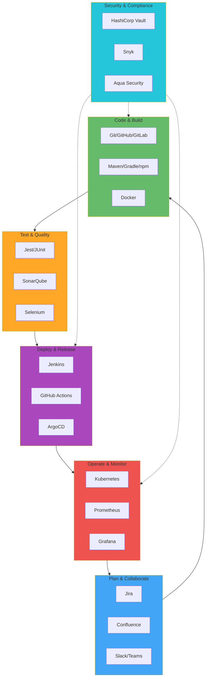
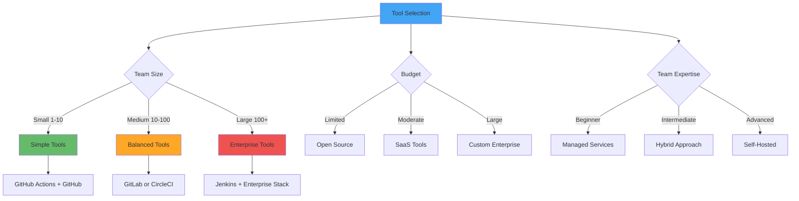

# DevOps Tools Ecosystem

**Learning Objective**: Understand the complete DevOps toolchain and how different tools work together to enable modern software delivery.

## The DevOps Toolchain



## Category 1: Version Control

### Git (Industry Standard)

```bash
# Core Git operations
git clone https://github.com/org/repo.git
git checkout -b feature/new-feature
git add .
git commit -m "feat: add new feature"
git push origin feature/new-feature

# Advanced operations
git rebase main
git cherry-pick abc123
git bisect start
```

### GitHub

**Key Features:**
- Code hosting
- Pull requests & code review
- GitHub Actions (CI/CD)
- Issues & project management
- GitHub Packages (artifact registry)

```yaml
# .github/workflows/ci.yml
name: CI
on: [push, pull_request]
jobs:
  test:
    runs-on: ubuntu-latest
    steps:
      - uses: actions/checkout@v4
      - run: npm test
```

### GitLab

**Key Features:**
- Complete DevOps platform
- Built-in CI/CD
- Container registry
- Security scanning
- Issue tracking

```yaml
# .gitlab-ci.yml
stages:
  - build
  - test
  - deploy

build:
  stage: build
  script:
    - npm install
    - npm run build
```

### Bitbucket

**Key Features:**
- Git hosting
- Bitbucket Pipelines (CI/CD)
- Jira integration
- Pull requests

## Category 2: CI/CD Platforms

### Jenkins

**The Original CI/CD Platform**

```groovy
// Jenkinsfile
pipeline {
    agent any

    stages {
        stage('Build') {
            steps {
                sh 'npm install'
                sh 'npm run build'
            }
        }

        stage('Test') {
            steps {
                sh 'npm test'
            }
        }

        stage('Deploy') {
            when {
                branch 'main'
            }
            steps {
                sh './deploy.sh'
            }
        }
    }

    post {
        always {
            junit '**/test-results/*.xml'
        }
        success {
            slackSend color: 'good', message: "Build ${env.BUILD_NUMBER} succeeded"
        }
        failure {
            slackSend color: 'danger', message: "Build ${env.BUILD_NUMBER} failed"
        }
    }
}
```

**Pros:**
- Highly customizable
- Massive plugin ecosystem
- Self-hosted or cloud
- Free and open-source

**Cons:**
- Complex setup
- Maintenance overhead
- Older UI/UX

### CircleCI

```yaml
# .circleci/config.yml
version: 2.1

jobs:
  build-and-test:
    docker:
      - image: cimg/node:18.0
    steps:
      - checkout
      - run: npm install
      - run: npm test
      - store_test_results:
          path: test-results

workflows:
  main:
    jobs:
      - build-and-test
```

### Travis CI

```yaml
# .travis.yml
language: node_js
node_js:
  - "18"

script:
  - npm test

deploy:
  provider: heroku
  api_key:
    secure: "encrypted-api-key"
  app: my-app
  on:
    branch: main
```

### Azure DevOps

```yaml
# azure-pipelines.yml
trigger:
  - main

pool:
  vmImage: 'ubuntu-latest'

steps:
- task: NodeTool@0
  inputs:
    versionSpec: '18.x'

- script: npm install
  displayName: 'Install dependencies'

- script: npm test
  displayName: 'Run tests'
```

## Category 3: Container Orchestration

### Kubernetes (k8s)

**Industry Standard for Container Orchestration**

```yaml
apiVersion: apps/v1
kind: Deployment
metadata:
  name: web-app
spec:
  replicas: 3
  selector:
    matchLabels:
      app: web
  template:
    metadata:
      labels:
        app: web
    spec:
      containers:
      - name: web
        image: nginx:latest
        ports:
        - containerPort: 80
```

### Docker Swarm

**Simpler Alternative to Kubernetes**

```bash
# Initialize swarm
docker swarm init

# Deploy stack
docker stack deploy -c docker-compose.yml myapp

# Scale service
docker service scale myapp_web=5
```

### Amazon ECS/EKS

- **ECS** - AWS-native container orchestration
- **EKS** - Managed Kubernetes on AWS

### HashiCorp Nomad

**Lightweight Orchestration**

```hcl
job "web" {
  datacenters = ["dc1"]

  group "web" {
    count = 3

    task "server" {
      driver = "docker"

      config {
        image = "nginx:latest"
        ports = ["http"]
      }
    }
  }
}
```

## Category 4: Monitoring & Observability

### Prometheus

**Metrics Collection & Alerting**

```yaml
# prometheus.yml
global:
  scrape_interval: 15s

scrape_configs:
  - job_name: 'salesforce-api'
    static_configs:
      - targets: ['localhost:3000']

alerting:
  alertmanagers:
    - static_configs:
        - targets: ['localhost:9093']

rule_files:
  - 'alerts.yml'
```

### Grafana

**Visualization & Dashboards**

```json
{
  "dashboard": {
    "title": "Salesforce DevOps Metrics",
    "panels": [
      {
        "title": "Deployment Frequency",
        "targets": [
          {
            "expr": "rate(deployments_total[1h])"
          }
        ]
      }
    ]
  }
}
```

### Datadog

**Full-Stack Monitoring SaaS**

```yaml
# datadog.yaml
api_key: ${DD_API_KEY}
logs_enabled: true

logs:
  - type: file
    path: /var/log/app.log
    service: salesforce-api
    source: nodejs
```

### ELK Stack (Elasticsearch, Logstash, Kibana)

**Log Aggregation & Analysis**

```yaml
# logstash.conf
input {
  file {
    path => "/var/log/app.log"
    start_position => "beginning"
  }
}

filter {
  json {
    source => "message"
  }
}

output {
  elasticsearch {
    hosts => ["localhost:9200"]
    index => "app-logs-%{+YYYY.MM.dd}"
  }
}
```

### New Relic

**Application Performance Monitoring**

```javascript
// newrelic.js
'use strict'

exports.config = {
  app_name: ['Salesforce API'],
  license_key: 'your-license-key',
  logging: {
    level: 'info'
  }
}
```

## Category 5: Security & Secrets Management

### HashiCorp Vault

**Secrets Management**

```bash
# Initialize Vault
vault operator init

# Store secret
vault kv put secret/salesforce \
  auth_url="force://..." \
  client_id="3AA2..."

# Retrieve secret
vault kv get secret/salesforce

# Dynamic secrets (AWS)
vault read aws/creds/deploy-role
```

### AWS Secrets Manager

```bash
# Store secret
aws secretsmanager create-secret \
  --name salesforce/prod/auth \
  --secret-string '{"auth_url":"force://..."}'

# Retrieve secret
aws secretsmanager get-secret-value \
  --secret-id salesforce/prod/auth
```

### Azure Key Vault

```bash
# Create vault
az keyvault create \
  --name myvault \
  --resource-group mygroup

# Store secret
az keyvault secret set \
  --vault-name myvault \
  --name "sfdx-auth" \
  --value "force://..."
```

### Snyk

**Security Scanning**

```yaml
# .github/workflows/security.yml
- name: Run Snyk
  uses: snyk/actions/node@master
  env:
    SNYK_TOKEN: ${{ secrets.SNYK_TOKEN }}
```

### SonarQube

**Code Quality & Security**

```yaml
# sonar-project.properties
sonar.projectKey=salesforce-app
sonar.sources=force-app
sonar.tests=force-app
sonar.test.inclusions=**/*Test.cls

# Run analysis
sonar-scanner
```

## Category 6: Artifact Management

### Artifactory (JFrog)

**Universal Artifact Repository**

```yaml
# Publish to Artifactory
- name: Publish Package
  run: |
    curl -u ${{ secrets.ARTIFACTORY_USER }}:${{ secrets.ARTIFACTORY_PASSWORD }} \
      -T package.zip \
      "https://artifactory.company.com/libs-release-local/myapp/1.0.0/package.zip"
```

### Nexus Repository

**Artifact Repository Manager**

```xml
<!-- settings.xml -->
<server>
  <id>nexus</id>
  <username>${env.NEXUS_USER}</username>
  <password>${env.NEXUS_PASSWORD}</password>
</server>

<repository>
  <id>nexus</id>
  <url>https://nexus.company.com/repository/maven-releases/</url>
</repository>
```

### GitHub Packages

```yaml
# Publish to GitHub Packages
- name: Publish Package
  run: npm publish
  env:
    NODE_AUTH_TOKEN: ${{ secrets.GITHUB_TOKEN }}
```

## Category 7: Configuration Management

### Ansible

**Agentless Automation**

```yaml
# playbook.yml
---
- name: Setup GitHub Runner
  hosts: runners
  become: yes
  tasks:
    - name: Install Docker
      apt:
        name: docker.io
        state: present

    - name: Install Salesforce CLI
      npm:
        name: '@salesforce/cli'
        global: yes

    - name: Setup runner
      shell: |
        cd /home/ubuntu/actions-runner
        ./config.sh --url {{ github_url }} --token {{ runner_token }}
        ./svc.sh install
        ./svc.sh start
```

### Chef

**Infrastructure Automation**

```ruby
# recipe.rb
package 'docker' do
  action :install
end

service 'docker' do
  action [:enable, :start]
end

execute 'install-sf-cli' do
  command 'npm install -g @salesforce/cli'
end
```

### Puppet

**Configuration Management**

```puppet
# site.pp
node 'runner.example.com' {
  package { 'docker':
    ensure => installed,
  }

  service { 'docker':
    ensure => running,
    enable => true,
  }

  exec { 'install-sfdx':
    command => '/usr/bin/npm install -g @salesforce/cli',
  }
}
```

## Category 8: Cloud Platforms

### AWS (Amazon Web Services)

```bash
# AWS CLI
aws ec2 run-instances \
  --image-id ami-abc123 \
  --instance-type t3.medium \
  --key-name my-key

# S3
aws s3 cp deployment.zip s3://my-bucket/

# Lambda
aws lambda invoke \
  --function-name my-function \
  response.json
```

### Azure

```bash
# Azure CLI
az vm create \
  --resource-group mygroup \
  --name myvm \
  --image UbuntuLTS

# Storage
az storage blob upload \
  --account-name myaccount \
  --container-name mycontainer \
  --file deployment.zip
```

### Google Cloud Platform (GCP)

```bash
# gcloud CLI
gcloud compute instances create my-instance \
  --zone=us-central1-a \
  --machine-type=e2-medium

# Storage
gsutil cp deployment.zip gs://my-bucket/
```

## Category 9: API Testing & Performance

### Postman

**API Development & Testing**

```javascript
// Postman test script
pm.test("Status code is 200", function () {
    pm.response.to.have.status(200);
});

pm.test("Response time < 200ms", function () {
    pm.expect(pm.response.responseTime).to.be.below(200);
});

pm.test("Contains user data", function () {
    var jsonData = pm.response.json();
    pm.expect(jsonData.user.name).to.eql("John Doe");
});
```

### JMeter

**Load Testing**

```xml
<!-- testplan.jmx -->
<ThreadGroup>
  <stringProp name="ThreadGroup.num_threads">100</stringProp>
  <stringProp name="ThreadGroup.ramp_time">10</stringProp>
  <HTTPSamplerProxy>
    <stringProp name="HTTPSampler.domain">api.salesforce.com</stringProp>
    <stringProp name="HTTPSampler.path">/services/data/v59.0/query</stringProp>
  </HTTPSamplerProxy>
</ThreadGroup>
```

### k6 (Load Testing)

```javascript
// loadtest.js
import http from 'k6/http';
import { check, sleep } from 'k6';

export let options = {
  vus: 100,
  duration: '30s',
};

export default function () {
  let res = http.get('https://api.example.com/health');
  check(res, {
    'status is 200': (r) => r.status === 200,
    'response time < 500ms': (r) => r.timings.duration < 500,
  });
  sleep(1);
}
```

## Category 10: Collaboration & Communication

### Slack

**Team Communication**

```bash
# Webhook notification
curl -X POST -H 'Content-type: application/json' \
  --data '{
    "text": "Deployment completed successfully! ",
    "attachments": [{
      "color": "good",
      "fields": [
        {"title": "Environment", "value": "Production", "short": true},
        {"title": "Version", "value": "v1.2.3", "short": true}
      ]
    }]
  }' \
  $SLACK_WEBHOOK_URL
```

### Microsoft Teams

```bash
# Teams webhook
curl -H 'Content-Type: application/json' \
  -d '{
    "@type": "MessageCard",
    "title": "Deployment Status",
    "text": "Production deployment completed",
    "themeColor": "0076D7"
  }' \
  $TEAMS_WEBHOOK_URL
```

### Jira

**Project Management**

```bash
# Create issue via API
curl -X POST \
  -H "Authorization: Basic ${JIRA_TOKEN}" \
  -H "Content-Type: application/json" \
  --data '{
    "fields": {
      "project": {"key": "DEVOPS"},
      "summary": "Deployment failed in production",
      "description": "Deployment v1.2.3 failed",
      "issuetype": {"name": "Bug"}
    }
  }' \
  https://your-domain.atlassian.net/rest/api/3/issue
```

## Choosing the Right Tools

### Evaluation Criteria



### Recommended Stack by Scenario

**Startup/Small Team:**
- **Version Control**: GitHub
- **CI/CD**: GitHub Actions
- **Containers**: Docker
- **Monitoring**: Datadog (free tier)
- **Security**: Snyk
- **Communication**: Slack

**Mid-Size Company:**
- **Version Control**: GitLab
- **CI/CD**: GitLab CI + ArgoCD
- **Containers**: Kubernetes (EKS/GKE)
- **Monitoring**: Prometheus + Grafana
- **Security**: Vault + SonarQube
- **Communication**: Slack + Jira

**Enterprise:**
- **Version Control**: GitHub Enterprise
- **CI/CD**: Jenkins + GitHub Actions
- **Containers**: Kubernetes + Helm
- **Monitoring**: Datadog + ELK
- **Security**: Vault + Aqua + Snyk
- **Artifact Management**: Artifactory
- **Communication**: Teams + Jira + Confluence

## Integration Patterns

### Example: Complete DevOps Pipeline

```yaml
# Integrated pipeline using multiple tools
name: Complete DevOps Pipeline

on: [push]

jobs:
  quality-checks:
    runs-on: ubuntu-latest
    steps:
      # Version control
      - uses: actions/checkout@v4

      # Code quality
      - name: SonarQube Scan
        uses: sonarsource/sonarqube-scan-action@master

      # Security scanning
      - name: Snyk Security Scan
        uses: snyk/actions/node@master

  build-and-test:
    needs: quality-checks
    runs-on: ubuntu-latest
    steps:
      # Build with Docker
      - name: Build Docker Image
        run: docker build -t myapp:${{ github.sha }} .

      # Test
      - name: Run Tests
        run: docker run myapp:${{ github.sha }} npm test

      # Push to registry
      - name: Push to Artifactory
        run: |
          docker tag myapp:${{ github.sha }} artifactory.company.com/myapp:${{ github.sha }}
          docker push artifactory.company.com/myapp:${{ github.sha }}

  deploy:
    needs: build-and-test
    runs-on: ubuntu-latest
    steps:
      # Deploy to Kubernetes
      - name: Deploy to K8s
        run: |
          kubectl set image deployment/myapp \
            myapp=artifactory.company.com/myapp:${{ github.sha }}

      # Monitor deployment
      - name: Monitor with Datadog
        run: |
          curl -X POST "https://api.datadoghq.com/api/v1/events" \
            -H "DD-API-KEY: ${{ secrets.DD_API_KEY }}" \
            -d '{
              "title": "Deployment",
              "text": "Deployed version ${{ github.sha }}",
              "tags": ["environment:production"]
            }'

      # Notify team
      - name: Notify Slack
        run: |
          curl -X POST ${{ secrets.SLACK_WEBHOOK }} \
            -d '{"text": "Deployment completed!"}'
```

## Interview Talking Points

1. **"We use a GitOps approach with GitHub, ArgoCD, and Kubernetes"**
   - Shows modern DevOps practices
   - Demonstrates tool integration knowledge

2. **"Our monitoring stack is Prometheus + Grafana with Datadog for APM"**
   - Shows observability expertise
   - Demonstrates cost-conscious decisions

3. **"We use Vault for secrets and SonarQube for code quality"**
   - Shows security awareness
   - Demonstrates quality focus

4. **"Our CI/CD uses GitHub Actions with self-hosted runners on Kubernetes"**
   - Shows scalability thinking
   - Demonstrates infrastructure expertise

5. **"We integrate Jira with GitHub for full traceability from issue to deployment"**
   - Shows process maturity
   - Demonstrates team collaboration

## Quick Reference: Popular Tools

| Category | Tool | Free Tier | Best For |
|----------|------|-----------|----------|
| Version Control | GitHub | Yes | Team collaboration |
| CI/CD | GitHub Actions | Yes | GitHub users |
| CI/CD | GitLab CI | Yes | Complete DevOps platform |
| CI/CD | Jenkins | Yes (self-hosted) | Customization |
| Containers | Docker | Yes | Containerization |
| Orchestration | Kubernetes | Yes (self-hosted) | Production scale |
| Monitoring | Prometheus | Yes | Metrics collection |
| Dashboards | Grafana | Yes | Visualization |
| APM | Datadog | Trial | Full-stack monitoring |
| Secrets | Vault | Yes | Secrets management |
| Security | Snyk | Yes | Vulnerability scanning |
| Quality | SonarQube | Yes | Code quality |
| Communication | Slack | Yes | Team chat |

## Next Steps

- **Related**: [Docker & Containers](./docker-containers) - Container fundamentals
- **Related**: [Kubernetes Basics](./kubernetes-basics) - Orchestration
- **Related**: [Infrastructure as Code](./infrastructure-as-code) - IaC tools
- **Practice**: Set up a complete DevOps toolchain for a sample project

---

**Key Takeaway**: Modern DevOps relies on a carefully chosen set of tools working together. Start with the basics (Git, CI/CD, containers) and gradually add tools as your needs grow. Focus on integration and automation rather than tool proliferation.
