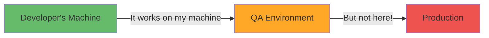
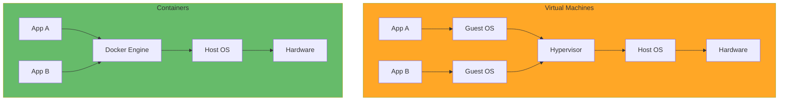

# Docker & Containers Fundamentals

**Learning Objective**: Understand containerization, Docker basics, and how containers revolutionize DevOps workflows.

## What Are Containers?

Containers are lightweight, standalone packages that include everything needed to run an application: code, runtime, system tools, libraries, and settings.

### The Problem Containers Solve



**Before Containers:**
- "Works on my machine" syndrome
- Environment inconsistencies
- Complex dependency management
- Slow deployment processes

**After Containers:**
- Consistent environments everywhere
- Isolated dependencies
- Fast, reliable deployments
- Easy scaling

## Docker Basics

### Container vs Virtual Machine



**Virtual Machines:**
- Each VM includes full OS (GBs)
- Minutes to start
- Heavy resource usage

**Containers:**
- Share host OS kernel (MBs)
- Seconds to start
- Lightweight and efficient

## Installing Docker

### macOS

```bash
# Install Docker Desktop
brew install --cask docker

# Verify installation
docker --version
docker run hello-world
```

### Linux (Ubuntu)

```bash
# Update package index
sudo apt-get update

# Install prerequisites
sudo apt-get install \
    ca-certificates \
    curl \
    gnupg \
    lsb-release

# Add Docker's official GPG key
sudo mkdir -p /etc/apt/keyrings
curl -fsSL https://download.docker.com/linux/ubuntu/gpg | \
    sudo gpg --dearmor -o /etc/apt/keyrings/docker.gpg

# Set up repository
echo \
  "deb [arch=$(dpkg --print-architecture) signed-by=/etc/apt/keyrings/docker.gpg] \
  https://download.docker.com/linux/ubuntu \
  $(lsb_release -cs) stable" | \
  sudo tee /etc/apt/sources.list.d/docker.list > /dev/null

# Install Docker Engine
sudo apt-get update
sudo apt-get install docker-ce docker-ce-cli containerd.io docker-compose-plugin

# Verify installation
sudo docker run hello-world
```

### Windows

```powershell
# Install Docker Desktop from Docker Hub
# Or use Chocolatey
choco install docker-desktop

# Verify
docker --version
```

## Essential Docker Commands

### Working with Images

```bash
# Pull an image from Docker Hub
docker pull ubuntu:22.04
docker pull node:18
docker pull salesforce/salesforcedx:latest-full

# List local images
docker images

# Remove an image
docker rmi ubuntu:22.04

# Build an image from Dockerfile
docker build -t myapp:1.0 .

# Tag an image
docker tag myapp:1.0 myregistry.com/myapp:1.0

# Push to registry
docker push myregistry.com/myapp:1.0
```

### Working with Containers

```bash
# Run a container
docker run ubuntu:22.04

# Run interactively with terminal
docker run -it ubuntu:22.04 /bin/bash

# Run in background (detached)
docker run -d nginx

# Run with name
docker run --name my-nginx -d nginx

# Run with port mapping (host:container)
docker run -p 8080:80 -d nginx

# Run with volume mount
docker run -v /host/path:/container/path -d nginx

# Run with environment variables
docker run -e MY_VAR=value -d myapp

# List running containers
docker ps

# List all containers (including stopped)
docker ps -a

# Stop a container
docker stop my-nginx

# Start a stopped container
docker start my-nginx

# Restart a container
docker restart my-nginx

# Remove a container
docker rm my-nginx

# View container logs
docker logs my-nginx
docker logs -f my-nginx  # Follow logs

# Execute command in running container
docker exec -it my-nginx /bin/bash

# Inspect container details
docker inspect my-nginx

# View container resource usage
docker stats
```

## Creating a Dockerfile

### Basic Dockerfile

```dockerfile
# Dockerfile for Node.js application
FROM node:18

# Set working directory
WORKDIR /app

# Copy package files
COPY package*.json ./

# Install dependencies
RUN npm ci --only=production

# Copy application code
COPY . .

# Expose port
EXPOSE 3000

# Set environment variable
ENV NODE_ENV=production

# Define entrypoint
CMD ["node", "server.js"]
```

### Salesforce CLI Container

```dockerfile
# Dockerfile for Salesforce CI/CD
FROM ubuntu:22.04

# Install dependencies
RUN apt-get update && apt-get install -y \
    curl \
    git \
    jq \
    nodejs \
    npm \
    && rm -rf /var/lib/apt/lists/*

# Install Salesforce CLI
RUN npm install -g @salesforce/cli

# Install plugins
RUN sf plugins install @salesforce/sfdx-scanner
RUN npm install -g sfdx-git-delta

# Set working directory
WORKDIR /workspace

# Verify installation
RUN sf --version

# Default command
CMD ["/bin/bash"]
```

### Build and Run

```bash
# Build the image
docker build -t salesforce-ci:latest .

# Run the container
docker run -it salesforce-ci:latest

# Run with volume mount (share code)
docker run -it -v $(pwd):/workspace salesforce-ci:latest
```

## Multi-Stage Builds

Optimize image size by using multi-stage builds:

```dockerfile
# Build stage
FROM node:18 AS builder

WORKDIR /app
COPY package*.json ./
RUN npm ci

COPY . .
RUN npm run build

# Production stage
FROM node:18-slim

WORKDIR /app

# Copy only production dependencies
COPY package*.json ./
RUN npm ci --only=production

# Copy built application from builder
COPY --from=builder /app/dist ./dist

EXPOSE 3000
CMD ["node", "dist/server.js"]
```

**Benefits:**
- Smaller final image (no build tools)
- Faster deployment
- More secure (fewer packages)

## Docker Compose

Manage multi-container applications with Docker Compose:

### docker-compose.yml

```yaml
version: '3.8'

services:
  # Salesforce CI runner
  sf-runner:
    build: ./docker/sf-runner
    container_name: salesforce-runner
    volumes:
      - ./force-app:/workspace/force-app
      - ./manifest:/workspace/manifest
      - sf-cache:/root/.sfdx
    environment:
      - SFDX_AUTOUPDATE_DISABLE=true
    networks:
      - sf-network

  # PostgreSQL for data migration testing
  postgres:
    image: postgres:15
    container_name: sf-postgres
    environment:
      - POSTGRES_PASSWORD=password
      - POSTGRES_DB=salesforce_data
    ports:
      - "5432:5432"
    volumes:
      - postgres-data:/var/lib/postgresql/data
    networks:
      - sf-network

  # Redis for caching
  redis:
    image: redis:7-alpine
    container_name: sf-redis
    ports:
      - "6379:6379"
    networks:
      - sf-network

volumes:
  sf-cache:
  postgres-data:

networks:
  sf-network:
    driver: bridge
```

### Using Docker Compose

```bash
# Start all services
docker-compose up -d

# View logs
docker-compose logs -f

# Stop all services
docker-compose down

# Rebuild and start
docker-compose up -d --build

# Scale a service
docker-compose up -d --scale sf-runner=3

# Execute command in service
docker-compose exec sf-runner sf org list
```

## Best Practices

### 1. Use Official Base Images

```dockerfile
# Good - official image
FROM node:18-alpine

# Avoid - unknown sources
FROM random-user/node
```

### 2. Minimize Layers

```dockerfile
# Good - single RUN command
RUN apt-get update && \
    apt-get install -y curl git && \
    rm -rf /var/lib/apt/lists/*

# Bad - multiple layers
RUN apt-get update
RUN apt-get install -y curl
RUN apt-get install -y git
```

### 3. Use .dockerignore

```text
# .dockerignore
node_modules
npm-debug.log
.git
.env
*.md
.DS_Store
coverage/
.vscode/
```

### 4. Don't Run as Root

```dockerfile
# Create non-root user
RUN useradd -m -u 1000 appuser

# Switch to non-root user
USER appuser

WORKDIR /home/appuser/app
```

### 5. Use Health Checks

```dockerfile
HEALTHCHECK --interval=30s --timeout=3s --start-period=5s --retries=3 \
  CMD curl -f http://localhost:3000/health || exit 1
```

## Docker in CI/CD

### GitHub Actions with Docker

```yaml
name: Docker Build and Push

on:
  push:
    branches: [main]

jobs:
  build:
    runs-on: ubuntu-latest
    steps:
      - uses: actions/checkout@v4

      - name: Set up Docker Buildx
        uses: docker/setup-buildx-action@v3

      - name: Login to Docker Hub
        uses: docker/login-action@v3
        with:
          username: ${{ secrets.DOCKER_USERNAME }}
          password: ${{ secrets.DOCKER_PASSWORD }}

      - name: Build and push
        uses: docker/build-push-action@v5
        with:
          context: .
          push: true
          tags: |
            myregistry/salesforce-ci:latest
            myregistry/salesforce-ci:${{ github.sha }}
          cache-from: type=gha
          cache-to: type=gha,mode=max
```

### GitLab CI with Docker

```yaml
# .gitlab-ci.yml
image: docker:latest

services:
  - docker:dind

variables:
  DOCKER_DRIVER: overlay2
  DOCKER_TLS_CERTDIR: "/certs"

stages:
  - build
  - test
  - deploy

build-image:
  stage: build
  script:
    - docker login -u $CI_REGISTRY_USER -p $CI_REGISTRY_PASSWORD $CI_REGISTRY
    - docker build -t $CI_REGISTRY_IMAGE:$CI_COMMIT_SHA .
    - docker push $CI_REGISTRY_IMAGE:$CI_COMMIT_SHA

test-image:
  stage: test
  script:
    - docker run $CI_REGISTRY_IMAGE:$CI_COMMIT_SHA sf --version
    - docker run $CI_REGISTRY_IMAGE:$CI_COMMIT_SHA npm test
```

## Salesforce DevOps Use Cases

### 1. Consistent Development Environments

```bash
# Everyone uses the same environment
docker run -it -v $(pwd):/workspace salesforce-dev:latest

# No more "works on my machine"
```

### 2. CI/CD Runners

```dockerfile
# Optimized CI/CD runner
FROM salesforce/salesforcedx:latest-full

# Add testing tools
RUN npm install -g jest @salesforce/sfdx-scanner

# Pre-cache dependencies
COPY package*.json ./
RUN npm ci

WORKDIR /workspace
```

### 3. Isolated Testing

```bash
# Run tests in isolated container
docker run --rm \
  -v $(pwd):/workspace \
  -e SFDX_AUTH_URL="${SFDX_AUTH_URL}" \
  salesforce-ci:latest \
  sf apex run test --target-org ci-org --code-coverage
```

### 4. Data Migration Tools

```dockerfile
# Data migration container
FROM python:3.11-slim

RUN pip install \
    simple-salesforce \
    pandas \
    sqlalchemy \
    psycopg2-binary

COPY scripts/ /scripts/
WORKDIR /data

CMD ["python", "/scripts/migrate.py"]
```

## Troubleshooting

### Check Container Logs

```bash
# View logs
docker logs container-name

# Follow logs in real-time
docker logs -f container-name

# Last 100 lines
docker logs --tail 100 container-name
```

### Debug Running Container

```bash
# Get shell access
docker exec -it container-name /bin/bash

# Check processes
docker exec container-name ps aux

# Check environment
docker exec container-name env
```

### Clean Up Resources

```bash
# Remove stopped containers
docker container prune

# Remove unused images
docker image prune -a

# Remove unused volumes
docker volume prune

# Remove everything unused
docker system prune -a --volumes
```

## Interview Talking Points

1. **"Containers ensure consistency across all environments"**
   - Shows understanding of the "works on my machine" problem
   - Demonstrates DevOps maturity

2. **"We use Docker for our CI/CD runners to guarantee reproducible builds"**
   - Shows practical Docker application
   - Demonstrates CI/CD expertise

3. **"Multi-stage builds reduce our image size by 70%"**
   - Shows optimization thinking
   - Demonstrates security awareness

4. **"Docker Compose simplifies local development with all dependencies"**
   - Shows developer experience focus
   - Demonstrates practical skills

5. **"We use health checks and proper logging for container observability"**
   - Shows operational maturity
   - Demonstrates production readiness

## Quick Reference

### Essential Commands

| Command | Description |
|---------|-------------|
| `docker build -t name:tag .` | Build image |
| `docker run -d -p 8080:80 image` | Run detached with port |
| `docker ps` | List running containers |
| `docker logs -f container` | Follow logs |
| `docker exec -it container bash` | Get shell access |
| `docker stop container` | Stop container |
| `docker rm container` | Remove container |
| `docker-compose up -d` | Start all services |

## Next Steps

- **Related**: [Kubernetes Basics](./kubernetes-basics) - Orchestrate containers at scale
- **Related**: [Custom Runners & Docker](../advanced/custom-runners-docker) - Advanced Docker for CI/CD
- **Practice**: Build a containerized Salesforce CLI environment

---

**Key Takeaway**: Containers are the foundation of modern DevOps. They provide consistency, isolation, and portability. Master Docker, and you unlock faster, more reliable deployments across any environment.
