# Infrastructure as Code (IaC)

**Learning Objective**: Understand Infrastructure as Code principles and tools like Terraform, CloudFormation, and how to manage infrastructure through code.

## What is Infrastructure as Code?

Infrastructure as Code (IaC) is the practice of managing and provisioning infrastructure through machine-readable configuration files rather than manual processes.

### The Problem IaC Solves

```mermaid
graph LR
    MANUAL[Manual Infrastructure] --> PROBLEMS

    subgraph PROBLEMS["Problems"]
        P1[Inconsistent environments]
        P2[No version control]
        P3[Hard to replicate]
        P4[Error-prone]
        P5[No audit trail]
    end

    PROBLEMS --> IAC[Infrastructure as Code]

    subgraph SOLUTIONS["Solutions"]
        S1[Consistent & repeatable]
        S2[Version controlled]
        S3[Easy to replicate]
        S4[Automated & reliable]
        S5[Full audit trail]
    end

    IAC --> SOLUTIONS

    style MANUAL fill:#ef5350
    style IAC fill:#66bb6a
    style PROBLEMS fill:#ffa726
    style SOLUTIONS fill:#42a5f5
```



**Benefits:**
- **Version Control** - Track changes like application code
- **Consistency** - Same config creates same infrastructure
- **Speed** - Provision in minutes, not days
- **Documentation** - Code documents your infrastructure
- **Collaboration** - Team reviews infrastructure changes

## IaC Tools Comparison

| Tool | Provider | Language | Best For |
|------|----------|----------|----------|
| **Terraform** | HashiCorp | HCL | Multi-cloud, modular infrastructure |
| **CloudFormation** | AWS | YAML/JSON | AWS-specific infrastructure |
| **Azure ARM** | Microsoft | JSON | Azure-specific infrastructure |
| **Pulumi** | Pulumi | TypeScript, Python, Go | Developers preferring real programming languages |
| **Ansible** | Red Hat | YAML | Configuration management + provisioning |

## Terraform Basics

### Installation

```bash
# macOS
brew tap hashicorp/tap
brew install hashicorp/tap/terraform

# Linux
wget https://releases.hashicorp.com/terraform/1.6.0/terraform_1.6.0_linux_amd64.zip
unzip terraform_1.6.0_linux_amd64.zip
sudo mv terraform /usr/local/bin/

# Verify
terraform --version
```

### Basic Terraform Workflow


### Simple Example: AWS EC2 Instance

```hcl
# main.tf
terraform {
  required_providers {
    aws = {
      source  = "hashicorp/aws"
      version = "~> 5.0"
    }
  }
}

provider "aws" {
  region = "us-east-1"
}

resource "aws_instance" "github_runner" {
  ami           = "ami-0c55b159cbfafe1f0"
  instance_type = "t3.medium"

  tags = {
    Name        = "GitHub Runner"
    Environment = "production"
    ManagedBy   = "Terraform"
  }

  user_data = <<-EOF
              #!/bin/bash
              # Install GitHub Runner
              mkdir actions-runner && cd actions-runner
              curl -o actions-runner-linux-x64-2.311.0.tar.gz \
                -L https://github.com/actions/runner/releases/download/v2.311.0/actions-runner-linux-x64-2.311.0.tar.gz
              tar xzf ./actions-runner-linux-x64-2.311.0.tar.gz
              ./config.sh --url https://github.com/your-org/your-repo \
                --token ${var.github_runner_token}
              ./svc.sh install
              ./svc.sh start
              EOF
}

variable "github_runner_token" {
  description = "GitHub Runner registration token"
  type        = string
  sensitive   = true
}

output "instance_public_ip" {
  description = "Public IP of the GitHub Runner"
  value       = aws_instance.github_runner.public_ip
}
```

### Basic Commands

```bash
# Initialize Terraform (download providers)
terraform init

# Validate configuration
terraform validate

# Format code
terraform fmt

# Preview changes
terraform plan

# Apply changes
terraform apply

# Destroy infrastructure
terraform destroy

# Show current state
terraform show

# List resources in state
terraform state list

# View specific resource
terraform state show aws_instance.github_runner
```

## Complete Salesforce CI/CD Infrastructure

### Directory Structure

```
terraform/
├── main.tf              # Main configuration
├── variables.tf         # Input variables
├── outputs.tf          # Output values
├── terraform.tfvars    # Variable values (gitignored)
├── modules/
│   ├── vpc/
│   │   ├── main.tf
│   │   ├── variables.tf
│   │   └── outputs.tf
│   ├── runners/
│   │   ├── main.tf
│   │   ├── variables.tf
│   │   └── outputs.tf
│   └── monitoring/
│       ├── main.tf
│       ├── variables.tf
│       └── outputs.tf
└── environments/
    ├── dev.tfvars
    ├── staging.tfvars
    └── production.tfvars
```

### variables.tf

```hcl
variable "environment" {
  description = "Environment name"
  type        = string
  default     = "production"
}

variable "aws_region" {
  description = "AWS region"
  type        = string
  default     = "us-east-1"
}

variable "runner_count" {
  description = "Number of GitHub runners"
  type        = number
  default     = 3
}

variable "runner_instance_type" {
  description = "EC2 instance type for runners"
  type        = string
  default     = "t3.medium"
}

variable "github_runner_token" {
  description = "GitHub runner registration token"
  type        = string
  sensitive   = true
}

variable "sfdx_auth_url" {
  description = "Salesforce SFDX auth URL"
  type        = string
  sensitive   = true
}

variable "tags" {
  description = "Common tags for all resources"
  type        = map(string)
  default = {
    Project   = "Salesforce-DevOps"
    ManagedBy = "Terraform"
  }
}
```

### main.tf

```hcl
terraform {
  required_version = ">= 1.0"

  required_providers {
    aws = {
      source  = "hashicorp/aws"
      version = "~> 5.0"
    }
  }

  # Store state in S3 (recommended for teams)
  backend "s3" {
    bucket         = "my-terraform-state"
    key            = "salesforce-ci/terraform.tfstate"
    region         = "us-east-1"
    encrypt        = true
    dynamodb_table = "terraform-state-lock"
  }
}

provider "aws" {
  region = var.aws_region

  default_tags {
    tags = var.tags
  }
}

# VPC for runners
resource "aws_vpc" "main" {
  cidr_block           = "10.0.0.0/16"
  enable_dns_hostnames = true
  enable_dns_support   = true

  tags = {
    Name = "${var.environment}-vpc"
  }
}

# Public subnet
resource "aws_subnet" "public" {
  vpc_id                  = aws_vpc.main.id
  cidr_block              = "10.0.1.0/24"
  availability_zone       = "${var.aws_region}a"
  map_public_ip_on_launch = true

  tags = {
    Name = "${var.environment}-public-subnet"
  }
}

# Internet gateway
resource "aws_internet_gateway" "main" {
  vpc_id = aws_vpc.main.id

  tags = {
    Name = "${var.environment}-igw"
  }
}

# Route table
resource "aws_route_table" "public" {
  vpc_id = aws_vpc.main.id

  route {
    cidr_block = "0.0.0.0/0"
    gateway_id = aws_internet_gateway.main.id
  }

  tags = {
    Name = "${var.environment}-public-rt"
  }
}

# Associate route table
resource "aws_route_table_association" "public" {
  subnet_id      = aws_subnet.public.id
  route_table_id = aws_route_table.public.id
}

# Security group for runners
resource "aws_security_group" "runners" {
  name        = "${var.environment}-runners-sg"
  description = "Security group for GitHub runners"
  vpc_id      = aws_vpc.main.id

  # Outbound internet access
  egress {
    from_port   = 0
    to_port     = 0
    protocol    = "-1"
    cidr_blocks = ["0.0.0.0/0"]
  }

  # SSH access (restrict to your IP in production)
  ingress {
    from_port   = 22
    to_port     = 22
    protocol    = "tcp"
    cidr_blocks = ["0.0.0.0/0"]  # CHANGE THIS
  }

  tags = {
    Name = "${var.environment}-runners-sg"
  }
}

# IAM role for runners
resource "aws_iam_role" "runner" {
  name = "${var.environment}-github-runner-role"

  assume_role_policy = jsonencode({
    Version = "2012-10-17"
    Statement = [
      {
        Action = "sts:AssumeRole"
        Effect = "Allow"
        Principal = {
          Service = "ec2.amazonaws.com"
        }
      }
    ]
  })
}

# IAM instance profile
resource "aws_iam_instance_profile" "runner" {
  name = "${var.environment}-runner-profile"
  role = aws_iam_role.runner.name
}

# Attach policies (customize as needed)
resource "aws_iam_role_policy_attachment" "ssm" {
  role       = aws_iam_role.runner.name
  policy_arn = "arn:aws:iam::aws:policy/AmazonSSMManagedInstanceCore"
}

# Launch template for runners
resource "aws_launch_template" "runner" {
  name_prefix   = "${var.environment}-runner-"
  image_id      = data.aws_ami.ubuntu.id
  instance_type = var.runner_instance_type

  iam_instance_profile {
    name = aws_iam_instance_profile.runner.name
  }

  vpc_security_group_ids = [aws_security_group.runners.id]

  user_data = base64encode(templatefile("${path.module}/scripts/runner-setup.sh", {
    github_runner_token = var.github_runner_token
    sfdx_auth_url      = var.sfdx_auth_url
    environment        = var.environment
  }))

  metadata_options {
    http_tokens = "required"  # IMDSv2
  }

  monitoring {
    enabled = true
  }

  tag_specifications {
    resource_type = "instance"
    tags = {
      Name = "${var.environment}-github-runner"
    }
  }
}

# Auto Scaling Group
resource "aws_autoscaling_group" "runners" {
  name                = "${var.environment}-runners-asg"
  desired_capacity    = var.runner_count
  min_size            = 1
  max_size            = 10
  vpc_zone_identifier = [aws_subnet.public.id]

  launch_template {
    id      = aws_launch_template.runner.id
    version = "$Latest"
  }

  health_check_type         = "EC2"
  health_check_grace_period = 300

  tag {
    key                 = "Name"
    value               = "${var.environment}-github-runner"
    propagate_at_launch = true
  }

  tag {
    key                 = "Environment"
    value               = var.environment
    propagate_at_launch = true
  }
}

# Auto Scaling Policy (scale based on CPU)
resource "aws_autoscaling_policy" "scale_up" {
  name                   = "${var.environment}-runners-scale-up"
  scaling_adjustment     = 2
  adjustment_type        = "ChangeInCapacity"
  cooldown               = 300
  autoscaling_group_name = aws_autoscaling_group.runners.name
}

# CloudWatch alarm for scaling up
resource "aws_cloudwatch_metric_alarm" "high_cpu" {
  alarm_name          = "${var.environment}-runners-high-cpu"
  comparison_operator = "GreaterThanThreshold"
  evaluation_periods  = 2
  metric_name         = "CPUUtilization"
  namespace           = "AWS/EC2"
  period              = 300
  statistic           = "Average"
  threshold           = 70

  dimensions = {
    AutoScalingGroupName = aws_autoscaling_group.runners.name
  }

  alarm_actions = [aws_autoscaling_policy.scale_up.arn]
}

# Data source for latest Ubuntu AMI
data "aws_ami" "ubuntu" {
  most_recent = true
  owners      = ["099720109477"]  # Canonical

  filter {
    name   = "name"
    values = ["ubuntu/images/hvm-ssd/ubuntu-jammy-22.04-amd64-server-*"]
  }

  filter {
    name   = "virtualization-type"
    values = ["hvm"]
  }
}
```

### scripts/runner-setup.sh

```bash
#!/bin/bash
set -e

# Update system
apt-get update
apt-get upgrade -y

# Install Docker
curl -fsSL https://get.docker.com -o get-docker.sh
sh get-docker.sh

# Install Node.js
curl -fsSL https://deb.nodesource.com/setup_18.x | bash -
apt-get install -y nodejs

# Install Salesforce CLI
npm install -g @salesforce/cli

# Install GitHub Runner
cd /home/ubuntu
mkdir actions-runner && cd actions-runner
curl -o actions-runner-linux-x64-2.311.0.tar.gz \
  -L https://github.com/actions/runner/releases/download/v2.311.0/actions-runner-linux-x64-2.311.0.tar.gz
tar xzf ./actions-runner-linux-x64-2.311.0.tar.gz

# Configure runner
./config.sh \
  --url https://github.com/your-org/your-repo \
  --token ${github_runner_token} \
  --name "aws-runner-${environment}-$(hostname)" \
  --labels aws,${environment},salesforce \
  --unattended

# Install as service
./svc.sh install ubuntu
./svc.sh start

# Setup Salesforce auth
echo "${sfdx_auth_url}" > /home/ubuntu/.sfdx-auth-url
chown ubuntu:ubuntu /home/ubuntu/.sfdx-auth-url

echo "GitHub Runner setup complete!"
```

### outputs.tf

```hcl
output "vpc_id" {
  description = "VPC ID"
  value       = aws_vpc.main.id
}

output "subnet_id" {
  description = "Public subnet ID"
  value       = aws_subnet.public.id
}

output "security_group_id" {
  description = "Security group ID for runners"
  value       = aws_security_group.runners.id
}

output "autoscaling_group_name" {
  description = "Auto Scaling Group name"
  value       = aws_autoscaling_group.runners.name
}

output "runner_count" {
  description = "Current number of runners"
  value       = aws_autoscaling_group.runners.desired_capacity
}
```

### terraform.tfvars (gitignored!)

```hcl
environment          = "production"
aws_region          = "us-east-1"
runner_count        = 3
runner_instance_type = "t3.medium"

# Secrets (use environment variables in production)
github_runner_token = "GITHUB_RUNNER_TOKEN_HERE"
sfdx_auth_url      = "force://SFDX_AUTH_URL_HERE"

tags = {
  Project   = "Salesforce-DevOps"
  Team      = "Platform"
  ManagedBy = "Terraform"
}
```

## Using Terraform

```bash
# Initialize
terraform init

# Validate
terraform validate

# Plan (preview changes)
terraform plan

# Apply changes
terraform apply

# Apply with specific var file
terraform apply -var-file="environments/production.tfvars"

# Apply with auto-approve (CI/CD)
terraform apply -auto-approve

# Destroy all resources
terraform destroy

# Target specific resource
terraform destroy -target=aws_instance.github_runner

# Import existing resource
terraform import aws_instance.github_runner i-1234567890abcdef0
```

## Terraform State Management

### Remote State (S3 Backend)

```hcl
# backend.tf
terraform {
  backend "s3" {
    bucket         = "my-terraform-state"
    key            = "salesforce-ci/terraform.tfstate"
    region         = "us-east-1"
    encrypt        = true
    dynamodb_table = "terraform-state-lock"

    # Enable versioning on S3 bucket
  }
}
```

### Create S3 Backend

```hcl
# bootstrap/main.tf - Run this first
resource "aws_s3_bucket" "terraform_state" {
  bucket = "my-terraform-state"

  lifecycle {
    prevent_destroy = true
  }
}

resource "aws_s3_bucket_versioning" "terraform_state" {
  bucket = aws_s3_bucket.terraform_state.id

  versioning_configuration {
    status = "Enabled"
  }
}

resource "aws_s3_bucket_server_side_encryption_configuration" "terraform_state" {
  bucket = aws_s3_bucket.terraform_state.id

  rule {
    apply_server_side_encryption_by_default {
      sse_algorithm = "AES256"
    }
  }
}

resource "aws_dynamodb_table" "terraform_locks" {
  name         = "terraform-state-lock"
  billing_mode = "PAY_PER_REQUEST"
  hash_key     = "LockID"

  attribute {
    name = "LockID"
    type = "S"
  }
}
```

## AWS CloudFormation (Alternative)

For AWS-only infrastructure:

```yaml
# cloudformation.yaml
AWSTemplateFormatVersion: '2010-09-09'
Description: GitHub Runners for Salesforce CI/CD

Parameters:
  Environment:
    Type: String
    Default: production
    AllowedValues:
      - dev
      - staging
      - production

  RunnerCount:
    Type: Number
    Default: 3
    MinValue: 1
    MaxValue: 10

  InstanceType:
    Type: String
    Default: t3.medium
    AllowedValues:
      - t3.small
      - t3.medium
      - t3.large

Resources:
  VPC:
    Type: AWS::EC2::VPC
    Properties:
      CidrBlock: 10.0.0.0/16
      EnableDnsHostnames: true
      EnableDnsSupport: true
      Tags:
        - Key: Name
          Value: !Sub ${Environment}-vpc

  PublicSubnet:
    Type: AWS::EC2::Subnet
    Properties:
      VpcId: !Ref VPC
      CidrBlock: 10.0.1.0/24
      MapPublicIpOnLaunch: true
      AvailabilityZone: !Select [0, !GetAZs '']
      Tags:
        - Key: Name
          Value: !Sub ${Environment}-public-subnet

  LaunchTemplate:
    Type: AWS::EC2::LaunchTemplate
    Properties:
      LaunchTemplateName: !Sub ${Environment}-runner-template
      LaunchTemplateData:
        ImageId: !Ref LatestAMI
        InstanceType: !Ref InstanceType
        SecurityGroupIds:
          - !Ref RunnerSecurityGroup
        UserData:
          Fn::Base64: !Sub |
            #!/bin/bash
            # Install GitHub Runner
            # ... (similar to Terraform user_data)

  AutoScalingGroup:
    Type: AWS::AutoScaling::AutoScalingGroup
    Properties:
      AutoScalingGroupName: !Sub ${Environment}-runners-asg
      DesiredCapacity: !Ref RunnerCount
      MinSize: 1
      MaxSize: 10
      VPCZoneIdentifier:
        - !Ref PublicSubnet
      LaunchTemplate:
        LaunchTemplateId: !Ref LaunchTemplate
        Version: !GetAtt LaunchTemplate.LatestVersionNumber

Outputs:
  VPCId:
    Description: VPC ID
    Value: !Ref VPC
    Export:
      Name: !Sub ${Environment}-VPC-ID

  AutoScalingGroupName:
    Description: ASG Name
    Value: !Ref AutoScalingGroup
```

```bash
# Deploy CloudFormation
aws cloudformation create-stack \
  --stack-name salesforce-ci \
  --template-body file://cloudformation.yaml \
  --parameters ParameterKey=Environment,ParameterValue=production

# Update stack
aws cloudformation update-stack \
  --stack-name salesforce-ci \
  --template-body file://cloudformation.yaml

# Delete stack
aws cloudformation delete-stack --stack-name salesforce-ci
```

## Best Practices

### 1. Use Version Control

```bash
# .gitignore
.terraform/
*.tfstate
*.tfstate.backup
terraform.tfvars
*.auto.tfvars
crash.log
override.tf
override.tf.json
```

### 2. Use Modules for Reusability

```hcl
# Use module
module "runners" {
  source = "./modules/runners"

  environment     = var.environment
  runner_count    = var.runner_count
  instance_type   = var.runner_instance_type
}
```

### 3. Separate Environments

```bash
# Different state files per environment
terraform workspace new production
terraform workspace new staging
terraform workspace select production
```

### 4. Use Variables and Outputs

Never hardcode values - always use variables for flexibility.

### 5. Implement State Locking

Always use a backend with locking (S3 + DynamoDB) for teams.

### 6. Plan Before Apply

```bash
# Always review changes
terraform plan -out=tfplan
terraform apply tfplan
```

## Interview Talking Points

1. **"We use Terraform to manage all our CI/CD infrastructure as code"**
   - Shows modern DevOps practices
   - Demonstrates automation expertise

2. **"Our infrastructure is version controlled and peer-reviewed like application code"**
   - Shows GitOps maturity
   - Demonstrates collaboration

3. **"We use Terraform modules to ensure consistency across environments"**
   - Shows architectural thinking
   - Demonstrates DRY principles

4. **"State is stored in S3 with DynamoDB locking for team collaboration"**
   - Shows production readiness
   - Demonstrates team coordination

5. **"We can provision a complete CI/CD environment in 10 minutes with terraform apply"**
   - Shows efficiency
   - Demonstrates business value

## Quick Reference

| Command | Description |
|---------|-------------|
| `terraform init` | Initialize Terraform |
| `terraform plan` | Preview changes |
| `terraform apply` | Apply changes |
| `terraform destroy` | Destroy infrastructure |
| `terraform fmt` | Format code |
| `terraform validate` | Validate configuration |
| `terraform state list` | List resources in state |

## Next Steps

- **Related**: [Docker & Containers](./docker-containers) - Container infrastructure
- **Related**: [Kubernetes Basics](./kubernetes-basics) - Container orchestration
- **Practice**: Create Terraform configuration for your CI/CD infrastructure

---

**Key Takeaway**: Infrastructure as Code treats infrastructure the same as application code - version controlled, tested, and automated. Terraform is the industry standard for multi-cloud IaC. Master it to provision and manage infrastructure reliably and consistently.
