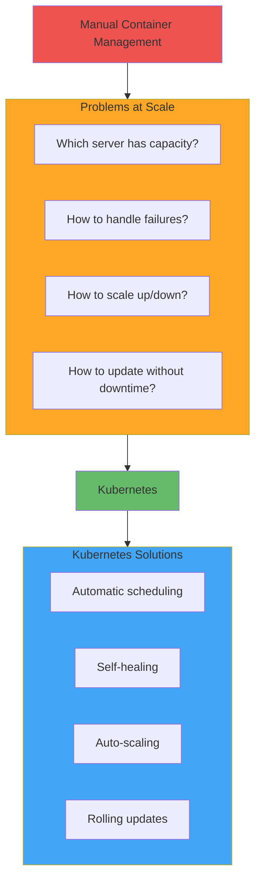
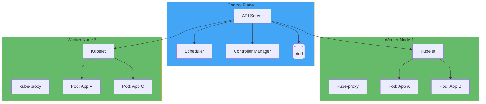

# Kubernetes (k8s) Basics

**Learning Objective**: Understand container orchestration, Kubernetes architecture, and how to deploy and manage applications at scale.

## What is Kubernetes?

Kubernetes (k8s) is an open-source container orchestration platform that automates deployment, scaling, and management of containerized applications.

### Why Kubernetes?



**Kubernetes provides:**
- **Automatic scaling** - Scale apps based on demand
- **Self-healing** - Restart failed containers automatically
- **Load balancing** - Distribute traffic across containers
- **Rolling updates** - Deploy without downtime
- **Secret management** - Secure credential storage
- **Service discovery** - Apps find each other automatically

## Kubernetes Architecture



### Components

**Control Plane:**
- **API Server** - Front-end for Kubernetes, handles all API requests
- **Scheduler** - Assigns pods to nodes based on resources
- **Controller Manager** - Maintains desired state (replicas, endpoints, etc.)
- **etcd** - Key-value store for cluster state

**Worker Nodes:**
- **Kubelet** - Agent running on each node, manages pods
- **kube-proxy** - Network proxy, handles routing
- **Container Runtime** - Docker, containerd, or CRI-O

## Core Concepts

### Pods

Smallest deployable unit in Kubernetes - one or more containers.

```yaml
# pod.yaml
apiVersion: v1
kind: Pod
metadata:
  name: salesforce-cli
  labels:
    app: sf-cli
spec:
  containers:
  - name: sf-cli
    image: salesforce/salesforcedx:latest-full
    command: ["/bin/bash"]
    args: ["-c", "while true; do sleep 30; done"]
    env:
    - name: SFDX_AUTOUPDATE_DISABLE
      value: "true"
    resources:
      requests:
        memory: "512Mi"
        cpu: "500m"
      limits:
        memory: "1Gi"
        cpu: "1000m"
```

```bash
# Create pod
kubectl apply -f pod.yaml

# List pods
kubectl get pods

# View pod details
kubectl describe pod salesforce-cli

# View logs
kubectl logs salesforce-cli

# Execute command in pod
kubectl exec -it salesforce-cli -- /bin/bash

# Delete pod
kubectl delete pod salesforce-cli
```

### Deployments

Manage replicas and rolling updates.

```yaml
# deployment.yaml
apiVersion: apps/v1
kind: Deployment
metadata:
  name: github-runner
  labels:
    app: github-runner
spec:
  replicas: 3
  selector:
    matchLabels:
      app: github-runner
  template:
    metadata:
      labels:
        app: github-runner
    spec:
      containers:
      - name: runner
        image: myregistry/salesforce-ci:latest
        env:
        - name: RUNNER_TOKEN
          valueFrom:
            secretKeyRef:
              name: github-secrets
              key: runner-token
        resources:
          requests:
            memory: "2Gi"
            cpu: "1000m"
          limits:
            memory: "4Gi"
            cpu: "2000m"
        volumeMounts:
        - name: workspace
          mountPath: /workspace
      volumes:
      - name: workspace
        emptyDir: {}
```

```bash
# Create deployment
kubectl apply -f deployment.yaml

# View deployments
kubectl get deployments

# Scale deployment
kubectl scale deployment github-runner --replicas=5

# Update image (rolling update)
kubectl set image deployment/github-runner \
  runner=myregistry/salesforce-ci:v2.0

# View rollout status
kubectl rollout status deployment/github-runner

# Rollback to previous version
kubectl rollout undo deployment/github-runner

# View rollout history
kubectl rollout history deployment/github-runner
```

### Services

Expose pods to network traffic.

```yaml
# service.yaml
apiVersion: v1
kind: Service
metadata:
  name: runner-service
spec:
  selector:
    app: github-runner
  ports:
  - protocol: TCP
    port: 80
    targetPort: 8080
  type: LoadBalancer
```

**Service Types:**
- **ClusterIP** (default) - Internal cluster IP only
- **NodePort** - Expose on each node's IP at a static port
- **LoadBalancer** - External load balancer (cloud providers)
- **ExternalName** - DNS CNAME record

```bash
# Create service
kubectl apply -f service.yaml

# List services
kubectl get services

# View service details
kubectl describe service runner-service

# Get external IP (for LoadBalancer)
kubectl get service runner-service -o jsonpath='{.status.loadBalancer.ingress[0].ip}'
```

### ConfigMaps

Manage configuration data.

```yaml
# configmap.yaml
apiVersion: v1
kind: ConfigMap
metadata:
  name: sf-config
data:
  ORG_ALIAS: "devhub"
  API_VERSION: "59.0"
  config.json: |
    {
      "instanceUrl": "https://login.salesforce.com",
      "apiVersion": "59.0"
    }
```

```bash
# Create from file
kubectl create configmap sf-config --from-file=config.json

# Create from literal values
kubectl create configmap sf-config \
  --from-literal=ORG_ALIAS=devhub \
  --from-literal=API_VERSION=59.0

# Use in pod
kubectl apply -f - <<EOF
apiVersion: v1
kind: Pod
metadata:
  name: sf-cli
spec:
  containers:
  - name: sf-cli
    image: salesforce/salesforcedx:latest-full
    envFrom:
    - configMapRef:
        name: sf-config
EOF
```

### Secrets

Manage sensitive data.

```yaml
# secret.yaml
apiVersion: v1
kind: Secret
metadata:
  name: sf-auth
type: Opaque
data:
  # Base64 encoded values
  auth-url: Zm9yY2UtY29tOi8vcGRm...
  client-id: M0FBMkNQeXg...
```

```bash
# Create secret from literal
kubectl create secret generic sf-auth \
  --from-literal=auth-url='force://...' \
  --from-literal=client-id='3AA2...'

# Create secret from file
kubectl create secret generic sf-auth \
  --from-file=auth.txt

# Use in pod
kubectl apply -f - <<EOF
apiVersion: v1
kind: Pod
metadata:
  name: deployer
spec:
  containers:
  - name: sf-cli
    image: salesforce/salesforcedx:latest-full
    env:
    - name: SFDX_AUTH_URL
      valueFrom:
        secretKeyRef:
          name: sf-auth
          key: auth-url
    command: ["/bin/bash", "-c"]
    args:
    - |
      echo "\$SFDX_AUTH_URL" > auth.txt
      sf org login sfdx-url --sfdx-url-file auth.txt --alias prod
      sf project deploy start --target-org prod
EOF
```

### Persistent Volumes

Store data that persists beyond pod lifecycle.

```yaml
# pv-pvc.yaml
# Persistent Volume
apiVersion: v1
kind: PersistentVolume
metadata:
  name: workspace-pv
spec:
  capacity:
    storage: 10Gi
  accessModes:
  - ReadWriteOnce
  persistentVolumeReclaimPolicy: Retain
  storageClassName: standard
  hostPath:
    path: /data/workspace

---
# Persistent Volume Claim
apiVersion: v1
kind: PersistentVolumeClaim
metadata:
  name: workspace-pvc
spec:
  accessModes:
  - ReadWriteOnce
  resources:
    requests:
      storage: 10Gi
  storageClassName: standard

---
# Use in Pod
apiVersion: v1
kind: Pod
metadata:
  name: runner
spec:
  containers:
  - name: runner
    image: salesforce-ci:latest
    volumeMounts:
    - name: workspace
      mountPath: /workspace
  volumes:
  - name: workspace
    persistentVolumeClaim:
      claimName: workspace-pvc
```

## Installing Kubernetes

### minikube (Local Development)

```bash
# macOS
brew install minikube

# Linux
curl -LO https://storage.googleapis.com/minikube/releases/latest/minikube-linux-amd64
sudo install minikube-linux-amd64 /usr/local/bin/minikube

# Start cluster
minikube start

# Check status
minikube status

# Access dashboard
minikube dashboard

# Stop cluster
minikube stop

# Delete cluster
minikube delete
```

### kubectl (CLI Tool)

```bash
# macOS
brew install kubectl

# Linux
curl -LO "https://dl.k8s.io/release/$(curl -L -s https://dl.k8s.io/release/stable.txt)/bin/linux/amd64/kubectl"
sudo install -o root -g root -m 0755 kubectl /usr/local/bin/kubectl

# Verify
kubectl version --client

# View cluster info
kubectl cluster-info

# View nodes
kubectl get nodes
```

## Essential kubectl Commands

### Viewing Resources

```bash
# Get all resources
kubectl get all

# Get specific resources
kubectl get pods
kubectl get deployments
kubectl get services
kubectl get nodes

# Wide output (more details)
kubectl get pods -o wide

# YAML output
kubectl get pod my-pod -o yaml

# JSON output
kubectl get pod my-pod -o json

# Watch for changes
kubectl get pods --watch

# Get from all namespaces
kubectl get pods --all-namespaces
```

### Describing Resources

```bash
# Detailed information
kubectl describe pod my-pod
kubectl describe deployment my-deployment
kubectl describe node node-name

# Events in namespace
kubectl get events --sort-by='.lastTimestamp'
```

### Managing Resources

```bash
# Create from file
kubectl apply -f deployment.yaml

# Create from directory
kubectl apply -f ./configs/

# Create from URL
kubectl apply -f https://example.com/deployment.yaml

# Delete resource
kubectl delete pod my-pod
kubectl delete -f deployment.yaml

# Edit resource
kubectl edit deployment my-deployment

# Replace resource
kubectl replace -f deployment.yaml
```

### Logs and Debugging

```bash
# View logs
kubectl logs my-pod

# Follow logs
kubectl logs -f my-pod

# Logs from specific container in pod
kubectl logs my-pod -c container-name

# Previous container logs (crashed container)
kubectl logs my-pod --previous

# Execute command in pod
kubectl exec my-pod -- ls /app

# Interactive shell
kubectl exec -it my-pod -- /bin/bash

# Port forward to local machine
kubectl port-forward pod/my-pod 8080:80

# Copy files to/from pod
kubectl cp my-pod:/path/to/file ./local-file
kubectl cp ./local-file my-pod:/path/to/file
```

## Complete Salesforce CI/CD Example

### namespace.yaml

```yaml
apiVersion: v1
kind: Namespace
metadata:
  name: salesforce-ci
```

### secrets.yaml

```yaml
apiVersion: v1
kind: Secret
metadata:
  name: github-secrets
  namespace: salesforce-ci
type: Opaque
stringData:
  runner-token: "YOUR_GITHUB_RUNNER_TOKEN"
  sfdx-auth-url: "force://..."
```

### deployment.yaml

```yaml
apiVersion: apps/v1
kind: Deployment
metadata:
  name: sf-runners
  namespace: salesforce-ci
spec:
  replicas: 3
  selector:
    matchLabels:
      app: sf-runner
  template:
    metadata:
      labels:
        app: sf-runner
    spec:
      containers:
      - name: runner
        image: myregistry/salesforce-ci:latest
        env:
        - name: RUNNER_TOKEN
          valueFrom:
            secretKeyRef:
              name: github-secrets
              key: runner-token
        - name: SFDX_AUTH_URL
          valueFrom:
            secretKeyRef:
              name: github-secrets
              key: sfdx-auth-url
        resources:
          requests:
            memory: "2Gi"
            cpu: "1"
          limits:
            memory: "4Gi"
            cpu: "2"
        volumeMounts:
        - name: workspace
          mountPath: /workspace
      volumes:
      - name: workspace
        emptyDir: {}
```

### Deploy Everything

```bash
# Create namespace
kubectl apply -f namespace.yaml

# Create secrets
kubectl apply -f secrets.yaml

# Deploy runners
kubectl apply -f deployment.yaml

# Verify deployment
kubectl get all -n salesforce-ci

# View logs
kubectl logs -f -l app=sf-runner -n salesforce-ci

# Scale up/down
kubectl scale deployment sf-runners --replicas=5 -n salesforce-ci
```

## Auto-Scaling

### Horizontal Pod Autoscaler (HPA)

```yaml
# hpa.yaml
apiVersion: autoscaling/v2
kind: HorizontalPodAutoscaler
metadata:
  name: sf-runner-hpa
  namespace: salesforce-ci
spec:
  scaleTargetRef:
    apiVersion: apps/v1
    kind: Deployment
    name: sf-runners
  minReplicas: 2
  maxReplicas: 10
  metrics:
  - type: Resource
    resource:
      name: cpu
      target:
        type: Utilization
        averageUtilization: 70
  - type: Resource
    resource:
      name: memory
      target:
        type: Utilization
        averageUtilization: 80
```

```bash
# Create HPA
kubectl apply -f hpa.yaml

# View HPA status
kubectl get hpa -n salesforce-ci

# Watch scaling events
kubectl get hpa -n salesforce-ci --watch
```

## Health Checks

### Liveness and Readiness Probes

```yaml
apiVersion: v1
kind: Pod
metadata:
  name: sf-api
spec:
  containers:
  - name: api
    image: sf-api:latest
    ports:
    - containerPort: 3000

    # Liveness: Is the container alive?
    livenessProbe:
      httpGet:
        path: /health
        port: 3000
      initialDelaySeconds: 30
      periodSeconds: 10
      timeoutSeconds: 5
      failureThreshold: 3

    # Readiness: Is the container ready to serve traffic?
    readinessProbe:
      httpGet:
        path: /ready
        port: 3000
      initialDelaySeconds: 5
      periodSeconds: 5
      timeoutSeconds: 3
      failureThreshold: 3

    # Startup: Has the application started?
    startupProbe:
      httpGet:
        path: /startup
        port: 3000
      initialDelaySeconds: 0
      periodSeconds: 10
      failureThreshold: 30  # Allow 5 minutes to start
```

## Best Practices

### 1. Use Namespaces

```bash
# Organize resources by environment
kubectl create namespace dev
kubectl create namespace staging
kubectl create namespace production

# Deploy to specific namespace
kubectl apply -f deployment.yaml -n production
```

### 2. Set Resource Limits

```yaml
resources:
  requests:  # Guaranteed resources
    memory: "1Gi"
    cpu: "500m"
  limits:    # Maximum resources
    memory: "2Gi"
    cpu: "1000m"
```

### 3. Use Labels and Selectors

```yaml
metadata:
  labels:
    app: salesforce-ci
    environment: production
    team: devops
    version: v1.2.3
```

```bash
# Select by labels
kubectl get pods -l app=salesforce-ci
kubectl get pods -l environment=production,team=devops
```

### 4. Use Health Checks

Always define liveness and readiness probes for production deployments.

### 5. Version Your Deployments

```yaml
image: myregistry/salesforce-ci:v1.2.3  # Specific version
# Not: image: myregistry/salesforce-ci:latest
```

## Troubleshooting

### Pod Won't Start

```bash
# Check pod status
kubectl get pod my-pod

# View detailed events
kubectl describe pod my-pod

# Check logs
kubectl logs my-pod

# Check previous logs if crashed
kubectl logs my-pod --previous
```

### Common Issues

**ImagePullBackOff:**
```bash
# Check image name and registry credentials
kubectl describe pod my-pod | grep -A 5 "Events"
```

**CrashLoopBackOff:**
```bash
# View logs from crashed container
kubectl logs my-pod --previous

# Check liveness probe configuration
kubectl describe pod my-pod | grep -A 10 "Liveness"
```

**Pending State:**
```bash
# Check node resources
kubectl describe nodes

# Check PVC status
kubectl get pvc

# Check events
kubectl get events --sort-by='.lastTimestamp'
```

## Interview Talking Points

1. **"We use Kubernetes to auto-scale our CI runners based on pipeline demand"**
   - Shows scalability thinking
   - Demonstrates cost optimization

2. **"Our deployments use rolling updates with health checks for zero downtime"**
   - Shows production readiness
   - Demonstrates reliability focus

3. **"We use namespaces to isolate dev, staging, and production environments"**
   - Shows organizational maturity
   - Demonstrates security awareness

4. **"HPA automatically scales our runners from 2 to 10 based on CPU usage"**
   - Shows advanced k8s knowledge
   - Demonstrates automation expertise

5. **"We use persistent volumes for workspace data across pod restarts"**
   - Shows stateful application understanding
   - Demonstrates operational thinking

## Quick Reference

| Command | Description |
|---------|-------------|
| `kubectl apply -f file.yaml` | Create/update resource |
| `kubectl get pods` | List pods |
| `kubectl describe pod name` | Detailed pod info |
| `kubectl logs -f pod-name` | Follow pod logs |
| `kubectl exec -it pod bash` | Get shell in pod |
| `kubectl scale deployment name --replicas=5` | Scale deployment |
| `kubectl rollout restart deployment/name` | Restart deployment |
| `kubectl get all` | List all resources |

## Next Steps

- **Related**: [Docker & Containers](./docker-containers) - Container fundamentals
- **Related**: [Custom Runners & Docker](../advanced/custom-runners-docker) - K8s for CI/CD
- **Practice**: Deploy a Salesforce CI runner on Kubernetes

---

**Key Takeaway**: Kubernetes is the industry standard for container orchestration. It provides automatic scaling, self-healing, and zero-downtime deployments. Master k8s to manage applications at enterprise scale with confidence.
