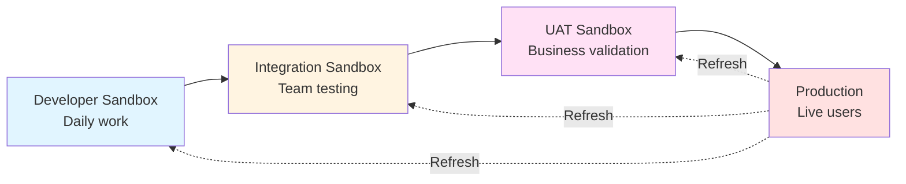

# Understanding Salesforce Environments

**Learning Objective**: Know the different types of Salesforce orgs and when to use each one in your DevOps workflow.

---

## The Word Document Analogy

Think of Salesforce environments like different copies of a Word document.

You have:
- **The REAL document** (the one your boss will read) - This is Production
- **A complete copy** where you test big changes - This is a Full Sandbox
- **A partial copy** with sample data for testing - This is a Partial Sandbox
- **Your personal draft** where you experiment freely - This is a Developer Sandbox
- **A temporary scratch copy** you create and delete as needed - This is a Scratch Org

You wouldn't make experimental changes directly to the document your boss is about to present, right? Same with Salesforce. You need safe places to work before touching production.

---

## Why Multiple Environments Matter

Here's what happens without proper environments:

Sarah (a developer) needs to test if a new validation rule works. She creates it directly in Production. Turns out, it blocks ALL opportunity saves. Sales team can't close deals. Panic ensues.

**With proper environments**, Sarah would:
1. Create the rule in her Developer sandbox
2. Test it thoroughly
3. Deploy to a Test sandbox for QA team to verify
4. Deploy to UAT for business users to validate
5. Finally deploy to Production with confidence

The rule still might have issues, but you catch them before they affect real users.

---

## Salesforce Environment Types Explained

### Production (The Real Deal)

**What it is**: Your live Salesforce org with real customer data, real users, real business processes.

**When to use it**:
- Only for final, tested deployments
- Never for development or experimentation
- Only deploy during approved maintenance windows

**Key facts**:
- Contains all your actual business data
- Users work here every day
- Downtime = lost revenue
- Changes here are permanent and affect everyone
- You can create sandboxes FROM production

**Cost**: Comes with your Salesforce license

**Australia Post context**: This is where 1000+ employees manage parcels, customers, and operations. Breaking this = very bad day.

---

### Full Sandbox (Exact Copy)

**What it is**: A complete copy of Production including all data and metadata.

**When to use it**:
- Major integration testing
- Performance testing with realistic data volumes
- User acceptance testing (UAT)
- Training environments
- Pre-production validation

**Key facts**:
- Refreshed from Production (usually monthly or quarterly)
- Contains copy of all production data
- Perfect for testing with real data volumes
- Expensive (only get a few with Enterprise edition)

**Typical use**: "Before we deploy this major release to Production, let's test everything in Full Sandbox with real data."

**Refresh frequency**: Quarterly (check your Salesforce edition)

---

### Partial Sandbox (Sample Data)

**What it is**: Copy of all metadata, but only a subset of data (based on a template you define).

**When to use it**:
- Feature testing with realistic data
- Integration testing
- Training
- When Full Sandbox is too expensive/slow

**Key facts**:
- You define which data gets copied (using templates)
- Faster to refresh than Full Sandbox
- Good middle ground between Dev and Full
- Refreshed every 5 days

**Example template**: "Copy all Accounts from NSW region, and their related Contacts and Opportunities from last 6 months"

**Typical use**: "QA team needs realistic data to test the new quote-to-cash flow."

---

### Developer Sandbox (Your Playground)

**What it is**: Copy of metadata only. No data (except some sample records you create).

**When to use it**:
- Daily development work
- Individual developer testing
- Building new features
- Learning and experimentation

**Key facts**:
- Each developer gets their own
- Refreshed daily (you can refresh anytime)
- Small storage limits
- Free (comes with most Salesforce editions)
- Fast to create and refresh

**Typical use**: "I'm building a new Apex trigger. I'll develop and test it in my Dev sandbox first."

**Australia Post context**: 50 developers might each have their own Dev sandbox to work independently.

---

### Scratch Orgs (Temporary Disposable Orgs)

**What it is**: Temporary Salesforce org created from a configuration file, exists for 1-30 days, then auto-deletes.

**When to use it**:
- Modern SFDX-based development
- Automated testing in CI/CD pipelines
- Quick experimentation
- Each feature branch gets its own org

**Key facts**:
- Created in seconds using Salesforce CLI
- Defined by a JSON config file (version controlled!)
- Automatically deleted after expiration
- Requires Dev Hub (special license)
- Perfect for CI/CD automation

**Example workflow**:
```bash
# Create a scratch org
sfdx force:org:create -f config/project-scratch-def.json -a feature-123

# Do your work...

# Delete when done
sfdx force:org:delete -u feature-123
```

**Why they're awesome**: Every developer can spin up clean orgs instantly. No waiting for sandbox refresh. No data conflicts.

**Australia Post context**: Modern teams use scratch orgs for development, sandboxes for longer-term testing and UAT.

---

## The Standard Environment Flow

Here's how changes typically flow through environments:

```
Developer Sandbox → Integration Sandbox → UAT Sandbox → Production
     (build)            (test)            (validate)      (deploy)
```

**Detailed example: Adding a new field to Account**

**Step 1: Development (Developer Sandbox)**
- Developer creates "Priority_Level__c" field
- Writes Apex code that uses it
- Tests locally
- Commits to Git (feature branch)

**Step 2: Integration (Integration Sandbox)**
- Code merged to main branch
- Pipeline automatically deploys to Integration
- Automated tests run
- Other developers' changes are here too
- Check: Do all the pieces work together?

**Step 3: UAT (User Acceptance Testing Sandbox)**
- Business users test the new field
- "Does it work the way we need it to?"
- Training happens here
- Business sign-off required

**Step 4: Production**
- Scheduled deployment window (e.g., Sunday 11 PM)
- Pipeline deploys to Production
- Monitoring confirms success
- Users see the new field Monday morning

**Total time**: Could be 1 week (or 1 day for hotfixes)

---

## Real Example: New Field Request at a Typical Company

Let's follow a realistic scenario:

**Monday 9 AM**: Marketing manager requests new field "Campaign_ROI__c" on Campaign object to track return on investment.

**Monday 10 AM**: Developer picks up the ticket, creates field in Developer sandbox, writes formula to calculate ROI, writes test class.

**Monday 2 PM**: Developer commits changes to Git, creates merge request. Pipeline validates changes automatically against Integration sandbox.

**Tuesday 9 AM**: Tech lead reviews merge request, approves. Pipeline deploys to Integration sandbox automatically.

**Tuesday 11 AM**: QA team tests in Integration. Finds a bug - formula doesn't handle null values. Developer fixes, commits, redeploys.

**Wednesday**: QA validates fix. Promotes to UAT sandbox for business user testing.

**Thursday**: Marketing team tests in UAT. Confirms it calculates correctly. Signs off.

**Friday**: Change is included in weekly production deployment window.

**Saturday 11 PM**: Automated pipeline deploys to Production.

**Sunday 12:15 AM**: Deployment complete. Slack notification sent to team.

**Monday 9 AM**: Marketing team starts using the new field. Total time: 1 week from request to production.

---

## Environment Strategy Visual



**Key points**:
- Changes flow left to right (Dev → Prod)
- Data flows right to left (Prod refreshes sandboxes)
- Each stage validates something different
- Automation moves changes through the flow

---

## Which Environment Should You Use? Quick Decision Tree

**Question 1: Are you building something new?**
- Yes → Developer Sandbox or Scratch Org

**Question 2: Are you testing with other developers' changes?**
- Yes → Integration Sandbox

**Question 3: Do you need real production data volumes?**
- Yes → Full Sandbox

**Question 4: Do you need some realistic data but not everything?**
- Yes → Partial Sandbox

**Question 5: Do business users need to validate?**
- Yes → UAT Sandbox

**Question 6: Is this going to real users?**
- Yes → Production (and you better have tested it!)

---

## Common Mistakes to Avoid

### Mistake 1: Developing directly in Production
**Why it's bad**: No safety net. Mistakes affect users immediately.

**What to do instead**: Always develop in Developer sandbox or scratch org.

### Mistake 2: Not refreshing sandboxes regularly
**Why it's bad**: Your sandbox diverges from Production. Tests become meaningless.

**What to do instead**: Schedule regular sandbox refreshes (monthly for Full, weekly for Partial).

### Mistake 3: Using Production data in Dev sandboxes
**Why it's bad**: Security risk. Performance issues with large data volumes.

**What to do instead**: Use Partial sandbox or create synthetic test data.

### Mistake 4: Skipping UAT
**Why it's bad**: Technical tests pass, but business users find it doesn't work for their process.

**What to do instead**: Always get business user sign-off in UAT before Production.

### Mistake 5: No clear promotion process
**Why it's bad**: Chaos. "Did this already go to Production?" "Which sandbox has the latest?"

**What to do instead**: Document your environment strategy. Follow it religiously.

---

## Hands-On Exercise: Set Up Your Free Developer Org

Let's get you a real Salesforce environment to practice with. This takes about 5 minutes.

**Step 1: Sign up for a free Developer Edition org**

1. Go to https://developer.salesforce.com/signup
2. Fill out the form (use your real email)
3. Check your email for activation link
4. Click the link and set your password
5. You now have a free Salesforce org! (Never expires)

**Step 2: Explore your new org**

1. Login at https://login.salesforce.com
2. Click the gear icon → Setup
3. Look around:
   - Objects and Fields
   - Apex Classes
   - Flows
   - Users

This is your playground. You can't break anything important. Experiment freely.

**Step 3: Enable Dev Hub (for scratch orgs later)**

1. In Setup, search for "Dev Hub"
2. Click "Dev Hub"
3. Toggle "Enable Dev Hub" to ON
4. This lets you create scratch orgs (we'll use this in later lessons)

**Step 4: Create a simple custom object**

1. Setup → Object Manager → Create → Custom Object
2. Object Name: "Learning_Note"
3. Fields: Add "Topic__c" (text) and "Key_Takeaway__c" (long text)
4. Save
5. You just modified metadata! Later we'll pull this via CLI.

**Validation**: You should now be able to:
- Login to your org
- Navigate Setup
- See your custom object in Object Manager
- Dev Hub is enabled

**Save these credentials** - you'll use this org throughout the course.

---

## Quick Check: Test Your Understanding

**Question 1**: Your QA team needs to test a major integration with realistic production data volumes. Which environment should they use?

<details>
<summary>Click to see answer</summary>

**Answer**: Full Sandbox

**Why**: It contains a complete copy of production data, perfect for testing with realistic volumes. Partial Sandbox could work if you can template the right data. Developer Sandbox has no data. Production is not for testing.

</details>

**Question 2**: What's the key difference between a sandbox and a scratch org?

<details>
<summary>Click to see answer</summary>

**Answer**: Sandboxes are long-lived copies of production refreshed periodically. Scratch orgs are temporary (1-30 days), created from config files, and automatically deleted.

**Why it matters**: Scratch orgs are better for modern CI/CD (each feature branch gets its own org). Sandboxes are better for longer testing cycles and UAT.

</details>

**Question 3**: You just refreshed your Full Sandbox. What happened to the changes you were testing in that sandbox?

<details>
<summary>Click to see answer</summary>

**Answer**: They're GONE. Refresh overwrites everything with a fresh copy from Production.

**Why this matters**: Always commit your changes to Git before refreshing. Or you lose your work.

**Pro tip**: This is why Dev sandboxes are safer for active development - they refresh faster and you're less likely to lose work since they refresh on demand.

</details>

---

## Key Takeaways

Before moving on, make sure you understand:

✅ **Production is sacred** - Only deploy tested, approved changes

✅ **Different environments serve different purposes** - Choose the right tool for the job

✅ **Changes flow Dev → Test → UAT → Prod** - Never skip stages

✅ **Sandboxes need regular refreshes** - Or they diverge from Production

✅ **Scratch orgs are the modern approach** - Temporary, fast, version-controlled

✅ **You need an environment strategy** - Document it, follow it, enforce it

---

## Up Next: Version Control with Git

Now you know WHERE changes happen (different environments). But HOW do you track WHAT changed between environments?

That's where version control comes in. Git is the foundation of modern DevOps. It lets you:
- Track every change ever made
- See who changed what and when
- Roll back when things break
- Work on multiple features simultaneously
- Merge changes from multiple developers

Without Git, you're flying blind. With Git, you have complete visibility and control.

Let's learn Git fundamentals: **[Version Control with Git →](/docs/foundations/version-control-git)**

---

**Pro tip**: If you haven't set up your Developer org yet, do it now before moving on. The later exercises build on having a real org to work with. Five minutes now saves confusion later.
