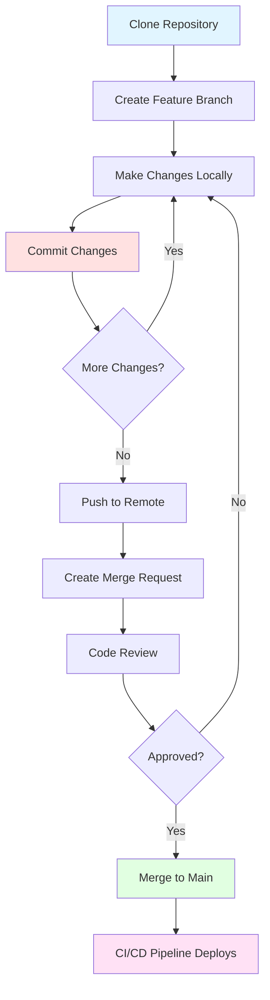

# Version Control Fundamentals with Git

**Learning Objective**: Understand how Git tracks changes and why it's essential for Salesforce DevOps.

---

## The Problem: Who Wins?

Developer A and Developer B both work on the Account page layout in their respective sandboxes.

Developer A adds 3 new fields to the layout. Developer B removes 2 old fields and rearranges sections.

Friday afternoon, both deploy to the Integration sandbox. Developer B deploys second.

**Result**: Developer A's changes are GONE. Completely overwritten. Hours of work lost.

Even worse? Nobody knows it happened until Monday when a business user reports "the new fields are missing."

Now comes the investigation:
- What exactly did Developer A change?
- What did Developer B change?
- How do we combine both sets of changes?
- How do we figure out who deployed what and when?

Salesforce's setup audit trail shows "System Administrator modified AccountLayout" twice. Not helpful.

**This is why you need version control.**

---

## Version Control: Your Time Machine for Code

Think of Google Docs' "See version history" and "Track changes" features. You can see:
- Every edit ever made
- Who made each edit
- When they made it
- What the document looked like at any point in time
- Revert to any previous version

Version control does this for code and configuration. Git is the industry-standard version control system.

**Simple definition**: Git tracks every change to every file in your project, forever.

---

## Git Basics for Absolute Beginners

Let's break down the key concepts with zero jargon:

### Repository (Your Project Folder with History)

A repository (or "repo") is just a folder with a hidden `.git` subdirectory that stores all the history.

```
my-salesforce-project/
  ├── .git/              ← History stored here (don't touch this)
  ├── force-app/         ← Your Salesforce metadata
  ├── config/            ← Configuration files
  └── README.md          ← Project documentation
```

**The magic**: The `.git` folder contains every version of every file, ever. But you only see the current version in your working directory.

### Commit (Saving a Checkpoint)

A commit is like saving your game progress. It's a snapshot of all your files at a specific moment.

Each commit includes:
- What changed (the actual file modifications)
- Who made the change (author name and email)
- When it was made (timestamp)
- Why it was made (commit message you write)

**Example commit**:
```
Commit: a3f2b9c
Author: Sarah Chen <sarah@example.com>
Date: 2025-10-26 14:35:22
Message: Add Priority_Level__c field to Account object

Files changed:
  + force-app/main/default/objects/Account/fields/Priority_Level__c.field-meta.xml
  + force-app/main/default/classes/AccountTriggerHandler.cls
```

**Important**: Commits are permanent. Once you commit, that snapshot exists forever in Git history.

### Branch (Parallel Timeline)

Branches let you work on features independently without affecting the main codebase.

Think of it like parallel universes:
- **main branch**: The stable, production-ready code
- **feature/add-dashboard**: Your experimental work on a new dashboard
- **bugfix/fix-validation**: Someone else fixing a bug

Each branch is a separate timeline. You can switch between them instantly.

**Visual**:
```
main:        A---B---C---F---G
                  \         /
feature:           D---E---
```

Points A, B, C are commits on main. Point C is where you created a feature branch. D and E are commits on that branch. F is where you merged the feature back into main.

### Merge (Combining Timelines)

Merging takes changes from one branch and combines them into another.

**Example**:
```bash
# You're on the feature branch, made 3 commits
git checkout main
git merge feature/add-dashboard
```

Git automatically combines the changes. If there are conflicts (both branches changed the same lines), Git asks you to resolve them manually.

### History (Your Time Machine)

Git remembers everything. You can:
- See all commits: `git log`
- See what changed in a commit: `git show a3f2b9c`
- Compare two versions: `git diff main feature`
- Go back to any point: `git checkout a3f2b9c`

**This is huge for debugging**: "The app worked yesterday. What changed?" Git shows you exactly what changed between yesterday and today.

---

## Why Salesforce Needs Git

Salesforce without Git is chaos. Here's why:

### Problem 1: Metadata Changes Are Invisible

You create a custom field in Salesforce UI. Where did that change get recorded?

In the Salesforce database. As XML. Hidden from view.

You can't easily:
- See what changed
- Compare versions
- Know who changed it
- Revert it

**With Git**: Every metadata change is a file change. Visible, trackable, revertable.

### Problem 2: Multiple People, Same Org

With traditional development, each developer has their own isolated environment. With Salesforce, 5 developers might share one sandbox.

Person A changes a field. Person B pulls the changes. Person C overwrites both.

**With Git**: Everyone commits their changes to Git. Conflicts are detected and resolved BEFORE they hit the shared sandbox.

### Problem 3: No Visibility

Your coworker deployed something to production last week. It broke. What did they deploy?

Salesforce shows: "System Administrator deployed ChangeSet_2024_10_26"

What was in that changeset? Good luck figuring it out.

**With Git**: Every deployment is a commit (or set of commits). You can see exactly what changed:
```bash
git log --since="1 week ago"
git show 7f8a2d1  # See exactly what this deployment changed
```

### Problem 4: No Rollback

A deployment goes wrong. You need to undo it. How?

Manually recreate the old configuration? From memory? While users are affected?

**With Git**: Rollback is one command:
```bash
git revert HEAD
git push
# Pipeline redeploys the previous version
```

### Problem 5: Who Changed What and When?

Your validation rule suddenly changed behavior. Who modified it? When? Why?

Salesforce audit trail: "User: System Administrator, Date: 10/15/2025, Action: Modified"

Not useful when 10 people use that login.

**With Git**:
```bash
git log --follow force-app/.../ValidationRule.xml
git blame force-app/.../ValidationRule.xml
```

Shows you the exact person, exact timestamp, and their commit message explaining why.

---

## Common Git Workflow Diagram

Here's how Git is typically used in Salesforce DevOps:



**Step-by-step**:
1. **Clone**: Get a copy of the Git repo on your computer
2. **Branch**: Create a feature branch (`feature/add-roi-field`)
3. **Change**: Modify Salesforce metadata locally
4. **Commit**: Save checkpoints as you work
5. **Push**: Send your commits to GitLab/GitHub
6. **Merge Request**: Ask team to review your changes
7. **Review**: Team reviews, suggests improvements
8. **Merge**: Changes combined into main branch
9. **Deploy**: CI/CD pipeline automatically deploys to Salesforce

---

## Hands-On Exercise: Your First Git Repository

Time to get your hands dirty. This exercise takes about 15 minutes.

### Step 1: Install Git

**Mac**:
```bash
# Check if already installed
git --version

# If not installed, install with Homebrew
brew install git
```

**Windows**:
1. Download from https://git-scm.com/download/win
2. Run the installer (use default settings)
3. Open Git Bash (installed with Git)

**Linux**:
```bash
sudo apt-get install git  # Ubuntu/Debian
sudo yum install git      # RedHat/CentOS
```

**Verify**:
```bash
git --version
# Should show: git version 2.x.x
```

### Step 2: Configure Git

Tell Git who you are:

```bash
git config --global user.name "Your Name"
git config --global user.email "your.email@example.com"

# Verify
git config --list
```

This info appears in every commit you make.

### Step 3: Create Your First Repository

```bash
# Create a project folder
mkdir my-first-repo
cd my-first-repo

# Initialize Git
git init

# You now have a Git repository!
```

What happened? Git created a hidden `.git` folder:

```bash
ls -la
# You'll see .git/ folder
```

### Step 4: Make Your First Commit

```bash
# Create a file
echo "# My First Salesforce DevOps Project" > README.md

# Check status
git status
# Shows: "Untracked files: README.md"

# Stage the file (prepare it for commit)
git add README.md

# Check status again
git status
# Shows: "Changes to be committed: new file README.md"

# Commit with a message
git commit -m "Initial commit - add README"

# You made your first commit!
```

### Step 5: View Commit History

```bash
git log

# Shows something like:
# commit a7f3c2d1e9b8... (HEAD -> main)
# Author: Your Name <your.email@example.com>
# Date:   Mon Oct 26 15:30:22 2025
#
#     Initial commit - add README
```

This is your commit history. Every change, tracked forever.

### Step 6: Make More Changes

```bash
# Add more content to README
echo "This repo will contain my Salesforce metadata." >> README.md

# See what changed
git diff
# Shows the line you added

# Stage and commit
git add README.md
git commit -m "Add project description to README"

# View history
git log --oneline
# Shows both commits
```

### Step 7: Create and Switch Branches

```bash
# Create a new branch
git branch feature/add-documentation

# See all branches
git branch
# Shows: * main (the * means you're currently on main)
#        feature/add-documentation

# Switch to the new branch
git checkout feature/add-documentation

# Or create and switch in one command
git checkout -b feature/another-feature

# See current branch
git branch
# Shows: * feature/another-feature
```

### Step 8: Make Changes on a Branch

```bash
# Make sure you're on feature branch
git checkout feature/add-documentation

# Create a new file
echo "# Documentation" > DOCS.md
echo "Coming soon..." >> DOCS.md

# Commit on this branch
git add DOCS.md
git commit -m "Add documentation file"

# Switch back to main
git checkout main

# List files
ls
# DOCS.md is NOT here! It only exists on the feature branch.

# Switch back to feature branch
git checkout feature/add-documentation

# List files
ls
# Now DOCS.md appears!
```

This is the power of branches - isolated workspaces.

### Step 9: Merge Your Feature Branch

```bash
# Switch to main
git checkout main

# Merge the feature branch
git merge feature/add-documentation

# Now main has the changes
ls
# DOCS.md is now in main too

# View history
git log --oneline --graph --all
# Shows the branch and merge visually
```

Congratulations! You've just learned the core Git workflow.

---

## Essential Git Commands Cheat Sheet

### Setup and Config
```bash
git init                              # Create new repository
git clone <url>                       # Copy existing repository
git config --global user.name "Name"  # Set your name
git config --global user.email "..."  # Set your email
```

### Basic Workflow
```bash
git status                            # See what's changed
git add <file>                        # Stage a file
git add .                             # Stage all changes
git commit -m "message"               # Commit staged changes
git push                              # Send commits to remote
git pull                              # Get updates from remote
```

### Branching
```bash
git branch                            # List branches
git branch <name>                     # Create branch
git checkout <branch>                 # Switch branch
git checkout -b <name>                # Create and switch
git merge <branch>                    # Merge branch into current
git branch -d <name>                  # Delete branch
```

### History and Inspection
```bash
git log                               # View commit history
git log --oneline                     # Compact history
git log --graph --all                 # Visual branch history
git show <commit>                     # Show commit details
git diff                              # See unstaged changes
git diff <branch1> <branch2>          # Compare branches
```

### Undo Changes
```bash
git checkout -- <file>                # Discard local changes
git reset HEAD <file>                 # Unstage a file
git revert <commit>                   # Create commit that undoes another
git reset --hard <commit>             # DANGER: Erase history (use carefully!)
```

### Remote Repositories
```bash
git remote add origin <url>           # Connect to remote repo
git remote -v                         # List remote connections
git push origin <branch>              # Push branch to remote
git pull origin <branch>              # Pull changes from remote
```

Print this out. Keep it next to your computer. You'll reference it constantly.

---

## Quick Check: Test Your Understanding

**Question 1**: What's the difference between `git add` and `git commit`?

<details>
<summary>Click to see answer</summary>

**Answer**:
- `git add` **stages** changes (prepares them for commit, but doesn't save them yet)
- `git commit` **saves** the staged changes as a permanent checkpoint in history

**Analogy**: `git add` is like putting items in your shopping cart. `git commit` is actually checking out and buying them.

**Why this matters**: You can stage multiple files, review them with `git status`, then commit them all at once with one message.

</details>

**Question 2**: Why can't you just use Salesforce's change history instead of Git?

<details>
<summary>Click to see answer</summary>

**Answer**: Salesforce's setup audit trail has critical limitations:
- Only stores 6 months of history
- Doesn't show the actual changes (just "User X modified Object Y")
- Can't compare versions
- Can't revert changes
- Can't handle conflicts when multiple people change the same thing
- Doesn't integrate with CI/CD pipelines

Git gives you: unlimited history, exact diffs, conflict resolution, rollback, and automation.

</details>

**Question 3**: You're working on `feature/new-dashboard` branch. You want to get the latest changes from `main` branch. What command do you use?

<details>
<summary>Click to see answer</summary>

**Answer**:
```bash
git checkout main      # Switch to main
git pull               # Get latest from remote
git checkout feature/new-dashboard  # Back to your feature
git merge main         # Bring main's changes into your feature
```

**Or** (more advanced):
```bash
git checkout feature/new-dashboard
git pull origin main   # Pull main and merge in one step
```

**Why this matters**: Keeps your feature branch up-to-date with the latest production code. Prevents merge conflicts later.

</details>

---

## Real Salesforce Example: Tracking Metadata Changes

Let's see Git in action with actual Salesforce metadata.

**Scenario**: You create a custom field in your Salesforce org, then track it with Git.

**Step 1**: Retrieve metadata from Salesforce
```bash
sfdx force:source:retrieve -m CustomObject:Account
```

**Step 2**: View the changes
```bash
git status
# Shows: modified: force-app/main/default/objects/Account/...
```

**Step 3**: See exactly what changed
```bash
git diff
```

Output:
```xml
+ <fields>
+   <fullName>Priority_Level__c</fullName>
+   <label>Priority Level</label>
+   <type>Picklist</type>
+   <valueSet>
+     <value>High</value>
+     <value>Medium</value>
+     <value>Low</value>
+   </valueSet>
+ </fields>
```

Now you can SEE the new field in code form!

**Step 4**: Commit the change
```bash
git add force-app/
git commit -m "Add Priority_Level__c field to Account object

This field will be used by sales team to prioritize follow-ups.
Includes High/Medium/Low picklist values."
```

**Step 5**: Later, if you need to see when this was added
```bash
git log --all --grep="Priority"
# Shows the commit where you added this field

git show <commit-id>
# Shows exactly what you added
```

This is DevOps in action. Every Salesforce change is tracked, documented, and reversible.

---

## Key Takeaways

Before moving on, make sure you understand:

✅ **Git tracks every change** - Full history of every file, forever

✅ **Commits are checkpoints** - Snapshots of your work with who/when/why

✅ **Branches enable parallel work** - Multiple features in progress simultaneously

✅ **Merging combines work** - Brings changes from different branches together

✅ **Git prevents data loss** - Can always recover previous versions

✅ **Git enables collaboration** - Multiple people can work without overwriting each other

---

## Up Next: Salesforce Metadata Deep Dive

You understand Git now. You can track changes. But WHAT exactly are you tracking?

Salesforce stores everything as metadata - XML files that define objects, fields, code, layouts, everything.

Understanding metadata is critical because:
- You'll see it in every Git commit
- Deployments move metadata between orgs
- Dependencies in metadata cause deployment failures
- Different metadata types have different rules

Let's demystify Salesforce metadata: **[Salesforce Metadata Explained →](/docs/foundations/salesforce-metadata)**

---

**Pro tip**: The best way to learn Git is to use it daily. Even if you're working alone, commit often. Write good commit messages. Future you will thank present you when you need to find when something changed.
