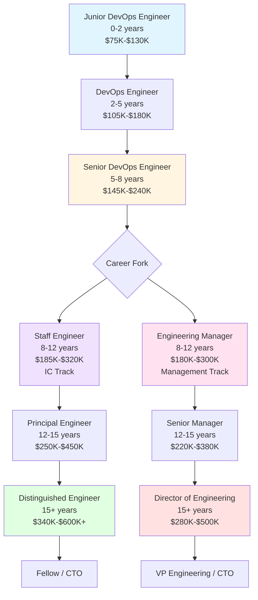

# DevOps Career Progression Roadmap

**Purpose**: Navigate your career from junior engineer to technical executive with clear milestones, skills, and strategies at each level.

---

## Career Ladder Overview



---

## Level 1: Junior DevOps Engineer

**Years of Experience:** 0-2 years
**Total Compensation:** $75K-$130K
**Alternative Titles:** Associate DevOps Engineer, DevOps Engineer I, Platform Engineer I

### Core Responsibilities

```markdown
Daily work:
- Execute deployment scripts written by others
- Monitor CI/CD pipelines and report failures
- Create/update documentation
- Fix minor infrastructure issues
- Respond to tickets from development teams
- Learn from code reviews
- Shadow senior engineers

Scope:
- Individual tasks assigned by senior engineers
- Impact: Single service or small component
- No architectural decisions
- Heavy guidance and oversight
```

### Required Skills

**Technical (Must Have):**
```yaml
Version Control:
  - Git basics (clone, commit, push, pull, branch, merge)
  - GitHub/GitLab workflows
  - Pull request creation

CI/CD:
  - Understanding of build → test → deploy flow
  - Execute existing pipelines
  - Debug basic pipeline failures

Cloud (Basic):
  - AWS/Azure fundamentals
  - EC2, S3, RDS basics
  - Understanding of cloud pricing

Salesforce:
  - SFDX CLI commands
  - Deploy to sandbox
  - Basic Apex understanding
  - Metadata structure

Scripting:
  - Bash or PowerShell basics
  - Simple automation scripts
  - Log file parsing

Linux:
  - Command line navigation
  - File permissions
  - Process management (ps, kill, top)
```

**Soft Skills:**
```markdown
✅ Learning agility - quickly pick up new tools
✅ Communication - ask questions, update status
✅ Documentation - write clear runbooks
✅ Time management - prioritize tickets
✅ Collaboration - work well with team
❌ Don't need: Leadership, project management, architecture
```

### Key Milestones

```markdown
Month 3:
☐ Deployed to sandbox successfully 10+ times
☐ Fixed first production incident (with guidance)
☐ Wrote first automation script
☐ Completed onboarding checklist

Month 6:
☐ Independently handle tier-1 incidents
☐ Created/updated 5+ documentation pages
☐ Contributed to pipeline improvements
☐ Zero repeat mistakes

Month 12:
☐ Own one small service end-to-end
☐ Mentor new hires on basic tasks
☐ Propose and implement first improvement
☐ Starting to review junior code

Month 18-24:
☐ Ready for promotion to DevOps Engineer
☐ Can work independently on well-defined tasks
☐ Consistently deliver quality work on time
☐ Actively participating in team discussions
```

### Career Advancement Strategy

**Skills to Develop:**
1. Master Git workflows (branching strategies, rebase, cherry-pick)
2. Build 3 end-to-end CI/CD pipelines from scratch
3. Get AWS Cloud Practitioner + Platform Developer I certifications
4. Learn Docker & basic Kubernetes
5. Automate repetitive tasks you currently do manually

**Common Pitfalls:**
- ❌ Staying in comfort zone (only doing what you know)
- ❌ Not asking questions (afraid to look stupid)
- ❌ Not documenting your work
- ❌ Waiting for tasks instead of identifying problems

**Promotion Criteria:**
```markdown
To move to DevOps Engineer:

Technical:
✅ Can design and build CI/CD pipelines independently
✅ Debugs complex pipeline failures
✅ Writes maintainable code/scripts
✅ Understands system architecture

Impact:
✅ Delivers projects independently
✅ Reduces manual work through automation
✅ Improves deployment reliability
✅ Helps unblock other engineers

Soft skills:
✅ Communicates proactively
✅ Takes ownership of problems
✅ Learns from mistakes
✅ Contributes to team culture
```

---

## Level 2: DevOps Engineer

**Years of Experience:** 2-5 years
**Total Compensation:** $105K-$180K
**Alternative Titles:** DevOps Engineer II, Platform Engineer, SRE

### Core Responsibilities

```markdown
Daily work:
- Design and implement CI/CD pipelines
- Automate deployment processes
- Troubleshoot production incidents
- Optimize build times and reliability
- Write IaC (Terraform, CloudFormation)
- Code reviews for junior engineers
- Participate in on-call rotation
- Collaborate with developers on requirements

Scope:
- Own 2-3 services or complete features
- Impact: Team level (5-15 developers)
- Some architectural input
- Work independently with minimal guidance
```

### Required Skills

**Technical (Must Have):**
```yaml
CI/CD (Advanced):
  - GitHub Actions, Jenkins, or GitLab CI mastery
  - Complex workflows (matrix builds, parallel jobs)
  - Deployment strategies (blue-green, canary)
  - Pipeline optimization (caching, parallelization)

Infrastructure as Code:
  - Terraform or CloudFormation proficiency
  - Module design and reusability
  - State management
  - Multi-environment deployments

Containers:
  - Docker (build, optimize, multi-stage)
  - Kubernetes basics (pods, deployments, services)
  - Container registries (ECR, Docker Hub)
  - Basic helm charts

Cloud (Intermediate):
  - VPC, IAM, security groups
  - Load balancers, auto-scaling
  - RDS, S3, CloudFront
  - Cost optimization basics

Monitoring:
  - CloudWatch, Datadog, or similar
  - Log aggregation (Splunk, ELK)
  - Alerting setup
  - Dashboard creation

Salesforce:
  - Advanced SFDX (packages, scratch orgs)
  - Apex testing strategies
  - Metadata API
  - Org shape management
```

**Soft Skills:**
```markdown
✅ Project management - manage small projects end-to-end
✅ Cross-team collaboration - work with dev, QA, product
✅ Technical writing - create comprehensive documentation
✅ Incident management - lead incident response
✅ Mentorship - guide junior engineers
```

### Key Milestones

```markdown
Year 1 at this level:
☐ Built 3+ production CI/CD pipelines from scratch
☐ Reduced deployment time by 50%+ on at least one service
☐ Responded to 20+ production incidents
☐ Automated away at least 10 hours/week of manual work
☐ Mentored 1-2 junior engineers

Year 2-3:
☐ Designed multi-environment deployment strategy
☐ Implemented monitoring for 5+ services
☐ Led at least one major infrastructure project
☐ Prevented multiple incidents through proactive work
☐ Presented at team/company tech talks

Ready for Senior:
☐ Work independently on complex problems
☐ Make architectural decisions for your domain
☐ Unblock other engineers regularly
☐ Drive projects to completion
☐ Have team-wide impact
```

### Career Advancement Strategy

**Skills to Develop:**
1. **Architecture**: Understand system design patterns
2. **Leadership**: Start leading small projects
3. **Communication**: Write design docs, give presentations
4. **Depth**: Become expert in 1-2 areas (K8s, Security, Performance)
5. **Breadth**: Understand full stack (frontend, backend, database)

**Certifications:**
- ✅ AWS Solutions Architect Associate or DevOps Engineer
- ✅ Platform Developer II
- ✅ CKAD (Kubernetes)

**Projects That Stand Out:**
```markdown
1. Migration project
   "Led migration of 20 services from Jenkins to GitHub Actions,
   reducing deployment time by 60%"

2. Cost optimization
   "Reduced AWS costs by $50K/year through rightsizing and
   automated scheduling"

3. Reliability improvement
   "Decreased production incidents by 70% through improved
   monitoring and automated rollbacks"

4. Developer experience
   "Built self-service deployment platform, reducing DevOps
   ticket volume by 40%"
```

**Common Pitfalls:**
- ❌ Staying too tactical (only executing, not designing)
- ❌ Not building relationships with other teams
- ❌ Not documenting your impact (for promotion case)
- ❌ Avoiding on-call or incident response

**Promotion Criteria:**
```markdown
To move to Senior DevOps Engineer:

Technical:
✅ Architects complex systems independently
✅ Demonstrates deep expertise in 2+ areas
✅ Makes sound technical decisions with long-term view
✅ Handles ambiguous problems effectively

Impact:
✅ Delivers major projects with team-wide impact
✅ Improves developer productivity measurably
✅ Reduces costs or improves reliability significantly
✅ Unblocks other engineers regularly

Leadership:
✅ Mentors multiple junior/mid engineers
✅ Leads technical discussions
✅ Influences team direction
✅ Represents team in cross-team initiatives
```

---

## Level 3: Senior DevOps Engineer

**Years of Experience:** 5-8 years
**Total Compensation:** $145K-$240K
**Alternative Titles:** Senior Platform Engineer, Senior SRE, DevOps Engineer III

### Core Responsibilities

```markdown
Daily work:
- Design and implement complex, multi-service systems
- Lead infrastructure projects from inception to completion
- Mentor junior and mid-level engineers
- Participate in architecture reviews
- Define best practices and standards
- Drive incident post-mortems and follow-up
- Optimize for cost, performance, and reliability
- Collaborate with leadership on roadmap

Scope:
- Own critical infrastructure components
- Impact: Department level (20-50+ developers)
- Makes architectural decisions
- High autonomy, sets own priorities
```

### Required Skills

**Technical (Must Have):**
```yaml
All previous skills, plus:

Architecture:
  - Design distributed systems
  - Microservices patterns
  - Service mesh understanding
  - Database scaling strategies
  - Caching strategies (Redis, CDN)

Kubernetes (Advanced):
  - Cluster management and upgrades
  - Custom operators
  - Advanced networking (Istio, Linkerd)
  - Security policies
  - Performance tuning

Security:
  - OWASP Top 10
  - Security scanning (Snyk, Trivy)
  - Secrets management (Vault, AWS Secrets Manager)
  - Compliance (SOC2, HIPAA basics)
  - Zero-trust architecture

Performance:
  - Application profiling
  - Load testing strategies
  - Database optimization
  - CDN configuration
  - Query optimization

Disaster Recovery:
  - Backup strategies
  - Multi-region architectures
  - RTO/RPO planning
  - Chaos engineering basics
```

**Soft Skills:**
```markdown
✅ Leadership - lead projects and people (informal)
✅ Strategic thinking - long-term planning
✅ Influence - drive change without authority
✅ Communication - explain complex topics simply
✅ Mentorship - develop other engineers
✅ Stakeholder management - work with product, exec
```

### Key Milestones

```markdown
Year 1 at Senior:
☐ Led 2+ major infrastructure initiatives
☐ Designed architecture for at least one critical system
☐ Mentored 2+ engineers to promotion
☐ Reduced MTTR or improved availability measurably
☐ Drove adoption of new technology/practice

Years 2-3:
☐ Recognized as go-to expert in 2+ domains
☐ Influenced company-wide technical decisions
☐ Led incident response for major outages
☐ Improved team processes significantly
☐ Spoken at external conferences or meetups

Ready for Staff/Manager:
☐ Organization-wide impact
☐ Deep expertise recognized internally and externally
☐ Consistently unblocks entire teams
☐ Drives strategic initiatives
☐ Clear leadership presence
```

### The Career Fork: IC vs Management

At Senior level, you must choose a path:

**Path A: Individual Contributor (IC) → Staff Engineer**
```markdown
Pros:
✅ Stay technical
✅ Deep expertise
✅ High leverage through architecture
✅ No people management headaches
✅ Often higher comp at senior levels

Cons:
❌ Influence through expertise, not authority
❌ Fewer direct reports (maybe 0)
❌ Can't make hiring/firing decisions
❌ Less exposure to business strategy

Best for:
- Love coding and architecture
- Don't enjoy people management
- Want deep technical impact
- Prefer working on systems over managing people
```

**Path B: Management → Engineering Manager**
```markdown
Pros:
✅ Broader impact through team
✅ Develop people
✅ More business exposure
✅ Clearer path to executive roles
✅ Hiring/budget authority

Cons:
❌ Less hands-on technical work
❌ People problems are hard
❌ Performance reviews, 1-on-1s, hiring
❌ Politics and stakeholder management
❌ On-call for your team's issues

Best for:
- Enjoy developing people
- Want to multiply impact through others
- Interested in business strategy
- Like organization building
```

**How to Choose:**

Try mini-experiments:
1. Mentor 2-3 people intensively for 6 months
2. Lead a project with 5+ people
3. Shadow your manager for a week
4. Talk to ICs and managers about their day-to-day

**You can switch between tracks**, especially early. Many CTOs started IC, went to management, then back to IC.

### Career Advancement Strategy

**For IC Track (→ Staff Engineer):**

1. **Build expertise recognized beyond your team**
   - Write blog posts, give talks
   - Contribute to open source
   - Be the go-to person for 2-3 domains

2. **Drive org-wide initiatives**
   - Not just your team, but multiple teams
   - Solve problems that affect 50+ engineers

3. **Multiply your impact**
   - Create frameworks/tools others use
   - Mentor multiple engineers
   - Influence architecture across teams

4. **Demonstrate strategic thinking**
   - Multi-quarter planning
   - Technical roadmaps
   - Cost/benefit analysis

**For Management Track (→ Engineering Manager):**

1. **Develop leadership skills**
   - Lead projects with 5-10 people
   - Run sprint planning, retros
   - Handle conflicts between team members

2. **Practice people management**
   - Mentoring → coaching
   - Give harder feedback
   - Help people with career development

3. **Learn the business**
   - Understand product strategy
   - Learn about budgets and headcount
   - Build relationships with product and stakeholders

4. **Show management aptitude**
   - People come to you with problems
   - You enjoy helping people grow
   - You can make hard people decisions

---

## Level 4A: Staff Engineer (IC Track)

**Years of Experience:** 8-12 years
**Total Compensation:** $185K-$320K (FAANG: $400K-$550K)
**Alternative Titles:** Staff Platform Engineer, Staff SRE, Principal Engineer I

### Core Responsibilities

```markdown
Daily work:
- Define technical strategy for multiple teams
- Design systems that scale to millions of users
- Lead critical cross-team initiatives
- Mentor senior engineers
- Review architecture for entire department
- Lead incident response for major outages
- Represent engineering in leadership meetings
- Drive technology adoption and standards

Scope:
- Own critical company-wide infrastructure
- Impact: Organization level (50-200+ engineers)
- Strategic technical decisions
- Set technical direction
```

### Required Skills

**Technical (Expert Level):**
```yaml
Everything previous, plus:

System Design:
  - Design for 10M+ users
  - CAP theorem application
  - Consistency models
  - Distributed consensus (Raft, Paxos)
  - Event-driven architectures

Performance:
  - Performance modeling
  - Capacity planning
  - Database sharding strategies
  - CDN edge computing
  - Optimize for cost at scale

Reliability:
  - 99.99% uptime design
  - Chaos engineering
  - Disaster recovery at scale
  - Multi-region active-active
  - Graceful degradation

Leadership:
  - Technical roadmap creation
  - RFC/design doc processes
  - Technology selection and evaluation
  - Technical debt management
  - Risk assessment
```

**Soft Skills:**
```markdown
✅ Executive presence - influence VPs and C-level
✅ Strategic vision - see 2-3 years ahead
✅ Consensus building - align multiple teams
✅ Technical teaching - upskill entire org
✅ Project leadership - lead complex initiatives
✅ Conflict resolution - handle disagreements
```

### Key Responsibilities

**1. Technical Strategy:**
```markdown
Example: "Design the next-generation deployment platform"
- Research options (Kubernetes, serverless, hybrid)
- Write RFC with pros/cons
- Build consensus among 10+ teams
- Create migration roadmap
- Guide implementation over 12+ months
```

**2. Critical Problem Solving:**
```markdown
Example: "Database is at 90% capacity, will hit limit in 3 months"
- Evaluate options (vertical scale, sharding, new DB)
- Design sharding strategy
- Lead implementation across 6 teams
- Ensure zero downtime migration
```

**3. Multiplying Impact:**
```markdown
Example: "Deployments are unreliable across the company"
- Build deployment framework used by 100+ services
- Write comprehensive documentation
- Train 50+ engineers
- Result: 90% reduction in failed deployments
```

### Career Advancement Strategy

**To Principal Engineer:**
```markdown
Requirements:
1. Company-wide impact on critical systems
2. Recognized expert (internally and industry)
3. Strategic technical vision 2-3 years out
4. Consistently delivers major initiatives
5. Develops other senior/staff engineers

Timeline: 3-5 years at Staff
Success rate: ~30% of Staff engineers reach Principal
```

**Getting Stuck:**
```markdown
Why some Staff engineers don't progress:

❌ Too tactical - still writing code 80% of time
❌ Limited scope - impact stays within 1-2 teams
❌ Poor communication - can't influence stakeholders
❌ Lone wolf - doesn't develop others
❌ Technology-focused - ignores business impact

Fix:
✅ Delegate implementation, focus on architecture
✅ Work on problems affecting 100+ engineers
✅ Write blog posts, give talks, build influence
✅ Mentor 5+ engineers actively
✅ Connect technical work to business outcomes
```

---

## Level 4B: Engineering Manager (Management Track)

**Years of Experience:** 8-12 years
**Total Compensation:** $180K-$300K (FAANG: $350K-$450K)
**Alternative Titles:** Development Manager, Platform Team Lead

### Core Responsibilities

```markdown
Daily work:
- Manage 5-10 engineers (1-on-1s, performance reviews)
- Hiring and onboarding
- Sprint planning and project management
- Remove blockers for team
- Stakeholder communication
- Budget and resource planning
- Career development for team
- Some technical work (20-30%)

Scope:
- Responsible for team output and happiness
- Impact: Through your team (5-10 people)
- People decisions
- Balance technical and organizational needs
```

### Required Skills

**Technical:**
```markdown
- Maintain enough technical depth to:
  ✅ Review architecture decisions
  ✅ Understand team's challenges
  ✅ Debug critical issues with team
  ✅ Evaluate technical candidates
  ✅ Make build vs buy decisions

- You DON'T need to:
  ❌ Write production code daily
  ❌ Be the best coder on team
  ❌ Know every implementation detail
```

**People Management:**
```yaml
1-on-1s:
  - Weekly with each report
  - Career development discussions
  - Performance feedback
  - Personal support

Hiring:
  - Write job descriptions
  - Source candidates
  - Interview (behavioral and technical screen)
  - Make offers and close candidates
  - Target: Hire 2-4 people per year

Performance Management:
  - Set clear expectations
  - Give continuous feedback
  - Performance reviews (quarterly/annual)
  - Manage underperformers
  - Promotion cases for team

Team Building:
  - Build team culture
  - Resolve conflicts
  - Foster collaboration
  - Celebrate wins
  - Handle departures
```

**Business Skills:**
```markdown
✅ Project management - deliver on time, on budget
✅ Stakeholder management - manage up and across
✅ Prioritization - ruthless focus on impact
✅ Communication - translate between tech and business
✅ Budget management - understand costs and ROI
```

### A Week in the Life

```markdown
Monday:
- 9-10am: Leadership team meeting
- 10am-12pm: 1-on-1s with 4 reports (30 min each)
- 12-1pm: Interview candidate
- 2-3pm: Sprint planning with team
- 3-4pm: Product sync meeting
- 4-5pm: Clear blockers, emails

Tuesday:
- 9-10am: Architecture review with Staff engineer
- 10-11am: Interview debrief
- 11am-12pm: 1-on-1s (2 more reports)
- 1-2pm: All-hands meeting
- 2-4pm: Strategic planning (roadmap, OKRs)
- 4-5pm: Peer manager sync

Wednesday:
- 9-10am: Performance review writing
- 10-12pm: Incident response (help team debug)
- 1-3pm: Hiring: screen resumes, schedule interviews
- 3-5pm: Work on promotion case for team member

Thursday:
- 9-11am: Back-to-back interviews (3 candidates)
- 11am-12pm: Team standup
- 1-2pm: 1-on-1 with manager
- 2-3pm: Cross-team collaboration meeting
- 3-5pm: Handle team issues, unblock work

Friday:
- 9-11am: Write technical strategy doc
- 11am-12pm: Team retro
- 1-2pm: Skip level 1-on-1 (with report's report)
- 2-4pm: Technical work (review code, infrastructure)
- 4-5pm: Weekly reflection, plan next week

% of time:
- 30% 1-on-1s and people management
- 25% Meetings (leadership, stakeholders, cross-team)
- 20% Hiring and interviews
- 15% Strategic planning and documentation
- 10% Technical work
```

### Common Challenges

**Challenge 1: Not Enough Time for Technical Work**
```markdown
Reality: You'll miss coding
Solution:
- Accept you're not a full-time IC anymore
- Stay technical through code reviews, architecture
- Carve out "maker time" (4 hours/week)
- Don't be on critical path for implementation
```

**Challenge 2: Underperformer on Team**
```markdown
Situation: Team member not meeting expectations
Process:
1. Give clear, direct feedback (document it)
2. Create performance improvement plan (30-60-90 days)
3. Weekly check-ins with specific goals
4. If no improvement, work with HR to let them go
5. Support remaining team through transition

Mistake: Waiting too long to address
Correct: Address within 2 weeks of noticing issue
```

**Challenge 3: Retention - Top Performer Considering Leaving**
```markdown
What to do:
1. Regular 1-on-1s to catch early (don't wait for resignation)
2. Understand their motivations (money, growth, culture?)
3. If fixable: Work with leadership to make counter-offer
4. If not fixable: Help them transition gracefully

Reality: You'll lose 1-2 people per year
Goal: Minimize regrettable attrition
```

### Career Advancement Strategy

**To Senior Manager:**
```markdown
Demonstrate:
1. Team impact - consistent delivery, low attrition
2. Grow team from 5 to 10+ people successfully
3. Hire 5+ engineers (good hit rate)
4. Develop engineers to promotion
5. Handle complex people situations
6. Strategic thinking beyond just team

Timeline: 3-5 years as Manager
```

---

## Level 5A: Principal Engineer

**Years of Experience:** 12-15+ years
**Total Compensation:** $250K-$450K (FAANG: $550K-$800K)

### Core Responsibilities

```markdown
- Define technical vision for entire engineering org
- Make critical technology choices affecting 100s of engineers
- Lead company-wide initiatives (multi-quarter, multi-team)
- Represent company in industry (conferences, open source)
- Solve the hardest technical problems
- Grow Staff engineers to Principal level
```

### Impact Level

```markdown
Examples of Principal-level impact:

"Designed and led migration from monolith to microservices
across 50 services, 150 engineers, 18 months. Zero downtime.
Improved deployment frequency from weekly to 100x/day."

"Created company's multi-region disaster recovery strategy.
Achieved 99.99% uptime (from 99.5%). Now serving 10M+ users
across 3 continents."

"Led evaluation and adoption of Kubernetes, replacing legacy
orchestration. Trained 100+ engineers. Reduced infrastructure
costs by $2M/year while improving reliability."
```

### Career Path from Here

**Option 1: Distinguished Engineer / Fellow**
- Industry-wide recognition
- Solve novel problems
- 15-20+ years experience
- $340K-$600K+ (FAANG: $800K-$1.2M+)
- Very rare (0.1% of engineers)

**Option 2: Switch to Management → Director**
- Less common but possible
- Leverage technical credibility
- Still stay close to technology

**Option 3: CTO or Founding Engineer at Startup**
- Use expertise to build from scratch
- Equity upside
- High risk, high reward

---

## Level 5B: Senior Manager / Director

**Years of Experience:** 12-15+ years
**Total Compensation:** $220K-$380K (FAANG: $450K-$650K)

### Core Responsibilities

```markdown
- Manage managers (2-4 teams, 20-40 engineers total)
- Department-level strategy and planning
- Budget management ($5M-$20M+)
- Org design and structure
- Cross-functional leadership
- Executive communication
- Very little hands-on technical work
```

### Career Path from Here

**Director → VP Engineering → CTO/COO**
- Manage 50-200+ engineers
- $280K-$500K+ (FAANG: $650K-$1M+)
- Executive leadership team
- Board presentations
- Company-wide strategy

---

## Comparing IC vs Management at Senior Levels

| Aspect | Principal Engineer (IC) | Director (Management) |
|--------|-------------------------|----------------------|
| **Technical Depth** | Expert, cutting-edge | Understands, delegates |
| **People Management** | 0 direct reports | 20-40+ indirect reports |
| **Impact Type** | Through architecture & systems | Through people & organization |
| **Day-to-Day** | Design, review, unblock | Meetings, 1-on-1s, strategy |
| **Meetings** | 20-30% of time | 60-70% of time |
| **Coding** | 10-20% | 0-5% |
| **Career Ceiling** | Fellow / CTO | CTO / COO / CEO |
| **Typical Comp** | Higher at peak IC levels | Higher at executive levels |
| **Job Security** | Very high (rare skillset) | Moderate (reorgs happen) |
| **Stress Sources** | Technical complexity | People problems, politics |

---

## Switching Between Tracks

**IC → Management (More Common)**
```markdown
Why switch:
- Want broader impact
- Interested in business strategy
- Enjoy developing people
- Hit ceiling as IC at current company

How to prepare:
1. Mentor 3-5 people for 12+ months
2. Lead cross-team projects
3. Shadow managers
4. Take management training
5. Apply for team lead or manager role

Success rate: ~70% make successful transition
Risk: You'll miss coding
```

**Management → IC (Less Common)**
```markdown
Why switch:
- Miss hands-on technical work
- People management burnout
- Want to avoid politics
- More interested in building than organizing

Challenges:
- Technical skills may have atrophied
- Perception as "failed manager"
- May need to step back a level (Director → Staff)

How to do it:
1. Stay technical as manager (20-30% coding)
2. Be honest about motivations
3. May need to switch companies
4. Expect 6-12 month ramp-up period

Success rate: ~50% make successful transition
```

---

## Actionable Career Strategies by Level

### For Junior/Mid (0-5 years): Build Fundamentals

```markdown
Focus on:
1. ✅ Technical excellence - master the basics
2. ✅ Consistent delivery - build trust
3. ✅ Learning agility - pick up new tools quickly
4. ✅ Communication - document and explain well

Avoid:
❌ Job hopping too frequently (stay 18-24 months minimum)
❌ Only working on tickets (propose improvements)
❌ Staying in comfort zone (seek stretch projects)

Growth hacks:
- Volunteer for on-call (learn production)
- Automate repetitive tasks
- Write blog posts about what you learn
- Get 2-3 certifications
```

### For Senior (5-8 years): Build Influence

```markdown
Focus on:
1. ✅ Lead projects end-to-end
2. ✅ Mentor 2-3 junior engineers
3. ✅ Make architectural decisions
4. ✅ Build relationships across teams

Avoid:
❌ Staying heads-down coding only
❌ Avoiding difficult conversations
❌ Only working on fun projects

Growth hacks:
- Give tech talks (internal and external)
- Lead design reviews
- Write RFCs and strategy docs
- Build tools others use
```

### For Staff+ (8+ years): Build Legacy

```markdown
Focus on:
1. ✅ Organization-wide impact
2. ✅ Develop senior engineers
3. ✅ Drive strategic initiatives
4. ✅ Build industry reputation

Avoid:
❌ Getting too far from implementation
❌ "Seagull architecture" (fly in, crap on design, fly away)
❌ Ignoring people development

Growth hacks:
- Speak at major conferences
- Contribute to major open source projects
- Write books or long-form content
- Build cross-company relationships
```

---

## Red Flags in Your Career

**You might be stagnating if:**

```markdown
❌ Same role/title for 3+ years with no new skills
❌ No longer challenged or learning
❌ Not receiving mentorship or feedback
❌ Company has no path for growth
❌ Technology stack becoming obsolete
❌ Comp hasn't increased in 2+ years
❌ Company culture or values changing negatively
```

**Action: Consider switching roles or companies**

**You might be moving too fast if:**

```markdown
❌ Overwhelmed constantly
❌ Not delivering quality work
❌ Relationships suffering
❌ Imposter syndrome is crippling
❌ New role way beyond current skills
```

**Action: Slow down, build fundamentals, ask for support**

---

## Final Advice

### 1. Career is a Marathon, Not Sprint
- 40-year career
- Patience at each level
- Compound growth matters more than fast promotions

### 2. Optimize for Learning, Not Title
- Learn more at startup than FAANG sometimes
- Title inflation varies by company
- Skills >>> titles

### 3. Build Relationships
- Your network = your net worth
- Help others proactively
- Reputation takes years to build

### 4. Document Everything
- Keep a "brag document"
- Update monthly with accomplishments
- Use for performance reviews and interviews

### 5. Don't Optimize for Comp Only
- Happiness matters
- Work-life balance matters
- Team and culture matter

---

**Next Steps:**
1. Identify your current level and next target level
2. List 3 skills gaps preventing promotion
3. Create 6-month plan to address gaps
4. Schedule quarterly career check-ins with manager
5. Find a mentor at next level
6. Update your brag document monthly

**Your career is yours to own. Make it count!** 🚀
