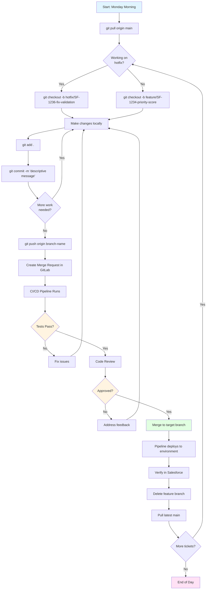

# Your Complete Daily Git Workflow

**Learning Objective**: Master the Git workflow you'll use every single day as a DevOps professional at Australia Post.

---

## Monday Morning: Real Scenario

It's 9:00 AM Monday. You just grabbed coffee. You're opening your laptop.

You have 3 tickets assigned to you this sprint:
- **SF-1234**: Add Priority Score field to Opportunity object
- **SF-1235**: Update Account trigger to handle bulk operations
- **SF-1236**: Fix validation rule blocking case creation

Your manager wants SF-1234 deployed to Integration by Wednesday. SF-1236 is a production hotfix needed by EOD today.

**How do you organize your work in Git?**

This page shows you the exact workflow, command by command, that professional DevOps engineers use.

---

## The Complete Workflow Diagram



---

## Step-by-Step: Your Daily Workflow

### Step 1: Morning Routine (9:00 AM)

**Always start your day by syncing with the remote repository.**

```bash
# Navigate to your project
cd ~/salesforce-projects/australia-post-crm

# Check which branch you're on
git branch
# Shows: * main (or whatever branch you were on Friday)

# Switch to main branch
git checkout main

# Get latest changes from remote
git pull origin main

# View what changed over the weekend
git log --oneline --since="3 days ago"

# Clean up any old branches
git branch --merged | grep -v "\*" | grep -v "main" | xargs -n 1 git branch -d
```

**What this does**:
- Ensures you have the latest production code
- Shows you what your teammates deployed
- Removes old feature branches that are already merged
- Gives you a clean starting point

**Time**: 2 minutes

---

### Step 2: Create Feature Branch (9:05 AM)

**Branch naming conventions matter. They should be:**
- Descriptive (anyone can understand what you're working on)
- Include ticket number (links to Jira/tracking system)
- Use consistent prefixes (feature/, hotfix/, bugfix/)

**Good branch names**:
- `feature/SF-1234-add-opportunity-priority-score`
- `hotfix/SF-1236-fix-case-validation-rule`
- `bugfix/SF-1235-account-trigger-bulk-handling`

**Bad branch names**:
- `my-branch` (not descriptive)
- `test` (no context)
- `johns-work` (who's John? What work?)
- `fix` (fix what?)

**Create your branch**:

```bash
# For feature work (branches from main)
git checkout main
git pull
git checkout -b feature/SF-1234-add-opportunity-priority-score

# For hotfix (also branches from main/production)
git checkout main
git pull
git checkout -b hotfix/SF-1236-fix-case-validation-rule

# Verify you're on the new branch
git branch
# Shows: * feature/SF-1234-add-opportunity-priority-score
```

**Pro tip**: Create the branch BEFORE you start coding. Don't code on main then try to move your changes.

---

### Step 3: Make Your Changes (9:10 AM - 11:30 AM)

**Work normally in VS Code, making changes to Salesforce metadata.**

**Example: Adding a new field**

```bash
# Authenticate to your dev org (if not already)
sf org login web --alias DevOrg

# Create custom field in Salesforce UI or via SFDX
# Let's say you added Priority_Score__c field to Opportunity

# Pull the metadata to your local project
sf project retrieve start --metadata CustomObject:Opportunity

# Check what changed
git status
# Shows: modified: force-app/main/default/objects/Opportunity/fields/Priority_Score__c.field-meta.xml

# See the actual changes
git diff
```

**Output**:
```xml
+ <fields>
+   <fullName>Priority_Score__c</fullName>
+   <label>Priority Score</label>
+   <type>Number</type>
+   <precision>3</precision>
+   <scale>0</scale>
+ </fields>
```

---

### Step 4: Commit Your Changes (11:30 AM)

**When to commit**:
- After completing a logical unit of work
- Before lunch break
- Before switching tasks
- At least once every 2 hours

**Commit often**. Small commits are better than large commits.

**Writing good commit messages**:

**Bad commit messages** ❌:
- "Update"
- "Fix"
- "Changes"
- "WIP"
- "asdf"

**Good commit messages** ✅:
- "Add Priority_Score__c field to Opportunity object"
- "Update AccountTrigger to handle bulk operations up to 200 records"
- "Fix validation rule blocking Case creation when Priority is null"

**Format**:
```
<Type>: <Short summary> (50 characters max)

<Detailed explanation if needed>
- Why this change was needed
- What approach was taken
- Any side effects or considerations

Closes SF-1234
```

**Example commit**:

```bash
# Stage your changes
git add force-app/main/default/objects/Opportunity/fields/Priority_Score__c.field-meta.xml

# Check what's staged
git status

# Commit with message
git commit -m "Add Priority_Score__c field to Opportunity object

This field will be used by the sales team to prioritize
high-value opportunities based on:
- Account annual revenue
- Historical close rate
- Opportunity amount

Field is numeric (0-100 scale) and will be calculated
by OpportunityTrigger on insert/update.

Closes SF-1234"

# Verify commit was created
git log --oneline -1
```

**Commit types**:
- `feat:` New feature
- `fix:` Bug fix
- `refactor:` Code restructuring without changing behavior
- `test:` Adding tests
- `docs:` Documentation changes
- `chore:` Maintenance tasks

---

### Step 5: Continue Working (Multiple Commits)

**You'll make multiple commits as you build the feature.**

```bash
# 11:30 AM - Add the field
git add force-app/main/default/objects/Opportunity/fields/
git commit -m "feat: Add Priority_Score__c field to Opportunity"

# 1:00 PM - Create trigger logic
git add force-app/main/default/triggers/OpportunityTrigger.trigger
git add force-app/main/default/classes/OpportunityTriggerHandler.cls
git commit -m "feat: Add trigger logic to calculate priority score"

# 2:30 PM - Add tests
git add force-app/main/default/classes/OpportunityTriggerHandlerTest.cls
git commit -m "test: Add test coverage for priority score calculation"

# 3:00 PM - Update permission set
git add force-app/main/default/permissionsets/Sales_User.permissionset-meta.xml
git commit -m "chore: Grant field access to Sales User permission set"

# View your commit history for this feature
git log --oneline
```

**Result**: 4 clean commits, each representing a logical unit of work.

---

### Step 6: Push to Remote (3:15 PM)

**Push your branch to GitLab so others can see it and CI/CD can run.**

```bash
# First time pushing this branch
git push -u origin feature/SF-1234-add-opportunity-priority-score

# Subsequent pushes (after more commits)
git push
```

**What happens**:
1. Your commits upload to GitLab
2. Branch appears in GitLab UI
3. CI/CD pipeline triggers automatically
4. Tests run
5. You get notification of results

**Pro tip**: Push frequently (at least once per day). If your laptop crashes, your work is safe on GitLab.

---

### Step 7: Create Merge Request (3:20 PM)

**In GitLab UI**:

1. Navigate to your repository
2. Click "Create merge request"
3. Fill out the template:

```markdown
## Summary
Add Priority Score field to Opportunity object to help sales team prioritize high-value deals.

## Changes
- Added `Priority_Score__c` custom field (Number, 0-100 scale)
- Created `OpportunityTrigger` to calculate score on insert/update
- Score calculation based on:
  - Account annual revenue (40% weight)
  - Historical close rate (30% weight)
  - Opportunity amount (30% weight)
- Added test coverage (94%)
- Updated Sales User permission set

## Testing
- [x] All Apex tests pass (127 tests, 78% coverage)
- [x] Deployed to Dev sandbox and tested manually
- [x] Created test opportunities with different scores
- [x] Verified bulk operations (200 records)

## Screenshots
[Attach screenshot of field in Salesforce UI]

## Jira Ticket
SF-1234

## Checklist
- [x] Code follows naming conventions
- [x] Test coverage ≥ 75%
- [x] No hardcoded IDs or credentials
- [x] Updated documentation
- [x] Ready for code review
```

4. Assign reviewers (Tech Lead, Senior Developer)
5. Add labels (Salesforce, Enhancement, Sprint-23)
6. Click "Create merge request"

---

### Step 8: Code Review Process (Tuesday 10:00 AM)

**Your tech lead reviews your code and leaves comments.**

**Example feedback**:

> **Reviewer**: "Line 47 in OpportunityTriggerHandler: You're querying inside a loop. This will hit governor limits with bulk operations."
>
> ```apex
> for (Opportunity opp : opportunities) {
>     Account acc = [SELECT AnnualRevenue FROM Account WHERE Id = :opp.AccountId]; // ❌ SOQL in loop
> }
> ```

**Your response workflow**:

```bash
# Make sure you're on the feature branch
git checkout feature/SF-1234-add-opportunity-priority-score

# Make the fix
# Open OpportunityTriggerHandler.cls in VS Code
# Refactor to bulkify the query

# Stage and commit the fix
git add force-app/main/default/classes/OpportunityTriggerHandler.cls
git commit -m "refactor: Bulkify Account query to avoid SOQL in loop

Moved Account query outside loop and created Map<Id, Account>
for efficient lookup. Now handles 200 records without hitting limits.

Addresses code review feedback from @tech-lead"

# Push the fix
git push

# Comment on the merge request
# "Fixed! Bulkified the query. Ready for another look."
```

**The reviewer sees**:
- Your fix commit
- Updated code
- Your response

**If approved**: Merge request gets ✅ approval

---

### Step 9: Merge to Target Branch (Tuesday 2:00 PM)

**After approval, you (or the reviewer) merge.**

**In GitLab UI**:
1. Click "Merge" button
2. Choose: "Delete source branch" (cleans up automatically)
3. Confirm

**What happens automatically**:
```
feature/SF-1234 → main
    ↓
CI/CD Pipeline Triggered
    ↓
1. Build stage: Validate metadata
2. Test stage: Run all Apex tests
3. Deploy stage: Deploy to Integration sandbox
4. Notify stage: Slack message sent
```

**Slack notification**:
> ✅ **Merge Request #234 Merged**
>
> Feature: Add Opportunity Priority Score
> Author: @sarah
> Reviewer: @tech-lead
> Deployed to: Integration Sandbox
>
> [View Pipeline] [View Deployment]

---

### Step 10: Clean Up Locally (Tuesday 2:15 PM)

**After merge, clean up your local environment.**

```bash
# Switch back to main
git checkout main

# Pull the merged changes
git pull origin main

# Delete your local feature branch (it's merged, you don't need it)
git branch -d feature/SF-1234-add-opportunity-priority-score

# Verify it's gone
git branch

# Start next ticket
git checkout -b feature/SF-1235-account-trigger-bulk
```

---

## Real Scenario: Handling a Hotfix

**2:00 PM: Production is down. Case creation is broken.**

**Hotfix workflow is URGENT but still follows process:**

```bash
# 2:01 PM - Immediately create hotfix branch from production
git checkout main  # main = production
git pull
git checkout -b hotfix/fix-case-validation-null-priority

# 2:05 PM - Reproduce bug in Dev org
sf org open --target-org DevOrg
# Try to create Case with blank Priority → Error!

# 2:10 PM - Pull validation rule metadata
sf project retrieve start --metadata ValidationRule:Case.Priority_Required

# 2:12 PM - Fix the rule
# Edit force-app/.../validationRules/Priority_Required.rule-meta.xml
# Change formula to allow blank for Web-to-Case

# 2:15 PM - Deploy to Dev org and test
sf project deploy start --source-dir force-app/main/default/objects/Case/validationRules/

# Test: Create case with blank priority → Success!

# 2:18 PM - Commit the fix
git add force-app/main/default/objects/Case/validationRules/
git commit -m "hotfix: Allow blank Priority for Web-to-Case submissions

Updated Priority_Required validation rule to exclude cases
created via Web-to-Case (field CreatedBy__c = 'Web').

This was blocking 500+ customer support requests per day.

Critical production issue. Requires immediate deployment.

Closes SF-1236"

# 2:20 PM - Push and create merge request
git push -u origin hotfix/fix-case-validation-null-priority

# Create MR in GitLab with "URGENT" label
# Assign to yourself AND manager
# Mark as "Ready to merge"

# 2:25 PM - Manager approves (reviewing fix live on screen)

# 2:27 PM - Merge to main
# Pipeline deploys to production

# 2:35 PM - Production deployment complete
# Verify: Create test case via Web-to-Case → Success!

# 2:40 PM - Notify stakeholders
# "Production hotfix deployed. Case creation restored."

# Total time: 40 minutes from bug report to production fix
```

**Key differences for hotfix**:
- Branch from `main` (production code)
- Skip normal UAT testing (emergency)
- Manager approval only (not full team review)
- Immediate merge and deploy
- Post-deployment: Merge hotfix back to `develop` or `integration` so fix doesn't get lost

---

## Common Mistakes and How to Fix Them

### Mistake 1: "I committed to main instead of a feature branch"

**Fix**:

```bash
# Undo the commit but keep your changes
git reset HEAD~1

# Create the feature branch
git checkout -b feature/my-feature

# Re-commit
git add .
git commit -m "feat: Add my feature"
```

### Mistake 2: "I made 20 changes and forgot to commit"

**Fix**:

```bash
# Don't panic. Stage and commit in logical chunks

# See all changed files
git status

# Stage related changes
git add force-app/main/default/classes/AccountHandler.cls
git add force-app/main/default/classes/AccountHandlerTest.cls
git commit -m "feat: Add account scoring logic"

# Stage next group
git add force-app/main/default/objects/Account/fields/
git commit -m "feat: Add custom fields for account scoring"

# Continue until all changes are committed
```

### Mistake 3: "I pushed sensitive data (credentials) to GitLab"

**Fix** (URGENT):

```bash
# Remove from current commit
git rm --cached config/credentials.txt
echo "config/credentials.txt" >> .gitignore
git add .gitignore
git commit -m "Remove credentials file"

# Push the removal
git push

# CRITICAL: The credentials are still in Git history!
# Rotate the credentials immediately (change passwords)
# Contact DevOps to purge from Git history (requires force push)
```

### Mistake 4: "I need to update my feature branch with latest main"

**Scenario**: You've been working on your feature for 3 days. Main has received 10 new commits. You need to merge them into your feature.

**Fix**:

```bash
# Save your work first
git add .
git commit -m "WIP: Save progress"

# Switch to main and update
git checkout main
git pull

# Switch back to feature
git checkout feature/my-feature

# Merge main into your feature
git merge main

# If there are conflicts, resolve them
# Then continue working
```

### Mistake 5: "I want to undo my last commit"

**Fix**:

```bash
# Undo commit but keep changes (you can recommit)
git reset --soft HEAD~1

# Undo commit and discard changes (DANGER!)
git reset --hard HEAD~1

# Undo commit that was already pushed
git revert HEAD  # Creates new commit that undoes the previous one
git push
```

---

## Git Command Reference for Daily Use

### Starting Your Day

```bash
git checkout main                    # Switch to main branch
git pull origin main                 # Get latest changes
git checkout -b feature/SF-1234-desc # Create feature branch
```

### During Development

```bash
git status                           # See what changed
git diff                             # See exact changes
git add <file>                       # Stage specific file
git add .                            # Stage all changes
git commit -m "message"              # Commit with message
git log --oneline                    # View commit history
```

### Syncing with Remote

```bash
git push                             # Push commits to remote
git push -u origin branch-name       # First push of new branch
git pull                             # Get latest from remote
git fetch                            # Download without merging
```

### Branch Management

```bash
git branch                           # List local branches
git branch -a                        # List all branches (including remote)
git checkout branch-name             # Switch branches
git checkout -b new-branch           # Create and switch
git branch -d branch-name            # Delete merged branch
git branch -D branch-name            # Force delete unmerged branch
```

### Fixing Mistakes

```bash
git reset HEAD~1                     # Undo last commit (keep changes)
git reset --hard HEAD~1              # Undo last commit (discard changes)
git revert HEAD                      # Create commit that undoes last commit
git checkout -- <file>               # Discard changes to file
git clean -fd                        # Remove untracked files
```

### Viewing Information

```bash
git log --oneline --graph --all      # Visual commit history
git log --since="2 days ago"         # Recent commits
git show <commit-id>                 # Show specific commit
git diff main feature-branch         # Compare branches
git blame <file>                     # See who changed each line
```

---

## Interview Questions: Git Workflow

### Question 1: Describe your typical daily workflow with Git

**Strong Answer** ✅:
> "I start every morning by pulling the latest changes from main to ensure I'm working with the most current code: `git checkout main && git pull`. Then I create a feature branch for my Jira ticket using our naming convention: `git checkout -b feature/JIRA-123-description`.
>
> As I develop, I commit frequently—usually every hour or two, or whenever I complete a logical unit of work. I write descriptive commit messages following the conventional commits format: 'feat:', 'fix:', etc.
>
> I push to remote at least once a day so my work is backed up and visible to the team. When the feature is complete, I create a merge request in GitLab, which triggers our CI/CD pipeline to run tests and code quality checks.
>
> After code review and approval, I merge to main, which automatically deploys to our Integration environment. Then I pull the latest main locally, delete my feature branch, and start the next ticket.
>
> For hotfixes, I follow the same process but branch from production, get expedited review, and merge directly to production with manager approval."

### Question 2: How do you write good commit messages?

**Strong Answer** ✅:
> "Good commit messages answer three questions: What changed? Why did it change? What's the impact?
>
> I follow this format: First line is a concise summary under 50 characters with a type prefix like 'feat:' or 'fix:'. Then a blank line, then a detailed explanation including the business context, technical approach, and any side effects.
>
> For example: 'feat: Add bulk processing to AccountTrigger' as the summary, then explain why we need bulk processing (governor limits), how it was implemented (moved SOQL outside loop), and that it now handles 200 records.
>
> I always include the Jira ticket number so anyone can trace the commit back to requirements. Bad commit messages like 'fix' or 'update' don't tell you anything. Six months later when debugging, you need context, and commit messages are your documentation."

### Question 3: Your feature branch is 3 days old. Main has diverged. What do you do?

**Strong Answer** ✅:
> "I need to bring the latest main changes into my feature branch to avoid conflicts later. First, I'd commit or stash my current work. Then `git checkout main && git pull` to get the latest.
>
> Then I have two options: merge or rebase. I'd use `git checkout feature-branch && git merge main` to bring main's changes in. This creates a merge commit showing when I integrated the changes.
>
> Alternatively, `git rebase main` would replay my feature commits on top of the latest main, creating a cleaner history but rewriting my commits. At Australia Post, I'd check the team's preference—some teams prefer merge commits for the audit trail, others prefer the clean history from rebase.
>
> If there are conflicts, I'd resolve them carefully, test thoroughly, and push. The key is to sync regularly—every 1-2 days—so divergence doesn't become a problem."

### Question 4: You accidentally committed and pushed sensitive data. What's your immediate response?

**Strong Answer** ✅:
> "This is critical. First, I'd immediately remove the file from the current commit and add it to .gitignore, then push that change. But that doesn't remove it from Git history—anyone can still access previous commits.
>
> I'd immediately notify the security team and my manager. We need to rotate whatever credentials were exposed—change passwords, regenerate API keys, revoke access tokens.
>
> Then I'd work with DevOps to purge the file from Git history using `git filter-branch` or BFG Repo-Cleaner, followed by a force push. All developers would need to re-clone the repository.
>
> Going forward, I'd implement preventive measures: pre-commit hooks using tools like git-secrets to scan for credentials, store secrets in environment variables or secret management tools like AWS Secrets Manager, and add .env files to .gitignore from day one.
>
> The most important part is speed—the longer sensitive data is exposed, the higher the risk."

### Question 5: Walk me through a production hotfix from bug report to deployment

**Strong Answer** ✅:
> "Let's say I get a Slack message at 2 PM: 'Production down, users can't submit cases.'
>
> First, I'd acknowledge immediately: 'On it, investigating now.' I'd check monitoring tools to confirm scope and impact.
>
> Within 5 minutes, I'd create a hotfix branch from main: `git checkout main && git pull && git checkout -b hotfix/fix-case-submission`. I'd reproduce the bug in a Dev org to understand it.
>
> Once I've identified the fix—say, a validation rule issue—I'd make the change, test it locally, and commit: 'hotfix: Allow case submission from Web-to-Case portal'. I'd push and create a merge request marked urgent.
>
> I'd get manager approval (not full team review—this is time-sensitive), and merge to main, which triggers our CI/CD to deploy to production. Total time: 20-40 minutes depending on complexity.
>
> Critically, after the fix is deployed and verified, I'd merge the hotfix back to the develop or integration branch so the fix doesn't get lost in the next release. Then I'd document what happened and what we learned in a postmortem."

---

## Key Takeaways

✅ **Morning routine** = `git checkout main && git pull` every single day

✅ **Branch naming** = `feature/TICKET-123-short-description` (consistent, traceable)

✅ **Commit often** = Every 1-2 hours, or after each logical unit of work

✅ **Good commit messages** = What + Why + Impact (not just "update")

✅ **Push daily** = Your work is backed up and visible to team

✅ **Merge requests** = Detailed description, testing checklist, screenshots

✅ **Code review** = Address feedback promptly, commit fixes, communicate

✅ **Clean up** = Delete feature branches after merge, pull latest main

✅ **Hotfixes** = Same process, just faster with expedited review

---

## Up Next: Technical Interview Questions

You've mastered branching strategies and daily workflow. Now let's prepare for the technical questions interviewers will ask.

**Next topic**: 50 real DevOps interview questions with strong answers, covering:
- Git and version control scenarios
- Salesforce deployment challenges
- CI/CD pipeline design
- Troubleshooting production issues
- Architecture and best practices
- Questions specific to enterprise Salesforce (like Australia Post)

These are questions you WILL be asked. Let's prepare strong answers.

Get interview-ready: **[Technical Interview Questions →](/docs/interview-prep/technical-interview-questions)**

---

**Pro tip**: Practice this workflow on a personal project before your interview. Being able to say "Here's my daily routine..." with confidence beats memorizing answers. Interviewers can tell when you've actually done the work.
