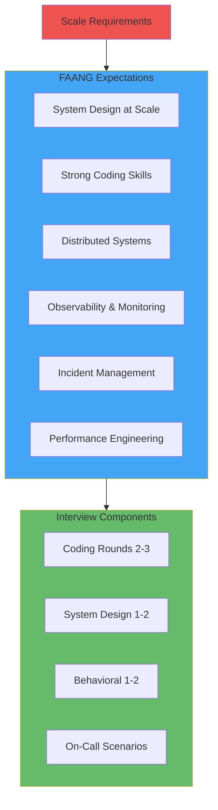
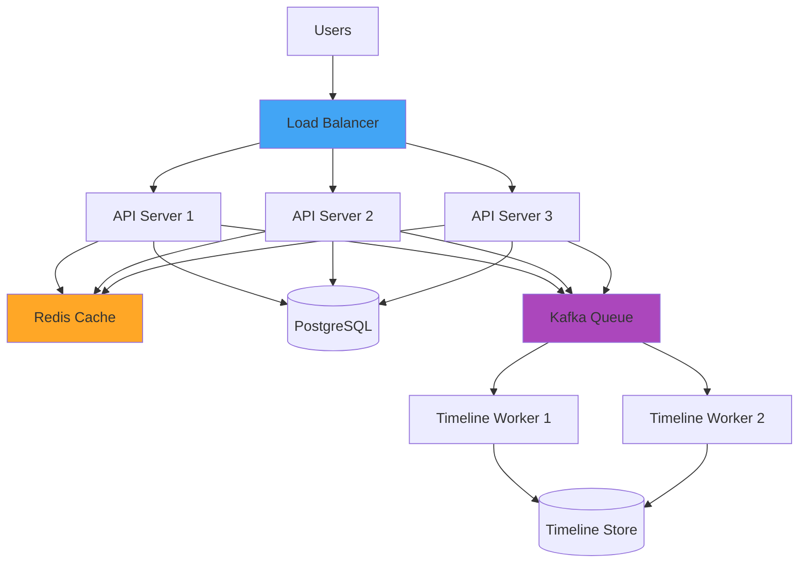
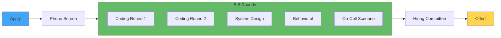

# FAANG DevOps/SRE Preparation

**Learning Objective**: Understand what FAANG companies look for in DevOps/SRE roles and prepare for their unique interview processes.

## What Makes FAANG Different?

FAANG companies operate at unprecedented scale and have specific requirements:



### FAANG vs Regular DevOps

| Aspect | Regular DevOps | FAANG DevOps/SRE |
|--------|---------------|------------------|
| **Scale** | Thousands of users | Millions/billions of users |
| **Availability** | 99.9% (8h downtime/year) | 99.99%+ (<1h downtime/year) |
| **Coding** | Basic scripting | Production-grade code |
| **Systems** | Monolithic/small microservices | Distributed systems at scale |
| **Monitoring** | Basic metrics | Full observability stack |
| **Incidents** | Occasional | 24/7 on-call rotation |
| **Performance** | Good enough | Millisecond optimization |
| **Interview** | 2-3 rounds | 5-6 rounds |

## Core Competencies for FAANG

### 1. System Design at Scale

**What They Test:**
- Design systems handling billions of requests
- CAP theorem understanding
- Distributed system patterns
- Scalability and reliability trade-offs

**Example Question:** "Design Twitter's timeline service"



**Key Concepts:**
```python
# System Design Approach

1. Requirements
   - Functional: What must the system do?
   - Non-functional: Scale, latency, availability
   - Constraints: Budget, time, team size

2. Capacity Estimation
   - Users: 500M DAU
   - Requests: 10K RPS average, 50K peak
   - Storage: 10TB/day
   - Bandwidth: 100 Gbps

3. High-Level Design
   - Components and their interactions
   - Data flow
   - API design

4. Deep Dives
   - Database schema
   - Caching strategy
   - Load balancing
   - Monitoring and alerting

5. Trade-offs
   - Consistency vs Availability (CAP theorem)
   - Latency vs Throughput
   - Cost vs Performance
```

### 2. Strong Coding Skills

**Languages FAANG Prefers:**
- **Python** - Automation, data processing
- **Go** - High-performance services
- **Java** - Backend services
- **JavaScript/TypeScript** - Full-stack

**Coding Interview Topics:**

```python
# Data Structures & Algorithms

# 1. Arrays & Strings
def remove_duplicates(nums):
    """Remove duplicates from sorted array in-place"""
    if not nums:
        return 0

    write_pos = 1
    for read_pos in range(1, len(nums)):
        if nums[read_pos] != nums[read_pos - 1]:
            nums[write_pos] = nums[read_pos]
            write_pos += 1

    return write_pos

# 2. Hash Tables
def two_sum(nums, target):
    """Find two numbers that add up to target"""
    seen = {}
    for i, num in enumerate(nums):
        complement = target - num
        if complement in seen:
            return [seen[complement], i]
        seen[num] = i
    return []

# 3. Trees & Graphs
def max_depth(root):
    """Find maximum depth of binary tree"""
    if not root:
        return 0
    return 1 + max(max_depth(root.left), max_depth(root.right))

# 4. Dynamic Programming
def fibonacci(n, memo={}):
    """Fibonacci with memoization"""
    if n in memo:
        return memo[n]
    if n <= 2:
        return 1
    memo[n] = fibonacci(n-1, memo) + fibonacci(n-2, memo)
    return memo[n]

# 5. System Design Code
class RateLimiter:
    """Token bucket rate limiter"""
    def __init__(self, capacity, refill_rate):
        self.capacity = capacity
        self.tokens = capacity
        self.refill_rate = refill_rate
        self.last_refill = time.time()

    def allow_request(self):
        self._refill()
        if self.tokens >= 1:
            self.tokens -= 1
            return True
        return False

    def _refill(self):
        now = time.time()
        elapsed = now - self.last_refill
        tokens_to_add = elapsed * self.refill_rate
        self.tokens = min(self.capacity, self.tokens + tokens_to_add)
        self.last_refill = now
```

**Production Code Quality:**

```python
# FAANG expects production-ready code

import logging
import time
from typing import Optional, Dict
from dataclasses import dataclass
from enum import Enum

logger = logging.getLogger(__name__)

class DeploymentStatus(Enum):
    PENDING = "pending"
    IN_PROGRESS = "in_progress"
    SUCCESS = "success"
    FAILED = "failed"
    ROLLED_BACK = "rolled_back"

@dataclass
class Deployment:
    id: str
    environment: str
    version: str
    status: DeploymentStatus
    started_at: float
    completed_at: Optional[float] = None
    error: Optional[str] = None

class DeploymentManager:
    """
    Manages application deployments with monitoring and rollback.

    Attributes:
        max_retries: Maximum number of retry attempts
        timeout: Deployment timeout in seconds
    """

    def __init__(self, max_retries: int = 3, timeout: int = 300):
        self.max_retries = max_retries
        self.timeout = timeout
        self.deployments: Dict[str, Deployment] = {}

    def deploy(self, deployment_id: str, environment: str, version: str) -> bool:
        """
        Deploy application to specified environment.

        Args:
            deployment_id: Unique deployment identifier
            environment: Target environment (dev, staging, prod)
            version: Application version to deploy

        Returns:
            True if deployment successful, False otherwise

        Raises:
            ValueError: If environment is invalid
            TimeoutError: If deployment exceeds timeout
        """
        if environment not in ['dev', 'staging', 'prod']:
            raise ValueError(f"Invalid environment: {environment}")

        deployment = Deployment(
            id=deployment_id,
            environment=environment,
            version=version,
            status=DeploymentStatus.PENDING,
            started_at=time.time()
        )

        self.deployments[deployment_id] = deployment

        try:
            logger.info(f"Starting deployment {deployment_id} to {environment}")
            deployment.status = DeploymentStatus.IN_PROGRESS

            # Perform deployment with retries
            for attempt in range(self.max_retries):
                try:
                    self._execute_deployment(deployment)
                    deployment.status = DeploymentStatus.SUCCESS
                    deployment.completed_at = time.time()
                    logger.info(f"Deployment {deployment_id} succeeded")
                    return True
                except Exception as e:
                    logger.warning(f"Deployment attempt {attempt + 1} failed: {e}")
                    if attempt == self.max_retries - 1:
                        raise
                    time.sleep(2 ** attempt)  # Exponential backoff

        except TimeoutError as e:
            logger.error(f"Deployment {deployment_id} timed out")
            deployment.status = DeploymentStatus.FAILED
            deployment.error = str(e)
            self._rollback(deployment)
            return False

        except Exception as e:
            logger.error(f"Deployment {deployment_id} failed: {e}")
            deployment.status = DeploymentStatus.FAILED
            deployment.error = str(e)
            self._rollback(deployment)
            return False

    def _execute_deployment(self, deployment: Deployment):
        """Execute the actual deployment"""
        # Implementation details
        pass

    def _rollback(self, deployment: Deployment):
        """Rollback failed deployment"""
        logger.info(f"Rolling back deployment {deployment.id}")
        deployment.status = DeploymentStatus.ROLLED_BACK
        # Rollback implementation

    def get_deployment_status(self, deployment_id: str) -> Optional[Deployment]:
        """Get deployment status by ID"""
        return self.deployments.get(deployment_id)
```

### 3. Distributed Systems Knowledge

**Key Concepts:**

```yaml
# CAP Theorem
Consistency: All nodes see the same data
Availability: Every request gets a response
Partition Tolerance: System continues despite network failures

# You can only have 2 out of 3

# Examples:
# - MongoDB: CP (Consistency + Partition Tolerance)
# - Cassandra: AP (Availability + Partition Tolerance)
# - PostgreSQL: CA (Consistency + Availability)

# Consensus Algorithms
Raft: Leader election, log replication
Paxos: More complex but proven
ZAB: Used by ZooKeeper

# Distributed Patterns
- Circuit Breaker: Prevent cascading failures
- Bulkhead: Isolate failures
- Retry with Exponential Backoff
- Rate Limiting
- Load Shedding
```

**Circuit Breaker Implementation:**

```python
from enum import Enum
import time
from typing import Callable, Any

class CircuitState(Enum):
    CLOSED = "closed"      # Normal operation
    OPEN = "open"          # Failing, reject requests
    HALF_OPEN = "half_open"  # Testing if recovered

class CircuitBreaker:
    """
    Prevents cascading failures in distributed systems.
    """

    def __init__(self,
                 failure_threshold: int = 5,
                 timeout: int = 60,
                 success_threshold: int = 2):
        self.failure_threshold = failure_threshold
        self.timeout = timeout
        self.success_threshold = success_threshold

        self.state = CircuitState.CLOSED
        self.failure_count = 0
        self.success_count = 0
        self.last_failure_time = None

    def call(self, func: Callable, *args, **kwargs) -> Any:
        """
        Execute function with circuit breaker protection.
        """
        if self.state == CircuitState.OPEN:
            if time.time() - self.last_failure_time >= self.timeout:
                self.state = CircuitState.HALF_OPEN
                self.success_count = 0
            else:
                raise Exception("Circuit breaker is OPEN")

        try:
            result = func(*args, **kwargs)
            self._on_success()
            return result
        except Exception as e:
            self._on_failure()
            raise

    def _on_success(self):
        self.failure_count = 0

        if self.state == CircuitState.HALF_OPEN:
            self.success_count += 1
            if self.success_count >= self.success_threshold:
                self.state = CircuitState.CLOSED

    def _on_failure(self):
        self.failure_count += 1
        self.last_failure_time = time.time()

        if self.failure_count >= self.failure_threshold:
            self.state = CircuitState.OPEN

# Usage
breaker = CircuitBreaker()

def call_external_api():
    breaker.call(requests.get, "https://api.example.com/data")
```

### 4. Observability & Monitoring

**Three Pillars of Observability:**

```python
# 1. METRICS - What's happening?
from prometheus_client import Counter, Histogram, Gauge

# Request counter
request_count = Counter(
    'http_requests_total',
    'Total HTTP requests',
    ['method', 'endpoint', 'status']
)

# Response time histogram
response_time = Histogram(
    'http_request_duration_seconds',
    'HTTP request duration',
    ['method', 'endpoint']
)

# Active connections gauge
active_connections = Gauge(
    'active_connections',
    'Number of active connections'
)

# Usage
@app.route('/api/users')
def get_users():
    active_connections.inc()
    with response_time.labels(method='GET', endpoint='/api/users').time():
        result = fetch_users()
        request_count.labels(
            method='GET',
            endpoint='/api/users',
            status=200
        ).inc()
    active_connections.dec()
    return result

# 2. LOGS - What happened in detail?
import logging
import json

logger = logging.getLogger(__name__)

class StructuredLogger:
    """Structured logging for better querying"""

    @staticmethod
    def log_event(event_type, **kwargs):
        log_entry = {
            'timestamp': time.time(),
            'event_type': event_type,
            **kwargs
        }
        logger.info(json.dumps(log_entry))

# Usage
StructuredLogger.log_event(
    'deployment_started',
    environment='production',
    version='v1.2.3',
    deployer='user@example.com'
)

# 3. TRACES - How do requests flow?
from opentelemetry import trace
from opentelemetry.sdk.trace import TracerProvider
from opentelemetry.sdk.trace.export import BatchSpanProcessor
from opentelemetry.exporter.jaeger import JaegerExporter

# Setup tracing
trace.set_tracer_provider(TracerProvider())
jaeger_exporter = JaegerExporter(
    agent_host_name='localhost',
    agent_port=6831,
)
trace.get_tracer_provider().add_span_processor(
    BatchSpanProcessor(jaeger_exporter)
)

tracer = trace.get_tracer(__name__)

# Usage
def process_request(request_id):
    with tracer.start_as_current_span("process_request") as span:
        span.set_attribute("request.id", request_id)

        with tracer.start_as_current_span("database_query"):
            result = query_database()

        with tracer.start_as_current_span("cache_update"):
            update_cache(result)

        return result
```

### 5. Site Reliability Engineering (SRE)

**SRE Principles (Google's approach):**

```yaml
# Service Level Objectives (SLOs)
Availability SLO: 99.95%
  - Allowed downtime: 4.38 hours/year
  - Error budget: 0.05% (262 minutes/year)

Latency SLO:
  - p50: < 100ms
  - p95: < 500ms
  - p99: < 1000ms

# Error Budget Policy
If error budget > 50%:
  - Focus on new features
  - Aggressive rollouts

If error budget < 50%:
  - Freeze feature releases
  - Focus on reliability
  - Pay down technical debt

# Toil Reduction
Toil: Manual, repetitive, automatable work
Target: < 50% of SRE time on toil
Actions:
  - Automate deployments
  - Auto-remediation
  - Self-service tools
```

**On-Call Best Practices:**

```python
# Runbook Template
class IncidentRunbook:
    """
    Standard incident response procedure
    """

    def __init__(self, service_name):
        self.service_name = service_name

    def triage(self, alert):
        """
        Step 1: Triage
        - Severity assessment
        - Impact assessment
        - Initial diagnosis
        """
        severity = self._assess_severity(alert)
        impact = self._assess_impact(alert)

        if severity == 'P0':  # Critical
            self.page_oncall()
            self.notify_management()

        return {
            'severity': severity,
            'impact': impact,
            'diagnosis': self._initial_diagnosis(alert)
        }

    def mitigate(self):
        """
        Step 2: Mitigate
        - Stop the bleeding
        - Restore service
        """
        actions = [
            self.rollback_deployment,
            self.scale_up_resources,
            self.enable_circuit_breaker,
            self.switch_to_backup
        ]

        for action in actions:
            if action():
                return True
        return False

    def root_cause_analysis(self):
        """
        Step 3: Root Cause Analysis
        - Find the root cause
        - Document timeline
        - Create action items
        """
        return {
            'timeline': self.build_timeline(),
            'root_cause': self.identify_root_cause(),
            'contributing_factors': self.find_contributing_factors(),
            'action_items': self.create_action_items()
        }

    def post_mortem(self):
        """
        Step 4: Post-Mortem (Blameless)
        - What happened?
        - Why did it happen?
        - How do we prevent it?
        """
        return {
            'incident_summary': self.summarize_incident(),
            'impact': self.calculate_impact(),
            'timeline': self.detailed_timeline(),
            'root_cause': self.root_cause_analysis(),
            'lessons_learned': self.extract_lessons(),
            'action_items': self.prioritize_actions()
        }
```

### 6. Performance Engineering

```python
# Performance Optimization Techniques

# 1. Caching Strategy
class MultiLevelCache:
    """L1 (memory) -> L2 (Redis) -> L3 (Database)"""

    def __init__(self):
        self.l1_cache = {}  # In-memory
        self.l2_cache = redis.Redis()  # Redis
        self.database = Database()  # PostgreSQL

    def get(self, key):
        # Check L1
        if key in self.l1_cache:
            return self.l1_cache[key]

        # Check L2
        value = self.l2_cache.get(key)
        if value:
            self.l1_cache[key] = value  # Populate L1
            return value

        # Check L3
        value = self.database.query(key)
        if value:
            self.l2_cache.set(key, value, ex=3600)  # 1 hour TTL
            self.l1_cache[key] = value

        return value

# 2. Database Optimization
# - Indexing strategy
# - Query optimization
# - Connection pooling
# - Read replicas

# 3. Load Balancing Algorithms
def weighted_round_robin(servers, weights):
    """
    Distribute load based on server capacity
    """
    total = sum(weights)
    current = 0

    while True:
        for i, server in enumerate(servers):
            weight = weights[i]
            for _ in range(weight):
                yield server
                current = (current + 1) % total

# 4. Rate Limiting
class SlidingWindowRateLimiter:
    """
    More accurate than fixed window
    """
    def __init__(self, max_requests, window_size):
        self.max_requests = max_requests
        self.window_size = window_size
        self.requests = defaultdict(list)

    def allow_request(self, user_id):
        now = time.time()
        window_start = now - self.window_size

        # Remove old requests
        self.requests[user_id] = [
            req_time for req_time in self.requests[user_id]
            if req_time > window_start
        ]

        # Check limit
        if len(self.requests[user_id]) < self.max_requests:
            self.requests[user_id].append(now)
            return True

        return False
```

## FAANG Interview Process

### Typical Interview Loop



### Interview Breakdown

**1. Coding Rounds (2-3 rounds, 45-60 min each)**

Topics:
- Data structures (arrays, trees, graphs, heaps)
- Algorithms (sorting, searching, dynamic programming)
- Complexity analysis (time and space)
- Production code quality

Example Question:
```python
"""
Design a URL shortener like bit.ly

Requirements:
1. Generate short URL from long URL
2. Redirect short URL to original
3. Handle 1M requests/day
4. URLs should be unique and random
5. Track analytics (clicks, geography)
"""

import hashlib
import string
import random

class URLShortener:
    def __init__(self):
        self.url_map = {}  # short -> long
        self.reverse_map = {}  # long -> short
        self.base_url = "https://short.ly/"
        self.chars = string.ascii_letters + string.digits

    def shorten(self, long_url: str) -> str:
        """Generate short URL"""
        # Check if already shortened
        if long_url in self.reverse_map:
            return self.base_url + self.reverse_map[long_url]

        # Generate unique short code
        short_code = self._generate_code(long_url)

        # Store mappings
        self.url_map[short_code] = long_url
        self.reverse_map[long_url] = short_code

        return self.base_url + short_code

    def _generate_code(self, long_url: str, length: int = 6) -> str:
        """Generate short code using MD5"""
        # Use MD5 hash for consistency
        hash_obj = hashlib.md5(long_url.encode())
        hash_int = int(hash_obj.hexdigest(), 16)

        # Convert to base62
        code = ''
        while hash_int > 0 and len(code) < length:
            code = self.chars[hash_int % 62] + code
            hash_int //= 62

        # Handle collisions
        while code in self.url_map:
            code += random.choice(self.chars)

        return code

    def expand(self, short_code: str) -> str:
        """Get original URL"""
        return self.url_map.get(short_code)
```

**2. System Design (1-2 rounds, 60 min each)**

Example Questions:
- Design Twitter
- Design YouTube
- Design Uber
- Design Netflix
- Design WhatsApp
- Design URL shortener at scale

**Approach:**

1. **Requirements (5 min)**
   - Functional requirements
   - Non-functional requirements (scale, latency, availability)

2. **Capacity Estimation (5 min)**
   - Daily active users
   - Requests per second
   - Storage requirements
   - Bandwidth

3. **API Design (5 min)**
   ```
   POST /api/v1/tweets
   GET /api/v1/tweets/:id
   GET /api/v1/timeline/:user_id
   POST /api/v1/follow/:user_id
   ```

4. **High-Level Design (15 min)**
   - Components and interactions
   - Data flow
   - Technology choices

5. **Deep Dive (20 min)**
   - Database schema
   - Caching strategy
   - Load balancing
   - Scalability
   - Monitoring

6. **Trade-offs (10 min)**
   - Discuss alternatives
   - Explain decisions

**3. Behavioral (1-2 rounds, 45-60 min)**

Amazon Leadership Principles style:
- Customer Obsession
- Ownership
- Invent and Simplify
- Learn and Be Curious
- Hire and Develop the Best
- Insist on the Highest Standards
- Think Big
- Bias for Action
- Deliver Results

Example Questions:
- "Tell me about a time you failed"
- "Describe a conflict with a teammate"
- "How do you prioritize when everything is urgent?"
- "Tell me about a time you had to make a trade-off"

**STAR Method:**
- **S**ituation: Set the context
- **T**ask: Describe the challenge
- **A**ction: Explain what you did
- **R**esult: Share the outcome

**4. On-Call/Operational (1 round)**

Scenario-based questions:
- "CPU usage spiked to 100%, how do you debug?"
- "Database queries are slow, what do you check?"
- "Service is returning 500 errors, troubleshoot"
- "How do you handle a DDoS attack?"

## Company-Specific Tips

### Google/Meta
- **Focus**: Distributed systems, scalability
- **Coding**: LeetCode Hard level
- **System Design**: Billion-user scale
- **Culture**: Innovation, impact

### Amazon
- **Focus**: Leadership principles, ownership
- **Coding**: Practical problem-solving
- **System Design**: AWS services knowledge
- **Culture**: Customer obsession, ownership

### Netflix
- **Focus**: Chaos engineering, reliability
- **Coding**: Production quality code
- **System Design**: Microservices, resilience
- **Culture**: Freedom and responsibility

### Apple
- **Focus**: Attention to detail, quality
- **Coding**: Efficient algorithms
- **System Design**: Privacy, security
- **Culture**: Excellence, secrecy

## Study Plan (12 Weeks)

### Weeks 1-4: Coding Fundamentals
- **Daily**: 2-3 LeetCode problems
- **Focus**: Arrays, strings, hash tables, trees
- **Goal**: Solve 100 easy + 50 medium problems

### Weeks 5-6: Advanced Algorithms
- **Daily**: 1-2 LeetCode hard problems
- **Focus**: Dynamic programming, graphs, heaps
- **Goal**: Solve 30 hard problems

### Weeks 7-8: System Design
- **Daily**: 1 system design problem
- **Study**: Grokking the System Design Interview
- **Practice**: Design popular systems

### Weeks 9-10: Distributed Systems
- **Study**: Designing Data-Intensive Applications
- **Topics**: Consensus, replication, partitioning
- **Practice**: Explain CAP theorem, consistency models

### Weeks 11-12: Mock Interviews & Review
- **Daily**: 1 mock interview
- **Review**: Weak areas
- **Practice**: Behavioral questions

## Resources

### Books
- **Designing Data-Intensive Applications** - Martin Kleppmann
- **System Design Interview** - Alex Xu (Volumes 1 & 2)
- **Site Reliability Engineering** - Google
- **Cracking the Coding Interview** - Gayle McDowell

### Online Platforms
- **LeetCode** - Coding practice
- **Pramp** - Free mock interviews
- **Blind** - Company insights
- **levels.fyi** - Salary data
- **Grokking the System Design Interview** - System design course

### YouTube Channels
- **Gaurav Sen** - System design
- **Tech Dummies** - System design
- **System Design Interview** - Real examples

## Salary Expectations (2024)

| Level | Total Comp (USD) | Experience |
|-------|------------------|------------|
| E3/L3 (Entry) | $150K-$200K | 0-2 years |
| E4/L4 (Mid) | $200K-$300K | 2-5 years |
| E5/L5 (Senior) | $300K-$500K | 5-8 years |
| E6/L6 (Staff) | $500K-$700K | 8-12 years |
| E7/L7 (Principal) | $700K-$1M+ | 12+ years |

*Note: Total comp includes base salary, stock, and bonus*

## Key Takeaways

1. **Coding is mandatory** - Even for DevOps/SRE roles
2. **System design at scale** - Think billions of users
3. **Production mindset** - Code must be reliable, monitored
4. **Distributed systems** - Understand trade-offs deeply
5. **Behavioral preparation** - STAR method for every story
6. **Practice, practice, practice** - 100+ coding problems minimum

---

**Final Advice**: FAANG interviews are hard but fair. They test for skills needed at scale. Focus on fundamentals, practice consistently, and don't give up. Every rejection is a learning opportunity. Good luck! 🚀
