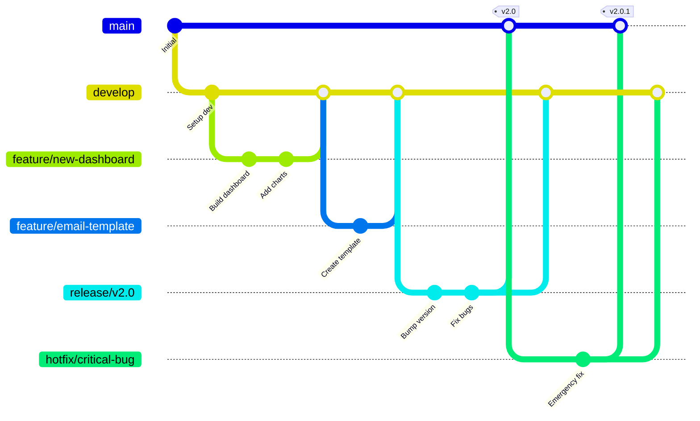
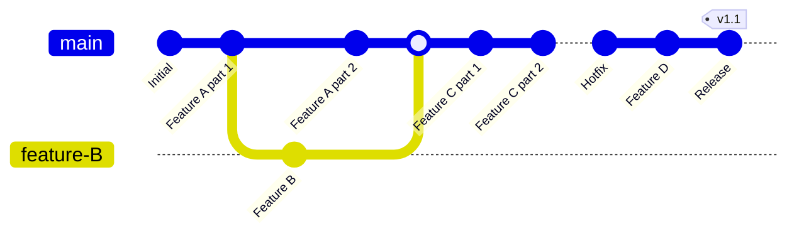
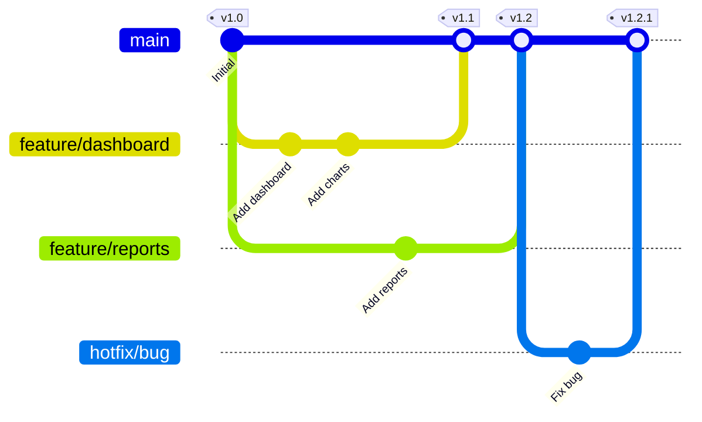
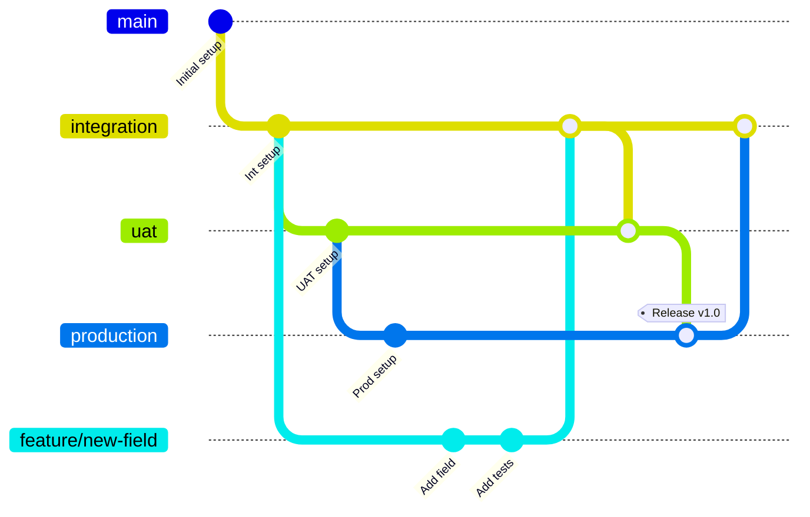

# Git Branching Strategies Explained

**Learning Objective**: Master the branching strategies used in enterprise DevOps and know which to recommend for different scenarios.

---

## The Branching Problem

It's your first week at Australia Post as DevOps Lead. You're in a meeting with the Platform Team Lead.

**Platform Lead**: "We have 50 developers across 5 teams. Sales Cloud, Service Cloud, Community Cloud, Marketing Cloud, and Platform team. Everyone's committing to the same repository. It's chaos."

**The current situation**:
- Developers commit directly to `main` branch
- No consistent branch naming
- Production hotfixes mixed with new features
- Can't tell what's ready for production vs work-in-progress
- Release coordination happens in Slack messages
- UAT testing blocked waiting for individual features to finish

**Platform Lead**: "What branching strategy should we use?"

This is a classic DevOps interview question. And you'll actually implement the answer in week 1 of your job.

**Let's learn the 4 main branching strategies**, when to use each, and how to articulate the trade-offs in an interview.

---

## Strategy 1: GitFlow

**What it is**: The most structured branching model with specific branch types for features, releases, and hotfixes.

**Created by**: Vincent Driessen in 2010 for software with scheduled releases.

### GitFlow Branch Structure



### The 5 Branch Types

**1. main** (formerly master)
- Production-ready code ONLY
- Every commit is a release
- Tagged with version numbers (v1.0, v1.1, etc.)
- Protected - no direct commits
- Deployed to production

**2. develop**
- Integration branch for features
- Latest development changes
- Where all feature branches merge
- Deployed to Dev/Integration sandboxes
- Source for release branches

**3. feature/** branches
- One branch per feature or user story
- Branched from: `develop`
- Merged back to: `develop`
- Naming: `feature/SF-1234-add-opportunity-scoring`
- Deleted after merge

**4. release/** branches
- Preparation for production release
- Branched from: `develop`
- Merged to: `main` AND `develop`
- Naming: `release/v2.1.0`
- Bug fixes only (no new features)
- Deployed to UAT sandbox for final testing

**5. hotfix/** branches
- Emergency production fixes
- Branched from: `main`
- Merged to: `main` AND `develop`
- Naming: `hotfix/fix-case-creation-bug`
- Bypasses normal release cycle

### GitFlow in Action: Complete Lifecycle

**Week 1: Feature Development**

```bash
# Sarah starts new feature
git checkout develop
git pull
git checkout -b feature/SF-1234-opportunity-scoring

# Sarah works on feature
git add .
git commit -m "Add scoring logic to OpportunityHandler"
git push origin feature/SF-1234-opportunity-scoring

# Create merge request to develop
# After code review and tests pass:
git checkout develop
git merge feature/SF-1234-opportunity-scoring
git branch -d feature/SF-1234-opportunity-scoring
```

**Week 2: Release Preparation**

```bash
# Create release branch from develop
git checkout develop
git pull
git checkout -b release/v2.1.0

# Update version numbers
# Deploy to UAT sandbox for testing

# Bug found during UAT testing
git commit -m "Fix validation rule in OpportunityTrigger"

# UAT approved, merge to production
git checkout main
git merge release/v2.1.0
git tag -a v2.1.0 -m "Release version 2.1.0"

# Merge fixes back to develop
git checkout develop
git merge release/v2.1.0

# Deploy main to production
git push origin main --tags
```

**Emergency: Production Hotfix**

```bash
# Critical bug discovered in production
git checkout main
git pull
git checkout -b hotfix/fix-null-pointer-case-trigger

# Fix the bug
git add .
git commit -m "Fix null pointer in CaseTrigger when Priority is blank"

# Test the fix in hotfix sandbox

# Merge to main (production)
git checkout main
git merge hotfix/fix-null-pointer-case-trigger
git tag -a v2.1.1 -m "Hotfix: Case trigger null pointer"

# Merge to develop (so fix doesn't get lost)
git checkout develop
git merge hotfix/fix-null-pointer-case-trigger

# Deploy to production
git push origin main --tags
git branch -d hotfix/fix-null-pointer-case-trigger
```

### GitFlow Pros and Cons

**Pros** ✅:
- Clear structure - everyone knows where to branch from
- Supports scheduled releases (monthly, quarterly)
- Parallel development of features and releases
- Production hotfixes without disrupting development
- Easy to see what's in which release
- Good for teams with junior developers (explicit rules)

**Cons** ❌:
- Complex for small teams or simple projects
- Long-lived `develop` branch can diverge from `main`
- Merge conflicts when merging release back to develop
- Overhead of managing multiple branch types
- Not ideal for continuous deployment (deploys multiple times per day)

**Best for**:
- Scheduled releases (monthly/quarterly)
- Large teams (10+ developers)
- Multiple products/versions supported simultaneously
- Enterprise environments with formal release processes
- **Australia Post scenario** (scheduled release windows, multiple teams, compliance requirements)

---

## Strategy 2: Trunk-Based Development

**What it is**: Everyone commits to a single branch (`main` or `trunk`) very frequently, with short-lived feature branches.

**Philosophy**: Small, frequent commits directly to main. Feature flags hide incomplete work.

### Trunk-Based Development Diagram



### Core Principles

**1. Single Long-Lived Branch**
- Only `main` branch lives forever
- Main is always deployable
- Every commit goes through CI/CD

**2. Short-Lived Feature Branches**
- Branch lifetime: Hours or 1-2 days max
- Merge back to main quickly
- Small, incremental changes

**3. Feature Flags**
- Incomplete features hidden behind flags
- Deploy code, enable features later
- Gradual rollout capability

**Example with Feature Flags**:

```apex
public class OpportunityHandler {
    public static void assignScore(Opportunity opp) {
        // Feature flag: Only enable new scoring for pilot users
        if (FeatureFlags.isEnabled('NewScoringAlgorithm')) {
            // New scoring logic (incomplete, but in production)
            opp.Score__c = calculateAdvancedScore(opp);
        } else {
            // Old logic (still works)
            opp.Score__c = calculateBasicScore(opp);
        }
    }
}
```

### Trunk-Based Workflow

**Daily Work**:

```bash
# Monday 9 AM - Start work
git checkout main
git pull

# Work on small chunk
git checkout -b add-scoring-field
# Add field, deploy, test
git add .
git commit -m "Add Score__c field to Opportunity"
git push origin add-scoring-field

# Create merge request
# CI/CD runs tests
# Merge within 2 hours

git checkout main
git merge add-scoring-field
git branch -d add-scoring-field

# Monday 2 PM - Next small chunk
git checkout -b add-scoring-logic
# Implement logic behind feature flag
git commit -m "Add scoring logic (behind feature flag)"
# Merge within 2 hours
```

**Key difference from GitFlow**: No `develop` branch. No `release` branches. Everything goes to `main` quickly.

### Trunk-Based Pros and Cons

**Pros** ✅:
- Simple - only one main branch
- Fast feedback - code integrated immediately
- Fewer merge conflicts (small, frequent merges)
- Enables continuous deployment
- Forces good CI/CD practices
- Encourages small, incremental changes

**Cons** ❌:
- Requires excellent test coverage (90%+)
- Requires mature CI/CD pipeline
- Feature flags add complexity
- Harder to coordinate large features across teams
- Incomplete code in production (behind flags)
- Requires discipline (not for junior teams)

**Best for**:
- Continuous deployment (deploy 10+ times per day)
- Small, experienced teams (Google, Facebook use this)
- Web applications with rapid iteration
- When you have feature flag infrastructure
- **NOT ideal for Australia Post** (enterprise needs more structure)

---

## Strategy 3: Feature Branch Workflow

**What it is**: Simple model with `main` branch and feature branches. No `develop` branch.

**Philosophy**: Middle ground between GitFlow complexity and Trunk-Based simplicity.

### Feature Branch Diagram



### The Two Branch Types

**1. main**
- Production-ready code
- Protected branch
- Every merge triggers deployment to production
- Tagged with versions

**2. feature/** branches
- All development happens here
- Branched from: `main`
- Merged to: `main`
- Can be long-lived (1-2 weeks)
- Deleted after merge

### Feature Branch Workflow

**Complete Flow**:

```bash
# Create feature branch
git checkout main
git pull
git checkout -b feature/opportunity-automation

# Develop (can take 1-2 weeks)
git commit -m "Add trigger"
git commit -m "Add handler class"
git commit -m "Add tests"
git push origin feature/opportunity-automation

# Create merge request
# Deploy to Dev sandbox for testing
# Code review
# Deploy to UAT for business testing

# Merge to main (triggers production deployment)
git checkout main
git merge feature/opportunity-automation
git tag -a v2.3.0 -m "Add opportunity automation"
git push origin main --tags
```

### Feature Branch Pros and Cons

**Pros** ✅:
- Simple to understand
- No `develop` branch to maintain
- Flexible feature development timeline
- Easy code review per feature
- Clean main branch history

**Cons** ❌:
- Long-lived feature branches can diverge from main
- Merge conflicts if features overlap
- No formal release preparation phase
- Harder to coordinate release of multiple features
- Production hotfixes can conflict with features in progress

**Best for**:
- Medium teams (5-15 developers)
- Continuous delivery (deploy when features complete)
- Projects with independent features
- Teams comfortable with Git
- **Could work for Australia Post** with some additions

---

## Strategy 4: Environment-Based Branching

**What it is**: Branches mirror your Salesforce environments. Each branch deploys to a specific org.

**Philosophy**: Git branches = Salesforce orgs. Promotion through environments = merging through branches.

### Environment Branch Diagram



### The Branch Structure

**Branch = Environment**:

- `integration` → Integration Sandbox
- `uat` → UAT Sandbox
- `production` → Production Org
- `feature/*` → Developer Sandboxes

**Deployment Pipeline**:

```
feature/ABC → integration → uat → production
     ↓             ↓          ↓         ↓
   Dev Sandbox  Int Sandbox UAT    Production
```

### Environment-Based Workflow

**Development to Production**:

```bash
# Week 1: Develop feature
git checkout integration
git pull
git checkout -b feature/SF-1234-scoring

# Develop and test in Dev sandbox
git commit -m "Add scoring logic"
git commit -m "Add tests"
git push origin feature/SF-1234-scoring

# Merge to integration branch
git checkout integration
git merge feature/SF-1234-scoring
git push origin integration
# Pipeline deploys to Integration Sandbox

# Week 2: Promote to UAT
git checkout uat
git pull
git merge integration
git push origin uat
# Pipeline deploys to UAT Sandbox
# Business testing happens

# Week 3: Promote to Production
git checkout production
git pull
git merge uat
git tag -a v2.1.0 -m "Release 2.1.0"
git push origin production --tags
# Pipeline deploys to Production

# Merge production back to integration (to sync any hotfixes)
git checkout integration
git merge production
git push origin integration
```

### Environment-Based Pros and Cons

**Pros** ✅:
- Intuitive - branches match environments
- Clear promotion path
- Easy to see what's deployed where
- Supports scheduled releases
- Natural approval gates between environments
- Mirrors traditional Salesforce deployment model

**Cons** ❌:
- Long-lived branches can diverge
- Merge conflicts when promoting
- Have to merge back from production to keep in sync
- Hotfixes must merge through all branches
- Doesn't support trunk-based or continuous deployment

**Best for**:
- Traditional Salesforce orgs with sandbox progression
- Regulated industries (finance, healthcare, government)
- Scheduled release windows
- Teams transitioning from change sets to DevOps
- **EXCELLENT for Australia Post** (matches their environment structure)

---

## Real-World Decision Framework

**How to choose the right strategy for YOUR project** (interview question!)

| Factor | GitFlow | Trunk-Based | Feature Branch | Environment-Based |
|--------|---------|-------------|----------------|-------------------|
| **Team Size** | 10+ developers | 3-8 experienced devs | 5-15 developers | Any size |
| **Release Frequency** | Monthly/Quarterly | Multiple per day | Weekly/Bi-weekly | Monthly/Quarterly |
| **Team Experience** | Junior to Senior | Senior only | Mid to Senior | Any level |
| **Deployment Model** | Scheduled releases | Continuous deployment | Continuous delivery | Scheduled releases |
| **Salesforce Fit** | Good | Poor | Good | Excellent |
| **Complexity** | High | Low | Medium | Medium |
| **Hotfix Process** | Clear process | Deploy immediately | Direct to main | Through all branches |
| **Compliance/Audit** | Excellent | Moderate | Good | Excellent |
| **Parallel Features** | Excellent | Good | Moderate | Good |
| **Australia Post Fit** | ⭐⭐⭐⭐ | ⭐⭐ | ⭐⭐⭐ | ⭐⭐⭐⭐⭐ |

### Decision Tree

**Ask yourself these questions**:

**1. Do you deploy to production multiple times per day?**
- Yes → Trunk-Based Development
- No → Continue to question 2

**2. Is your team experienced with Git and has excellent test coverage (85%+)?**
- No → GitFlow (provides structure)
- Yes → Continue to question 3

**3. Do your Git branches need to mirror Salesforce sandbox environments?**
- Yes → Environment-Based Branching
- No → Continue to question 4

**4. Do you have complex release coordination with multiple teams?**
- Yes → GitFlow
- No → Feature Branch Workflow

### Australia Post Recommendation

**Recommended Strategy**: **Environment-Based Branching with GitFlow elements**

**Why**:
- Mirrors existing sandbox structure (Dev → Integration → UAT → Production)
- Scheduled release windows (not continuous deployment)
- Multiple teams need coordination
- Government compliance and audit requirements
- Clear promotion path
- Easy to explain to stakeholders

**Implementation**:
- Long-lived branches: `integration`, `uat`, `production`
- Feature branches: `feature/JIRA-123-description`
- Hotfix branches: `hotfix/fix-description`
- Release tags on production merges

**Interview Answer**:
> "For Australia Post, I'd recommend Environment-Based Branching because it aligns with the existing sandbox progression and provides the audit trail required for government compliance. We'd have long-lived branches matching our environments—integration, UAT, and production—with features promoted through each. This gives us clear approval gates and supports the scheduled release windows needed for a large enterprise. I'd incorporate GitFlow's hotfix branch model for emergency production fixes."

---

## Hands-On Exercise: Set Up GitFlow Locally

Time to practice. This exercise takes 20 minutes.

### Step 1: Create Test Repository

```bash
# Create project folder
mkdir salesforce-gitflow-practice
cd salesforce-gitflow-practice

# Initialize Git
git init

# Create initial commit
echo "# Salesforce GitFlow Practice" > README.md
git add README.md
git commit -m "Initial commit"

# Rename branch to main (if needed)
git branch -M main
```

### Step 2: Create Develop Branch

```bash
# Create develop branch from main
git checkout -b develop

# Add development-specific file
echo "Development environment configuration" > dev-config.md
git add dev-config.md
git commit -m "Set up develop branch"

# View branches
git branch
# Should show: * develop, main
```

### Step 3: Create Feature Branch

```bash
# Create feature branch from develop
git checkout -b feature/add-account-trigger

# Simulate creating an Apex trigger
mkdir -p force-app/main/default/triggers
cat > force-app/main/default/triggers/AccountTrigger.trigger << 'EOF'
trigger AccountTrigger on Account (before insert, before update) {
    AccountTriggerHandler.handle(Trigger.new, Trigger.oldMap);
}
EOF

git add force-app/
git commit -m "Add Account trigger"

# Simulate creating handler class
mkdir -p force-app/main/default/classes
cat > force-app/main/default/classes/AccountTriggerHandler.cls << 'EOF'
public class AccountTriggerHandler {
    public static void handle(List<Account> accounts, Map<Id, Account> oldMap) {
        for (Account acc : accounts) {
            if (acc.AnnualRevenue > 1000000) {
                acc.Rating = 'Hot';
            }
        }
    }
}
EOF

git add force-app/
git commit -m "Add AccountTriggerHandler class"

# View commit history for this feature
git log --oneline
```

### Step 4: Merge Feature to Develop

```bash
# Switch to develop
git checkout develop

# Merge feature
git merge feature/add-account-trigger

# View history
git log --oneline --graph --all

# Delete feature branch (it's merged)
git branch -d feature/add-account-trigger

# View remaining branches
git branch
```

### Step 5: Create Release Branch

```bash
# Create release branch from develop
git checkout -b release/v1.0.0

# Bump version in README
echo "\nVersion: 1.0.0" >> README.md
git add README.md
git commit -m "Bump version to 1.0.0"

# Simulate bug fix found during UAT testing
echo "// Fix: Check for null revenue" >> force-app/main/default/classes/AccountTriggerHandler.cls
git add .
git commit -m "Fix null pointer for accounts without revenue"
```

### Step 6: Merge Release to Main and Develop

```bash
# Merge to main (production)
git checkout main
git merge release/v1.0.0
git tag -a v1.0.0 -m "Release version 1.0.0"

# Merge bug fixes back to develop
git checkout develop
git merge release/v1.0.0

# Delete release branch
git branch -d release/v1.0.0

# View final state
git log --oneline --graph --all --decorate
```

### Step 7: Create Hotfix Branch

```bash
# Critical bug found in production
git checkout main
git checkout -b hotfix/fix-rating-validation

# Fix the bug
echo "// Hotfix: Validate rating before save" >> force-app/main/default/classes/AccountTriggerHandler.cls
git add .
git commit -m "Hotfix: Add rating validation"

# Merge to main
git checkout main
git merge hotfix/fix-rating-validation
git tag -a v1.0.1 -m "Hotfix: Rating validation"

# Merge to develop (so fix doesn't get lost)
git checkout develop
git merge hotfix/fix-rating-validation

# Delete hotfix branch
git branch -d hotfix/fix-rating-validation

# View final history
git log --oneline --graph --all --decorate
```

**You just completed a full GitFlow cycle!**

**What you practiced**:
- Creating `develop` branch
- Feature branch workflow
- Release branch preparation
- Merging to production with tags
- Emergency hotfix process

**Next**: Try this with an actual SFDX project connected to Salesforce orgs.

---

## Interview Questions: Git Branching Strategies

### Question 1: Explain GitFlow

**Interviewer**: "Can you explain GitFlow and when you'd use it?"

**Weak Answer** ❌:
> "GitFlow uses multiple branches like main, develop, and feature branches."

**Strong Answer** ✅:
> "GitFlow is a branching model with five branch types designed for scheduled releases. You have two long-lived branches—main for production and develop for integration. Features branch from develop, and when you're ready to release, you create a release branch from develop for final testing and bug fixes. Once approved, that merges to both main and develop, with main tagged for the version number. Hotfixes branch from main and merge back to both main and develop.
>
> I'd use GitFlow when you have scheduled releases—monthly or quarterly—and need clear structure for coordinating multiple teams. It's excellent for enterprise environments like Australia Post where you need audit trails and formal release processes. The trade-off is complexity; for continuous deployment or small teams, it's overkill."

### Question 2: GitFlow vs Feature Branch Workflow

**Interviewer**: "What's the difference between GitFlow and Feature Branch Workflow?"

**Strong Answer** ✅:
> "The main difference is the `develop` branch. GitFlow has both `main` and `develop` as long-lived branches, with features merging to develop first, then releases moving to main. Feature Branch Workflow only has `main`—features branch directly from main and merge back to main.
>
> GitFlow supports parallel development of the current release in `develop` while `main` stays stable. It's better for scheduled releases. Feature Branch Workflow is simpler and works well for continuous delivery where you deploy features as soon as they're ready.
>
> If Australia Post needs to coordinate multiple teams and test everything together in UAT before a monthly release, GitFlow makes sense. If we were deploying individual features as they complete, Feature Branch Workflow would be sufficient."

### Question 3: Handling Merge Conflicts

**Interviewer**: "Two developers modified the same Apex class on different branches. How do you handle the merge conflict?"

**Strong Answer** ✅:
> "First, I'd identify the conflict when merging—Git will mark the conflicted files. I'd open the file and look for the conflict markers: `<<<<<<< HEAD`, `=======`, and `>>>>>>>`.
>
> I'd talk to both developers to understand the intent of their changes. Often in Salesforce, we're adding different methods to the same class, so the resolution is to include both changes. If they modified the same method, we need to understand the business logic and combine them appropriately.
>
> After manually resolving, I'd mark the conflict as resolved with `git add`, commit the merge, and critically—run all Apex tests to verify the merged code works. I'd also deploy to a Dev sandbox to test manually.
>
> To prevent conflicts, I encourage small, frequent merges. The longer feature branches live, the more likely they'll conflict. We'd also establish code ownership patterns—each team owns specific classes to reduce overlap."

### Question 4: Hotfix Process

**Interviewer**: "Production is down. A validation rule is blocking all case creation. Walk me through the hotfix process."

**Strong Answer** ✅:
> "Speed is critical, but we can't skip process.
>
> First, I'd create a hotfix branch from `main` since that's our production code: `git checkout main && git checkout -b hotfix/fix-case-validation`.
>
> I'd pull the validation rule metadata, fix it locally, and write a test that reproduces the issue and verifies the fix. Then deploy to a hotfix sandbox for validation—never deploy untested code to production, even in emergencies.
>
> Once verified, I'd merge to main with `git checkout main && git merge hotfix/fix-case-validation`, tag it as a hotfix version like `v2.1.1`, and push. The CI/CD pipeline would deploy to production.
>
> Critically, I'd also merge the hotfix back to `develop` so the fix doesn't get lost in the next release: `git checkout develop && git merge hotfix/fix-case-validation`.
>
> Throughout, I'd communicate in Slack: 'Hotfix in progress, ETA 15 minutes.' After deployment, I'd verify in production and send confirmation. Total time: under 20 minutes for a metadata-only fix."

### Question 5: Branching Strategy Recommendation

**Interviewer**: "We have 50 developers, monthly releases, and strict compliance requirements. What branching strategy would you recommend?"

**Strong Answer** ✅:
> "I'd recommend Environment-Based Branching combined with GitFlow principles. Here's why:
>
> With 50 developers, you need structure. I'd create long-lived branches matching your Salesforce environments: `integration`, `uat`, and `production`. Feature branches follow the pattern `feature/JIRA-123-description` and merge to integration first.
>
> The promotion path is: features → integration → UAT → production. Each environment has an approval gate—integration for technical review, UAT for business approval, production for final sign-off.
>
> For hotfixes, I'd use GitFlow's hotfix branch model: branch from production, fix, merge back to production AND integration to keep them in sync.
>
> This approach gives you the audit trail needed for compliance—every change is tracked through Git with approval records in merge requests. Monthly releases are coordinated through the UAT branch with a release tag when merging to production.
>
> The alternative would be pure GitFlow, but Environment-Based matches how Salesforce orgs work, which makes it easier for developers to understand and for stakeholders to visualize."

---

## Quick Check: Test Your Understanding

**Question 1**: What's the main difference between GitFlow's `develop` and `main` branches?

<details>
<summary>Click to see answer</summary>

**Answer**:
- **develop**: Integration branch where all features merge first. Contains the latest development changes, deployed to Dev/Integration sandboxes. Not production-ready.
- **main**: Production-ready code ONLY. Every commit on main is deployable to production. Only receives merges from release branches and hotfix branches.

**Why this matters**: In GitFlow, `develop` can be unstable with work-in-progress features. `main` must always be stable enough for emergency deployments.

</details>

**Question 2**: When would you choose Trunk-Based Development over GitFlow for a Salesforce project?

<details>
<summary>Click to see answer</summary>

**Answer**: Choose Trunk-Based Development when:
- Small, experienced team (3-8 senior developers)
- Continuous deployment (10+ deploys per day)
- Excellent test coverage (90%+)
- Feature flag infrastructure in place
- Rapid iteration web application

**For Salesforce specifically**: Rarely the right choice because:
- Salesforce deployments take 5-15 minutes (not instant)
- Most orgs have scheduled release windows
- Test coverage requirement (75%) isn't enough for trunk-based safety
- Enterprise clients need release coordination

**Exception**: SaaS companies building on Salesforce with daily releases might use trunk-based, but they'd need significant automation and testing maturity.

</details>

**Question 3**: Your team uses Environment-Based Branching. A developer accidentally committed sensitive data to the `integration` branch. What do you do?

<details>
<summary>Click to see answer</summary>

**Answer**:

**Immediate action**:
1. Remove the sensitive data from the file
2. Commit the removal: `git commit -m "Remove sensitive data"`
3. **Critical**: The sensitive data is still in Git history!

**To completely remove from history**:
```bash
# Rewrite history to remove the commit (DANGER!)
git rebase -i HEAD~3  # Interactive rebase last 3 commits
# Mark the commit with sensitive data for deletion

# Force push (updates remote history)
git push origin integration --force
```

**Important**:
- Force pushing rewrites history, which is dangerous for shared branches
- All developers on the integration branch need to re-clone
- If the data reached `uat` or `production`, those need the same treatment
- Rotate any credentials that were exposed (they were public, even briefly)

**Prevention**:
- Add sensitive files to `.gitignore`
- Use environment variables for credentials
- Pre-commit hooks to scan for secrets
- Tools like `git-secrets` or `trufflehog`

</details>

---

## Key Takeaways

✅ **GitFlow** = 5 branch types (main, develop, feature, release, hotfix) for scheduled releases with multiple teams

✅ **Trunk-Based Development** = Single main branch with very short-lived features, requires excellent testing

✅ **Feature Branch Workflow** = Simple model with main + feature branches, good middle ground

✅ **Environment-Based Branching** = Branches mirror Salesforce environments, excellent for traditional Salesforce DevOps

✅ **Australia Post fit** = Environment-Based with GitFlow elements for structure + compliance

✅ **Choose based on**: Team size, release frequency, Salesforce environment structure, compliance needs

✅ **Interview readiness** = Know trade-offs, explain WHY you'd choose each strategy

---

## Up Next: Your Daily Git Workflow

You understand the strategies. Now let's see what your actual daily work looks like.

**Next topic**: Complete Git workflow from creating a feature branch to deploying to production. Includes:
- Morning routine (sync your branches)
- Creating feature branches with proper naming
- Committing best practices
- Code review workflow
- Handling merge conflicts
- Deployment through environments
- Real-world scenarios you'll face at Australia Post

This is the workflow you'll use every single day as DevOps Lead.

Let's learn the daily grind: **[Complete Git Workflow →](/docs/interview-prep/complete-git-workflow)**

---

**Pro tip**: In interviews, always explain the *why* behind your branching strategy choice, not just the *what*. "We use GitFlow" is weak. "We use GitFlow because we have monthly releases and need a formal UAT testing phase" is strong.
