# Interview Ready Checklist: Are You Prepared?

Use this comprehensive checklist to assess your interview readiness. Track your progress and identify gaps before your interview day.

## 🎯 How to Use This Checklist

**4 Weeks Before Interview**: Aim for 60% completion (core technical skills)
**2 Weeks Before Interview**: Aim for 80% completion (portfolio + behavioral)
**1 Week Before Interview**: Aim for 100% completion (practice + polish)

Mark each item as you complete it. Focus on weak areas first.

---

## ✅ Technical Knowledge (40 points)

### Git & Version Control (10 points)

- [ ] **Can explain 4 branching strategies** (GitFlow, Trunk-Based, Feature Branch, Environment-Based)
- [ ] **Know when to use each strategy** and can justify with trade-offs
- [ ] **Understand git merge vs rebase** with examples of when to use each
- [ ] **Can handle merge conflicts** and explain the resolution process
- [ ] **Know git commands by heart** (checkout, branch, merge, rebase, cherry-pick, reset, revert)
- [ ] **Understand detached HEAD** and how to recover
- [ ] **Can explain .gitignore** and Salesforce-specific patterns
- [ ] **Know git hooks** and how they enable automation
- [ ] **Understand git log/blame/bisect** for debugging
- [ ] **Can explain protected branches** and branch policies

**Score**: ___ / 10

### Salesforce Deployment (10 points)

- [ ] **Understand Metadata API** vs Tooling API vs Bulk API
- [ ] **Know package.xml structure** and how to create one
- [ ] **Can explain deployment order** (profiles last, custom objects first, etc.)
- [ ] **Understand deployment failures** and common causes
- [ ] **Know destructive changes** (destructiveChanges.xml patterns)
- [ ] **Can explain sandbox types** (Developer, Developer Pro, Partial, Full)
- [ ] **Understand org limits** (API calls, storage, metadata types)
- [ ] **Know SFDX commands** (force:source:push/pull/deploy/retrieve)
- [ ] **Can explain change sets** vs metadata API vs SFDX
- [ ] **Understand deployment validation** (check-only deploys)

**Score**: ___ / 10

### CI/CD Pipelines (10 points)

- [ ] **Can design a pipeline from scratch** with all stages
- [ ] **Understand pipeline stages** (build, test, deploy, verify)
- [ ] **Know GitHub Actions YAML** or GitLab CI/CD syntax
- [ ] **Can configure environment variables** and secrets
- [ ] **Understand pipeline triggers** (push, PR, schedule, manual)
- [ ] **Know how to run Apex tests** in pipeline
- [ ] **Can implement quality gates** (code coverage, PMD, linting)
- [ ] **Understand artifact management** (what to cache, what to store)
- [ ] **Know rollback strategies** and how to implement them
- [ ] **Can troubleshoot failed pipelines** systematically

**Score**: ___ / 10

### Salesforce-Specific DevOps (10 points)

- [ ] **Understand governor limits** and how they affect deployments
- [ ] **Know Apex test requirements** (75% coverage for production)
- [ ] **Can explain security model** (profiles, permission sets, sharing)
- [ ] **Understand managed packages** vs unmanaged packages
- [ ] **Know order of execution** (validation, triggers, workflows, flows)
- [ ] **Can explain sharing rules** and how they affect testing
- [ ] **Understand field-level security** implications
- [ ] **Know Salesforce CLI** (sf vs sfdx commands)
- [ ] **Can explain scratch orgs** vs sandboxes
- [ ] **Understand unlocked packages** and second-generation packaging

**Score**: ___ / 10

**Total Technical Score**: ___ / 40

---

## 💼 Portfolio & Projects (20 points)

### Essential Projects (12 points)

- [ ] **CI/CD Pipeline Project** - Full automated deployment pipeline (MUST HAVE)
- [ ] **GitHub profile optimized** - Professional bio, pinned repos, activity
- [ ] **Each project has professional README** - Problem, solution, tech stack, demo
- [ ] **At least 3 projects public** and well-documented
- [ ] **Test automation framework** - Apex tests with utilities
- [ ] **Deployment scripts** - Automation for common tasks
- [ ] **Documentation site** - Technical writing samples
- [ ] **Git history is clean** - Meaningful commits, no secrets
- [ ] **Demo videos or screenshots** for each project
- [ ] **Live demos accessible** - Deployed apps or recorded walkthroughs
- [ ] **Code quality is high** - No obvious bugs, follows best practices
- [ ] **Projects show progression** - Increasing complexity over time

**Score**: ___ / 12

### Portfolio Presentation (8 points)

- [ ] **Can demo CI/CD pipeline** in under 5 minutes
- [ ] **Prepared 2-minute project walkthroughs** for each portfolio item
- [ ] **Can explain technical decisions** and trade-offs made
- [ ] **Have metrics ready** (deployment time, test coverage, error rate)
- [ ] **Can discuss challenges faced** and how you overcame them
- [ ] **Screen recording of live deployments** ready to show
- [ ] **Know your code intimately** - can answer deep technical questions
- [ ] **Can relate projects to job requirements** - show relevance

**Score**: ___ / 8

**Total Portfolio Score**: ___ / 20

---

## 🗣️ Interview Preparation (25 points)

### Technical Questions (10 points)

- [ ] **Practiced 30+ technical questions** from the guide
- [ ] **Can explain answers without stumbling** - rehearsed out loud
- [ ] **Know weak areas** and have prepared extra for them
- [ ] **Can draw diagrams** for architectural questions
- [ ] **Prepared questions to ask interviewer** (at least 10 good questions)
- [ ] **Can explain concepts simply** - no jargon overload
- [ ] **Know Salesforce-specific terminology** - use it naturally
- [ ] **Can code on whiteboard/screen** - practiced live coding
- [ ] **Understand STAR method** for scenario questions
- [ ] **Recorded yourself answering** questions and reviewed

**Score**: ___ / 10

### Behavioral Preparation (10 points)

- [ ] **Have 15+ STAR stories prepared** covering key situations
- [ ] **Practiced leadership stories** - even without formal authority
- [ ] **Prepared failure/mistake stories** with lessons learned
- [ ] **Can discuss team conflict resolution** with real examples
- [ ] **Have examples of influencing without authority** ready
- [ ] **Prepared company-specific answers** - researched the company
- [ ] **Know why you want this role** - authentic, specific reasons
- [ ] **Can discuss career goals** clearly and convincingly
- [ ] **Prepared questions about team culture** and values
- [ ] **Rehearsed with friend/mentor** - got feedback

**Score**: ___ / 10

### Interview Day Readiness (5 points)

- [ ] **Interview outfit prepared** and comfortable
- [ ] **Tech setup tested** - camera, mic, internet, screen share
- [ ] **Backup plan ready** - phone hotspot, alternate device
- [ ] **Resume updated** with latest projects and skills
- [ ] **Portfolio links bookmarked** - easy access during interview

**Score**: ___ / 5

**Total Interview Prep Score**: ___ / 25

---

## 💡 Soft Skills & Communication (15 points)

### Communication (8 points)

- [ ] **Can explain technical concepts** to non-technical audience
- [ ] **Know how to structure answers** (context → action → result)
- [ ] **Can ask clarifying questions** without seeming lost
- [ ] **Comfortable with silence** - takes time to think before answering
- [ ] **Can admit "I don't know"** gracefully and explain how you'd find out
- [ ] **Active listener** - doesn't interrupt, acknowledges interviewer
- [ ] **Enthusiastic but not desperate** - genuine interest shows
- [ ] **Can discuss salary expectations** confidently if asked

**Score**: ___ / 8

### Problem-Solving Approach (7 points)

- [ ] **Can think aloud effectively** - walks through thought process
- [ ] **Asks good questions** before jumping to solutions
- [ ] **Considers trade-offs** - pros/cons of different approaches
- [ ] **Can prioritize** - urgent vs important, quick wins vs long-term
- [ ] **Thinks about edge cases** - what could go wrong?
- [ ] **Collaborative mindset** - "we" not "I" when discussing team scenarios
- [ ] **Growth mindset** - talks about learning from mistakes

**Score**: ___ / 7

**Total Soft Skills Score**: ___ / 15

---

## 📊 Your Interview Readiness Score

```mermaid
graph LR
    subgraph Score["Your Total Score"]
        Total[___ / 100 points]
    end

    subgraph Breakdown["Score Breakdown"]
        Tech[Technical: ___ / 40]
        Port[Portfolio: ___ / 20]
        Prep[Interview Prep: ___ / 25]
        Soft[Soft Skills: ___ / 15]
    end

    subgraph Ready["Readiness Level"]
        R1[90-100: Excellent<br/>You're ready!]
        R2[75-89: Good<br/>Polish weak areas]
        R3[60-74: Acceptable<br/>Focus on gaps]
        R4[Below 60: Not Ready<br/>More preparation needed]
    end

    Total --> Breakdown
    Breakdown --> Ready

    style Total fill:#e3f2fd,stroke:#1976d2,stroke-width:2px
    style Tech fill:#f3e5f5,stroke:#7b1fa2,stroke-width:2px
    style Port fill:#fff3e0,stroke:#f57c00,stroke-width:2px
    style Prep fill:#e8f5e9,stroke:#388e3c,stroke-width:2px
    style Soft fill:#fce4ec,stroke:#c2185b,stroke-width:2px
    style R1 fill:#c8e6c9,stroke:#2e7d32,stroke-width:2px
    style R2 fill:#fff9c4,stroke:#f57c00,stroke-width:2px
    style R3 fill:#ffe0b2,stroke:#f57c00,stroke-width:2px
    style R4 fill:#ffcdd2,stroke:#c62828,stroke-width:2px
```

**Calculate Your Score**: ___ / 100

### Interpretation

**90-100 points (Excellent)**:
- You're fully prepared
- Focus on staying sharp with practice
- Get a good night's sleep before the interview

**75-89 points (Good)**:
- You're mostly ready
- Identify your 2-3 weakest areas
- Spend final days focused practice on those areas

**60-74 points (Acceptable)**:
- You have solid foundation but notable gaps
- Postpone interview if possible (request 1-2 week delay)
- Use extra time to build portfolio and practice

**Below 60 points (Not Ready)**:
- Significant preparation still needed
- Strongly consider postponing interview
- Follow 4-week preparation plan systematically

---

## 🎯 Focused Improvement Plans

### If You Scored Low on Technical Knowledge (< 25/40)

**Week 1-2 Priority**:
1. Complete all Foundations section guides (20 hours)
2. Practice Git commands daily (30 min/day)
3. Build one CI/CD pipeline from scratch (10 hours)
4. Study Salesforce deployment documentation (5 hours)

**Resources**:
- [Git Branching Strategies](./git-branching-strategies)
- [Complete Git Workflow](./complete-git-workflow)
- [Technical Interview Questions](./technical-interview-questions)

---

### If You Scored Low on Portfolio (< 12/20)

**Week 1-2 Priority**:
1. Build CI/CD pipeline project (highest priority - 15 hours)
2. Write professional READMEs for 3 projects (5 hours)
3. Record demo video for main project (2 hours)
4. Clean up GitHub profile (1 hour)

**Resources**:
- [Building Your Portfolio](./portfolio-strategy)
- [GitHub Actions CI/CD Guide](/docs/pipelines/github-actions-beginner)

---

### If You Scored Low on Interview Prep (< 15/25)

**Week 1 Priority**:
1. Practice 10 technical questions daily (1 hour/day)
2. Write 15 STAR stories (5 hours)
3. Record yourself answering questions (2 hours)
4. Research company thoroughly (3 hours)

**Resources**:
- [Technical Interview Questions](./technical-interview-questions)
- [Behavioral Interview Prep](./behavioral-interview-prep)

---

### If You Scored Low on Soft Skills (< 9/15)

**Ongoing Practice**:
1. Practice explaining technical concepts to non-technical friend (30 min/day)
2. Do mock interviews with peer (3 sessions, 1 hour each)
3. Watch yourself in recorded mock interviews (analyze communication)
4. Practice thinking aloud while solving problems

**Resources**:
- [Behavioral Interview Prep](./behavioral-interview-prep)
- [System Design Prep](./system-design-prep)

---

## 📅 Week-by-Week Preparation

### Week 4 Before Interview (Foundation)
- **Day 1-2**: Technical knowledge audit (Git, Salesforce, CI/CD)
- **Day 3-4**: Start CI/CD pipeline project
- **Day 5**: Complete Git workflow guide
- **Day 6-7**: Practice 20 technical questions

**Goal**: Reach 40 points total

---

### Week 3 Before Interview (Portfolio)
- **Day 1-3**: Complete CI/CD pipeline project
- **Day 4**: Write professional READMEs
- **Day 5**: Record demo videos
- **Day 6**: Build test automation framework
- **Day 7**: Polish GitHub profile

**Goal**: Reach 60 points total

---

### Week 2 Before Interview (Behavioral)
- **Day 1-2**: Write 15 STAR stories
- **Day 3**: Practice 30+ technical questions
- **Day 4**: Mock interview #1 (with friend)
- **Day 5**: Research company, prepare questions
- **Day 6**: Mock interview #2 (with mentor)
- **Day 7**: Review and identify weak areas

**Goal**: Reach 80 points total

---

### Week 1 Before Interview (Polish)
- **Day 1**: Practice weakest technical areas
- **Day 2**: Rehearse project demos (all 3)
- **Day 3**: Mock interview #3 (formal practice)
- **Day 4**: Final behavioral practice
- **Day 5**: Tech setup test, outfit ready
- **Day 6**: Light review, build confidence
- **Day 7**: Rest and relax

**Goal**: Reach 90+ points total

---

## ✨ The Night Before

**Do This**:
- [ ] Review your STAR stories (don't memorize word-for-word)
- [ ] Test your tech setup one more time
- [ ] Lay out your outfit
- [ ] Prepare water, notebook, pen
- [ ] Get bookmark links ready (portfolio, LinkedIn, projects)
- [ ] Set 2 alarms (backup alarm!)
- [ ] Get 8 hours of sleep

**Don't Do This**:
- ❌ Study new material (too late!)
- ❌ Stay up late cramming
- ❌ Drink alcohol
- ❌ Schedule other stressful activities
- ❌ Read interview horror stories online

---

## 🎯 Interview Day Checklist

### 1 Hour Before

- [ ] Bathroom break
- [ ] Drink water (not too much!)
- [ ] Review your "why this company" answer
- [ ] Do power pose for 2 minutes (yes, really)
- [ ] Close all unnecessary browser tabs
- [ ] Silence phone notifications
- [ ] Open bookmarks (portfolio, projects)
- [ ] Deep breathing (4-7-8 technique)

### 15 Minutes Before

- [ ] Join call 5 minutes early (shows eagerness)
- [ ] Smile (you'll sound more confident)
- [ ] Have notebook ready for notes
- [ ] Water nearby (in case throat gets dry)
- [ ] Turn off Slack/email notifications

### During Interview

- [ ] Take brief notes (shows engagement)
- [ ] Ask for clarification if needed
- [ ] Think aloud (they want to see your process)
- [ ] Use specific examples from your portfolio
- [ ] Reference company research naturally
- [ ] Ask 2-3 good questions at end

### After Interview

- [ ] Send thank-you email within 24 hours
- [ ] Note what went well and what didn't
- [ ] If you struggled with a question, research the answer
- [ ] Update your preparation materials for next time

---

## 🔥 Critical Success Factors

### The 5 Things That Will Get You Hired

1. **Tangible Portfolio** - "I've built this" beats "I know about this"
2. **Clear Communication** - Can explain complex topics simply
3. **Problem-Solving Approach** - Think aloud, ask questions, consider trade-offs
4. **Relevant Experience** - Connect your past work to their needs
5. **Genuine Enthusiasm** - Show real interest in company and role

### The 5 Things That Will Get You Rejected

1. **No Portfolio** - "I haven't actually built anything"
2. **Can't Code** - Freeze during technical assessment
3. **Too Vague** - "I worked on a project" without specifics
4. **Not Prepared** - Don't know basic Git commands or Salesforce concepts
5. **Wrong Attitude** - Know-it-all, defensive, or checked out

---

## 💪 Final Words of Encouragement

**Remember**:
- You don't need to know everything
- Admitting "I don't know" with a learning plan is fine
- They're looking for potential, not perfection
- Your nervousness shows you care
- You've prepared more than 90% of candidates

**You've Got This** ✨

You've done the work. You've built the projects. You've practiced the questions. Now trust your preparation and let your authentic self shine through.

**The interview is a conversation, not an interrogation.** Be yourself, show your work, and explain your thinking. That's all they're asking for.

Good luck! 🚀

---

## 🔗 Quick Links

- [Git Branching Strategies](./git-branching-strategies)
- [Complete Git Workflow](./complete-git-workflow)
- [Technical Interview Questions](./technical-interview-questions)
- [Building Your Portfolio](./portfolio-strategy)
- [Behavioral Interview Prep](./behavioral-interview-prep)
- [Salary Negotiation](./salary-negotiation)
- [System Design Prep](./system-design-prep)

---

**Next Step**: [Technical Interview Questions →](./technical-interview-questions)
