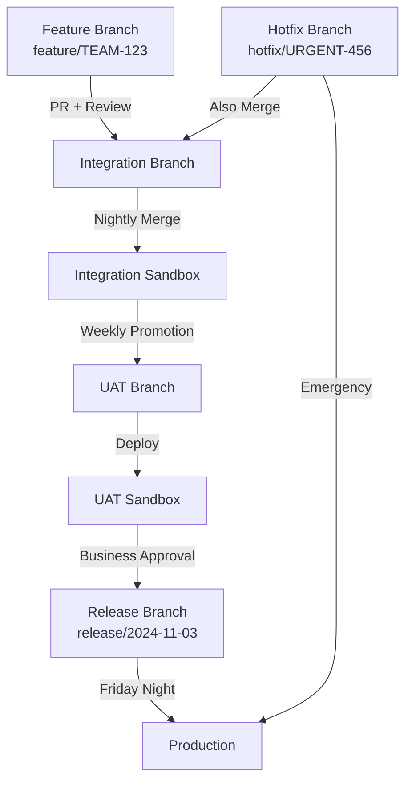
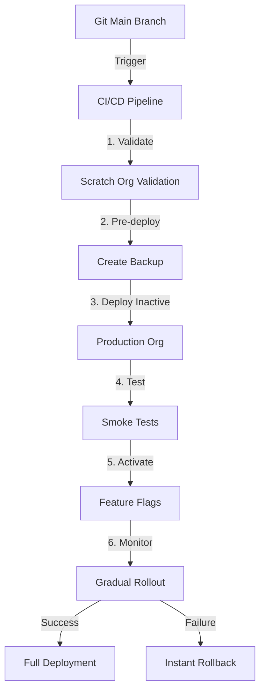

# Technical Interview Scenarios

**Learning Objective**: Master complex real-world scenarios you'll face in technical interviews, with step-by-step solutions that demonstrate expert-level problem-solving.

---

## How to Use This Page

This page contains **scenario-based** interview questions where you're given a problem and must design a complete solution. These are common in senior DevOps and architect-level interviews.

**Study strategy**:
1. Read the scenario completely
2. Take 5-10 minutes to think through your approach
3. Write down your solution outline
4. Compare with the provided solution
5. Practice explaining your approach out loud

**Interview tip**: Interviewers want to see your **thought process**. Think out loud, ask clarifying questions, and explain your reasoning as you work through the problem.

---

## Category 1: Salesforce CI/CD System Design

### Scenario 1: Design a CI/CD System for 50 Development Teams

**The Problem**:
> "You're joining a large enterprise with 50 Salesforce development teams working in a single production org. Each team has 5-10 developers. Currently, they're deploying manually using change sets, resulting in frequent conflicts, delays, and production issues. Design a complete CI/CD system that enables team autonomy while maintaining quality and preventing conflicts."

**Constraints**:
- Single production org (cannot split)
- 250-500 active developers
- Teams work on different functional areas (Sales Cloud, Service Cloud, Marketing Cloud, Custom apps)
- Regulatory requirement: All changes must be auditable
- Must deploy to production weekly (Friday nights)
- Some teams are more mature than others
- Budget approved for tooling

**Your Answer Should Cover**:
- Repository strategy
- Branching model
- Pipeline architecture
- Testing strategy
- Deployment coordination
- Conflict prevention
- Rollback mechanisms
- Observability and monitoring

---

**Solution Framework**:

#### **1. Repository Strategy: Monorepo with Directory-Based Ownership**

```
salesforce-enterprise/
├── sales-cloud/                    # Team 1-10 own
│   ├── objects/
│   ├── classes/
│   ├── flows/
│   └── CODEOWNERS                  # Auto-assigns reviewers
├── service-cloud/                  # Team 11-20 own
├── marketing-cloud/                # Team 21-30 own
├── custom-apps/                    # Team 31-40 own
├── shared/                         # Platform team owns
│   ├── core-classes/
│   ├── integrations/
│   └── utilities/
├── .gitlab-ci.yml
├── package-manifest/
│   ├── base-package.xml
│   ├── sales-package.xml
│   ├── service-package.xml
│   └── production-package.xml
└── README.md
```

**Why monorepo**:
- Single source of truth
- Easier dependency management
- Shared CI/CD configuration
- Atomic deployments across teams
- Better visibility of changes

**Alternative considered**: Multi-repo (one per team)
- Rejected because: Dependency hell, harder to coordinate production deployment, duplicate CI/CD setup

---

#### **2. Branching Strategy: Environment-Based with Team Feature Branches**



**Branch Protection Rules**:
```yaml
main (production):
  - Require 2 approvals (tech lead + manager)
  - Require CI/CD passing
  - Require security scan passing
  - No direct commits
  - Can only merge from release/* branches

release/*:
  - Require 1 approval (tech lead)
  - Require CI/CD passing
  - Can only merge from uat

uat:
  - Require 1 approval
  - Require CI/CD passing
  - Can only merge from integration

integration:
  - Require 1 approval (peer review)
  - Require tests passing
  - Fast-moving branch (multiple merges daily)

feature/*:
  - No restrictions (developers' playground)
```

---

#### **3. CI/CD Pipeline Architecture: Multi-Stage with Parallel Execution**

```yaml
# .gitlab-ci.yml

stages:
  - validate        # Fast feedback (2-5 min)
  - test           # Comprehensive tests (10-20 min)
  - build          # Artifact creation
  - deploy-dev     # Automatic
  - deploy-int     # Automatic
  - deploy-uat     # Gated
  - deploy-prod    # Gated + Scheduled

# ------------------ STAGE 1: VALIDATE ------------------
# Runs on EVERY commit, ANY branch

validate:syntax:
  stage: validate
  script:
    - sf project deploy validate --dry-run
    - echo "Metadata syntax is valid"
  parallel:
    matrix:
      - DIRECTORY: [sales-cloud, service-cloud, marketing-cloud, custom-apps]
  tags:
    - salesforce-runner

validate:lint:
  stage: validate
  script:
    - pmd-scan --dir force-app/ --ruleset .pmd-ruleset.xml --format text
    - eslint force-app/main/default/lwc/
  allow_failure: false

validate:security:
  stage: validate
  script:
    - sf scanner run --target "force-app/**/*.cls" --format table
    - snyk test
  allow_failure: false

validate:secrets:
  stage: validate
  script:
    - git secrets --scan
    - trufflehog filesystem .
  allow_failure: false

# ------------------ STAGE 2: TEST ------------------
# Runs on PR to integration/uat/main

test:apex:
  stage: test
  script:
    - sf org login sfdx-url --sfdx-url-file $SFDX_AUTH_URL_DEV
    - sf project deploy start --test-level RunLocalTests --wait 60
  parallel:
    matrix:
      - APEX_CLASS_PATTERN: ["*Controller*", "*Service*", "*Handler*", "*Batch*", "*Test*"]
  only:
    - merge_requests
    - integration
    - uat
    - main
  artifacts:
    reports:
      junit: test-results/*.xml
      coverage_report:
        coverage_format: cobertura
        path: coverage/cobertura.xml

test:integration:
  stage: test
  script:
    - sf apex run test --test-level RunSpecifiedTests --tests IntegrationTestSuite
  only:
    - integration
    - uat
    - main

test:e2e:
  stage: test
  script:
    - npm install
    - npm run test:e2e
  only:
    - uat
    - main
  artifacts:
    when: always
    paths:
      - cypress/screenshots/
      - cypress/videos/

# ------------------ STAGE 3: BUILD ------------------

build:artifact:
  stage: build
  script:
    - sf project convert source --output-dir mdapi-output
    - zip -r deployment-${CI_COMMIT_SHORT_SHA}.zip mdapi-output/
  artifacts:
    paths:
      - deployment-${CI_COMMIT_SHORT_SHA}.zip
    expire_in: 30 days
  only:
    - integration
    - uat
    - main

# ------------------ STAGE 4: DEPLOY DEV ------------------
# Automatic deployment to team dev sandboxes

deploy:dev:
  stage: deploy-dev
  script:
    - export TEAM_NAME=$(git diff-tree --no-commit-id --name-only -r $CI_COMMIT_SHA | head -1 | cut -d'/' -f1)
    - echo "Deploying to ${TEAM_NAME} dev sandbox"
    - sf org login sfdx-url --sfdx-url-file $SFDX_AUTH_URL_DEV_${TEAM_NAME}
    - sf project deploy start --wait 20
    - ./scripts/smoke-test.sh
  environment:
    name: dev-${TEAM_NAME}
  only:
    - feature/*
  when: on_success

# ------------------ STAGE 5: DEPLOY INTEGRATION ------------------

deploy:integration:
  stage: deploy-int
  script:
    - sf org login sfdx-url --sfdx-url-file $SFDX_AUTH_URL_INT
    - sf project deploy start --wait 30 --test-level RunLocalTests
    - ./scripts/integration-smoke-test.sh
    - ./scripts/notify-slack.sh "Integration deployment complete"
  environment:
    name: integration
    url: https://integration.my.salesforce.com
  only:
    - integration
  when: on_success

deploy:integration:schedule:
  stage: deploy-int
  script:
    - git checkout integration
    - git merge --no-ff origin/feature/team-* --strategy-option theirs
    - sf project deploy start --wait 30
  only:
    - schedules
  # Runs nightly to merge all team branches

# ------------------ STAGE 6: DEPLOY UAT ------------------

deploy:uat:
  stage: deploy-uat
  script:
    - sf org login sfdx-url --sfdx-url-file $SFDX_AUTH_URL_UAT
    - sf project deploy start --wait 45 --test-level RunLocalTests
    - ./scripts/uat-smoke-test.sh
    - ./scripts/notify-business-users.sh "UAT ready for testing"
  environment:
    name: uat
    url: https://uat.my.salesforce.com
  only:
    - uat
  when: manual  # Requires approval
  needs:
    - test:apex
    - test:integration
    - build:artifact

# ------------------ STAGE 7: DEPLOY PRODUCTION ------------------

deploy:production:
  stage: deploy-prod
  before_script:
    - echo "=== PRODUCTION DEPLOYMENT ==="
    - echo "Commit: $CI_COMMIT_SHA"
    - echo "Branch: $CI_COMMIT_BRANCH"
    - echo "Author: $CI_COMMIT_AUTHOR"
    - ./scripts/pre-deployment-backup.sh
  script:
    - sf org login sfdx-url --sfdx-url-file $SFDX_AUTH_URL_PROD
    - sf project deploy start --wait 60 --test-level RunLocalTests
    - ./scripts/production-smoke-test.sh
    - ./scripts/post-deployment-monitoring.sh
  after_script:
    - ./scripts/send-deployment-report.sh
    - ./scripts/notify-all-teams.sh "Production deployment complete"
  environment:
    name: production
    url: https://company.my.salesforce.com
  only:
    - main
  when: manual  # Requires explicit approval
  needs:
    - deploy:uat
  rules:
    - if: '$CI_COMMIT_BRANCH == "main" && $CI_PIPELINE_SOURCE == "schedule"'
      when: on_success  # Automatic on Friday night schedule
    - if: '$CI_COMMIT_BRANCH == "main"'
      when: manual      # Manual trigger available anytime
```

---

#### **4. Testing Strategy: Risk-Based Test Allocation**

```markdown
## Test Pyramid for 50 Teams

Level 4: Manual Testing (5%)
├── Business user acceptance testing
├── Exploratory testing
└── Final production verification

Level 3: E2E Tests (10%)
├── Critical user journeys
├── Integration between modules
└── Cross-team functionality

Level 2: Integration Tests (25%)
├── API integrations
├── Trigger chains
├── Data flows across objects
└── External system callouts

Level 1: Unit Tests (60%)
├── Apex class tests
├── Trigger handler tests
├── LWC Jest tests
└── Validation rule tests
```

**Coverage Requirements by Risk**:
```yaml
critical_components:
  coverage: 100%
  examples:
    - Payment processing
    - Order creation
    - Customer data handling
  tests:
    - Happy path
    - Edge cases
    - Error handling
    - Bulk operations (200 records)
    - Governor limits

important_components:
  coverage: 85%
  examples:
    - Reports and dashboards
    - Email notifications
    - Workflow automation
  tests:
    - Happy path
    - Common edge cases
    - Bulk operations

standard_components:
  coverage: 75%
  examples:
    - UI customizations
    - Helper utilities
    - Formatting functions
  tests:
    - Happy path
    - Basic validation
```

**Test Ownership Model**:
```
Team writes:         Platform team provides:
├── Unit tests       ├── Integration test framework
├── Component tests  ├── E2E test templates
└── Local coverage   ├── Shared test utilities
                     ├── Mock external systems
                     └── Performance test harness
```

---

#### **5. Deployment Coordination: Preventing Conflicts**

**Problem**: 50 teams can't deploy simultaneously without conflicts.

**Solution**: Multi-Level Conflict Prevention

**Prevention Layer 1: CODEOWNERS**
```
# .github/CODEOWNERS or .gitlab/CODEOWNERS

/sales-cloud/**          @team-sales-leads @platform-team
/service-cloud/**        @team-service-leads @platform-team
/shared/**               @platform-team
/integrations/**         @platform-team @security-team
*.xml                    @platform-team
package.xml              @platform-team @devops-team
```

**Prevention Layer 2: Dependency Validation**
```bash
#!/bin/bash
# scripts/validate-dependencies.sh

# Check for cross-team dependencies
CHANGED_FILES=$(git diff --name-only origin/integration)

for file in $CHANGED_FILES; do
  TEAM_DIR=$(echo $file | cut -d'/' -f1)

  # Extract dependencies from metadata
  DEPENDENCIES=$(grep -r "^import" $file | awk '{print $2}')

  for dep in $DEPENDENCIES; do
    DEP_FILE=$(find . -name "${dep}.cls")
    DEP_TEAM=$(echo $DEP_FILE | cut -d'/' -f2)

    if [ "$TEAM_DIR" != "$DEP_TEAM" ]; then
      echo "⚠️  Cross-team dependency detected:"
      echo "   $file depends on $dep (owned by $DEP_TEAM)"
      echo "   Requires approval from $DEP_TEAM"
      exit 1
    fi
  done
done
```

**Prevention Layer 3: Integration Sandbox Testing**
```
Daily at 2 AM:
1. Merge all feature branches to integration branch
2. Deploy to Integration sandbox
3. Run full test suite
4. If conflicts detected:
   - Identify conflicting teams
   - Send automated Slack message
   - Block conflicting PRs from merging
5. Teams resolve conflicts in Integration before promoting to UAT
```

**Prevention Layer 4: Deployment Locks**
```python
# scripts/deployment-lock.py
import redis
import sys

redis_client = redis.Redis(host='redis.company.com')

def acquire_lock(environment, team_name, timeout=3600):
    lock_key = f"deployment_lock:{environment}"

    # Try to acquire lock
    if redis_client.set(lock_key, team_name, nx=True, ex=timeout):
        print(f"✅ Lock acquired for {team_name} on {environment}")
        return True
    else:
        current_owner = redis_client.get(lock_key).decode()
        print(f"❌ {environment} is locked by {current_owner}")
        print(f"   Wait or contact {current_owner} to release")
        return False

def release_lock(environment, team_name):
    lock_key = f"deployment_lock:{environment}"
    current_owner = redis_client.get(lock_key).decode()

    if current_owner == team_name:
        redis_client.delete(lock_key)
        print(f"✅ Lock released for {environment}")
    else:
        print(f"❌ Cannot release lock owned by {current_owner}")

if __name__ == "__main__":
    action = sys.argv[1]
    environment = sys.argv[2]
    team_name = sys.argv[3]

    if action == "acquire":
        if not acquire_lock(environment, team_name):
            sys.exit(1)
    elif action == "release":
        release_lock(environment, team_name)
```

Usage in pipeline:
```yaml
deploy:uat:
  before_script:
    - python scripts/deployment-lock.py acquire uat $TEAM_NAME
  after_script:
    - python scripts/deployment-lock.py release uat $TEAM_NAME
```

---

#### **6. Rollback Mechanisms: Multi-Level Safety Net**

**Level 1: Deployment Validation (Prevent Bad Deploys)**
```yaml
deploy:production:
  script:
    # Validate before actual deployment
    - sf project deploy validate --test-level RunLocalTests --wait 60
    - echo "Validation ID: $(cat validation-id.txt)"
    - ./scripts/review-validation-results.sh

    # If validation passed, quick deploy
    - sf project deploy quick --validation-id $(cat validation-id.txt)
```

**Level 2: Feature Flags (Zero-Downtime Rollback)**
```apex
// Deploy code but disable feature
public class FeatureFlagService {
    public static Boolean isFeatureEnabled(String featureName) {
        Feature_Flag__mdt flag = Feature_Flag__mdt.getInstance(featureName);

        if (flag == null) return false;

        // Check environment
        if (!flag.Enabled_In_Prod__c && EnvironmentUtil.isProduction()) {
            return false;
        }

        return flag.Is_Enabled__c;
    }
}

// In code
if (FeatureFlagService.isFeatureEnabled('New_Opportunity_Flow')) {
    // New logic
    newOpportunityFlow();
} else {
    // Old logic (fallback)
    oldOpportunityFlow();
}
```

If feature causes issues: Disable via metadata (no redeployment needed)
```bash
sf data update record --sobject Feature_Flag__mdt --where "DeveloperName='New_Opportunity_Flow'" --values "Is_Enabled__c=false" --use-tooling-api
```

**Level 3: Git Revert (Code Rollback)**
```bash
#!/bin/bash
# scripts/rollback-production.sh

COMMIT_TO_REVERT=$1

echo "🔄 Initiating rollback of commit $COMMIT_TO_REVERT"

# 1. Create rollback branch
git checkout main
git pull
git checkout -b rollback/emergency-$(date +%s)

# 2. Revert the problematic commit
git revert $COMMIT_TO_REVERT --no-edit

# 3. Fast-track through pipeline
git push origin rollback/emergency-$(date +%s)

# 4. Trigger emergency deployment
curl -X POST \
  -F "token=$CI_TRIGGER_TOKEN" \
  -F "ref=rollback/emergency-$(date +%s)" \
  -F "variables[EMERGENCY_DEPLOY]=true" \
  https://gitlab.com/api/v4/projects/$CI_PROJECT_ID/trigger/pipeline

echo "✅ Rollback pipeline triggered"
echo "   Monitor at: https://gitlab.com/$CI_PROJECT_PATH/-/pipelines"
```

**Level 4: Backup Restoration (Nuclear Option)**
```bash
#!/bin/bash
# scripts/restore-from-backup.sh

BACKUP_DATE=$1

echo "⚠️  RESTORING FROM BACKUP: $BACKUP_DATE"
echo "   This will overwrite current production state"
read -p "   Are you sure? (yes/no): " confirm

if [ "$confirm" != "yes" ]; then
  echo "Aborted"
  exit 1
fi

# Restore metadata from backup
sf project deploy start \
  --manifest backups/${BACKUP_DATE}/package.xml \
  --source-dir backups/${BACKUP_DATE}/ \
  --target-org Production \
  --wait 60 \
  --test-level NoTestRun

echo "✅ Restoration complete"
```

---

#### **7. Observability and Monitoring**

**Deployment Dashboard** (Grafana + Prometheus):
```markdown
## Real-Time Deployment Status

### Current Deployments
- UAT: Team-Sales deploying Opportunity_v2 (87% complete)
- Integration: Team-Service queue position #2

### Today's Stats
- Deployments: 47 (target: 50/day)
- Success rate: 94% (target: >90%)
- Avg deployment time: 12 min (target: <15 min)
- Rollbacks: 1 (Team-Marketing, resolved)

### Production Health
- Last deployment: 2 hours ago
- Error rate: 0.12% (baseline: 0.10%)
- Response time: 1.1s (baseline: 1.0s)
- Active users: 4,237
```

**Team-Specific Metrics**:
```sql
-- Query deployment metrics per team

SELECT
  team_name,
  COUNT(*) as total_deployments,
  AVG(CASE WHEN status = 'success' THEN 1 ELSE 0 END) as success_rate,
  AVG(duration_minutes) as avg_duration,
  SUM(CASE WHEN rolled_back THEN 1 ELSE 0 END) as rollback_count
FROM deployments
WHERE deployment_date >= CURRENT_DATE - INTERVAL '30 days'
GROUP BY team_name
ORDER BY success_rate DESC;
```

**Automated Alerts** (PagerDuty + Slack):
```yaml
alerts:
  - name: deployment_failure
    condition: deployment.status == 'failed'
    severity: high
    notify:
      - slack: "#deployments"
      - pagerduty: "on-call-devops"
    message: "Deployment failed: {team} to {environment}"

  - name: production_error_spike
    condition: error_rate > baseline * 2
    severity: critical
    notify:
      - slack: "#production-alerts"
      - pagerduty: "on-call-engineering"
    message: "Production errors 2x normal: {error_count} in last 5 min"

  - name: deployment_duration
    condition: deployment.duration > 30 minutes
    severity: medium
    notify:
      - slack: "#performance"
    message: "Slow deployment: {team} took {duration} min"
```

---

### **Interview Discussion Points**

**When presenting this solution, emphasize**:

1. **Scalability**: System handles 50 teams today, can scale to 100+
2. **Autonomy**: Teams deploy independently to dev/int, coordinated for prod
3. **Safety**: Multiple layers prevent bad deployments reaching production
4. **Observability**: Real-time visibility into deployments and health
5. **Audibility**: Full history in Git + deployment logs meet compliance
6. **Trade-offs**: Monorepo complexity vs. multi-repo coordination overhead

**Questions to ask interviewer**:
- "What's the current deployment frequency per team?"
- "Are there any teams that deploy more urgently than others?"
- "What's the tolerance for deployment failures?"
- "Do you have existing CI/CD infrastructure I should build on?"
- "What's the team's experience level with Git and DevOps tools?"

**Handling push-back**:
- "Why not multi-repo?" → "We can phase that in later for very independent teams, but starting with monorepo simplifies initial coordination"
- "This seems complex" → "We'd implement incrementally: Month 1 (basic pipeline), Month 2 (team branches), Month 3 (full coordination)"
- "What if teams resist change?" → "We'd run a pilot with 3-5 teams, demonstrate success, then roll out organization-wide with training"

---

## Category 2: Complex Troubleshooting Scenarios

### Scenario 2: Production Deployment Succeeded but Features Aren't Working

**The Problem**:
> "You deployed a major release to production Friday night. All tests passed, deployment succeeded, but Monday morning users report that the new Opportunity Approval feature isn't working. Approvals aren't showing up, and clicking 'Approve' does nothing. The same code works perfectly in UAT. You have 500 users unable to approve $50M in opportunities. Walk me through your troubleshooting process."

---

**Solution Framework**:

#### **Phase 1: Immediate Triage (First 5 Minutes)**

**1. Confirm the issue**
```bash
# Can you reproduce it?
1. Log into production as test user
2. Navigate to Opportunity
3. Try to submit for approval
4. Try to approve
5. Document exact error (if any)
```

**2. Check deployment status**
```bash
# Verify deployment actually completed
sf project deploy report --job-id <deployment-id>

# Output shows:
# Status: Succeeded
# Tests Run: 450/450 passed
# Components Deployed: 87/87
```

**3. Quick health check**
```bash
# Is it all users or specific users?
- Test with multiple profiles: Sales Manager, Sales Rep, Admin
- Test in different browsers
- Check mobile app

# Result: Affects all non-admin users
```

**4. Compare environments**
```bash
# What's different between UAT (works) and Production (broken)?
sf project retrieve start --target-org UAT --output-dir uat-metadata
sf project retrieve start --target-org Production --output-dir prod-metadata

diff -r uat-metadata/ prod-metadata/
```

---

#### **Phase 2: Environment Comparison (Minutes 5-15)**

**Checklist of common differences**:

**1. Permission Sets / Profiles**
```bash
# Check if users have the right permissions
sf data query --query "
  SELECT Id, Name, Profile.Name
  FROM User
  WHERE IsActive = true
  LIMIT 10
" --target-org Production

# Check permission set assignments
sf data query --query "
  SELECT Assignee.Name, PermissionSet.Name
  FROM PermissionSetAssignment
  WHERE PermissionSet.Name LIKE '%Approval%'
" --target-org Production
```

**Finding**: The new permission set `Opportunity_Approver__c` was deployed but not assigned to users!

**2. Validation Rules**
```bash
# Check if validation rules are active
sf data query --query "
  SELECT DeveloperName, Active
  FROM ValidationRule
  WHERE EntityDefinition.QualifiedApiName = 'Opportunity'
" --use-tooling-api --target-org Production

# Output shows:
# Require_Approval_Status__c: Active = true (should be false for testing)
```

**3. Approval Process**
```bash
# Check approval process status
sf data query --query "
  SELECT DeveloperName, TableEnumOrId, IsActive
  FROM ProcessDefinition
  WHERE TableEnumOrId = 'Opportunity'
" --use-tooling-api --target-org Production
```

**Finding**: Approval process `Opportunity_Approval_v2` exists but `IsActive = false`!

**4. Custom Settings / Metadata**
```bash
# Check custom metadata configuration
sf data query --query "
  SELECT DeveloperName, Enable_Approvals__c
  FROM Approval_Config__mdt
" --target-org Production

# Output:
# Default_Config: Enable_Approvals__c = false (!!!)
```

---

#### **Phase 3: Root Cause Analysis (Minutes 15-30)**

**Root causes identified**:

1. **Approval Process not activated**
   - Deployment can't auto-activate approval processes
   - Must be manually activated post-deployment

2. **Permission set not assigned**
   - Permission set was deployed but assignments weren't
   - Assignments are data, not metadata

3. **Configuration metadata has wrong values**
   - Custom metadata had test values instead of production values
   - Need environment-specific deployment

---

#### **Phase 4: Immediate Fix (Minutes 30-45)**

**Fix 1: Activate Approval Process**
```bash
# Unfortunately, no CLI command to activate
# Must use UI or Metadata API

# Option A: Manual (fastest)
1. Setup → Approval Processes
2. Find "Opportunity_Approval_v2"
3. Click "Activate"

# Option B: Automated for future
# Create script to check and activate post-deployment
```

**Fix 2: Assign Permission Sets**
```bash
# Get all users who should have access
sf data query --query "
  SELECT Id, Name
  FROM User
  WHERE Profile.Name IN ('Sales Manager', 'VP Sales')
  AND IsActive = true
" --target-org Production > users.json

# Create permission set assignments
# Using bash + jq to process JSON
cat users.json | jq -r '.result.records[] | .Id' | while read user_id; do
  sf data create record \
    --sobject PermissionSetAssignment \
    --values "AssigneeId=${user_id} PermissionSetId=<perm-set-id>" \
    --target-org Production
done
```

**Fix 3: Update Configuration Metadata**
```bash
# Update custom metadata with production values
sf data update record \
  --sobject Approval_Config__mdt \
  --where "DeveloperName='Default_Config'" \
  --values "Enable_Approvals__c=true" \
  --use-tooling-api \
  --target-org Production
```

**Fix 4: Verify**
```bash
# Test as end user
1. Log in as Sales Manager
2. Navigate to Opportunity
3. Click "Submit for Approval" → ✅ Works
4. Log in as VP Sales
5. See approval request → ✅ Shows up
6. Click "Approve" → ✅ Works

# Monitor for 10 minutes
watch -n 30 'sf data query --query "SELECT COUNT() FROM ProcessInstance WHERE Status = 'Pending' AND CreatedDate = TODAY" --target-org Production'
```

---

#### **Phase 5: Post-Incident Prevention (Hours-Days Later)**

**1. Post-Mortem Document**
```markdown
# Incident Report: Approval Feature Not Working in Production

## Summary
- Impact: 500 users unable to approve opportunities for 45 minutes
- Revenue impact: $50M in opportunities delayed
- Root cause: Multi-factor deployment issue

## Timeline
- 00:00 - Deployment completed successfully
- 72:00 (Monday 9 AM) - First user reports issue
- 72:05 - Incident escalated to DevOps team
- 72:45 - Fix applied, verified working
- 73:00 - All-clear, monitoring continues

## Root Causes
1. Approval process deployed but not activated (no auto-activation in API)
2. Permission sets deployed but not assigned (assignments are data, not metadata)
3. Configuration metadata had wrong environment-specific values

## What Went Wrong
1. UAT testing used admin users (had all permissions)
2. No post-deployment verification for approval flow
3. No automation to assign permission sets
4. Custom metadata not environment-specific

## What Went Right
1. Detected within 1 hour of users arriving
2. Fixed within 45 minutes
3. No data corruption
4. Full rollback available (not needed)

## Action Items
- [ ] Add post-deployment smoke test for approval flow
- [ ] Automate permission set assignment in deployment
- [ ] Create environment-specific custom metadata
- [ ] Add approval process activation to deployment script
- [ ] Update UAT testing to use non-admin users
```

**2. Deployment Script Improvements**
```bash
#!/bin/bash
# scripts/post-deployment-production.sh

echo "Running post-deployment configuration..."

# 1. Activate approval processes
echo "Activating approval processes..."
./scripts/activate-approval-processes.sh

# 2. Assign permission sets
echo "Assigning permission sets..."
./scripts/assign-permission-sets.sh

# 3. Verify custom metadata configuration
echo "Verifying configuration..."
./scripts/verify-config-metadata.sh

# 4. Run smoke tests
echo "Running smoke tests..."
./scripts/production-smoke-tests.sh

echo "Post-deployment configuration complete"
```

**3. Smoke Test Enhancement**
```bash
#!/bin/bash
# scripts/production-smoke-tests.sh

# Test approval flow
echo "Testing approval flow..."

# Create test opportunity
OPPORTUNITY_ID=$(sf data create record \
  --sobject Opportunity \
  --values "Name='SMOKE_TEST' StageName='Qualification' CloseDate='2024-12-31' Amount=100000" \
  --target-org Production \
  --json | jq -r '.result.id')

# Submit for approval
sf apex run --file - <<EOF
  Approval.ProcessSubmitRequest req = new Approval.ProcessSubmitRequest();
  req.setObjectId('${OPPORTUNITY_ID}');
  Approval.process(req);
EOF

# Verify approval request created
APPROVAL_COUNT=$(sf data query \
  --query "SELECT COUNT() FROM ProcessInstance WHERE TargetObjectId='${OPPORTUNITY_ID}'" \
  --target-org Production \
  --json | jq -r '.result.totalSize')

if [ "$APPROVAL_COUNT" -eq 1 ]; then
  echo "✅ Approval flow working"
else
  echo "❌ Approval flow broken"
  exit 1
fi

# Cleanup
sf data delete record --sobject Opportunity --record-id $OPPORTUNITY_ID --target-org Production

echo "✅ All smoke tests passed"
```

**4. Pipeline Enhancement**
```yaml
deploy:production:
  after_script:
    - ./scripts/post-deployment-production.sh
    - ./scripts/production-smoke-tests.sh
    - if [ $? -eq 0 ]; then
        echo "✅ Deployment verified healthy";
      else
        echo "❌ Post-deployment checks failed";
        ./scripts/alert-on-call.sh;
        exit 1;
      fi
```

---

### **Interview Discussion Points**

**When presenting this solution, emphasize**:

1. **Structured approach**: Triage → Compare → Root cause → Fix → Prevent
2. **Time awareness**: Quick wins first (activate approval), then systematic fixes
3. **Communication**: Would update stakeholders every 15 minutes
4. **Learning mindset**: Turned incident into improvement opportunity
5. **Automation**: Built scripts to prevent recurrence

**Questions to ask interviewer**:
- "What's the escalation process if I can't fix it in 1 hour?"
- "Do you have a rollback SLA I should be aware of?"
- "Should I prioritize fixing vs. rolling back?"
- "Is there a maintenance window I can use?"

---

### Scenario 3: Deployment Hanging at 83% for 30 Minutes

**The Problem**:
> "It's Friday night, 11 PM. You're deploying the weekly release to production. The deployment has been at 83% complete for 30 minutes with no progress. The deployment usually takes 15 minutes. You can't cancel it (Salesforce doesn't allow canceling in-progress deployments). Users start work at 6 AM (7 hours from now). What do you do?"

---

**Solution Framework**:

#### **Phase 1: Diagnosis (First 10 Minutes)**

**1. Get deployment details**
```bash
# Check deployment status
sf project deploy report --job-id <job-id> --target-org Production

# Output:
# Status: In Progress
# Number components deployed: 72/87
# Number components errors: 0
# Number tests completed: 380/450
# Tests running: 70
```

**Key insight**: Tests are running but stuck

**2. Identify which test is stuck**
```bash
# Get detailed test results
sf project deploy report --job-id <job-id> --target-org Production --json | jq '.result.details.runTestResult.successes[] | .name'

# Shows completed tests
# Last completed: OpportunityTriggerTest.testBulkUpdate (3 min ago)

# Get currently running
sf apex get test --test-run-id <test-run-id> --target-org Production --json | jq '.result.tests[] | select(.Status == "Running")'

# Output:
# AccountIntegrationTest.testExternalSync - Running for 31 minutes
```

**Finding**: `AccountIntegrationTest.testExternalSync` is hanging, likely due to external callout

---

#### **Phase 2: Risk Assessment (Minutes 10-15)**

**Calculate options**:

Option 1: **Wait**
- Pro: Might complete eventually
- Con: Unknown if it will complete
- Con: If it fails after 60 min, we're at 12:30 AM
- Risk: High

Option 2: **Kill the deployment** (can't do this - Salesforce doesn't allow)
- Not possible

Option 3: **Deploy without running tests** (start a new deployment)
- Can't do this either - would conflict with running deployment

Option 4: **Fix the test timeout issue and redeploy**
- Pro: Guaranteed to work
- Con: Requires canceling current deployment
- Can't cancel running deployment!

**Realization**: We're stuck waiting OR need Salesforce Support to cancel

---

#### **Phase 3: Immediate Actions (Minutes 15-30)**

**1. Open Salesforce Support case**
```markdown
Priority: P1 (Production Down)
Subject: Deployment hanging for 40 minutes, need cancellation

Description:
Deployment ID: 0Af3h000000XyZ
Started: 2024-11-03 23:00 UTC
Status: Stuck at 83% for 40 minutes
Test hanging: AccountIntegrationTest.testExternalSync
Impact: Weekly release blocked, users need system in 6 hours

Request: Please cancel deployment 0Af3h000000XyZ

Our reference: INC-2024-1103-001
```

**2. Investigate the hanging test**
```bash
# Pull the test class
sf project retrieve start \
  --metadata ApexClass:AccountIntegrationTest \
  --target-org Production

# Review code
cat force-app/main/default/classes/AccountIntegrationTest.cls
```

```apex
@isTest
public class AccountIntegrationTest {
    @isTest
    static void testExternalSync() {
        // Problem: Makes real HTTP callout!
        HttpRequest req = new HttpRequest();
        req.setEndpoint('https://external-api.example.com/sync');
        req.setMethod('POST');

        Http http = new Http();
        HttpResponse res = http.send(req);  // ← Hanging here!

        System.assertEquals(200, res.getStatusCode());
    }
}
```

**Finding**: Test makes real callout without timeout, external API is down or slow

---

#### **Phase 4: Parallel Actions While Waiting (Minutes 30-60)**

**1. Prepare fixed version**
```apex
@isTest
public class AccountIntegrationTest {
    @isTest
    static void testExternalSync() {
        // Set mock callout
        Test.setMock(HttpCalloutMock.class, new MockHttpResponseGenerator());

        // Test with mock
        HttpRequest req = new HttpRequest();
        req.setEndpoint('callout:ExternalAPI/sync');
        req.setMethod('POST');
        req.setTimeout(10000);  // 10 second timeout

        Test.startTest();
        Http http = new Http();
        HttpResponse res = http.send(req);
        Test.stopTest();

        System.assertEquals(200, res.getStatusCode());
    }
}

public class MockHttpResponseGenerator implements HttpCalloutMock {
    public HttpResponse respond(HttpRequest req) {
        HttpResponse res = new HttpResponse();
        res.setStatusCode(200);
        res.setBody('{"status": "success"}');
        return res;
    }
}
```

```bash
# Commit fix
git checkout -b hotfix/fix-hanging-test
git add force-app/main/default/classes/AccountIntegrationTest.cls
git commit -m "Fix: Add timeout and mock to AccountIntegrationTest"
git push origin hotfix/fix-hanging-test
```

**2. Communicate with stakeholders**
```markdown
To: Engineering Leadership, Business Stakeholders
Subject: Production Deployment Delayed - Action Required

Status: DELAYED

Current situation:
- Production deployment started 11 PM Friday
- Deployment hanging at 83% due to test timeout
- Test is making external API call that's not responding
- Salesforce Support engaged to cancel deployment

Timeline:
- 11:00 PM - Deployment started
- 11:45 PM - Identified hanging test (AccountIntegrationTest)
- 12:00 AM - Support case opened (Case #12345)
- 12:30 AM - Fixed test prepared, waiting for cancellation

Options:
1. Wait for Salesforce Support to cancel (ETA: 1-2 hours)
2. Wait for test to timeout naturally (might never complete)
3. Rollback plan: Deploy last week's version if needed

Next update: 1:00 AM or when status changes

On-call: [Your name, phone, Slack]
```

**3. Prepare rollback**
```bash
# In case we need to abort and rollback
git checkout main
git log -1  # Get last successful commit

# Prepare rollback deployment
sf project deploy start \
  --dry-run \
  --wait 10 \
  --target-org Production \
  --test-level NoTestRun  # Validation only
```

**4. Monitor external API**
```bash
# Check if external API is back online
while true; do
  curl -I https://external-api.example.com/sync
  sleep 60
done

# If it comes back online, deployment might complete
```

---

#### **Phase 5: Resolution (Hour 1-2)**

**Scenario A: Salesforce Support cancels deployment**
```markdown
12:45 AM - Support canceled deployment

Immediate actions:
1. Verify cancellation
2. Deploy fixed version with mock tests
3. Deployment completes in 15 minutes (1:00 AM)
4. Verify smoke tests
5. Send all-clear email (1:05 AM)

Result: Production ready with 5 hours to spare before users arrive
```

**Scenario B: Test eventually times out**
```markdown
1:15 AM - Test finally timed out after 75 minutes
Deployment failed due to test failure

Immediate actions:
1. Deploy fixed version with mock tests
2. Deployment completes at 1:30 AM
3. Verify smoke tests
4. Send all-clear email

Result: Production ready with 4.5 hours to spare
```

**Scenario C: Won't resolve before users arrive**
```markdown
3:00 AM - Still no resolution

Decision time:
- Users arrive in 3 hours
- Deploy can't complete

Option 1: Rollback to last week's version
Option 2: Inform users of delay, work in day shift

Choose: Rollback (users expect stability)

Actions:
1. Open new Support case requesting cancellation URGENT
2. Once cancelled, deploy last week's version
3. Last week's version working by 4:00 AM
4. New release rescheduled for next week

Result: Users have working system (old version)
```

---

#### **Phase 6: Post-Mortem and Prevention**

**Post-Mortem**:
```markdown
# Incident: Deployment Hung for 2+ Hours

## What Happened
- Production deployment hung at 83% due to test timeout
- Test was making real HTTP callout to external API
- External API was slow/down
- Test had no timeout configured
- Deployment blocked for 2 hours

## Root Causes
1. Test making real HTTP callout (should be mocked)
2. No timeout on HTTP request
3. No pre-deployment validation caught this
4. Test worked in UAT because external API was up

## Prevention
1. **Immediate (Done)**:
   - Fixed AccountIntegrationTest to use mock
   - Added 10-second timeout to all HTTP requests

2. **This Week**:
   - [ ] Scan all test classes for real callouts
   - [ ] Update coding standards: Always mock external calls
   - [ ] Add pre-commit hook to detect HttpCalloutMock missing

3. **This Month**:
   - [ ] Add timeout to all HTTP requests (code scan rule)
   - [ ] Create shared test utilities for common mocks
   - [ ] Document external API dependencies

4. **This Quarter**:
   - [ ] Implement circuit breaker for external APIs
   - [ ] Add monitoring for external API health
   - [ ] Create runbook for hanging deployments
```

**Pipeline Improvements**:
```yaml
# Add pre-deployment validation
validate:tests:
  stage: validate
  script:
    # Check for tests without mocks
    - |
      grep -r "Http http = new Http()" force-app/main/default/classes/*Test.cls | while read line; do
        file=$(echo $line | cut -d':' -f1)
        if ! grep -q "Test.setMock" "$file"; then
          echo "❌ $file makes HTTP callout without mock"
          exit 1
        fi
      done

    # Check for missing timeouts
    - |
      grep -r "Http http = new Http()" force-app/main/default/classes/*.cls | while read line; do
        file=$(echo $line | cut -d':' -f1)
        if ! grep -q "setTimeout" "$file"; then
          echo "⚠️  $file missing setTimeout"
          exit 1
        fi
      done
  allow_failure: false
```

**Coding Standard Update**:
```markdown
## External API Callouts

### Rule: Always Mock in Tests

❌ **Bad**:
```apex
@isTest
static void testAPI() {
    Http http = new Http();
    HttpRequest req = new HttpRequest();
    req.setEndpoint('https://api.example.com');
    HttpResponse res = http.send(req);  // Real callout!
}
```

✅ **Good**:
```apex
@isTest
static void testAPI() {
    Test.setMock(HttpCalloutMock.class, new MockAPI());

    Test.startTest();
    Http http = new Http();
    HttpRequest req = new HttpRequest();
    req.setEndpoint('callout:ExternalAPI');
    HttpResponse res = http.send(req);
    Test.stopTest();
}
```

### Rule: Always Set Timeout

❌ **Bad**:
```apex
HttpRequest req = new HttpRequest();
req.setEndpoint('https://api.example.com');
// No timeout!
```

✅ **Good**:
```apex
HttpRequest req = new HttpRequest();
req.setEndpoint('https://api.example.com');
req.setTimeout(10000);  // 10 seconds
```

---

### **Interview Discussion Points**

**When presenting this solution, emphasize**:

1. **Calm under pressure**: Systematic approach even at midnight
2. **Parallel work**: Fixed the issue while waiting for resolution
3. **Communication**: Kept stakeholders informed every 30 min
4. **Risk assessment**: Evaluated multiple options with trade-offs
5. **Learning**: Turned into systematic prevention

**Questions to ask interviewer**:
- "What's your process for engaging Salesforce Support?"
- "Do you have on-call rotation? What's the escalation path?"
- "What's the SLA for production deployments?"
- "Would you prefer to rollback or wait in this scenario?"

**Variations they might ask**:
- "What if this happened during business hours?" → Rollback immediately
- "What if you couldn't reach support?" → Wait for natural timeout, prepare rollback
- "How do you prevent this?" → Pre-deployment validation, mock all external calls

---

## Category 3: System Design Questions

### Scenario 4: Design a Blue-Green Deployment System for Salesforce

**The Problem**:
> "Traditional Salesforce deployments have downtime during test execution and metadata replacement. Design a blue-green deployment system that enables zero-downtime deployments for a large Salesforce org with 10,000 users. Assume you have access to modern Salesforce features and can use external tools."

---

**Solution Framework**:

#### **Challenge: Salesforce Doesn't Support Traditional Blue-Green**

Traditional blue-green deployment:
```
Blue Environment (live)  ← Users here
Green Environment (new)  ← Deploy here, then switch traffic

Problem: Can't have 2 identical production orgs in Salesforce
```

**Adapted approach for Salesforce**:
```
Instead of environment switching, use:
1. Feature flags for logic switching
2. Namespaced components for parallel deployment
3. Scratch org validation before production deployment
4. Graceful degradation during deployment
```

---

#### **Architecture**



---

#### **Components**

**1. Feature Flag System**

```apex
// Feature Flag Service
public class FeatureFlagService {

    // Cache feature flags for performance
    private static Map<String, Feature_Flag__mdt> flagCache;

    static {
        flagCache = new Map<String, Feature_Flag__mdt>();
        for (Feature_Flag__mdt flag : [
            SELECT DeveloperName, Is_Enabled__c, Rollout_Percentage__c,
                   Enabled_For_Profiles__c, Enabled_For_Users__c
            FROM Feature_Flag__mdt
        ]) {
            flagCache.put(flag.DeveloperName, flag);
        }
    }

    /**
     * Check if feature is enabled for current user
     */
    public static Boolean isEnabled(String featureName) {
        Feature_Flag__mdt flag = flagCache.get(featureName);

        if (flag == null || !flag.Is_Enabled__c) {
            return false;
        }

        // Check if user is in rollout percentage
        if (flag.Rollout_Percentage__c < 100) {
            return isUserInRollout(flag.Rollout_Percentage__c);
        }

        // Check profile allowlist
        if (String.isNotBlank(flag.Enabled_For_Profiles__c)) {
            String currentProfile = UserInfo.getProfileId();
            return flag.Enabled_For_Profiles__c.contains(currentProfile);
        }

        // Check user allowlist
        if (String.isNotBlank(flag.Enabled_For_Users__c)) {
            String currentUser = UserInfo.getUserId();
            return flag.Enabled_For_Users__c.contains(currentUser);
        }

        return true;
    }

    /**
     * Determine if user falls into rollout percentage
     * Uses consistent hashing so same user always gets same result
     */
    private static Boolean isUserInRollout(Decimal percentage) {
        String userId = UserInfo.getUserId();
        Integer hashCode = Math.abs(userId.hashCode());
        Integer bucket = Math.mod(hashCode, 100);
        return bucket < percentage;
    }

    /**
     * Get feature variant (for A/B testing)
     */
    public static String getVariant(String featureName) {
        Feature_Flag__mdt flag = flagCache.get(featureName);

        if (flag == null || String.isBlank(flag.Variants__c)) {
            return 'default';
        }

        // Parse variants (format: "A:50,B:30,C:20")
        List<String> variants = flag.Variants__c.split(',');
        Integer random = Math.mod(Math.abs(UserInfo.getUserId().hashCode()), 100);

        Integer cumulative = 0;
        for (String variant : variants) {
            List<String> parts = variant.split(':');
            String name = parts[0];
            Integer weight = Integer.valueOf(parts[1]);
            cumulative += weight;

            if (random < cumulative) {
                return name;
            }
        }

        return 'default';
    }
}
```

Usage in code:
```apex
public class OpportunityService {
    public static void processOpportunity(Opportunity opp) {

        if (FeatureFlagService.isEnabled('New_Opportunity_Flow_v2')) {
            // 🆕 New logic (gradually rolled out)
            processWithNewFlow(opp);
        } else {
            // 🔷 Old logic (stable fallback)
            processWithOldFlow(opp);
        }
    }

    private static void processWithNewFlow(Opportunity opp) {
        // New implementation
        try {
            // Complex new logic
            calculateAdvancedScoring(opp);
            enrichWithExternalData(opp);
            applyMLPredictions(opp);
        } catch (Exception e) {
            // If new flow fails, fall back to old
            System.debug('New flow failed, falling back: ' + e.getMessage());
            processWithOldFlow(opp);
        }
    }

    private static void processWithOldFlow(Opportunity opp) {
        // Original stable implementation
        calculateBasicScoring(opp);
    }
}
```

---

**2. Deployment Pipeline with Gradual Rollout**

```yaml
# .gitlab-ci.yml

stages:
  - validate
  - backup
  - deploy
  - smoke-test
  - activate
  - monitor
  - rollback

# ------------------------------------------------------------------
# STAGE 1: VALIDATE IN SCRATCH ORG
# ------------------------------------------------------------------

validate:scratchorg:
  stage: validate
  script:
    # Create scratch org identical to production
    - sf org create scratch --definition-file config/project-scratch-def.json --alias validate-org --duration-days 1

    # Deploy all metadata
    - sf project deploy start --target-org validate-org --wait 30

    # Run all tests
    - sf apex run test --target-org validate-org --test-level RunLocalTests --wait 30 --code-coverage

    # Verify coverage
    - COVERAGE=$(sf apex get test --test-run-id $TEST_RUN_ID --json | jq '.result.summary.orgWideCoverage')
    - if [ "$COVERAGE" -lt 75 ]; then echo "Coverage too low: $COVERAGE%"; exit 1; fi

    # Smoke tests
    - npm run test:e2e -- --env validate-org

    # Cleanup
    - sf org delete scratch --target-org validate-org --no-prompt
  artifacts:
    reports:
      junit: test-results/*.xml

# ------------------------------------------------------------------
# STAGE 2: BACKUP PRODUCTION
# ------------------------------------------------------------------

backup:production:
  stage: backup
  script:
    - echo "Creating production backup..."
    - sf project retrieve start --target-org Production --manifest package.xml --output-dir backups/$(date +%Y%m%d-%H%M%S)
    - sf data export tree --query @config/backup-queries.txt --output-dir backups/$(date +%Y%m%d-%H%M%S)/data
  artifacts:
    paths:
      - backups/
    expire_in: 30 days
  only:
    - main

# ------------------------------------------------------------------
# STAGE 3: DEPLOY TO PRODUCTION (INACTIVE)
# ------------------------------------------------------------------

deploy:production:
  stage: deploy
  script:
    - sf org login sfdx-url --sfdx-url-file $SFDX_AUTH_URL_PROD

    # Deploy new code with feature flags DISABLED
    - echo "Deploying with all feature flags disabled..."
    - sf project deploy start --wait 60 --test-level RunLocalTests

    # Verify deployment
    - if [ $? -ne 0 ]; then
        echo "❌ Deployment failed";
        exit 1;
      fi

    - echo "✅ Deployment successful, features not yet activated"
  environment:
    name: production-blue
  only:
    - main

# ------------------------------------------------------------------
# STAGE 4: SMOKE TESTS
# ------------------------------------------------------------------

smoke:test:
  stage: smoke-test
  script:
    # Test with feature flags disabled (should use old logic)
    - npm run test:smoke -- --env production --flags-disabled

    # Enable flags for test users only
    - sf data update record --sobject Feature_Flag__mdt --where "DeveloperName='New_Opportunity_Flow_v2'" --values "Enabled_For_Users__c='$TEST_USER_IDS'" --use-tooling-api

    # Test with feature flags enabled for test users
    - npm run test:smoke -- --env production --flags-enabled --test-users

  environment:
    name: production-blue
  only:
    - main

# ------------------------------------------------------------------
# STAGE 5: GRADUAL ACTIVATION
# ------------------------------------------------------------------

activate:10percent:
  stage: activate
  script:
    - echo "Activating for 10% of users..."
    - sf data update record --sobject Feature_Flag__mdt --where "DeveloperName='New_Opportunity_Flow_v2'" --values "Is_Enabled__c=true Rollout_Percentage__c=10" --use-tooling-api
    - sleep 300  # Wait 5 minutes
    - ./scripts/check-error-rate.sh
  environment:
    name: production-10pct
  when: manual
  only:
    - main

activate:50percent:
  stage: activate
  script:
    - echo "Activating for 50% of users..."
    - sf data update record --sobject Feature_Flag__mdt --where "DeveloperName='New_Opportunity_Flow_v2'" --values "Rollout_Percentage__c=50" --use-tooling-api
    - sleep 300
    - ./scripts/check-error-rate.sh
  environment:
    name: production-50pct
  when: manual
  needs:
    - activate:10percent
  only:
    - main

activate:100percent:
  stage: activate
  script:
    - echo "Activating for 100% of users..."
    - sf data update record --sobject Feature_Flag__mdt --where "DeveloperName='New_Opportunity_Flow_v2'" --values "Rollout_Percentage__c=100" --use-tooling-api
    - ./scripts/check-error-rate.sh
  environment:
    name: production-100pct
  when: manual
  needs:
    - activate:50percent
  only:
    - main

# ------------------------------------------------------------------
# STAGE 6: MONITORING
# ------------------------------------------------------------------

monitor:production:
  stage: monitor
  script:
    - |
      for i in {1..12}; do  # Monitor for 1 hour (12 x 5 min)
        echo "Monitoring iteration $i/12"

        # Check error rate
        ./scripts/check-error-rate.sh

        # Check performance
        ./scripts/check-performance.sh

        # Check user complaints
        ./scripts/check-support-tickets.sh

        sleep 300  # 5 minutes
      done

    - echo "✅ Monitoring complete, deployment stable"
  environment:
    name: production
  only:
    - main

# ------------------------------------------------------------------
# STAGE 7: INSTANT ROLLBACK (IF NEEDED)
# ------------------------------------------------------------------

rollback:instant:
  stage: rollback
  script:
    - echo "🚨 INSTANT ROLLBACK - Disabling feature flags"

    # Immediately disable all new features
    - sf data update record --sobject Feature_Flag__mdt --where "DeveloperName='New_Opportunity_Flow_v2'" --values "Is_Enabled__c=false" --use-tooling-api

    - echo "✅ All users reverted to old logic (no redeployment needed)"

    # If code rollback needed
    - if [ "$FULL_ROLLBACK" = "true" ]; then
        echo "Performing full code rollback...";
        sf project deploy start --source-dir backups/latest --wait 30;
      fi
  environment:
    name: production
  when: manual
  only:
    - main
```

---

**3. Error Rate Monitoring Script**

```bash
#!/bin/bash
# scripts/check-error-rate.sh

echo "Checking error rates..."

# Get error count for last 5 minutes
CURRENT_ERRORS=$(sf data query --query "
  SELECT COUNT()
  FROM ApexLog
  WHERE LogDate = LAST_N_MINUTES:5
  AND Operation LIKE '%Opportunity%'
  AND Status = 'Error'
" --target-org Production --json | jq '.result.totalSize')

# Get baseline error count (same time yesterday)
BASELINE_ERRORS=$(sf data query --query "
  SELECT COUNT()
  FROM ApexLog
  WHERE LogDate >= YESTERDAY AND LogDate < TODAY
  AND Operation LIKE '%Opportunity%'
  AND Status = 'Error'
" --target-org Production --json | jq '.result.totalSize')

BASELINE_ERRORS=$((BASELINE_ERRORS / 288))  # Divide by 5-min intervals in a day

echo "Current errors: $CURRENT_ERRORS"
echo "Baseline errors: $BASELINE_ERRORS"

# Alert if errors are 2x baseline
if [ $CURRENT_ERRORS -gt $((BASELINE_ERRORS * 2)) ]; then
  echo "❌ ERROR RATE SPIKE DETECTED"
  echo "   Current: $CURRENT_ERRORS"
  echo "   Baseline: $BASELINE_ERRORS"
  echo "   Ratio: $((CURRENT_ERRORS / BASELINE_ERRORS))x"

  # Send alert
  curl -X POST $SLACK_WEBHOOK \
    -d "{\"text\": \"🚨 Production error spike: ${CURRENT_ERRORS} errors (${BASELINE_ERRORS} baseline)\"}"

  exit 1
fi

echo "✅ Error rate normal"
exit 0
```

---

**4. Deployment Dashboard**

```typescript
// Real-time deployment status dashboard
interface DeploymentStatus {
  deploymentId: string;
  stage: 'blue' | 'activating-10' | 'activating-50' | 'activating-100' | 'green';
  startTime: Date;
  featuresEnabled: string[];
  rolloutPercentage: number;
  errorRate: number;
  performanceImpact: number;
  affectedUsers: number;
}

// Display:
┌─────────────────────────────────────────────────────────────┐
│ 🔵 Blue-Green Deployment Dashboard                          │
├─────────────────────────────────────────────────────────────┤
│ Status: 🟡 Activating (50% rollout)                         │
│ Started: 2024-11-03 23:00 UTC (35 minutes ago)             │
│ Feature: New_Opportunity_Flow_v2                            │
│                                                              │
│ Rollout Progress:                                           │
│ ████████████████░░░░░░░░░░░░ 50% (5,000 / 10,000 users)   │
│                                                              │
│ Health Metrics:                                             │
│ ✅ Error Rate:     0.12% (baseline: 0.10%) [NORMAL]        │
│ ✅ Performance:    1.2s avg (baseline: 1.1s) [NORMAL]      │
│ ✅ Support Tickets: 2 (baseline: 3) [NORMAL]               │
│                                                              │
│ Actions:                                                    │
│ [Continue to 100%] [Hold at 50%] [Rollback to 0%]          │
└─────────────────────────────────────────────────────────────┘
```

---

**5. Runbook for Operators**

```markdown
# Blue-Green Deployment Runbook

## Pre-Deployment Checklist
- [ ] Feature flags configured for new features
- [ ] Smoke tests updated for new functionality
- [ ] Rollback plan documented
- [ ] On-call engineer identified
- [ ] Stakeholders notified of deployment window

## Deployment Process

### Step 1: Deploy Code (Inactive)
```bash
# Trigger deployment pipeline
git tag release-$(date +%Y%m%d-%H%M)
git push origin release-$(date +%Y%m%d-%H%M)
```

**Expected**: Code deployed, all tests pass, features inactive
**Time**: 15-20 minutes
**Rollback**: Not needed (features inactive)

### Step 2: Smoke Test with Test Users
```bash
# Enable for test users only
sf data update record \
  --sobject Feature_Flag__mdt \
  --where "DeveloperName='Feature_Name'" \
  --values "Enabled_For_Users__c='test_user_ids'" \
  --use-tooling-api
```

**Expected**: Test users can use new features, others use old
**Time**: 10 minutes
**Rollback**: Disable flag

### Step 3: Activate for 10% of Users
```bash
# Navigate to GitLab pipeline
# Click "activate:10percent" → Run

# OR via CLI:
curl -X POST \
  -F "token=$CI_TOKEN" \
  -F "ref=main" \
  -F "variables[STAGE]=activate_10" \
  https://gitlab.com/api/v4/projects/$PROJECT_ID/trigger/pipeline
```

**Expected**: 1,000 users see new features, 9,000 see old
**Time**: Instant
**Monitor**: 15 minutes, check error rates
**Rollback**: Instant (set percentage to 0)

### Step 4: Activate for 50% of Users
**Expected**: 5,000 users see new features
**Monitor**: 30 minutes
**Rollback**: Instant

### Step 5: Activate for 100% of Users
**Expected**: All users see new features
**Monitor**: 1 hour
**Rollback**: Instant or full code rollback

## Rollback Procedures

### Instant Rollback (Disable Feature)
```bash
# Turn off feature flag (takes effect immediately)
sf data update record \
  --sobject Feature_Flag__mdt \
  --where "DeveloperName='Feature_Name'" \
  --values "Is_Enabled__c=false" \
  --use-tooling-api

# Verify
curl https://company.my.salesforce.com/api/check-feature?name=Feature_Name
# Should return: { "enabled": false }
```

**Time to rollback**: < 1 minute
**Impact**: All users immediately revert to old logic

### Full Code Rollback
```bash
# If feature flag rollback isn't sufficient
git revert $BAD_COMMIT_SHA
git push origin main

# Trigger deployment
# Pipeline will deploy reverted code
```

**Time to rollback**: 15-20 minutes

## Monitoring

### Real-Time Dashboards
- Grafana: https://grafana.company.com/d/salesforce-prod
- Datadog: https://app.datadoghq.com/dashboard/salesforce

### Key Metrics to Watch
- Error rate (should be < 2x baseline)
- API response time (should be < 1.5x baseline)
- Support ticket volume (should not spike)
- Feature usage (should gradually increase)

### Alerts
- PagerDuty: Automatic alert if error rate > 2x
- Slack #production-alerts: All deployment events
- Email: Weekly deployment summary

## Common Issues

### Issue: Error rate spike at 10%
**Solution**: Rollback to 0%, investigate errors, fix, redeploy

### Issue: Performance degradation
**Solution**: Hold at current percentage, investigate, optimize, continue

### Issue: Users reporting bugs
**Solution**: Assess severity:
- Critical: Instant rollback
- High: Hold rollout, fix quickly, continue
- Medium/Low: Continue rollout, fix in next release
```

---

### **Interview Discussion Points**

**When presenting this solution, emphasize**:

1. **Zero downtime**: Users never experience downtime
2. **Risk mitigation**: Gradual rollout catches issues early
3. **Instant rollback**: Feature flags enable sub-second rollback
4. **Monitoring**: Real-time visibility into deployment health
5. **Operator-friendly**: Clear runbook, automated safety checks

**Trade-offs acknowledged**:
- **Complexity**: More complex than traditional deployment
- **Code debt**: Old and new logic co-exist temporarily
- **Testing**: Must test both code paths
- **Cleanup**: Must remove old code after full rollout

**Questions to ask interviewer**:
- "What's your tolerance for deployment risk?"
- "Do you have existing feature flag infrastructure?"
- "What's the typical deployment frequency?"
- "How critical is zero-downtime for your business?"

---

## Up Next

Continue practicing with these additional scenarios:
1. Scenario 5: Multi-Region Salesforce Deployment Strategy
2. Scenario 6: Handling Data Migration with Zero Downtime
3. Scenario 7: Emergency Hotfix During Production Outage
4. Scenario 8: Coordinating Releases Across 10 Salesforce Orgs

---

**Pro tip**: The interviewer isn't looking for a perfect solution. They want to see:
- How you break down complex problems
- How you ask clarifying questions
- How you evaluate trade-offs
- How you communicate technical decisions
- How you handle uncertainty

Think out loud. Draw diagrams. Ask questions. Show your thought process.
