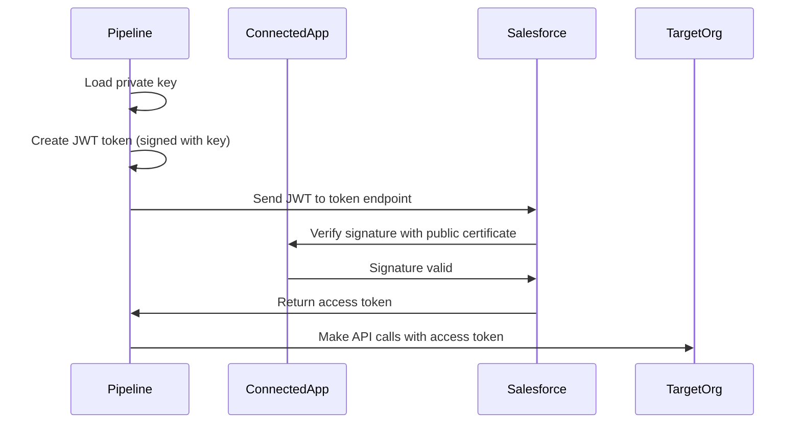

# Authenticating Salesforce Orgs in Pipelines

**Learning Objective**: Securely connect CI/CD pipelines to Salesforce orgs using JWT, SFDX Auth URLs, and OAuth flows.

---

## The Authentication Challenge

Here's a common scenario at Acme Corp: You've built a beautiful GitLab pipeline that validates metadata, runs tests, and deploys to multiple environments. You commit your code, the pipeline triggers, and... it fails immediately.

```
Error: No authenticated orgs found.
```

Your pipeline can't talk to Salesforce because it doesn't know who it is or whether it has permission.

This is the authentication challenge: **How do you let an automated system (your pipeline) access Salesforce securely without exposing credentials?**

You can't just put a username and password in your .gitlab-ci.yml file. That would be:
- Visible to everyone with repository access
- Stored in Git history forever
- A massive security vulnerability

Instead, we need secure, non-interactive authentication methods designed for automation.

---

## Authentication Methods for Pipelines

There are three main ways to authenticate Salesforce orgs in CI/CD pipelines:

### Method 1: JWT Bearer Flow (Recommended for Production)

**What it is**: Uses a private key and connected app to generate access tokens.

**Best for**: Production orgs, UAT, staging - anywhere you need long-term, secure automation.

**Pros**:
- No password stored anywhere
- Token-based, automatically refreshed
- Industry standard for server-to-server authentication
- Required for production deployments

**Cons**:
- Requires initial setup (connected app, certificate)
- Slightly more complex to configure

### Method 2: SFDX Auth URL (Easiest for Development)

**What it is**: A URL that contains all authentication information in one string.

**Best for**: Development sandboxes, temporary environments, quick setups.

**Pros**:
- Simplest to set up
- One command to generate
- Easy to share securely (via GitLab variables)
- Works with any org type

**Cons**:
- Auth URL contains refresh token (must be protected)
- Needs regeneration if tokens expire

### Method 3: OAuth Web Flow (Interactive)

**What it is**: The normal "log in via browser" flow.

**Best for**: Local development only, not pipelines.

**Why not for pipelines**: Requires human interaction (clicking "Allow"), doesn't work in automated environments.

**For Acme Corp, we'll use**:
- **JWT Bearer Flow** for Production and UAT (most secure)
- **SFDX Auth URL** for lower environments (faster setup)

---

## Method 1: JWT Bearer Flow (Production-Ready)

This is the gold standard for production deployments. Let's build it step by step.

### Understanding JWT Bearer Flow

Here's how it works:



**Key insight**: The pipeline never stores a password. It uses a private key to prove its identity, and Salesforce gives it a temporary access token.

### Step 1: Create a Connected App

In your Salesforce org (let's say Production):

1. Go to **Setup** > **App Manager**
2. Click **New Connected App**
3. Fill in basic info:
   - **Connected App Name**: `GitLab CI/CD`
   - **API Name**: `GitLab_CICD`
   - **Contact Email**: Your email
4. Enable **OAuth Settings**
5. Check **Use digital signatures**
6. Upload a certificate (we'll generate this next)
7. Add OAuth Scopes:
   - `api` - API access
   - `refresh_token, offline_access` - Refresh token
   - `web` - Web access
8. Click **Save**

Wait 2-10 minutes for the app to propagate.

### Step 2: Generate a Private Key and Certificate

On your local machine (not in the pipeline):

```bash
# Generate private key
openssl genrsa -out server.key 2048

# Generate certificate signing request
openssl req -new -key server.key -out server.csr

# Generate self-signed certificate (valid for 365 days)
openssl x509 -req -sha256 -days 365 -in server.csr -signkey server.key -out server.crt
```

This creates three files:
- `server.key` - Private key (keep this secret!)
- `server.csr` - Certificate signing request (can delete)
- `server.crt` - Certificate (upload to Salesforce)

**Upload the certificate**:
1. In the Connected App, click **Choose File** under **Use digital signatures**
2. Upload `server.crt`
3. Save

### Step 3: Get the Consumer Key

After saving the Connected App:

1. Go to **Setup** > **App Manager**
2. Find your app, click dropdown, select **View**
3. Copy the **Consumer Key** (looks like a long random string)

You'll need this for authentication.

### Step 4: Pre-Authorize the User

The admin user that will run deployments needs to be pre-authorized:

1. Go to **Setup** > **App Manager**
2. Find your Connected App, click dropdown, select **Manage**
3. Click **Edit Policies**
4. Under **OAuth Policies**:
   - **Permitted Users**: Admin approved users are pre-authorized
   - **IP Relaxation**: Relax IP restrictions
5. Save
6. Click **Manage Profiles** or **Manage Permission Sets**
7. Add the **System Administrator** profile (or create a dedicated CI/CD user profile)

### Step 5: Store the Private Key in GitLab

In your GitLab project:

1. Go to **Settings** > **CI/CD** > **Variables**
2. Click **Add Variable**
3. Configure:
   - **Key**: `JWT_PRIVATE_KEY`
   - **Value**: Copy the entire contents of `server.key`
   - **Type**: File (this creates a temporary file during the job)
   - **Protected**: Yes (only available on protected branches)
   - **Masked**: Yes (hidden in logs)

Also add the Consumer Key:

- **Key**: `SF_CONSUMER_KEY`
- **Value**: The consumer key from the Connected App
- **Type**: Variable
- **Protected**: Yes
- **Masked**: Yes

And the username:

- **Key**: `SF_USERNAME`
- **Value**: `cicd@australiapost.com` (the pre-authorized user)
- **Type**: Variable
- **Protected**: No (not sensitive)
- **Masked**: No

### Step 6: Authenticate in Your Pipeline

Now in `.gitlab-ci.yml`:

```yaml
.auth_jwt_template: &auth_jwt
  before_script:
    # JWT private key is available as file via $JWT_PRIVATE_KEY
    - sf org login jwt --client-id $SF_CONSUMER_KEY --jwt-key-file $JWT_PRIVATE_KEY --username $SF_USERNAME --instance-url https://login.salesforce.com --alias target-org
    - echo "Authenticated successfully as $SF_USERNAME"

deploy_to_production:
  stage: deploy
  <<: *auth_jwt
  script:
    - echo "Deploying to production..."
    - sf project deploy start --source-dir force-app --target-org target-org --test-level RunLocalTests
  only:
    - tags
  when: manual
```

**What this does**:
1. The `$JWT_PRIVATE_KEY` variable is a file path (because we set Type: File)
2. `sf org login jwt` uses the key to authenticate
3. No password needed!
4. Creates an alias `target-org` for subsequent commands

### Step 7: Test the Authentication

Create a simple test job:

```yaml
test_auth:
  stage: test
  <<: *auth_jwt
  script:
    - sf org display --target-org target-org
    - sf org list
  only:
    - merge_requests
```

This should display the authenticated org details.

---

## Method 2: SFDX Auth URL (Quick Setup)

For development and lower environments, SFDX Auth URLs are faster to set up.

### What is an SFDX Auth URL?

An SFDX Auth URL is a specially formatted string that contains:
- Instance URL
- Refresh token
- Client ID and secret
- Username

Format:
```
force://<clientId>:<clientSecret>:<refreshToken>@<instanceUrl>
```

### Step 1: Generate the Auth URL

On your local machine, authenticate to the target org:

```bash
# Authenticate via web login
sf org login web --alias my-sandbox --instance-url https://test.salesforce.com

# Display the auth URL
sf org display --target-org my-sandbox --verbose
```

Look for the **Sfdx Auth Url** in the output:

```
Sfdx Auth Url
force://PlatformCLI::<refreshToken>::<clientSecret>@test.salesforce.com
```

Copy this entire string.

### Alternative: Generate Directly

You can also generate it in one command:

```bash
sf org display --target-org my-sandbox --verbose --json | jq -r '.result.sfdxAuthUrl'
```

This outputs just the auth URL.

### Step 2: Store in GitLab Variables

In GitLab:

1. Go to **Settings** > **CI/CD** > **Variables**
2. Add variable:
   - **Key**: `SFDX_AUTH_URL_UAT` (environment-specific naming)
   - **Value**: The full auth URL (starts with `force://`)
   - **Type**: Variable
   - **Protected**: Yes
   - **Masked**: Yes

Repeat for each environment:
- `SFDX_AUTH_URL_SIT`
- `SFDX_AUTH_URL_UAT`
- `SFDX_AUTH_URL_STAGING`
- `SFDX_AUTH_URL_PROD` (or use JWT for prod)

### Step 3: Use in Pipeline

```yaml
.auth_sfdx_url_template: &auth_sfdx_url
  before_script:
    - echo "$SFDX_AUTH_URL" > authfile.txt
    - sf org login sfdx-url --sfdx-url-file authfile.txt --alias target-org
    - rm authfile.txt
    - echo "Authenticated successfully"

deploy_to_uat:
  stage: deploy
  <<: *auth_sfdx_url
  variables:
    SFDX_AUTH_URL: $SFDX_AUTH_URL_UAT
  script:
    - sf project deploy start --source-dir force-app --target-org target-org
  only:
    - main
  when: manual
```

**Security note**: We write the auth URL to a temporary file, authenticate, then immediately delete the file. This prevents the URL from appearing in logs.

---

## Multi-Environment Authentication Strategy

For Acme Corp with multiple environments, here's the complete strategy:

### Environment Structure

```
Developer Sandboxes (per developer)
    ↓
SIT (System Integration Testing)
    ↓
UAT (User Acceptance Testing)
    ↓
Staging (Pre-Production)
    ↓
Production
```

### Authentication by Environment

| Environment | Method | Why |
|-------------|--------|-----|
| Developer Sandboxes | Local auth (dev machines) | Developers work here |
| SIT | SFDX Auth URL | Fast setup, frequently refreshed |
| UAT | SFDX Auth URL or JWT | Moderate security needs |
| Staging | JWT Bearer Flow | Production-like environment |
| Production | JWT Bearer Flow | Maximum security |

### Pipeline Configuration

```yaml
image: salesforce/cli:latest-full

stages:
  - validate
  - test
  - deploy-lower
  - deploy-uat
  - deploy-production

# Template for JWT auth (prod/staging)
.auth_jwt: &auth_jwt
  before_script:
    - sf org login jwt --client-id $SF_CONSUMER_KEY --jwt-key-file $JWT_PRIVATE_KEY --username $SF_USERNAME --instance-url $SF_INSTANCE_URL --alias target-org

# Template for Auth URL (SIT/UAT)
.auth_sfdx: &auth_sfdx
  before_script:
    - echo "$SFDX_AUTH_URL" > authfile.txt
    - sf org login sfdx-url --sfdx-url-file authfile.txt --alias target-org
    - rm authfile.txt

# SIT Deployment (Auth URL)
deploy_to_sit:
  stage: deploy-lower
  <<: *auth_sfdx
  variables:
    SFDX_AUTH_URL: $SFDX_AUTH_URL_SIT
  script:
    - sf project deploy start --source-dir force-app --target-org target-org --test-level RunLocalTests
  only:
    - develop

# UAT Deployment (Auth URL)
deploy_to_uat:
  stage: deploy-uat
  <<: *auth_sfdx
  variables:
    SFDX_AUTH_URL: $SFDX_AUTH_URL_UAT
  script:
    - sf project deploy start --source-dir force-app --target-org target-org --test-level RunLocalTests
  only:
    - main
  when: manual

# Staging Deployment (JWT)
deploy_to_staging:
  stage: deploy-production
  <<: *auth_jwt
  variables:
    SF_USERNAME: $SF_USERNAME_STAGING
    SF_INSTANCE_URL: https://acmecorp--staging.sandbox.my.salesforce.com
  script:
    - sf project deploy start --source-dir force-app --target-org target-org --test-level RunLocalTests
  only:
    - tags
  when: manual

# Production Deployment (JWT)
deploy_to_production:
  stage: deploy-production
  <<: *auth_jwt
  variables:
    SF_USERNAME: $SF_USERNAME_PROD
    SF_INSTANCE_URL: https://login.salesforce.com
  script:
    - sf project deploy start --source-dir force-app --target-org target-org --test-level RunAllTestsInOrg --wait 60
  only:
    - tags
  when: manual
  environment:
    name: production
    url: https://acmecorp.my.salesforce.com
```

---

## Advanced: Connected App Configuration

For enterprise setups, your Connected App needs careful configuration.

### OAuth Policies

1. **Permitted Users**: Admin approved users are pre-authorized
   - Prevents unauthorized access
   - Requires explicit permission set/profile assignment

2. **IP Relaxation**: Relax IP restrictions
   - Allows connections from GitLab runners (which have dynamic IPs)
   - Alternative: Whitelist your GitLab runner IPs

3. **Refresh Token Policy**: Refresh token is valid until revoked
   - Long-lived tokens for automation
   - Can set expiration if needed

### Permission Sets for CI/CD Users

Create a dedicated permission set for the CI/CD user:

**CI/CD Deployment Permission Set**:

Permissions:
- API Enabled: Yes
- Modify All Data: Yes (for deployments)
- Author Apex: Yes
- Customize Application: Yes
- View All Data: Yes (for retrievals)
- Manage Users: No (limit permissions)

This follows the principle of least privilege: the CI/CD user can deploy but has limited administrative access.

### Dedicated CI/CD User

Best practice: Create a dedicated user for CI/CD:

- Username: `cicd@australiapost.com`
- Profile: Custom profile with minimum permissions + CI/CD permission set
- Password: Complex, stored in password manager
- Login IP Ranges: Restrict if possible (or use IP relaxation)
- User License: Salesforce (or Salesforce Integration if available)

**Why a dedicated user?**
- Audit trail: All deployments show as this user
- Security: If compromised, disable one user
- Clarity: Easy to see what's automated vs manual

---

## Handling Authentication Failures

Common issues and solutions:

### Issue 1: "Invalid grant" Error

**Error message**:
```
ERROR: invalid_grant: authentication failure
```

**Causes**:
1. User not pre-authorized in Connected App
2. Connected App not approved
3. IP restrictions blocking GitLab runner

**Solution**:
```yaml
before_script:
  - sf org login jwt --client-id $SF_CONSUMER_KEY --jwt-key-file $JWT_PRIVATE_KEY --username $SF_USERNAME --instance-url https://login.salesforce.com --alias target-org --set-default
  # Add error handling
  - |
    if [ $? -ne 0 ]; then
      echo "JWT authentication failed. Checking configuration..."
      echo "Consumer Key: ${SF_CONSUMER_KEY:0:5}..." # Show first 5 chars only
      echo "Username: $SF_USERNAME"
      echo "Instance URL: https://login.salesforce.com"
      exit 1
    fi
```

Then verify:
1. User is in the Connected App's permission set/profile
2. Connected App policies are set to "Admin approved users are pre-authorized"
3. IP relaxation is enabled

### Issue 2: Refresh Token Expired

**Error message**:
```
ERROR: This org appears to have a problem with its OAuth configuration.
```

**Causes**: The refresh token in the SFDX Auth URL has expired.

**Solution**: Regenerate the auth URL:
```bash
# On local machine
sf org login web --alias my-sandbox
sf org display --target-org my-sandbox --verbose
# Copy new auth URL to GitLab variables
```

**Prevent it**: Use JWT for important environments (tokens don't expire).

### Issue 3: Private Key Format Issues

**Error message**:
```
ERROR: PEM routines:get_name:no start line
```

**Cause**: Private key has incorrect line breaks or formatting when stored in GitLab variable.

**Solution**: Use File type for the variable:
1. In GitLab: Settings > CI/CD > Variables
2. Change Type from "Variable" to "File"
3. This preserves exact formatting including line breaks

### Issue 4: "No authenticated orgs" After Login

**Error message**:
```
ERROR: No authenticated orgs found.
```

**Cause**: Authentication succeeded but alias wasn't created or isn't being used.

**Solution**: Always create and use an alias:
```yaml
before_script:
  - sf org login jwt ... --alias target-org --set-default
  - sf org list  # Verify authentication
  - sf org display --target-org target-org  # Verify specific org
```

---

## Security Best Practices

### 1. Never Commit Credentials

**Bad** (this gets you fired):
```yaml
# .gitlab-ci.yml
variables:
  PASSWORD: "MyP@ssw0rd"
  SECURITY_TOKEN: "abc123xyz"
```

**Good**:
```yaml
# .gitlab-ci.yml
# Variables stored in GitLab UI with Protected + Masked flags

before_script:
  - echo "$SFDX_AUTH_URL" > authfile.txt  # Temporary file
  - sf org login sfdx-url --sfdx-url-file authfile.txt --alias target-org
  - rm authfile.txt  # Delete immediately
```

### 2. Use Protected Variables for Production

In GitLab variables:
- Mark as **Protected**: Only available on protected branches (main, tags)
- Mark as **Masked**: Hidden in job logs
- Mark as **Environment-specific**: Different values per environment

This ensures production credentials only work when deploying from main branch or tags, not from feature branches.

### 3. Rotate Credentials Regularly

Schedule credential rotation:
- **JWT certificates**: Renew annually (or when they expire)
- **SFDX Auth URLs**: Regenerate quarterly
- **Connected App secrets**: Rotate after team member departures

### 4. Limit Scope

Use the principle of least privilege:
- CI/CD user has deployment permissions only
- No permission to create users, modify security settings
- Read-only access to sensitive objects (if possible)

### 5. Audit Authentication

Monitor authentication:
```yaml
after_script:
  - sf org display --target-org target-org --verbose  # Log connection details
  - echo "Deployment completed at $(date) by pipeline $CI_PIPELINE_ID"
```

Review Salesforce login history:
- Setup > Login History
- Look for CI/CD user logins
- Investigate unexpected authentication patterns

---

## Why This Matters for Acme Corp

### Security at Scale

With 50 developers, credential management becomes critical:

**Without proper authentication**:
- Developers share admin passwords (security risk!)
- Passwords in Git history (exposed forever)
- No audit trail (who deployed what?)
- Credential rotation is impossible (too many places to update)

**With JWT/Auth URL**:
- No shared passwords
- Credentials in secure GitLab variables
- Full audit trail (Git commits + Salesforce login history)
- Easy to rotate (update one variable)

### Compliance Requirements

Acme Corp likely has compliance requirements:
- **ISO 27001**: Secure credential storage
- **SOC 2**: Audit trails for all deployments
- **Data sovereignty**: Credentials stay within your region (GitLab self-hosted)

JWT authentication helps meet these requirements:
- Credentials never in source code (ISO 27001)
- Every deployment logged (SOC 2)
- Private keys stored in self-hosted GitLab instance (data sovereignty)

### Incident Response

If credentials are compromised:

**With passwords in Git**:
- Attacker has permanent access
- Must change password (affects all automation)
- Can't track what was accessed

**With JWT**:
- Revoke the Connected App or user
- Automation continues with new certificate
- Full audit trail in Salesforce login history

---

## Interview Talking Points

### Question: "How do you secure Salesforce credentials in CI/CD pipelines?"

**Strong Answer**:

"I use JWT Bearer Flow for production environments because it's the most secure method. Here's how it works:

First, I create a Connected App in Salesforce with digital signature enabled. I generate a private key and certificate using OpenSSL - the certificate goes in Salesforce, the private key stays secret.

The private key is stored as a protected, masked, file-type variable in GitLab, so it's never in source code and doesn't appear in logs. When the pipeline runs, it uses the private key to generate a JWT token, which Salesforce validates against the certificate. If valid, Salesforce issues an access token.

This approach means no passwords are stored anywhere, tokens are short-lived, and we have full audit trail of every authentication. For lower environments like SIT, I might use SFDX Auth URLs for simplicity, but always stored as protected variables.

The key principles are: never commit credentials, use token-based authentication, apply principle of least privilege, and rotate credentials regularly."

### Question: "What would you do if the CI/CD pipeline can't authenticate to Salesforce?"

**Strong Answer**:

"I follow a systematic troubleshooting approach:

First, I check the error message. If it's 'invalid_grant', that usually means the user isn't pre-authorized in the Connected App or IP restrictions are blocking access. I verify the Connected App policies are set to 'Admin approved users are pre-authorized' and IP relaxation is enabled.

If it's a 'PEM routines' error, the private key format is corrupted - I ensure it's stored as a File type variable in GitLab, not a regular variable, to preserve line breaks.

If it's 'refresh token expired', the SFDX Auth URL needs regeneration. I log into the org locally and generate a fresh auth URL using `sf org display --verbose`.

I also add logging to the pipeline to display connection details (without exposing credentials) and verify the org list after authentication. This helps diagnose whether authentication succeeded but the wrong org is being targeted.

For prevention, I use JWT for production environments because those tokens don't expire, and I document the authentication setup so any team member can regenerate credentials if needed."

### Question: "How do you manage authentication for multiple Salesforce environments?"

**Strong Answer**:

"I use a tiered approach based on environment criticality:

For production and staging, I use JWT Bearer Flow with separate Connected Apps per environment. This provides maximum security and meets audit requirements. Each environment has its own certificate and private key stored as environment-specific variables in GitLab.

For UAT and SIT, I use SFDX Auth URLs because they're faster to set up and these environments are refreshed more frequently. Each environment gets its own variable: SFDX_AUTH_URL_UAT, SFDX_AUTH_URL_SIT, etc.

In the pipeline, I use YAML anchors to create reusable authentication templates, so the authentication code is written once and referenced in each job. Jobs override the specific credentials using environment-specific variables.

I also implement a dedicated CI/CD user in each org with a custom permission set that grants only the permissions needed for deployment - this follows least privilege principles and makes it easy to revoke access if needed.

This approach balances security, maintainability, and ease of setup across five different environments."

---

## Hands-On Exercise: Set Up JWT Authentication

Let's set up JWT authentication step by step for a sandbox org.

### Exercise Steps

**Step 1: Generate Keys (5 minutes)**

On your local machine:
```bash
mkdir ~/sfdx-keys
cd ~/sfdx-keys

# Generate private key
openssl genrsa -out server.key 2048

# Generate certificate
openssl req -new -key server.key -out server.csr
openssl x509 -req -sha256 -days 365 -in server.csr -signkey server.key -out server.crt

ls -la
# You should see: server.key, server.csr, server.crt
```

**Step 2: Create Connected App (10 minutes)**

In Salesforce:
1. Setup > App Manager > New Connected App
2. Name: "GitLab CI/CD Test"
3. Enable OAuth Settings
4. Callback URL: `http://localhost:1717/OauthRedirect`
5. Use digital signatures: Upload `server.crt`
6. OAuth Scopes: Select `api`, `refresh_token`, `web`
7. Save

Wait 5-10 minutes for propagation.

**Step 3: Configure Policies (5 minutes)**

1. Setup > App Manager > Find your app > Manage
2. Edit Policies:
   - Permitted Users: Admin approved users are pre-authorized
   - IP Relaxation: Relax IP restrictions
3. Save
4. Manage Permission Sets > Add your user's permission set

**Step 4: Test Authentication Locally (5 minutes)**

```bash
# Get the Consumer Key from the Connected App
# Setup > App Manager > Your App > View > Copy Consumer Key

sf org login jwt \
  --client-id YOUR_CONSUMER_KEY \
  --jwt-key-file ~/sfdx-keys/server.key \
  --username your.email@company.com.sandbox \
  --instance-url https://test.salesforce.com \
  --alias jwt-test

# Verify
sf org display --target-org jwt-test
```

If this works locally, it will work in the pipeline.

**Step 5: Configure GitLab Variables (5 minutes)**

In GitLab: Settings > CI/CD > Variables

Add:
1. `JWT_PRIVATE_KEY`: Content of server.key, Type: File, Protected + Masked
2. `SF_CONSUMER_KEY`: Consumer key from Connected App, Protected + Masked
3. `SF_USERNAME`: Your Salesforce username

**Step 6: Add to Pipeline (5 minutes)**

```yaml
test_jwt_auth:
  stage: test
  before_script:
    - sf org login jwt --client-id $SF_CONSUMER_KEY --jwt-key-file $JWT_PRIVATE_KEY --username $SF_USERNAME --instance-url https://test.salesforce.com --alias target-org
  script:
    - sf org display --target-org target-org
    - echo "JWT authentication successful!"
  only:
    - branches
```

Commit and push. The pipeline should authenticate successfully.

---

## Comparison: Authentication Methods

| Aspect | JWT Bearer Flow | SFDX Auth URL | OAuth Web Flow |
|--------|----------------|---------------|----------------|
| Security | High | Medium | Low (for pipelines) |
| Setup Complexity | Medium | Low | Low |
| Requires Password | No | No | Yes |
| Works Non-Interactive | Yes | Yes | No |
| Token Expiration | Never (cert-based) | Eventually (months) | Session-based |
| Best For | Production | Dev/Test | Local development |
| Audit Trail | Excellent | Good | Good |
| IP Restrictions | Can relax | Can relax | Requires whitelisting |
| Credential Rotation | Annual (cert renewal) | Quarterly (regenerate) | Per session |

**Acme Corp Recommendation**: JWT for production/staging, Auth URL for lower environments.

---

## Advanced Patterns

### Pattern 1: Multi-Org Authentication in One Job

Authenticate to multiple orgs in a single job (e.g., for data migration):

```yaml
sync_data:
  stage: deploy
  before_script:
    # Authenticate to source org
    - echo "$SFDX_AUTH_URL_SOURCE" > source-auth.txt
    - sf org login sfdx-url --sfdx-url-file source-auth.txt --alias source-org
    - rm source-auth.txt

    # Authenticate to target org
    - echo "$SFDX_AUTH_URL_TARGET" > target-auth.txt
    - sf org login sfdx-url --sfdx-url-file target-auth.txt --alias target-org
    - rm target-auth.txt
  script:
    - sf data export tree --query "SELECT Id, Name FROM Account" --target-org source-org --output-dir ./data
    - sf data import tree --plan ./data/Account-plan.json --target-org target-org
```

### Pattern 2: Dynamic Org Selection

Choose org based on branch name:

```yaml
deploy_dynamic:
  stage: deploy
  before_script:
    # Determine which org to use based on branch
    - |
      if [[ "$CI_COMMIT_REF_NAME" == "main" ]]; then
        export TARGET_ORG="UAT"
        export AUTH_URL="$SFDX_AUTH_URL_UAT"
      elif [[ "$CI_COMMIT_REF_NAME" == "develop" ]]; then
        export TARGET_ORG="SIT"
        export AUTH_URL="$SFDX_AUTH_URL_SIT"
      else
        export TARGET_ORG="DEV"
        export AUTH_URL="$SFDX_AUTH_URL_DEV"
      fi

    # Authenticate
    - echo "$AUTH_URL" > authfile.txt
    - sf org login sfdx-url --sfdx-url-file authfile.txt --alias target-org
    - rm authfile.txt
  script:
    - echo "Deploying to $TARGET_ORG"
    - sf project deploy start --source-dir force-app --target-org target-org
```

### Pattern 3: Scratch Org Per Pipeline

Create a fresh scratch org for each pipeline run:

```yaml
test_in_scratch_org:
  stage: test
  before_script:
    # Authenticate to Dev Hub
    - sf org login jwt --client-id $SF_CONSUMER_KEY --jwt-key-file $JWT_PRIVATE_KEY --username $SF_DEVHUB_USERNAME --instance-url https://login.salesforce.com --alias devhub --set-default
  script:
    # Create scratch org
    - sf org create scratch --definition-file config/project-scratch-def.json --alias ci-scratch --duration-days 1 --target-dev-hub devhub

    # Deploy and test
    - sf project deploy start --source-dir force-app --target-org ci-scratch
    - sf apex run test --target-org ci-scratch --code-coverage --result-format human
  after_script:
    # Clean up (delete scratch org)
    - sf org delete scratch --target-org ci-scratch --no-prompt
```

This provides true isolation - every pipeline gets a clean org.

---

## Troubleshooting Checklist

When authentication fails, work through this checklist:

### Pre-Flight Checks

- [ ] Is the Connected App created and saved?
- [ ] Has it been 10+ minutes since creating the Connected App?
- [ ] Is the certificate uploaded correctly to the Connected App?
- [ ] Are OAuth scopes enabled (api, refresh_token, web)?

### User Authorization Checks

- [ ] Is the user pre-authorized in the Connected App?
- [ ] Does the user have a permission set assigned from the Connected App?
- [ ] Is the user active and not locked?
- [ ] Does the user have "API Enabled" permission?

### GitLab Variable Checks

- [ ] Is JWT_PRIVATE_KEY stored as File type (not Variable)?
- [ ] Is the private key complete (including BEGIN/END lines)?
- [ ] Is SF_CONSUMER_KEY correct and masked?
- [ ] Is SF_USERNAME correct (including .sandbox suffix if sandbox)?
- [ ] Are variables marked as Protected if running on protected branch?

### Command Checks

- [ ] Is --instance-url correct? (https://login.salesforce.com for production, https://test.salesforce.com for sandbox)
- [ ] Is --username correct and matches pre-authorized user?
- [ ] Is --client-id using the right variable ($SF_CONSUMER_KEY)?
- [ ] Is --jwt-key-file using the right variable ($JWT_PRIVATE_KEY)?
- [ ] Is --alias being set for use in later commands?

### Network/Policy Checks

- [ ] Is IP Relaxation enabled on the Connected App?
- [ ] Are there org-wide IP ranges blocking the GitLab runner?
- [ ] Is the Connected App policy set to "Admin approved users are pre-authorized"?

### Test Locally First

Always test JWT authentication on your local machine before adding to pipeline:

```bash
sf org login jwt \
  --client-id <consumer-key> \
  --jwt-key-file ./server.key \
  --username cicd@company.com \
  --instance-url https://test.salesforce.com \
  --alias test-auth

sf org display --target-org test-auth
```

If it works locally, the configuration is correct. If it fails in the pipeline, it's a GitLab variable or environment issue.

---

## Next Steps

You now understand how to authenticate Salesforce orgs in pipelines:
- JWT Bearer Flow for production (most secure)
- SFDX Auth URLs for development (fastest setup)
- How to configure Connected Apps
- How to store credentials securely in GitLab
- How to troubleshoot authentication issues

But authentication alone doesn't deploy code. We need to run tests.

**Next chapter**: [Running Apex Tests in Pipelines →](./running-tests.md)

You'll learn:
- How to run Apex tests in CI/CD
- Test levels and when to use each
- Code coverage requirements and enforcement
- Parallel test execution
- Test result reporting and artifacts
- Handling flaky tests
- Performance optimization

Testing is the safety net that lets you deploy with confidence.

---

## Quick Reference

### JWT Authentication

```bash
# Generate keys
openssl genrsa -out server.key 2048
openssl req -new -key server.key -out server.csr
openssl x509 -req -sha256 -days 365 -in server.csr -signkey server.key -out server.crt

# Authenticate
sf org login jwt \
  --client-id $SF_CONSUMER_KEY \
  --jwt-key-file $JWT_PRIVATE_KEY \
  --username $SF_USERNAME \
  --instance-url https://login.salesforce.com \
  --alias target-org
```

### SFDX Auth URL

```bash
# Generate auth URL
sf org display --target-org my-org --verbose --json | jq -r '.result.sfdxAuthUrl'

# Authenticate
echo "$SFDX_AUTH_URL" > authfile.txt
sf org login sfdx-url --sfdx-url-file authfile.txt --alias target-org
rm authfile.txt
```

### Verify Authentication

```bash
# List all authenticated orgs
sf org list

# Display specific org details
sf org display --target-org target-org --verbose

# Test API access
sf org list limits --target-org target-org
```

---

## Summary

Secure authentication is the foundation of automated Salesforce deployments:

1. **Never store passwords in code** - use JWT or Auth URLs
2. **JWT for production** - most secure, certificate-based, no expiration
3. **Auth URLs for development** - faster setup, regenerate quarterly
4. **Store credentials as protected variables** - GitLab variables with Protected + Masked flags
5. **Use dedicated CI/CD users** - principle of least privilege, clear audit trail
6. **Test locally first** - verify authentication works before adding to pipeline
7. **Implement proper error handling** - fail fast with clear error messages

For Acme Corp with 50 developers and strict security requirements, proper authentication isn't optional - it's the difference between a secure, compliant deployment process and a security incident waiting to happen.

Master authentication, and everything else becomes possible.
