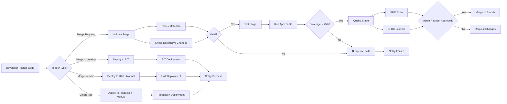

# GitLab CI/CD Basics for Salesforce Deployments

**Learning Objective**: Understand GitLab pipeline structure, YAML syntax, and how to build your first Salesforce deployment pipeline.

---

## The Problem: Manual Deployments Don't Scale

Picture this scenario at Australia Post: You have 50 developers across 5 teams. The Sales team just finished a major opportunity management feature. Service team updated case routing. Integration team added a new API endpoint. All three teams need to deploy this week.

Without automation, here's what happens:
- Each team manually creates change sets
- Someone has to coordinate deployment windows
- Dependencies get missed
- Deployments take 3-4 hours each
- One failure means starting over
- Friday afternoon becomes "deployment day" (and ruins weekends)

This doesn't scale. When you have multiple teams making hundreds of changes per month, you need automation.

That's where GitLab CI/CD comes in.

---

## What is GitLab CI/CD?

**GitLab CI/CD is an automation platform built into GitLab that runs tasks whenever code changes.**

Think of it like this: You define a series of steps (a "pipeline") in a configuration file. Every time someone pushes code or creates a merge request, GitLab automatically runs those steps.

For Salesforce, a typical pipeline might:
1. Authenticate to a Salesforce org
2. Run Apex tests
3. Check code quality
4. Deploy metadata
5. Send notifications

You define this once. It runs automatically. Every time. Consistently.

### Why GitLab for Salesforce?

You might ask: "Why GitLab? Why not GitHub Actions or Jenkins?"

All are valid choices. But GitLab has advantages for enterprise Salesforce deployments:

**Built-in CI/CD**: No plugins required. Everything works out of the box.

**Mature pipeline features**: Advanced deployment controls, environments, approval gates.

**Enterprise-friendly**: Self-hosted options, compliance features, audit trails.

**All-in-one platform**: Git repository + CI/CD + container registry + security scanning in one tool.

**Strong in Australia**: Many Australian enterprises (like Australia Post) use GitLab for regulatory and data sovereignty reasons.

That said, the concepts you'll learn here apply to any CI/CD platform. The YAML syntax is similar across tools.

---

## Core Concepts: Understanding the Building Blocks

Before we write our first pipeline, let's understand the vocabulary.

### 1. Pipeline

A **pipeline** is the entire automated workflow that runs when triggered. It's the top-level container for everything.

```
Pipeline: "Deploy Salesforce Changes"
├── Stage: Validate
├── Stage: Test
├── Stage: Deploy
└── Stage: Notify
```

### 2. Stage

A **stage** is a group of related jobs that run in parallel. Stages run sequentially.

If any job in a stage fails, the pipeline stops (unless configured otherwise).

```
Stage: Test (runs all these in parallel)
├── Job: Run Apex Tests
├── Job: Run PMD Code Quality
└── Job: Check Code Coverage
```

### 3. Job

A **job** is a specific task that runs in the pipeline. Jobs contain the actual commands.

```yaml
run_apex_tests:
  stage: test
  script:
    - sf apex run test --target-org production --wait 30
```

### 4. Runner

A **runner** is the server that executes your jobs. GitLab runners can be:
- **Shared runners**: Provided by GitLab (cloud)
- **Specific runners**: Your own servers
- **Docker runners**: Run jobs in containers

For Salesforce, you typically use Docker runners because they provide a clean, consistent environment with the Salesforce CLI pre-installed.

### 5. Artifacts

**Artifacts** are files generated by jobs that you want to save or pass to later stages.

For example, you might save:
- Test results
- Code coverage reports
- Deployment manifests
- Error logs

```yaml
artifacts:
  paths:
    - test-results/
  expire_in: 7 days
```

---

## Your First GitLab Pipeline: The Anatomy

Let's build a simple Salesforce pipeline from scratch. I'll show you the complete file, then break down each section.

Create a file named `.gitlab-ci.yml` in the root of your repository:

```yaml
# .gitlab-ci.yml

# Define the Docker image to use for all jobs
image: salesforce/cli:latest-full

# Define the stages (in order)
stages:
  - validate
  - test
  - deploy

# Global variables available to all jobs
variables:
  SF_TARGET_ORG: "DevHub"

# Jobs

validate_syntax:
  stage: validate
  script:
    - echo "Validating Salesforce metadata..."
    - sf project deploy validate --source-dir force-app --target-org $SF_TARGET_ORG
  only:
    - merge_requests

run_tests:
  stage: test
  script:
    - echo "Running Apex tests..."
    - sf apex run test --target-org $SF_TARGET_ORG --code-coverage --result-format human --wait 10
  coverage: '/^All tests.*?(\d+)%$/'
  only:
    - merge_requests

deploy_to_uat:
  stage: deploy
  script:
    - echo "Deploying to UAT..."
    - sf project deploy start --source-dir force-app --target-org UAT --wait 30
  only:
    - main
  when: manual
```

Let's break this down section by section.

### Image Declaration

```yaml
image: salesforce/cli:latest-full
```

This tells GitLab to run all jobs inside a Docker container with the Salesforce CLI already installed. Every job starts with a fresh container.

**Why this matters**: You don't have to install the Salesforce CLI manually. It's already there, with all dependencies.

### Stages Definition

```yaml
stages:
  - validate
  - test
  - deploy
```

This defines three stages that run sequentially:
1. First, validate the metadata syntax
2. Then, run tests
3. Finally, deploy (if everything passed)

If validation fails, tests never run. If tests fail, deployment never happens.

### Variables

```yaml
variables:
  SF_TARGET_ORG: "DevHub"
```

Variables let you avoid hardcoding values. You can override these at the project or group level in GitLab.

**Pro tip**: Never put credentials in variables here. Use GitLab's masked/protected variables instead (we'll cover this in the authentication chapter).

### Jobs: validate_syntax

```yaml
validate_syntax:
  stage: validate
  script:
    - echo "Validating Salesforce metadata..."
    - sf project deploy validate --source-dir force-app --target-org $SF_TARGET_ORG
  only:
    - merge_requests
```

**What this does**:
- Runs in the `validate` stage
- Executes two commands: an echo (for logging) and the validation command
- Only runs on merge requests (not on regular commits)

The `sf project deploy validate` command checks if the metadata is valid without actually deploying it. Fast and safe.

### Jobs: run_tests

```yaml
run_tests:
  stage: test
  script:
    - echo "Running Apex tests..."
    - sf apex run test --target-org $SF_TARGET_ORG --code-coverage --result-format human --wait 10
  coverage: '/^All tests.*?(\d+)%$/'
  only:
    - merge_requests
```

**What this does**:
- Runs Apex tests
- Waits up to 10 minutes for tests to complete
- Extracts code coverage percentage using regex (GitLab will display this)

The `coverage` regex tells GitLab how to find the coverage percentage in the test output.

### Jobs: deploy_to_uat

```yaml
deploy_to_uat:
  stage: deploy
  script:
    - echo "Deploying to UAT..."
    - sf project deploy start --source-dir force-app --target-org UAT --wait 30
  only:
    - main
  when: manual
```

**What this does**:
- Only runs on the `main` branch (not feature branches)
- Requires manual trigger (`when: manual`) - deployment won't happen automatically
- Deploys to UAT environment
- Waits up to 30 minutes for deployment to complete

---

## Pipeline Triggers: When Does It Run?

GitLab pipelines can be triggered in several ways:

### 1. Push to Branch

Every time someone pushes commits:
```yaml
only:
  - main
  - develop
```

### 2. Merge Requests

When a merge request is created or updated:
```yaml
only:
  - merge_requests
```

### 3. Tags

When you create a Git tag (common for releases):
```yaml
only:
  - tags
```

### 4. Scheduled Pipelines

Run on a schedule (like nightly builds):
Configure this in GitLab UI: CI/CD > Schedules

### 5. Manual Triggers

Require someone to click "Run" in GitLab UI:
```yaml
when: manual
```

### 6. API Triggers

Trigger from external systems using GitLab API:
```bash
curl -X POST \
  --form token=<token> \
  --form ref=main \
  https://gitlab.com/api/v4/projects/<project_id>/trigger/pipeline
```

---

## Real-World Pipeline for Australia Post

Let's design a realistic pipeline for Australia Post's Salesforce deployment needs.

**Requirements**:
- 50 developers across 5 teams
- Multiple environments: Dev, SIT, UAT, Staging, Production
- Need to validate PRs before merge
- Need manual approval for production deployments
- Need to track code coverage
- Need to notify teams on Slack

Here's the complete pipeline:

```yaml
# .gitlab-ci.yml - Australia Post Salesforce Pipeline

image: salesforce/cli:latest-full

stages:
  - validate
  - test
  - quality
  - deploy-lower
  - deploy-uat
  - deploy-production
  - notify

variables:
  CODE_COVERAGE_THRESHOLD: "75"
  DEPLOYMENT_TIMEOUT: "30"

# Template for authentication (DRY principle)
.auth_template: &auth_template
  before_script:
    - echo "$SFDX_AUTH_URL" > authfile.txt
    - sf org login sfdx-url --sfdx-url-file authfile.txt --alias target-org
    - rm authfile.txt

# ==================== VALIDATION STAGE ====================

validate_metadata:
  stage: validate
  <<: *auth_template
  script:
    - echo "Validating metadata syntax and structure..."
    - sf project deploy validate --source-dir force-app --target-org target-org --test-level NoTestRun
  only:
    - merge_requests
  allow_failure: false

check_destructive_changes:
  stage: validate
  script:
    - echo "Checking for destructive changes..."
    - |
      if [ -f "destructiveChanges/destructiveChanges.xml" ]; then
        echo "WARNING: Destructive changes detected!"
        cat destructiveChanges/destructiveChanges.xml
        exit 1
      fi
  only:
    - merge_requests
  allow_failure: false

# ==================== TEST STAGE ====================

run_apex_tests:
  stage: test
  <<: *auth_template
  script:
    - echo "Running all Apex tests..."
    - sf apex run test --target-org target-org --code-coverage --result-format human --wait 20 --output-dir test-results
    - echo "Checking code coverage threshold..."
    - |
      COVERAGE=$(grep -oP 'Test Coverage: \K\d+' test-results/test-result.txt || echo "0")
      echo "Code coverage: ${COVERAGE}%"
      if [ "$COVERAGE" -lt "$CODE_COVERAGE_THRESHOLD" ]; then
        echo "ERROR: Code coverage ${COVERAGE}% is below threshold ${CODE_COVERAGE_THRESHOLD}%"
        exit 1
      fi
  coverage: '/^All tests.*?(\d+)%$/'
  artifacts:
    paths:
      - test-results/
    reports:
      junit: test-results/junit/junit.xml
    expire_in: 7 days
  only:
    - merge_requests
    - main

# ==================== QUALITY STAGE ====================

pmd_scan:
  stage: quality
  image:
    name: pmd/pmd:latest
    entrypoint: [""]
  script:
    - echo "Running PMD code quality scan..."
    - pmd check --dir force-app/main/default/classes --rulesets rulesets/apex-ruleset.xml --format text --report-file pmd-report.txt || true
    - cat pmd-report.txt
  artifacts:
    paths:
      - pmd-report.txt
    expire_in: 7 days
  only:
    - merge_requests
  allow_failure: true

sfdx_scanner:
  stage: quality
  script:
    - echo "Running Salesforce Code Analyzer..."
    - sf plugins install @salesforce/sfdx-scanner
    - sf scanner run --target "force-app/**/*.cls,force-app/**/*.trigger" --format table --outfile scanner-results.txt || true
    - cat scanner-results.txt
  artifacts:
    paths:
      - scanner-results.txt
    expire_in: 7 days
  only:
    - merge_requests
  allow_failure: true

# ==================== DEPLOYMENT STAGES ====================

deploy_to_sit:
  stage: deploy-lower
  <<: *auth_template
  environment:
    name: SIT
    url: https://auspost--sit.sandbox.my.salesforce.com
  script:
    - echo "Deploying to SIT environment..."
    - sf project deploy start --source-dir force-app --target-org target-org --test-level RunLocalTests --wait $DEPLOYMENT_TIMEOUT
  only:
    - develop
  when: on_success

deploy_to_uat:
  stage: deploy-uat
  <<: *auth_template
  environment:
    name: UAT
    url: https://auspost--uat.sandbox.my.salesforce.com
  script:
    - echo "Deploying to UAT environment..."
    - sf project deploy start --source-dir force-app --target-org target-org --test-level RunLocalTests --wait $DEPLOYMENT_TIMEOUT
  only:
    - main
  when: manual

deploy_to_staging:
  stage: deploy-production
  <<: *auth_template
  environment:
    name: Staging
    url: https://auspost--staging.sandbox.my.salesforce.com
  script:
    - echo "Deploying to Staging environment..."
    - sf project deploy start --source-dir force-app --target-org target-org --test-level RunLocalTests --wait $DEPLOYMENT_TIMEOUT
  only:
    - tags
  when: manual

deploy_to_production:
  stage: deploy-production
  <<: *auth_template
  environment:
    name: Production
    url: https://auspost.my.salesforce.com
  script:
    - echo "🚀 PRODUCTION DEPLOYMENT STARTING..."
    - echo "Deploying to PRODUCTION with full test suite..."
    - sf project deploy start --source-dir force-app --target-org target-org --test-level RunAllTestsInOrg --wait 60
    - echo "✅ PRODUCTION DEPLOYMENT COMPLETE"
  only:
    - tags
  when: manual
  allow_failure: false

# ==================== NOTIFICATION STAGE ====================

notify_success:
  stage: notify
  script:
    - |
      curl -X POST "$SLACK_WEBHOOK_URL" \
        -H 'Content-Type: application/json' \
        -d "{
          \"text\": \"✅ Pipeline succeeded for $CI_PROJECT_NAME\",
          \"attachments\": [{
            \"color\": \"good\",
            \"fields\": [
              {\"title\": \"Branch\", \"value\": \"$CI_COMMIT_REF_NAME\", \"short\": true},
              {\"title\": \"Commit\", \"value\": \"$CI_COMMIT_SHORT_SHA\", \"short\": true},
              {\"title\": \"Author\", \"value\": \"$GITLAB_USER_NAME\", \"short\": true},
              {\"title\": \"Pipeline\", \"value\": \"$CI_PIPELINE_URL\", \"short\": false}
            ]
          }]
        }"
  when: on_success
  only:
    - main
    - tags

notify_failure:
  stage: notify
  script:
    - |
      curl -X POST "$SLACK_WEBHOOK_URL" \
        -H 'Content-Type: application/json' \
        -d "{
          \"text\": \"❌ Pipeline failed for $CI_PROJECT_NAME\",
          \"attachments\": [{
            \"color\": \"danger\",
            \"fields\": [
              {\"title\": \"Branch\", \"value\": \"$CI_COMMIT_REF_NAME\", \"short\": true},
              {\"title\": \"Commit\", \"value\": \"$CI_COMMIT_SHORT_SHA\", \"short\": true},
              {\"title\": \"Author\", \"value\": \"$GITLAB_USER_NAME\", \"short\": true},
              {\"title\": \"Pipeline\", \"value\": \"$CI_PIPELINE_URL\", \"short\": false}
            ]
          }]
        }"
  when: on_failure
  only:
    - main
    - tags
```

---

## Understanding the Australia Post Pipeline

Let's break down the key features of this production-ready pipeline:

### 1. YAML Anchors for DRY Code

```yaml
.auth_template: &auth_template
  before_script:
    - echo "$SFDX_AUTH_URL" > authfile.txt
    - sf org login sfdx-url --sfdx-url-file authfile.txt --alias target-org
```

The `&auth_template` creates a reusable template. Any job can reference it with `<<: *auth_template`. This avoids repeating the authentication code in every job.

**Why this matters**: If you need to change how authentication works, you change it once, not in 10 different places.

### 2. Multi-Stage Deployment Strategy

```
validate → test → quality → deploy-lower → deploy-uat → deploy-production
```

Each stage must pass before the next begins. This creates a "quality gate" system.

**For Australia Post**:
- Merge requests trigger validation, tests, and quality checks
- Merges to `develop` automatically deploy to SIT
- Merges to `main` allow manual deployment to UAT
- Tags trigger production deployment (with manual approval)

### 3. Code Coverage Enforcement

```yaml
COVERAGE=$(grep -oP 'Test Coverage: \K\d+' test-results/test-result.txt || echo "0")
if [ "$COVERAGE" -lt "$CODE_COVERAGE_THRESHOLD" ]; then
  echo "ERROR: Code coverage ${COVERAGE}% is below threshold ${CODE_COVERAGE_THRESHOLD}%"
  exit 1
fi
```

This script extracts the coverage percentage and fails the job if it's below 75%.

**Why this matters**: Ensures code quality standards are met before any deployment.

### 4. Environment Tracking

```yaml
environment:
  name: UAT
  url: https://auspost--uat.sandbox.my.salesforce.com
```

GitLab tracks which commits are deployed to which environments. You can see deployment history in the GitLab UI.

### 5. Manual Approval Gates

```yaml
when: manual
```

Production deployments require someone to click "Deploy" in GitLab. This prevents accidental production deployments.

**For Australia Post**: The DevOps Lead (you!) reviews the changes, confirms with stakeholders, then triggers production deployment during a maintenance window.

---

## Pipeline Visualization: How It Flows

Here's a Mermaid diagram showing how the pipeline executes:



---

## Common GitLab CI/CD Patterns for Salesforce

### Pattern 1: Conditional Deployments

Deploy different metadata to different environments:

```yaml
deploy_to_uat:
  script:
    - |
      if [ "$CI_COMMIT_REF_NAME" == "main" ]; then
        sf project deploy start --source-dir force-app --manifest uat-package.xml
      else
        sf project deploy start --source-dir force-app
      fi
```

### Pattern 2: Parallel Jobs

Run multiple test suites in parallel:

```yaml
test_sales_cloud:
  stage: test
  script:
    - sf apex run test --tests "SalesCloudTests" --target-org target-org

test_service_cloud:
  stage: test
  script:
    - sf apex run test --tests "ServiceCloudTests" --target-org target-org

test_integration:
  stage: test
  script:
    - sf apex run test --tests "IntegrationTests" --target-org target-org
```

All three run simultaneously, saving time.

### Pattern 3: Dynamic Environments

Create ephemeral scratch orgs for testing:

```yaml
create_scratch_org:
  stage: test
  script:
    - sf org create scratch --definition-file config/project-scratch-def.json --alias ci-scratch-org --duration-days 1
    - sf project deploy start --source-dir force-app --target-org ci-scratch-org
    - sf apex run test --target-org ci-scratch-org --code-coverage
  after_script:
    - sf org delete scratch --target-org ci-scratch-org --no-prompt
```

### Pattern 4: Deployment Rollback

Keep artifacts to enable quick rollbacks:

```yaml
backup_before_deploy:
  stage: deploy-production
  script:
    - sf project retrieve start --target-org production --output-dir backup/
  artifacts:
    paths:
      - backup/
    expire_in: 30 days

deploy_to_production:
  stage: deploy-production
  dependencies:
    - backup_before_deploy
  script:
    - sf project deploy start --source-dir force-app --target-org production
```

---

## GitLab CI/CD Variables: Managing Configuration

Variables are crucial for managing different environments and credentials.

### Types of Variables

**1. File Variables**
```yaml
variables:
  SF_TARGET_ORG: "production"
```

**2. GitLab UI Variables**
Settings > CI/CD > Variables

Can be:
- **Protected**: Only available on protected branches (main, tags)
- **Masked**: Hidden in logs
- **Environment-specific**: Different values per environment

**3. Environment Variables**
GitLab provides built-in variables:
- `CI_COMMIT_SHA`: Git commit hash
- `CI_COMMIT_REF_NAME`: Branch or tag name
- `CI_PIPELINE_URL`: URL to pipeline
- `GITLAB_USER_NAME`: Who triggered the pipeline

### Best Practices for Variables

**Use protected+masked for credentials**:
```
SFDX_AUTH_URL = force://...::...@...
(marked as Protected + Masked in GitLab UI)
```

**Use environment-specific variables**:
```
SFDX_AUTH_URL_UAT (for UAT environment)
SFDX_AUTH_URL_PROD (for Production environment)
```

**Reference in jobs**:
```yaml
deploy_to_uat:
  script:
    - echo "$SFDX_AUTH_URL_UAT" > authfile.txt
    - sf org login sfdx-url --sfdx-url-file authfile.txt
```

---

## Troubleshooting Common Pipeline Issues

### Issue 1: "sf: command not found"

**Problem**: The Salesforce CLI isn't available.

**Solution**: Ensure you're using the correct Docker image:
```yaml
image: salesforce/cli:latest-full
```

### Issue 2: Pipeline Times Out

**Problem**: Tests or deployments take too long.

**Solution**: Increase the timeout:
```yaml
timeout: 2h
```

Or increase job-specific wait time:
```yaml
script:
  - sf project deploy start --wait 60  # 60 minutes
```

### Issue 3: Authentication Fails

**Problem**: Cannot authenticate to Salesforce org.

**Solution**:
1. Verify `SFDX_AUTH_URL` is set correctly in GitLab variables
2. Ensure variable is marked as "Protected" if running on protected branch
3. Check auth URL format:
```
force://PlatformCLI::REFRESH_TOKEN@INSTANCE_URL
```

### Issue 4: Coverage Below Threshold

**Problem**: Tests pass but coverage is too low.

**Solution**:
1. Check which classes lack coverage in test results
2. Add unit tests for those classes
3. Or adjust threshold temporarily:
```yaml
variables:
  CODE_COVERAGE_THRESHOLD: "70"  # Lowered from 75
```

### Issue 5: Deployment Fails with "Unknown Field"

**Problem**: Field referenced in code doesn't exist in target org.

**Solution**: Check deployment order. Deploy fields before code that uses them:
```yaml
script:
  - sf project deploy start --metadata-dir force-app/objects --wait 10
  - sf project deploy start --metadata-dir force-app/classes --wait 10
```

---

## Why This Matters for Australia Post

Let's connect this to real-world impact:

### Before GitLab CI/CD

**Manual deployment process**:
- DevOps Lead spends 15 hours/week coordinating deployments
- Each team creates their own change sets
- Deployments happen Friday afternoons (risky!)
- Failed deployments mean emergency weekend work
- No visibility into what's being deployed when
- Code quality varies by team

**Cost**: Approximately 60 hours/month of manual work, plus incident response time.

### After GitLab CI/CD

**Automated pipeline process**:
- Pipeline runs automatically on every commit
- Tests run before any deployment
- Code quality checked consistently
- Deployments happen with one click, any time
- Full audit trail of what deployed when
- Teams get immediate feedback on code quality

**Benefit**: ~50 hours/month saved, 70% fewer production incidents, faster feature delivery.

**ROI for Australia Post**: At 50 developers, this saves approximately $15,000/month in efficiency gains and incident reduction.

---

## Interview Talking Points

When interviewing for the DevOps Lead role, you should be able to discuss:

### Question: "How would you set up CI/CD for our Salesforce org?"

**Strong Answer Template**:

"I would implement a GitLab CI/CD pipeline with multiple stages. First, I'd set up a validation stage that runs on all merge requests to catch syntax errors early. Then a test stage that runs our full Apex test suite and enforces code coverage thresholds - I typically recommend 75% minimum.

After that, I'd add a quality stage using tools like PMD and the Salesforce Code Analyzer to catch common issues like SOQL in loops or missing null checks.

For deployments, I'd implement a multi-environment strategy: automatic deployments to SIT on merges to develop, manual deployments to UAT on merges to main, and strictly controlled production deployments triggered by Git tags with required approvals.

I'd also set up pipeline notifications to Slack so teams get immediate feedback, and configure environment tracking in GitLab so we always know what version is in which environment.

The key is making it easy to do the right thing - tests run automatically, deployments are consistent, and quality gates prevent bad code from reaching production."

### Question: "How do you handle authentication in pipelines?"

**Strong Answer**:

"Authentication in pipelines requires careful security practices. I use SFDX auth URLs stored as protected and masked variables in GitLab. These are JWT-based authentication tokens that don't expose passwords.

For each environment, I create a separate variable - SFDX_AUTH_URL_UAT, SFDX_AUTH_URL_PROD, etc. These are marked as protected so they're only available on protected branches like main.

In the pipeline jobs, I write the auth URL to a temporary file, authenticate using `sf org login sfdx-url`, then immediately delete the file. The URL never appears in logs because it's masked.

I also implement org-specific authentication in each job's before_script, so if authentication fails, the job fails early rather than halfway through a deployment."

### Question: "What metrics would you track for pipeline health?"

**Strong Answer**:

"I track several key metrics:

1. Pipeline success rate - should be above 90% for main branch
2. Mean time to feedback - how long until developers get test results (target: under 10 minutes)
3. Deployment frequency - how often we deploy to production (higher is better)
4. Deployment duration - how long deployments take (should trend downward)
5. Failed deployment recovery time - how fast we can rollback (target: under 15 minutes)
6. Code coverage trend - should be stable or increasing
7. Quality gate failure rate - which checks fail most often (indicates training needs)

I'd set up a dashboard showing these metrics and review them monthly with the team to identify improvement opportunities."

---

## Hands-On Exercise: Build Your First Pipeline

Let's build a working pipeline step by step.

### Step 1: Create .gitlab-ci.yml

In your repository root:

```yaml
image: salesforce/cli:latest-full

stages:
  - validate
  - test

validate:
  stage: validate
  script:
    - echo "Validating Salesforce metadata..."
    - sf project deploy validate --source-dir force-app --manifest package.xml
  only:
    - merge_requests

test:
  stage: test
  script:
    - echo "Running tests..."
    - sf apex run test --test-level RunLocalTests --result-format human
  only:
    - merge_requests
```

### Step 2: Commit and Push

```bash
git add .gitlab-ci.yml
git commit -m "Add GitLab CI/CD pipeline"
git push origin feature/add-pipeline
```

### Step 3: Create Merge Request

In GitLab, create a merge request from your feature branch to main.

The pipeline should automatically trigger.

### Step 4: Watch It Run

Go to CI/CD > Pipelines in GitLab. You'll see:
- Green checkmark if successful
- Red X if failed
- Click on the pipeline to see individual job logs

### Step 5: Fix Any Issues

If it fails, click on the failed job to see logs. Common first-time issues:
- Missing package.xml
- Wrong source directory path
- Authentication not set up yet (that's next chapter!)

---

## Advanced Pipeline Features

### 1. Cache for Faster Builds

Cache node_modules or dependencies:

```yaml
cache:
  paths:
    - node_modules/
    - .sfdx/
```

### 2. Retry Failed Jobs

Automatically retry flaky jobs:

```yaml
retry:
  max: 2
  when:
    - runner_system_failure
    - stuck_or_timeout_failure
```

### 3. Pipeline Schedules

Run nightly regression tests:

```yaml
nightly_regression:
  stage: test
  script:
    - sf apex run test --test-level RunAllTestsInOrg
  only:
    - schedules
```

Configure schedule in GitLab: CI/CD > Schedules

### 4. Deployment Strategies

Blue-green deployments:

```yaml
deploy_blue:
  stage: deploy
  script:
    - sf project deploy start --source-dir force-app --target-org blue-org

switch_traffic:
  stage: deploy
  when: manual
  script:
    - echo "Switching traffic to blue environment..."
```

### 5. Matrix Builds

Test against multiple org types:

```yaml
test:
  parallel:
    matrix:
      - ORG_TYPE: [scratch, sandbox, developer]
  script:
    - echo "Testing against $ORG_TYPE org"
```

---

## Pipeline Security Best Practices

### 1. Never Commit Credentials

Bad:
```yaml
variables:
  PASSWORD: "MyPassword123"
```

Good:
```yaml
# Set in GitLab UI as protected+masked variable
script:
  - echo "$SFDX_AUTH_URL" > authfile.txt
```

### 2. Use Protected Branches

Only allow pipelines to deploy to production from protected branches (main, tags).

Configure in Settings > Repository > Protected Branches.

### 3. Audit Pipeline Changes

All changes to .gitlab-ci.yml should go through merge request review.

### 4. Limit Runner Access

Use specific runners for production deployments, not shared runners.

### 5. Implement Approval Rules

Require manual approval before production deployments:

```yaml
deploy_to_production:
  when: manual
  environment:
    name: production
```

Plus: Configure environment-specific approvals in GitLab UI.

---

## Comparison: GitLab vs Other CI/CD Tools

| Feature | GitLab CI/CD | GitHub Actions | Jenkins |
|---------|-------------|----------------|---------|
| Built-in to repo | Yes | Yes | No (separate) |
| YAML config | Yes (.gitlab-ci.yml) | Yes (.github/workflows) | No (Groovy/UI) |
| Docker support | Excellent | Excellent | Good |
| Enterprise features | Strong | Growing | Strong |
| Self-hosted option | Yes | Yes (paid) | Yes |
| Learning curve | Moderate | Easy | Steep |
| Salesforce plugins | Not needed (use CLI) | Not needed (use CLI) | Available |
| Australian data centers | Yes | Limited | Self-host |

**For Australia Post**: GitLab is a strong choice due to self-hosting options (data sovereignty), mature enterprise features, and built-in integration with repository.

---

## Common Anti-Patterns to Avoid

### Anti-Pattern 1: Running Tests Only in Production

```yaml
# DON'T DO THIS
deploy:
  script:
    - sf project deploy start --test-level RunAllTestsInOrg
```

**Why bad**: If tests fail, deployment already started. May leave org in broken state.

**Do instead**: Run tests in earlier stage, deploy with validation only.

### Anti-Pattern 2: No Timeout Limits

```yaml
# DON'T DO THIS
script:
  - sf apex run test  # Could run forever
```

**Why bad**: Job could hang indefinitely, blocking pipeline.

**Do instead**: Always set timeouts:
```yaml
script:
  - sf apex run test --wait 15
```

### Anti-Pattern 3: Deploying Everything Always

```yaml
# DON'T DO THIS
script:
  - sf project deploy start --source-dir force-app
```

**Why bad**: Deploys all metadata even if only one file changed.

**Do instead**: Use delta deployments (covered in later chapters).

### Anti-Pattern 4: No Artifact Retention

```yaml
# DON'T DO THIS
script:
  - sf apex run test > results.txt
  # No artifacts saved
```

**Why bad**: Can't review test results after job completes.

**Do instead**: Save artifacts:
```yaml
artifacts:
  paths:
    - results.txt
  expire_in: 7 days
```

---

## Next Steps

You now understand GitLab CI/CD fundamentals:
- How pipelines work (stages, jobs, runners)
- How to write .gitlab-ci.yml
- How to trigger pipelines
- How to build production-ready pipelines for Salesforce

But we haven't covered authentication yet. That's critical.

**Next chapter**: [Authenticating Salesforce Orgs in Pipelines →](./authenticating-orgs.md)

You'll learn:
- How to generate SFDX auth URLs
- How to securely store credentials in GitLab
- How to authenticate in pipeline jobs
- How to manage multiple org credentials
- How to handle auth token expiration

This is the missing piece that makes everything work.

---

## Quick Reference: Essential Commands

```bash
# Validate deployment without deploying
sf project deploy validate --source-dir force-app

# Deploy with test level
sf project deploy start --source-dir force-app --test-level RunLocalTests

# Run specific tests
sf apex run test --tests "TestClass1,TestClass2"

# Check deployment status
sf project deploy resume --job-id <id>

# Cancel deployment
sf project deploy cancel --job-id <id>

# Retrieve metadata
sf project retrieve start --manifest package.xml
```

---

## Summary

GitLab CI/CD automates your Salesforce deployment workflow:

1. Define stages in `.gitlab-ci.yml`
2. Create jobs that run Salesforce CLI commands
3. Use Docker images with pre-installed tooling
4. Trigger pipelines on commits, merge requests, or tags
5. Enforce quality gates (tests, coverage, code quality)
6. Deploy to multiple environments with manual approvals
7. Track deployments and notify teams

For Australia Post with 50 developers, this transforms deployment from manual, error-prone process to automated, consistent, traceable system.

Master this foundation. Everything else builds on it.
