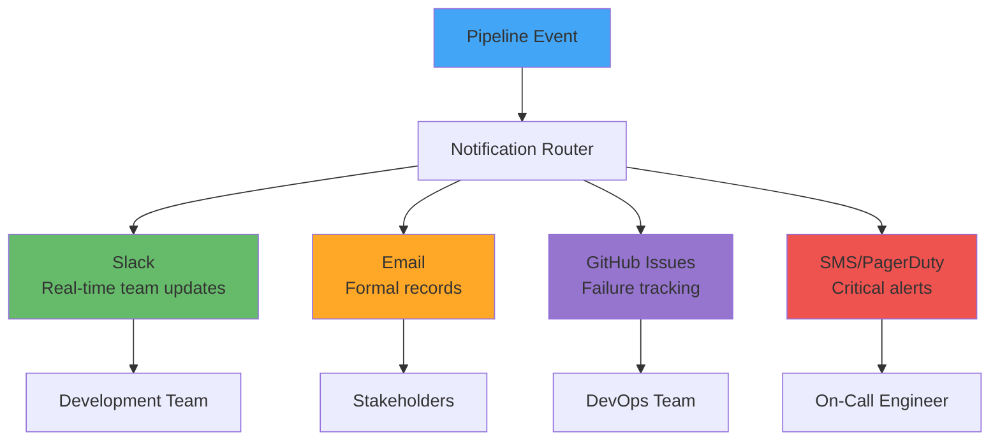
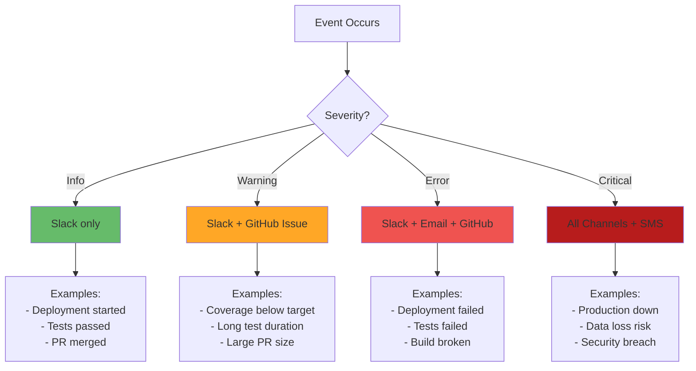

# Pipeline Notifications and Monitoring

**Learning Objective**: Set up alerts and monitoring for pipeline health to keep teams informed.

## Overview

A pipeline that fails silently is worse than no pipeline at all. This guide teaches you how to set up comprehensive notifications and monitoring so your team always knows the state of your deployments.

## Notification Channels

### Multi-Channel Strategy



### When to Use Each Channel



## Slack Notifications

### Complete Slack Integration

```yaml
name: Deployment with Slack Notifications

on:
  push:
    branches: [main, develop]
  pull_request:
    branches: [main]

env:
  SLACK_WEBHOOK_URL: ${{ secrets.SLACK_WEBHOOK_URL }}

jobs:
  deploy:
    runs-on: ubuntu-latest

    steps:
      - name: Notify Deployment Started
        uses: slackapi/slack-github-action@v1
        with:
          payload: |
            {
              "text": "🚀 Deployment Started",
              "blocks": [
                {
                  "type": "header",
                  "text": {
                    "type": "plain_text",
                    "text": "🚀 Deployment Started"
                  }
                },
                {
                  "type": "section",
                  "fields": [
                    {
                      "type": "mrkdwn",
                      "text": "*Environment:*\n${{ github.ref_name }}"
                    },
                    {
                      "type": "mrkdwn",
                      "text": "*Triggered by:*\n${{ github.actor }}"
                    },
                    {
                      "type": "mrkdwn",
                      "text": "*Commit:*\n<${{ github.server_url }}/${{ github.repository }}/commit/${{ github.sha }}|${GITHUB_SHA::7}>"
                    },
                    {
                      "type": "mrkdwn",
                      "text": "*Workflow:*\n<${{ github.server_url }}/${{ github.repository }}/actions/runs/${{ github.run_id }}|View Run>"
                    }
                  ]
                }
              ]
            }
        env:
          SLACK_WEBHOOK_URL: ${{ secrets.SLACK_WEBHOOK_URL }}
          SLACK_WEBHOOK_TYPE: INCOMING_WEBHOOK

      - name: Checkout code
        uses: actions/checkout@v4

      - name: Deploy
        id: deploy
        run: |
          # Deployment steps
          echo "Deploying..."
          # ... deployment code ...

      - name: Notify Deployment Success
        if: success()
        uses: slackapi/slack-github-action@v1
        with:
          payload: |
            {
              "text": "✅ Deployment Succeeded",
              "blocks": [
                {
                  "type": "header",
                  "text": {
                    "type": "plain_text",
                    "text": "✅ Deployment Succeeded"
                  }
                },
                {
                  "type": "section",
                  "fields": [
                    {
                      "type": "mrkdwn",
                      "text": "*Environment:*\n${{ github.ref_name }}"
                    },
                    {
                      "type": "mrkdwn",
                      "text": "*Duration:*\n${{ job.duration }} minutes"
                    }
                  ]
                },
                {
                  "type": "section",
                  "text": {
                    "type": "mrkdwn",
                    "text": "Deployment completed successfully! :rocket:"
                  }
                }
              ]
            }
        env:
          SLACK_WEBHOOK_URL: ${{ secrets.SLACK_WEBHOOK_URL }}
          SLACK_WEBHOOK_TYPE: INCOMING_WEBHOOK

      - name: Notify Deployment Failure
        if: failure()
        uses: slackapi/slack-github-action@v1
        with:
          payload: |
            {
              "text": "❌ Deployment Failed - @channel",
              "blocks": [
                {
                  "type": "header",
                  "text": {
                    "type": "plain_text",
                    "text": "❌ Deployment Failed"
                  }
                },
                {
                  "type": "section",
                  "fields": [
                    {
                      "type": "mrkdwn",
                      "text": "*Environment:*\n${{ github.ref_name }}"
                    },
                    {
                      "type": "mrkdwn",
                      "text": "*Triggered by:*\n${{ github.actor }}"
                    }
                  ]
                },
                {
                  "type": "section",
                  "text": {
                    "type": "mrkdwn",
                    "text": "<!channel> Deployment failed! Please investigate immediately."
                  }
                },
                {
                  "type": "actions",
                  "elements": [
                    {
                      "type": "button",
                      "text": {
                        "type": "plain_text",
                        "text": "View Workflow"
                      },
                      "url": "${{ github.server_url }}/${{ github.repository }}/actions/runs/${{ github.run_id }}"
                    },
                    {
                      "type": "button",
                      "text": {
                        "type": "plain_text",
                        "text": "View Commit"
                      },
                      "url": "${{ github.server_url }}/${{ github.repository }}/commit/${{ github.sha }}"
                    }
                  ]
                }
              ]
            }
        env:
          SLACK_WEBHOOK_URL: ${{ secrets.SLACK_WEBHOOK_URL }}
          SLACK_WEBHOOK_TYPE: INCOMING_WEBHOOK
```

### Rich Slack Messages with Test Results

```yaml
- name: Send Detailed Test Results to Slack
  if: always()
  run: |
    # Parse test results
    TESTS_RAN=$(jq -r '.result.summary.testsRan' test-results.json)
    TESTS_PASSED=$(jq -r '.result.summary.passing' test-results.json)
    TESTS_FAILED=$(jq -r '.result.summary.failing' test-results.json)
    COVERAGE=$(jq -r '.result.summary.orgWideCoverage' test-results.json)

    # Determine status icon
    if [ "$TESTS_FAILED" -eq 0 ]; then
      STATUS_ICON=":white_check_mark:"
      STATUS_TEXT="All Tests Passed"
      COLOR="#36a64f"
    else
      STATUS_ICON=":x:"
      STATUS_TEXT="Tests Failed"
      COLOR="#ff0000"
    fi

    # Create Slack message
    curl -X POST "$SLACK_WEBHOOK_URL" \
      -H 'Content-Type: application/json' \
      -d @- << EOF
    {
      "attachments": [
        {
          "color": "$COLOR",
          "title": "$STATUS_ICON $STATUS_TEXT",
          "fields": [
            {
              "title": "Tests Ran",
              "value": "$TESTS_RAN",
              "short": true
            },
            {
              "title": "Passed",
              "value": "$TESTS_PASSED",
              "short": true
            },
            {
              "title": "Failed",
              "value": "$TESTS_FAILED",
              "short": true
            },
            {
              "title": "Coverage",
              "value": "$COVERAGE",
              "short": true
            }
          ],
          "footer": "GitHub Actions",
          "footer_icon": "https://github.githubassets.com/favicon.ico",
          "ts": $(date +%s)
        }
      ]
    }
    EOF
```

## Email Notifications

### Professional Email Templates

```yaml
- name: Send Deployment Summary Email
  if: always()
  uses: dawidd6/action-send-mail@v3
  with:
    server_address: smtp.gmail.com
    server_port: 587
    username: ${{ secrets.EMAIL_USERNAME }}
    password: ${{ secrets.EMAIL_PASSWORD }}
    subject: |
      [${{ job.status }}] Deployment to ${{ github.ref_name }} - ${{ github.repository }}
    to: team@example.com,stakeholders@example.com
    from: devops@example.com
    html_body: |
      <!DOCTYPE html>
      <html>
      <head>
        <style>
          body { font-family: Arial, sans-serif; line-height: 1.6; }
          .header { background: #0366d6; color: white; padding: 20px; }
          .content { padding: 20px; }
          .success { color: #28a745; }
          .failure { color: #dc3545; }
          .info-table { border-collapse: collapse; width: 100%; }
          .info-table td { padding: 8px; border: 1px solid #ddd; }
          .info-table td:first-child { font-weight: bold; background: #f6f8fa; }
        </style>
      </head>
      <body>
        <div class="header">
          <h1>Deployment Report</h1>
        </div>
        <div class="content">
          <h2 class="${{ job.status == 'success' && 'success' || 'failure' }}">
            Status: ${{ job.status }}
          </h2>

          <table class="info-table">
            <tr>
              <td>Repository</td>
              <td>${{ github.repository }}</td>
            </tr>
            <tr>
              <td>Branch</td>
              <td>${{ github.ref_name }}</td>
            </tr>
            <tr>
              <td>Commit</td>
              <td><a href="${{ github.server_url }}/${{ github.repository }}/commit/${{ github.sha }}">${{ github.sha }}</a></td>
            </tr>
            <tr>
              <td>Triggered by</td>
              <td>${{ github.actor }}</td>
            </tr>
            <tr>
              <td>Workflow Run</td>
              <td><a href="${{ github.server_url }}/${{ github.repository }}/actions/runs/${{ github.run_id }}">View Details</a></td>
            </tr>
          </table>

          <h3>Next Steps</h3>
          <ul>
            ${{ job.status == 'success' && '<li>Monitor application for issues</li><li>Verify functionality in target environment</li>' || '<li>Review failure logs</li><li>Fix issues and retry deployment</li>' }}
          </ul>
        </div>
      </body>
      </html>
```

## GitHub Issue Creation

### Automatic Issue Creation on Failure

```yaml
- name: Create GitHub Issue on Failure
  if: failure()
  uses: actions/github-script@v7
  with:
    script: |
      const fs = require('fs');

      // Read failure details
      let deployResult = {};
      try {
        deployResult = JSON.parse(fs.readFileSync('deploy-result.json', 'utf8'));
      } catch (e) {
        console.log('No deploy result file found');
      }

      // Build detailed issue body
      let issueBody = `## 🚨 Deployment Failure\n\n`;
      issueBody += `**Environment**: ${{ github.ref_name }}\n`;
      issueBody += `**Commit**: ${{ github.sha }}\n`;
      issueBody += `**Triggered by**: @${{ github.actor }}\n`;
      issueBody += `**Time**: ${new Date().toISOString()}\n\n`;

      issueBody += `### Failure Details\n\n`;

      if (deployResult.result?.details?.componentFailures) {
        issueBody += `#### Component Failures\n\n`;
        deployResult.result.details.componentFailures.forEach(failure => {
          issueBody += `- **${failure.fullName}** (${failure.componentType})\n`;
          issueBody += `  \`\`\`\n  ${failure.problem}\n  \`\`\`\n\n`;
        });
      }

      if (deployResult.result?.details?.runTestResult?.failures) {
        issueBody += `#### Test Failures\n\n`;
        deployResult.result.details.runTestResult.failures.forEach(failure => {
          issueBody += `- **${failure.name}.${failure.methodName}**\n`;
          issueBody += `  \`\`\`\n  ${failure.message}\n  \`\`\`\n\n`;
        });
      }

      issueBody += `### Logs\n\n`;
      issueBody += `[View Workflow Run](${{ github.server_url }}/${{ github.repository }}/actions/runs/${{ github.run_id }})\n\n`;

      issueBody += `### Action Items\n\n`;
      issueBody += `- [ ] Review failure logs\n`;
      issueBody += `- [ ] Identify root cause\n`;
      issueBody += `- [ ] Fix issues\n`;
      issueBody += `- [ ] Verify fix in lower environment\n`;
      issueBody += `- [ ] Retry deployment\n\n`;

      issueBody += `---\n`;
      issueBody += `*This issue was automatically created by GitHub Actions*`;

      // Create the issue
      const issue = await github.rest.issues.create({
        owner: context.repo.owner,
        repo: context.repo.repo,
        title: `Deployment Failed: ${{ github.ref_name }} - ${new Date().toLocaleDateString()}`,
        body: issueBody,
        labels: ['deployment-failure', 'urgent', 'automated'],
        assignees: ['${{ github.actor }}']
      });

      console.log(`Created issue #${issue.data.number}`);
```

## SMS/PagerDuty Alerts

### Critical Production Alerts

```yaml
- name: Send PagerDuty Alert for Production Failure
  if: failure() && github.ref_name == 'main'
  run: |
    curl -X POST https://api.pagerduty.com/incidents \
      -H 'Authorization: Token token=${{ secrets.PAGERDUTY_TOKEN }}' \
      -H 'Content-Type: application/json' \
      -H 'Accept: application/vnd.pagerduty+json;version=2' \
      -H 'From: devops@example.com' \
      -d @- << EOF
    {
      "incident": {
        "type": "incident",
        "title": "Production Deployment Failed - ${{ github.repository }}",
        "service": {
          "id": "${{ secrets.PAGERDUTY_SERVICE_ID }}",
          "type": "service_reference"
        },
        "urgency": "high",
        "body": {
          "type": "incident_body",
          "details": "Production deployment failed on branch ${{ github.ref_name }}. Commit: ${{ github.sha }}. View: ${{ github.server_url }}/${{ github.repository }}/actions/runs/${{ github.run_id }}"
        }
      }
    }
    EOF
```

### Twilio SMS Integration

```yaml
- name: Send SMS Alert
  if: failure() && github.ref_name == 'main'
  run: |
    curl -X POST "https://api.twilio.com/2010-04-01/Accounts/${{ secrets.TWILIO_ACCOUNT_SID }}/Messages.json" \
      -u "${{ secrets.TWILIO_ACCOUNT_SID }}:${{ secrets.TWILIO_AUTH_TOKEN }}" \
      -d "From=${{ secrets.TWILIO_PHONE_NUMBER }}" \
      -d "To=${{ secrets.ONCALL_PHONE_NUMBER }}" \
      -d "Body=🚨 URGENT: Production deployment failed. Repository: ${{ github.repository }}. View: ${{ github.server_url }}/${{ github.repository }}/actions/runs/${{ github.run_id }}"
```

## Monitoring and Metrics

### Pipeline Health Dashboard

```yaml
name: Pipeline Metrics

on:
  workflow_run:
    workflows: ["*"]
    types: [completed]

jobs:
  track-metrics:
    runs-on: ubuntu-latest

    steps:
      - name: Record Pipeline Metrics
        run: |
          # Calculate metrics
          DURATION=${{ github.event.workflow_run.run_duration_ms }}
          DURATION_MIN=$((DURATION / 60000))
          STATUS="${{ github.event.workflow_run.conclusion }}"

          # Send to monitoring system (e.g., Datadog, Prometheus)
          curl -X POST "https://api.datadoghq.com/api/v1/series?api_key=${{ secrets.DATADOG_API_KEY }}" \
            -H "Content-Type: application/json" \
            -d @- << EOF
          {
            "series": [
              {
                "metric": "github.workflow.duration",
                "points": [[$(date +%s), $DURATION_MIN]],
                "type": "gauge",
                "tags": [
                  "workflow:${{ github.event.workflow_run.name }}",
                  "status:$STATUS",
                  "repository:${{ github.repository }}"
                ]
              },
              {
                "metric": "github.workflow.runs",
                "points": [[$(date +%s), 1]],
                "type": "count",
                "tags": [
                  "workflow:${{ github.event.workflow_run.name }}",
                  "status:$STATUS"
                ]
              }
            ]
          }
          EOF
```

### Custom Metrics Tracking

```yaml
- name: Track Custom Deployment Metrics
  run: |
    # Extract metrics from deployment
    COMPONENTS_DEPLOYED=$(jq -r '.result.numberComponentsDeployed' deploy-result.json)
    TESTS_RAN=$(jq -r '.result.numberTestsTotal' deploy-result.json)
    COVERAGE=$(jq -r '.result.coverage.coverage' deploy-result.json | tr -d '%')
    DEPLOY_TIME=$(jq -r '.result.deployTime' deploy-result.json)

    # Send to metrics backend
    cat > metrics.json << EOF
    {
      "timestamp": "$(date -u +%Y-%m-%dT%H:%M:%SZ)",
      "repository": "${{ github.repository }}",
      "environment": "${{ github.ref_name }}",
      "metrics": {
        "components_deployed": $COMPONENTS_DEPLOYED,
        "tests_ran": $TESTS_RAN,
        "code_coverage": $COVERAGE,
        "deploy_duration_seconds": $DEPLOY_TIME
      }
    }
    EOF

    # Post to your metrics API
    curl -X POST https://metrics.example.com/api/deployments \
      -H "Content-Type: application/json" \
      -H "Authorization: Bearer ${{ secrets.METRICS_API_TOKEN }}" \
      -d @metrics.json
```

## Smart Notifications

### Notification Frequency Control

```yaml
- name: Smart Notification (Avoid Spam)
  run: |
    # Only notify on status change, not every failure
    LAST_STATUS=$(gh api repos/${{ github.repository }}/actions/runs \
      --jq '.workflow_runs[1].conclusion' || echo "unknown")

    CURRENT_STATUS="${{ job.status }}"

    if [ "$LAST_STATUS" != "$CURRENT_STATUS" ]; then
      echo "Status changed from $LAST_STATUS to $CURRENT_STATUS - sending notification"
      # Send notification
    else
      echo "Status unchanged ($CURRENT_STATUS) - skipping notification"
    fi
```

### Time-Based Notifications

```yaml
- name: Business Hours Notification
  run: |
    HOUR=$(date -u +%H)
    DAY_OF_WEEK=$(date -u +%u)  # 1 = Monday, 7 = Sunday

    # Business hours: Mon-Fri, 9 AM - 6 PM UTC
    if [ "$DAY_OF_WEEK" -le 5 ] && [ "$HOUR" -ge 9 ] && [ "$HOUR" -lt 18 ]; then
      echo "Business hours - use Slack"
      CHANNEL="slack"
    else
      echo "After hours - use email only"
      CHANNEL="email"
    fi

    echo "notification_channel=$CHANNEL" >> $GITHUB_OUTPUT
```

### Severity-Based Routing

```yaml
- name: Route Notification Based on Severity
  run: |
    # Determine severity
    if [ "${{ github.ref_name }}" == "main" ] && [ "${{ job.status }}" == "failure" ]; then
      SEVERITY="critical"
    elif [ "${{ job.status }}" == "failure" ]; then
      SEVERITY="high"
    elif [ "$TESTS_FAILED" -gt 0 ]; then
      SEVERITY="medium"
    else
      SEVERITY="low"
    fi

    echo "### Notification Routing" >> $GITHUB_STEP_SUMMARY
    echo "**Severity**: $SEVERITY" >> $GITHUB_STEP_SUMMARY

    case "$SEVERITY" in
      critical)
        echo "Sending to: Slack, Email, PagerDuty, SMS"
        # Send all notifications
        ;;
      high)
        echo "Sending to: Slack, Email, GitHub Issue"
        ;;
      medium)
        echo "Sending to: Slack, GitHub Issue"
        ;;
      low)
        echo "Sending to: Slack only"
        ;;
    esac
```

## Notification Templates

### Reusable Notification Action

Create `.github/actions/notify/action.yml`:

```yaml
name: 'Send Notification'
description: 'Send deployment notifications to multiple channels'

inputs:
  status:
    description: 'Deployment status'
    required: true
  environment:
    description: 'Target environment'
    required: true
  slack_webhook:
    description: 'Slack webhook URL'
    required: true
  severity:
    description: 'Notification severity (info, warning, error, critical)'
    required: false
    default: 'info'

runs:
  using: 'composite'
  steps:
    - name: Determine notification channels
      shell: bash
      run: |
        case "${{ inputs.severity }}" in
          critical)
            echo "NOTIFY_SLACK=true" >> $GITHUB_ENV
            echo "NOTIFY_EMAIL=true" >> $GITHUB_ENV
            echo "NOTIFY_PAGER=true" >> $GITHUB_ENV
            ;;
          error)
            echo "NOTIFY_SLACK=true" >> $GITHUB_ENV
            echo "NOTIFY_EMAIL=true" >> $GITHUB_ENV
            ;;
          warning)
            echo "NOTIFY_SLACK=true" >> $GITHUB_ENV
            ;;
          *)
            echo "NOTIFY_SLACK=true" >> $GITHUB_ENV
            ;;
        esac

    - name: Send Slack notification
      if: env.NOTIFY_SLACK == 'true'
      shell: bash
      run: |
        STATUS_ICON="${{ inputs.status == 'success' && '✅' || '❌' }}"

        curl -X POST "${{ inputs.slack_webhook }}" \
          -H 'Content-Type: application/json' \
          -d "{\"text\": \"$STATUS_ICON Deployment ${{ inputs.status }}: ${{ inputs.environment }}\"}"
```

Use it in workflows:

```yaml
- name: Send notification
  uses: ./.github/actions/notify
  with:
    status: ${{ job.status }}
    environment: ${{ github.ref_name }}
    slack_webhook: ${{ secrets.SLACK_WEBHOOK_URL }}
    severity: ${{ job.status == 'failure' && 'error' || 'info' }}
```

## Best Practices

### 1. Don't Spam Your Team

```yaml
# ❌ BAD: Notify on every commit
on:
  push:
    branches: ['**']

# ✅ GOOD: Notify on important branches only
on:
  push:
    branches: [main, develop, 'release/**']
```

### 2. Provide Actionable Information

```yaml
# ❌ BAD: Generic message
"Deployment failed"

# ✅ GOOD: Specific, actionable
"Deployment to Production failed: 3 test failures in AccountTriggerTest.
Coverage dropped to 72% (below 75% threshold).
View details: [link]
Action needed: Fix failing tests and increase coverage."
```

### 3. Use Quiet Hours

```yaml
- name: Respect Quiet Hours
  run: |
    HOUR=$(date +%H)

    # No Slack notifications between 10 PM and 8 AM
    if [ "$HOUR" -ge 22 ] || [ "$HOUR" -lt 8 ]; then
      echo "Quiet hours - using email instead of Slack"
      CHANNEL="email"
    fi
```

### 4. Deduplicate Notifications

```yaml
- name: Deduplicate Notifications
  run: |
    # Check if similar notification was sent recently
    RECENT_NOTIFICATION=$(gh api \
      repos/${{ github.repository }}/issues \
      --jq '.[] | select(.labels[].name == "deployment-failure") | select(.created_at > (now - 3600)) | .number' \
      | head -1)

    if [ -n "$RECENT_NOTIFICATION" ]; then
      echo "Recent notification exists (#$RECENT_NOTIFICATION) - skipping duplicate"
      exit 0
    fi
```

### 5. Include Context

Every notification should include:
- What happened (deployment failed)
- Where it happened (production, commit SHA)
- When it happened (timestamp)
- Who triggered it (actor)
- What to do next (action items, links)

## Troubleshooting

### Issue: Notifications Not Received

**Solution**: Test webhooks independently

```yaml
- name: Test Slack Webhook
  run: |
    RESPONSE=$(curl -X POST "$SLACK_WEBHOOK_URL" \
      -H 'Content-Type: application/json' \
      -d '{"text": "Test message from GitHub Actions"}' \
      -w "%{http_code}" \
      -o /dev/null -s)

    if [ "$RESPONSE" != "200" ]; then
      echo "Slack webhook failed with status: $RESPONSE"
      exit 1
    fi
```

### Issue: Too Many Notifications

**Solution**: Implement notification throttling

```yaml
- name: Throttle Notifications
  run: |
    # Only send notification if last one was more than 1 hour ago
    LAST_NOTIF=$(cat last-notification.txt 2>/dev/null || echo 0)
    CURRENT_TIME=$(date +%s)
    TIME_DIFF=$((CURRENT_TIME - LAST_NOTIF))

    if [ $TIME_DIFF -lt 3600 ]; then
      echo "Last notification was $((TIME_DIFF / 60)) minutes ago - throttling"
      exit 0
    fi

    # Send notification
    echo $CURRENT_TIME > last-notification.txt
```

## Interview Talking Points

1. **"We use multi-channel notifications based on severity"**
   - Shows thoughtful alert design
   - Demonstrates understanding of stakeholder needs

2. **"Critical alerts go to PagerDuty, routine updates to Slack"**
   - Shows operational maturity
   - Demonstrates on-call readiness

3. **"We automatically create GitHub issues for deployment failures"**
   - Shows incident tracking
   - Demonstrates process automation

4. **"We respect quiet hours for non-critical notifications"**
   - Shows team empathy
   - Demonstrates work-life balance consideration

5. **"We track pipeline metrics to monitor deployment health trends"**
   - Shows data-driven approach
   - Demonstrates continuous improvement mindset

## Next Steps

- **Next Section**: [Real-World Scenarios](../scenarios/multi-team-coordination) - Apply pipeline knowledge to complex situations
- **Related**: [Rollback Strategies](./rollback-strategies) - Know when to notify about rollbacks
- **Related**: [Running Apex Tests in Pipelines](./running-tests) - Notify on test failures

---

**Key Takeaway**: Good notifications keep teams informed without overwhelming them. Send the right message, to the right people, at the right time, through the right channel.
