# Automated Validation on Pull Requests

**Learning Objective**: Implement pre-merge validation to catch issues early and maintain code quality.

## Overview

Pull request validation is your **first line of defense** against bugs reaching production. By automatically validating every code change before it's merged, you catch issues when they're cheapest to fix - during development.

## Why Validate Pull Requests?

### The Cost of Bugs by Stage


**Key Insight**: A bug caught during PR review costs 500x less than one that reaches production!

### Benefits of Automated PR Validation

1. **Catch Breaking Changes Early**: Before they reach main branch
2. **Enforce Code Quality**: Automated checks that never forget
3. **Faster Reviews**: Reviewers focus on logic, not syntax
4. **Confidence in Merging**: Green checks = safe to merge
5. **Documentation**: Every PR shows what changed and why

## PR Validation Architecture

### Complete PR Validation Flow

```mermaid
sequenceDiagram
    participant Dev as 👨‍💻 Developer
    participant GitHub as 🐙 GitHub
    participant Checks as ✅ PR Checks
    participant SF as ☁️ Salesforce
    participant Reviewers as 👥 Reviewers

    Dev->>GitHub: Create PR
    GitHub->>Checks: Trigger validation

    par Parallel Checks
        Checks->>Checks: Code scanning (ESLint)
        Checks->>Checks: Format validation (Prettier)
        Checks->>SF: Validate deployment
        Checks->>SF: Run affected tests
        Checks->>Checks: Check code coverage
    end

    alt All Checks Pass
        Checks-->>GitHub: ✅ All validations passed
        GitHub->>Reviewers: Request review
        Reviewers->>GitHub: Approve PR
        GitHub->>GitHub: Merge to main
    else Any Check Fails
        Checks-->>GitHub: ❌ Validation failed
        GitHub->>Dev: 🔔 Fix required
        Dev->>GitHub: Push fixes
        GitHub->>Checks: Re-run validation
    end
```



### Multi-Layer Validation Strategy

```mermaid
graph TB
    PR[New Pull Request] --> LAYER1[Layer 1: Fast Checks]
    LAYER1 --> L1A[Linting - 30s]
    LAYER1 --> L1B[Formatting - 15s]
    LAYER1 --> L1C[Security Scan - 45s]

    L1A --> L1PASS{All Pass?}
    L1B --> L1PASS
    L1C --> L1PASS

    L1PASS -->|No| FAIL1[❌ Block PR<br/>Quick Fix Needed]
    L1PASS -->|Yes| LAYER2[Layer 2: Validation]

    LAYER2 --> L2A[Deploy to Sandbox - 5min]
    LAYER2 --> L2B[Run Tests - 10min]
    LAYER2 --> L2C[Coverage Check - 1min]

    L2A --> L2PASS{All Pass?}
    L2B --> L2PASS
    L2C --> L2PASS

    L2PASS -->|No| FAIL2[❌ Block PR<br/>Code Fix Needed]
    L2PASS -->|Yes| LAYER3[Layer 3: Review]

    LAYER3 --> L3A[Request Code Review]
    LAYER3 --> L3B[Generate Change Summary]

    L3A --> APPROVE{Approved?}
    L3B --> APPROVE

    APPROVE -->|No| CHANGES[Request Changes]
    APPROVE -->|Yes| MERGE[✅ Safe to Merge]

    style LAYER1 fill:#42a5f5
    style LAYER2 fill:#ffa726
    style LAYER3 fill:#66bb6a
    style MERGE fill:#4caf50
    style FAIL1 fill:#ef5350
    style FAIL2 fill:#ef5350
```



## Complete PR Validation Workflow

### GitHub Actions - Production-Ready Example

```yaml
name: PR Validation

on:
  pull_request:
    branches:
      - main
      - develop
      - 'release/**'
    types: [opened, synchronize, reopened]

# Prevent multiple workflows from running on the same PR
concurrency:
  group: pr-${{ github.event.pull_request.number }}
  cancel-in-progress: true

permissions:
  contents: read
  pull-requests: write
  checks: write
  statuses: write

env:
  MINIMUM_COVERAGE: 75
  SFDX_USE_GENERIC_UNIX_KEYCHAIN: true
  SFDX_DISABLE_DNS_CHECK: true

jobs:
  # Layer 1: Fast Checks (runs first, fails fast)
  fast-checks:
    name: Fast Checks (Lint, Format, Security)
    runs-on: ubuntu-latest
    timeout-minutes: 10

    steps:
      - name: Checkout code
        uses: actions/checkout@v4
        with:
          fetch-depth: 0  # Full history for better analysis

      - name: Setup Node.js
        uses: actions/setup-node@v4
        with:
          node-version: '20'
          cache: 'npm'

      - name: Install dependencies
        run: npm ci

      # Check 1: ESLint (Code Quality)
      - name: Run ESLint
        id: eslint
        run: |
          npm run lint -- --format json --output-file eslint-report.json || true

          # Check if there are errors
          ERRORS=$(jq '[.[] | .errorCount] | add' eslint-report.json)
          WARNINGS=$(jq '[.[] | .warningCount] | add' eslint-report.json)

          echo "errors=$ERRORS" >> $GITHUB_OUTPUT
          echo "warnings=$WARNINGS" >> $GITHUB_OUTPUT

          echo "### 🔍 ESLint Results" >> $GITHUB_STEP_SUMMARY
          echo "- **Errors**: $ERRORS" >> $GITHUB_STEP_SUMMARY
          echo "- **Warnings**: $WARNINGS" >> $GITHUB_STEP_SUMMARY

          if [ "$ERRORS" -gt 0 ]; then
            echo "❌ ESLint found $ERRORS errors"
            exit 1
          fi

      # Check 2: Prettier (Code Formatting)
      - name: Check Prettier Formatting
        run: |
          npx prettier --check "force-app/**/*.{cls,trigger,js,html,css,json,md}" || {
            echo "❌ Code formatting issues found. Run 'npm run format' locally."
            exit 1
          }

      # Check 3: Security Scan (PMD for Apex)
      - name: Run PMD Security Scan
        run: |
          # Download PMD
          wget https://github.com/pmd/pmd/releases/download/pmd_releases%2F6.55.0/pmd-bin-6.55.0.zip
          unzip -q pmd-bin-6.55.0.zip

          # Run PMD on Apex code
          pmd-bin-6.55.0/bin/run.sh pmd \
            --dir force-app \
            --rulesets category/apex/security.xml,category/apex/errorprone.xml \
            --format json \
            --report-file pmd-report.json \
            --no-cache || true

          # Check violations
          VIOLATIONS=$(jq '.files | map(.violations | length) | add // 0' pmd-report.json)

          echo "### 🔒 Security Scan Results" >> $GITHUB_STEP_SUMMARY
          echo "- **Violations Found**: $VIOLATIONS" >> $GITHUB_STEP_SUMMARY

          if [ "$VIOLATIONS" -gt 0 ]; then
            echo "⚠️ Found $VIOLATIONS security issues"
            jq -r '.files[].violations[] | "- \(.rule): \(.beginLine):\(.beginColumn) - \(.description)"' pmd-report.json >> $GITHUB_STEP_SUMMARY
          fi

      # Check 4: Changed Files Analysis
      - name: Analyze Changed Files
        id: changes
        run: |
          # Get list of changed Apex files
          git diff --name-only origin/${{ github.base_ref }}...HEAD > changed-files.txt

          APEX_CHANGES=$(grep -c "\.cls$\|\.trigger$" changed-files.txt || echo "0")
          LWC_CHANGES=$(grep -c "lwc/" changed-files.txt || echo "0")
          AURA_CHANGES=$(grep -c "aura/" changed-files.txt || echo "0")

          echo "apex=$APEX_CHANGES" >> $GITHUB_OUTPUT
          echo "lwc=$LWC_CHANGES" >> $GITHUB_OUTPUT
          echo "aura=$AURA_CHANGES" >> $GITHUB_OUTPUT

          echo "### 📝 Change Summary" >> $GITHUB_STEP_SUMMARY
          echo "- **Apex Classes/Triggers**: $APEX_CHANGES" >> $GITHUB_STEP_SUMMARY
          echo "- **Lightning Web Components**: $LWC_CHANGES" >> $GITHUB_STEP_SUMMARY
          echo "- **Aura Components**: $AURA_CHANGES" >> $GITHUB_STEP_SUMMARY

      - name: Upload Fast Check Results
        if: always()
        uses: actions/upload-artifact@v4
        with:
          name: fast-check-results
          path: |
            eslint-report.json
            pmd-report.json
            changed-files.txt
          retention-days: 7

  # Layer 2: Salesforce Validation (runs after fast checks pass)
  salesforce-validation:
    name: Salesforce Deployment Validation
    runs-on: ubuntu-latest
    needs: fast-checks
    timeout-minutes: 60

    steps:
      - name: Checkout code
        uses: actions/checkout@v4
        with:
          fetch-depth: 0

      - name: Setup Node.js
        uses: actions/setup-node@v4
        with:
          node-version: '20'

      - name: Install Salesforce CLI
        run: |
          npm install -g @salesforce/cli
          sf version

      - name: Authenticate to Validation Org
        run: |
          echo "${{ secrets.SFDX_AUTH_URL_VALIDATION }}" > auth.txt
          sf org login sfdx-url --sfdx-url-file auth.txt --alias validation-org --set-default
          rm auth.txt
          sf org display --target-org validation-org

      # Validate deployment (doesn't actually deploy)
      - name: Validate Deployment
        id: validate
        run: |
          sf project deploy validate \
            --target-org validation-org \
            --manifest manifest/package.xml \
            --test-level RunLocalTests \
            --wait 60 \
            --verbose \
            --json > deploy-result.json

          # Extract deployment ID for later use
          DEPLOY_ID=$(jq -r '.result.id' deploy-result.json)
          echo "deploy_id=$DEPLOY_ID" >> $GITHUB_OUTPUT

          # Check if validation succeeded
          STATUS=$(jq -r '.result.status' deploy-result.json)
          echo "### 🚀 Deployment Validation" >> $GITHUB_STEP_SUMMARY
          echo "- **Status**: $STATUS" >> $GITHUB_STEP_SUMMARY
          echo "- **Deployment ID**: $DEPLOY_ID" >> $GITHUB_STEP_SUMMARY

      # Parse test results
      - name: Analyze Test Results
        run: |
          # Extract test summary
          TESTS_RAN=$(jq -r '.result.numberTestsTotal // 0' deploy-result.json)
          TESTS_PASSED=$(jq -r '.result.numberTestsCompleted // 0' deploy-result.json)
          TESTS_FAILED=$(jq -r '.result.numberTestErrors // 0' deploy-result.json)
          COVERAGE=$(jq -r '.result.coverage.coverage // "0%"' deploy-result.json)

          echo "### 🧪 Test Results" >> $GITHUB_STEP_SUMMARY
          echo "| Metric | Value |" >> $GITHUB_STEP_SUMMARY
          echo "|--------|-------|" >> $GITHUB_STEP_SUMMARY
          echo "| Tests Ran | $TESTS_RAN |" >> $GITHUB_STEP_SUMMARY
          echo "| Passed | $TESTS_PASSED |" >> $GITHUB_STEP_SUMMARY
          echo "| Failed | $TESTS_FAILED |" >> $GITHUB_STEP_SUMMARY
          echo "| Coverage | $COVERAGE |" >> $GITHUB_STEP_SUMMARY

          # Check for failures
          if [ "$TESTS_FAILED" -gt 0 ]; then
            echo "❌ $TESTS_FAILED test(s) failed"

            # List failed tests
            echo "<details><summary>Failed Tests</summary>" >> $GITHUB_STEP_SUMMARY
            jq -r '.result.details.runTestResult.failures[] |
              "- **\(.name).\(.methodName)**: \(.message)"' \
              deploy-result.json >> $GITHUB_STEP_SUMMARY || true
            echo "</details>" >> $GITHUB_STEP_SUMMARY

            exit 1
          fi

      # Check code coverage
      - name: Validate Code Coverage
        run: |
          # Extract coverage percentage
          COVERAGE=$(jq -r '.result.coverage.coverage // 0' deploy-result.json | tr -d '%')

          echo "Code Coverage: ${COVERAGE}%"

          if (( $(echo "$COVERAGE < $MINIMUM_COVERAGE" | bc -l) )); then
            echo "❌ Coverage ${COVERAGE}% is below minimum ${MINIMUM_COVERAGE}%"

            # Show classes below coverage
            echo "### ❌ Classes Below ${MINIMUM_COVERAGE}% Coverage" >> $GITHUB_STEP_SUMMARY
            jq -r '.result.coverage.coverage[] | select(.coveredPercent < env.MINIMUM_COVERAGE) |
              "- **\(.name)**: \(.coveredPercent)% (\(.numLocations) lines)"' \
              deploy-result.json >> $GITHUB_STEP_SUMMARY || true

            exit 1
          else
            echo "✅ Coverage ${COVERAGE}% meets minimum ${MINIMUM_COVERAGE}%"
          fi

      - name: Upload Deployment Results
        if: always()
        uses: actions/upload-artifact@v4
        with:
          name: deployment-results
          path: deploy-result.json
          retention-days: 30

  # Layer 3: Comment PR with Results
  comment-pr:
    name: Comment PR with Results
    runs-on: ubuntu-latest
    needs: [fast-checks, salesforce-validation]
    if: always()

    steps:
      - name: Download Artifacts
        uses: actions/download-artifact@v4
        with:
          path: artifacts

      - name: Create PR Comment
        uses: actions/github-script@v7
        with:
          script: |
            const fs = require('fs');

            // Read results
            let eslintReport, deployResult;

            try {
              eslintReport = JSON.parse(fs.readFileSync('artifacts/fast-check-results/eslint-report.json'));
              deployResult = JSON.parse(fs.readFileSync('artifacts/deployment-results/deploy-result.json'));
            } catch (e) {
              console.log('Error reading artifacts:', e.message);
              return;
            }

            // Calculate ESLint stats
            const eslintErrors = eslintReport.reduce((sum, file) => sum + file.errorCount, 0);
            const eslintWarnings = eslintReport.reduce((sum, file) => sum + file.warningCount, 0);

            // Get deployment stats
            const deployStatus = deployResult.result.status;
            const testsRan = deployResult.result.numberTestsTotal || 0;
            const testsPassed = deployResult.result.numberTestsCompleted || 0;
            const testsFailed = deployResult.result.numberTestErrors || 0;
            const coverage = deployResult.result.coverage?.coverage || '0%';

            // Determine overall status
            const allPassed = deployStatus === 'Succeeded' && eslintErrors === 0;
            const icon = allPassed ? '✅' : '❌';

            // Build comment
            let comment = `## ${icon} PR Validation Results\n\n`;

            // ESLint Section
            comment += `### 🔍 Code Quality\n`;
            comment += `| Check | Status |\n`;
            comment += `|-------|--------|\n`;
            comment += `| ESLint Errors | ${eslintErrors === 0 ? '✅' : '❌'} ${eslintErrors} |\n`;
            comment += `| ESLint Warnings | ${eslintWarnings === 0 ? '✅' : '⚠️'} ${eslintWarnings} |\n\n`;

            // Deployment Section
            comment += `### 🚀 Deployment Validation\n`;
            comment += `| Metric | Value |\n`;
            comment += `|--------|-------|\n`;
            comment += `| Status | ${deployStatus === 'Succeeded' ? '✅' : '❌'} ${deployStatus} |\n`;
            comment += `| Tests Ran | ${testsRan} |\n`;
            comment += `| Tests Passed | ${testsPassed} |\n`;
            comment += `| Tests Failed | ${testsFailed} |\n`;
            comment += `| Code Coverage | ${coverage} |\n\n`;

            // Failed tests details
            if (testsFailed > 0 && deployResult.result.details?.runTestResult?.failures) {
              comment += `<details><summary>❌ Failed Tests (${testsFailed})</summary>\n\n`;
              deployResult.result.details.runTestResult.failures.forEach(failure => {
                comment += `**${failure.name}.${failure.methodName}**\n`;
                comment += `\`\`\`\n${failure.message}\n\`\`\`\n\n`;
              });
              comment += `</details>\n\n`;
            }

            // Action items
            if (!allPassed) {
              comment += `### ⚠️ Action Required\n`;
              if (eslintErrors > 0) {
                comment += `- ❌ Fix ${eslintErrors} ESLint error(s)\n`;
              }
              if (testsFailed > 0) {
                comment += `- ❌ Fix ${testsFailed} failing test(s)\n`;
              }
              if (deployStatus !== 'Succeeded') {
                comment += `- ❌ Resolve deployment issues\n`;
              }
            } else {
              comment += `### ✅ All Checks Passed!\n`;
              comment += `This PR is ready for review and merge.\n`;
            }

            comment += `\n---\n`;
            comment += `[View Full Workflow Run](${{ github.server_url }}/${{ github.repository }}/actions/runs/${{ github.run_id }})`;

            // Post comment
            await github.rest.issues.createComment({
              issue_number: context.issue.number,
              owner: context.repo.owner,
              repo: context.repo.repo,
              body: comment
            });

  # Optional: Require approval for certain changes
  check-approval-needed:
    name: Check if Approval Required
    runs-on: ubuntu-latest
    needs: salesforce-validation
    if: success()

    steps:
      - name: Check for Production Changes
        uses: actions/github-script@v7
        with:
          script: |
            const { data: files } = await github.rest.pulls.listFiles({
              owner: context.repo.owner,
              repo: context.repo.repo,
              pull_number: context.issue.number
            });

            // Check if any production config files changed
            const prodFiles = files.filter(file =>
              file.filename.includes('prod') ||
              file.filename.includes('production') ||
              file.filename.includes('.permissionset')
            );

            if (prodFiles.length > 0) {
              await github.rest.issues.createComment({
                issue_number: context.issue.number,
                owner: context.repo.owner,
                repo: context.repo.repo,
                body: `⚠️ **Production Changes Detected**\n\nThis PR modifies production-related files. Manual review by DevOps lead is required.\n\nChanged files:\n${prodFiles.map(f => `- \`${f.filename}\``).join('\n')}`
              });

              // Request review from specific team
              await github.rest.pulls.requestReviewers({
                owner: context.repo.owner,
                repo: context.repo.repo,
                pull_number: context.issue.number,
                team_reviewers: ['devops-leads']
              });
            }
```

### GitLab CI - PR Validation Example

```yaml
# .gitlab-ci.yml
stages:
  - fast-checks
  - validation
  - report

variables:
  MINIMUM_COVERAGE: "75"

# Layer 1: Fast Checks
lint:
  stage: fast-checks
  image: node:20
  script:
    - npm ci
    - npm run lint -- --format json --output-file eslint-report.json || true
    - ERRORS=$(jq '[.[] | .errorCount] | add' eslint-report.json)
    - |
      if [ "$ERRORS" -gt 0 ]; then
        echo "ESLint found $ERRORS errors"
        exit 1
      fi
  artifacts:
    reports:
      codequality: eslint-report.json
    expire_in: 7 days

format-check:
  stage: fast-checks
  image: node:20
  script:
    - npm ci
    - npx prettier --check "force-app/**/*.{cls,trigger,js,html,css,json,md}"

security-scan:
  stage: fast-checks
  image: openjdk:11
  script:
    - wget https://github.com/pmd/pmd/releases/download/pmd_releases%2F6.55.0/pmd-bin-6.55.0.zip
    - unzip -q pmd-bin-6.55.0.zip
    - |
      pmd-bin-6.55.0/bin/run.sh pmd \
        --dir force-app \
        --rulesets category/apex/security.xml \
        --format json \
        --report-file pmd-report.json || true
  artifacts:
    reports:
      sast: pmd-report.json
    expire_in: 7 days

# Layer 2: Salesforce Validation
salesforce-validate:
  stage: validation
  image: node:20
  needs: [lint, format-check, security-scan]
  before_script:
    - npm install -g @salesforce/cli
    - echo "${SFDX_AUTH_URL}" > auth.txt
    - sf org login sfdx-url --sfdx-url-file auth.txt --alias validation-org
    - rm auth.txt
  script:
    - |
      sf project deploy validate \
        --target-org validation-org \
        --manifest manifest/package.xml \
        --test-level RunLocalTests \
        --wait 60 \
        --json > deploy-result.json

    # Check coverage
    - |
      COVERAGE=$(jq -r '.result.coverage.coverage // 0' deploy-result.json | tr -d '%')
      if (( $(echo "$COVERAGE < $MINIMUM_COVERAGE" | bc -l) )); then
        echo "Coverage ${COVERAGE}% is below minimum ${MINIMUM_COVERAGE}%"
        exit 1
      fi
  artifacts:
    paths:
      - deploy-result.json
    expire_in: 30 days
  only:
    - merge_requests
```

## Advanced Validation Techniques

### 1. Conditional Test Running (Smart Testing)

Only run tests affected by the changes:

```yaml
- name: Determine Tests to Run
  id: tests
  run: |
    # Get changed Apex classes
    CHANGED_CLASSES=$(git diff --name-only origin/${{ github.base_ref }}...HEAD | \
      grep "\.cls$" | \
      sed 's/.*\/\([^/]*\)\.cls/\1/' | \
      paste -sd "," -)

    if [ -z "$CHANGED_CLASSES" ]; then
      echo "No Apex changes, running all tests"
      echo "test_level=RunLocalTests" >> $GITHUB_OUTPUT
    else
      echo "Running tests for: $CHANGED_CLASSES"
      # Find corresponding test classes
      TEST_CLASSES=$(echo "$CHANGED_CLASSES" | sed 's/,/Test,/g')Test
      echo "test_classes=$TEST_CLASSES" >> $GITHUB_OUTPUT
      echo "test_level=RunSpecifiedTests" >> $GITHUB_OUTPUT
    fi

- name: Run Targeted Tests
  run: |
    if [ "${{ steps.tests.outputs.test_level }}" == "RunSpecifiedTests" ]; then
      sf project deploy validate \
        --target-org validation-org \
        --manifest manifest/package.xml \
        --test-level RunSpecifiedTests \
        --tests ${{ steps.tests.outputs.test_classes }}
    else
      sf project deploy validate \
        --target-org validation-org \
        --manifest manifest/package.xml \
        --test-level RunLocalTests
    fi
```

### 2. Parallel Validation (Multiple Orgs)

Validate against multiple sandbox types simultaneously:

```yaml
jobs:
  validate-dev:
    name: Validate on Dev Sandbox
    runs-on: ubuntu-latest
    steps:
      - # ... validation steps
      - run: sf project deploy validate --target-org dev-sandbox

  validate-qa:
    name: Validate on QA Sandbox
    runs-on: ubuntu-latest
    steps:
      - # ... validation steps
      - run: sf project deploy validate --target-org qa-sandbox

  validate-uat:
    name: Validate on UAT Sandbox
    runs-on: ubuntu-latest
    steps:
      - # ... validation steps
      - run: sf project deploy validate --target-org uat-sandbox

  all-validations-passed:
    name: All Validations Complete
    runs-on: ubuntu-latest
    needs: [validate-dev, validate-qa, validate-uat]
    steps:
      - run: echo "All validations passed!"
```

### 3. Delta Deployment (Only Changed Components)

```yaml
- name: Generate Delta Package
  run: |
    # Install SFDX Git Delta
    npm install -g sfdx-git-delta

    # Generate package.xml with only changed components
    sfdx sgd:source:delta \
      --to HEAD \
      --from origin/${{ github.base_ref }} \
      --output delta \
      --generate-delta

    # Show what's being deployed
    echo "### 📦 Delta Package Contents" >> $GITHUB_STEP_SUMMARY
    cat delta/package/package.xml >> $GITHUB_STEP_SUMMARY

- name: Validate Delta Package
  run: |
    sf project deploy validate \
      --target-org validation-org \
      --manifest delta/package/package.xml \
      --test-level RunLocalTests
```

### 4. Automated Rollback Plan

Generate rollback package during validation:

```yaml
- name: Generate Rollback Package
  run: |
    # Use sfdx-git-delta to create destructive changes
    sfdx sgd:source:delta \
      --to origin/${{ github.base_ref }} \
      --from HEAD \
      --output rollback \
      --generate-delta

    echo "### 🔄 Rollback Package Generated" >> $GITHUB_STEP_SUMMARY
    echo "If this PR causes issues, use \`rollback/package/package.xml\` to rollback" >> $GITHUB_STEP_SUMMARY

- name: Upload Rollback Package
  uses: actions/upload-artifact@v4
  with:
    name: rollback-package-pr-${{ github.event.pull_request.number }}
    path: rollback/
    retention-days: 90
```

## PR Validation Best Practices

### 1. Fail Fast


**Why**: Developers get feedback in 30 seconds instead of 15 minutes if lint fails.

### 2. Cache Dependencies

```yaml
- name: Cache Node Modules
  uses: actions/cache@v3
  with:
    path: ~/.npm
    key: ${{ runner.os }}-node-${{ hashFiles('**/package-lock.json') }}
    restore-keys: |
      ${{ runner.os }}-node-

- name: Cache Salesforce CLI
  uses: actions/cache@v3
  with:
    path: ~/.sf
    key: ${{ runner.os }}-sf-${{ hashFiles('**/sfdx-project.json') }}
```

**Impact**: Reduces workflow time by 1-2 minutes per run.

### 3. Use Concurrency Groups

```yaml
concurrency:
  group: pr-${{ github.event.pull_request.number }}
  cancel-in-progress: true
```

**Why**: If developer pushes new commit, cancel old validation and start fresh.

### 4. Set Appropriate Timeouts

```yaml
jobs:
  fast-checks:
    timeout-minutes: 10  # Should never take this long

  salesforce-validation:
    timeout-minutes: 60  # Reasonable for large deployments
```

**Why**: Don't waste runner time on stuck jobs.

### 5. Provide Clear Feedback

```yaml
- name: Annotate Code with Issues
  if: failure()
  uses: actions/github-script@v7
  with:
    script: |
      const fs = require('fs');
      const eslintReport = JSON.parse(fs.readFileSync('eslint-report.json'));

      for (const file of eslintReport) {
        for (const message of file.messages) {
          await github.rest.checks.create({
            owner: context.repo.owner,
            repo: context.repo.repo,
            name: 'ESLint',
            head_sha: context.sha,
            status: 'completed',
            conclusion: 'failure',
            output: {
              title: message.ruleId,
              summary: message.message,
              annotations: [{
                path: file.filePath,
                start_line: message.line,
                end_line: message.line,
                annotation_level: 'failure',
                message: message.message
              }]
            }
          });
        }
      }
```

## Handling Special Cases

### Large PRs

```yaml
- name: Check PR Size
  run: |
    FILES_CHANGED=$(git diff --name-only origin/${{ github.base_ref }}...HEAD | wc -l)
    LINES_CHANGED=$(git diff --stat origin/${{ github.base_ref }}...HEAD | tail -1 | awk '{print $4}')

    if [ "$FILES_CHANGED" -gt 50 ]; then
      echo "⚠️ Large PR: $FILES_CHANGED files changed" >> $GITHUB_STEP_SUMMARY
      echo "Consider breaking into smaller PRs" >> $GITHUB_STEP_SUMMARY
    fi
```

### Dependency Changes

```yaml
- name: Check for Dependency Changes
  run: |
    if git diff --name-only origin/${{ github.base_ref }}...HEAD | grep -q "package.json\|sfdx-project.json"; then
      echo "### ⚠️ Dependency Changes Detected" >> $GITHUB_STEP_SUMMARY
      echo "This PR modifies dependencies. Extra review recommended." >> $GITHUB_STEP_SUMMARY
    fi
```

### Breaking Changes

```yaml
- name: Check for Breaking Changes
  run: |
    # Check for @deprecated removals
    DEPRECATED_REMOVED=$(git diff origin/${{ github.base_ref }}...HEAD | grep "^-.*@deprecated" | wc -l)

    if [ "$DEPRECATED_REMOVED" -gt 0 ]; then
      echo "### 🚨 Breaking Changes Detected" >> $GITHUB_STEP_SUMMARY
      echo "This PR removes deprecated code. Ensure dependent systems are updated." >> $GITHUB_STEP_SUMMARY
    fi
```

## Troubleshooting

### Issue: Validation Times Out

**Solution**: Use check-only deployment for faster validation

```yaml
sf project deploy start \
  --target-org validation-org \
  --manifest manifest/package.xml \
  --dry-run \  # Don't actually deploy
  --ignore-warnings
```

### Issue: Flaky Org Connection

**Solution**: Add retry logic

```yaml
- name: Validate with Retry
  uses: nick-invision/retry@v3
  with:
    timeout_minutes: 60
    max_attempts: 3
    retry_wait_seconds: 30
    command: |
      sf project deploy validate \
        --target-org validation-org \
        --manifest manifest/package.xml
```

### Issue: Coverage Calculated Incorrectly

**Solution**: Clear org cache before validation

```yaml
- name: Clear Org Cache
  run: |
    sf apex run test \
      --target-org validation-org \
      --code-coverage \
      --synchronous \
      --wait 0  # Just trigger, don't wait
```

## Interview Talking Points

1. **"We validate every PR before merge with automated checks"**
   - Shows commitment to quality
   - Demonstrates automation expertise

2. **"We use a multi-layer validation strategy: fast checks first, then deployment"**
   - Shows efficiency thinking
   - Understands developer experience

3. **"Failed validations automatically comment on PRs with details"**
   - Demonstrates CI/CD knowledge
   - Shows attention to developer productivity

4. **"We generate rollback packages during PR validation"**
   - Proactive risk management
   - Shows operational maturity

5. **"We only run tests affected by changes for faster feedback"**
   - Optimization mindset
   - Understands trade-offs

## Next Steps

- **Next Guide**: [Deploying to Sandbox Environments](./sandbox-deployment) - Learn safe deployment strategies
- **Related**: [Running Apex Tests in Pipelines](./running-tests) - Deep dive into testing
- **Related**: [Rollback Strategies](./rollback-strategies) - Plan for deployment failures

---

**Key Takeaway**: PR validation is your safety net. Invest time in making it fast, reliable, and informative, and you'll catch bugs when they're cheapest to fix - during development.
