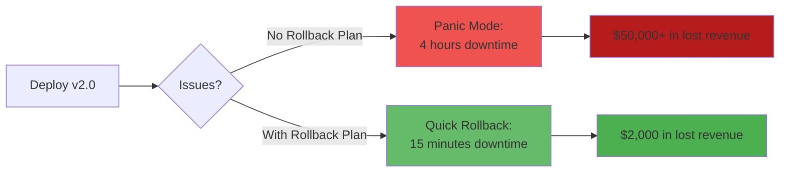
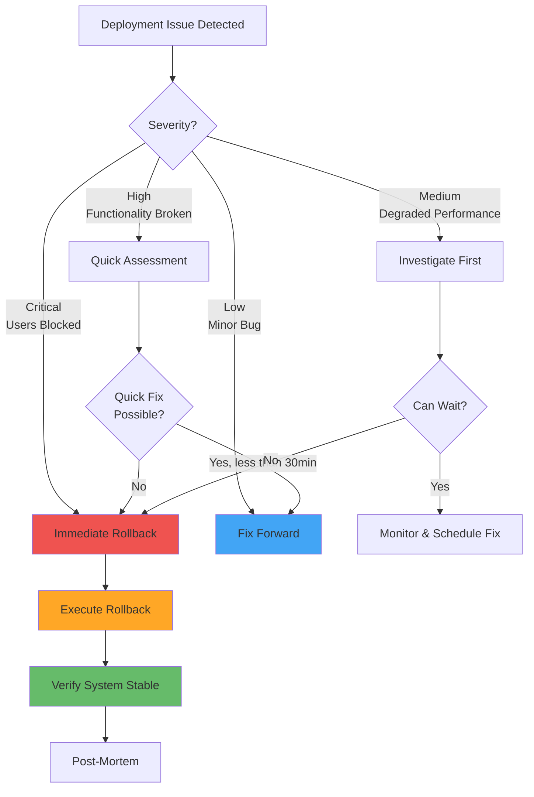

# Rollback Strategies

**Learning Objective**: Plan for and execute deployment rollbacks when things go wrong.

## Overview

Every deployment carries risk. The best DevOps teams don't just plan for success—they plan for failure. This guide teaches you how to roll back Salesforce deployments quickly and safely.

## Why Rollbacks Matter

### The Cost of Downtime



**Key Insight**: A 15-minute rollback saves 96% of downtime costs compared to a 4-hour incident response.

## Rollback Decision Tree



## Rollback Strategies

### Strategy 1: Destructive Changes (Component Removal)

Remove components that were added in the failed deployment.

```yaml
name: Rollback via Destructive Changes

on:
  workflow_dispatch:
    inputs:
      deployment_id:
        description: 'Deployment ID to rollback'
        required: true
      target_org:
        description: 'Target Organization'
        required: true
        type: choice
        options:
          - dev
          - qa
          - uat
          - staging
          - production

jobs:
  rollback:
    runs-on: ubuntu-latest
    timeout-minutes: 60

    steps:
      - name: Checkout code
        uses: actions/checkout@v4
        with:
          fetch-depth: 0

      - name: Install Salesforce CLI
        run: npm install -g @salesforce/cli

      - name: Authenticate to Salesforce
        run: |
          ENV="${{ github.event.inputs.target_org }}"
          AUTH_SECRET="SFDX_AUTH_URL_$(echo $ENV | tr '[:lower:]' '[:upper:]')"
          echo "${!AUTH_SECRET}" > auth.txt
          sf org login sfdx-url --sfdx-url-file auth.txt --alias target-org
          rm auth.txt

      - name: Get Deployment Artifacts
        run: |
          # Download deployment artifacts from the failed deployment
          gh run download --repo ${{ github.repository }} \
            --name deployment-${{ github.event.inputs.target_org }}-${{ github.event.inputs.deployment_id }}

          echo "### 📦 Deployment to Rollback" >> $GITHUB_STEP_SUMMARY
          cat delta/package/package.xml >> $GITHUB_STEP_SUMMARY

      - name: Generate Destructive Changes
        run: |
          # Convert package.xml to destructiveChanges.xml
          cp delta/package/package.xml destructiveChanges.xml

          # Create empty package.xml
          cat > package.xml << 'EOF'
          <?xml version="1.0" encoding="UTF-8"?>
          <Package xmlns="http://soap.sforce.com/2006/04/metadata">
              <version>59.0</version>
          </Package>
          EOF

          echo "### 🗑️ Destructive Changes" >> $GITHUB_STEP_SUMMARY
          cat destructiveChanges.xml >> $GITHUB_STEP_SUMMARY

      - name: Execute Rollback
        run: |
          # Deploy empty package with destructive changes
          sf project deploy start \
            --target-org target-org \
            --manifest package.xml \
            --post-destructive-changes destructiveChanges.xml \
            --ignore-warnings \
            --test-level NoTestRun \
            --wait 30

          echo "✅ Rollback completed" >> $GITHUB_STEP_SUMMARY

      - name: Verify Rollback
        run: |
          echo "### 🔍 Post-Rollback Verification" >> $GITHUB_STEP_SUMMARY

          # Check that components were removed
          sf org list metadata --target-org target-org --metadata-type ApexClass --json > metadata.json

          # Verify specific classes were removed
          # (implementation depends on what was deployed)

          echo "✅ Rollback verified" >> $GITHUB_STEP_SUMMARY
```

### Strategy 2: Redeploy Previous Version (Git-Based)

Deploy the previous working version from Git.

```yaml
name: Rollback to Previous Version

on:
  workflow_dispatch:
    inputs:
      commit_sha:
        description: 'Git commit SHA to rollback to'
        required: true
      target_org:
        description: 'Target Organization'
        required: true
        type: choice
        options:
          - qa
          - uat
          - staging
          - production

jobs:
  rollback:
    runs-on: ubuntu-latest

    steps:
      - name: Checkout specific commit
        uses: actions/checkout@v4
        with:
          ref: ${{ github.event.inputs.commit_sha }}
          fetch-depth: 0

      - name: Install Dependencies
        run: |
          npm install -g @salesforce/cli
          npm install -g sfdx-git-delta

      - name: Authenticate to Salesforce
        run: |
          ENV="${{ github.event.inputs.target_org }}"
          AUTH_SECRET="SFDX_AUTH_URL_$(echo $ENV | tr '[:lower:]' '[:upper:]')"
          echo "${!AUTH_SECRET}" > auth.txt
          sf org login sfdx-url --sfdx-url-file auth.txt --alias target-org
          rm auth.txt

      - name: Generate Delta to Rollback
        run: |
          # Current HEAD is the bad version
          # Check out commit is the good version
          # Generate what changed between them

          git fetch origin main

          # Generate destructive changes (what was added in bad version)
          sfdx sgd:source:delta \
            --from ${{ github.event.inputs.commit_sha }} \
            --to origin/main \
            --output destructive \
            --generate-delta

          # Generate additive changes (what needs to be added back)
          sfdx sgd:source:delta \
            --from origin/main \
            --to ${{ github.event.inputs.commit_sha }} \
            --output additive \
            --generate-delta

          echo "### 🔄 Rollback Plan" >> $GITHUB_STEP_SUMMARY
          echo "**From**: origin/main (bad)" >> $GITHUB_STEP_SUMMARY
          echo "**To**: ${{ github.event.inputs.commit_sha }} (good)" >> $GITHUB_STEP_SUMMARY

      - name: Deploy Additive Changes
        if: hashFiles('additive/package/package.xml') != ''
        run: |
          echo "Deploying additive changes..."

          sf project deploy start \
            --target-org target-org \
            --manifest additive/package/package.xml \
            --test-level RunLocalTests \
            --wait 60

          echo "✅ Additive changes deployed" >> $GITHUB_STEP_SUMMARY

      - name: Deploy Destructive Changes
        if: hashFiles('destructive/destructiveChanges/destructiveChanges.xml') != ''
        run: |
          echo "Deploying destructive changes..."

          sf project deploy start \
            --target-org target-org \
            --manifest additive/package/package.xml \
            --post-destructive-changes destructive/destructiveChanges/destructiveChanges.xml \
            --ignore-warnings \
            --wait 30

          echo "✅ Destructive changes deployed" >> $GITHUB_STEP_SUMMARY

      - name: Run Smoke Tests
        run: |
          # Run critical tests to verify rollback
          if [ -f smoke-tests.txt ]; then
            SMOKE_TESTS=$(cat smoke-tests.txt | tr '\n' ',' | sed 's/,$//')

            sf apex run test \
              --tests "$SMOKE_TESTS" \
              --target-org target-org \
              --result-format human \
              --wait 10

            echo "✅ Smoke tests passed" >> $GITHUB_STEP_SUMMARY
          fi
```

### Strategy 3: Feature Flag Toggle

Instantly disable problematic features without deploying.

```yaml
name: Emergency Feature Disable

on:
  workflow_dispatch:
    inputs:
      feature_name:
        description: 'Feature to disable'
        required: true
      target_org:
        description: 'Target Organization'
        required: true

jobs:
  disable-feature:
    runs-on: ubuntu-latest
    timeout-minutes: 5

    steps:
      - name: Install Salesforce CLI
        run: npm install -g @salesforce/cli

      - name: Authenticate to Salesforce
        run: |
          ENV="${{ github.event.inputs.target_org }}"
          AUTH_SECRET="SFDX_AUTH_URL_$(echo $ENV | tr '[:lower:]' '[:upper:]')"
          echo "${!AUTH_SECRET}" > auth.txt
          sf org login sfdx-url --sfdx-url-file auth.txt --alias target-org
          rm auth.txt

      - name: Disable Feature Flag
        run: |
          # Update custom metadata to disable feature
          sf data update record \
            --sobject Feature_Flag__mdt \
            --where "DeveloperName='${{ github.event.inputs.feature_name }}'" \
            --values "IsEnabled__c=false" \
            --target-org target-org

          echo "### ✅ Feature Disabled" >> $GITHUB_STEP_SUMMARY
          echo "**Feature**: ${{ github.event.inputs.feature_name }}" >> $GITHUB_STEP_SUMMARY
          echo "**Status**: Disabled" >> $GITHUB_STEP_SUMMARY
          echo "**Time**: $(date)" >> $GITHUB_STEP_SUMMARY

      - name: Notify Team
        uses: actions/github-script@v7
        with:
          script: |
            await github.rest.issues.create({
              owner: context.repo.owner,
              repo: context.repo.repo,
              title: `Feature Disabled: ${{ github.event.inputs.feature_name }}`,
              body: `🚨 **Emergency Feature Disable**\n\n**Feature**: ${{ github.event.inputs.feature_name }}\n**Environment**: ${{ github.event.inputs.target_org }}\n**Disabled by**: ${{ github.actor }}\n**Time**: ${new Date().toISOString()}`,
              labels: ['incident', 'rollback']
            });
```

### Strategy 4: Backup Restore (Last Resort)

Restore from sandbox backup.

```yaml
name: Restore from Backup

on:
  workflow_dispatch:
    inputs:
      backup_id:
        description: 'Backup ID to restore'
        required: true
      target_org:
        description: 'Target Organization (sandbox only)'
        required: true

jobs:
  restore:
    runs-on: ubuntu-latest

    steps:
      - name: Validate Target is Sandbox
        run: |
          if [ "${{ github.event.inputs.target_org }}" == "production" ]; then
            echo "❌ Cannot restore backups to production!"
            exit 1
          fi

      - name: Request Sandbox Refresh
        run: |
          # This would typically integrate with Salesforce API
          # to refresh sandbox from production or backup

          echo "### ⚠️ Sandbox Refresh Initiated" >> $GITHUB_STEP_SUMMARY
          echo "**Backup ID**: ${{ github.event.inputs.backup_id }}" >> $GITHUB_STEP_SUMMARY
          echo "**Target**: ${{ github.event.inputs.target_org }}" >> $GITHUB_STEP_SUMMARY
          echo "" >> $GITHUB_STEP_SUMMARY
          echo "This process may take several hours..." >> $GITHUB_STEP_SUMMARY

      # Additional steps would monitor refresh status
```

## Automated Rollback Detection

### Monitor and Auto-Rollback on Failure

```yaml
name: Deploy with Auto-Rollback

on:
  workflow_dispatch:
    inputs:
      target_org:
        description: 'Target Organization'
        required: true

jobs:
  deploy-with-monitoring:
    runs-on: ubuntu-latest

    steps:
      - name: Checkout code
        uses: actions/checkout@v4

      - name: Record Pre-Deployment State
        run: |
          # Record metrics before deployment
          cat > pre-deployment.json << EOF
          {
            "timestamp": "$(date -u +%Y-%m-%dT%H:%M:%SZ)",
            "commit": "${{ github.sha }}",
            "error_count": 0,
            "active_users": 0
          }
          EOF

      - name: Deploy
        id: deploy
        run: |
          sf project deploy start \
            --target-org target-org \
            --manifest manifest/package.xml \
            --test-level RunLocalTests \
            --wait 60 \
            --json > deploy-result.json

          DEPLOY_ID=$(jq -r '.result.id' deploy-result.json)
          echo "deploy_id=$DEPLOY_ID" >> $GITHUB_OUTPUT

      - name: Monitor Post-Deployment
        id: monitor
        run: |
          echo "Monitoring deployment for 5 minutes..."

          ERRORS=0
          for i in {1..10}; do
            sleep 30

            # Check for errors in debug logs
            ERROR_COUNT=$(sf data query \
              --query "SELECT COUNT() FROM ApexLog WHERE Request = 'ERROR' AND CreatedDate = TODAY" \
              --target-org target-org \
              --json | jq -r '.result.totalSize')

            echo "Errors detected: $ERROR_COUNT"

            if [ "$ERROR_COUNT" -gt 10 ]; then
              ERRORS=$((ERRORS + 1))
            fi

            # If errors persist, trigger rollback
            if [ "$ERRORS" -ge 3 ]; then
              echo "threshold_exceeded=true" >> $GITHUB_OUTPUT
              break
            fi
          done

      - name: Auto-Rollback if Threshold Exceeded
        if: steps.monitor.outputs.threshold_exceeded == 'true'
        run: |
          echo "### 🚨 Auto-Rollback Triggered" >> $GITHUB_STEP_SUMMARY
          echo "Error threshold exceeded. Rolling back..." >> $GITHUB_STEP_SUMMARY

          # Trigger rollback workflow
          gh workflow run rollback.yml \
            -f deployment_id="${{ steps.deploy.outputs.deploy_id }}" \
            -f target_org="${{ github.event.inputs.target_org }}" \
            --repo ${{ github.repository }}

      - name: Notify if Rollback Triggered
        if: steps.monitor.outputs.threshold_exceeded == 'true'
        run: |
          # Send urgent notifications
          echo "Rollback triggered due to elevated error rates"
```

## Rollback Testing

### Pre-Production Rollback Drills

```yaml
name: Rollback Drill

on:
  schedule:
    - cron: '0 10 * * 1'  # Every Monday at 10 AM UTC

jobs:
  rollback-drill:
    runs-on: ubuntu-latest

    steps:
      - name: Checkout code
        uses: actions/checkout@v4

      - name: Deploy Test Version
        run: |
          echo "Deploying test version to QA..."
          # Deploy known working version

      - name: Deploy Breaking Change
        run: |
          echo "Deploying intentionally breaking change..."
          # Deploy something that will need rollback

      - name: Execute Rollback
        run: |
          echo "Executing rollback procedure..."
          # Run actual rollback

      - name: Verify Rollback Success
        run: |
          echo "Verifying rollback..."
          # Verify system is back to working state

      - name: Report Results
        run: |
          cat > drill-report.md << EOF
          # Rollback Drill Report

          **Date**: $(date)
          **Environment**: QA
          **Result**: ✅ Success

          ## Timeline
          - Deploy: 10:00
          - Issue Detected: 10:05
          - Rollback Started: 10:06
          - Rollback Complete: 10:10
          - Verification Complete: 10:12

          **Total Time**: 12 minutes

          EOF

          cat drill-report.md >> $GITHUB_STEP_SUMMARY
```

## Rollback Checklist

### Pre-Rollback Verification

```yaml
- name: Pre-Rollback Checklist
  run: |
    cat > rollback-checklist.md << 'EOF'
    # Rollback Checklist

    ## Pre-Rollback
    - [ ] Incident severity assessed
    - [ ] Rollback decision approved by incident commander
    - [ ] Target rollback version identified
    - [ ] Rollback artifacts available
    - [ ] Stakeholders notified
    - [ ] Backup verified (if needed)

    ## During Rollback
    - [ ] Deployment in progress notification sent
    - [ ] Monitoring active
    - [ ] Team on standby

    ## Post-Rollback
    - [ ] System functionality verified
    - [ ] Users notified
    - [ ] Incident log updated
    - [ ] Post-mortem scheduled

    EOF

    cat rollback-checklist.md >> $GITHUB_STEP_SUMMARY
```

## Best Practices

### 1. Always Keep Rollback Artifacts

```yaml
- name: Save Rollback Package
  if: always()
  uses: actions/upload-artifact@v4
  with:
    name: rollback-package-${{ github.sha }}
    path: |
      delta/
      deploy-result.json
    retention-days: 90  # Keep for 3 months
```

### 2. Test Rollback in Lower Environments

```yaml
# Never rollback production without testing in QA first
- name: Test Rollback in QA
  if: github.event.inputs.target_org == 'production'
  run: |
    echo "Testing rollback in QA first..."
    # Execute rollback in QA
    # Verify it works
    # Then proceed to production
```

### 3. Use Quick Deploy for Faster Rollback

```yaml
- name: Quick Rollback Deploy
  run: |
    # If previous deployment was validated, use quick deploy
    if [ -f validated-deployment-id.txt ]; then
      VALIDATION_ID=$(cat validated-deployment-id.txt)

      sf project deploy quick \
        --job-id "$VALIDATION_ID" \
        --target-org target-org

      # Much faster than re-running tests!
    fi
```

### 4. Document Everything

```yaml
- name: Create Rollback Documentation
  run: |
    cat > rollback-log.md << EOF
    # Rollback Log

    **Date**: $(date)
    **Environment**: ${{ github.event.inputs.target_org }}
    **Trigger**: ${{ github.event_name }}
    **Initiated by**: ${{ github.actor }}

    ## What Happened
    - Failed deployment ID: ${{ github.event.inputs.deployment_id }}
    - Reason for rollback: [TO BE FILLED]

    ## What Was Done
    - Rolled back to commit: [TO BE FILLED]
    - Components removed: [TO BE FILLED]
    - Components restored: [TO BE FILLED]

    ## Impact
    - Downtime: [TO BE FILLED]
    - Users affected: [TO BE FILLED]

    ## Lessons Learned
    [TO BE FILLED]

    EOF

    cat rollback-log.md >> $GITHUB_STEP_SUMMARY
```

### 5. Practice Makes Perfect

```
Regular rollback drills ensure your team can execute under pressure:

- Monthly drills in QA
- Quarterly drills in UAT
- Document drill results
- Update procedures based on learnings
```

## Troubleshooting

### Issue: Can't Find Deployment Artifacts

**Solution**: Implement artifact retention policy

```yaml
# In deployment workflow
- name: Save Deployment Artifacts
  uses: actions/upload-artifact@v4
  with:
    name: deployment-${{ github.event.inputs.environment }}-${{ github.sha }}
    path: |
      delta/
      deploy-result.json
    retention-days: 90
```

### Issue: Rollback Takes Too Long

**Solution**: Use destructive changes instead of redeploying

```yaml
# Faster: Remove components
sf project deploy start --post-destructive-changes destructive.xml

# Slower: Redeploy old version
sf project deploy start --manifest package.xml --test-level RunLocalTests
```

### Issue: Partial Rollback Needed

**Solution**: Generate selective destructive changes

```yaml
- name: Selective Rollback
  run: |
    # Only rollback specific components
    cat > selective-destructive.xml << 'EOF'
    <?xml version="1.0" encoding="UTF-8"?>
    <Package xmlns="http://soap.sforce.com/2006/04/metadata">
        <types>
            <members>ProblemClass</members>
            <name>ApexClass</name>
        </types>
        <version>59.0</version>
    </Package>
    EOF

    sf project deploy start --post-destructive-changes selective-destructive.xml
```

## Interview Talking Points

1. **"We maintain rollback artifacts for 90 days"**
   - Shows operational maturity
   - Demonstrates risk planning

2. **"We practice rollback drills monthly"**
   - Shows commitment to reliability
   - Demonstrates team preparedness

3. **"We use feature flags for instant rollback"**
   - Shows advanced deployment strategies
   - Minimizes downtime

4. **"We have a documented rollback decision tree"**
   - Shows structured incident response
   - Demonstrates leadership in crisis

5. **"Our average rollback time is under 15 minutes"**
   - Shows operational excellence
   - Demonstrates process optimization

## Next Steps

- **Next Guide**: [Pipeline Notifications](./notifications) - Stay informed about deployments and rollbacks
- **Related**: [Deploying to Sandbox Environments](./sandbox-deployment) - Deployment strategies
- **Related**: [Running Apex Tests in Pipelines](./running-tests) - Testing before rollback

---

**Key Takeaway**: Hope for the best, plan for the worst. A well-executed rollback in 15 minutes beats a panicked fix attempt that takes 4 hours. Practice your rollbacks until they're muscle memory.
