# Running Apex Tests in Pipelines

**Learning Objective**: Automate test execution and interpret results in CI/CD pipelines for Salesforce.

## Overview

Automated testing is the cornerstone of reliable Salesforce deployments. This guide shows you how to run Apex tests in your CI/CD pipeline, interpret results, and handle failures gracefully.

## Why Automate Testing?

### The Cost of Manual Testing


### Benefits of Automated Testing

1. **Instant Feedback**: Know within minutes if code breaks something
2. **Deployment Safety**: Never deploy failing code to production
3. **Regression Prevention**: Catch bugs before users do
4. **Code Coverage Enforcement**: Maintain quality standards
5. **Documentation**: Tests serve as living documentation

## Test Execution Strategies

### Strategy 1: Run All Tests (Comprehensive)

```yaml
# GitHub Actions example
name: Comprehensive Test Suite

on:
  push:
    branches: [main, develop]
  pull_request:
    branches: [main]

jobs:
  test:
    runs-on: ubuntu-latest
    steps:
      - uses: actions/checkout@v4

      - name: Install Salesforce CLI
        run: npm install -g @salesforce/cli

      - name: Authenticate to Sandbox
        run: |
          echo "${{ secrets.SFDX_AUTH_URL }}" > auth.txt
          sf org login sfdx-url --sfdx-url-file auth.txt --alias ci-sandbox
          rm auth.txt

      - name: Run All Tests
        run: |
          sf apex run test \
            --target-org ci-sandbox \
            --code-coverage \
            --result-format human \
            --output-dir ./test-results \
            --wait 60

      - name: Upload Test Results
        if: always()
        uses: actions/upload-artifact@v4
        with:
          name: test-results
          path: ./test-results/
```

**When to Use**: Main branch merges, release candidates, scheduled nightly builds

**Pros**: Maximum confidence, catches integration issues

**Cons**: Slow (can take 30+ minutes), expensive in terms of Salesforce limits

### Strategy 2: Run Specified Tests (Fast)

```yaml
- name: Run Specified Tests
  run: |
    sf apex run test \
      --target-org ci-sandbox \
      --tests AccountTriggerTest,ContactTriggerTest \
      --result-format json \
      --output-dir ./test-results \
      --wait 10
```

**When to Use**: Pull request validation, quick feedback loops

**Pros**: Fast (minutes), targeted testing

**Cons**: Might miss integration issues

### Strategy 3: Run Test Suite

```yaml
- name: Run Test Suite
  run: |
    sf apex run test \
      --target-org ci-sandbox \
      --suite-names CriticalTests \
      --code-coverage \
      --result-format json \
      --wait 20
```

**When to Use**: Specific feature testing, module validation

**Pros**: Organized, reusable, flexible

**Cons**: Requires maintaining test suites

### Decision Flow


## Test Result Formats

### Human Format (Best for Logs)

```bash
sf apex run test --result-format human
```

**Output**:
```
=== Test Summary
NAME                 VALUE
───────────────────  ────────────
Outcome              Passed
Tests Ran            47
Pass Rate            100%
Fail Rate            0%
Skip Rate            0%
Test Run Coverage    85%
Org Wide Coverage    78%
Test Total Time      2m 34s

=== Test Results
TEST NAME                    OUTCOME  MESSAGE  RUNTIME (MS)
───────────────────────────  ───────  ───────  ────────────
AccountTriggerTest.testInsert  Pass              453
AccountTriggerTest.testUpdate  Pass              289
ContactTriggerTest.testInsert  Pass              512
...
```

### JSON Format (Best for Parsing)

```bash
sf apex run test --result-format json
```

**Output**:
```json
{
  "status": 0,
  "result": {
    "summary": {
      "outcome": "Passed",
      "testsRan": 47,
      "passing": 47,
      "failing": 0,
      "skipped": 0,
      "passRate": "100%",
      "failRate": "0%",
      "testRunCoverage": "85%",
      "orgWideCoverage": "78%",
      "testExecutionTimeInMs": 154000,
      "testTotalTimeInMs": 154000
    },
    "tests": [
      {
        "id": "07M...",
        "queueItemId": "709...",
        "stackTrace": null,
        "message": null,
        "asyncApexJobId": "707...",
        "methodName": "testInsert",
        "outcome": "Pass",
        "apexLogId": "07L...",
        "apexClass": {
          "id": "01p...",
          "name": "AccountTriggerTest",
          "namespacePrefix": null,
          "fullName": "AccountTriggerTest"
        },
        "runTime": 453,
        "testTimestamp": "453"
      }
    ]
  }
}
```

### JUnit Format (Best for CI/CD Tools)

```bash
sf apex run test --result-format junit --output-dir ./test-results
```

**Output**: `test-results/test-result-junit.xml`
```xml
<?xml version="1.0" encoding="UTF-8"?>
<testsuites>
  <testsuite name="AccountTriggerTest" tests="2" failures="0" errors="0" time="0.742">
    <testcase name="testInsert" classname="AccountTriggerTest" time="0.453"/>
    <testcase name="testUpdate" classname="AccountTriggerTest" time="0.289"/>
  </testsuite>
  <testsuite name="ContactTriggerTest" tests="3" failures="1" errors="0" time="1.524">
    <testcase name="testInsert" classname="ContactTriggerTest" time="0.512"/>
    <testcase name="testUpdate" classname="ContactTriggerTest" time="0.487">
      <failure message="System.AssertException: Expected 200, but was 201">
        Class.ContactTriggerTest.testUpdate: line 42, column 1
      </failure>
    </testcase>
  </testsuite>
</testsuites>
```

## Code Coverage Requirements

### Understanding Coverage Metrics


### Enforcing Coverage in Pipeline

```yaml
- name: Run Tests and Check Coverage
  id: test
  run: |
    sf apex run test \
      --target-org ci-sandbox \
      --code-coverage \
      --result-format json \
      --output-dir ./test-results \
      --wait 60

    # Save result for next step
    echo "test_result=$?" >> $GITHUB_OUTPUT

- name: Parse and Validate Coverage
  run: |
    # Extract coverage from JSON
    COVERAGE=$(jq -r '.result.summary.testRunCoverage' ./test-results/test-result.json | tr -d '%')
    ORG_COVERAGE=$(jq -r '.result.summary.orgWideCoverage' ./test-results/test-result.json | tr -d '%')

    echo "Test Run Coverage: ${COVERAGE}%"
    echo "Org Wide Coverage: ${ORG_COVERAGE}%"

    # Check minimum thresholds
    MINIMUM=75

    if (( $(echo "$ORG_COVERAGE < $MINIMUM" | bc -l) )); then
      echo "❌ Coverage ${ORG_COVERAGE}% is below minimum ${MINIMUM}%"
      exit 1
    else
      echo "✅ Coverage ${ORG_COVERAGE}% meets minimum ${MINIMUM}%"
    fi
```

### Coverage Report Example

```yaml
- name: Generate Coverage Report
  run: |
    # Create markdown report
    cat > coverage-report.md << 'EOF'
    # Test Coverage Report

    ## Summary
    - **Test Run Coverage**: $(jq -r '.result.summary.testRunCoverage' ./test-results/test-result.json)
    - **Org Wide Coverage**: $(jq -r '.result.summary.orgWideCoverage' ./test-results/test-result.json)
    - **Tests Ran**: $(jq -r '.result.summary.testsRan' ./test-results/test-result.json)
    - **Passing**: $(jq -r '.result.summary.passing' ./test-results/test-result.json)
    - **Failing**: $(jq -r '.result.summary.failing' ./test-results/test-result.json)

    ## Classes Below 75% Coverage
    $(jq -r '.result.coverage.coverage[] | select(.coveredPercent < 75) | "- \(.name): \(.coveredPercent)%"' ./test-results/test-result.json)
    EOF

    cat coverage-report.md >> $GITHUB_STEP_SUMMARY
```

## Handling Test Failures

### Complete Failure Handling Workflow

```mermaid
sequenceDiagram
    participant Dev as 👨‍💻 Developer
    participant GH as 🐙 GitHub
    participant Pipeline as ⚙️ Pipeline
    participant SF as ☁️ Salesforce
    participant Slack as 💬 Slack

    Dev->>GH: Push code
    GH->>Pipeline: Trigger workflow
    Pipeline->>SF: Run tests

    alt Tests Pass
        SF-->>Pipeline: ✅ All tests passed
        Pipeline->>GH: ✅ Mark as success
        Pipeline->>Dev: Continue to deploy
    else Tests Fail
        SF-->>Pipeline: ❌ Tests failed
        Pipeline->>Pipeline: Parse failure details
        Pipeline->>GH: ❌ Mark as failed
        Pipeline->>GH: Comment on PR with details
        Pipeline->>Slack: Send alert
        Pipeline->>Pipeline: Upload test artifacts
        Slack-->>Dev: 🔔 Tests failed notification
        Dev->>GH: View failure details
        Dev->>Dev: Fix code
        Dev->>GH: Push fix
    end
```



### Parsing Test Failures

```yaml
- name: Parse Test Failures
  if: failure()
  run: |
    # Extract failed tests
    jq -r '.result.tests[] | select(.outcome == "Fail") |
      "## ❌ \(.apexClass.name).\(.methodName)\n" +
      "**Message**: \(.message)\n" +
      "**Stack Trace**:\n```\n\(.stackTrace)\n```\n"' \
      ./test-results/test-result.json > failures.md

    # Show in summary
    cat failures.md >> $GITHUB_STEP_SUMMARY
```

### Comment on Pull Request

```yaml
- name: Comment Test Results on PR
  if: github.event_name == 'pull_request'
  uses: actions/github-script@v7
  with:
    script: |
      const fs = require('fs');
      const testResults = JSON.parse(fs.readFileSync('./test-results/test-result.json'));

      const summary = testResults.result.summary;
      const failures = testResults.result.tests.filter(t => t.outcome === 'Fail');

      let comment = `## 🧪 Test Results\n\n`;

      if (summary.outcome === 'Passed') {
        comment += `### ✅ All Tests Passed!\n\n`;
      } else {
        comment += `### ❌ Tests Failed\n\n`;
      }

      comment += `| Metric | Value |\n`;
      comment += `|--------|-------|\n`;
      comment += `| Tests Ran | ${summary.testsRan} |\n`;
      comment += `| Passing | ${summary.passing} |\n`;
      comment += `| Failing | ${summary.failing} |\n`;
      comment += `| Pass Rate | ${summary.passRate} |\n`;
      comment += `| Coverage | ${summary.orgWideCoverage} |\n\n`;

      if (failures.length > 0) {
        comment += `### Failed Tests\n\n`;
        failures.forEach(test => {
          comment += `#### ${test.apexClass.name}.${test.methodName}\n`;
          comment += `**Message**: ${test.message}\n\n`;
          comment += `<details><summary>Stack Trace</summary>\n\n\`\`\`\n${test.stackTrace}\n\`\`\`\n</details>\n\n`;
        });
      }

      github.rest.issues.createComment({
        issue_number: context.issue.number,
        owner: context.repo.owner,
        repo: context.repo.repo,
        body: comment
      });
```

## Complete Pipeline Examples

### GitHub Actions - Full Example

```yaml
name: Apex Test Validation

on:
  pull_request:
    branches: [main, develop]
    paths:
      - 'force-app/**'
      - 'manifest/**'

env:
  MINIMUM_COVERAGE: 75

jobs:
  validate-tests:
    runs-on: ubuntu-latest
    timeout-minutes: 60

    steps:
      - name: Checkout code
        uses: actions/checkout@v4
        with:
          fetch-depth: 0

      - name: Install Salesforce CLI
        run: |
          npm install -g @salesforce/cli
          sf version

      - name: Authenticate to Validation Sandbox
        run: |
          echo "${{ secrets.SFDX_AUTH_URL }}" > auth.txt
          sf org login sfdx-url --sfdx-url-file auth.txt --alias validation-sandbox
          rm auth.txt
          sf org display --target-org validation-sandbox

      - name: Deploy Code to Sandbox
        id: deploy
        run: |
          sf project deploy start \
            --target-org validation-sandbox \
            --manifest manifest/package.xml \
            --wait 30 \
            --verbose

      - name: Run All Apex Tests
        id: test
        run: |
          sf apex run test \
            --target-org validation-sandbox \
            --code-coverage \
            --result-format json \
            --output-dir ./test-results \
            --wait 60 \
            --test-level RunLocalTests

      - name: Validate Coverage
        run: |
          ORG_COVERAGE=$(jq -r '.result.summary.orgWideCoverage' ./test-results/test-result.json | tr -d '%')
          TESTS_RAN=$(jq -r '.result.summary.testsRan' ./test-results/test-result.json)
          FAILURES=$(jq -r '.result.summary.failing' ./test-results/test-result.json)

          echo "📊 Test Results:"
          echo "  - Tests Ran: $TESTS_RAN"
          echo "  - Failures: $FAILURES"
          echo "  - Coverage: ${ORG_COVERAGE}%"

          if (( $(echo "$ORG_COVERAGE < $MINIMUM_COVERAGE" | bc -l) )); then
            echo "❌ Coverage ${ORG_COVERAGE}% is below minimum ${MINIMUM_COVERAGE}%"
            exit 1
          fi

          if [ "$FAILURES" -gt 0 ]; then
            echo "❌ $FAILURES test(s) failed"
            exit 1
          fi

          echo "✅ All validations passed!"

      - name: Upload Test Results
        if: always()
        uses: actions/upload-artifact@v4
        with:
          name: apex-test-results
          path: ./test-results/
          retention-days: 30

      - name: Comment on PR
        if: github.event_name == 'pull_request' && always()
        uses: actions/github-script@v7
        with:
          script: |
            const fs = require('fs');
            const testResults = JSON.parse(fs.readFileSync('./test-results/test-result.json'));
            const summary = testResults.result.summary;

            const icon = summary.outcome === 'Passed' ? '✅' : '❌';
            const status = summary.outcome === 'Passed' ? 'Success' : 'Failed';

            const comment = `## ${icon} Apex Tests ${status}

            | Metric | Value |
            |--------|-------|
            | Tests Ran | ${summary.testsRan} |
            | Passing | ${summary.passing} |
            | Failing | ${summary.failing} |
            | Pass Rate | ${summary.passRate} |
            | Test Run Coverage | ${summary.testRunCoverage} |
            | Org Wide Coverage | ${summary.orgWideCoverage} |
            | Execution Time | ${(summary.testTotalTimeInMs / 1000).toFixed(2)}s |

            ${summary.failing > 0 ? `### ❌ Failed Tests\n${testResults.result.tests.filter(t => t.outcome === 'Fail').map(t => `- ${t.apexClass.name}.${t.methodName}: ${t.message}`).join('\n')}` : ''}

            [View Full Results](${{ github.server_url }}/${{ github.repository }}/actions/runs/${{ github.run_id }})`;

            github.rest.issues.createComment({
              issue_number: context.issue.number,
              owner: context.repo.owner,
              repo: context.repo.repo,
              body: comment
            });

      - name: Fail if Tests Failed
        if: steps.test.outcome == 'failure'
        run: exit 1
```

### GitLab CI - Full Example

```yaml
# .gitlab-ci.yml
stages:
  - validate
  - test
  - report

variables:
  MINIMUM_COVERAGE: "75"
  SF_CLI_VERSION: "latest"

.sf_base:
  image: node:20
  before_script:
    - npm install -g @salesforce/cli@${SF_CLI_VERSION}
    - echo "${SFDX_AUTH_URL}" > auth.txt
    - sf org login sfdx-url --sfdx-url-file auth.txt --alias ci-sandbox
    - rm auth.txt

deploy_and_test:
  extends: .sf_base
  stage: test
  script:
    # Deploy
    - |
      sf project deploy start \
        --target-org ci-sandbox \
        --manifest manifest/package.xml \
        --wait 30

    # Run tests
    - |
      sf apex run test \
        --target-org ci-sandbox \
        --code-coverage \
        --result-format json \
        --output-dir ./test-results \
        --wait 60 \
        --test-level RunLocalTests

    # Validate coverage
    - |
      ORG_COVERAGE=$(jq -r '.result.summary.orgWideCoverage' ./test-results/test-result.json | tr -d '%')
      if (( $(echo "$ORG_COVERAGE < $MINIMUM_COVERAGE" | bc -l) )); then
        echo "❌ Coverage ${ORG_COVERAGE}% is below minimum ${MINIMUM_COVERAGE}%"
        exit 1
      fi

  artifacts:
    when: always
    paths:
      - test-results/
    reports:
      junit: test-results/test-result-junit.xml
    expire_in: 30 days

test_report:
  stage: report
  image: alpine:latest
  dependencies:
    - deploy_and_test
  script:
    - apk add --no-cache jq
    - |
      echo "## 🧪 Test Results" > report.md
      echo "" >> report.md
      echo "- Tests Ran: $(jq -r '.result.summary.testsRan' ./test-results/test-result.json)" >> report.md
      echo "- Passing: $(jq -r '.result.summary.passing' ./test-results/test-result.json)" >> report.md
      echo "- Failing: $(jq -r '.result.summary.failing' ./test-results/test-result.json)" >> report.md
      echo "- Coverage: $(jq -r '.result.summary.orgWideCoverage' ./test-results/test-result.json)" >> report.md
      cat report.md
  artifacts:
    reports:
      coverage_report:
        coverage_format: cobertura
        path: test-results/coverage.xml
```

## Test Execution Levels

### Understanding Test Levels


### Command Examples

```bash
# 1. NoTestRun - No tests (only for sandboxes)
sf project deploy start \
  --target-org dev-sandbox \
  --manifest manifest/package.xml \
  --test-level NoTestRun

# 2. RunLocalTests - Standard (recommended for production)
sf project deploy start \
  --target-org production \
  --manifest manifest/package.xml \
  --test-level RunLocalTests

# 3. RunSpecifiedTests - Specific tests only
sf project deploy start \
  --target-org staging-sandbox \
  --manifest manifest/package.xml \
  --test-level RunSpecifiedTests \
  --tests AccountTriggerTest,ContactTriggerTest,LeadTriggerTest

# 4. RunAllTestsInOrg - Everything (rarely used)
sf project deploy start \
  --target-org qa-sandbox \
  --manifest manifest/package.xml \
  --test-level RunAllTestsInOrg
```

## Troubleshooting Common Issues

### Issue 1: Tests Timeout

**Symptom**:
```
ERROR: Test execution timed out after 60 minutes
```

**Solutions**:
```yaml
# 1. Increase wait time
sf apex run test --wait 120  # 120 minutes

# 2. Run tests in batches
sf apex run test --tests AccountTriggerTest,ContactTriggerTest --wait 30
sf apex run test --tests LeadTriggerTest,OpportunityTriggerTest --wait 30

# 3. Use asynchronous execution
sf apex run test --async
# Then check status
sf apex get test --test-run-id 707...
```

### Issue 2: Insufficient Coverage

**Symptom**:
```
ERROR: Code coverage of 68% is below minimum 75%
```

**Solutions**:

1. **Identify untested classes**:
```bash
# Generate detailed coverage report
sf apex run test \
  --code-coverage \
  --result-format json \
  --output-dir ./coverage

# Find classes below threshold
jq '.result.coverage.coverage[] |
    select(.coveredPercent < 75) |
    {name: .name, coverage: .coveredPercent}' \
    ./coverage/test-result.json
```

2. **Focus on high-impact classes**:


### Issue 3: Flaky Tests

**Symptom**: Tests pass sometimes, fail other times

**Common Causes and Fixes**:

```apex
// ❌ BAD: Depends on org data
@isTest
static void testAccountQuery() {
    List<Account> accounts = [SELECT Id FROM Account];
    System.assertEquals(10, accounts.size()); // Assumes 10 accounts exist!
}

// ✅ GOOD: Creates own test data
@isTest
static void testAccountQuery() {
    // Create test data
    List<Account> testAccounts = new List<Account>();
    for (Integer i = 0; i < 10; i++) {
        testAccounts.add(new Account(Name = 'Test ' + i));
    }
    insert testAccounts;

    // Now query
    List<Account> accounts = [SELECT Id FROM Account];
    System.assertEquals(10, accounts.size());
}

// ❌ BAD: Time-dependent
@isTest
static void testDateLogic() {
    Date today = Date.today();
    // Logic that changes based on actual date
}

// ✅ GOOD: Use fixed dates
@isTest
static void testDateLogic() {
    Date testDate = Date.newInstance(2025, 1, 15);
    // Logic uses fixed date
}

// ❌ BAD: Order-dependent
@isTest
static void test1() {
    insert new Account(Name = 'Test');
}

@isTest
static void test2() {
    Account acc = [SELECT Id FROM Account LIMIT 1]; // Depends on test1!
}

// ✅ GOOD: Each test is independent
@isTest
static void test1() {
    Account acc = new Account(Name = 'Test');
    insert acc;
    // Test logic
}

@isTest
static void test2() {
    Account acc = new Account(Name = 'Test');
    insert acc;
    // Test logic
}
```

### Issue 4: Test Data Setup Time

**Symptom**: Tests take forever due to complex data setup

**Solution**: Use `@testSetup`

```apex
public class AccountTriggerTest {

    // Runs ONCE before all test methods
    @testSetup
    static void setupTestData() {
        // Create accounts
        List<Account> accounts = new List<Account>();
        for (Integer i = 0; i < 100; i++) {
            accounts.add(new Account(Name = 'Test Account ' + i));
        }
        insert accounts;

        // Create contacts
        List<Contact> contacts = new List<Contact>();
        for (Account acc : accounts) {
            contacts.add(new Contact(
                FirstName = 'Test',
                LastName = 'Contact',
                AccountId = acc.Id
            ));
        }
        insert contacts;
    }

    // Each test method can query the data
    @isTest
    static void testUpdate() {
        List<Account> accounts = [SELECT Id FROM Account];
        System.assertEquals(100, accounts.size());
        // Test logic
    }

    @isTest
    static void testDelete() {
        List<Account> accounts = [SELECT Id FROM Account];
        // Test logic
    }
}
```

## Best Practices

### 1. Always Use Test Levels

```yaml
# ❌ BAD: No test level specified
sf project deploy start --manifest manifest/package.xml

# ✅ GOOD: Explicitly specify test level
sf project deploy start \
  --manifest manifest/package.xml \
  --test-level RunLocalTests
```

### 2. Save Test Results as Artifacts

```yaml
- name: Upload Test Results
  if: always()  # Run even if tests fail
  uses: actions/upload-artifact@v4
  with:
    name: test-results-${{ github.sha }}
    path: ./test-results/
    retention-days: 30
```

### 3. Parallelize When Possible

```yaml
# Run different test suites in parallel
jobs:
  unit-tests:
    runs-on: ubuntu-latest
    steps:
      - run: sf apex run test --suite-names UnitTests

  integration-tests:
    runs-on: ubuntu-latest
    steps:
      - run: sf apex run test --suite-names IntegrationTests
```

### 4. Use Meaningful Test Names

```apex
// ❌ BAD
@isTest
static void test1() { }

@isTest
static void test2() { }

// ✅ GOOD
@isTest
static void testAccountInsertCreatesDefaultContact() { }

@isTest
static void testAccountUpdateTriggersEmailNotification() { }

@isTest
static void testAccountDeleteBlockedWhenHasOpenOpportunities() { }
```

### 5. Monitor Test Performance

```yaml
- name: Track Test Duration
  run: |
    DURATION=$(jq -r '.result.summary.testTotalTimeInMs' ./test-results/test-result.json)
    DURATION_SEC=$((DURATION / 1000))

    echo "⏱️ Test Duration: ${DURATION_SEC}s"

    # Alert if tests are getting slow
    if [ $DURATION_SEC -gt 600 ]; then  # 10 minutes
      echo "⚠️ Tests are running slower than usual!"
    fi
```

## Interview Talking Points

When discussing test automation in interviews:

1. **"We enforce 75% coverage in our pipeline before any deployment"**
   - Shows you understand Salesforce requirements
   - Demonstrates automation skills

2. **"We use different test strategies based on the change type"**
   - RunLocalTests for production
   - Specified tests for quick feedback
   - Full test suite for releases

3. **"We parse test results and comment on PRs automatically"**
   - Shows CI/CD expertise
   - Demonstrates attention to developer experience

4. **"We save test results as artifacts for debugging"**
   - Shows operational thinking
   - Helps with troubleshooting

5. **"We monitor test execution time to catch performance issues"**
   - Proactive approach
   - Demonstrates understanding of test suite health

## Practice Exercise

Create a complete test automation workflow:

1. Set up authentication to a sandbox
2. Deploy code from `force-app/` directory
3. Run all local tests
4. Enforce 75% coverage
5. Comment results on PR
6. Upload artifacts
7. Send Slack notification on failure

**Solution**: Combine examples from this guide into a single workflow file.

## Next Steps

- **Next Guide**: [Automated Validation on Pull Requests](./pr-validation) - Learn how to validate code before merging
- **Related**: [GitHub Actions for Beginners](./github-actions-beginner) - Complete GitHub Actions tutorial
- **Related**: [Deploying to Sandbox Environments](./sandbox-deployment) - Learn deployment strategies

---

**Key Takeaway**: Automated testing is not optional in modern Salesforce DevOps. It's the safety net that allows you to deploy confidently and frequently. Master test automation, and you master reliable deployments.
