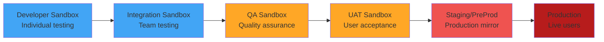
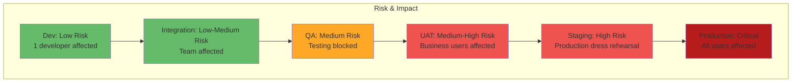
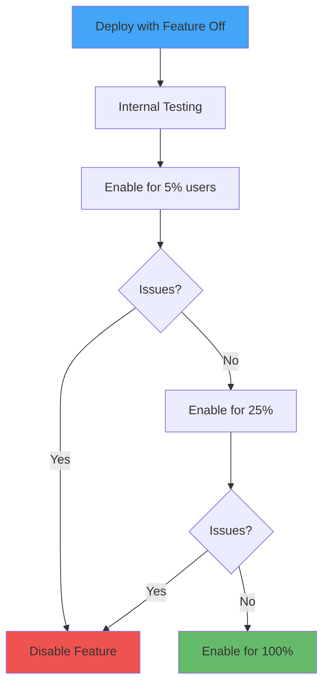
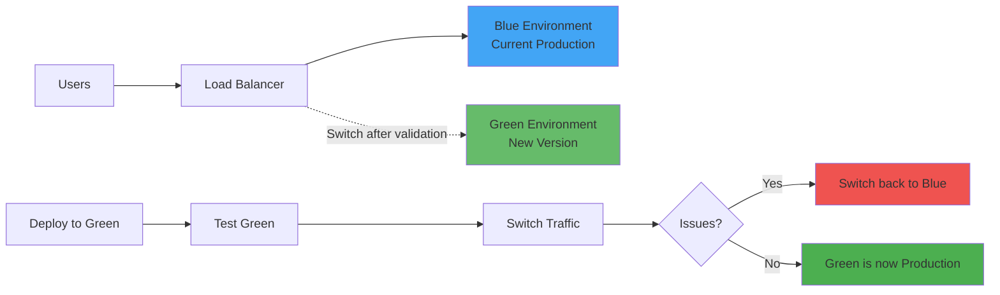
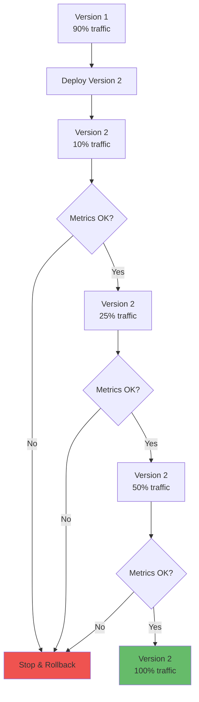

# Deploying to Sandbox Environments

**Learning Objective**: Automate sandbox deployments with safety checks and progressive rollout strategies.

## Overview

Sandbox deployment is where your code meets reality. This guide teaches you how to automate deployments across multiple sandbox environments while minimizing risk and maximizing confidence.

## Sandbox Deployment Strategy

### The Progression Path



### Risk Levels by Environment



## Complete Deployment Workflow

### GitHub Actions - Multi-Environment Pipeline

```yaml
name: Sandbox Deployment Pipeline

on:
  push:
    branches:
      - develop      # Auto-deploy to Dev/Integration
      - qa           # Auto-deploy to QA
      - release/**   # Auto-deploy to UAT
      - main         # Auto-deploy to Staging (requires approval for Prod)

  workflow_dispatch:  # Manual trigger
    inputs:
      environment:
        description: 'Target Environment'
        required: true
        type: choice
        options:
          - dev
          - integration
          - qa
          - uat
          - staging
          - production
      skip_tests:
        description: 'Skip tests (emergency only)'
        required: false
        type: boolean
        default: false

permissions:
  contents: read
  deployments: write
  id-token: write

env:
  SF_CLI_VERSION: latest

jobs:
  # Determine deployment environment based on branch
  determine-environment:
    runs-on: ubuntu-latest
    outputs:
      environment: ${{ steps.env.outputs.environment }}
      test_level: ${{ steps.env.outputs.test_level }}
      requires_approval: ${{ steps.env.outputs.requires_approval }}

    steps:
      - name: Determine Environment from Branch
        id: env
        run: |
          if [ "${{ github.event_name }}" == "workflow_dispatch" ]; then
            # Manual trigger - use input
            ENV="${{ github.event.inputs.environment }}"
          else
            # Auto trigger - determine from branch
            BRANCH="${{ github.ref_name }}"

            case "$BRANCH" in
              develop)
                ENV="dev"
                ;;
              qa)
                ENV="qa"
                ;;
              release/*)
                ENV="uat"
                ;;
              main)
                ENV="staging"
                ;;
              *)
                echo "Unknown branch: $BRANCH"
                exit 1
                ;;
            esac
          fi

          echo "environment=$ENV" >> $GITHUB_OUTPUT

          # Set test level based on environment
          case "$ENV" in
            dev|integration)
              echo "test_level=RunLocalTests" >> $GITHUB_OUTPUT
              echo "requires_approval=false" >> $GITHUB_OUTPUT
              ;;
            qa)
              echo "test_level=RunLocalTests" >> $GITHUB_OUTPUT
              echo "requires_approval=false" >> $GITHUB_OUTPUT
              ;;
            uat|staging)
              echo "test_level=RunLocalTests" >> $GITHUB_OUTPUT
              echo "requires_approval=true" >> $GITHUB_OUTPUT
              ;;
            production)
              echo "test_level=RunLocalTests" >> $GITHUB_OUTPUT
              echo "requires_approval=true" >> $GITHUB_OUTPUT
              ;;
          esac

          echo "### 🎯 Deployment Target" >> $GITHUB_STEP_SUMMARY
          echo "**Environment**: $ENV" >> $GITHUB_STEP_SUMMARY

  # Deploy to determined environment
  deploy:
    runs-on: ubuntu-latest
    needs: determine-environment
    environment:
      name: ${{ needs.determine-environment.outputs.environment }}
      url: ${{ steps.deploy.outputs.org_url }}
    timeout-minutes: 120

    steps:
      - name: Checkout code
        uses: actions/checkout@v4
        with:
          fetch-depth: 0

      - name: Setup Node.js
        uses: actions/setup-node@v4
        with:
          node-version: '20'

      - name: Install Salesforce CLI
        run: |
          npm install -g @salesforce/cli@${SF_CLI_VERSION}
          sf version --verbose

      - name: Authenticate to Salesforce
        run: |
          # Use environment-specific auth URL from secrets
          ENV_NAME="${{ needs.determine-environment.outputs.environment }}"
          AUTH_SECRET="SFDX_AUTH_URL_$(echo $ENV_NAME | tr '[:lower:]' '[:upper:]')"

          echo "${!AUTH_SECRET}" > auth.txt
          sf org login sfdx-url --sfdx-url-file auth.txt --alias target-org --set-default
          rm auth.txt

          # Display org info
          sf org display --target-org target-org --verbose

      - name: Generate Delta Package (Changed Components Only)
        id: delta
        run: |
          # Install sfdx-git-delta
          npm install -g sfdx-git-delta

          # Determine comparison point
          if [ "${{ github.event_name }}" == "push" ]; then
            # Compare with previous commit
            FROM_COMMIT="${{ github.event.before }}"
          else
            # Compare with base branch
            FROM_COMMIT="origin/main"
          fi

          echo "Generating delta from: $FROM_COMMIT"

          # Generate delta package
          sfdx sgd:source:delta \
            --from "$FROM_COMMIT" \
            --to HEAD \
            --output delta \
            --generate-delta \
            --ignore .sgdignore

          # Check if there are changes
          if [ -f delta/package/package.xml ]; then
            echo "has_changes=true" >> $GITHUB_OUTPUT
            echo "### 📦 Delta Package" >> $GITHUB_STEP_SUMMARY
            echo "\`\`\`xml" >> $GITHUB_STEP_SUMMARY
            cat delta/package/package.xml >> $GITHUB_STEP_SUMMARY
            echo "\`\`\`" >> $GITHUB_STEP_SUMMARY
          else
            echo "has_changes=false" >> $GITHUB_OUTPUT
            echo "### ℹ️ No Changes Detected" >> $GITHUB_STEP_SUMMARY
          fi

      - name: Run Pre-Deployment Checks
        if: steps.delta.outputs.has_changes == 'true'
        run: |
          echo "### 🔍 Pre-Deployment Checks" >> $GITHUB_STEP_SUMMARY

          # Check for destructive changes
          if [ -f delta/destructiveChanges/destructiveChanges.xml ]; then
            echo "⚠️ **Destructive changes detected!**" >> $GITHUB_STEP_SUMMARY
            echo "\`\`\`xml" >> $GITHUB_STEP_SUMMARY
            cat delta/destructiveChanges/destructiveChanges.xml >> $GITHUB_STEP_SUMMARY
            echo "\`\`\`" >> $GITHUB_STEP_SUMMARY
          fi

          # Check for permission set changes
          PERMSET_CHANGES=$(grep -r "permissionsets" delta/package/package.xml || echo "none")
          if [ "$PERMSET_CHANGES" != "none" ]; then
            echo "⚠️ **Permission set changes detected**" >> $GITHUB_STEP_SUMMARY
          fi

          # Check for profile changes
          PROFILE_CHANGES=$(grep -r "profiles" delta/package/package.xml || echo "none")
          if [ "$PROFILE_CHANGES" != "none" ]; then
            echo "⚠️ **Profile changes detected**" >> $GITHUB_STEP_SUMMARY
          fi

      - name: Deploy to Salesforce
        id: deploy
        if: steps.delta.outputs.has_changes == 'true'
        run: |
          # Determine test level
          TEST_LEVEL="${{ needs.determine-environment.outputs.test_level }}"

          if [ "${{ github.event.inputs.skip_tests }}" == "true" ]; then
            TEST_LEVEL="NoTestRun"
            echo "⚠️ **Tests skipped per manual override**" >> $GITHUB_STEP_SUMMARY
          fi

          echo "Test Level: $TEST_LEVEL"

          # Deploy
          sf project deploy start \
            --target-org target-org \
            --manifest delta/package/package.xml \
            --test-level "$TEST_LEVEL" \
            --wait 60 \
            --verbose \
            --json > deploy-result.json

          # Extract results
          DEPLOY_ID=$(jq -r '.result.id' deploy-result.json)
          STATUS=$(jq -r '.result.status' deploy-result.json)
          ORG_ID=$(jq -r '.result.deploys[0].id' deploy-result.json || echo "N/A")

          echo "deploy_id=$DEPLOY_ID" >> $GITHUB_OUTPUT
          echo "status=$STATUS" >> $GITHUB_OUTPUT
          echo "org_url=https://$(jq -r '.result.instanceUrl' deploy-result.json)" >> $GITHUB_OUTPUT

          # Summary
          echo "### 🚀 Deployment Results" >> $GITHUB_STEP_SUMMARY
          echo "- **Status**: $STATUS" >> $GITHUB_STEP_SUMMARY
          echo "- **Deployment ID**: $DEPLOY_ID" >> $GITHUB_STEP_SUMMARY
          echo "- **Environment**: ${{ needs.determine-environment.outputs.environment }}" >> $GITHUB_STEP_SUMMARY

          # Check status
          if [ "$STATUS" != "Succeeded" ]; then
            echo "❌ Deployment failed"
            exit 1
          fi

      - name: Deploy Destructive Changes (if any)
        if: steps.delta.outputs.has_changes == 'true'
        run: |
          if [ -f delta/destructiveChanges/destructiveChanges.xml ]; then
            echo "Deploying destructive changes..."

            sf project deploy start \
              --target-org target-org \
              --manifest delta/destructiveChanges/destructiveChanges.xml \
              --post-destructive-changes delta/destructiveChanges/destructiveChanges.xml \
              --ignore-warnings \
              --wait 30

            echo "### 🗑️ Destructive Changes Deployed" >> $GITHUB_STEP_SUMMARY
          fi

      - name: Run Post-Deployment Verification
        if: steps.deploy.outcome == 'success'
        run: |
          echo "### ✅ Post-Deployment Verification" >> $GITHUB_STEP_SUMMARY

          # Check deployment details
          COMPONENTS_DEPLOYED=$(jq -r '.result.numberComponentsDeployed // 0' deploy-result.json)
          COMPONENTS_FAILED=$(jq -r '.result.numberComponentErrors // 0' deploy-result.json)
          TESTS_RAN=$(jq -r '.result.numberTestsTotal // 0' deploy-result.json)
          TESTS_FAILED=$(jq -r '.result.numberTestErrors // 0' deploy-result.json)

          echo "- Components Deployed: $COMPONENTS_DEPLOYED" >> $GITHUB_STEP_SUMMARY
          echo "- Components Failed: $COMPONENTS_FAILED" >> $GITHUB_STEP_SUMMARY
          echo "- Tests Ran: $TESTS_RAN" >> $GITHUB_STEP_SUMMARY
          echo "- Tests Failed: $TESTS_FAILED" >> $GITHUB_STEP_SUMMARY

          if [ "$TESTS_FAILED" -gt 0 ]; then
            echo "❌ Some tests failed!" >> $GITHUB_STEP_SUMMARY
            exit 1
          fi

      - name: Create Deployment Record
        if: steps.deploy.outcome == 'success'
        run: |
          # Create deployment record in org (custom object or external system)
          cat > deployment-record.json << EOF
          {
            "environment": "${{ needs.determine-environment.outputs.environment }}",
            "deploy_id": "${{ steps.deploy.outputs.deploy_id }}",
            "commit_sha": "${{ github.sha }}",
            "branch": "${{ github.ref_name }}",
            "actor": "${{ github.actor }}",
            "timestamp": "$(date -u +%Y-%m-%dT%H:%M:%SZ)",
            "status": "success"
          }
          EOF

          echo "Deployment record created"

      - name: Upload Deployment Artifacts
        if: always()
        uses: actions/upload-artifact@v4
        with:
          name: deployment-${{ needs.determine-environment.outputs.environment }}-${{ github.sha }}
          path: |
            deploy-result.json
            deployment-record.json
            delta/
          retention-days: 90

      - name: Notify on Failure
        if: failure()
        uses: actions/github-script@v7
        with:
          script: |
            const deployResult = require('./deploy-result.json');

            let message = `## ❌ Deployment Failed\n\n`;
            message += `**Environment**: ${{ needs.determine-environment.outputs.environment }}\n`;
            message += `**Branch**: ${{ github.ref_name }}\n`;
            message += `**Commit**: ${{ github.sha }}\n\n`;

            if (deployResult.result.details?.componentFailures) {
              message += `### Component Failures\n`;
              deployResult.result.details.componentFailures.forEach(failure => {
                message += `- **${failure.fullName}**: ${failure.problem}\n`;
              });
            }

            message += `\n[View Workflow Run](${{ github.server_url }}/${{ github.repository }}/actions/runs/${{ github.run_id }})`;

            await github.rest.issues.create({
              owner: context.repo.owner,
              repo: context.repo.repo,
              title: `Deployment Failed: ${{ needs.determine-environment.outputs.environment }}`,
              body: message,
              labels: ['deployment-failure', 'urgent']
            });

  # Post-deployment smoke tests
  smoke-tests:
    runs-on: ubuntu-latest
    needs: [determine-environment, deploy]
    if: needs.deploy.result == 'success'

    steps:
      - name: Checkout code
        uses: actions/checkout@v4

      - name: Setup Node.js
        uses: actions/setup-node@v4
        with:
          node-version: '20'

      - name: Install Salesforce CLI
        run: npm install -g @salesforce/cli

      - name: Authenticate to Salesforce
        run: |
          ENV_NAME="${{ needs.determine-environment.outputs.environment }}"
          AUTH_SECRET="SFDX_AUTH_URL_$(echo $ENV_NAME | tr '[:lower:]' '[:upper:]')"
          echo "${!AUTH_SECRET}" > auth.txt
          sf org login sfdx-url --sfdx-url-file auth.txt --alias target-org
          rm auth.txt

      - name: Run Smoke Tests
        run: |
          echo "### 🔥 Smoke Tests" >> $GITHUB_STEP_SUMMARY

          # Test 1: Org is accessible
          if sf org display --target-org target-org > /dev/null 2>&1; then
            echo "✅ Org accessible" >> $GITHUB_STEP_SUMMARY
          else
            echo "❌ Org not accessible" >> $GITHUB_STEP_SUMMARY
            exit 1
          fi

          # Test 2: Query critical objects
          ACCOUNT_COUNT=$(sf data query --query "SELECT COUNT() FROM Account" --target-org target-org --json | jq -r '.result.totalSize')
          echo "✅ Account query successful ($ACCOUNT_COUNT records)" >> $GITHUB_STEP_SUMMARY

          # Test 3: Run critical Apex test
          if [ -f smoke-tests.txt ]; then
            SMOKE_TESTS=$(cat smoke-tests.txt | tr '\n' ',' | sed 's/,$//')
            sf apex run test \
              --tests "$SMOKE_TESTS" \
              --target-org target-org \
              --result-format human \
              --wait 10

            echo "✅ Smoke tests passed" >> $GITHUB_STEP_SUMMARY
          fi

          # Test 4: Check for errors in debug logs
          # (implementation depends on your logging strategy)

      - name: Deployment Summary
        if: always()
        run: |
          echo "## 🎉 Deployment Complete!" >> $GITHUB_STEP_SUMMARY
          echo "" >> $GITHUB_STEP_SUMMARY
          echo "**Environment**: ${{ needs.determine-environment.outputs.environment }}" >> $GITHUB_STEP_SUMMARY
          echo "**Deployed by**: ${{ github.actor }}" >> $GITHUB_STEP_SUMMARY
          echo "**Commit**: ${{ github.sha }}" >> $GITHUB_STEP_SUMMARY
          echo "**Time**: $(date)" >> $GITHUB_STEP_SUMMARY
```

## Progressive Deployment Strategies

### Strategy 1: Feature Flags

Deploy code dark, enable gradually:



**Implementation**:

```yaml
- name: Deploy with Feature Flags
  run: |
    # Deploy code
    sf project deploy start \
      --target-org target-org \
      --manifest manifest/package.xml

    # Set feature flag to OFF
    sf data create record \
      --sobject Feature_Flag__c \
      --values "Name='NewFeature' IsEnabled__c=false" \
      --target-org target-org
```

### Strategy 2: Blue-Green Deployment

Maintain two identical environments:



### Strategy 3: Canary Deployment

Gradual rollout to subset of users:



## Deployment Safety Checks

### Pre-Deployment Validation

```yaml
- name: Comprehensive Pre-Deployment Checks
  run: |
    echo "### 🛡️ Safety Checks" >> $GITHUB_STEP_SUMMARY

    # 1. Check org limits
    sf limits api display --target-org target-org --json > limits.json

    API_REMAINING=$(jq -r '.result[] | select(.name == "DailyApiRequests") | .remaining' limits.json)
    API_LIMIT=$(jq -r '.result[] | select(.name == "DailyApiRequests") | .max' limits.json)
    API_PERCENT=$((API_REMAINING * 100 / API_LIMIT))

    if [ $API_PERCENT -lt 20 ]; then
      echo "❌ API limit critical: ${API_PERCENT}% remaining" >> $GITHUB_STEP_SUMMARY
      exit 1
    fi

    # 2. Check for active users
    ACTIVE_USERS=$(sf data query \
      --query "SELECT COUNT() FROM ActiveScratchOrg WHERE Status = 'Active'" \
      --target-org target-org \
      --json | jq -r '.result.totalSize')

    if [ "$ACTIVE_USERS" -gt 100 ] && [ "${{ needs.determine-environment.outputs.environment }}" == "production" ]; then
      echo "⚠️ High active user count: $ACTIVE_USERS" >> $GITHUB_STEP_SUMMARY
      echo "Consider deploying during maintenance window" >> $GITHUB_STEP_SUMMARY
    fi

    # 3. Check for ongoing deployments
    ONGOING=$(sf project deploy report --target-org target-org --json 2>/dev/null | jq -r '.result.status' || echo "none")

    if [ "$ONGOING" == "InProgress" ]; then
      echo "❌ Another deployment is in progress" >> $GITHUB_STEP_SUMMARY
      exit 1
    fi

    # 4. Verify backup exists
    if [ "${{ needs.determine-environment.outputs.environment }}" == "production" ]; then
      # Check for recent backup
      # (implementation depends on your backup strategy)
      echo "✅ Backup verified" >> $GITHUB_STEP_SUMMARY
    fi

    echo "✅ All pre-deployment checks passed" >> $GITHUB_STEP_SUMMARY
```

### Post-Deployment Validation

```yaml
- name: Post-Deployment Health Checks
  run: |
    echo "### 🏥 Health Checks" >> $GITHUB_STEP_SUMMARY

    # 1. Check all workflows are active
    PAUSED_WORKFLOWS=$(sf data query \
      --query "SELECT COUNT() FROM WorkflowRule WHERE IsActive = false" \
      --target-org target-org \
      --json | jq -r '.result.totalSize')

    echo "- Paused Workflows: $PAUSED_WORKFLOWS" >> $GITHUB_STEP_SUMMARY

    # 2. Check for batch apex failures
    FAILED_BATCHES=$(sf data query \
      --query "SELECT COUNT() FROM AsyncApexJob WHERE Status = 'Failed' AND CreatedDate = TODAY" \
      --target-org target-org \
      --json | jq -r '.result.totalSize')

    echo "- Failed Batch Jobs (today): $FAILED_BATCHES" >> $GITHUB_STEP_SUMMARY

    if [ "$FAILED_BATCHES" -gt 0 ]; then
      echo "⚠️ Batch job failures detected" >> $GITHUB_STEP_SUMMARY
    fi

    # 3. Check debug log for errors
    # (implementation depends on logging strategy)

    # 4. Verify key integrations
    # (ping external services, check callout logs, etc.)

    echo "✅ Health checks complete" >> $GITHUB_STEP_SUMMARY
```

## Environment-Specific Configuration

### Managing Environment Variables

```yaml
# .github/workflows/deploy.yml
env:
  # Development
  DEV_API_ENDPOINT: https://dev-api.example.com
  DEV_FEATURE_FLAGS: "feature1:on,feature2:off"

  # QA
  QA_API_ENDPOINT: https://qa-api.example.com
  QA_FEATURE_FLAGS: "feature1:on,feature2:on"

  # Production
  PROD_API_ENDPOINT: https://api.example.com
  PROD_FEATURE_FLAGS: "feature1:off,feature2:off"

- name: Configure Environment Variables
  run: |
    ENV="${{ needs.determine-environment.outputs.environment }}"

    # Set environment-specific configuration
    case "$ENV" in
      dev)
        API_ENDPOINT="$DEV_API_ENDPOINT"
        FEATURE_FLAGS="$DEV_FEATURE_FLAGS"
        ;;
      qa)
        API_ENDPOINT="$QA_API_ENDPOINT"
        FEATURE_FLAGS="$QA_FEATURE_FLAGS"
        ;;
      production)
        API_ENDPOINT="$PROD_API_ENDPOINT"
        FEATURE_FLAGS="$PROD_FEATURE_FLAGS"
        ;;
    esac

    # Deploy custom metadata with environment values
    cat > config/CustomMetadata.json << EOF
    {
      "ApiEndpoint__mdt.Default": {
        "Endpoint__c": "$API_ENDPOINT"
      }
    }
    EOF

    # Deploy configuration
    sf project deploy start \
      --target-org target-org \
      --metadata-dir config/
```

## Handling Large Deployments

### Chunking Strategy

```yaml
- name: Deploy in Chunks
  run: |
    # Split package.xml into chunks
    python3 << 'EOF'
    import xml.etree.ElementTree as ET
    import os

    tree = ET.parse('manifest/package.xml')
    root = tree.getroot()

    chunk_size = 100
    chunks = []
    current_chunk = []

    for types in root.findall('.//{http://soap.sforce.com/2006/04/metadata}types'):
        current_chunk.append(types)
        if len(current_chunk) >= chunk_size:
            chunks.append(current_chunk)
            current_chunk = []

    if current_chunk:
        chunks.append(current_chunk)

    # Save chunks
    for i, chunk in enumerate(chunks):
        chunk_root = ET.Element('Package')
        chunk_root.set('xmlns', 'http://soap.sforce.com/2006/04/metadata')
        for types in chunk:
            chunk_root.append(types)

        version = ET.SubElement(chunk_root, 'version')
        version.text = '59.0'

        tree = ET.ElementTree(chunk_root)
        tree.write(f'chunk_{i}.xml')

    print(f'Created {len(chunks)} chunks')
    EOF

    # Deploy each chunk
    for chunk in chunk_*.xml; do
      echo "Deploying $chunk..."
      sf project deploy start \
        --target-org target-org \
        --manifest "$chunk" \
        --wait 30 || {
          echo "Failed to deploy $chunk"
          exit 1
        }
    done
```

## Deployment Windows

### Maintenance Window Enforcement

```yaml
- name: Check Deployment Window
  run: |
    # Define maintenance windows (UTC)
    # Production deploys: Saturdays 02:00-06:00 UTC
    # Or with approved change request

    ENV="${{ needs.determine-environment.outputs.environment }}"

    if [ "$ENV" == "production" ]; then
      DAY_OF_WEEK=$(date -u +%u)  # 1 = Monday, 7 = Sunday
      HOUR=$(date -u +%H)

      # Check if Saturday (6) between 02:00 and 06:00
      if [ "$DAY_OF_WEEK" == "6" ] && [ "$HOUR" -ge 2 ] && [ "$HOUR" -lt 6 ]; then
        echo "✅ Within maintenance window"
      else
        # Check for approved override
        if [ "${{ github.event.inputs.emergency_override }}" == "true" ]; then
          echo "⚠️ Emergency override enabled"
          echo "Deployment outside maintenance window approved by: ${{ github.actor }}"
        else
          echo "❌ Outside maintenance window"
          echo "Production deploys allowed: Saturdays 02:00-06:00 UTC"
          echo "Current time: $(date -u)"
          exit 1
        fi
      fi
    fi
```

## Best Practices

### 1. Always Use Delta Deployments

```yaml
# ✅ GOOD: Only deploy changes
sfdx sgd:source:delta --to HEAD --from origin/main --output delta
sf project deploy start --manifest delta/package/package.xml

# ❌ BAD: Deploy everything
sf project deploy start --manifest manifest/package.xml
```

### 2. Separate Deployment from Activation

```yaml
# Deploy code with feature disabled
sf project deploy start --manifest package.xml

# Activate feature later via custom metadata
sf data update record --sobject Feature__mdt --where "DeveloperName='NewFeature'" --values "Active__c=true"
```

### 3. Use Quick Deploy for Validated Deployments

```yaml
# Step 1: Validate (in PR)
sf project deploy validate --manifest package.xml --test-level RunLocalTests
# Returns validation ID: 0Af...

# Step 2: Quick deploy (in deployment)
sf project deploy quick --job-id 0Af... --target-org production
# No re-running tests!
```

### 4. Monitor Deployments

```yaml
- name: Monitor Deployment
  run: |
    DEPLOY_ID="${{ steps.deploy.outputs.deploy_id }}"

    while true; do
      STATUS=$(sf project deploy report --job-id "$DEPLOY_ID" --json | jq -r '.result.status')

      echo "Status: $STATUS"

      case "$STATUS" in
        Succeeded|Failed|Canceled)
          break
          ;;
        *)
          sleep 30
          ;;
      esac
    done
```

### 5. Create Deployment Checklist

```yaml
- name: Pre-Deployment Checklist
  run: |
    cat > checklist.md << 'EOF'
    # Deployment Checklist

    - [ ] All tests passing
    - [ ] Code reviewed and approved
    - [ ] Change request approved (production only)
    - [ ] Stakeholders notified
    - [ ] Rollback plan prepared
    - [ ] Backup verified
    - [ ] Deployment window confirmed
    - [ ] Post-deployment tests ready

    EOF

    cat checklist.md >> $GITHUB_STEP_SUMMARY
```

## Troubleshooting

### Issue: Deployment Times Out

**Solution**: Increase wait time or use asynchronous deploy

```yaml
# Option 1: Increase timeout
sf project deploy start --wait 120

# Option 2: Async deploy
DEPLOY_ID=$(sf project deploy start --async --json | jq -r '.result.id')

# Check status later
sf project deploy report --job-id "$DEPLOY_ID"
```

### Issue: Component Conflicts

**Solution**: Deploy in specific order

```yaml
# Deploy profiles last
sf project deploy start --metadata-dir force-app/main/default/classes
sf project deploy start --metadata-dir force-app/main/default/triggers
sf project deploy start --metadata-dir force-app/main/default/profiles
```

### Issue: Test Failures Only in Target Org

**Solution**: Refresh sandbox or check org-specific data

```yaml
- name: Diagnose Test Failures
  run: |
    # Check for org-specific issues
    sf data query --query "SELECT Id, Name FROM User WHERE IsActive = false LIMIT 10" --target-org target-org

    # Compare org metadata
    sf project retrieve start --target-org target-org --manifest manifest/package.xml --target-metadata-dir org-metadata

    # Diff against source
    diff -r force-app org-metadata
```

## Interview Talking Points

1. **"We use delta deployments to only deploy what changed"**
   - Shows efficiency
   - Reduces deployment time and risk

2. **"We enforce deployment windows for production"**
   - Shows operational discipline
   - Demonstrates risk management

3. **"We run smoke tests after every deployment"**
   - Shows attention to quality
   - Proactive issue detection

4. **"We use quick deploy to avoid re-running tests"**
   - Shows Salesforce expertise
   - Demonstrates optimization

5. **"We deploy with feature flags to separate deployment from activation"**
   - Shows advanced deployment strategies
   - Risk mitigation

## Next Steps

- **Next Guide**: [Rollback Strategies](./rollback-strategies) - Plan for when deployments go wrong
- **Related**: [Running Apex Tests in Pipelines](./running-tests) - Comprehensive testing guide
- **Related**: [Pipeline Notifications](./notifications) - Stay informed about deployments

---

**Key Takeaway**: Successful sandbox deployment is about more than just pushing code. It's about progressive rollout, comprehensive validation, and having the confidence to deploy frequently without fear.
