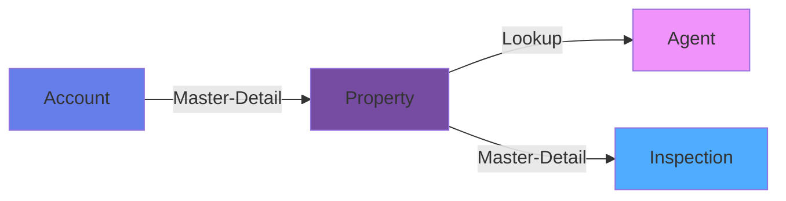

# Objects and Fields: Building Your Data Model

The data model is the foundation of every Salesforce application. Understanding objects and fields is critical for building scalable, maintainable solutions.

## 🎯 Learning Objectives

By the end of this lesson, you'll be able to:
- Create custom objects and fields
- Choose appropriate field types
- Design efficient data models
- Implement best practices for object design
- Understand field dependencies and validation

## 📦 What Are Objects?

Think of objects as **database tables** that store specific types of information.

### Standard Objects vs. Custom Objects

```
Standard Objects (Built by Salesforce):
├── Account
├── Contact
├── Lead
├── Opportunity
├── Case
└── 100+ more

Custom Objects (Built by you):
└── Property__c
    ├── Project__c
    ├── Inspection__c
    └── MaintenanceRequest__c
```

**Naming Conventions:**
- Standard: `Account`, `Contact`
- Custom: `Property__c` (always ends with `__c`)
- Custom object API name: `Property__c`
- Plural label: `Properties`

## 🔨 Creating Your First Custom Object

### Hands-On: Create a Real Estate Object

Let's build a simple real estate management app.

**Step 1: Navigate to Object Manager**
1. Click **Setup** (gear icon)
2. Quick Find → "Object Manager"
3. Click **Create** → **Custom Object**

**Step 2: Fill in Details**

| Field | Value | Purpose |
|-------|-------|---------|
| **Label** | Property | What users see |
| **Plural Label** | Properties | Tab/menu name |
| **Object Name** | Property | API name (becomes `Property__c`) |
| **Record Name** | Property Name | What to call the record identifier |
| **Data Type** | Text | For now, keep it simple |

**Step 3: Check Optional Features**
- ✅ Allow Reports
- ✅ Allow Activities
- ✅ Track Field History
- ✅ Allow Search
- ✅ Enable Bulk API
- ✅ Enable Streaming API

**Step 4: Click Save**

Congratulations! You've created your first custom object: `Property__c`

## 📝 Field Types Deep Dive

Salesforce provides many field types. Let's explore the most common ones.

### 1. Text Fields

```
Text Field Types:
├── Text (up to 255 characters)
├── Text Area (up to 4,096 characters)
├── Text Area (Long) (up to 131,072 characters)
├── Text Area (Rich) (formatted text with images)
└── Email (validates email format)
```

**Use Cases:**
- **Text**: Name, Address Line 1, Status Code
- **Text Area**: Description, Notes
- **Text Area (Long)**: Full contract text, detailed requirements
- **Text Area (Rich)**: Marketing content, formatted instructions
- **Email**: Contact email, support email

**Example: Add Address Field**
1. Object Manager → Property → Fields & Relationships
2. New Field → Text
3. Length: 255
4. Field Label: "Street Address"
5. Field Name: `Street_Address` (becomes `Street_Address__c`)

### 2. Number Fields

```apex
Number Field Types:
├── Number (decimal support, up to 18 digits)
├── Currency (currency with 2 decimal places)
└── Percent (stored as decimal, displayed as percentage)
```

**Use Cases:**
- **Number**: Square footage, quantity, years
- **Currency**: Price, budget, revenue
- **Percent**: Commission rate, discount percentage

**Example: Add Price Field**
```
Field Type: Currency
Field Label: Listing Price
Field Name: Listing_Price
Length: 16
Decimal Places: 2
Default Value: 0
```

**Formula Example:**
```apex
// Price per square foot formula
Listing_Price__c / Square_Footage__c
```

### 3. Date and Time Fields

```
DateTime Field Types:
├── Date (just date, no time)
├── Date/Time (date and time)
└── Time (just time, no date)
```

**Use Cases:**
- **Date**: Birthdate, hire date, listing date
- **Date/Time**: Last modified, meeting timestamp, transaction time
- **Time**: Business hours start/end

**Example: Add Listing Date**
```
Field Type: Date
Field Label: Listed Date
Field Name: Listed_Date
Default: Today's date
```

### 4. Picklist Fields

Dropdowns with predefined values:

```
Picklist Types:
├── Picklist (single select)
├── Multi-Select Picklist (multiple selections)
└── Global Picklist (reusable across objects)
```

**Example: Add Property Status**
```
Field Type: Picklist
Field Label: Status
Field Name: Status

Values:
- Available
- Under Contract
- Sold
- Off Market

Default: Available
```

**Best Practices:**
- ✅ Use picklists instead of text when values are limited
- ✅ Keep list manageable (under 100 values)
- ✅ Use Global Picklist for values shared across objects
- ❌ Don't use for values that change frequently
- ❌ Don't use Multi-Select if you need to report/filter easily

### 5. Checkbox (Boolean)

True/False values:

```apex
Checkbox Field:
├── Checked = True
└── Unchecked = False
```

**Example: Add Featured Property Flag**
```
Field Type: Checkbox
Field Label: Featured Property
Field Name: Featured_Property
Default: Unchecked
```

**Common Uses:**
- Active/Inactive flags
- Yes/No indicators
- Feature toggles
- Status indicators

### 6. Relationship Fields

Connect objects together:



#### Lookup Relationship

**Characteristics:**
- Loose coupling
- Child can exist without parent
- No cascade delete
- Child has own sharing settings

**Example: Agent Lookup on Property**
```
Field Type: Lookup Relationship
Field Label: Listing Agent
Field Name: Listing_Agent
Related To: Contact
Child Relationship Name: Properties
```

#### Master-Detail Relationship

**Characteristics:**
- Tight coupling
- Child cannot exist without parent
- Cascade delete (delete parent → deletes children)
- Child inherits sharing from parent
- Roll-up summary fields allowed

**Example: Property as Master to Inspection**
```
Field Type: Master-Detail Relationship
Field Label: Property
Field Name: Property
Related To: Property__c
```

**When to Use Which?**

| Use Lookup When | Use Master-Detail When |
|----------------|------------------------|
| Records can exist independently | Child is meaningless without parent |
| Need different ownership | Want to inherit security |
| Flexible deletion | Want cascade delete |
| Example: Account ← Agent | Example: Property → Inspections |

### 7. Formula Fields

Calculated fields based on other fields:

```apex
// Formula field examples
Formula Type: Text
CASE(Status__c,
    'Available', '🟢 Available',
    'Under Contract', '🟡 Pending',
    'Sold', '🔴 Sold',
    '⚪ Unknown'
)

Formula Type: Number
// Days on market
TODAY() - Listed_Date__c

Formula Type: Currency
// Total commission (6% of listing price)
Listing_Price__c * 0.06

Formula Type: Checkbox
// Is it a high-value property?
Listing_Price__c > 1000000
```

**Formula Functions:**
- `TODAY()` - Current date
- `NOW()` - Current date/time
- `TEXT(field)` - Convert to text
- `CASE()` - Switch statement
- `IF()` - Conditional logic
- `AND()`, `OR()`, `NOT()` - Boolean logic

### 8. Roll-Up Summary Fields

Aggregate child records (only on master-detail):

```apex
// Examples of roll-up summary fields

// COUNT: Number of inspections
COUNT of Inspection__c records where Property__c = this record

// SUM: Total repair costs from all inspections
SUM of Inspection__c.Repair_Cost__c where Property__c = this record

// MIN/MAX: Earliest inspection date
MIN of Inspection__c.Inspection_Date__c where Property__c = this record
```

**Supported Operations:**
- COUNT - Count child records
- SUM - Add up number/currency fields
- MIN - Minimum value
- MAX - Maximum value

**Use Cases:**
- Total opportunity amount on Account
- Number of cases on Account
- Latest activity date
- Total invoice amount

### 9. Auto-Number Fields

Auto-incrementing unique identifiers:

```
Auto-Number Field:
Display Format: PROP-{0000}
Starting Number: 1

Generated Values:
├── PROP-0001
├── PROP-0002
├── PROP-0003
└── PROP-0004
```

**Use Cases:**
- Invoice numbers
- Case numbers
- Reference IDs
- Serial numbers

## 🏗️ Designing Your Data Model

### Best Practices

#### 1. Naming Conventions

```apex
✅ GOOD:
Property_Address__c
Listing_Price__c
Square_Footage__c
Date_Listed__c

❌ BAD:
addr__c (too abbreviated)
Price1__c (unclear)
sqft__c (not descriptive)
dt__c (cryptic)
```

**Rules:**
- Use full words, not abbreviations
- Use underscores for multi-word names
- Be descriptive and consistent
- Keep it under 40 characters if possible

#### 2. Field Help Text

Always add help text:

```apex
Field: Commission_Rate__c
Help Text: "The commission percentage for this property.
            Default is 6%. Enter as whole number (e.g., 6 for 6%)."
```

#### 3. Field Dependencies

Make picklists dependent on other fields:

```
Property_Type__c (Controlling Field):
├── Residential
├── Commercial
└── Industrial

Property_Subtype__c (Dependent Field):
└── If Residential:
    ├── Single Family
    ├── Condo
    └── Townhouse
└── If Commercial:
    ├── Office
    ├── Retail
    └── Warehouse
```

**Setup:**
1. Create both picklist fields
2. Field Dependencies → New
3. Select controlling (Property_Type) and dependent (Property_Subtype)
4. Map values

### 4. Required Fields

Use validation rules, not required checkboxes:

```apex
❌ Don't just mark field as required

✅ Use validation rule with custom error:
AND(
    ISPICKVAL(Status__c, 'Sold'),
    ISBLANK(Sale_Date__c)
)

Error Message: "Sale Date is required when Status is 'Sold'"
```

## 💡 Hands-On Exercise: Build a Real Estate Data Model

Let's build a complete data model for a real estate application.

### Step 1: Create Custom Objects

Create these objects:

```
1. Property__c
   - Label: Property
   - Record Name: Property Name (Text)

2. Inspection__c
   - Label: Inspection
   - Record Name: Inspection Number (Auto-Number)
   - Format: INS-{0000}

3. Showing__c
   - Label: Showing
   - Record Name: Showing Number (Auto-Number)
   - Format: SH-{0000}
```

### Step 2: Add Fields to Property__c

```apex
// Address Information
Street_Address__c (Text, 255)
City__c (Text, 100)
State__c (Picklist: CA, TX, FL, NY, etc.)
Zip_Code__c (Text, 10)

// Property Details
Property_Type__c (Picklist: Residential, Commercial, Industrial)
Bedrooms__c (Number, 0 decimals)
Bathrooms__c (Number, 1 decimal)
Square_Footage__c (Number, 0 decimals)
Lot_Size__c (Number, 2 decimals)

// Listing Information
Listing_Price__c (Currency)
Status__c (Picklist: Available, Under Contract, Sold, Off Market)
Listed_Date__c (Date)
Sold_Date__c (Date)

// Agent Information
Listing_Agent__c (Lookup to Contact)
Buyer_Agent__c (Lookup to Contact)

// Calculated Fields
Days_On_Market__c (Formula: Number)
Formula: IF(ISPICKVAL(Status__c, 'Sold'),
             Sold_Date__c - Listed_Date__c,
             TODAY() - Listed_Date__c)

Price_Per_Square_Foot__c (Formula: Currency)
Formula: Listing_Price__c / Square_Footage__c

// Flags
Featured__c (Checkbox)
Has_Pool__c (Checkbox)
Has_Garage__c (Checkbox)
```

### Step 3: Add Fields to Inspection__c

```apex
// Relationship
Property__c (Master-Detail to Property__c)

// Inspection Details
Inspection_Date__c (Date)
Inspector_Name__c (Text, 100)
Inspection_Type__c (Picklist: Pre-Listing, Buyer, Annual)
Status__c (Picklist: Scheduled, In Progress, Completed)

// Results
Overall_Condition__c (Picklist: Excellent, Good, Fair, Poor)
Issues_Found__c (Text Area Long)
Repair_Cost__c (Currency)
Passed__c (Checkbox)
```

### Step 4: Add Roll-Up Summary to Property__c

```apex
Total_Inspections__c (Roll-Up Summary)
├── Summarized Object: Inspection__c
├── Roll-Up Type: COUNT
└── Field to Aggregate: All records

Total_Repair_Costs__c (Roll-Up Summary)
├── Summarized Object: Inspection__c
├── Roll-Up Type: SUM
└── Field to Aggregate: Repair_Cost__c
```

### Step 5: Create Test Records

Create a test property with data:

```apex
Property Record:
├── Property Name: Sunset Villa
├── Street Address: 123 Ocean Drive
├── City: San Francisco
├── State: CA
├── Zip Code: 94102
├── Property Type: Residential
├── Bedrooms: 4
├── Bathrooms: 3.5
├── Square Footage: 2500
├── Listing Price: $1,200,000
├── Status: Available
├── Listed Date: (Today's date)
└── Featured: ✓

Then create 2-3 Inspection records:
├── Inspection 1:
│   ├── Inspection Date: (Last week)
│   ├── Inspection Type: Pre-Listing
│   ├── Overall Condition: Good
│   ├── Repair Cost: $5,000
│   └── Passed: ✓
└── Inspection 2:
    ├── Inspection Date: (Yesterday)
    ├── Inspection Type: Buyer
    ├── Overall Condition: Excellent
    ├── Repair Cost: $500
    └── Passed: ✓
```

Verify roll-up summaries work:
- Total_Inspections__c should show: 2
- Total_Repair_Costs__c should show: $5,500

## 🎯 Common Data Model Patterns

### Pattern 1: Account-Centric Model

```
Account (Company)
├── Contacts (People)
├── Opportunities (Deals)
├── Cases (Support)
└── Custom Objects (Your app data)
```

Use when: B2B business, company-focused

### Pattern 2: Contact-Centric Model

```
Contact (Person)
├── Accounts (optional)
└── Custom Objects (Your app data)
```

Use when: B2C business, individual-focused

### Pattern 3: Junction Object (Many-to-Many)

```
Property__c ←→ Property_Agent__c ←→ Contact
(Property)     (Junction Object)      (Agent)
```

**When:** Property can have multiple agents, agents can have multiple properties

**How to Create:**
```apex
Property_Agent__c:
├── Property__c (Master-Detail)
├── Agent__c (Master-Detail to Contact)
├── Role__c (Picklist: Listing Agent, Buyer Agent, Co-Agent)
└── Commission_Split__c (Percent)
```

## 🚨 Common Mistakes to Avoid

### 1. Too Many Fields on One Object

```
❌ Don't create a "God Object":
Property__c with 200+ fields

✅ Split into logical objects:
Property__c (core data)
├── Property_Details__c (extended attributes)
├── Property_Marketing__c (marketing info)
└── Property_Financials__c (financial data)
```

### 2. Using Text Instead of Picklists

```
❌ Don't use Text for limited values:
Status__c (Text) - users can type anything

✅ Use Picklist:
Status__c (Picklist) - controlled values
```

### 3. Not Planning for Scale

```
❌ Creating new objects for each category:
Residential_Property__c
Commercial_Property__c
Industrial_Property__c

✅ One object with type field:
Property__c
└── Type__c (Picklist: Residential, Commercial, Industrial)
```

### 4. Overusing Formula Fields

```
❌ Formula fields:
- Can't be indexed
- Slow down queries
- Can't be used in certain contexts

✅ Use formulas for:
- Display-only calculations
- Simple logic
- Not for frequently queried fields
```

## 📚 Interview Questions

**Q: Difference between Lookup and Master-Detail?**
A:
- **Lookup**: Loose coupling, child can exist without parent, separate ownership, no roll-up summaries
- **Master-Detail**: Tight coupling, child needs parent, cascade delete, inherits security, allows roll-up summaries
- **Limit**: Max 2 master-detail relationships per object

**Q: What happens when you delete a parent in Master-Detail?**
A: All child records are automatically deleted (cascade delete). This cannot be prevented. In Lookup relationships, you can optionally prevent deletion if child records exist.

**Q: Can you have a roll-up summary on a Lookup relationship?**
A: No, roll-up summary fields only work with Master-Detail relationships. If you need aggregation with Lookups, use Apex triggers or Flow.

**Q: How many objects can you create in Salesforce?**
A: Varies by edition:
- Professional: 200 custom objects
- Enterprise: 2,000 custom objects
- Unlimited: 2,000 custom objects
- Developer Org: 400 custom objects

**Q: What's the difference between Formula and Roll-Up Summary?**
A:
- **Formula**: Calculated at runtime, based on fields in same record
- **Roll-Up Summary**: Aggregates data from child records, only works with Master-Detail, recalculated when child changes

## 🚀 Next Steps

Excellent work! You've mastered objects and fields. Next, learn about validation rules and automation:

**[→ Next: Declarative Development](/docs/salesforce/declarative/introduction)**

More topics coming soon:
- Advanced Data Modeling
- Schema Design Patterns
- Data Security Model

---

**You now have a solid foundation in Salesforce data modeling!** Practice by building your own data models for different use cases. 🎓
