# Flow Builder: Visual Automation

Flow Builder is Salesforce's most powerful declarative automation tool. Build complex processes, automate tasks, and guide users through screens—all without code.

## 🎯 What You'll Learn

- Understand Flow types and use cases
- Build record-triggered flows
- Create screen flows for user interaction
- Use decision logic and loops
- Test and debug flows
- Best practices and design patterns

## 📊 What is Flow?

**Flow** is a visual automation tool that lets you:
- Automate business processes
- Guide users through screens
- Create, update, and delete records
- Call Apex code
- Send emails and post to Chatter
- Integrate with external systems

### Flow vs. Other Automation Tools

| Tool | Best For | Limitations |
|------|----------|-------------|
| **Flow** | Complex automation, screens, loops, decisions | Steep learning curve |
| **Process Builder** | Simple record automation | Being deprecated |
| **Workflow Rules** | Field updates | Being deprecated, limited |
| **Validation Rules** | Data quality at save | Only prevents save |
| **Apex Triggers** | Complex logic, bulk operations | Requires coding |

**Recommendation:** Use Flow for all new automation. Salesforce is deprecating Process Builder and Workflow Rules.

## 🔧 Flow Types

### 1. Record-Triggered Flow

Runs automatically when records are created, updated, or deleted.

**Use Cases:**
- Update related records
- Send notifications
- Create default records
- Complex field updates

**Triggers:**
- Before Save (fast field updates)
- After Save (can create/update other records)

### 2. Screen Flow

Interactive flows with user input screens.

**Use Cases:**
- Guided wizards
- Data collection forms
- Multi-step processes
- Custom UI experiences

**Entry Points:**
- Quick Actions
- Lightning pages
- Experience Builder sites

### 3. Schedule-Triggered Flow

Runs on a schedule (daily, weekly, etc.).

**Use Cases:**
- Batch updates
- Periodic clean-up
- Scheduled reports
- Reminder emails

### 4. Autolaunched Flow

No user interaction, called by other automation or code.

**Use Cases:**
- Reusable subflows
- Called from Apex
- Called from other flows
- Platform events

### 5. Platform Event-Triggered Flow

Responds to platform events.

**Use Cases:**
- Integration scenarios
- Event-driven architecture
- Real-time updates

```mermaid
flowchart TD
    Start[Flow Execution Triggers] --> Types{Flow Type}

    Types -->|Record Change| RecordTrig[Record-Triggered Flow]
    Types -->|User Action| Screen[Screen Flow]
    Types -->|Time Based| Schedule[Schedule-Triggered Flow]
    Types -->|No UI| AutoLaunch[Autolaunched Flow]
    Types -->|Event| PlatformEvent[Platform Event Flow]

    RecordTrig --> RecordTime{Timing}
    RecordTime -->|Before Save| BeforeSave[Before-Save<br/>Fast Field Updates<br/>Same Transaction]
    RecordTime -->|After Save| AfterSave[After-Save<br/>Can Create/Update Other Records<br/>Async Capable]

    BeforeSave --> RecordExec[Execute Flow Elements:<br/>• Get Records<br/>• Decisions<br/>• Assignments<br/>• Update triggering record]
    AfterSave --> RecordExec2[Execute Flow Elements:<br/>• Get Records<br/>• Create Records<br/>• Update Records<br/>• Send Email<br/>• Call Apex]

    Screen --> UserInput[Display Screen<br/>Collect User Input]
    UserInput --> ScreenLogic[Process Input:<br/>• Decisions<br/>• Get Records<br/>• Create/Update Records<br/>• Show next screen]
    ScreenLogic --> UserInput2{More Screens?}
    UserInput2 -->|Yes| UserInput
    UserInput2 -->|No| Complete

    Schedule --> ScheduleExec[Scheduled Execution<br/>Daily/Weekly/Monthly]
    ScheduleExec --> BatchProcess[Batch Processing:<br/>• Get Records with criteria<br/>• Loop through records<br/>• Update/Create records]

    AutoLaunch --> Caller{Called By}
    Caller -->|Process Builder| PB[Legacy Process Builder]
    Caller -->|Another Flow| SubFlow[Subflow Pattern]
    Caller -->|Apex Code| ApexCall[Apex Invocation]
    Caller -->|REST API| API[External System]

    PB --> AutoExec[Execute Without UI:<br/>• Business logic<br/>• Record operations<br/>• Reusable components]
    SubFlow --> AutoExec
    ApexCall --> AutoExec
    API --> AutoExec

    PlatformEvent --> EventListen[Listen for Events]
    EventListen --> EventReceive[Event Received]
    EventReceive --> EventProcess[Process Event Data:<br/>• Create/Update Records<br/>• Notify Users<br/>• Trigger Other Automation]

    RecordExec --> Complete[Flow Complete]
    RecordExec2 --> Complete
    ScreenLogic --> Complete
    BatchProcess --> Complete
    AutoExec --> Complete
    EventProcess --> Complete

    style Start fill:#e3f2fd,stroke:#1976d2,stroke-width:2px
    style Types fill:#fff3e0,stroke:#f57c00,stroke-width:2px
    style RecordTrig fill:#f3e5f5,stroke:#7b1fa2,stroke-width:2px
    style Screen fill:#e8f5e9,stroke:#388e3c,stroke-width:2px
    style Schedule fill:#fce4ec,stroke:#c2185b,stroke-width:2px
    style AutoLaunch fill:#e0f2f1,stroke:#00796b,stroke-width:2px
    style PlatformEvent fill:#fff9c4,stroke:#f57c00,stroke-width:2px
    style BeforeSave fill:#e1bee7,stroke:#7b1fa2,stroke-width:1px
    style AfterSave fill:#ce93d8,stroke:#7b1fa2,stroke-width:1px
    style Complete fill:#c8e6c9,stroke:#2e7d32,stroke-width:2px
```



**Flow Type Decision Guide:**

| If You Need... | Use This Flow Type | Launch From |
|----------------|-------------------|-------------|
| Auto-update fields on save | Record-Triggered (Before) | Automatic |
| Create related records | Record-Triggered (After) | Automatic |
| Guided user wizard | Screen Flow | Quick Action, Page |
| Nightly batch job | Schedule-Triggered | Time-based |
| Reusable logic | Autolaunched | Called by other flows/Apex |
| React to external events | Platform Event | Event subscription |

## 🏗️ Building Your First Flow

Let's create a record-triggered flow!

### Example: Auto-Calculate Commission When Property Sells

**Business Requirement:**
"When a property status changes to 'Sold', automatically calculate the commission amount (6% of sold price)."

**Step 1: Create New Flow**

1. Setup → Flows → New Flow
2. Select **Record-Triggered Flow**
3. Click **Create**

**Step 2: Configure Trigger**

```
Object: Property__c
Trigger: When a record is updated
Entry Conditions: Status = 'Sold'
Optimize for: Actions and Related Records
```

**Step 3: Add Decision Element**

Check if commission hasn't been calculated yet:

```
Decision Element: Check Commission Not Set
Outcome: Commission Blank
  Condition: {!$Record.Commission_Amount__c} Is Null = True
```

**Step 4: Add Assignment Element**

Calculate commission:

```
Assignment: Calculate Commission
Variable: {!$Record.Commission_Amount__c}
Operator: Equals
Value: {!$Record.Sold_Price__c} * 0.06
```

**Step 5: Add Update Records Element**

```
Update Records: Save Property
Record: {!$Record}
```

**Step 6: Save and Activate**

```
Flow Label: Auto Calculate Commission
API Name: Auto_Calculate_Commission
Description: Calculates 6% commission when property is sold
```

## 🎨 Flow Elements Overview

### Logic Elements

**1. Decision**
```
Branch based on conditions
├── Outcome 1: If Amount > 1000000
├── Outcome 2: If Amount > 500000
└── Default Outcome: Everything else
```

**2. Loop**
```
Iterate through a collection
For each Contact in {!ContactList}
  └── Do something with {!CurrentContact}
```

**3. Assignment**
```
Set variable values
{!TotalCount} = {!TotalCount} + 1
{!PropertyName} = {!$Record.Name}
```

### Interaction Elements

**4. Screen**
```
Display UI to users
├── Text Display
├── Input Fields
├── Radio Buttons
└── Next/Previous Buttons
```

**5. Action**
```
Call standard or custom actions
├── Send Email
├── Post to Chatter
├── Submit for Approval
└── Call Apex
```

### Data Elements

**6. Get Records**
```
Query Salesforce records
Find: All Property records
Where: Status = 'Available'
Order By: Created Date
```

**7. Create Records**
```
Insert new records
Object: Task
Fields:
  - Subject = "Follow up"
  - Related To = {!$Record.Id}
```

**8. Update Records**
```
Modify existing records
Records: {!$Record}
Fields to Update:
  - Status__c = "Completed"
```

**9. Delete Records**
```
Remove records
Records to Delete: {!RecordToDelete}
```

## 💡 Real-World Flow Examples

### Example 1: Property Inspection Flow (Screen Flow)

**User Story:** Agents need a guided process to schedule property inspections.

**Flow Structure:**
```
Screen 1: Select Property
  └── Lookup: Which property?

Screen 2: Inspection Details
  ├── Date: When?
  ├── Picklist: Type? (Pre-Listing, Buyer, Annual)
  └── Text: Inspector Name

Screen 3: Review
  └── Display all entered information

Create Inspection Record
  └── Link to Property

Send Email to Agent
  └── "Inspection scheduled for {!InspectionDate}"

Screen 4: Confirmation
  └── "Inspection scheduled successfully!"
```

### Example 2: Overdue Task Reminder (Scheduled Flow)

**Business Need:** Email agents daily about overdue tasks.

**Flow Structure:**
```
Schedule: Daily at 9 AM

Get Records: Overdue Tasks
  └── Where: Due Date < TODAY() AND Status != 'Completed'

Loop: For Each Task
  ├── Get Task Owner Email
  ├── Send Email Alert
  └── Create Activity History
```

### Example 3: Bulk Status Update (Record-Triggered)

**Business Need:** When an Account is marked inactive, mark all related Properties as "Off Market".

**Flow Structure:**
```
Trigger: Account Updated
Condition: Active = False (was True)

Get Records: Active Properties
  └── Where: Account = {!$Record.Id} AND Status != 'Off Market'

Loop: Each Property
  └── Update: Status = 'Off Market'
```

### Example 4: Approval Process Flow

**Business Need:** Featured properties require manager approval.

**Flow Structure:**
```
Trigger: Property Updated
Condition: Featured = True (was False)

Decision: Check Price
  ├── If Price > $1M
  │   └── Submit for Approval (Senior Manager)
  └── If Price > $500K
      └── Submit for Approval (Manager)

Post to Chatter
  └── "{!$Record.Name} submitted for featured approval"
```

## 🧪 Variables and Resources

### System Variables

```
{!$Record} - The triggering record
{!$Record.Id} - Record ID
{!$Record.Name} - Record Name
{!$Record.Account__r.Name} - Related record field

{!$User.Id} - Current user ID
{!$User.Email} - Current user email

{!$Flow.CurrentDateTime} - Current timestamp
{!$Flow.FaultMessage} - Error message if flow fails
```

### Creating Custom Variables

```
Variable Name: TotalCommission
Data Type: Currency
Default Value: 0
Available for Input: No
Available for Output: Yes
```

### Collections (Lists)

```
Variable Name: PropertyList
Data Type: Record
Object: Property__c
☑ Allow multiple values (Collection)
```

## 🎯 Best Practices

### ✅ DO:

1. **Use clear, descriptive names**
   ```
   ✅ Calculate_Commission_For_Sold_Properties
   ❌ Flow1
   ```

2. **Add descriptions to every element**
   - Helps future developers understand logic
   - Makes debugging easier

3. **Handle null values**
   ```
   Decision: Check Value Exists
     If {!Amount} Is Null = False
       Then proceed with calculations
   ```

4. **Use Get Records efficiently**
   - Only query fields you need
   - Use filtering to reduce records
   - Consider governor limits

5. **Test with bulk data**
   - Flows run in bulk context
   - Test with 200+ records
   - Watch for governor limits

6. **Use subflows for reusable logic**
   ```
   Main Flow
   ├── Subflow: Calculate Tax
   ├── Subflow: Send Notification
   └── Subflow: Update Related Records
   ```

### ❌ DON'T:

1. **Don't query inside loops**
   ```
   ❌ Loop: For Each Property
       └── Get Records: Related Agent (SOQL in loop!)

   ✅ Get Records: All Properties with Agents
       └── Loop through results
   ```

2. **Don't create complex flows without design**
   - Sketch on paper first
   - Break into logical sections
   - Consider using multiple flows

3. **Don't forget error handling**
   ```
   Use Fault Path to handle errors
   ├── Send error email to admin
   └── Log error details
   ```

4. **Don't ignore bulk limits**
   - 2,000 records max per transaction
   - 100 SOQL queries per transaction
   - 150 DML statements per transaction

## 🐛 Debugging Flows

### Debug Log

1. Setup → Debug Logs → New
2. Select your user
3. Run the flow
4. View Debug Log

**Look for:**
```
FLOW_START_INTERVIEWS
FLOW_ELEMENT_BEGIN
FLOW_ELEMENT_END
FLOW_INTERVIEW_FINISHED
```

### Flow Debug Mode

When editing flow:
1. Click **Debug**
2. Enter test values
3. Step through execution
4. See variable values at each step

**Example Debug Session:**
```
Start: Property record with Status = 'Sold'
Step 1: Decision evaluates to TRUE
Step 2: Commission = $500,000 * 0.06 = $30,000
Step 3: Record updated successfully
End: Commission_Amount__c = $30,000
```

### Common Errors

**Error:** "CANNOT_INSERT_UPDATE_ACTIVATE_ENTITY"
**Cause:** Trigger or another flow is interfering
**Fix:** Check flow execution order, disable conflicting automation

**Error:** "Too many SOQL queries"
**Cause:** Querying inside loops
**Fix:** Move queries outside loops, use collections

**Error:** "Record not found"
**Cause:** Trying to update a deleted record
**Fix:** Add null checks, verify record exists

## 📚 Interview Questions

**Q: When should you use before-save vs. after-save record-triggered flows?**
A:
- **Before-Save:** Fast field updates on the triggering record only. Runs before record is committed. Cannot create/update other records.
- **After-Save:** Can create/update related records. Use when you need the record ID or need to modify other objects.

**Q: What are governor limits to watch for in flows?**
A:
- 100 SOQL queries per transaction
- 150 DML statements per transaction
- 2,000 records per Get Records
- 50,000 records total per transaction
- No SOQL/DML inside loops

**Q: How do you make a flow efficient for bulk operations?**
A:
- Query all needed records once (outside loops)
- Use collections to store data
- Bulkify DML operations
- Avoid queries inside loops
- Test with 200+ records

**Q: Can flows call Apex code?**
A: Yes, using the "Action" element, you can call @InvocableMethod Apex methods. Useful for complex logic not possible in Flow.

## 💼 Hands-On Exercise

Create these flows:

### Exercise 1: Welcome Email Flow

**Requirements:**
- When a new Contact is created
- Send welcome email with template
- Create a follow-up task for owner

**Steps:**
1. Record-Triggered Flow on Contact (Create)
2. Action: Send Email Alert
3. Create Records: Task (Subject: "Follow up with new contact")

### Exercise 2: Overdue Invoice Screen Flow

**Requirements:**
- Screen flow to mark invoices overdue
- Input: Select Account
- Show all unpaid invoices for that account
- Button to mark selected invoices as overdue

**Steps:**
1. Screen Flow
2. Screen: Lookup Account
3. Get Records: Unpaid Invoices
4. Screen: Display invoices with checkboxes
5. Update Records: Mark selected as overdue

### Exercise 3: Property Assignment Flow

**Requirements:**
- Assign properties to agents based on zip code
- Runs when property is created
- Look up agent by zip code territory
- Assign property to that agent

**Bonus:** Handle no agent found scenario

## 🚀 Next Steps

Excellent work! You've mastered Flow fundamentals. Next, let's move to programmatic development:

**[→ Next: Apex Programming](/docs/salesforce/apex/introduction)**

---

**You can now build powerful automation with Flow!** Practice by automating real business processes. 🎓
