# Email & Communication: Connect with Customers

Master Salesforce email and communication features. Learn email templates, alerts, mass email, activity tracking, and automated workflows.

## 🎯 What You'll Master

- Email templates (Text, HTML, Visualforce, Lightning)
- Email alerts and notifications
- Mass email and campaigns
- Activity tracking (Tasks, Events, Emails)
- Email-to-Case and Email-to-Lead
- Email deliverability
- Email tracking and logging
- Best practices
- Real-world scenarios

## 📧 Email Overview

```
Salesforce Email Features:

Email Templates:
├── Text Templates (simple text)
├── HTML Templates (rich formatting)
├── Custom HTML (full control)
├── Visualforce Templates (dynamic)
└── Lightning Email Templates (modern)

Email Sending:
├── Single Email (one recipient)
├── Mass Email (up to 5000/day)
├── Email Alerts (automation)
└── Apex Email (programmatic)

Email Tracking:
├── Email sent tracking
├── Open tracking (HTML emails)
├── Click tracking
└── Activity history
```



```mermaid
flowchart TD
    Start[Email Communication Need] --> Type{Email Type}

    Type -->|Single Email| Manual[Manual Send]
    Type -->|Mass Email| Mass[Mass Email<br/>Max 5000/day]
    Type -->|Automated| Auto[Email Alert<br/>from Automation]
    Type -->|Programmatic| Apex[Apex Email<br/>from Code]

    Manual --> Template{Use Template?}
    Mass --> Template
    Auto --> Template
    Apex --> Template

    Template -->|Yes| SelectTemplate[Select Template<br/>Text, HTML, VF, Lightning]
    Template -->|No| Compose[Compose Email<br/>Ad-hoc]

    SelectTemplate --> Merge[Merge Fields<br/>Replace with Record Data]
    Compose --> Send

    Merge --> Send[Send Email]

    Send --> Deliver{Deliverability<br/>Check}

    Deliver -->|Valid| Sent[Email Sent ✓]
    Deliver -->|Bounce| Bounce[Bounced ❌<br/>Invalid Address]
    Deliver -->|Blocked| Block[Blocked ❌<br/>Spam Filter]

    Sent --> Track[Email Tracking]

    Track --> Open{Recipient<br/>Opens?}
    Track --> Click{Recipient<br/>Clicks Link?}

    Open -->|Yes| OpenTracked[Open Tracked ✓<br/>HTML emails only]
    Open -->|No| NoOpen[Not Opened]

    Click -->|Yes| ClickTracked[Click Tracked ✓]
    Click -->|No| NoClick[No Clicks]

    OpenTracked --> Activity[Logged in Activity History]
    ClickTracked --> Activity
    NoOpen --> Activity
    NoClick --> Activity
    Bounce --> Activity
    Block --> Activity

    Activity --> Report[Email Reports<br/>Analytics & Insights]

    style Start fill:#e3f2fd,stroke:#1976d2,stroke-width:2px
    style Type fill:#fff3e0,stroke:#f57c00,stroke-width:2px
    style Send fill:#f3e5f5,stroke:#7b1fa2,stroke-width:2px
    style Deliver fill:#fff3e0,stroke:#f57c00,stroke-width:2px
    style Sent fill:#c8e6c9,stroke:#2e7d32,stroke-width:2px
    style Bounce fill:#ffcdd2,stroke:#c62828,stroke-width:2px
    style Block fill:#ffcdd2,stroke:#c62828,stroke-width:2px
    style OpenTracked fill:#c8e6c9,stroke:#2e7d32,stroke-width:2px
    style ClickTracked fill:#c8e6c9,stroke:#2e7d32,stroke-width:2px
    style Activity fill:#e0f2f1,stroke:#00796b,stroke-width:2px
    style Report fill:#e1bee7,stroke:#7b1fa2,stroke-width:2px
```

**Email Flow Components:**
- **Email Types**: Single, Mass, Automated (alerts), Programmatic (Apex)
- **Templates**: Reusable templates with merge fields for personalization
- **Deliverability**: Validation, bounce handling, spam filtering
- **Tracking**: Open tracking (HTML), click tracking, activity logging
- **Analytics**: Reports on email performance and engagement

## 📝 Email Templates

### Text Email Templates

Simple plain text emails.

```
Setup → Email Templates → New Template

Template Type: Text
Available For Use: ☑ Checked

Folder: Sales Email Templates
Email Template Name: Property Showing Confirmation
Subject: Your Property Showing Confirmation - {!Property__c.Name}

Body:
Hello {!Contact.FirstName},

Thank you for scheduling a showing for:

Property: {!Property__c.Name}
Address: {!Property__c.Street__c}, {!Property__c.City__c}
Date: {!Showing__c.Showing_Date__c}
Time: {!Showing__c.Showing_Time__c}

Your agent {!User.Name} will meet you at the property.

If you need to reschedule, please call {!User.Phone}.

Best regards,
{!User.Name}
{!User.Email}
{!User.CompanyName}

Save
```

### HTML Email Templates

Formatted emails with styling.

```
Setup → Email Templates → New Template

Template Type: HTML (using Letterhead)
Letterhead: Company Standard

Email Template Name: Property Listing Announcement
Subject: New Property Available - {!Property__c.Name}

Body (HTML):
<h1 style="color: #0070d2;">New Property Listing</h1>

<table>
  <tr>
    <td><strong>Property:</strong></td>
    <td>{!Property__c.Name}</td>
  </tr>
  <tr>
    <td><strong>Price:</strong></td>
    <td>${!Property__c.Price__c}</td>
  </tr>
  <tr>
    <td><strong>Bedrooms:</strong></td>
    <td>{!Property__c.Bedrooms__c}</td>
  </tr>
  <tr>
    <td><strong>Bathrooms:</strong></td>
    <td>{!Property__c.Bathrooms__c}</td>
  </tr>
</table>

<p>{!Property__c.Description__c}</p>

<p>
  <a href="{!Property__c.Link}"
     style="background-color: #0070d2; color: white; padding: 10px 20px; text-decoration: none;">
    View Details
  </a>
</p>

<p>Contact {!User.Name} at {!User.Email} or {!User.Phone}</p>

Save
```

### Lightning Email Templates

Modern email builder with drag-and-drop.

```
Setup → Lightning Email Templates → New

Template Name: Property Inquiry Response
Subject: Thank you for your inquiry - {!Property__c.Name}

Drag Components:
├── Image (property photo)
├── Text (greeting)
├── Property Details (custom fields)
├── Button (Schedule Showing)
└── Footer (agent contact info)

Customize:
- Brand colors
- Fonts
- Spacing
- Mobile responsive

Enhanced Features:
- Dynamic content
- Conditional sections
- Personalization
- A/B testing ready
```

### Merge Fields

Dynamic data in templates.

```
Available Merge Fields:

Current User:
{!User.Name}
{!User.Email}
{!User.Phone}
{!User.Title}

Recipient Contact:
{!Contact.FirstName}
{!Contact.LastName}
{!Contact.Email}
{!Contact.Account.Name}

Record Fields:
{!Property__c.Name}
{!Property__c.Price__c}
{!Property__c.Address__c}

Organization:
{!Organization.Name}
{!Organization.Phone}

Accessing Related Records:
{!Property__c.Account__r.Name}
{!Contact.Owner.Name}

Formatting:
Currency: ${!Property__c.Price__c}
Date: {!Opportunity.CloseDate}
Percent: {!Opportunity.Probability}%
```

## 🔔 Email Alerts

Automated email notifications.

### Creating Email Alert

```
Setup → Email Alerts → New Email Alert

Description: Property Price Change Alert
Unique Name: Property_Price_Change_Alert
Object: Property__c

Email Template: Property Price Change Notification

Recipients:
☑ Property Owner
☑ User: Sales Manager
☑ Email Field: Property__c.Agent_Email__c
☑ All users in Role: Sales Team

Additional Emails:
manager@company.com, director@company.com

From Email Address: {!CurrentUser.Email}
Or: Organization-Wide Email Address

Save
```

### Using Email Alerts

**In Workflow Rules:**
```
Workflow Rule: Property Price Reduced

Rule Criteria: Price__c is changed AND New value < Old value

Immediate Actions:
- Send Email Alert: Property Price Change Alert
```

**In Process Builder:**
```
Process: Opportunity Stage Change

Criteria: Stage equals "Closed Won"

Actions:
- Send Email: Congratulations Email
- To: Opportunity Owner
```

**In Flow:**
```
Flow: Case Escalation

Decision: Priority equals "Critical"

Action: Send Email Alert
- Alert: Critical Case Notification
- Recipient: Case Owner + Manager
```

## 📤 Sending Emails

### Single Email

Send email to one recipient.

```
From Record:
1. Open Contact record
2. Click "Send an Email"
3. Select Template (optional)
4. Edit subject and body
5. Attach files (optional)
6. Click "Send"

Email Logged:
- Activity History
- Tracks sent, opened (if HTML)
- Links to Contact and related records
```

### Mass Email

Send to multiple recipients.

```
From List View:
1. Go to Contacts or Leads
2. Select records (up to 250 at once)
3. Click "Send List Email"
4. Select Template
5. Review and Send

Daily Limits:
- 5,000 external emails per day (org-wide)
- Single emails count toward limit
- Mass emails count toward limit

Tracking:
- Each recipient tracked individually
- Open and click tracking
- Opt-out honored automatically
```

### Email-to-Case

Create cases from emails.

```
Setup → Email-to-Case

Enable:
☑ Email-to-Case
☑ On-Demand Email-to-Case

Email Address:
support@company.com

Routing Addresses:
- sales@company.com → Sales Queue
- support@company.com → Support Queue
- billing@company.com → Billing Queue

Settings:
- Auto-Response Template: Case Confirmation
- Thread ID: In Subject line
- Save Email Headers: Yes
- Create Task from Email: Optional

Process:
1. Customer emails support@company.com
2. Email received
3. Case created automatically
4. Auto-response sent
5. Case assigned to queue
6. Email thread tracked on case
```

### Email-to-Lead

Create leads from emails.

```
Setup → Email-to-Lead

Enable:
☑ Email-to-Lead

Email Address:
leads@company.com

Settings:
- Auto-Response Template: Lead Thank You
- Default Lead Owner: Lead Assignment Queue
- Default Lead Status: New

Email Format:
To: leads@company.com
From: customer@example.com
Subject: Interested in Property

Body:
First Name: John
Last Name: Smith
Company: Acme Corp
Phone: 555-1234

Creates Lead with mapped fields automatically
```

## 📊 Activity Tracking

### Tasks

Action items and to-dos.

```
Create Task:
Subject: Follow up on property inquiry
Status: Not Started
Priority: Normal
Due Date: Tomorrow
Assigned To: John Smith
Related To: Property (ABC-123)
Name: Contact (Jane Doe)

Task Reminder:
- Popup reminder
- Email reminder
- Time before due date

Recurring Tasks:
- Daily, Weekly, Monthly
- End date or # of occurrences
```

### Events

Calendar appointments and meetings.

```
Create Event:
Subject: Property Showing
Start Date/Time: 3/15/2024 2:00 PM
End Date/Time: 3/15/2024 3:00 PM
Location: 123 Main St, San Francisco
Related To: Property (ABC-123)
Name: Contact (Jane Doe)

Invitees:
- Internal: Users
- External: Contacts/Leads
- Rooms: Conference Room A

Recurring Events:
- Daily, Weekly, Monthly
- Pattern: Every Tuesday at 10 AM
```

### Email Logging

Track sent and received emails.

```
Automatic Email Logging:
Setup → Email Administration → Deliverability

Enhanced Email:
☑ Enable Enhanced Email
☑ Allow Email Tracking
☑ Track Email Opens
☑ Track Email Clicks

Manual Email Logging:
BCC: your-unique-email@salesforce.com
Email automatically logged to Salesforce

Gmail/Outlook Integration:
- Salesforce for Gmail
- Salesforce for Outlook
- Auto-log emails
- Side panel with Salesforce data
```

## 📈 Email Deliverability

Ensure emails reach recipients.

```
Setup → Email Administration → Deliverability

Access Level:
- All Email (default)
- System Emails Only
- No Access

Bounce Management:
- Hard Bounce: Email address invalid
- Soft Bounce: Temporary issue
- Auto-mark email invalid after bounces

Compliance:
☑ Require reCAPTCHA
☑ Enable Sender Policy Framework (SPF)
☑ Enable DKIM (DomainKeys)

Organization-Wide Email Addresses:
- Use company domain
- Verified email addresses
- Professional appearance
- Better deliverability
```

## 🏆 Real-World Examples

### Example 1: Property Inquiry Auto-Response

**Scenario:** Automatically respond to property inquiries.

```
Email-to-Lead Setup:
Email: inquiries@realestate.com
Creates: Lead
Auto-Response: Property Inquiry Thank You

Email Template: Property Inquiry Thank You
─────────────────────────────────────────────
Subject: Thank you for your inquiry!

Hello {!Lead.FirstName},

Thank you for your interest in {!Lead.Company}!

We've received your inquiry and one of our agents will
contact you within 24 hours.

In the meantime, browse our latest listings:
[View Properties](https://www.realestate.com/listings)

Best regards,
{!Organization.Name}
{!Organization.Phone}

Follow-Up Task Created:
- Assigned to: Lead routing queue
- Subject: Contact new lead - {!Lead.Name}
- Due: Today + 1 day
- Priority: High
```

### Example 2: Property Status Change Notifications

**Scenario:** Notify stakeholders when property status changes.

**Process Builder:**
```
Process: Property Status Change

Criteria 1: Status changed to "Pending"
Actions:
- Email Alert: Property Under Contract
  - To: Property Owner, Listing Agent
  - Template: Property Pending Notification

Criteria 2: Status changed to "Sold"
Actions:
- Email Alert: Property Sold Congratulations
  - To: Property Owner, Listing Agent, Sales Manager
  - Template: Property Sold Notification
- Create Task: Complete closing paperwork
  - Assigned to: Listing Agent
  - Due: 3 days from now
```

**Email Template: Property Sold Notification**
```
Subject: Congratulations! {!Property__c.Name} is SOLD!

Hello {!User.FirstName},

Great news! The property has been sold:

Property: {!Property__c.Name}
Address: {!Property__c.Street__c}, {!Property__c.City__c}
Sale Price: ${!Property__c.Price__c}
Close Date: {!Property__c.Close_Date__c}

Commission: ${!Property__c.Commission__c}

Next Steps:
1. Complete closing paperwork
2. Coordinate with title company
3. Schedule final walkthrough

Congratulations on the sale!

Best regards,
Sales Team
```

### Example 3: Weekly Property Report

**Scenario:** Send weekly summary to agents.

**Scheduled Flow:**
```
Flow: Weekly Property Report
Schedule: Every Monday at 8 AM

Actions:
1. Get Records: Properties (Status = Active, Mine)
2. Get Records: Showings (This Week, Mine)
3. Get Records: Offers (Pending, Mine)
4. Send Email: Weekly Summary

Email Template Data:
- Total Active Listings: {Collection Count}
- Showings This Week: {Collection Count}
- Pending Offers: {Collection Count}
- Hot Properties (5+ showings): {Filtered Collection}
```

**Email Template: Weekly Agent Summary**
```
Subject: Your Weekly Property Report - {!$Flow.CurrentDate}

Hello {!$User.FirstName},

Here's your weekly property summary:

📊 Your Active Listings: {!$Record.Count}
📅 Showings This Week: {!Showing_Count}
💰 Pending Offers: {!Offer_Count}

🔥 Hot Properties (Most Showings):
{!Property_Loop}
- {!Property.Name}: {!Property.Showing_Count} showings
{!Property_Loop_End}

📈 Action Items:
- Follow up on {!Follow_Up_Count} showings
- Review {!Offer_Count} pending offers
- Update {!Stale_Listing_Count} listings (no activity 30+ days)

Have a great week!

[View All My Listings]
[Schedule New Showing]

Best regards,
Sales Operations Team
```

## 💡 Best Practices

### ✅ DO:

1. **Use Templates for Consistency**
   ```
   ✅ Create templates for common emails
   ✅ Brand with company colors and logo
   ✅ Include merge fields for personalization
   ✅ Test templates before using
   ```

2. **Personalize Emails**
   ```
   ✅ Use recipient's first name
   ✅ Reference specific records
   ✅ Tailor content to recipient role
   ✅ Add personal note when appropriate
   ```

3. **Track Important Emails**
   ```
   ✅ Enable email tracking
   ✅ Review open rates
   ✅ Follow up on unopened emails
   ✅ Log manually if needed
   ```

4. **Test Email Deliverability**
   ```
   ✅ Send test emails
   ✅ Check spam scores
   ✅ Verify SPF and DKIM
   ✅ Use organization-wide email addresses
   ```

5. **Respect Opt-Outs**
   ```
   ✅ Honor unsubscribe requests
   ✅ Check Email Opt Out field
   ✅ Include unsubscribe link (mass email)
   ✅ Comply with CAN-SPAM and GDPR
   ```

### ❌ DON'T:

1. **Don't Spam**
   ```
   ❌ Sending unsolicited emails
   ❌ Too many emails to same recipient
   ❌ Ignoring opt-out requests
   ✅ Send relevant, valuable content
   ```

2. **Don't Exceed Limits**
   ```
   Daily Limits:
   - 5,000 external emails (org)
   - 250 mass email recipients (single send)

   ❌ Don't hit limits early in day
   ✅ Schedule batch emails wisely
   ```

3. **Don't Use All Caps**
   ```
   ❌ Subject: URGENT!!! READ NOW!!!
   ✅ Subject: Important update regarding your property

   ❌ Body: BUY NOW!!! LIMITED TIME!!!
   ✅ Body: New properties available in your area
   ```

4. **Don't Forget Mobile**
   ```
   ❌ Long paragraphs, tiny fonts
   ✅ Short paragraphs, readable fonts
   ✅ Test on mobile device
   ✅ Use responsive templates
   ```

5. **Don't Ignore Bounces**
   ```
   ❌ Keep sending to invalid emails
   ✅ Monitor bounce reports
   ✅ Update or remove invalid emails
   ✅ Maintain clean email list
   ```

## 📚 Quick Reference

```
Create Email Template:
Setup → Email Templates → New

Create Email Alert:
Setup → Email Alerts → New

Send Single Email:
Contact → Send Email

Send Mass Email:
List View → Select Records → Send List Email

Configure Email-to-Case:
Setup → Email-to-Case → Settings

Configure Email Deliverability:
Setup → Deliverability → Settings

Create Task:
Click "New Task" from any record

Create Event:
Calendar → New Event

Email Limits:
- 5,000 external emails per day (org)
- 250 mass email recipients per send
- Unlimited internal emails

Apex Email:
Messaging.SingleEmailMessage email = new Messaging.SingleEmailMessage();
email.setTargetObjectId(contactId);
email.setTemplateId(templateId);
Messaging.sendEmail(new Messaging.SingleEmailMessage[] { email });
```

## 🚀 Next Steps

**[→ Approval Processes](/docs/salesforce/declarative/approval-processes)** - Automated approvals with email alerts

**[→ Flow Builder](/docs/salesforce/declarative/flow-builder)** - Send emails from flows

**[→ Apex Integration](/docs/salesforce/apex/integration)** - Send emails from Apex

---

**You now master Salesforce email and communication!** Connect with customers effectively. 📧
