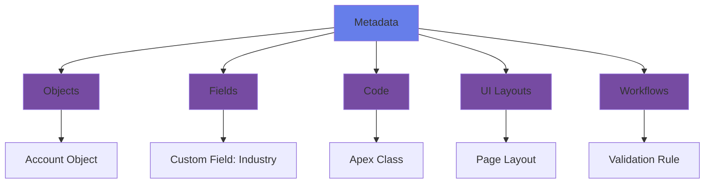
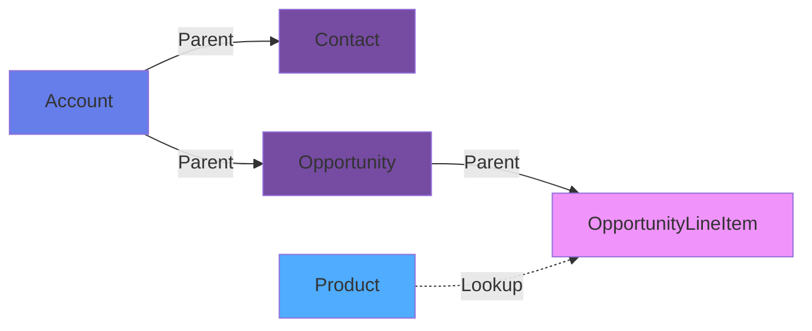
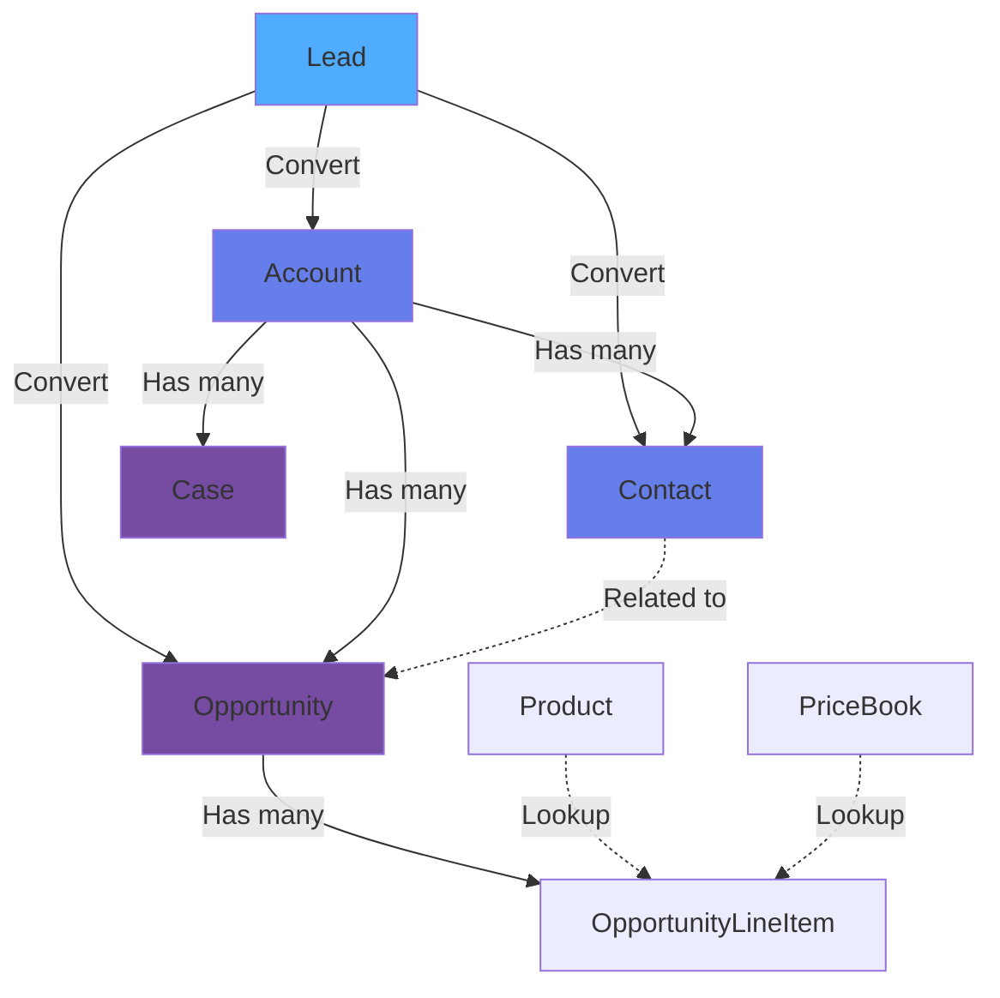

# Salesforce Platform Overview

Welcome to Salesforce! Before diving into development, let's understand what Salesforce is, how it works, and why it's different from traditional development platforms.

## 🎯 What is Salesforce?

Salesforce is a **cloud-based Platform as a Service (PaaS)** that provides:

- **CRM capabilities** - Customer Relationship Management out of the box
- **Development platform** - Build custom applications without managing infrastructure
- **Multi-tenant architecture** - Secure, shared infrastructure serving thousands of organizations
- **Metadata-driven** - Configuration and customization through metadata, not just code

### Traditional Development vs. Salesforce

| Aspect | Traditional Development | Salesforce Platform |
|--------|------------------------|---------------------|
| **Infrastructure** | You manage servers, databases, scaling | Salesforce manages everything |
| **Security** | You implement from scratch | Built-in security model |
| **Authentication** | Build your own auth system | OAuth, SSO, MFA included |
| **UI Framework** | Choose and maintain | Lightning components provided |
| **Database** | Design schema, write SQL, manage migrations | Point-and-click object creation, auto-indexed |
| **API** | Build REST/SOAP endpoints | REST/SOAP APIs auto-generated |
| **Mobile** | Build separate mobile apps | Mobile-first, responsive by default |
| **Updates** | You manage upgrades and patches | 3 releases/year, automatic |

## 🏗️ Salesforce Architecture

### Multi-Tenant Architecture

Salesforce uses a **multi-tenant architecture** - imagine an apartment building:

```
┌─────────────────────────────────────────────┐
│         Salesforce Infrastructure           │
├─────────────────────────────────────────────┤
│  Org 1   │   Org 2   │   Org 3   │  Org 4  │ ← Tenants
│  (Acme)  │ (Global)  │  (Tech)   │ (Start) │
├──────────┴───────────┴───────────┴─────────┤
│         Shared Database Layer               │
│         Shared App Layer                    │
│         Shared Metadata                     │
└─────────────────────────────────────────────┘
```

**Key Concepts:**
- **Org (Organization)** - Your isolated Salesforce instance
- **Shared infrastructure** - All orgs run on same physical infrastructure
- **Logical separation** - Data is completely isolated between orgs
- **Governor limits** - Ensure one org can't impact others

### The Metadata-Driven Architecture

Everything in Salesforce is **metadata**:



**What is Metadata?**
- Data that describes other data
- Example: A "Contact" object is metadata, an actual contact record is data
- Stored in XML format
- Can be deployed between orgs (this is what DevOps does!)

## 🔑 Core Concepts

### 1. Objects

Think of objects as **database tables**:

```
Standard Objects (Built-in):
├── Account   (Companies/Organizations)
├── Contact   (People)
├── Lead      (Potential customers)
├── Opportunity (Sales deals)
└── Case      (Customer support tickets)

Custom Objects (You create):
└── Property__c (Example: Real estate app)
    ├── Address__c
    ├── Price__c
    └── Status__c
```

**Naming Convention:**
- Standard objects: `Account`, `Contact`
- Custom objects: `PropertyListing__c` (always ends with `__c`)

### 2. Fields

Fields are **columns** in your object (table):

```apex
Account Object Fields:
├── Name (Standard)
├── Phone (Standard)
├── Industry (Standard)
└── Customer_Segment__c (Custom)

Field Types:
├── Text
├── Number
├── Date/DateTime
├── Picklist (Dropdown)
├── Checkbox (Boolean)
├── Formula (Calculated)
└── Lookup/Master-Detail (Relationships)
```

### 3. Records

Records are **rows** - actual data:

```
Account Records:
┌────────────────┬──────────────┬──────────────┬──────────────┐
│ Name           │ Phone        │ Industry     │ Segment      │
├────────────────┼──────────────┼──────────────┼──────────────┤
│ Acme Corp      │ 555-0100     │ Technology   │ Enterprise   │
│ Global Tech    │ 555-0200     │ Manufacturing│ Mid-Market   │
│ StartUp Inc    │ 555-0300     │ Technology   │ SMB          │
└────────────────┴──────────────┴──────────────┴──────────────┘
```

### 4. Relationships

Connect objects together (like foreign keys):



**Relationship Types:**
- **Lookup** - Loose coupling, records can exist independently
- **Master-Detail** - Tight coupling, child records deleted when parent is deleted

### 5. Salesforce Org Types

Different types of orgs for different purposes:

| Org Type | Purpose | Features | Limits |
|----------|---------|----------|--------|
| **Developer Org** | Learning, building | Full platform access | 1 GB storage, 5K data records |
| **Sandbox** | Testing, staging | Copy of production | Varies by type |
| **Production** | Live customer data | Full features | Based on license |
| **Scratch Org** | Temporary development | Clean slate | 7-30 days lifespan |
| **Trailhead Playground** | Learning on Trailhead | Pre-configured | Limited customization |

## 🚀 Setting Up Your First Developer Org

Let's get you set up with a free Developer Org!

### Step 1: Sign Up

1. Go to [developer.salesforce.com/signup](https://developer.salesforce.com/signup)
2. Fill out the form:
   - Use your real email (you'll need to verify)
   - Username must be in email format but doesn't have to be a real email
   - Example: `john.doe.dev@example.com` (doesn't need to exist!)

3. Check your email and verify

### Step 2: Log In

1. Go to [login.salesforce.com](https://login.salesforce.com)
2. Enter your username and password
3. Welcome to your Salesforce Developer Org!

### Step 3: Explore the UI

```
Salesforce Interface Layout:
┌─────────────────────────────────────────────┐
│ 🔍 Search  │  App Launcher  │  Setup ⚙️     │ ← Navigation Bar
├─────────────────────────────────────────────┤
│ Home │ Accounts │ Contacts │ Opportunities  │ ← Tab Bar
├─────────────────────────────────────────────┤
│                                             │
│         Main Content Area                   │
│         (Lists, Forms, Dashboards)          │
│                                             │
└─────────────────────────────────────────────┘
```

**Key UI Elements:**
- **App Launcher** (9 dots icon) - Switch between different apps
- **Setup** (gear icon) - Administration and development tools
- **Global Search** - Search across all data
- **Tabs** - Quick access to objects

## 🛠️ Key Developer Tools

### 1. Setup Menu

Access everything administrative:

```
Setup → Quick Find
├── Object Manager (Create/modify objects)
├── Users (Manage users)
├── Profiles & Permission Sets (Security)
├── Flows (Automation)
├── Apex Classes (Code)
├── Lightning Components (UI)
└── Deployment (Change sets, packages)
```

### 2. Developer Console

Built-in IDE for Apex development:

**Open:** Click gear icon → Developer Console

**Features:**
- Write and execute Apex code
- Debug logs
- SOQL queries
- Run tests
- View execution logs

### 3. Schema Builder

Visual tool for viewing/creating objects and relationships:

**Access:** Setup → Quick Find → "Schema Builder"

**Use Cases:**
- Visualize data model
- See relationships
- Create objects visually
- Document architecture

### 4. Data Loader

Bulk import/export data:

**Download:** Setup → Quick Find → "Data Loader"

**Operations:**
- Import thousands of records
- Export data for backup
- Update bulk records
- Delete data

## 📊 Understanding the Data Model

### Standard Objects Hierarchy

Salesforce comes with built-in objects following a typical sales process:



**The Sales Process Flow:**
1. **Lead** - Potential customer (email from website, cold call, etc.)
2. **Convert** - When qualified, Lead becomes Account + Contact + Opportunity
3. **Account** - The company/organization
4. **Contact** - People at the account
5. **Opportunity** - Specific sales deal
6. **Case** - Support tickets after sale

### Object Relationships Example

```apex
Account: Acme Corp
├── Contacts:
│   ├── John Smith (CEO)
│   ├── Jane Doe (CTO)
│   └── Bob Johnson (Buyer)
├── Opportunities:
│   ├── "Q1 Enterprise Deal" ($500K)
│   └── "Cloud Migration" ($250K)
└── Cases:
    ├── "Login Issue" (Open)
    └── "Feature Request" (Closed)
```

## 🔐 Security Model

Salesforce has a **layered security model**:

```
Security Layers (Most Restrictive Wins):
├── 1. Organization Level
│   └── IP restrictions, login hours, password policies
├── 2. Object Level (Profiles & Permission Sets)
│   └── Can users access Account object at all?
├── 3. Field Level
│   └── Can users see "Salary" field on Contact?
└── 4. Record Level (Sharing Rules, OWD)
    └── Which specific Account records can users see?
```

### Key Security Concepts

**1. Profile**
- Determines baseline permissions
- Every user has ONE profile
- Examples: System Administrator, Standard User, Custom Profile

**2. Permission Set**
- Additional permissions beyond profile
- User can have MULTIPLE permission sets
- Use for one-off permissions

**3. Organization-Wide Defaults (OWD)**
- Default sharing level for each object
- Options: Private, Public Read Only, Public Read/Write
- Most restrictive baseline

**4. Sharing Rules**
- Extend access beyond OWD
- Example: "All Sales users can see each other's Accounts"

## 💡 Hands-On Exercise: Explore Your Dev Org

Let's explore your new Developer Org:

### Task 1: Create a Test Account

1. Click **App Launcher** → Search "Sales"
2. Click **Accounts** tab
3. Click **New** button
4. Fill in:
   - Account Name: "Test Company"
   - Phone: "555-1234"
   - Industry: "Technology"
5. Click **Save**

### Task 2: Create a Related Contact

1. On your Account page, scroll to **Contacts** section
2. Click **New** button
3. Fill in:
   - First Name: "John"
   - Last Name: "Smith"
   - Title: "CEO"
   - Email: "john@testcompany.com"
4. Click **Save**

### Task 3: View in Schema Builder

1. Click **Setup** (gear icon)
2. Quick Find: "Schema Builder"
3. Click **Schema Builder**
4. Check boxes for: Account, Contact
5. See the visual relationship!

### Task 4: Query with Developer Console

1. Click **Setup** → **Developer Console**
2. Click **Debug** → **Open Execute Anonymous Window**
3. Paste this code:

```apex
// Query the Account you just created
Account acc = [SELECT Id, Name, Phone, Industry FROM Account WHERE Name = 'Test Company' LIMIT 1];
System.debug('Account Name: ' + acc.Name);
System.debug('Industry: ' + acc.Industry);

// Query related Contacts
List<Contact> contacts = [SELECT FirstName, LastName, Title FROM Contact WHERE AccountId = :acc.Id];
System.debug('Number of Contacts: ' + contacts.size());
for(Contact c : contacts) {
    System.debug('Contact: ' + c.FirstName + ' ' + c.LastName + ' - ' + c.Title);
}
```

4. Check **Open Log**, click **Execute**
5. Click **Debug Only** to see output

## 🎯 Key Takeaways

After this lesson, you should understand:

✅ Salesforce is a multi-tenant, metadata-driven PaaS platform
✅ Objects are like tables, Fields are columns, Records are rows
✅ Relationships connect objects together (Lookup, Master-Detail)
✅ Different org types serve different purposes (Dev, Sandbox, Production)
✅ Security has multiple layers (Org, Object, Field, Record)
✅ Developer Console, Schema Builder, and Setup are key tools

## 📚 Interview Questions

**Q: What is multi-tenancy in Salesforce?**
A: Multi-tenancy means multiple organizations (tenants) share the same infrastructure, application, and database, but data is logically separated and isolated. Each org appears to have its own dedicated environment, but physically shares resources. Governor limits prevent one org from consuming too many resources.

**Q: What's the difference between a Lookup and Master-Detail relationship?**
A:
- **Lookup**: Loose coupling, child can exist without parent, no automatic record deletion, separate ownership
- **Master-Detail**: Tight coupling, child cannot exist without parent, cascade delete, child inherits security from parent

**Q: Explain Object vs. Record vs. Field**
A:
- **Object**: The structure/table (e.g., Account object)
- **Field**: A column in that structure (e.g., Name field)
- **Record**: An actual row of data (e.g., "Acme Corp" account)

**Q: What are governor limits and why do they exist?**
A: Governor limits are runtime limits enforced by Salesforce to ensure efficient resource usage in the multi-tenant environment. Examples: 100 SOQL queries per transaction, 50K records max. They prevent one org's code from monopolizing resources and impacting other tenants.

## 🚀 Next Steps

Now that you understand the platform basics, let's dive deeper into the data model:

**[→ Next: Data Model & Objects](/docs/salesforce/data-model/objects-and-fields)**

More topics coming soon:
- Setting Up Your Development Environment
- Understanding Salesforce Licenses
- Salesforce API Basics

---

## 📖 Additional Resources

- [Salesforce Architecture Overview](https://developer.salesforce.com/docs/atlas.en-us.fundamentals.meta/fundamentals/)
- [Data Model Documentation](https://developer.salesforce.com/docs/atlas.en-us.object_reference.meta/object_reference/)
- [Trailhead: Platform Basics](https://trailhead.salesforce.com/content/learn/modules/starting_force_com)
- [Multi-Tenant Architecture Whitepaper](https://developer.salesforce.com/page/Multi_Tenant_Architecture)

**Completed your first lesson!** You now have a solid foundation of Salesforce concepts. Time to build on it! 🎓
