# Designing Your Enterprise Sandbox Architecture

## Learning Objective

Design a complete enterprise sandbox strategy for multiple teams with 50+ developers.

## The Australia Post Scenario

**Your mission as new DevOps Lead:**

```
Current State:
- 50 developers across 5 teams
- 3 Salesforce clouds (Sales, Service, Community)
- New projects: MuleSoft, Agentforce, Data Cloud
- Problem: Everyone shares 2 sandboxes (CHAOS!)

Your Goal:
- Design proper sandbox architecture
- Support all teams effectively
- Enable DevOps best practices
- Justify the investment
```

## Current State (Before You Arrive) - The Chaos

```mermaid
graph TB
    PROD[Production]

    subgraph "Current Sandboxes (CHAOS)"
        DEV1[Dev Sandbox 1<br/>50 developers fighting<br/>❌ Constant conflicts<br/>❌ No one knows who changed what]

        TEST1[Test Sandbox<br/>❌ Broken half the time<br/>❌ Can't test properly<br/>❌ Mixed changes from all teams]
    end

    subgraph "Teams (All competing)"
        TEAM1[Sales Cloud Team<br/>10 people]
        TEAM2[Service Cloud Team<br/>15 people]
        TEAM3[Community Team<br/>8 people]
        TEAM4[Integration Team<br/>10 people]
        TEAM5[Data/Analytics Team<br/>7 people]
    end

    TEAM1 & TEAM2 & TEAM3 & TEAM4 & TEAM5 -.->|ALL using| DEV1
    TEAM1 & TEAM2 & TEAM3 & TEAM4 & TEAM5 -.->|ALL testing| TEST1

    DEV1 -.->|Deploy chaos| PROD
    TEST1 -.->|Deploy chaos| PROD

    style DEV1 fill:#ef5350,color:#fff
    style TEST1 fill:#ef5350,color:#fff
    style PROD fill:#fff176
```



### Problems with Current State

- ❌ **Developers overwrite each other's work** - No isolation
- ❌ **Can't track who changed what** - No accountability
- ❌ **Testing is impossible** - Whose code is this?
- ❌ **Deployments break constantly** - 40% failure rate
- ❌ **Teams blame each other** - Toxic environment
- ❌ **4-hour deployments every Friday** - Manual nightmare
- ❌ **Frequent production incidents** - Poor quality

## Your New Architecture (62 Total Environments)

### Complete Architecture Diagram

```mermaid
graph TB
    PROD[🏭 PRODUCTION<br/>Live Customer Data<br/>Zero Downtime Required]

    subgraph "Pre-Production (Staging)"
        UAT[🎯 UAT - Full Sandbox<br/>Business User Testing<br/>Production Scale Data<br/>Refresh: Monthly]

        PERF[⚡ Performance - Full Sandbox<br/>Load Testing<br/>Production Scale Data<br/>Refresh: Monthly]
    end

    subgraph "Integration Testing"
        TEST[🧪 Integration Test<br/>Partial Copy Sandbox<br/>All Teams Test Here<br/>Sample Data<br/>Refresh: Bi-weekly]

        QA[✅ QA Sandbox<br/>Partial Copy<br/>Dedicated QA Team<br/>Automated Tests<br/>Refresh: Bi-weekly]
    end

    subgraph "Team Development (5 Teams)"
        DEV_SALES[💼 Sales Cloud Dev<br/>Developer Pro<br/>Sales Team (10 devs)<br/>Refresh: Weekly]

        DEV_SERVICE[🎧 Service Cloud Dev<br/>Developer Pro<br/>Service Team (15 devs)<br/>Refresh: Weekly]

        DEV_COMMUNITY[🌐 Community Dev<br/>Developer Pro<br/>Community Team (8 devs)<br/>Refresh: Weekly]

        DEV_INTEGRATION[🔌 Integration Dev<br/>Developer Pro<br/>Integration Team (10 devs)<br/>MuleSoft + Salesforce<br/>Refresh: Weekly]

        DEV_DATA[📊 Data/Analytics Dev<br/>Developer Pro<br/>Data Team (7 devs)<br/>Data Cloud + Reports<br/>Refresh: Weekly]
    end

    subgraph "Individual Developers (50 Dev Sandboxes)"
        PERSONAL[👤 Personal Dev Sandboxes<br/>Developer Sandboxes<br/>1 per developer<br/>50 total<br/>Refresh: As needed]
    end

    subgraph "Special Purpose"
        HOTFIX[🔥 Hotfix Sandbox<br/>Developer Pro<br/>Emergency Production Fixes<br/>Mirrors Production<br/>Refresh: After each use]

        TRAINING[🎓 Training Sandbox<br/>Developer Pro<br/>New Employee Onboarding<br/>Demo Environment<br/>Refresh: Quarterly]
    end

    PERSONAL --> DEV_SALES
    PERSONAL --> DEV_SERVICE
    PERSONAL --> DEV_COMMUNITY
    PERSONAL --> DEV_INTEGRATION
    PERSONAL --> DEV_DATA

    DEV_SALES --> TEST
    DEV_SERVICE --> TEST
    DEV_COMMUNITY --> TEST
    DEV_INTEGRATION --> TEST
    DEV_DATA --> TEST

    TEST --> QA
    QA --> UAT
    UAT --> PERF
    PERF --> PROD

    PROD -.->|Emergency Fix| HOTFIX
    HOTFIX -.->|Validated Fix| PROD

    PROD -.->|Copy Metadata| TRAINING

    style PROD fill:#ef5350,color:#fff
    style UAT fill:#ab47bc,color:#fff
    style PERF fill:#ab47bc,color:#fff
    style TEST fill:#ffa726,color:#fff
    style QA fill:#ffa726,color:#fff
    style DEV_SALES fill:#42a5f5,color:#fff
    style DEV_SERVICE fill:#42a5f5,color:#fff
    style DEV_COMMUNITY fill:#42a5f5,color:#fff
    style DEV_INTEGRATION fill:#42a5f5,color:#fff
    style DEV_DATA fill:#42a5f5,color:#fff
    style PERSONAL fill:#66bb6a,color:#fff
    style HOTFIX fill:#ff7043,color:#fff
    style TRAINING fill:#78909c,color:#fff
```

## Complete Sandbox Inventory

### Total: 62 Environments

**Personal Development (50):**
```
├─ 10x Developer Sandboxes (Sales Cloud Team)
├─ 15x Developer Sandboxes (Service Cloud Team)
├─ 8x Developer Sandboxes (Community Team)
├─ 10x Developer Sandboxes (Integration Team)
└─ 7x Developer Sandboxes (Data Team)

Purpose: Individual developer daily work
Cost: Included in Salesforce edition
```

**Team Development (5):**
```
├─ 1x Developer Pro (Sales Cloud Team Shared)
├─ 1x Developer Pro (Service Cloud Team Shared)
├─ 1x Developer Pro (Community Team Shared)
├─ 1x Developer Pro (Integration Team Shared)
└─ 1x Developer Pro (Data Team Shared)

Purpose: Team integration before wider testing
Cost: ~$1,500/month each = $7,500/month
```

**Integration & Testing (2):**
```
├─ 1x Partial Copy (Integration Test)
└─ 1x Partial Copy (QA Automation)

Purpose: Cross-team testing with sample data
Cost: ~$3,000/month each = $6,000/month
```

**Pre-Production (2):**
```
├─ 1x Full Sandbox (UAT)
└─ 1x Full Sandbox (Performance Testing)

Purpose: Final validation before production
Cost: ~$30,000/month each = $60,000/month
```

**Special Purpose (2):**
```
├─ 1x Developer Pro (Hotfix)
└─ 1x Developer Pro (Training)

Purpose: Emergency fixes and onboarding
Cost: ~$1,500/month each = $3,000/month
```

**Production (1):**
```
└─ 1x Production Org

Purpose: Live customer environment
```

**Total Monthly Cost:** $76,500/month = $918,000/year

## The Deployment Flow Through Sandboxes


## Example Feature Flow: Sales Cloud Discount Approval

### Timeline: Dev to Production (8 days)

**Day 1 (Monday):**
```
Developer Jane's Personal Dev Sandbox:
├─ Builds Flow for discount approval
├─ Creates custom field "Discount_Approval_Status__c"
├─ Tests locally
├─ Commits to Git feature branch
└─ Time: 4 hours
```

**Day 2 (Tuesday):**
```
Sales Team Developer Pro Sandbox:
├─ Jane merges to team sandbox
├─ Team reviews (code review in Pull Request)
├─ Integration tests with other Sales team features
├─ Pipeline auto-deploys to Integration Test sandbox
└─ Time: 2 hours
```

**Day 3 (Wednesday):**
```
Integration Test Sandbox:
├─ All 5 teams' features tested together
├─ Any conflicts resolved
├─ Auto-deploy to QA Sandbox
├─ QA runs automated test suite
└─ Time: 4 hours
```

**Day 4-5 (Thursday-Friday):**
```
UAT & Performance Sandboxes:
├─ Deploy to UAT
├─ Business users test with production-like data
├─ Sign-off received
├─ Deploy to Performance sandbox
├─ Load testing: 1000 concurrent users approving discounts
└─ Time: 2 days
```

**Day 8 (Monday - next week):**
```
Production Deployment:
├─ Scheduled deployment window: Sunday 2 AM
├─ Automated deployment via GitLab pipeline
├─ Monitoring: No issues detected
├─ Feature live for business users!
└─ Time: 15 minutes deployment + 1 hour validation
```

**Total:** 8 days from dev to production *(vs 30+ days before!)*

## Team Allocation Matrix

| Team | Size | Personal Dev | Team Dev Pro | Purpose |
|------|------|--------------|--------------|---------|
| **Sales Cloud** | 10 devs | 10 sandboxes | 1 shared | Opportunity, Account, Lead features |
| **Service Cloud** | 15 devs | 15 sandboxes | 1 shared | Case management, knowledge base |
| **Community** | 8 devs | 8 sandboxes | 1 shared | Lightning Web Components, CMS |
| **Integration** | 10 devs | 10 sandboxes | 1 shared | MuleSoft APIs, external integrations |
| **Data/Analytics** | 7 devs | 7 sandboxes | 1 shared | Data Cloud, Einstein Analytics |

## Cost-Benefit Analysis

### Investment

```
Annual Costs:
├─ Developer Sandboxes (50): Included = $0
├─ Developer Pro (7): $90,000/year
├─ Partial Copy (2): $72,000/year
├─ Full Sandboxes (2): $720,000/year
└─ Total: $882,000/year
```

### Return on Investment

**Before proper sandbox strategy:**
```
Problems:
├─ 40% deployment failure rate
├─ 4-hour manual deployments
├─ Developers blocking each other daily
├─ Testing nearly impossible
├─ Production incidents: 20+ per month
└─ Deployment frequency: Once per month (scary!)
```

**After proper sandbox strategy:**
```
Improvements:
├─ 8% deployment failure rate (80% reduction)
├─ 15-minute automated deployments (94% faster)
├─ Developers work independently (no blocking)
├─ Comprehensive testing at every stage
├─ Production incidents: 2 per month (90% reduction)
└─ Deployment frequency: Weekly (12x increase)
```

**Calculated ROI:**
```
Labor Savings:
- Faster deployments: 3.75 hours saved × 50 deployments/year
- Time saved: 187.5 hours × $100/hour = $18,750

Reduced Failure Costs:
- Failures prevented: 32% × 50 deployments
- Cost per failure: $5,000 (investigation + fix + deploy)
- Savings: 16 failures × $5,000 = $80,000

Reduced Production Incidents:
- Incidents prevented: 18 per month × 12 months = 216
- Cost per incident: $2,500 (downtime + fix)
- Savings: 216 × $2,500 = $540,000

Increased Productivity:
- Developers not blocked: 50 devs × 2 hours/week saved
- Annual hours: 5,200 hours × $100/hour = $520,000

Total Annual Benefit: $1,158,750
Total Annual Investment: $882,000
Net Annual Benefit: $276,750
ROI: 31% return on investment
```

## Implementation Roadmap

### Month 1: Foundation

**Week 1-2:**
- Set up DevOps Center
- Create personal Dev sandboxes for all 50 developers
- Implement naming conventions
- Document architecture

**Week 3-4:**
- Create 5 Team Developer Pro sandboxes
- Set up Git repository structure
- Train teams on new workflow
- Complete first team deployments

**Success Metrics:**
- All developers have personal sandboxes
- 1 team successfully using new workflow
- Zero sandbox naming conflicts

### Month 2-3: Scale

**Week 5-8:**
- Create Integration Test (Partial Copy)
- Create QA Sandbox (Partial Copy)
- Set up automated pipelines
- Implement data templates

**Week 9-12:**
- All 5 teams onboarded
- Automated testing running
- Integration testing working
- Document all processes

**Success Metrics:**
- All teams using proper sandbox flow
- 20+ successful deployments
- Test automation coverage >50%

### Month 4-6: Optimize

**Week 13-20:**
- Create UAT Full Sandbox
- Create Performance Full Sandbox
- Implement data masking
- Add Hotfix sandbox
- Create Training sandbox

**Week 21-24:**
- Full pipeline operational
- Monitoring dashboards live
- Performance testing automated
- Regular refresh schedule established

**Success Metrics:**
- Complete pipeline working
- Deployment frequency: Weekly
- Failure rate: less than 15%

## Quick Check

Before moving on, make sure you can answer:

1. **How many total sandboxes needed for 50 developers in 5 teams?**
   - Answer: 62 total (50 personal, 5 team, 2 integration/QA, 2 full, 2 special, 1 production)

2. **What's the deployment flow from dev to production?**
   - Answer: Personal Dev → Team Dev Pro → Integration Test → QA → UAT → Performance → Production

3. **Why have both personal AND team Dev sandboxes?**
   - Answer: Personal for isolation (no conflicts), Team for integration before wider testing

4. **How do you justify $882K/year investment?**
   - Answer: ROI of $1.16M in benefits (reduced failures, faster deployments, fewer incidents, higher productivity) = 31% return

## Next Steps

Architecture designed! Now you're ready to understand data management strategies across all these sandboxes.

**Coming Soon:** Data Management Across Sandboxes - Learn how to handle data templates, masking, and refresh strategies.

## Additional Resources

- [Enterprise Sandbox Strategy Guide](https://architect.salesforce.com/design/decision-guides/sandbox-strategy)
- [Salesforce Well-Architected Framework](https://architect.salesforce.com/well-architected/overview)
- [DevOps at Scale](https://trailhead.salesforce.com/content/learn/modules/devops-at-scale)
