# Understanding Sandbox Types and Strategy

## Learning Objective

Master the different Salesforce sandbox types and when to use each in an enterprise DevOps setup like Australia Post.

## The Sandbox Challenge

You're DevOps Lead at Australia Post. You have 50 developers across 5 teams working on Sales Cloud, Service Cloud, and Community Cloud.

**The question:** How many sandboxes do you need? What types? Who gets which one? This is real sandbox strategy.

## Salesforce Sandbox Types (Complete Breakdown)

### Visual Comparison

```mermaid
graph TB
    PROD[Production Org<br/>💰 Live Customer Data<br/>🔒 Maximum Security]

    subgraph "Sandbox Types"
        DEV[Developer Sandbox<br/>📦 Metadata Only<br/>⚡ Fast Refresh: Daily<br/>💾 Size: 200 MB<br/>💵 Cost: Included<br/>👥 Use: Individual Devs]

        DEV_PRO[Developer Pro Sandbox<br/>📦 Metadata Only<br/>⚡ Refresh: Daily<br/>💾 Size: 1 GB<br/>💵 Cost: Add-on<br/>👥 Use: Teams]

        PARTIAL[Partial Copy Sandbox<br/>📦 Metadata + Sample Data<br/>⚡ Refresh: Every 5 days<br/>💾 Size: 5 GB<br/>💵 Cost: Add-on<br/>👥 Use: Integration Testing]

        FULL[Full Sandbox<br/>📦 Complete Copy<br/>⚡ Refresh: Every 29 days<br/>💾 Size: Same as Production<br/>💵 Cost: Premium<br/>👥 Use: UAT, Performance Testing]
    end

    PROD -.->|Create/Refresh| DEV
    PROD -.->|Create/Refresh| DEV_PRO
    PROD -.->|Create/Refresh| PARTIAL
    PROD -.->|Create/Refresh| FULL

    style PROD fill:#ef5350,color:#fff
    style DEV fill:#66bb6a,color:#fff
    style DEV_PRO fill:#42a5f5,color:#fff
    style PARTIAL fill:#ffa726,color:#fff
    style FULL fill:#ab47bc,color:#fff
```



## Detailed Comparison Table

| Feature | Developer | Developer Pro | Partial Copy | Full Sandbox |
|---------|-----------|---------------|--------------|--------------|
| **Metadata** | ✅ Full copy | ✅ Full copy | ✅ Full copy | ✅ Full copy |
| **Data** | ❌ None | ❌ None | ⚠️ Sample (via template) | ✅ Complete copy |
| **Storage** | 200 MB | 1 GB | 5 GB | Same as Production |
| **Refresh Interval** | 1 day | 1 day | 5 days | 29 days |
| **Typical Use** | Individual dev work | Team development | Integration tests | UAT, Staging |
| **Number Included** | Varies by edition | None (purchase) | None (purchase) | None (purchase) |
| **Cost** | Included | ~$1,500/month | ~$3,000/month | ~$30,000/month |
| **Refresh Time** | Minutes | Minutes | Hours | Days |
| **Data at Creation** | None | None | Defined by template | Full production copy |

## When to Use Each Type

### Developer Sandbox

**✅ Good For:**
- Individual developer daily work
- Building Apex classes
- Creating Lightning components
- Configuration changes
- Testing without data dependencies

**❌ Not Good For:**
- Testing with real data
- Performance testing
- Integration testing
- Multiple developers on same code

**Australia Post Use Case:**
```
Scenario: Each developer gets their own Dev sandbox
- 50 developers = 50 Dev sandboxes
- Used for feature development
- Fast refresh keeps metadata current
- No data privacy concerns
- Developers work independently
```

### Developer Pro Sandbox

**✅ Good For:**
- Team-shared development environment
- More storage for larger projects
- Testing custom packages
- Projects with large metadata

**❌ Not Good For:**
- Data-heavy testing
- Still no production data

**Australia Post Use Case:**
```
Scenario: One per team (5 teams = 5 Dev Pro)
- Sales Cloud Team shared environment
- Service Cloud Team shared environment
- Community Team shared environment
- Integration Team shared environment
- Data Team shared environment

Purpose:
- Where team features come together before test
- Integration point for individual dev work
- Code review environment
```

### Partial Copy Sandbox

**✅ Good For:**
- Integration testing with real-ish data
- Testing workflows with sample records
- Reports and dashboards testing
- API integration testing

**❌ Not Good For:**
- Full volume testing
- Performance testing
- Complete UAT (limited data)

**Australia Post Use Case:**
```
Scenario: Integration test environment
- Contains sample customers, orders, cases
- Tests integrations (MuleSoft, external systems)
- Not full production volume
- Refresh bi-weekly to stay current

Data Template Includes:
- 10,000 sample Accounts
- 50,000 related Contacts
- 25,000 open Opportunities
- 30,000 recent Cases
- Representative data distribution
```

### Full Sandbox

**✅ Good For:**
- User acceptance testing (UAT)
- Performance testing at scale
- Training environment
- Final pre-production validation
- Disaster recovery testing

**❌ Not Good For:**
- Daily development (too slow to refresh)
- Frequent testing (limited refreshes)

**Australia Post Use Case:**
```
Scenario: UAT and Performance environments
- UAT environment (business users test here)
- Performance testing (production scale data)
- Final staging before production
- Training for new employees

Contains:
- Complete production data copy
- All customer records
- Full transaction history
- Production scale (1M+ accounts)
- MUST be masked for security
```

## The Sandbox Lifecycle


## Sandbox Refresh Strategy

### Developer Sandboxes

**Best Practice:** Refresh weekly (even though you can do daily)

**Why:**
- Keeps metadata in sync with production
- Prevents drift
- Catches production changes early

**Schedule:** Friday nights (automated)

### Developer Pro / Partial Copy

**Best Practice:** Refresh before major testing cycles

**Triggers:**
- After production deployments
- Before release testing
- When data templates change
- Bi-weekly scheduled refresh

**Schedule:** Every other Sunday

### Full Sandboxes

**Best Practice:** Refresh monthly (maximum allowed frequency)

**Important:**
- Coordinate with business (UAT downtime)
- Plan data masking for sensitive info
- Schedule during maintenance windows
- Communicate 48 hours in advance

**Schedule:** First Sunday of month at 2:00 AM

## Data Masking (Critical for Full Sandboxes)

Full sandboxes contain REAL production data. At Australia Post, this means real customer names, addresses, payment info. **You MUST mask sensitive data.**

### Data to Mask

```
Personal Information:
- Customer names → "Test Customer 001"
- Email addresses → random@ausposttest.com.au
- Phone numbers → Randomized
- Home addresses → Generic addresses
- Date of birth → Randomized dates

Financial Information:
- Credit card info → Removed/scrambled
- Bank account numbers → Masked
- Payment history → Anonymized

Sensitive Business Data:
- Internal employee IDs → Masked
- Confidential pricing → Removed
- Contract terms → Generic
```

### Masking Tools

**1. Salesforce Data Mask (Native)**
- Built into Salesforce
- Automated masking rules
- Runs after sandbox creation
- Best option for Full sandboxes

**2. Custom Apex Scripts**
```apex
public class DataMaskingUtility {
    public static void maskAccountData() {
        List<Account> accounts = [SELECT Id, Name, Phone FROM Account];

        for(Integer i = 0; i < accounts.size(); i++) {
            accounts[i].Name = 'Test Account ' + String.valueOf(i).leftPad(6, '0');
            accounts[i].Phone = '555-555-' + String.valueOf(Math.mod(i, 10000)).leftPad(4, '0');
        }

        update accounts;
    }
}
```

**3. Third-Party Tools**
- OwnBackup
- Gearset
- Copado
- More features, additional cost

### Masking Process

```mermaid
graph LR
    CREATE[Create Full Sandbox<br/>24-48 hours]

    COMPLETE[Sandbox Creation<br/>Complete]

    MASK[Run Data Masking<br/>2-4 hours]

    VERIFY[Verify Masking<br/>Audit Report]

    SAFE[✅ Safe for Testing]

    CREATE --> COMPLETE
    COMPLETE --> MASK
    MASK --> VERIFY
    VERIFY --> SAFE

    style CREATE fill:#ffb74d
    style MASK fill:#42a5f5,color:#fff
    style VERIFY fill:#66bb6a,color:#fff
    style SAFE fill:#81c784
```



## Sandbox Naming Conventions

**Critical for managing many sandboxes!**

### Personal Developer Sandboxes

```
Format: [FirstName][Team]

Examples:
- JohnSales (John from Sales team)
- SarahService (Sarah from Service team)
- MikeCommunity (Mike from Community team)

Benefits:
✓ Instantly know who owns it
✓ Know which team they're on
✓ Easy to track and manage
```

### Team Sandboxes

```
Format: [Team][Purpose]

Examples:
- SalesTeamDev (Sales team development)
- ServiceTeamDev (Service team development)
- IntegrationTest (Cross-team integration)

Benefits:
✓ Clear purpose
✓ Team ownership obvious
✓ Easy to find
```

### Special Purpose Sandboxes

```
Format: [Purpose][Type]

Examples:
- UAT_Production (UAT environment)
- Performance_Test (Performance testing)
- Hotfix_Emergency (Emergency fixes)
- Training_Onboarding (New hire training)

Benefits:
✓ Self-documenting
✓ Purpose-driven
✓ Avoids confusion
```

## Sandbox Inventory Management

**You need to track all sandboxes!**

### Recommended Tracking Spreadsheet

| Sandbox Name | Type | Owner | Team | Purpose | Last Refresh | Storage Used | Status |
|--------------|------|-------|------|---------|--------------|--------------|--------|
| JohnSales | Developer | John Doe | Sales | Personal dev | 2025-10-25 | 45 MB | Active |
| SalesTeamDev | Dev Pro | Sales Team | Sales | Team integration | 2025-10-26 | 650 MB | Active |
| IntegrationTest | Partial | DevOps | All | Testing | 2025-10-20 | 3.2 GB | Active |
| UAT_Production | Full | Business | All | UAT | 2025-10-01 | 45 GB | Active |

### Monthly Sandbox Review

**Schedule:** Last Friday of each month

**Process:**
1. Review sandbox inventory
2. Identify unused sandboxes (no activity in 30+ days)
3. Contact owners - still needed?
4. Delete confirmed unused sandboxes
5. Refresh stale sandboxes
6. Update documentation

**Why important:**
- Sandboxes cost money (Developer Pro, Partial, Full)
- Storage limits can be hit
- Unused sandboxes create confusion
- Security risk (old, unmonitored environments)

## Cost Management

### Understanding Costs

**Included Sandboxes (Free):**
- Developer sandboxes (varies by edition)
- Enterprise Edition: ~25 included
- Unlimited Edition: ~100 included

**Add-On Costs (Approximate):**
```
Developer Pro: $1,500/month each
Partial Copy: $3,000/month each
Full Sandbox: $30,000/month each

Example Australia Post Setup:
- 50x Developer: Included = $0
- 7x Developer Pro: $10,500/month
- 2x Partial Copy: $6,000/month
- 2x Full Sandbox: $60,000/month
Total: $76,500/month = $918,000/year
```

### ROI Justification

**Before proper sandbox strategy:**
- 40% deployment failure rate
- 4-hour manual deployments
- Developers blocking each other
- Testing impossible
- Production incidents frequent

**After proper sandbox strategy:**
- 8% deployment failure rate
- 15-minute automated deployments
- Developers work independently
- Comprehensive testing
- 90% fewer production incidents

**Calculated ROI:**
```
Labor savings: $200,000/year
  (Faster deployments, fewer failures)

Reduced downtime: $500,000/year
  (Fewer production incidents)

Productivity gains: $300,000/year
  (Developers not blocked)

Total benefit: $1,000,000/year
Investment: $918,000/year
Net benefit: $82,000/year
ROI: Pays for itself + generates value
```

## Quick Check

Before moving on, make sure you can answer:

1. **Which sandbox type includes production data?**
   - Answer: Full Sandbox (complete copy), Partial Copy (sample data via template)

2. **How often can you refresh a Developer sandbox?**
   - Answer: Daily, but best practice is weekly to balance freshness with stability

3. **When would you use a Partial Copy vs Full sandbox?**
   - Answer: Partial Copy for integration testing with sample data. Full sandbox for UAT, performance testing, or training with production-scale data.

4. **Why is data masking critical?**
   - Answer: Full sandboxes contain real customer data (PII, financial info). Must mask for security, compliance, and privacy regulations.

## Next Steps

You understand sandbox types and their purposes. Now let's design a complete enterprise architecture for Australia Post's 50 developers.

**Continue to:** [Enterprise Sandbox Architecture Design](./architecture-design)

## Additional Resources

- [Salesforce Sandbox Types Documentation](https://help.salesforce.com/s/articleView?id=sf.deploy_sandboxes_intro.htm)
- [Data Masking Best Practices](https://help.salesforce.com/s/articleView?id=sf.data_mask_overview.htm)
- [Sandbox Refresh Guide](https://help.salesforce.com/s/articleView?id=sf.data_sandbox_create.htm)
