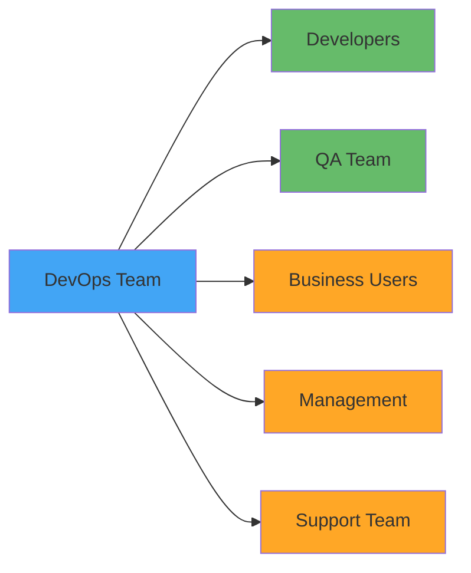

# Communication Patterns for DevOps Teams

**Learning Objective**: Master stakeholder communication for DevOps initiatives through automated, timely, and targeted messaging.

## Overview

DevOps isn't just about code and pipelines - it's about people and communication. Teams need to know when deployments happen, stakeholders need status updates, and everyone needs to be informed when things go wrong. This guide shows you how to automate communication effectively.

## Communication Stakeholders



## Deployment Status Updates

### Success Notifications

```yaml
name: Notify Deployment Success

on:
  workflow_run:
    workflows: ["Production Deploy"]
    types: [completed]

jobs:
  notify-success:
    if: ${{ github.event.workflow_run.conclusion == 'success' }}
    runs-on: ubuntu-latest
    steps:
      - name: Notify Slack
        run: |
          curl -X POST ${{ secrets.SLACK_WEBHOOK }} \
            -H 'Content-Type: application/json' \
            -d '{
              "text": "✅ Production Deployment Successful",
              "attachments": [{
                "color": "good",
                "fields": [
                  {
                    "title": "Environment",
                    "value": "Production",
                    "short": true
                  },
                  {
                    "title": "Deployed By",
                    "value": "${{ github.event.workflow_run.actor.login }}",
                    "short": true
                  },
                  {
                    "title": "Branch",
                    "value": "${{ github.event.workflow_run.head_branch }}",
                    "short": true
                  },
                  {
                    "title": "Run ID",
                    "value": "<${{ github.event.workflow_run.html_url }}|${{ github.event.workflow_run.id }}>",
                    "short": true
                  }
                ],
                "footer": "DevOps Bot",
                "ts": "${{ github.event.workflow_run.updated_at }}"
              }]
            }'

      - name: Update Status Page
        run: |
          # Post to status page API
          curl -X POST https://status-api.company.com/deployments \
            -H "Authorization: Bearer ${{ secrets.STATUS_API_KEY }}" \
            -H "Content-Type: application/json" \
            -d '{
              "environment": "production",
              "status": "completed",
              "deployed_by": "${{ github.event.workflow_run.actor.login }}",
              "timestamp": "${{ github.event.workflow_run.updated_at }}",
              "run_url": "${{ github.event.workflow_run.html_url }}"
            }'

      - name: Email Stakeholders
        run: |
          # Send email to stakeholders list
          curl -X POST https://api.sendgrid.com/v3/mail/send \
            -H "Authorization: Bearer ${{ secrets.SENDGRID_API_KEY }}" \
            -H "Content-Type: application/json" \
            -d '{
              "personalizations": [{
                "to": [
                  {"email": "product-owner@company.com"},
                  {"email": "release-manager@company.com"}
                ]
              }],
              "from": {"email": "devops@company.com"},
              "subject": "✅ Production Deployment Completed",
              "content": [{
                "type": "text/html",
                "value": "<h2>Production Deployment Successful</h2><p>Branch: ${{ github.event.workflow_run.head_branch }}</p><p><a href=\"${{ github.event.workflow_run.html_url }}\">View Details</a></p>"
              }]
            }'
```

### Failure Notifications

```yaml
- name: Notify Deployment Failure
  if: ${{ github.event.workflow_run.conclusion == 'failure' }}
  run: |
    curl -X POST ${{ secrets.SLACK_WEBHOOK }} \
      -H 'Content-Type: application/json' \
      -d '{
        "text": "🚨 Production Deployment FAILED",
        "attachments": [{
          "color": "danger",
          "fields": [
            {"title": "Environment", "value": "Production", "short": true},
            {"title": "Deployed By", "value": "${{ github.event.workflow_run.actor.login }}", "short": true},
            {"title": "Branch", "value": "${{ github.event.workflow_run.head_branch }}", "short": true}
          ],
          "actions": [
            {
              "type": "button",
              "text": "View Logs",
              "url": "${{ github.event.workflow_run.html_url }}"
            },
            {
              "type": "button",
              "text": "Rollback",
              "url": "${{ github.server_url }}/${{ github.repository }}/actions/workflows/rollback.yml"
            }
          ]
        }]
      }'

    # Page on-call engineer
    curl -X POST https://api.pagerduty.com/incidents \
      -H "Authorization: Token token=${{ secrets.PAGERDUTY_TOKEN }}" \
      -H "Content-Type: application/json" \
      -d '{
        "incident": {
          "type": "incident",
          "title": "Production Deployment Failed",
          "service": {"id": "${{ secrets.PAGERDUTY_SERVICE_ID }}", "type": "service_reference"},
          "urgency": "high",
          "body": {
            "type": "incident_body",
            "details": "Production deployment failed. Branch: ${{ github.event.workflow_run.head_branch }}"
          }
        }
      }'
```

## Progress Updates

### Deployment Progress

```yaml
- name: Send Progress Update - Starting
  run: |
    curl -X POST ${{ secrets.SLACK_WEBHOOK }} \
      -H 'Content-Type: application/json' \
      -d '{
        "text": "🚀 Starting Production Deployment",
        "attachments": [{
          "color": "#2196F3",
          "text": "Estimated time: 15-20 minutes\nDeploying: ${{ github.event.pull_request.title }}"
        }]
      }'

- name: Deploy Metadata
  run: sf project deploy start ...

- name: Send Progress Update - Testing
  run: |
    curl -X POST ${{ secrets.SLACK_WEBHOOK }} \
      -H 'Content-Type: application/json' \
      -d '{"text": "⏳ Deployment complete, running tests..."}'

- name: Run Tests
  run: sf apex run test ...

- name: Send Progress Update - Verifying
  run: |
    curl -X POST ${{ secrets.SLACK_WEBHOOK }} \
      -H 'Content-Type: application/json' \
      -d '{"text": "🔍 Tests passed, verifying deployment..."}'

- name: Verify Deployment
  run: bash scripts/verify.sh

- name: Send Progress Update - Complete
  run: |
    curl -X POST ${{ secrets.SLACK_WEBHOOK }} \
      -H 'Content-Type: application/json' \
      -d '{"text": "✅ Production deployment verified and complete!"}'
```

### Multi-Stage Progress

```yaml
- name: Report Multi-Stage Progress
  run: |
    TOTAL_STAGES=4
    CURRENT_STAGE="${{ matrix.stage }}"

    curl -X POST ${{ secrets.SLACK_WEBHOOK }} \
      -H 'Content-Type: application/json' \
      -d '{
        "text": "📊 Deployment Progress",
        "attachments": [{
          "color": "#2196F3",
          "fields": [
            {"title": "Stage", "value": "'"$CURRENT_STAGE"' of '"$TOTAL_STAGES"'", "short": true},
            {"title": "Progress", "value": "'"$((CURRENT_STAGE * 100 / TOTAL_STAGES))"'%", "short": true}
          ]
        }]
      }'
```

## Targeted Notifications

### Notify By Team

```yaml
- name: Determine Affected Teams
  id: teams
  run: |
    CHANGED_FILES=$(git diff --name-only origin/main...HEAD)

    # Check which teams' code changed
    if echo "$CHANGED_FILES" | grep -q "force-app/sales/"; then
      echo "sales=true" >> $GITHUB_OUTPUT
    fi

    if echo "$CHANGED_FILES" | grep -q "force-app/service/"; then
      echo "service=true" >> $GITHUB_OUTPUT
    fi

    if echo "$CHANGED_FILES" | grep -q "force-app/marketing/"; then
      echo "marketing=true" >> $GITHUB_OUTPUT
    fi

- name: Notify Sales Team
  if: steps.teams.outputs.sales == 'true'
  run: |
    curl -X POST ${{ secrets.SALES_SLACK_WEBHOOK }} \
      -H 'Content-Type: application/json' \
      -d '{
        "text": "📦 Deployment includes Sales module changes",
        "attachments": [{
          "color": "warning",
          "text": "Please test Sales functionality after deployment completes"
        }]
      }'

- name: Notify Service Team
  if: steps.teams.outputs.service == 'true'
  run: |
    curl -X POST ${{ secrets.SERVICE_SLACK_WEBHOOK }} \
      -H 'Content-Type: application/json' \
      -d '{"text": "📦 Deployment includes Service module changes"}'
```

### Notify By Severity

```yaml
- name: Notify Based on Risk Level
  run: |
    RISK_LEVEL="${{ steps.risk-assessment.outputs.level }}"

    case "$RISK_LEVEL" in
      LOW)
        # Notify dev team only
        WEBHOOK="${{ secrets.DEV_SLACK_WEBHOOK }}"
        CHANNELS="dev-team"
        ;;
      MEDIUM)
        # Notify dev + QA
        WEBHOOK="${{ secrets.TEAM_SLACK_WEBHOOK }}"
        CHANNELS="dev-team, qa-team"
        ;;
      HIGH)
        # Notify all teams + management
        WEBHOOK="${{ secrets.ALL_SLACK_WEBHOOK }}"
        CHANNELS="dev-team, qa-team, management, stakeholders"
        ;;
      CRITICAL)
        # Notify everyone + page on-call
        WEBHOOK="${{ secrets.ALL_SLACK_WEBHOOK }}"
        CHANNELS="@channel"
        # Also trigger pager
        curl -X POST https://api.pagerduty.com/incidents ...
        ;;
    esac

    curl -X POST "$WEBHOOK" \
      -H 'Content-Type: application/json' \
      -d '{
        "text": "'"$CHANNELS"': High-risk deployment in progress",
        "attachments": [{
          "color": "danger",
          "fields": [
            {"title": "Risk Level", "value": "'"$RISK_LEVEL"'", "short": true}
          ]
        }]
      }'
```

## Scheduled Reports

### Daily Deployment Summary

```yaml
name: Daily Deployment Report

on:
  schedule:
    - cron: '0 17 * * 1-5'  # 5 PM weekdays

jobs:
  generate-report:
    runs-on: ubuntu-latest
    steps:
      - name: Collect Deployment Stats
        run: |
          # Get today's deployments
          TODAY=$(date +%Y-%m-%d)
          DEPLOYMENTS=$(gh run list --workflow=deploy.yml --created "$TODAY" --json conclusion,createdAt,displayTitle)

          TOTAL=$(echo "$DEPLOYMENTS" | jq 'length')
          SUCCESSFUL=$(echo "$DEPLOYMENTS" | jq '[.[] | select(.conclusion=="success")] | length')
          FAILED=$(echo "$DEPLOYMENTS" | jq '[.[] | select(.conclusion=="failure")] | length')

          echo "total=$TOTAL" >> $GITHUB_OUTPUT
          echo "successful=$SUCCESSFUL" >> $GITHUB_OUTPUT
          echo "failed=$FAILED" >> $GITHUB_OUTPUT

      - name: Send Daily Report
        run: |
          curl -X POST ${{ secrets.SLACK_WEBHOOK }} \
            -H 'Content-Type: application/json' \
            -d '{
              "text": "📊 Daily Deployment Report",
              "attachments": [{
                "color": "good",
                "fields": [
                  {"title": "Total Deployments", "value": "${{ steps.stats.outputs.total }}", "short": true},
                  {"title": "Successful", "value": "${{ steps.stats.outputs.successful }}", "short": true},
                  {"title": "Failed", "value": "${{ steps.stats.outputs.failed }}", "short": true},
                  {"title": "Success Rate", "value": "${{ steps.stats.outputs.successful / steps.stats.outputs.total * 100 }}%", "short": true}
                ]
              }]
            }'
```

### Weekly Summary

```yaml
name: Weekly DevOps Summary

on:
  schedule:
    - cron: '0 9 * * 1'  # Monday 9 AM

jobs:
  weekly-summary:
    runs-on: ubuntu-latest
    steps:
      - name: Generate Summary
        run: |
          # Get last 7 days of data
          START_DATE=$(date -d '7 days ago' +%Y-%m-%d)

          # Collect metrics
          cat > summary.md << 'EOF'
          # Weekly DevOps Summary

          ## Deployments
          - Production: X deployments
          - Staging: Y deployments
          - Success rate: Z%

          ## Test Results
          - Total tests run: X
          - Failures: Y
          - Code coverage: Z%

          ## Notable Events
          - 1 hotfix deployed (payment processor issue)
          - 0 rollbacks required
          - Average deployment time: 18 minutes

          ## Top Contributors
          1. @alice - 12 PRs merged
          2. @bob - 8 PRs merged
          3. @charlie - 5 PRs merged

          ## Upcoming
          - Release v2.5.0 scheduled for Friday
          - Maintenance window planned for Saturday 2-4 AM
          EOF

          # Post to Slack
          SUMMARY=$(cat summary.md)
          curl -X POST ${{ secrets.SLACK_WEBHOOK }} \
            -H 'Content-Type: application/json' \
            --data-binary @- << EOS
          {
            "text": "📈 Weekly DevOps Summary",
            "attachments": [{
              "color": "#2196F3",
              "text": "$SUMMARY",
              "mrkdwn_in": ["text"]
            }]
          }
          EOS
```

## Incident Communication

### Incident Declaration

```yaml
- name: Declare Incident
  run: |
    INCIDENT_ID="INC-$(date +%Y%m%d%H%M%S)"

    # Create incident channel
    CHANNEL_NAME="incident-${INCIDENT_ID,,}"

    curl -X POST https://slack.com/api/conversations.create \
      -H "Authorization: Bearer ${{ secrets.SLACK_BOT_TOKEN }}" \
      -H "Content-Type: application/json" \
      -d '{
        "name": "'"$CHANNEL_NAME"'",
        "is_private": false
      }'

    # Post to main channel
    curl -X POST ${{ secrets.SLACK_WEBHOOK }} \
      -H 'Content-Type: application/json' \
      -d '{
        "text": "🚨 INCIDENT DECLARED: '"$INCIDENT_ID"'",
        "attachments": [{
          "color": "danger",
          "fields": [
            {"title": "Severity", "value": "High", "short": true},
            {"title": "Channel", "value": "#'"$CHANNEL_NAME"'", "short": true}
          ],
          "text": "Production deployment failed. All hands on deck."
        }]
      }'

    # Create GitHub issue
    gh issue create \
      --title "🚨 Incident: $INCIDENT_ID - Production Deployment Failed" \
      --label "incident" \
      --label "high-priority" \
      --body "Incident channel: #$CHANNEL_NAME"
```

### Incident Updates

```yaml
- name: Post Incident Update
  run: |
    curl -X POST ${{ secrets.SLACK_WEBHOOK }} \
      -H 'Content-Type: application/json' \
      -d '{
        "text": "📝 Incident Update: '"$INCIDENT_ID"'",
        "attachments": [{
          "color": "warning",
          "fields": [
            {"title": "Status", "value": "Investigating", "short": true},
            {"title": "Updated", "value": "'"$(date)"'", "short": true}
          ],
          "text": "Root cause identified: Missing dependency. Deploying fix..."
        }]
      }'
```

### Incident Resolution

```yaml
- name: Resolve Incident
  run: |
    curl -X POST ${{ secrets.SLACK_WEBHOOK }} \
      -H 'Content-Type: application/json' \
      -d '{
        "text": "✅ Incident Resolved: '"$INCIDENT_ID"'",
        "attachments": [{
          "color": "good",
          "fields": [
            {"title": "Duration", "value": "45 minutes", "short": true},
            {"title": "Resolution", "value": "Hotfix deployed", "short": true}
          ],
          "text": "Production is stable. Post-mortem scheduled for tomorrow."
        }]
      }'

    # Archive incident channel after 24 hours
    # Update status page
    # Close GitHub issue
```

## PR Notifications

### PR Status Updates

```yaml
name: PR Status Notifications

on:
  pull_request:
    types: [opened, synchronize, ready_for_review]

jobs:
  notify:
    runs-on: ubuntu-latest
    steps:
      - name: Notify PR Author
        uses: actions/github-script@v7
        with:
          script: |
            const prAuthor = context.payload.pull_request.user.login;

            // Post comment with CI status
            github.rest.issues.createComment({
              owner: context.repo.owner,
              repo: context.repo.repo,
              issue_number: context.payload.pull_request.number,
              body: `@${prAuthor} Your PR is being validated. Results will be posted here.`
            });

      - name: Notify Reviewers
        if: github.event.action == 'ready_for_review'
        run: |
          # Determine required reviewers based on CODEOWNERS
          REVIEWERS=$(gh pr view ${{ github.event.pull_request.number }} --json reviewRequests --jq '.reviewRequests[].login' | tr '\n' ',' | sed 's/,$//')

          # Notify reviewers
          curl -X POST ${{ secrets.SLACK_WEBHOOK }} \
            -H 'Content-Type: application/json' \
            -d '{
              "text": "👀 PR Ready for Review",
              "attachments": [{
                "color": "#2196F3",
                "fields": [
                  {"title": "PR", "value": "<${{ github.event.pull_request.html_url }}|#${{ github.event.pull_request.number }}>", "short": true},
                  {"title": "Author", "value": "${{ github.event.pull_request.user.login }}", "short": true},
                  {"title": "Reviewers", "value": "'"$REVIEWERS"'", "short": false}
                ]
              }]
            }'
```

## Communication Templates

### Deployment Announcement Template

```markdown
# Production Deployment Announcement

**Date**: [YYYY-MM-DD]
**Time**: [HH:MM timezone]
**Duration**: ~[X] minutes
**Impact**: [None/Minimal/Scheduled downtime]

## What's Being Deployed
- Feature: [Feature name and description]
- Bug fixes: [List of fixes]
- Technical improvements: [Any backend improvements]

## What to Expect
- [User-facing change 1]
- [User-facing change 2]

## Testing Completed
- ✅ Unit tests: 98% coverage
- ✅ Integration tests: All passed
- ✅ QA validation: Complete
- ✅ Security scan: No issues

## Rollback Plan
In case of issues, we can rollback within 10 minutes.

## Questions?
Contact: devops-team@company.com or #devops-support
```

### Incident Communication Template

```markdown
# Incident Communication: [INCIDENT-ID]

## Status: [Investigating/Identified/Monitoring/Resolved]

**Severity**: [Low/Medium/High/Critical]
**Start Time**: [YYYY-MM-DD HH:MM]
**Affected Services**: [List services]

## Current Impact
[Describe what users are experiencing]

## What We're Doing
[Current actions being taken]

## Next Update
[Expected time for next update]

## Need Help?
Contact incident commander: @[username] in #incident-[id]
```

## Best Practices

### 1. Right Channel for Right Audience

```yaml
# Map notifications to audiences
channels:
  dev-team: Technical details, test results, coverage
  qa-team: Deployment schedules, test results
  management: High-level status, risks, business impact
  stakeholders: User-facing changes, business value
  incidents: Critical issues only
```

### 2. Actionable Information

```yaml
# Good: Actionable notification
"text": "⚠️ Deployment requires approval. Click to review: [Link]"

# Bad: Information-only
"text": "Deployment is waiting"
```

### 3. Avoid Notification Fatigue

```yaml
# Only notify on significant events
- Deployment started (for high-risk only)
- Deployment completed (always)
- Deployment failed (always)
- NOT: Every test result, every step
```

### 4. Use Threading

```yaml
# Post initial message
- name: Post Deployment Started
  id: initial-message
  run: |
    RESPONSE=$(curl -X POST ${{ secrets.SLACK_WEBHOOK }} ...)
    THREAD_TS=$(echo "$RESPONSE" | jq -r '.ts')
    echo "thread_ts=$THREAD_TS" >> $GITHUB_OUTPUT

# Reply in thread for updates
- name: Post Progress Update
  run: |
    curl -X POST ${{ secrets.SLACK_WEBHOOK }} \
      -d '{"thread_ts": "${{ steps.initial-message.outputs.thread_ts }}", "text": "Update..."}'
```

## Interview Talking Points

1. **"We have automated, targeted notifications for different stakeholders"**
   - Shows communication planning
   - Demonstrates stakeholder awareness

2. **"Our deployment notifications include context and actions"**
   - Shows user experience thinking
   - Demonstrates actionable communication

3. **"We use Slack threads to avoid channel noise"**
   - Shows consideration for team productivity
   - Demonstrates technical communication skills

4. **"We generate weekly summaries for management visibility"**
   - Shows business alignment
   - Demonstrates metrics awareness

5. **"We have incident communication templates and dedicated channels"**
   - Shows incident management maturity
   - Demonstrates crisis communication planning

## Next Steps

- **Related**: [Notifications](../pipelines/notifications) - Detailed notification implementation
- **Related**: [Multi-Team Coordination](./multi-team-coordination) - Team collaboration
- **Related**: [Risk Assessment](./risk-assessment) - When to escalate communication

---

**Key Takeaway**: Good DevOps communication is timely, targeted, and actionable. Automate the routine, escalate the important, and always provide context. Keep the right people informed at the right time with the right level of detail.
