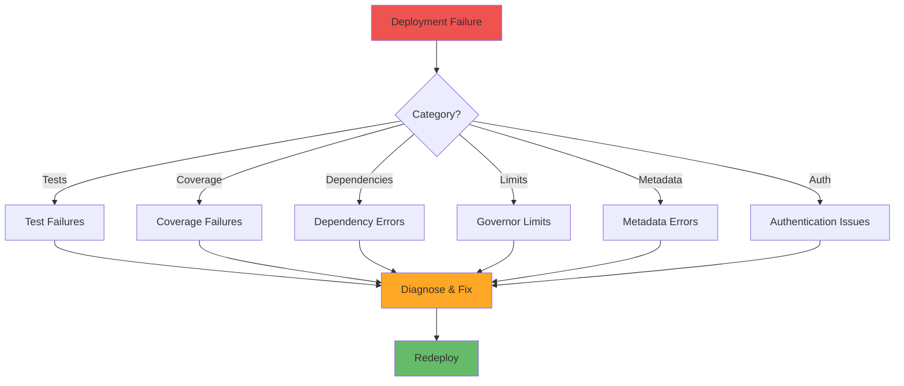

# Dealing with Deployment Failures

**Learning Objective**: Troubleshoot common deployment failures quickly, recover gracefully, and prevent future occurrences.

## Overview

Deployments fail. Tests fail. Dependencies break. When your CI/CD pipeline turns red, you need to diagnose fast, fix fast, and deploy fast. This guide teaches you how to handle the most common failure scenarios systematically.

## Common Failure Categories



## Failure Detection and Notification

### Automated Failure Detection

```yaml
name: Detect and Report Failures

on:
  workflow_run:
    workflows: ["Production Deploy"]
    types: [completed]

jobs:
  analyze-failure:
    if: ${{ github.event.workflow_run.conclusion == 'failure' }}
    runs-on: ubuntu-latest
    steps:
      - uses: actions/checkout@v4

      - name: Download Logs
        uses: actions/download-artifact@v4
        with:
          name: deployment-logs
          run-id: ${{ github.event.workflow_run.id }}

      - name: Analyze Failure
        run: |
          # Parse deployment error
          if [ -f "deploy-result.json" ]; then
            ERROR_MSG=$(jq -r '.result.details.componentFailures[0].problemType' deploy-result.json 2>/dev/null || echo "Unknown")
            FAILED_COMPONENT=$(jq -r '.result.details.componentFailures[0].fullName' deploy-result.json 2>/dev/null || echo "Unknown")

            echo "ERROR_TYPE=$ERROR_MSG" >> $GITHUB_ENV
            echo "FAILED_COMPONENT=$FAILED_COMPONENT" >> $GITHUB_ENV
          fi

      - name: Create Failure Report
        run: |
          cat > failure-report.md << 'EOF'
          ## 🚨 Deployment Failure Report

          **Workflow**: ${{ github.event.workflow_run.name }}
          **Run ID**: ${{ github.event.workflow_run.id }}
          **Branch**: ${{ github.event.workflow_run.head_branch }}
          **Error Type**: ${{ env.ERROR_TYPE }}
          **Failed Component**: ${{ env.FAILED_COMPONENT }}

          ### Quick Actions
          - [View Workflow Run](${{ github.event.workflow_run.html_url }})
          - [View Logs](${{ github.event.workflow_run.html_url }}/attempts/1)

          ### Next Steps
          1. Review error details above
          2. Check troubleshooting guide for ${{ env.ERROR_TYPE }}
          3. Fix and retry deployment
          EOF

          cat failure-report.md >> $GITHUB_STEP_SUMMARY

      - name: Notify Team
        run: |
          curl -X POST ${{ secrets.SLACK_WEBHOOK }} \
            -H 'Content-Type: application/json' \
            -d '{
              "text": "🚨 Deployment Failed",
              "attachments": [{
                "color": "danger",
                "fields": [
                  {"title": "Error Type", "value": "${{ env.ERROR_TYPE }}", "short": true},
                  {"title": "Component", "value": "${{ env.FAILED_COMPONENT }}", "short": true},
                  {"title": "Branch", "value": "${{ github.event.workflow_run.head_branch }}", "short": true},
                  {"title": "Author", "value": "${{ github.event.workflow_run.actor.login }}", "short": true}
                ],
                "actions": [{
                  "type": "button",
                  "text": "View Logs",
                  "url": "${{ github.event.workflow_run.html_url }}"
                }]
              }]
            }'
```

## Test Failures

### Diagnosing Test Failures

```yaml
- name: Analyze Test Failures
  if: failure()
  run: |
    echo "## ❌ Test Failure Analysis" >> $GITHUB_STEP_SUMMARY
    echo "" >> $GITHUB_STEP_SUMMARY

    # Parse test results
    if [ -f "test-results/test-result.json" ]; then
      # Get failed test details
      jq -r '.result.tests[] | select(.Outcome == "Fail") | "### \(.FullName)\n\n**Error**: \(.Message)\n\n**Stack Trace**:\n```\n\(.StackTrace)\n```\n"' \
        test-results/test-result.json >> $GITHUB_STEP_SUMMARY

      # Count failures by class
      echo "" >> $GITHUB_STEP_SUMMARY
      echo "### Failure Summary" >> $GITHUB_STEP_SUMMARY
      jq -r '.result.tests[] | select(.Outcome == "Fail") | .ApexClass.Name' test-results/test-result.json | \
        sort | uniq -c | while read count class; do
          echo "- $class: $count failures" >> $GITHUB_STEP_SUMMARY
        done
    fi

- name: Extract Failure Patterns
  if: failure()
  run: |
    # Common failure patterns
    if grep -q "System.NullPointerException" test-results/test-result.json; then
      echo "🔍 **Pattern**: Null Pointer Exception detected" >> $GITHUB_STEP_SUMMARY
      echo "- Check for null values before dereferencing" >> $GITHUB_STEP_SUMMARY
      echo "- Review test data setup" >> $GITHUB_STEP_SUMMARY
    fi

    if grep -q "UNABLE_TO_LOCK_ROW" test-results/test-result.json; then
      echo "🔍 **Pattern**: Record locking issue" >> $GITHUB_STEP_SUMMARY
      echo "- Tests may be running concurrently" >> $GITHUB_STEP_SUMMARY
      echo "- Add @isTest(SeeAllData=false)" >> $GITHUB_STEP_SUMMARY
    fi

    if grep -q "System.LimitException" test-results/test-result.json; then
      echo "🔍 **Pattern**: Governor limit exceeded" >> $GITHUB_STEP_SUMMARY
      echo "- Review SOQL queries in loops" >> $GITHUB_STEP_SUMMARY
      echo "- Consider bulkification" >> $GITHUB_STEP_SUMMARY
    fi
```

### Retry Failed Tests

```yaml
- name: Run Tests
  id: initial-tests
  continue-on-error: true
  run: |
    sf apex run test \
      --target-org target-org \
      --code-coverage \
      --result-format json \
      --output-dir ./test-results \
      --wait 60 \
      --test-level RunLocalTests

- name: Retry Failed Tests
  if: steps.initial-tests.outcome == 'failure'
  run: |
    echo "⚠️ Initial test run failed. Retrying failed tests..." >> $GITHUB_STEP_SUMMARY

    # Get list of failed tests
    FAILED_TESTS=$(jq -r '.result.tests[] | select(.Outcome == "Fail") | .FullName' test-results/test-result.json | tr '\n' ',' | sed 's/,$//')

    if [ -n "$FAILED_TESTS" ]; then
      echo "Retrying: $FAILED_TESTS"

      # Retry only failed tests
      sf apex run test \
        --target-org target-org \
        --tests "$FAILED_TESTS" \
        --result-format json \
        --output-dir ./test-results-retry \
        --wait 30

      # Check if retry succeeded
      RETRY_FAILURES=$(jq -r '.result.summary.failing' test-results-retry/test-result.json)

      if [ "$RETRY_FAILURES" -eq 0 ]; then
        echo "✅ All tests passed on retry" >> $GITHUB_STEP_SUMMARY
      else
        echo "❌ $RETRY_FAILURES tests still failing after retry" >> $GITHUB_STEP_SUMMARY
        exit 1
      fi
    fi
```

## Coverage Failures

### Diagnose Coverage Issues

```yaml
- name: Analyze Coverage Failure
  if: failure()
  run: |
    echo "## 📊 Code Coverage Analysis" >> $GITHUB_STEP_SUMMARY
    echo "" >> $GITHUB_STEP_SUMMARY

    ORG_COVERAGE=$(jq -r '.result.summary.orgWideCoverage' test-results/test-result.json | tr -d '%')
    REQUIRED_COVERAGE=75

    echo "**Current Coverage**: ${ORG_COVERAGE}%" >> $GITHUB_STEP_SUMMARY
    echo "**Required Coverage**: ${REQUIRED_COVERAGE}%" >> $GITHUB_STEP_SUMMARY
    echo "" >> $GITHUB_STEP_SUMMARY

    # Find classes with low coverage
    echo "### Classes Below 75% Coverage" >> $GITHUB_STEP_SUMMARY

    jq -r '.result.coverage.coverage[] | select(.coveredPercent < 75) | "- **\(.name)**: \(.coveredPercent)% (\(.numLocations - .numLocationsNotCovered)/\(.numLocations) lines)"' \
      test-results/test-result.json >> $GITHUB_STEP_SUMMARY

    echo "" >> $GITHUB_STEP_SUMMARY
    echo "### Recommendations" >> $GITHUB_STEP_SUMMARY
    echo "1. Add test methods for classes with low coverage" >> $GITHUB_STEP_SUMMARY
    echo "2. Review test assertions for quality" >> $GITHUB_STEP_SUMMARY
    echo "3. Consider testing edge cases" >> $GITHUB_STEP_SUMMARY
```

### Auto-Generate Test Stubs

```python
# generate_test_stubs.py
import json
import sys

def generate_test_stub(class_name, coverage_data):
    """Generate test stub for a class with low coverage"""

    template = f'''@isTest
public class {class_name}Test {{

    @TestSetup
    static void setupTestData() {{
        // TODO: Create test data
    }}

    @isTest
    static void testMainFlow() {{
        // TODO: Test main functionality
        Test.startTest();

        // Call methods from {class_name}

        Test.stopTest();

        // TODO: Add assertions
        System.assert(true, 'Test not implemented');
    }}

    @isTest
    static void testErrorHandling() {{
        // TODO: Test error scenarios
        Test.startTest();

        try {{
            // Call methods that should fail

            System.assert(false, 'Expected exception not thrown');
        }} catch (Exception e) {{
            System.assert(true, 'Exception handled correctly');
        }}

        Test.stopTest();
    }}
}}
'''
    return template

if __name__ == '__main__':
    # Read test results
    with open('test-results/test-result.json', 'r') as f:
        results = json.load(f)

    # Find classes with low coverage
    low_coverage_classes = []
    for coverage in results['result']['coverage']['coverage']:
        if coverage['coveredPercent'] < 75:
            low_coverage_classes.append(coverage['name'])

    # Generate test stubs
    for class_name in low_coverage_classes:
        test_stub = generate_test_stub(class_name, {})
        print(f"\n{'='*60}")
        print(f"Test stub for {class_name}:")
        print(f"{'='*60}")
        print(test_stub)
```

## Dependency Failures

### Missing Dependencies

```yaml
- name: Check Missing Dependencies
  if: failure()
  run: |
    # Extract missing component errors
    if grep -q "No.*named" deploy-result.json; then
      echo "## ⚠️ Missing Dependencies Detected" >> $GITHUB_STEP_SUMMARY
      echo "" >> $GITHUB_STEP_SUMMARY

      # Parse missing components
      jq -r '.result.details.componentFailures[] | select(.problemType == "Error") | "- \(.fullName): \(.problem)"' \
        deploy-result.json >> $GITHUB_STEP_SUMMARY

      echo "" >> $GITHUB_STEP_SUMMARY
      echo "### Possible Solutions" >> $GITHUB_STEP_SUMMARY
      echo "1. Deploy dependencies first" >> $GITHUB_STEP_SUMMARY
      echo "2. Check if components exist in target org" >> $GITHUB_STEP_SUMMARY
      echo "3. Review package.xml for missing metadata" >> $GITHUB_STEP_SUMMARY
    fi

- name: Deploy Dependencies First
  if: failure()
  run: |
    # Try deploying foundation components first
    cat > foundation-package.xml << 'EOF'
    <?xml version="1.0" encoding="UTF-8"?>
    <Package xmlns="http://soap.sforce.com/2006/04/metadata">
        <types>
            <members>*</members>
            <name>CustomObject</name>
        </types>
        <types>
            <members>*</members>
            <name>CustomField</name>
        </types>
        <version>59.0</version>
    </Package>
    EOF

    echo "Deploying foundation components first..."
    sf project deploy start \
      --target-org target-org \
      --manifest foundation-package.xml \
      --test-level NoTestRun \
      --wait 30

    # Then retry full deployment
    sf project deploy start \
      --target-org target-org \
      --manifest manifest/package.xml \
      --test-level RunLocalTests \
      --wait 60
```

## Governor Limit Failures

### Detect Limit Violations

```yaml
- name: Check Governor Limits
  if: failure()
  run: |
    if grep -q "LIMIT_EXCEEDED" test-results/test-result.json; then
      echo "## 🚫 Governor Limit Exceeded" >> $GITHUB_STEP_SUMMARY
      echo "" >> $GITHUB_STEP_SUMMARY

      # Extract limit type
      LIMIT_TYPE=$(jq -r '.result.tests[] | select(.Message | contains("LIMIT_EXCEEDED")) | .Message' \
        test-results/test-result.json | head -1)

      echo "**Limit**: $LIMIT_TYPE" >> $GITHUB_STEP_SUMMARY
      echo "" >> $GITHUB_STEP_SUMMARY

      # Provide specific guidance
      if echo "$LIMIT_TYPE" | grep -q "SOQL"; then
        echo "### SOQL Query Limit Exceeded" >> $GITHUB_STEP_SUMMARY
        echo "- Move SOQL queries outside loops" >> $GITHUB_STEP_SUMMARY
        echo "- Use collection queries instead of single record queries" >> $GITHUB_STEP_SUMMARY
        echo "- Consider using @future or Queueable for large operations" >> $GITHUB_STEP_SUMMARY
      elif echo "$LIMIT_TYPE" | grep -q "CPU"; then
        echo "### CPU Time Limit Exceeded" >> $GITHUB_STEP_SUMMARY
        echo "- Review complex loops and iterations" >> $GITHUB_STEP_SUMMARY
        echo "- Consider Platform Events for async processing" >> $GITHUB_STEP_SUMMARY
        echo "- Profile code to find bottlenecks" >> $GITHUB_STEP_SUMMARY
      elif echo "$LIMIT_TYPE" | grep -q "HEAP"; then
        echo "### Heap Size Limit Exceeded" >> $GITHUB_STEP_SUMMARY
        echo "- Process records in smaller batches" >> $GITHUB_STEP_SUMMARY
        echo "- Clear collections when no longer needed" >> $GITHUB_STEP_SUMMARY
        echo "- Use SOQL FOR loops for large datasets" >> $GITHUB_STEP_SUMMARY
      fi
    fi
```

## Metadata Validation Errors

### Parse Validation Errors

```yaml
- name: Parse Metadata Errors
  if: failure()
  run: |
    echo "## ⚠️ Metadata Validation Errors" >> $GITHUB_STEP_SUMMARY
    echo "" >> $GITHUB_STEP_SUMMARY

    # Extract all component failures
    jq -r '.result.details.componentFailures[] | "### \(.componentType): \(.fullName)\n\n**Problem**: \(.problem)\n\n**Line**: \(.lineNumber // "N/A")\n"' \
      deploy-result.json >> $GITHUB_STEP_SUMMARY

    # Check for common issues
    if jq -e '.result.details.componentFailures[] | select(.problem | contains("duplicate"))' deploy-result.json > /dev/null; then
      echo "### 🔍 Duplicate Component Detected" >> $GITHUB_STEP_SUMMARY
      echo "- Check for duplicate XML files" >> $GITHUB_STEP_SUMMARY
      echo "- Review package.xml for duplicate entries" >> $GITHUB_STEP_SUMMARY
    fi

    if jq -e '.result.details.componentFailures[] | select(.problem | contains("Invalid"))' deploy-result.json > /dev/null; then
      echo "### 🔍 Invalid Metadata Format" >> $GITHUB_STEP_SUMMARY
      echo "- Validate XML syntax" >> $GITHUB_STEP_SUMMARY
      echo "- Check API version compatibility" >> $GITHUB_STEP_SUMMARY
    fi
```

## Authentication Failures

### Debug Auth Issues

```yaml
- name: Validate Authentication
  run: |
    # Check if auth file exists
    if [ ! -f "auth.txt" ]; then
      echo "❌ Auth file not found" >> $GITHUB_STEP_SUMMARY
      exit 1
    fi

    # Verify auth URL format
    if ! grep -q "^force://" auth.txt; then
      echo "❌ Invalid auth URL format" >> $GITHUB_STEP_SUMMARY
      exit 1
    fi

    # Try authentication
    if ! sf org login sfdx-url --sfdx-url-file auth.txt --alias test-auth 2>&1 | tee auth-output.txt; then
      echo "## ❌ Authentication Failed" >> $GITHUB_STEP_SUMMARY
      echo "" >> $GITHUB_STEP_SUMMARY
      echo "**Error**:" >> $GITHUB_STEP_SUMMARY
      echo '```' >> $GITHUB_STEP_SUMMARY
      cat auth-output.txt >> $GITHUB_STEP_SUMMARY
      echo '```' >> $GITHUB_STEP_SUMMARY
      echo "" >> $GITHUB_STEP_SUMMARY
      echo "### Troubleshooting Steps" >> $GITHUB_STEP_SUMMARY
      echo "1. Verify SFDX_AUTH_URL secret is correct" >> $GITHUB_STEP_SUMMARY
      echo "2. Check if connected app is approved" >> $GITHUB_STEP_SUMMARY
      echo "3. Verify org hasn't been refreshed" >> $GITHUB_STEP_SUMMARY
      echo "4. Regenerate auth URL if needed" >> $GITHUB_STEP_SUMMARY
      exit 1
    fi

    echo "✅ Authentication successful" >> $GITHUB_STEP_SUMMARY

    # Display org info
    sf org display --target-org test-auth --json | \
      jq -r '"**Org**: " + .result.alias + "\n**ID**: " + .result.id' >> $GITHUB_STEP_SUMMARY
```

## Automatic Recovery Strategies

### Retry with Exponential Backoff

```yaml
- name: Deploy with Retry
  uses: nick-fields/retry@v2
  with:
    timeout_minutes: 45
    max_attempts: 3
    retry_wait_seconds: 300  # 5 minutes between retries
    command: |
      sf project deploy start \
        --target-org target-org \
        --manifest manifest/package.xml \
        --test-level RunLocalTests \
        --wait 60
```

### Fallback to Validation-Only

```yaml
- name: Full Deployment
  id: full-deploy
  continue-on-error: true
  run: |
    sf project deploy start \
      --target-org target-org \
      --manifest manifest/package.xml \
      --test-level RunLocalTests \
      --wait 60

- name: Fallback to Validation
  if: steps.full-deploy.outcome == 'failure'
  run: |
    echo "⚠️ Deployment failed. Running validation instead..." >> $GITHUB_STEP_SUMMARY

    # Run check-only deployment
    sf project deploy validate \
      --target-org target-org \
      --manifest manifest/package.xml \
      --test-level RunLocalTests \
      --wait 60

    echo "✅ Validation completed. Review errors and retry." >> $GITHUB_STEP_SUMMARY
    exit 1  # Still fail the workflow
```

### Partial Deployment

```yaml
- name: Try Partial Deployment
  if: failure()
  run: |
    echo "Attempting partial deployment..." >> $GITHUB_STEP_SUMMARY

    # Deploy classes only first
    sf project deploy start \
      --target-org target-org \
      --metadata ApexClass \
      --test-level NoTestRun \
      --wait 30

    # Then deploy everything else
    sf project deploy start \
      --target-org target-org \
      --manifest manifest/package.xml \
      --ignore-conflicts \
      --test-level RunLocalTests \
      --wait 60
```

## Failure Playbooks

### Quick Reference Guide

```yaml
- name: Generate Failure Playbook
  if: failure()
  run: |
    # Determine failure type
    FAILURE_TYPE="unknown"

    if grep -q "Test failures" deploy-result.json; then
      FAILURE_TYPE="test"
    elif grep -q "coverage" deploy-result.json; then
      FAILURE_TYPE="coverage"
    elif grep -q "No.*named" deploy-result.json; then
      FAILURE_TYPE="dependency"
    elif grep -q "LIMIT_EXCEEDED" test-results/test-result.json; then
      FAILURE_TYPE="limits"
    fi

    # Generate playbook
    cat > playbook.md << EOF
    # Failure Recovery Playbook

    ## Failure Type: $FAILURE_TYPE

    $(case "$FAILURE_TYPE" in
      test)
        echo "### Test Failure Recovery Steps"
        echo "1. Review failed test output above"
        echo "2. Run tests locally: \`sf apex run test --tests FailedTestClass\`"
        echo "3. Fix code or test logic"
        echo "4. Commit and push fix"
        ;;
      coverage)
        echo "### Coverage Failure Recovery Steps"
        echo "1. Identify classes with low coverage"
        echo "2. Add test methods to test classes"
        echo "3. Ensure tests have meaningful assertions"
        echo "4. Run coverage check locally"
        ;;
      dependency)
        echo "### Dependency Failure Recovery Steps"
        echo "1. Deploy dependencies first (objects, fields)"
        echo "2. Check target org for required metadata"
        echo "3. Use phased deployment strategy"
        echo "4. Review package.xml completeness"
        ;;
      limits)
        echo "### Governor Limit Recovery Steps"
        echo "1. Bulkify code (remove SOQL from loops)"
        echo "2. Process records in smaller batches"
        echo "3. Use async processing (@future/Queueable)"
        echo "4. Profile code to find bottlenecks"
        ;;
    esac)
    EOF

    cat playbook.md >> $GITHUB_STEP_SUMMARY
```

## Post-Mortem Analysis

### Auto-Create Post-Mortem

```yaml
- name: Create Post-Mortem Issue
  if: failure()
  run: |
    gh issue create \
      --title "Deployment Failure Post-Mortem: ${{ github.run_id }}" \
      --body "$(cat <<'EOF'
    ## Deployment Failure Analysis

    **Workflow Run**: ${{ github.server_url }}/${{ github.repository }}/actions/runs/${{ github.run_id }}
    **Branch**: ${{ github.ref_name }}
    **Commit**: ${{ github.sha }}
    **Author**: ${{ github.actor }}

    ## Failure Summary
    [Summarize what failed]

    ## Root Cause
    [What caused the failure?]

    ## Impact
    - Deployment delayed by: [X hours]
    - Affected environments: [list]

    ## Resolution
    [How was it fixed?]

    ## Prevention
    - [ ] Add automated check for this scenario
    - [ ] Update documentation
    - [ ] Team training
    - [ ] Process improvement

    ## Action Items
    - [ ] [Action 1] - @assignee
    - [ ] [Action 2] - @assignee
    EOF
    )" \
      --label "post-mortem" \
      --label "deployment-failure"
```

## Best Practices

### 1. Fail Fast with Early Validation

```yaml
jobs:
  quick-checks:
    runs-on: ubuntu-latest
    steps:
      - name: Validate XML Syntax
        run: find force-app -name "*.xml" -exec xmllint --noout {} \;

      - name: Run Linter
        run: npm run lint

  deploy:
    needs: quick-checks  # Only deploy if quick checks pass
    steps:
      - name: Deploy to Org
        run: sf project deploy start ...
```

### 2. Save Deployment Artifacts

```yaml
- name: Save Deployment Artifacts
  if: always()
  uses: actions/upload-artifact@v4
  with:
    name: deployment-artifacts-${{ github.run_id }}
    path: |
      deploy-result.json
      test-results/
      *.log
    retention-days: 30
```

### 3. Implement Circuit Breaker

```yaml
- name: Check Recent Failure Rate
  run: |
    # Get last 5 workflow runs
    RECENT_FAILURES=$(gh run list --workflow=deploy.yml --limit 5 --json conclusion \
      --jq '[.[] | select(.conclusion=="failure")] | length')

    if [ "$RECENT_FAILURES" -ge 3 ]; then
      echo "🚨 Circuit breaker triggered: 3+ recent failures" >> $GITHUB_STEP_SUMMARY
      echo "Manual review required before deployment" >> $GITHUB_STEP_SUMMARY
      exit 1
    fi
```

## Interview Talking Points

1. **"We have automated failure detection and classification"**
   - Shows systematic approach
   - Demonstrates engineering maturity

2. **"Failed tests are automatically retried to rule out flaky tests"**
   - Shows understanding of test reliability
   - Demonstrates pragmatic approach

3. **"We generate failure playbooks automatically based on error type"**
   - Shows proactive problem-solving
   - Demonstrates developer experience focus

4. **"Every deployment failure triggers a post-mortem for learning"**
   - Shows continuous improvement culture
   - Demonstrates accountability

5. **"We use circuit breakers to prevent cascading failures"**
   - Shows reliability engineering knowledge
   - Demonstrates risk management

## Next Steps

- **Next Guide**: [Communication Patterns](./communication-patterns) - Keep stakeholders informed
- **Related**: [Rollback Strategies](../pipelines/rollback-strategies) - Automated recovery
- **Related**: [Emergency Hotfixes](./emergency-hotfixes) - Fast fixes for production

---

**Key Takeaway**: Failures are learning opportunities. Detect fast, diagnose systematically, document thoroughly, and prevent recurrence. The goal isn't zero failures - it's fast recovery and continuous improvement.
