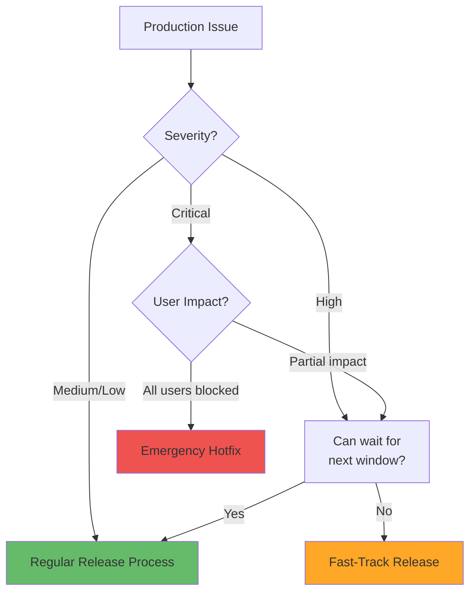

# Emergency Hotfixes vs. Planned Releases

**Learning Objective**: Execute emergency hotfixes safely while maintaining DevOps discipline and process integrity.

## Overview

Production is down. Users can't access critical functionality. You need to deploy a fix **now**. But skipping your CI/CD process entirely creates technical debt and risk. This guide shows you how to handle emergencies without abandoning DevOps best practices.

## When to Use Hotfix Process

### Decision Matrix



### Hotfix Criteria

Use emergency hotfix process **only** when:

1. **Production is broken** for all or most users
2. **Business-critical functionality** is unavailable
3. **Financial impact** is significant (>$10K/hour)
4. **Security vulnerability** actively being exploited
5. **Data corruption** is occurring

**Do NOT use** for:
- Feature requests (even from executives)
- Non-critical bugs
- Performance optimizations
- UI tweaks
- Issues that can wait for next release window

## Hotfix Workflow

### Git Strategy: Hotfix Branch

```bash
# Create hotfix branch from production tag
git checkout tags/v1.2.3
git checkout -b hotfix/fix-payment-processor

# Make the minimal fix
# Only change what's absolutely necessary

# Commit with clear message
git commit -m "hotfix: fix payment processor null pointer exception

Critical bug causing payment failures for all transactions.

Issue: #12345
Severity: Critical
Impact: All users"

# Push hotfix branch
git push origin hotfix/fix-payment-processor
```

### Hotfix Branch Workflow

```yaml
name: Emergency Hotfix

on:
  push:
    branches:
      - 'hotfix/**'

jobs:
  validate-hotfix:
    runs-on: ubuntu-latest
    steps:
      - uses: actions/checkout@v4

      - name: Verify Hotfix Criteria
        run: |
          echo "## 🚨 Emergency Hotfix Validation" >> $GITHUB_STEP_SUMMARY
          echo "" >> $GITHUB_STEP_SUMMARY

          # Check branch name contains issue number
          BRANCH_NAME="${{ github.ref_name }}"
          if ! echo "$BRANCH_NAME" | grep -qE "hotfix/"; then
            echo "❌ Branch must start with 'hotfix/'" >> $GITHUB_STEP_SUMMARY
            exit 1
          fi

          # Check commit message for severity
          COMMIT_MSG=$(git log -1 --pretty=%B)
          if ! echo "$COMMIT_MSG" | grep -iqE "(critical|severity|emergency)"; then
            echo "⚠️ Commit message should include severity level" >> $GITHUB_STEP_SUMMARY
          fi

          echo "✅ Hotfix validation passed" >> $GITHUB_STEP_SUMMARY

      - name: Check Change Scope
        run: |
          # Hotfixes should be minimal
          CHANGED_FILES=$(git diff --name-only origin/main...HEAD | wc -l)

          echo "### Change Scope" >> $GITHUB_STEP_SUMMARY
          echo "Files changed: $CHANGED_FILES" >> $GITHUB_STEP_SUMMARY

          if [ "$CHANGED_FILES" -gt 5 ]; then
            echo "⚠️ **Warning**: Hotfix changes $CHANGED_FILES files" >> $GITHUB_STEP_SUMMARY
            echo "Consider if this should be a regular release instead" >> $GITHUB_STEP_SUMMARY
          fi

      - name: Notify Incident Channel
        run: |
          curl -X POST ${{ secrets.SLACK_INCIDENT_WEBHOOK }} \
            -H 'Content-Type: application/json' \
            -d '{
              "text": "🚨 Emergency hotfix initiated",
              "attachments": [{
                "color": "danger",
                "fields": [
                  {"title": "Branch", "value": "${{ github.ref_name }}", "short": true},
                  {"title": "Author", "value": "${{ github.actor }}", "short": true},
                  {"title": "Repository", "value": "${{ github.repository }}", "short": false}
                ]
              }]
            }'

  fast-validation:
    needs: validate-hotfix
    runs-on: ubuntu-latest
    steps:
      - uses: actions/checkout@v4

      - name: Install Salesforce CLI
        run: npm install -g @salesforce/cli

      - name: Authenticate to Validation Org
        run: |
          echo "${{ secrets.SANDBOX_AUTH_URL }}" > auth.txt
          sf org login sfdx-url --sfdx-url-file auth.txt --alias hotfix-validation

      - name: Run Quick Validation
        run: |
          # Validate deployment with minimal tests
          sf project deploy validate \
            --target-org hotfix-validation \
            --manifest manifest/package.xml \
            --test-level RunSpecifiedTests \
            --tests $(bash scripts/find_affected_tests.sh) \
            --wait 15

      - name: Code Quality Check
        run: |
          # Run security scanner
          sf scanner run \
            --target "force-app" \
            --format json \
            --outfile security-results.json

          # Check for critical issues only
          CRITICAL_ISSUES=$(jq '[.[] | select(.severity == "1")] | length' security-results.json)

          if [ "$CRITICAL_ISSUES" -gt 0 ]; then
            echo "❌ Critical security issues found"
            exit 1
          fi

  request-emergency-approval:
    needs: fast-validation
    runs-on: ubuntu-latest
    steps:
      - name: Request Urgent Approval
        uses: trstringer/manual-approval@v1
        with:
          secret: ${{ github.TOKEN }}
          approvers: on-call-engineer,tech-lead
          minimum-approvals: 1  # Only 1 approval for emergencies
          issue-title: "🚨 URGENT: Hotfix Approval Required"
          issue-body: |
            **Emergency Hotfix**: ${{ github.ref_name }}

            **Validation**: Passed
            **Changed Files**: See PR for details

            **This is an emergency hotfix requiring immediate approval.**

  deploy-to-production:
    needs: request-emergency-approval
    runs-on: ubuntu-latest
    environment:
      name: production
      url: https://production.salesforce.com
    steps:
      - uses: actions/checkout@v4

      - name: Install Salesforce CLI
        run: npm install -g @salesforce/cli

      - name: Authenticate to Production
        run: |
          echo "${{ secrets.PROD_AUTH_URL }}" > auth.txt
          sf org login sfdx-url --sfdx-url-file auth.txt --alias production

      - name: Deploy Hotfix
        id: deploy
        run: |
          echo "## 🚀 Production Hotfix Deployment" >> $GITHUB_STEP_SUMMARY

          # Deploy with minimal tests for speed
          sf project deploy start \
            --target-org production \
            --manifest manifest/package.xml \
            --test-level RunSpecifiedTests \
            --tests $(bash scripts/find_affected_tests.sh) \
            --wait 30 \
            --json > deploy-result.json

          DEPLOY_ID=$(jq -r '.result.id' deploy-result.json)
          echo "deploy_id=$DEPLOY_ID" >> $GITHUB_OUTPUT

          echo "**Deploy ID**: $DEPLOY_ID" >> $GITHUB_STEP_SUMMARY

      - name: Verify Deployment
        run: |
          # Quick smoke test
          bash scripts/smoke_test.sh production

      - name: Notify Success
        if: success()
        run: |
          curl -X POST ${{ secrets.SLACK_INCIDENT_WEBHOOK }} \
            -H 'Content-Type: application/json' \
            -d '{
              "text": "✅ Emergency hotfix deployed successfully",
              "attachments": [{
                "color": "good",
                "fields": [
                  {"title": "Branch", "value": "${{ github.ref_name }}", "short": true},
                  {"title": "Deploy ID", "value": "${{ steps.deploy.outputs.deploy_id }}", "short": true}
                ]
              }]
            }'

      - name: Create Incident Report
        run: |
          gh issue create \
            --title "Incident Report: ${{ github.ref_name }}" \
            --body "$(cat <<'EOF'
          ## Incident Details

          **Hotfix Branch**: ${{ github.ref_name }}
          **Deploy ID**: ${{ steps.deploy.outputs.deploy_id }}
          **Deployed By**: ${{ github.actor }}
          **Timestamp**: $(date -u)

          ## Post-Deployment Tasks
          - [ ] Merge hotfix to main
          - [ ] Merge hotfix to develop
          - [ ] Full regression tests
          - [ ] Update runbook
          - [ ] Incident retrospective

          ## Impact Assessment
          [To be filled by incident commander]
          EOF
          )" \
            --label "incident" \
            --label "hotfix" \
            --assignee "${{ github.actor }}"

  merge-back-to-main:
    needs: deploy-to-production
    runs-on: ubuntu-latest
    steps:
      - uses: actions/checkout@v4
        with:
          fetch-depth: 0

      - name: Merge Hotfix to Main
        run: |
          git config user.name "GitHub Actions"
          git config user.email "actions@github.com"

          # Checkout main
          git fetch origin main
          git checkout main

          # Merge hotfix
          git merge --no-ff ${{ github.ref_name }} \
            -m "Merge hotfix: ${{ github.ref_name }}"

          # Push to main
          git push origin main

      - name: Merge Hotfix to Develop
        run: |
          # Checkout develop
          git fetch origin develop
          git checkout develop

          # Merge hotfix
          git merge --no-ff ${{ github.ref_name }} \
            -m "Merge hotfix: ${{ github.ref_name }}"

          # Push to develop
          git push origin develop

      - name: Tag Release
        run: |
          # Get current version
          CURRENT_VERSION=$(git describe --tags --abbrev=0 2>/dev/null || echo "v1.0.0")

          # Increment patch version
          NEW_VERSION=$(echo "$CURRENT_VERSION" | awk -F. '{$NF = $NF + 1;} 1' | sed 's/ /./g')

          # Create tag
          git tag -a "$NEW_VERSION" \
            -m "Hotfix release: ${{ github.ref_name }}"

          git push origin "$NEW_VERSION"

          echo "Created release tag: $NEW_VERSION"
```

## Fast-Track Testing

### Minimal Test Strategy

```bash
#!/bin/bash
# find_affected_tests.sh - Find only tests related to changed files

# Get changed files
CHANGED_FILES=$(git diff --name-only origin/main...HEAD)

# Find related test classes
TEST_CLASSES=()

for file in $CHANGED_FILES; do
  if [[ $file == *".cls" ]]; then
    # Get base name without extension
    CLASS_NAME=$(basename "$file" .cls)

    # Look for corresponding test class
    TEST_CLASS="${CLASS_NAME}Test"

    # Check if test class exists
    if [ -f "force-app/main/default/classes/${TEST_CLASS}.cls" ]; then
      TEST_CLASSES+=("$TEST_CLASS")
    fi
  fi
done

# Output comma-separated list
IFS=','
echo "${TEST_CLASSES[*]}"
```

### Quick Smoke Tests

```bash
#!/bin/bash
# smoke_test.sh - Quick validation after deployment

TARGET_ORG=$1

echo "Running smoke tests on $TARGET_ORG..."

# Test 1: Check if org is accessible
echo "1. Checking org accessibility..."
if ! sf org display --target-org "$TARGET_ORG" > /dev/null 2>&1; then
  echo "❌ Cannot access org"
  exit 1
fi
echo "✅ Org accessible"

# Test 2: Query critical objects
echo "2. Checking critical objects..."
ACCOUNT_COUNT=$(sf data query \
  --query "SELECT COUNT() FROM Account" \
  --target-org "$TARGET_ORG" \
  --json | jq '.result.totalSize')

if [ -z "$ACCOUNT_COUNT" ]; then
  echo "❌ Cannot query Account object"
  exit 1
fi
echo "✅ Can query Account ($ACCOUNT_COUNT records)"

# Test 3: Check apex execution
echo "3. Testing Apex execution..."
sf apex run \
  --file scripts/smoke_test.apex \
  --target-org "$TARGET_ORG" > /dev/null

if [ $? -ne 0 ]; then
  echo "❌ Apex execution failed"
  exit 1
fi
echo "✅ Apex execution successful"

# Test 4: Check recent errors
echo "4. Checking for errors..."
ERROR_COUNT=$(sf data query \
  --query "SELECT COUNT() FROM ApexLog WHERE Request = 'API' AND Status = 'Failure' AND CreatedDate = TODAY" \
  --target-org "$TARGET_ORG" \
  --json | jq '.result.totalSize')

if [ "$ERROR_COUNT" -gt 10 ]; then
  echo "⚠️ Warning: $ERROR_COUNT errors detected today"
else
  echo "✅ Error count normal: $ERROR_COUNT"
fi

echo ""
echo "✅ All smoke tests passed"
```

## Comparing Hotfix vs. Regular Release

### Process Comparison

| Aspect | Emergency Hotfix | Regular Release |
|--------|-----------------|-----------------|
| **Branching** | From production tag | From develop branch |
| **Testing** | Affected tests only | Full test suite |
| **Approval** | 1 approver, urgent | 2+ approvers, scheduled |
| **Deployment Window** | Immediate | Scheduled window |
| **Code Review** | Post-deployment OK | Required before merge |
| **Documentation** | After deployment | Before deployment |
| **Risk Assessment** | Fast-track | Full analysis |
| **Rollback Plan** | Manual if needed | Automated |

### Cost-Benefit Analysis

```yaml
- name: Analyze Hotfix Trade-offs
  run: |
    echo "## ⚖️ Hotfix Trade-offs" >> $GITHUB_STEP_SUMMARY
    echo "" >> $GITHUB_STEP_SUMMARY

    echo "### Benefits" >> $GITHUB_STEP_SUMMARY
    echo "- ✅ Fast deployment (15-30 minutes)" >> $GITHUB_STEP_SUMMARY
    echo "- ✅ Minimal testing reduces time" >> $GITHUB_STEP_SUMMARY
    echo "- ✅ Single approval expedites process" >> $GITHUB_STEP_SUMMARY
    echo "" >> $GITHUB_STEP_SUMMARY

    echo "### Costs" >> $GITHUB_STEP_SUMMARY
    echo "- ⚠️ Higher risk (less testing)" >> $GITHUB_STEP_SUMMARY
    echo "- ⚠️ Technical debt (incomplete docs)" >> $GITHUB_STEP_SUMMARY
    echo "- ⚠️ Branch management overhead" >> $GITHUB_STEP_SUMMARY
    echo "- ⚠️ Post-deployment reconciliation needed" >> $GITHUB_STEP_SUMMARY
```

## Post-Hotfix Reconciliation

### Full Testing After Hotfix

```yaml
name: Post-Hotfix Full Validation

on:
  workflow_dispatch:
    inputs:
      hotfix_branch:
        description: 'Hotfix branch name'
        required: true

jobs:
  full-regression:
    runs-on: ubuntu-latest
    steps:
      - uses: actions/checkout@v4
        with:
          ref: main  # Test merged code

      - name: Run Full Test Suite
        run: |
          echo "${{ secrets.SANDBOX_AUTH_URL }}" > auth.txt
          sf org login sfdx-url --sfdx-url-file auth.txt --alias qa-full

          # Run ALL tests, not just affected ones
          sf apex run test \
            --target-org qa-full \
            --code-coverage \
            --result-format json \
            --output-dir ./test-results \
            --wait 60 \
            --test-level RunLocalTests

      - name: Validate Coverage
        run: |
          COVERAGE=$(jq -r '.result.summary.orgWideCoverage' ./test-results/test-result.json | tr -d '%')

          if (( $(echo "$COVERAGE < 75" | bc -l) )); then
            echo "❌ Coverage dropped below 75%"
            exit 1
          fi

      - name: Integration Tests
        run: |
          # Run integration test suite
          bash scripts/integration_tests.sh qa-full
```

### Documentation Catch-Up

```yaml
- name: Update Documentation
  run: |
    # Create documentation PR
    git checkout -b docs/hotfix-${{ inputs.hotfix_branch }}

    # Generate changelog entry
    cat >> CHANGELOG.md << 'EOF'
    ## Hotfix $(date +%Y-%m-%d)

    **Emergency Fix**: ${{ inputs.hotfix_branch }}

    ### Changes
    $(git log --oneline origin/main~1..origin/main)

    ### Impact
    [To be filled]

    ### Root Cause
    [To be filled]

    ### Prevention
    [To be filled]
    EOF

    git add CHANGELOG.md
    git commit -m "docs: add changelog for hotfix"
    git push origin docs/hotfix-${{ inputs.hotfix_branch }}

    gh pr create \
      --title "📝 Documentation: Hotfix ${{ inputs.hotfix_branch }}" \
      --body "Post-hotfix documentation update"
```

## Preventing Future Hotfixes

### Root Cause Analysis

```yaml
name: Hotfix Root Cause Analysis

on:
  workflow_dispatch:
    inputs:
      incident_number:
        description: 'Incident number'
        required: true

jobs:
  analyze:
    runs-on: ubuntu-latest
    steps:
      - name: Create RCA Template
        run: |
          gh issue create \
            --title "RCA: Incident ${{ inputs.incident_number }}" \
            --body "$(cat <<'EOF'
          ## Root Cause Analysis

          ### Incident Summary
          - **Date/Time**: [When did it occur?]
          - **Duration**: [How long was impact?]
          - **Impact**: [How many users affected?]

          ### Timeline
          1. [HH:MM] - Issue first detected
          2. [HH:MM] - Incident declared
          3. [HH:MM] - Hotfix deployed
          4. [HH:MM] - Issue resolved

          ### Root Cause
          [What was the underlying cause?]

          ### Contributing Factors
          - [Factor 1]
          - [Factor 2]

          ### Why Did This Happen?
          1. Why? [First level]
          2. Why? [Second level]
          3. Why? [Third level]
          4. Why? [Fourth level]
          5. Why? [Root cause]

          ### Prevention Measures
          - [ ] Add automated test for this scenario
          - [ ] Update validation rules
          - [ ] Improve monitoring/alerts
          - [ ] Update runbook
          - [ ] Team training

          ### Action Items
          - [ ] [Action 1] - Assigned to: @username
          - [ ] [Action 2] - Assigned to: @username
          EOF
          )" \
            --label "rca" \
            --label "high-priority"
```

### Monitoring Improvements

```yaml
- name: Add Monitoring for Issue
  run: |
    # Add synthetic test to prevent regression
    cat > force-app/main/default/classes/MonitorPaymentProcessor.cls << 'EOF'
    @isTest
    public class MonitorPaymentProcessor {
        @isTest
        static void testPaymentProcessorNotNull() {
            // Ensure the bug that caused hotfix cannot happen again
            PaymentProcessor processor = new PaymentProcessor();
            System.assertNotEquals(null, processor.getConfiguration(),
                'Payment processor configuration should never be null');
        }
    }
    EOF

    git add force-app/main/default/classes/MonitorPaymentProcessor.cls
    git commit -m "test: add regression test for payment processor hotfix"
    git push
```

## Emergency Runbook

### Quick Reference

```markdown
# Emergency Hotfix Runbook

## Prerequisites
- [ ] Incident declared in Slack #incidents channel
- [ ] On-call engineer available for approval
- [ ] Production access credentials available

## Steps

### 1. Create Hotfix Branch (2 min)
```bash
git checkout tags/$(git describe --tags --abbrev=0)
git checkout -b hotfix/describe-the-fix
```

### 2. Make Minimal Fix (10-30 min)
- Only fix the critical issue
- No refactoring
- No "while we're at it" changes

### 3. Push and Create PR (1 min)
```bash
git push origin hotfix/describe-the-fix
gh pr create --title "🚨 HOTFIX: describe the fix"
```

### 4. Wait for CI (5-10 min)
- Automated validation runs
- Security scan
- Affected tests only

### 5. Request Approval (1-5 min)
- Ping on-call engineer
- Explain severity and impact
- Get single approval

### 6. Deploy (10-15 min)
- Automated deployment to production
- Minimal test execution
- Smoke tests

### 7. Verify (5 min)
- Check deployment success
- Run smoke tests
- Monitor for errors

### 8. Communicate (2 min)
- Notify #incidents channel
- Update status page
- Inform stakeholders

### Total Time: ~30-60 minutes

## Post-Deployment (Next Business Day)

- [ ] Merge hotfix to main and develop
- [ ] Run full regression tests
- [ ] Update documentation
- [ ] Conduct RCA
- [ ] Add regression tests
```

## Real-World Example

```yaml
name: Payment Processor Hotfix

on:
  push:
    branches:
      - 'hotfix/payment-processor-*'

jobs:
  emergency-deploy:
    runs-on: ubuntu-latest
    steps:
      - uses: actions/checkout@v4

      - name: Validate Hotfix Scope
        run: |
          # Ensure only payment processor files changed
          CHANGED_FILES=$(git diff --name-only origin/main...HEAD)

          if echo "$CHANGED_FILES" | grep -qv "PaymentProcessor"; then
            echo "⚠️ Warning: Files changed outside PaymentProcessor"
            echo "$CHANGED_FILES"
          fi

      - name: Fast Validation
        run: |
          echo "${{ secrets.SANDBOX_AUTH_URL }}" > auth.txt
          sf org login sfdx-url --sfdx-url-file auth.txt --alias validation

          # Only run payment processor tests
          sf project deploy validate \
            --target-org validation \
            --source-dir force-app/main/default/classes/PaymentProcessor.cls \
            --test-level RunSpecifiedTests \
            --tests PaymentProcessorTest \
            --wait 10

      - name: Deploy to Production
        run: |
          echo "${{ secrets.PROD_AUTH_URL }}" > auth.txt
          sf org login sfdx-url --sfdx-url-file auth.txt --alias production

          sf project deploy start \
            --target-org production \
            --source-dir force-app/main/default/classes/PaymentProcessor.cls \
            --test-level RunSpecifiedTests \
            --tests PaymentProcessorTest \
            --wait 15

      - name: Verify Payment Processing
        run: |
          # Run synthetic transaction
          sf apex run \
            --file scripts/test_payment.apex \
            --target-org production

          echo "✅ Payment processing verified"

      - name: Monitor for 5 Minutes
        run: |
          # Watch for errors in real-time
          for i in {1..10}; do
            echo "Monitoring iteration $i/10..."

            ERROR_COUNT=$(sf data query \
              --query "SELECT COUNT() FROM ApexLog WHERE Operation = 'PaymentProcessor' AND Status = 'Failure' AND CreatedDate = LAST_N_MINUTES:5" \
              --target-org production \
              --json | jq '.result.totalSize')

            if [ "$ERROR_COUNT" -gt 0 ]; then
              echo "❌ Errors detected: $ERROR_COUNT"
              exit 1
            fi

            sleep 30
          done

          echo "✅ No errors detected in 5 minutes"
```

## Best Practices

### 1. Keep Hotfixes Minimal

```yaml
# Good: Single file change
force-app/main/default/classes/PaymentProcessor.cls

# Bad: Multiple unrelated changes
force-app/main/default/classes/PaymentProcessor.cls
force-app/main/default/classes/AccountTriggerHandler.cls
force-app/main/default/layouts/Account-Account Layout.layout-meta.xml
```

### 2. Document Everything

```apex
/**
 * HOTFIX: 2024-01-15
 * Issue: Payment processor throwing NullPointerException
 * Incident: INC-12345
 * Fix: Added null check before accessing configuration
 * TODO: Refactor configuration initialization in next release
 */
if (configuration != null && configuration.isEnabled()) {
    processPayment();
}
```

### 3. Always Reconcile

```bash
# After hotfix, ensure branches are synchronized
git log main..develop  # Should show hotfix commit
git log develop..main  # Should be empty or planned features
```

## Interview Talking Points

1. **"We have a defined hotfix process that balances speed with safety"**
   - Shows process maturity
   - Demonstrates risk awareness

2. **"Hotfixes require single approval but include mandatory post-deployment tasks"**
   - Shows pragmatic approach
   - Demonstrates accountability

3. **"We run affected tests only during hotfix, full regression afterward"**
   - Shows understanding of trade-offs
   - Demonstrates testing expertise

4. **"Every hotfix triggers an RCA to prevent future occurrences"**
   - Shows continuous improvement mindset
   - Demonstrates learning culture

5. **"We have clear criteria for when to use hotfix vs. regular release"**
   - Shows decision-making framework
   - Demonstrates maturity

## Next Steps

- **Next Guide**: [Deployment Failures and Recovery](./deployment-failures) - Handle failed deployments
- **Related**: [Risk Assessment](./risk-assessment) - Evaluate deployment risk
- **Related**: [Rollback Strategies](../pipelines/rollback-strategies) - Automated rollbacks

---

**Key Takeaway**: Emergencies happen. Having a well-defined hotfix process lets you move fast without abandoning DevOps discipline. Speed and safety aren't opposites - they're partners.
