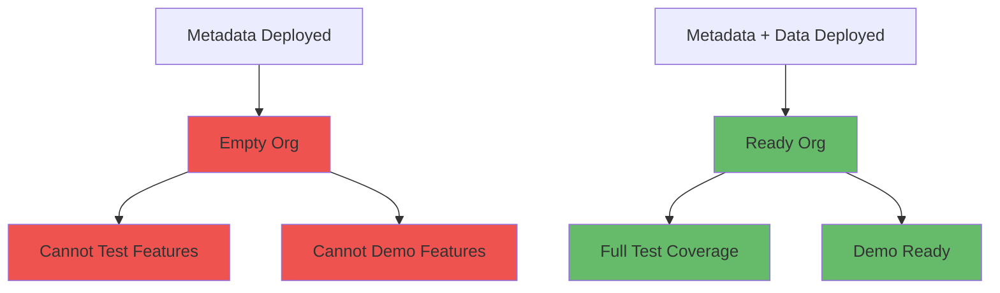

# Handling Data Alongside Metadata

**Learning Objective**: Incorporate data deployment into CI/CD pipelines for complete environment setup and testing.

## Overview

Metadata alone isn't enough. Orgs need **data** to function - reference data, test data, sample records. This guide shows you how to version control data, deploy it automatically, and keep it synchronized across environments.

## Why Data Deployment Matters



## Data Categories

### 1. Reference Data
**What**: Picklist-like data stored in custom objects
**Examples**: Product catalogs, pricing tiers, territory definitions
**Strategy**: Version control and deploy with metadata

### 2. Configuration Data
**What**: Records that control application behavior
**Examples**: Custom settings, custom metadata types
**Strategy**: Deploy as metadata (CustomMetadata type)

### 3. Test Data
**What**: Synthetic data for testing
**Examples**: Sample accounts, contacts, opportunities
**Strategy**: Generate programmatically or restore from exports

### 4. Seed Data
**What**: Minimal data to make org functional
**Examples**: Default admin user, record types
**Strategy**: Deploy with automation scripts

## Exporting Data for Version Control

### Using Salesforce CLI Data Export

```yaml
name: Export Reference Data

on:
  workflow_dispatch:  # Manual trigger
  schedule:
    - cron: '0 2 * * 1'  # Weekly backup

jobs:
  export-data:
    runs-on: ubuntu-latest
    steps:
      - uses: actions/checkout@v4

      - name: Install Salesforce CLI
        run: npm install -g @salesforce/cli

      - name: Authenticate to Production
        run: |
          echo "${{ secrets.SFDX_AUTH_URL }}" > auth.txt
          sf org login sfdx-url --sfdx-url-file auth.txt --alias production

      - name: Export Product Catalog
        run: |
          sf data export tree \
            --query "SELECT Name, ProductCode, Family, IsActive, Description FROM Product2" \
            --output-dir ./data/products \
            --plan \
            --target-org production

      - name: Export Price Books
        run: |
          sf data export tree \
            --query "SELECT Name, IsActive, Description FROM Pricebook2 WHERE IsStandard=false" \
            --output-dir ./data/pricebooks \
            --plan \
            --target-org production

      - name: Export Territories
        run: |
          sf data export tree \
            --query "SELECT Name, Region__c, Country__c, IsActive__c FROM Territory__c" \
            --output-dir ./data/territories \
            --plan \
            --target-org production

      - name: Create Pull Request with Updates
        run: |
          git config user.name "Data Export Bot"
          git config user.email "bot@company.com"

          git checkout -b data-export-$(date +%Y%m%d)
          git add data/
          git commit -m "chore: update reference data export"
          git push origin data-export-$(date +%Y%m%d)

          gh pr create \
            --title "📊 Weekly Reference Data Export" \
            --body "Automated export of reference data from production"
```

### Export with Relationships

```yaml
- name: Export Complex Object Tree
  run: |
    # Create data plan manually for complex relationships
    cat > data/account-plan.json << 'EOF'
    {
      "sobjects": [
        {
          "sobject": "Account",
          "saveRefs": true,
          "resolveRefs": false,
          "files": ["accounts.json"]
        },
        {
          "sobject": "Contact",
          "saveRefs": true,
          "resolveRefs": true,
          "files": ["contacts.json"]
        },
        {
          "sobject": "Opportunity",
          "saveRefs": false,
          "resolveRefs": true,
          "files": ["opportunities.json"]
        }
      ]
    }
    EOF

    # Export using plan
    sf data export tree \
      --plan data/account-plan.json \
      --output-dir ./data/sample \
      --target-org production
```

## Importing Data in CI/CD

### Basic Import Workflow

```yaml
name: Deploy with Data

on:
  push:
    branches: [develop]

jobs:
  deploy:
    runs-on: ubuntu-latest
    steps:
      - uses: actions/checkout@v4

      - name: Install Salesforce CLI
        run: npm install -g @salesforce/cli

      - name: Authenticate to Sandbox
        run: |
          echo "${{ secrets.SANDBOX_AUTH_URL }}" > auth.txt
          sf org login sfdx-url --sfdx-url-file auth.txt --alias dev-sandbox

      - name: Deploy Metadata First
        run: |
          sf project deploy start \
            --target-org dev-sandbox \
            --manifest manifest/package.xml \
            --test-level NoTestRun \
            --wait 30

      - name: Import Reference Data
        run: |
          # Import in dependency order

          # 1. Products (no dependencies)
          sf data import tree \
            --plan data/products/Product2-plan.json \
            --target-org dev-sandbox

          # 2. Price Books (depends on products)
          sf data import tree \
            --plan data/pricebooks/Pricebook2-plan.json \
            --target-org dev-sandbox

          # 3. Territories (no dependencies)
          sf data import tree \
            --plan data/territories/Territory__c-plan.json \
            --target-org dev-sandbox

      - name: Verify Data Import
        run: |
          PRODUCT_COUNT=$(sf data query \
            --query "SELECT COUNT() FROM Product2" \
            --target-org dev-sandbox \
            --json | jq '.result.totalSize')

          echo "Imported $PRODUCT_COUNT products"

          if [ "$PRODUCT_COUNT" -lt 10 ]; then
            echo "❌ Expected at least 10 products"
            exit 1
          fi
```

### Conditional Data Import

```yaml
- name: Check if Data Already Exists
  id: check-data
  run: |
    EXISTING_COUNT=$(sf data query \
      --query "SELECT COUNT() FROM Product2" \
      --target-org target-org \
      --json | jq '.result.totalSize')

    echo "existing_count=$EXISTING_COUNT" >> $GITHUB_OUTPUT

    if [ "$EXISTING_COUNT" -eq 0 ]; then
      echo "needs_import=true" >> $GITHUB_OUTPUT
    else
      echo "needs_import=false" >> $GITHUB_OUTPUT
    fi

- name: Import Data
  if: steps.check-data.outputs.needs_import == 'true'
  run: |
    echo "Importing data to empty org..."
    sf data import tree --plan data/data-plan.json --target-org target-org
```

## Data Anonymization for Lower Environments

### Anonymize Production Data

```python
# anonymize_data.py
import json
import random
import string
from faker import Faker

fake = Faker()

def anonymize_accounts(data_file):
    """Anonymize account data before importing to sandbox"""

    with open(data_file, 'r') as f:
        data = json.load(f)

    for record in data['records']:
        # Anonymize personal data
        record['Name'] = fake.company()
        record['Phone'] = fake.phone_number()
        record['BillingStreet'] = fake.street_address()
        record['BillingCity'] = fake.city()
        record['BillingPostalCode'] = fake.postcode()

        # Scramble email domains
        if 'Email__c' in record:
            username = ''.join(random.choices(string.ascii_lowercase, k=10))
            record['Email__c'] = f"{username}@example.com"

    # Write anonymized data
    with open(data_file.replace('.json', '-anonymized.json'), 'w') as f:
        json.dump(data, f, indent=2)

def anonymize_contacts(data_file):
    """Anonymize contact data"""

    with open(data_file, 'r') as f:
        data = json.load(f)

    for record in data['records']:
        record['FirstName'] = fake.first_name()
        record['LastName'] = fake.last_name()
        record['Email'] = fake.email()
        record['Phone'] = fake.phone_number()
        record['MobilePhone'] = fake.phone_number()

        # Keep references intact
        # Don't modify: AccountId, OwnerId, RecordTypeId

    with open(data_file.replace('.json', '-anonymized.json'), 'w') as f:
        json.dump(data, f, indent=2)

if __name__ == '__main__':
    anonymize_accounts('data/accounts.json')
    anonymize_contacts('data/contacts.json')
    print("✅ Data anonymized successfully")
```

Use in workflow:

```yaml
- name: Anonymize Production Data
  run: |
    pip install faker
    python scripts/anonymize_data.py

- name: Import Anonymized Data
  run: |
    sf data import tree \
      --plan data/accounts-anonymized-plan.json \
      --target-org dev-sandbox
```

## Large Data Volume Handling

### Bulk API for Large Imports

```yaml
- name: Import Large Dataset with Bulk API
  run: |
    # For datasets > 10,000 records, use Bulk API

    # 1. Convert JSON to CSV
    python << 'EOF'
    import json
    import csv

    with open('data/accounts.json', 'r') as f:
        data = json.load(f)

    with open('data/accounts.csv', 'w', newline='') as f:
        if data['records']:
            writer = csv.DictWriter(f, fieldnames=data['records'][0].keys())
            writer.writeheader()
            writer.writerows(data['records'])
    EOF

    # 2. Use Bulk API
    sf data import bulk \
      --sobject Account \
      --file data/accounts.csv \
      --wait 30 \
      --target-org target-org

- name: Monitor Bulk Job
  run: |
    # Get job ID from previous step
    JOB_ID=$(sf data bulk status --target-org target-org --json | jq -r '.result[0].id')

    echo "Monitoring job $JOB_ID"

    sf data bulk status \
      --job-id $JOB_ID \
      --target-org target-org
```

### Chunked Import Strategy

```bash
#!/bin/bash
# chunk_import.sh - Import large datasets in chunks

DATA_FILE="data/large-dataset.json"
CHUNK_SIZE=5000

# Split data into chunks
python << 'EOF'
import json
import math

with open('data/large-dataset.json', 'r') as f:
    data = json.load(f)

records = data['records']
chunk_size = 5000
num_chunks = math.ceil(len(records) / chunk_size)

for i in range(num_chunks):
    start = i * chunk_size
    end = start + chunk_size
    chunk_data = {
        'records': records[start:end],
        'sobjects': data['sobjects']
    }

    with open(f'data/chunk_{i}.json', 'w') as f:
        json.dump(chunk_data, f)

    print(f"Created chunk {i} with {len(chunk_data['records'])} records")
EOF

# Import each chunk
for chunk in data/chunk_*.json; do
    echo "Importing $chunk..."
    sf data import tree --plan "$chunk" --target-org target-org

    # Brief pause between chunks
    sleep 5
done

echo "✅ All chunks imported successfully"
```

## Test Data Generation

### Generate Synthetic Data

```apex
// TestDataFactory.cls
@isTest
public class TestDataFactory {

    public static List<Account> createAccounts(Integer count) {
        List<Account> accounts = new List<Account>();

        for (Integer i = 0; i < count; i++) {
            accounts.add(new Account(
                Name = 'Test Account ' + i,
                Industry = getRandomIndustry(),
                AnnualRevenue = Math.random() * 1000000,
                NumberOfEmployees = Integer.valueOf(Math.random() * 1000)
            ));
        }

        insert accounts;
        return accounts;
    }

    public static List<Contact> createContacts(List<Account> accounts, Integer perAccount) {
        List<Contact> contacts = new List<Contact>();

        for (Account acc : accounts) {
            for (Integer i = 0; i < perAccount; i++) {
                contacts.add(new Contact(
                    AccountId = acc.Id,
                    FirstName = 'Test',
                    LastName = 'Contact ' + i,
                    Email = 'test' + Math.random() + '@example.com'
                ));
            }
        }

        insert contacts;
        return contacts;
    }

    public static List<Opportunity> createOpportunities(List<Account> accounts, Integer perAccount) {
        List<Opportunity> opps = new List<Opportunity>();

        for (Account acc : accounts) {
            for (Integer i = 0; i < perAccount; i++) {
                opps.add(new Opportunity(
                    AccountId = acc.Id,
                    Name = acc.Name + ' Opp ' + i,
                    StageName = 'Prospecting',
                    CloseDate = Date.today().addDays(30),
                    Amount = Math.random() * 100000
                ));
            }
        }

        insert opps;
        return opps;
    }

    private static String getRandomIndustry() {
        List<String> industries = new List<String>{
            'Technology', 'Healthcare', 'Finance', 'Manufacturing', 'Retail'
        };
        return industries[Integer.valueOf(Math.random() * industries.size())];
    }
}
```

Deploy and execute via CI/CD:

```yaml
- name: Deploy Test Data Factory
  run: |
    sf project deploy start \
      --source-dir force-app/main/default/classes/TestDataFactory.cls \
      --target-org dev-sandbox \
      --test-level NoTestRun

- name: Generate Test Data
  run: |
    sf apex run \
      --file scripts/generate-test-data.apex \
      --target-org dev-sandbox
```

**scripts/generate-test-data.apex**:
```apex
// Generate test data in the org
List<Account> accounts = TestDataFactory.createAccounts(100);
List<Contact> contacts = TestDataFactory.createContacts(accounts, 5);
List<Opportunity> opps = TestDataFactory.createOpportunities(accounts, 3);

System.debug('Created ' + accounts.size() + ' accounts');
System.debug('Created ' + contacts.size() + ' contacts');
System.debug('Created ' + opps.size() + ' opportunities');
```

## Scratch Org Data Setup

### Complete Scratch Org with Data

```yaml
- name: Create and Setup Scratch Org
  run: |
    # 1. Create scratch org
    sf org create scratch \
      --definition-file config/project-scratch-def.json \
      --alias scratch-with-data \
      --duration-days 7 \
      --set-default

    # 2. Push metadata
    sf project deploy start \
      --source-dir force-app \
      --target-org scratch-with-data

    # 3. Assign permission sets
    sf org assign permset \
      --name SalesUser \
      --target-org scratch-with-data

    # 4. Import sample data
    sf data import tree \
      --plan data/sample-data-plan.json \
      --target-org scratch-with-data

    # 5. Execute setup scripts
    sf apex run \
      --file scripts/post-install.apex \
      --target-org scratch-with-data

    # 6. Generate test data
    sf apex run \
      --file scripts/generate-test-data.apex \
      --target-org scratch-with-data

- name: Verify Scratch Org Setup
  run: |
    echo "### Scratch Org Data Summary" >> $GITHUB_STEP_SUMMARY

    ACCOUNT_COUNT=$(sf data query \
      --query "SELECT COUNT() FROM Account" \
      --target-org scratch-with-data \
      --json | jq '.result.totalSize')

    CONTACT_COUNT=$(sf data query \
      --query "SELECT COUNT() FROM Contact" \
      --target-org scratch-with-data \
      --json | jq '.result.totalSize')

    echo "- Accounts: $ACCOUNT_COUNT" >> $GITHUB_STEP_SUMMARY
    echo "- Contacts: $CONTACT_COUNT" >> $GITHUB_STEP_SUMMARY
```

## Environment-Specific Data

### Data Configuration Matrix

```yaml
- name: Import Environment-Specific Data
  run: |
    case "${{ inputs.environment }}" in
      dev)
        PLAN="data/dev-data-plan.json"
        RECORD_COUNT=50
        ;;
      qa)
        PLAN="data/qa-data-plan.json"
        RECORD_COUNT=500
        ;;
      uat)
        PLAN="data/uat-data-plan.json"
        RECORD_COUNT=5000
        ;;
      staging)
        PLAN="data/staging-data-plan.json"
        RECORD_COUNT=50000
        ;;
      *)
        echo "Unknown environment"
        exit 1
        ;;
    esac

    echo "Importing $PLAN with ~$RECORD_COUNT records"
    sf data import tree --plan "$PLAN" --target-org ${{ inputs.org_alias }}
```

### Dynamic Data Generation by Environment

```python
# generate_env_data.py
import os
import json
import sys

def generate_data_plan(environment):
    """Generate different data volumes per environment"""

    config = {
        'dev': {'accounts': 10, 'contacts_per': 2, 'opps_per': 1},
        'qa': {'accounts': 50, 'contacts_per': 5, 'opps_per': 3},
        'uat': {'accounts': 200, 'contacts_per': 10, 'opps_per': 5},
        'staging': {'accounts': 1000, 'contacts_per': 20, 'opps_per': 10}
    }

    env_config = config.get(environment, config['dev'])

    plan = {
        'sobjects': [
            {
                'sobject': 'Account',
                'count': env_config['accounts']
            },
            {
                'sobject': 'Contact',
                'count': env_config['accounts'] * env_config['contacts_per']
            },
            {
                'sobject': 'Opportunity',
                'count': env_config['accounts'] * env_config['opps_per']
            }
        ]
    }

    print(f"Generated plan for {environment}:")
    print(json.dumps(plan, indent=2))

    return plan

if __name__ == '__main__':
    env = sys.argv[1] if len(sys.argv) > 1 else 'dev'
    plan = generate_data_plan(env)

    with open(f'data/{env}-plan.json', 'w') as f:
        json.dump(plan, f, indent=2)
```

## Handling Data Dependencies

### Ordered Data Import

```yaml
- name: Import Data with Dependencies
  run: |
    echo "Importing data in dependency order..."

    # Phase 1: Independent objects
    sf data import tree --plan data/accounts.json --target-org target-org
    sf data import tree --plan data/products.json --target-org target-org

    # Phase 2: Objects depending on Phase 1
    sf data import tree --plan data/contacts.json --target-org target-org
    sf data import tree --plan data/price-book-entries.json --target-org target-org

    # Phase 3: Objects depending on Phase 2
    sf data import tree --plan data/opportunities.json --target-org target-org

    # Phase 4: Junction objects and related lists
    sf data import tree --plan data/opportunity-contact-roles.json --target-org target-org
    sf data import tree --plan data/opportunity-line-items.json --target-org target-org
```

### Resolve External IDs

```json
{
  "records": [
    {
      "attributes": {
        "type": "Contact",
        "referenceId": "ContactRef1"
      },
      "FirstName": "John",
      "LastName": "Doe",
      "Email": "john@example.com",
      "Account": {
        "attributes": {
          "type": "Account"
        },
        "External_Id__c": "ACC-001"
      }
    }
  ]
}
```

Import with external ID resolution:

```yaml
- name: Import with External ID Resolution
  run: |
    sf data import tree \
      --plan data/contacts-with-refs.json \
      --target-org target-org
```

## Data Validation After Import

### Verify Data Integrity

```yaml
- name: Validate Imported Data
  run: |
    echo "### Data Validation Results" >> $GITHUB_STEP_SUMMARY

    # Check record counts
    EXPECTED_ACCOUNTS=100
    ACTUAL_ACCOUNTS=$(sf data query \
      --query "SELECT COUNT() FROM Account" \
      --target-org target-org \
      --json | jq '.result.totalSize')

    if [ "$ACTUAL_ACCOUNTS" -eq "$EXPECTED_ACCOUNTS" ]; then
      echo "✅ Account count: $ACTUAL_ACCOUNTS/$EXPECTED_ACCOUNTS" >> $GITHUB_STEP_SUMMARY
    else
      echo "❌ Account count: $ACTUAL_ACCOUNTS/$EXPECTED_ACCOUNTS" >> $GITHUB_STEP_SUMMARY
      exit 1
    fi

    # Check data quality
    INVALID_EMAILS=$(sf data query \
      --query "SELECT COUNT() FROM Contact WHERE Email = null" \
      --target-org target-org \
      --json | jq '.result.totalSize')

    if [ "$INVALID_EMAILS" -eq 0 ]; then
      echo "✅ All contacts have emails" >> $GITHUB_STEP_SUMMARY
    else
      echo "⚠️ $INVALID_EMAILS contacts missing emails" >> $GITHUB_STEP_SUMMARY
    fi

    # Check relationships
    ORPHAN_CONTACTS=$(sf data query \
      --query "SELECT COUNT() FROM Contact WHERE AccountId = null" \
      --target-org target-org \
      --json | jq '.result.totalSize')

    if [ "$ORPHAN_CONTACTS" -eq 0 ]; then
      echo "✅ All contacts linked to accounts" >> $GITHUB_STEP_SUMMARY
    else
      echo "❌ $ORPHAN_CONTACTS orphaned contacts" >> $GITHUB_STEP_SUMMARY
      exit 1
    fi
```

## Complete Example: Full Environment Setup

```yaml
name: Setup Complete Environment

on:
  workflow_dispatch:
    inputs:
      environment:
        description: 'Target environment'
        required: true
        type: choice
        options:
          - dev
          - qa
          - uat

jobs:
  setup:
    runs-on: ubuntu-latest
    steps:
      - uses: actions/checkout@v4

      - name: Install Salesforce CLI
        run: npm install -g @salesforce/cli

      - name: Authenticate
        run: |
          echo "${{ secrets[format('{0}_AUTH_URL', inputs.environment)] }}" > auth.txt
          sf org login sfdx-url --sfdx-url-file auth.txt --alias target-org

      - name: Deploy Metadata
        run: |
          sf project deploy start \
            --target-org target-org \
            --manifest manifest/package.xml \
            --test-level NoTestRun \
            --wait 45

      - name: Check Existing Data
        id: check-data
        run: |
          COUNT=$(sf data query \
            --query "SELECT COUNT() FROM Account" \
            --target-org target-org \
            --json | jq '.result.totalSize')

          if [ "$COUNT" -eq 0 ]; then
            echo "needs_data=true" >> $GITHUB_OUTPUT
          else
            echo "needs_data=false" >> $GITHUB_OUTPUT
          fi

      - name: Generate Environment-Specific Data Plan
        if: steps.check-data.outputs.needs_data == 'true'
        run: |
          pip install faker
          python scripts/generate_env_data.py ${{ inputs.environment }}

      - name: Import Reference Data
        if: steps.check-data.outputs.needs_data == 'true'
        run: |
          # Import reference data (always needed)
          sf data import tree --plan data/products-plan.json --target-org target-org
          sf data import tree --plan data/pricebooks-plan.json --target-org target-org

      - name: Import Test Data
        if: steps.check-data.outputs.needs_data == 'true'
        run: |
          # Import environment-specific test data
          sf data import tree \
            --plan data/${{ inputs.environment }}-plan.json \
            --target-org target-org

      - name: Execute Post-Install Scripts
        run: |
          sf apex run --file scripts/post-install.apex --target-org target-org

      - name: Validate Environment
        run: |
          bash scripts/validate_environment.sh target-org

      - name: Generate Environment Report
        run: |
          echo "## Environment Setup Complete 🎉" >> $GITHUB_STEP_SUMMARY
          echo "" >> $GITHUB_STEP_SUMMARY
          echo "**Environment**: ${{ inputs.environment }}" >> $GITHUB_STEP_SUMMARY
          echo "" >> $GITHUB_STEP_SUMMARY

          # Get org info
          sf org display --target-org target-org --json | \
            jq -r '"**Org ID**: " + .result.id' >> $GITHUB_STEP_SUMMARY

          # Get data counts
          echo "" >> $GITHUB_STEP_SUMMARY
          echo "### Data Summary" >> $GITHUB_STEP_SUMMARY

          for object in Account Contact Opportunity Product2; do
            COUNT=$(sf data query \
              --query "SELECT COUNT() FROM $object" \
              --target-org target-org \
              --json | jq '.result.totalSize')
            echo "- $object: $COUNT records" >> $GITHUB_STEP_SUMMARY
          done
```

## Best Practices

### 1. Separate Reference Data from Test Data

```
data/
├── reference/          # Version controlled, deployed everywhere
│   ├── products.json
│   ├── pricebooks.json
│   └── territories.json
├── samples/            # Version controlled, dev/qa only
│   ├── sample-accounts.json
│   └── sample-contacts.json
└── generated/          # Not version controlled, generated on-demand
    └── test-data.json
```

### 2. Use External IDs for Portability

```json
{
  "records": [
    {
      "attributes": {"type": "Account"},
      "External_Id__c": "ACC-001",
      "Name": "ACME Corp"
    },
    {
      "attributes": {"type": "Contact"},
      "External_Id__c": "CON-001",
      "FirstName": "John",
      "LastName": "Doe",
      "Account": {
        "External_Id__c": "ACC-001"
      }
    }
  ]
}
```

### 3. Automate Data Refresh

```yaml
# Schedule weekly data refresh for QA
- cron: '0 3 * * 1'  # Every Monday at 3 AM

jobs:
  refresh-qa-data:
    steps:
      - name: Delete Existing Test Data
        run: |
          sf data delete bulk \
            --sobject Account \
            --where "IsTestData__c = true" \
            --target-org qa-sandbox

      - name: Import Fresh Data
        run: |
          sf data import tree \
            --plan data/qa-data-plan.json \
            --target-org qa-sandbox
```

### 4. Document Data Requirements

```yaml
# data/README.md
## Data Deployment Guide

### Reference Data (Always Deploy)
- `products/` - Product catalog (50 products)
- `pricebooks/` - Standard and custom price books
- `territories/` - Sales territories (10 territories)

### Test Data (Dev/QA Only)
- `samples/accounts.json` - 100 sample accounts
- `samples/contacts.json` - 500 sample contacts (5 per account)

### Data Dependencies
1. Deploy products before price book entries
2. Deploy accounts before contacts
3. Deploy contacts before opportunities

### External ID Fields
- Account: `External_Id__c`
- Contact: `Contact_External_Id__c`
- Product: `ProductCode` (standard field)
```

## Interview Talking Points

1. **"We version control reference data alongside metadata"**
   - Shows comprehensive DevOps approach
   - Demonstrates understanding of complete deployments

2. **"We anonymize production data before importing to lower environments"**
   - Shows security consciousness
   - Demonstrates GDPR/privacy awareness

3. **"We use external IDs for portable data imports"**
   - Shows technical expertise
   - Demonstrates maintainability thinking

4. **"We generate test data programmatically rather than copying production"**
   - Shows performance awareness
   - Demonstrates scalability thinking

5. **"We validate data integrity after every import"**
   - Shows quality-focused approach
   - Demonstrates thoroughness

## Next Steps

- **Next Guide**: [Risk Assessment and Impact Analysis](./risk-assessment) - Evaluate deployment risks
- **Related**: [Managing Dependencies](./managing-dependencies) - Handle metadata dependencies
- **Related**: [Sandbox Deployment Pipeline](../pipelines/sandbox-deployment) - Full deployment workflow

---

**Key Takeaway**: Data is as important as metadata. Version control it, automate its deployment, and treat it as a first-class citizen in your CI/CD pipeline.
