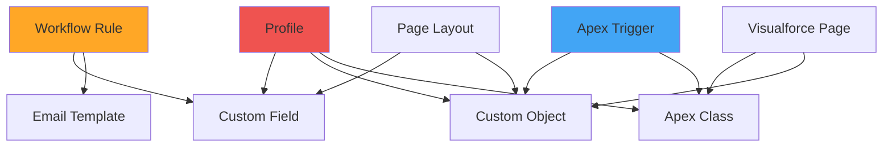
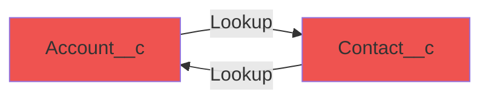

# Managing Dependencies and Deployment Order

**Learning Objective**: Handle inter-dependent metadata and coordinate deployment sequences in complex Salesforce projects.

## Overview

Salesforce metadata has complex dependencies. Deploy in the wrong order, and your deployment fails. This guide teaches you how to identify, track, and manage dependencies automatically.

## Common Dependency Scenarios



## Automated Dependency Detection

### Dependency Analyzer Tool

```yaml
name: Analyze Dependencies

on:
  pull_request:
    branches: [main, develop]

jobs:
  analyze:
    runs-on: ubuntu-latest
    steps:
      - uses: actions/checkout@v4

      - name: Install Salesforce CLI
        run: npm install -g @salesforce/cli

      - name: Install Dependency Plugin
        run: sf plugins install @salesforce/plugin-packaging

      - name: Generate Dependency Graph
        run: |
          # Get changed files
          CHANGED_FILES=$(git diff --name-only origin/${{ github.base_ref }}...HEAD)

          echo "### 📊 Dependency Analysis" >> $GITHUB_STEP_SUMMARY
          echo "" >> $GITHUB_STEP_SUMMARY

          # Analyze each changed component
          for file in $CHANGED_FILES; do
            if [[ $file == force-app/* ]]; then
              COMPONENT_TYPE=$(echo $file | cut -d'/' -f4)
              COMPONENT_NAME=$(basename $file .xml | basename .cls | basename .trigger)

              echo "**$COMPONENT_NAME** ($COMPONENT_TYPE)" >> $GITHUB_STEP_SUMMARY

              # Check dependencies in code
              if grep -q "Schema\." "$file" 2>/dev/null; then
                echo "- References: Custom Objects/Fields" >> $GITHUB_STEP_SUMMARY
              fi

              if grep -q "Profile" "$file" 2>/dev/null; then
                echo "- Depends on: Profiles" >> $GITHUB_STEP_SUMMARY
              fi
            fi
          done

      - name: Check Deployment Order
        run: |
          echo "### 📋 Recommended Deployment Order" >> $GITHUB_STEP_SUMMARY
          echo "" >> $GITHUB_STEP_SUMMARY
          echo "1. Custom Objects & Fields" >> $GITHUB_STEP_SUMMARY
          echo "2. Apex Classes (no dependencies)" >> $GITHUB_STEP_SUMMARY
          echo "3. Apex Triggers" >> $GITHUB_STEP_SUMMARY
          echo "4. Visualforce Pages" >> $GITHUB_STEP_SUMMARY
          echo "5. Page Layouts" >> $GITHUB_STEP_SUMMARY
          echo "6. Workflow Rules & Process Builder" >> $GITHUB_STEP_SUMMARY
          echo "7. Profiles & Permission Sets" >> $GITHUB_STEP_SUMMARY
```

## Phased Deployment Strategy

### Phase 1: Foundation Components

```yaml
- name: Deploy Foundation (Objects & Fields)
  run: |
    # Deploy only objects and fields first
    cat > foundation-package.xml << 'EOF'
    <?xml version="1.0" encoding="UTF-8"?>
    <Package xmlns="http://soap.sforce.com/2006/04/metadata">
        <types>
            <members>*</members>
            <name>CustomObject</name>
        </types>
        <types>
            <members>*</members>
            <name>CustomField</name>
        </types>
        <version>59.0</version>
    </Package>
    EOF

    sf project deploy start \
      --target-org target-org \
      --manifest foundation-package.xml \
      --test-level NoTestRun \
      --wait 30
```

### Phase 2: Business Logic

```yaml
- name: Deploy Business Logic (Apex)
  run: |
    cat > logic-package.xml << 'EOF'
    <?xml version="1.0" encoding="UTF-8"?>
    <Package xmlns="http://soap.sforce.com/2006/04/metadata">
        <types>
            <members>*</members>
            <name>ApexClass</name>
        </types>
        <types>
            <members>*</members>
            <name>ApexTrigger</name>
        </types>
        <version>59.0</version>
    </Package>
    EOF

    sf project deploy start \
      --target-org target-org \
      --manifest logic-package.xml \
      --test-level RunSpecifiedTests \
      --tests AccountTriggerTest,OpportunityTriggerTest \
      --wait 45
```

### Phase 3: UI & Automation

```yaml
- name: Deploy UI & Automation
  run: |
    cat > ui-package.xml << 'EOF'
    <?xml version="1.0" encoding="UTF-8"?>
    <Package xmlns="http://soap.sforce.com/2006/04/metadata">
        <types>
            <members>*</members>
            <name>Layout</name>
        </types>
        <types>
            <members>*</members>
            <name>WorkflowRule</name>
        </types>
        <types>
            <members>*</members>
            <name>Flow</name>
        </types>
        <version>59.0</version>
    </Package>
    EOF

    sf project deploy start \
      --target-org target-org \
      --manifest ui-package.xml \
      --test-level RunLocalTests \
      --wait 60
```

### Phase 4: Security (Profiles Last)

```yaml
- name: Deploy Security Settings
  run: |
    cat > security-package.xml << 'EOF'
    <?xml version="1.0" encoding="UTF-8"?>
    <Package xmlns="http://soap.sforce.com/2006/04/metadata">
        <types>
            <members>*</members>
            <name>Profile</name>
        </types>
        <types>
            <members>*</members>
            <name>PermissionSet</name>
        </types>
        <version>59.0</version>
    </Package>
    EOF

    sf project deploy start \
      --target-org target-org \
      --manifest security-package.xml \
      --test-level NoTestRun \
      --wait 30
```

## Smart Dependency Resolution

### Auto-Generate Deployment Order

```python
# dependency_resolver.py
import xml.etree.ElementTree as ET
import json
from collections import defaultdict, deque

def parse_package_xml(file_path):
    """Parse package.xml and return component types"""
    tree = ET.parse(file_path)
    root = tree.getroot()
    components = []

    for types in root.findall('.//{http://soap.sforce.com/2006/04/metadata}types'):
        name = types.find('{http://soap.sforce.com/2006/04/metadata}name').text
        members = [m.text for m in types.findall('{http://soap.sforce.com/2006/04/metadata}members')]
        components.append({'type': name, 'members': members})

    return components

def get_deployment_order():
    """Return recommended deployment order based on dependencies"""
    return [
        'CustomObject',
        'CustomField',
        'RecordType',
        'ApexClass',
        'ApexTrigger',
        'ApexComponent',
        'ApexPage',
        'LightningComponentBundle',
        'EmailTemplate',
        'WorkflowRule',
        'Flow',
        'Layout',
        'CustomTab',
        'CustomApplication',
        'Profile',
        'PermissionSet'
    ]

def create_phased_packages(components):
    """Create multiple package.xml files in deployment order"""
    order = get_deployment_order()
    component_map = defaultdict(list)

    for comp in components:
        component_map[comp['type']] = comp['members']

    phases = []
    current_phase = []

    for comp_type in order:
        if comp_type in component_map:
            current_phase.append({
                'type': comp_type,
                'members': component_map[comp_type]
            })

            # Create phase every 3 component types
            if len(current_phase) >= 3:
                phases.append(current_phase)
                current_phase = []

    if current_phase:
        phases.append(current_phase)

    return phases

def generate_phase_xml(phase_num, components):
    """Generate package.xml for a specific phase"""
    root = ET.Element('Package')
    root.set('xmlns', 'http://soap.sforce.com/2006/04/metadata')

    for comp in components:
        types_elem = ET.SubElement(root, 'types')
        for member in comp['members']:
            member_elem = ET.SubElement(types_elem, 'members')
            member_elem.text = member
        name_elem = ET.SubElement(types_elem, 'name')
        name_elem.text = comp['type']

    version = ET.SubElement(root, 'version')
    version.text = '59.0'

    tree = ET.ElementTree(root)
    ET.indent(tree, space='    ')
    tree.write(f'phase{phase_num}-package.xml', encoding='UTF-8', xml_declaration=True)

if __name__ == '__main__':
    # Parse main package.xml
    components = parse_package_xml('manifest/package.xml')

    # Generate phased packages
    phases = create_phased_packages(components)

    for i, phase in enumerate(phases, 1):
        generate_phase_xml(i, phase)
        print(f'Generated phase{i}-package.xml')
```

Use in workflow:
```yaml
- name: Generate Phased Deployment
  run: |
    python dependency_resolver.py

    # Deploy each phase
    for phase in phase*.xml; do
      echo "Deploying $phase..."
      sf project deploy start \
        --target-org target-org \
        --manifest "$phase" \
        --wait 30
    done
```

## Handling Circular Dependencies

### Problem: Custom Objects Reference Each Other



### Solution: Deploy in Two Phases

```yaml
- name: Phase 1 - Objects without lookups
  run: |
    # Temporarily remove lookup fields from XMLs
    python << 'EOF'
    import xml.etree.ElementTree as ET

    # Load Contact object
    tree = ET.parse('force-app/main/default/objects/Contact__c/Contact__c.object-meta.xml')
    root = tree.getroot()

    # Remove Account lookup field temporarily
    for field in root.findall('.//{http://soap.sforce.com/2006/04/metadata}field'):
        name = field.find('{http://soap.sforce.com/2006/04/metadata}fullName')
        if name.text == 'Account__c':
            root.remove(field)

    # Save modified version
    tree.write('Contact__c_phase1.xml')
    EOF

    # Deploy objects without circular references
    sf project deploy start --manifest phase1-package.xml

- name: Phase 2 - Add lookup fields
  run: |
    # Deploy complete objects with all fields
    sf project deploy start --manifest phase2-package.xml
```

## Complex Dependency: Lightning Web Components

### LWC with Apex Controller Dependency

```yaml
- name: Deploy LWC with Dependencies
  run: |
    # 1. Deploy Apex controller first
    sf project deploy start \
      --source-dir force-app/main/default/classes/MyController.cls \
      --test-level RunSpecifiedTests \
      --tests MyControllerTest \
      --wait 30

    # 2. Deploy LWC (references Apex)
    sf project deploy start \
      --source-dir force-app/main/default/lwc/myComponent \
      --test-level NoTestRun \
      --wait 15

    # 3. Deploy config that uses LWC
    sf project deploy start \
      --source-dir force-app/main/default/flexipages \
      --test-level NoTestRun \
      --wait 15
```

## Tracking Dependencies in Code

### Document Dependencies

```apex
/**
 * @author DevOps Team
 * @description Account trigger handler
 *
 * DEPENDENCIES:
 * - Objects: Account, Contact__c, Opportunity
 * - Fields: Account.Industry, Contact__c.Account__c
 * - Classes: TriggerHandler, AccountService
 * - Profiles: System Administrator, Sales User
 *
 * DEPLOY ORDER:
 * 1. Objects & Fields must exist
 * 2. AccountService class
 * 3. This trigger handler
 * 4. Account trigger
 */
public class AccountTriggerHandler extends TriggerHandler {
    // Implementation
}
```

### Automated Dependency Documentation

```yaml
- name: Generate Dependency Documentation
  run: |
    python << 'EOF'
    import os
    import re

    def extract_dependencies(file_path):
        with open(file_path, 'r') as f:
            content = f.read()

        # Find DEPENDENCIES section in comments
        match = re.search(r'/\*\*.*?DEPENDENCIES:(.*?)\*/', content, re.DOTALL)
        if match:
            return match.group(1).strip()
        return None

    # Scan all Apex classes
    dependencies_doc = "# Component Dependencies\n\n"

    for root, dirs, files in os.walk('force-app'):
        for file in files:
            if file.endswith('.cls'):
                path = os.path.join(root, file)
                deps = extract_dependencies(path)
                if deps:
                    dependencies_doc += f"## {file}\n\n{deps}\n\n"

    with open('DEPENDENCIES.md', 'w') as f:
        f.write(dependencies_doc)
    EOF

    cat DEPENDENCIES.md >> $GITHUB_STEP_SUMMARY
```

## Best Practices

### 1. Use Metadata Type Order

```yaml
# Always deploy in this order:
deployment_order:
  - CustomObject
  - CustomField
  - RecordType
  - ApexClass
  - ApexTrigger
  - Flow
  - Profile
```

### 2. Validate Dependencies Before Deployment

```yaml
- name: Pre-Deployment Dependency Check
  run: |
    # Check if required components exist in target org
    MISSING_DEPS=()

    # Check if Account__c exists
    if ! sf data query --query "SELECT Id FROM EntityDefinition WHERE QualifiedApiName='Account__c'" --target-org target-org --json | jq -e '.result.totalSize > 0' > /dev/null; then
      MISSING_DEPS+=("Account__c custom object")
    fi

    if [ ${#MISSING_DEPS[@]} -gt 0 ]; then
      echo "❌ Missing dependencies:" >> $GITHUB_STEP_SUMMARY
      printf '%s\n' "${MISSING_DEPS[@]}" >> $GITHUB_STEP_SUMMARY
      exit 1
    fi
```

### 3. Use Dependency Matrix

Create `dependency-matrix.json`:
```json
{
  "AccountTrigger": {
    "depends_on": ["Account__c", "AccountTriggerHandler"],
    "phase": 3
  },
  "AccountTriggerHandler": {
    "depends_on": ["Account__c", "TriggerHandler"],
    "phase": 2
  },
  "TriggerHandler": {
    "depends_on": [],
    "phase": 1
  }
}
```

## Interview Talking Points

1. **"We use phased deployments to handle complex dependencies"**
   - Shows systematic thinking
   - Demonstrates deployment expertise

2. **"We automatically generate deployment order based on metadata types"**
   - Shows automation skills
   - Demonstrates efficiency

3. **"We document dependencies in code comments"**
   - Shows good documentation practices
   - Helps team understanding

4. **"We validate dependencies before deployment"**
   - Shows proactive approach
   - Prevents deployment failures

5. **"We handle circular dependencies with two-phase deployments"**
   - Shows problem-solving skills
   - Demonstrates advanced knowledge

## Next Steps

- **Next Guide**: [Handling Data in Multi-Org Scenarios](./handling-data) - Manage data across environments
- **Related**: [Deployment Failures and Recovery](./deployment-failures) - Handle failed deployments
- **Related**: [Multi-Team Coordination](./multi-team-coordination) - Coordinate across teams

---

**Key Takeaway**: Dependencies are inevitable in Salesforce. Success comes from detecting them early, documenting them clearly, and deploying them in the right order automatically.
