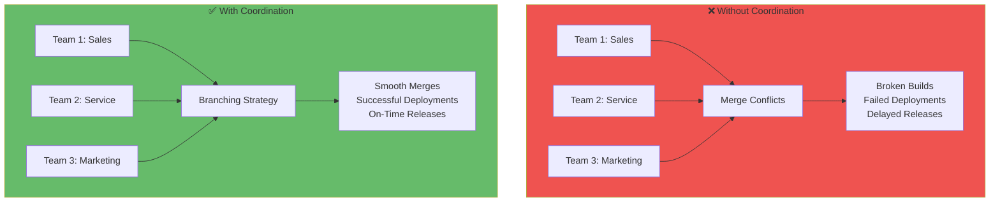
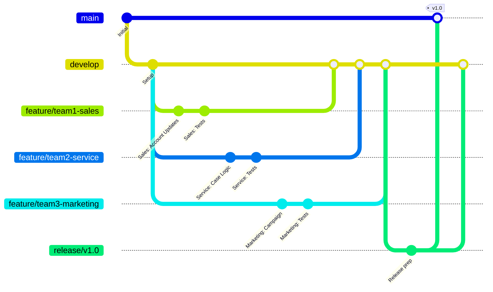
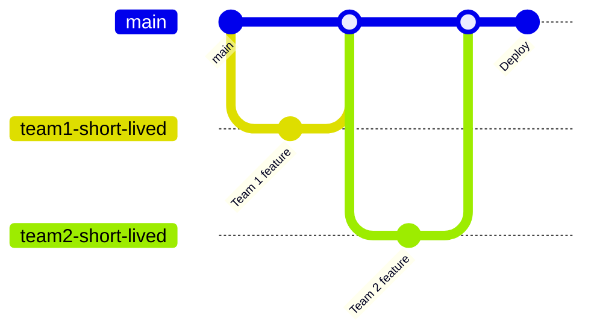
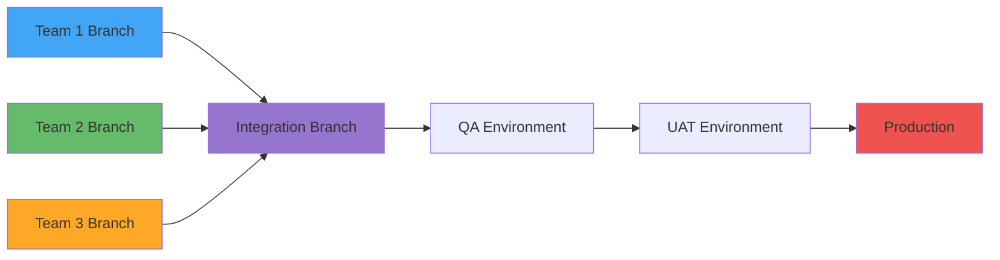
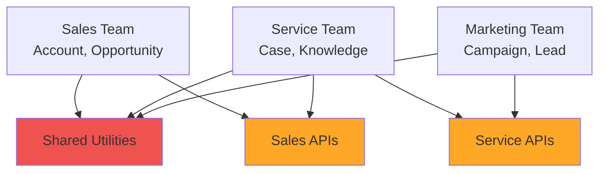
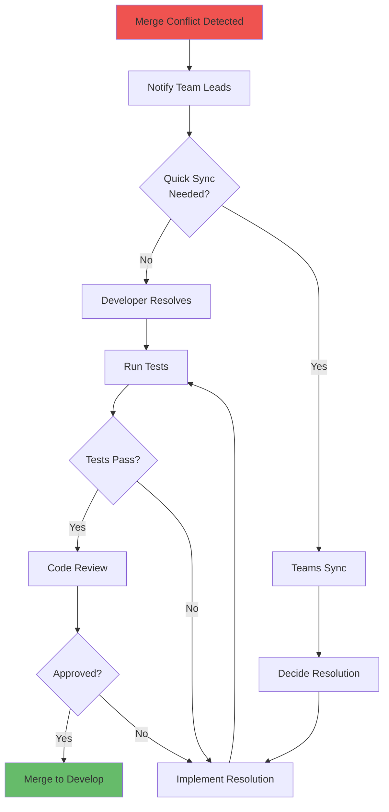

# Multi-Team Coordination and Branching Strategies

**Learning Objective**: Design branching strategies for teams of 10-100 developers working on enterprise Salesforce implementations.

## Overview

When multiple teams work on the same Salesforce org, coordination becomes critical. This guide teaches you how to structure your branches, workflows, and deployment processes to enable parallel development without conflicts.

## The Challenge



## Branching Strategies for Large Teams

### Strategy 1: GitFlow (Recommended for Enterprise)



**Branch Structure**:
- `main`: Production-ready code
- `develop`: Integration branch for all teams
- `feature/team-name-feature`: Feature branches per team
- `release/vX.X`: Release preparation
- `hotfix/description`: Emergency fixes

**Rules**:
1. Teams work on feature branches
2. Feature branches merge to `develop` daily
3. `develop` deploys to integration sandbox nightly
4. Release branches created from `develop`
5. Only `main` deploys to production

### Strategy 2: Trunk-Based Development (For Smaller Teams)



**Rules**:
- Short-lived branches (max 2 days)
- Merge to `main` frequently
- Use feature flags for incomplete features
- Deploy from `main` to all environments

### Strategy 3: Team-Based Branches



**Branch Structure**:
- `team/sales`: Owned by Sales team
- `team/service`: Owned by Service team
- `team/marketing`: Owned by Marketing team
- `integration`: Merge point for all teams
- `main`: Production

## Multi-Team Workflow Example

### Complete Enterprise Workflow

```yaml
# .github/workflows/multi-team-ci.yml
name: Multi-Team CI/CD

on:
  push:
    branches:
      - 'feature/**'    # All feature branches
      - 'team/**'       # All team branches
      - develop         # Integration branch
      - 'release/**'    # Release branches
      - main            # Production

jobs:
  # Determine which teams are affected
  detect-changes:
    runs-on: ubuntu-latest
    outputs:
      sales_changed: ${{ steps.changes.outputs.sales }}
      service_changed: ${{ steps.changes.outputs.service }}
      marketing_changed: ${{ steps.changes.outputs.marketing }}
      shared_changed: ${{ steps.changes.outputs.shared }}

    steps:
      - uses: actions/checkout@v4
        with:
          fetch-depth: 0

      - name: Detect Changed Components
        id: changes
        run: |
          # Check which teams' code changed
          if git diff --name-only HEAD^ HEAD | grep -q "^force-app/sales/"; then
            echo "sales=true" >> $GITHUB_OUTPUT
          fi

          if git diff --name-only HEAD^ HEAD | grep -q "^force-app/service/"; then
            echo "service=true" >> $GITHUB_OUTPUT
          fi

          if git diff --name-only HEAD^ HEAD | grep -q "^force-app/marketing/"; then
            echo "marketing=true" >> $GITHUB_OUTPUT
          fi

          if git diff --name-only HEAD^ HEAD | grep -q "^force-app/shared/"; then
            echo "shared=true" >> $GITHUB_OUTPUT
          fi

  # Run tests for Sales team code
  test-sales:
    needs: detect-changes
    if: needs.detect-changes.outputs.sales_changed == 'true'
    runs-on: ubuntu-latest
    steps:
      - uses: actions/checkout@v4

      - name: Install Salesforce CLI
        run: npm install -g @salesforce/cli

      - name: Authenticate
        run: |
          echo "${{ secrets.SFDX_AUTH_URL_INT }}" > auth.txt
          sf org login sfdx-url --sfdx-url-file auth.txt --alias integration-org
          rm auth.txt

      - name: Run Sales Tests
        run: |
          sf apex run test \
            --target-org integration-org \
            --tests SalesAccountTest,SalesOpportunityTest,SalesLeadTest \
            --result-format json \
            --output-dir ./test-results

      - name: Check Coverage
        run: |
          COVERAGE=$(jq -r '.result.summary.testRunCoverage' ./test-results/test-result.json | tr -d '%')
          if (( $(echo "$COVERAGE < 75" | bc -l) )); then
            echo "Sales team coverage ($COVERAGE%) below 75%"
            exit 1
          fi

  # Similarly for Service and Marketing teams
  test-service:
    needs: detect-changes
    if: needs.detect-changes.outputs.service_changed == 'true'
    runs-on: ubuntu-latest
    steps:
      - # Similar to test-sales but with service-specific tests
        run: echo "Testing service team code..."

  test-marketing:
    needs: detect-changes
    if: needs.detect-changes.outputs.marketing_changed == 'true'
    runs-on: ubuntu-latest
    steps:
      - # Similar to test-sales but with marketing-specific tests
        run: echo "Testing marketing team code..."

  # Run all tests if shared code changed
  test-all:
    needs: detect-changes
    if: needs.detect-changes.outputs.shared_changed == 'true'
    runs-on: ubuntu-latest
    steps:
      - uses: actions/checkout@v4

      - name: Install Salesforce CLI
        run: npm install -g @salesforce/cli

      - name: Authenticate
        run: |
          echo "${{ secrets.SFDX_AUTH_URL_INT }}" > auth.txt
          sf org login sfdx-url --sfdx-url-file auth.txt --alias integration-org
          rm auth.txt

      - name: Run All Tests
        run: |
          sf apex run test \
            --target-org integration-org \
            --test-level RunLocalTests \
            --code-coverage \
            --result-format json \
            --output-dir ./test-results

      - name: Notify All Teams
        run: |
          curl -X POST "${{ secrets.SLACK_WEBHOOK }}" \
            -H 'Content-Type: application/json' \
            -d "{\"text\": \"⚠️ Shared code changed! All teams should verify their functionality.\"}"

  # Deploy to team-specific sandboxes
  deploy-to-team-sandboxes:
    needs: [test-sales, test-service, test-marketing]
    if: github.ref == 'refs/heads/develop' && success()
    runs-on: ubuntu-latest

    strategy:
      matrix:
        team: [sales, service, marketing]

    steps:
      - uses: actions/checkout@v4

      - name: Deploy to ${{ matrix.team }} Sandbox
        run: |
          echo "Deploying to ${{ matrix.team }} sandbox..."
          # Deploy logic here
```

## Dependency Management Between Teams

### Tracking Dependencies



**Managing Shared Code**:

Create a `dependencies.json`:
```json
{
  "teams": {
    "sales": {
      "owns": ["force-app/sales/**"],
      "depends_on": ["force-app/shared/**"],
      "contacts": ["sales-lead@example.com"]
    },
    "service": {
      "owns": ["force-app/service/**"],
      "depends_on": ["force-app/shared/**", "force-app/sales/api/**"],
      "contacts": ["service-lead@example.com"]
    },
    "marketing": {
      "owns": ["force-app/marketing/**"],
      "depends_on": ["force-app/shared/**", "force-app/service/api/**"],
      "contacts": ["marketing-lead@example.com"]
    }
  }
}
```

**Auto-notify dependent teams**:
```yaml
- name: Notify Dependent Teams
  run: |
    # Get changed files
    CHANGED_FILES=$(git diff --name-only HEAD^ HEAD)

    # Check if shared code changed
    if echo "$CHANGED_FILES" | grep -q "^force-app/shared/"; then
      # Notify all teams
      curl -X POST "$SLACK_WEBHOOK" \
        -d '{"text": "@sales-team @service-team @marketing-team: Shared code changed! Review your dependencies."}'
    fi

    # Check if Sales API changed
    if echo "$CHANGED_FILES" | grep -q "^force-app/sales/api/"; then
      # Notify Service team (depends on Sales API)
      curl -X POST "$SLACK_WEBHOOK" \
        -d '{"text": "@service-team: Sales API changed! You may need to update your integration."}'
    fi
```

## Merge Conflict Resolution

### Pre-Merge Validation

```yaml
name: Pre-Merge Checks

on:
  pull_request:
    branches: [develop]

jobs:
  check-conflicts:
    runs-on: ubuntu-latest
    steps:
      - uses: actions/checkout@v4
        with:
          fetch-depth: 0

      - name: Check for Potential Conflicts
        run: |
          # Fetch target branch
          git fetch origin develop

          # Try merge (dry-run)
          if ! git merge --no-commit --no-ff origin/develop; then
            echo "### ⚠️ Merge Conflicts Detected" >> $GITHUB_STEP_SUMMARY
            echo "This PR has conflicts with develop branch" >> $GITHUB_STEP_SUMMARY

            # List conflicting files
            git diff --name-only --diff-filter=U >> $GITHUB_STEP_SUMMARY

            # Abort merge
            git merge --abort

            exit 1
          fi

          # Abort test merge
          git merge --abort

          echo "### ✅ No Conflicts" >> $GITHUB_STEP_SUMMARY

      - name: Check for Overlapping Changes
        run: |
          # Get changed files in PR
          PR_FILES=$(git diff --name-only origin/develop...HEAD)

          # Get recently merged files in develop
          RECENT_FILES=$(git diff --name-only origin/develop~5..origin/develop)

          # Find overlaps
          OVERLAPS=$(comm -12 <(echo "$PR_FILES" | sort) <(echo "$RECENT_FILES" | sort))

          if [ -n "$OVERLAPS" ]; then
            echo "### ⚠️ Files Recently Modified in Develop" >> $GITHUB_STEP_SUMMARY
            echo "$OVERLAPS" >> $GITHUB_STEP_SUMMARY
            echo "Review these files carefully for potential conflicts" >> $GITHUB_STEP_SUMMARY
          fi
```

### Conflict Resolution Workflow



## Release Coordination

### Multi-Team Release Process

```yaml
name: Coordinated Release

on:
  workflow_dispatch:
    inputs:
      release_version:
        description: 'Release version (e.g., 1.0.0)'
        required: true
      included_teams:
        description: 'Teams in this release (comma-separated)'
        required: true
        default: 'sales,service,marketing'

jobs:
  create-release-branch:
    runs-on: ubuntu-latest
    steps:
      - uses: actions/checkout@v4
        with:
          ref: develop

      - name: Create Release Branch
        run: |
          git checkout -b release/${{ github.event.inputs.release_version }}
          git push origin release/${{ github.event.inputs.release_version }}

      - name: Create Release Tracking Issue
        uses: actions/github-script@v7
        with:
          script: |
            const teams = '${{ github.event.inputs.included_teams }}'.split(',');

            let body = `# Release ${{ github.event.inputs.release_version }}\n\n`;
            body += `## Included Teams\n`;
            teams.forEach(team => {
              body += `- [ ] ${team.trim()}\n`;
            });

            body += `\n## Release Checklist\n`;
            body += `- [ ] All team features merged to develop\n`;
            body += `- [ ] Integration tests passed\n`;
            body += `- [ ] UAT sign-off received\n`;
            body += `- [ ] Release notes prepared\n`;
            body += `- [ ] Deployment window scheduled\n`;
            body += `- [ ] Rollback plan prepared\n`;

            await github.rest.issues.create({
              owner: context.repo.owner,
              repo: context.repo.repo,
              title: `Release ${{ github.event.inputs.release_version }}`,
              body: body,
              labels: ['release', 'tracking'],
              milestone: '${{ github.event.inputs.release_version }}'
            });

      - name: Notify Teams
        run: |
          TEAMS="${{ github.event.inputs.included_teams }}"

          curl -X POST "${{ secrets.SLACK_WEBHOOK }}" \
            -H 'Content-Type: application/json' \
            -d "{\"text\": \"🚀 Release ${{ github.event.inputs.release_version }} branch created!\\nIncluded teams: $TEAMS\\nFreeze your features and focus on testing.\"}"

  validate-release:
    needs: create-release-branch
    runs-on: ubuntu-latest
    steps:
      - uses: actions/checkout@v4
        with:
          ref: release/${{ github.event.inputs.release_version }}

      - name: Run Full Test Suite
        run: |
          # Deploy to release sandbox
          # Run all tests
          # Generate test report
          echo "Running full validation..."

      - name: Generate Release Notes
        run: |
          # Get commits since last release
          git log --oneline $(git describe --tags --abbrev=0)..HEAD > changes.txt

          # Group by team
          echo "## Changes in this Release" > release-notes.md
          echo "" >> release-notes.md

          # Parse commits by team prefix
          echo "### Sales Team" >> release-notes.md
          grep "^\[sales\]" changes.txt >> release-notes.md || echo "No changes" >> release-notes.md

          echo "### Service Team" >> release-notes.md
          grep "^\[service\]" changes.txt >> release-notes.md || echo "No changes" >> release-notes.md

          echo "### Marketing Team" >> release-notes.md
          grep "^\[marketing\]" changes.txt >> release-notes.md || echo "No changes" >> release-notes.md
```

## Code Ownership (CODEOWNERS)

Create `.github/CODEOWNERS`:
```
# Global owners
* @devops-team

# Sales team code
/force-app/sales/ @sales-team @sales-lead
/force-app/sales/api/ @sales-team @sales-lead @integration-team

# Service team code
/force-app/service/ @service-team @service-lead
/force-app/service/api/ @service-team @service-lead @integration-team

# Marketing team code
/force-app/marketing/ @marketing-team @marketing-lead

# Shared code requires all teams
/force-app/shared/ @sales-team @service-team @marketing-team @devops-team

# Infrastructure
/.github/ @devops-team
/manifest/ @devops-team
```

## Best Practices

### 1. Daily Integration

```yaml
# Run nightly integration from all team branches
name: Nightly Integration

on:
  schedule:
    - cron: '0 2 * * *'  # 2 AM UTC daily

jobs:
  integrate:
    runs-on: ubuntu-latest
    steps:
      - uses: actions/checkout@v4
        with:
          ref: develop

      - name: Merge All Team Branches
        run: |
          git fetch origin

          # Merge each team branch
          git merge origin/team/sales || echo "Sales merge had conflicts"
          git merge origin/team/service || echo "Service merge had conflicts"
          git merge origin/team/marketing || echo "Marketing merge had conflicts"

      - name: Deploy to Integration Sandbox
        run: |
          # Deploy merged code
          echo "Deploying integrated code..."

      - name: Run Integration Tests
        run: |
          # Run full test suite
          echo "Running integration tests..."
```

### 2. Feature Freeze Protocol

```yaml
- name: Check for Feature Freeze
  run: |
    # Check if in feature freeze period
    RELEASE_BRANCH=$(git branch -r | grep "release/" | head -1)

    if [ -n "$RELEASE_BRANCH" ]; then
      echo "⚠️ Feature freeze in effect!" >> $GITHUB_STEP_SUMMARY
      echo "Release branch exists: $RELEASE_BRANCH" >> $GITHUB_STEP_SUMMARY
      echo "Only bug fixes allowed on develop" >> $GITHUB_STEP_SUMMARY

      # Check commit message
      COMMIT_MSG=$(git log -1 --pretty=%B)
      if ! echo "$COMMIT_MSG" | grep -qi "^fix\|^bugfix\|^hotfix"; then
        echo "❌ Feature commits not allowed during freeze!" >> $GITHUB_STEP_SUMMARY
        exit 1
      fi
    fi
```

### 3. Automated Dependency Checks

```yaml
- name: Check Breaking Changes
  run: |
    # Compare API changes
    git diff origin/develop HEAD -- "force-app/**/api/**" > api-changes.diff

    if [ -s api-changes.diff ]; then
      echo "### ⚠️ API Changes Detected" >> $GITHUB_STEP_SUMMARY

      # Notify dependent teams
      curl -X POST "$SLACK_WEBHOOK" \
        -d '{"text": "🚨 API changes detected! Review your integrations."}'
    fi
```

## Interview Talking Points

1. **"We use GitFlow with team feature branches for our 50-person dev team"**
   - Shows enterprise-scale experience
   - Demonstrates structured approach

2. **"We have automated dependency checking between teams"**
   - Shows system thinking
   - Demonstrates proactive coordination

3. **"We run nightly integrations to catch conflicts early"**
   - Shows continuous integration mindset
   - Demonstrates practical team coordination

4. **"We use CODEOWNERS to enforce code review by relevant teams"**
   - Shows governance and quality control
   - Demonstrates tool knowledge

5. **"We coordinate releases with multi-team tracking issues"**
   - Shows project management skills
   - Demonstrates stakeholder communication

## Next Steps

- **Next Guide**: [Managing Dependencies Between Features](./managing-dependencies) - Handle complex feature interdependencies
- **Related**: [Handling Data in Multi-Org Scenarios](./handling-data) - Data strategies for large teams
- **Related**: [Emergency Hotfixes in Multi-Team Environment](./emergency-hotfixes) - Hotfix coordination

---

**Key Takeaway**: Successful multi-team coordination isn't about preventing conflicts—it's about detecting them early, resolving them quickly, and continuously integrating to ensure all teams stay aligned.
