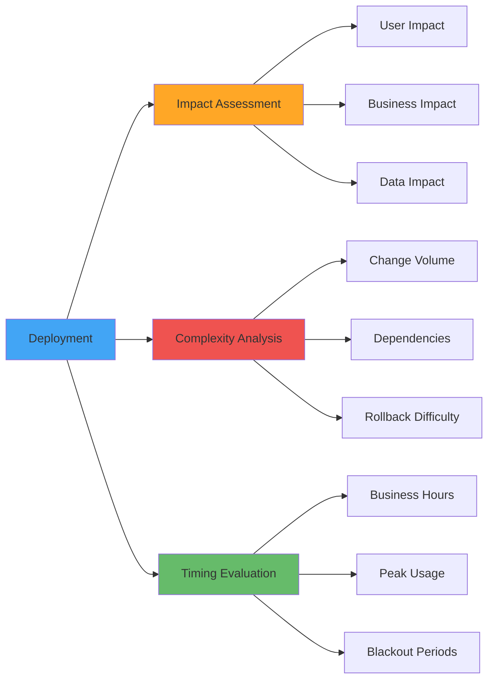

# Risk Assessment and Deployment Windows

**Learning Objective**: Evaluate deployment risk systematically and choose appropriate deployment timing to minimize business impact.

## Overview

Not all deployments are equal. A hotfix to correct a critical bug is different from deploying a new feature. This guide shows you how to assess risk automatically, choose the right deployment window, and get stakeholder approval when needed.

## Risk Assessment Framework

### Risk Dimensions



## Automated Risk Scoring

### Calculate Risk Score

```python
# risk_calculator.py
import json
import sys
from pathlib import Path

class RiskAssessment:
    def __init__(self):
        self.risk_score = 0
        self.risk_level = "LOW"
        self.risk_factors = []

    def analyze_changes(self, changed_files):
        """Analyze changed files and calculate risk"""

        # Count changes by metadata type
        metadata_counts = {
            'classes': 0,
            'triggers': 0,
            'flows': 0,
            'profiles': 0,
            'objects': 0,
            'fields': 0,
            'lwc': 0,
            'pages': 0
        }

        for file_path in changed_files:
            if '/classes/' in file_path:
                metadata_counts['classes'] += 1
            elif '/triggers/' in file_path:
                metadata_counts['triggers'] += 1
            elif '/flows/' in file_path:
                metadata_counts['flows'] += 1
            elif '/profiles/' in file_path:
                metadata_counts['profiles'] += 1
            elif '/objects/' in file_path:
                if '.object-meta.xml' in file_path:
                    metadata_counts['objects'] += 1
                elif '.field-meta.xml' in file_path:
                    metadata_counts['fields'] += 1
            elif '/lwc/' in file_path:
                metadata_counts['lwc'] += 1
            elif '/pages/' in file_path:
                metadata_counts['pages'] += 1

        return metadata_counts

    def score_metadata_risk(self, metadata_counts):
        """Score risk based on metadata type changes"""

        # Risk weights by metadata type
        risk_weights = {
            'triggers': 10,      # Highest risk
            'flows': 8,
            'profiles': 7,
            'objects': 6,
            'fields': 5,
            'classes': 4,
            'lwc': 3,
            'pages': 2
        }

        score = 0
        for metadata_type, count in metadata_counts.items():
            if count > 0:
                weight = risk_weights.get(metadata_type, 1)
                risk_points = weight * count
                score += risk_points

                self.risk_factors.append({
                    'type': metadata_type,
                    'count': count,
                    'weight': weight,
                    'points': risk_points
                })

        return score

    def score_volume_risk(self, total_changes):
        """Score risk based on volume of changes"""

        if total_changes > 100:
            self.risk_factors.append({
                'factor': 'high_volume',
                'value': total_changes,
                'points': 20
            })
            return 20
        elif total_changes > 50:
            self.risk_factors.append({
                'factor': 'medium_volume',
                'value': total_changes,
                'points': 10
            })
            return 10
        elif total_changes > 20:
            self.risk_factors.append({
                'factor': 'moderate_volume',
                'value': total_changes,
                'points': 5
            })
            return 5

        return 0

    def check_critical_components(self, changed_files):
        """Check if critical components are modified"""

        critical_patterns = [
            'TriggerHandler',
            'IntegrationService',
            'PaymentProcessor',
            'SecurityManager',
            'AuthenticationHandler'
        ]

        score = 0
        for file_path in changed_files:
            for pattern in critical_patterns:
                if pattern in file_path:
                    score += 15
                    self.risk_factors.append({
                        'factor': 'critical_component',
                        'component': pattern,
                        'points': 15
                    })

        return score

    def determine_risk_level(self, score):
        """Determine risk level from score"""

        if score >= 50:
            return "CRITICAL"
        elif score >= 30:
            return "HIGH"
        elif score >= 15:
            return "MEDIUM"
        else:
            return "LOW"

    def calculate(self, changed_files):
        """Calculate overall risk score"""

        # Analyze changes
        metadata_counts = self.analyze_changes(changed_files)
        total_changes = len(changed_files)

        # Calculate risk components
        metadata_risk = self.score_metadata_risk(metadata_counts)
        volume_risk = self.score_volume_risk(total_changes)
        critical_risk = self.check_critical_components(changed_files)

        # Total risk score
        self.risk_score = metadata_risk + volume_risk + critical_risk
        self.risk_level = self.determine_risk_level(self.risk_score)

        return {
            'score': self.risk_score,
            'level': self.risk_level,
            'factors': self.risk_factors,
            'total_changes': total_changes,
            'metadata_counts': metadata_counts
        }

if __name__ == '__main__':
    # Get changed files from git
    import subprocess

    result = subprocess.run(
        ['git', 'diff', '--name-only', 'origin/main...HEAD'],
        capture_output=True,
        text=True
    )

    changed_files = result.stdout.strip().split('\n')
    changed_files = [f for f in changed_files if f]  # Remove empty strings

    # Calculate risk
    assessment = RiskAssessment()
    risk_data = assessment.calculate(changed_files)

    # Output results
    print(json.dumps(risk_data, indent=2))
```

### Use in CI/CD Workflow

```yaml
name: Risk Assessment

on:
  pull_request:
    branches: [main, release/*]

jobs:
  assess-risk:
    runs-on: ubuntu-latest
    steps:
      - uses: actions/checkout@v4
        with:
          fetch-depth: 0  # Need full history for diff

      - name: Calculate Risk Score
        id: risk
        run: |
          python scripts/risk_calculator.py > risk-assessment.json

          RISK_SCORE=$(jq '.score' risk-assessment.json)
          RISK_LEVEL=$(jq -r '.level' risk-assessment.json)

          echo "score=$RISK_SCORE" >> $GITHUB_OUTPUT
          echo "level=$RISK_LEVEL" >> $GITHUB_OUTPUT

      - name: Generate Risk Report
        run: |
          echo "## 🎯 Risk Assessment" >> $GITHUB_STEP_SUMMARY
          echo "" >> $GITHUB_STEP_SUMMARY

          RISK_LEVEL="${{ steps.risk.outputs.level }}"

          case "$RISK_LEVEL" in
            CRITICAL)
              EMOJI="🔴"
              COLOR="red"
              ;;
            HIGH)
              EMOJI="🟠"
              COLOR="orange"
              ;;
            MEDIUM)
              EMOJI="🟡"
              COLOR="yellow"
              ;;
            LOW)
              EMOJI="🟢"
              COLOR="green"
              ;;
          esac

          echo "$EMOJI **Risk Level**: $RISK_LEVEL (Score: ${{ steps.risk.outputs.score }})" >> $GITHUB_STEP_SUMMARY
          echo "" >> $GITHUB_STEP_SUMMARY

          # Show risk factors
          echo "### Risk Factors" >> $GITHUB_STEP_SUMMARY
          jq -r '.factors[] | "- \(.type // .factor): +\(.points) points"' risk-assessment.json >> $GITHUB_STEP_SUMMARY

          # Show metadata breakdown
          echo "" >> $GITHUB_STEP_SUMMARY
          echo "### Changed Components" >> $GITHUB_STEP_SUMMARY
          jq -r '.metadata_counts | to_entries[] | select(.value > 0) | "- \(.key): \(.value)"' risk-assessment.json >> $GITHUB_STEP_SUMMARY

      - name: Require Approval for High Risk
        if: steps.risk.outputs.level == 'HIGH' || steps.risk.outputs.level == 'CRITICAL'
        run: |
          echo "⚠️ This deployment requires approval due to high risk level" >> $GITHUB_STEP_SUMMARY

          gh pr edit ${{ github.event.pull_request.number }} \
            --add-label "high-risk" \
            --add-label "requires-approval"

      - name: Block Critical Risk Deployments
        if: steps.risk.outputs.level == 'CRITICAL'
        run: |
          echo "❌ Deployment blocked due to CRITICAL risk level" >> $GITHUB_STEP_SUMMARY
          echo "Please:"
          echo "1. Break changes into smaller deployments"
          echo "2. Schedule deployment during maintenance window"
          echo "3. Get CAB approval"
          exit 1

      - name: Comment on PR
        uses: actions/github-script@v7
        with:
          script: |
            const riskData = require('./risk-assessment.json');

            const riskEmoji = {
              'CRITICAL': '🔴',
              'HIGH': '🟠',
              'MEDIUM': '🟡',
              'LOW': '🟢'
            };

            const comment = `## ${riskEmoji[riskData.level]} Risk Assessment

            **Risk Level**: ${riskData.level}
            **Risk Score**: ${riskData.score}

            ### Changed Components
            ${Object.entries(riskData.metadata_counts)
              .filter(([_, count]) => count > 0)
              .map(([type, count]) => `- ${type}: ${count}`)
              .join('\n')}

            ${riskData.level === 'HIGH' || riskData.level === 'CRITICAL' ?
              '⚠️ **Approval Required**: This deployment requires review and approval.' : ''}
            `;

            github.rest.issues.createComment({
              owner: context.repo.owner,
              repo: context.repo.repo,
              issue_number: context.issue.number,
              body: comment
            });
```

## Deployment Windows

### Define Deployment Windows

```yaml
# .github/deployment-windows.yml
windows:
  # Standard deployment window (low risk)
  standard:
    allowed_days: [Monday, Tuesday, Wednesday, Thursday]
    allowed_hours_start: "09:00"
    allowed_hours_end: "17:00"
    timezone: "America/New_York"
    risk_levels: [LOW, MEDIUM]

  # Extended window (needs approval)
  extended:
    allowed_days: [Monday, Tuesday, Wednesday, Thursday, Friday]
    allowed_hours_start: "08:00"
    allowed_hours_end: "20:00"
    timezone: "America/New_York"
    risk_levels: [HIGH]
    requires_approval: true

  # Maintenance window (critical changes only)
  maintenance:
    allowed_days: [Saturday, Sunday]
    allowed_hours_start: "00:00"
    allowed_hours_end: "06:00"
    timezone: "America/New_York"
    risk_levels: [CRITICAL]
    requires_approval: true
    requires_cab: true

  # Emergency window (hotfixes only)
  emergency:
    allowed_days: [Monday, Tuesday, Wednesday, Thursday, Friday, Saturday, Sunday]
    allowed_hours_start: "00:00"
    allowed_hours_end: "23:59"
    timezone: "America/New_York"
    risk_levels: [LOW]  # Only low-risk hotfixes
    requires_approval: true
    bypass_tests: false  # Still run tests even for hotfixes

blackout_periods:
  # No deployments during these times
  - name: "Year End Freeze"
    start: "2024-12-20"
    end: "2025-01-02"
    reason: "Holiday season - business critical period"

  - name: "Quarterly Close"
    recurrence: "quarterly"
    days_before_quarter_end: 5
    days_after_quarter_end: 2
    reason: "Financial reporting period"

  - name: "Black Friday Week"
    start: "2024-11-25"
    end: "2024-12-02"
    reason: "Peak shopping season"
```

### Validate Deployment Window

```python
# validate_deployment_window.py
import yaml
from datetime import datetime, time
import pytz
import sys

def load_windows_config():
    with open('.github/deployment-windows.yml', 'r') as f:
        return yaml.safe_load(f)

def is_in_blackout_period(config):
    """Check if current time is in a blackout period"""
    now = datetime.now()

    for blackout in config.get('blackout_periods', []):
        start = datetime.fromisoformat(blackout['start'])
        end = datetime.fromisoformat(blackout['end'])

        if start <= now <= end:
            return True, blackout['name'], blackout['reason']

    return False, None, None

def is_valid_deployment_time(window_config, risk_level):
    """Check if current time is within deployment window"""

    # Get current time in configured timezone
    tz = pytz.timezone(window_config['timezone'])
    now = datetime.now(tz)

    # Check if risk level is allowed
    if risk_level not in window_config['risk_levels']:
        return False, f"Risk level {risk_level} not allowed for this window"

    # Check day of week
    current_day = now.strftime('%A')
    if current_day not in window_config['allowed_days']:
        return False, f"Deployments not allowed on {current_day}"

    # Check time of day
    start_time = datetime.strptime(window_config['allowed_hours_start'], '%H:%M').time()
    end_time = datetime.strptime(window_config['allowed_hours_end'], '%H:%M').time()
    current_time = now.time()

    if not (start_time <= current_time <= end_time):
        return False, f"Deployments only allowed between {start_time} and {end_time}"

    return True, "Deployment window is valid"

def validate_deployment(risk_level):
    """Main validation function"""

    config = load_windows_config()

    # Check blackout periods first
    in_blackout, blackout_name, blackout_reason = is_in_blackout_period(config)
    if in_blackout:
        return {
            'allowed': False,
            'reason': f"Deployment blocked: {blackout_name} - {blackout_reason}"
        }

    # Find appropriate window for risk level
    for window_name, window_config in config['windows'].items():
        if risk_level in window_config['risk_levels']:
            valid, message = is_valid_deployment_time(window_config, risk_level)

            if valid:
                return {
                    'allowed': True,
                    'window': window_name,
                    'requires_approval': window_config.get('requires_approval', False),
                    'requires_cab': window_config.get('requires_cab', False),
                    'message': message
                }

    return {
        'allowed': False,
        'reason': f"No valid deployment window found for risk level {risk_level}"
    }

if __name__ == '__main__':
    risk_level = sys.argv[1] if len(sys.argv) > 1 else 'LOW'

    result = validate_deployment(risk_level)
    print(json.dumps(result, indent=2))

    if not result['allowed']:
        sys.exit(1)
```

Use in workflow:

```yaml
- name: Check Deployment Window
  id: window
  run: |
    pip install pytz pyyaml

    RISK_LEVEL="${{ steps.risk.outputs.level }}"

    python scripts/validate_deployment_window.py "$RISK_LEVEL" > window-check.json

    ALLOWED=$(jq -r '.allowed' window-check.json)
    REQUIRES_APPROVAL=$(jq -r '.requires_approval // false' window-check.json)

    echo "allowed=$ALLOWED" >> $GITHUB_OUTPUT
    echo "requires_approval=$REQUIRES_APPROVAL" >> $GITHUB_OUTPUT

    if [ "$ALLOWED" != "true" ]; then
      REASON=$(jq -r '.reason' window-check.json)
      echo "❌ Deployment not allowed: $REASON" >> $GITHUB_STEP_SUMMARY
      exit 1
    fi

- name: Request Approval if Required
  if: steps.window.outputs.requires_approval == 'true'
  uses: trstringer/manual-approval@v1
  with:
    secret: ${{ github.TOKEN }}
    approvers: devops-leads,release-managers
    minimum-approvals: 2
    issue-title: "Deployment Approval Required: ${{ github.event.pull_request.title }}"
    issue-body: |
      **Risk Level**: ${{ steps.risk.outputs.level }}
      **Risk Score**: ${{ steps.risk.outputs.score }}

      Please review and approve this deployment.
```

## Impact Analysis

### Identify Affected Users

```yaml
- name: Analyze User Impact
  run: |
    echo "### 👥 User Impact Analysis" >> $GITHUB_STEP_SUMMARY
    echo "" >> $GITHUB_STEP_SUMMARY

    # Check if profiles are modified
    PROFILE_CHANGES=$(git diff --name-only origin/main...HEAD | grep -c "profiles/" || true)

    if [ "$PROFILE_CHANGES" -gt 0 ]; then
      echo "⚠️ **Profile Changes Detected**: All users may be affected" >> $GITHUB_STEP_SUMMARY

      # List modified profiles
      git diff --name-only origin/main...HEAD | grep "profiles/" | while read profile; do
        PROFILE_NAME=$(basename "$profile" .profile-meta.xml)
        echo "- $PROFILE_NAME" >> $GITHUB_STEP_SUMMARY
      done
    fi

    # Check if page layouts are modified
    LAYOUT_CHANGES=$(git diff --name-only origin/main...HEAD | grep -c "layouts/" || true)

    if [ "$LAYOUT_CHANGES" -gt 0 ]; then
      echo "" >> $GITHUB_STEP_SUMMARY
      echo "⚠️ **Page Layout Changes**: UI changes will affect users" >> $GITHUB_STEP_SUMMARY
    fi

    # Check if critical Apex classes are modified
    APEX_CHANGES=$(git diff --name-only origin/main...HEAD | grep "classes/" | grep -E "(Trigger|Handler|Service)" | wc -l || true)

    if [ "$APEX_CHANGES" -gt 0 ]; then
      echo "" >> $GITHUB_STEP_SUMMARY
      echo "⚠️ **Business Logic Changes**: $APEX_CHANGES critical classes modified" >> $GITHUB_STEP_SUMMARY
    fi
```

### Estimate Downtime

```yaml
- name: Estimate Deployment Time
  run: |
    # Count changes by type
    CLASS_COUNT=$(git diff --name-only origin/main...HEAD | grep -c "\.cls$" || true)
    TRIGGER_COUNT=$(git diff --name-only origin/main...HEAD | grep -c "\.trigger$" || true)
    LWC_COUNT=$(git diff --name-only origin/main...HEAD | grep -c "/lwc/" || true)
    OBJECT_COUNT=$(git diff --name-only origin/main...HEAD | grep -c "\.object-meta\.xml$" || true)

    # Estimate time (rough estimates)
    DEPLOY_TIME=$((CLASS_COUNT * 2 + TRIGGER_COUNT * 3 + LWC_COUNT * 1 + OBJECT_COUNT * 5))
    TEST_TIME=$((CLASS_COUNT * 5 + TRIGGER_COUNT * 10))

    TOTAL_TIME=$((DEPLOY_TIME + TEST_TIME))

    echo "### ⏱️ Estimated Deployment Time" >> $GITHUB_STEP_SUMMARY
    echo "" >> $GITHUB_STEP_SUMMARY
    echo "- Deployment: ~$DEPLOY_TIME minutes" >> $GITHUB_STEP_SUMMARY
    echo "- Tests: ~$TEST_TIME minutes" >> $GITHUB_STEP_SUMMARY
    echo "- **Total**: ~$TOTAL_TIME minutes" >> $GITHUB_STEP_SUMMARY

    if [ "$TOTAL_TIME" -gt 60 ]; then
      echo "" >> $GITHUB_STEP_SUMMARY
      echo "⚠️ **Long deployment expected** - Consider maintenance window" >> $GITHUB_STEP_SUMMARY
    fi
```

## Change Advisory Board (CAB) Integration

### Auto-Create CAB Ticket

```yaml
- name: Create CAB Ticket for High Risk
  if: steps.risk.outputs.level == 'HIGH' || steps.risk.outputs.level == 'CRITICAL'
  run: |
    # Create Jira ticket for CAB review
    curl -X POST \
      -H "Authorization: Bearer ${{ secrets.JIRA_TOKEN }}" \
      -H "Content-Type: application/json" \
      -d '{
        "fields": {
          "project": {"key": "CAB"},
          "summary": "Production Deployment: '"${{ github.event.pull_request.title }}"'",
          "description": "Risk Level: '"${{ steps.risk.outputs.level }}"'\nRisk Score: '"${{ steps.risk.outputs.score }}"'\n\nPR: ${{ github.event.pull_request.html_url }}",
          "issuetype": {"name": "Change Request"},
          "priority": {"name": "High"}
        }
      }' \
      https://your-company.atlassian.net/rest/api/3/issue

    # Also create GitHub issue
    gh issue create \
      --title "CAB Review Required: ${{ github.event.pull_request.title }}" \
      --body "**Risk Level**: ${{ steps.risk.outputs.level }}\n**PR**: #${{ github.event.pull_request.number }}" \
      --label "cab-review" \
      --label "high-risk"
```

## Rollback Plan

### Document Rollback Strategy

```yaml
- name: Generate Rollback Plan
  run: |
    echo "## 🔄 Rollback Plan" >> $GITHUB_STEP_SUMMARY
    echo "" >> $GITHUB_STEP_SUMMARY

    # Check for destructive changes
    if [ -f "manifest/destructiveChanges.xml" ]; then
      echo "⚠️ **Destructive Changes Detected**" >> $GITHUB_STEP_SUMMARY
      echo "- Rollback may not fully restore previous state" >> $GITHUB_STEP_SUMMARY
      echo "- Manual intervention may be required" >> $GITHUB_STEP_SUMMARY
      echo "" >> $GITHUB_STEP_SUMMARY
    fi

    # Document rollback steps
    echo "### Rollback Steps" >> $GITHUB_STEP_SUMMARY
    echo "1. Navigate to Actions tab" >> $GITHUB_STEP_SUMMARY
    echo "2. Find the 'Rollback Production' workflow" >> $GITHUB_STEP_SUMMARY
    echo "3. Run workflow with deployment ID: \`${GITHUB_RUN_ID}\`" >> $GITHUB_STEP_SUMMARY
    echo "" >> $GITHUB_STEP_SUMMARY

    # Estimate rollback time
    CHANGE_COUNT=$(git diff --name-only origin/main...HEAD | wc -l)
    ROLLBACK_TIME=$((CHANGE_COUNT * 2))

    echo "**Estimated Rollback Time**: ~$ROLLBACK_TIME minutes" >> $GITHUB_STEP_SUMMARY
```

## Real-World Example: Complete Risk Assessment

```yaml
name: Production Deployment with Risk Assessment

on:
  push:
    branches: [release/*]

jobs:
  risk-assessment:
    runs-on: ubuntu-latest
    outputs:
      risk_level: ${{ steps.risk.outputs.level }}
      risk_score: ${{ steps.risk.outputs.score }}
      window_allowed: ${{ steps.window.outputs.allowed }}
    steps:
      - uses: actions/checkout@v4
        with:
          fetch-depth: 0

      - name: Calculate Risk Score
        id: risk
        run: |
          python scripts/risk_calculator.py > risk.json
          echo "level=$(jq -r '.level' risk.json)" >> $GITHUB_OUTPUT
          echo "score=$(jq -r '.score' risk.json)" >> $GITHUB_OUTPUT

      - name: Validate Deployment Window
        id: window
        run: |
          pip install pytz pyyaml
          python scripts/validate_deployment_window.py "${{ steps.risk.outputs.level }}" > window.json
          echo "allowed=$(jq -r '.allowed' window.json)" >> $GITHUB_OUTPUT

      - name: Generate Risk Report
        run: |
          python scripts/generate_risk_report.py \
            --risk-file risk.json \
            --window-file window.json \
            --output risk-report.md

          cat risk-report.md >> $GITHUB_STEP_SUMMARY

      - name: Upload Risk Assessment
        uses: actions/upload-artifact@v4
        with:
          name: risk-assessment
          path: |
            risk.json
            window.json
            risk-report.md

  request-approval:
    needs: risk-assessment
    if: needs.risk-assessment.outputs.risk_level == 'HIGH' || needs.risk-assessment.outputs.risk_level == 'CRITICAL'
    runs-on: ubuntu-latest
    steps:
      - name: Request CAB Approval
        uses: trstringer/manual-approval@v1
        with:
          secret: ${{ github.TOKEN }}
          approvers: release-manager,tech-lead,devops-lead
          minimum-approvals: 2
          issue-title: "Production Deployment Approval Required"
          issue-body: |
            **Risk Level**: ${{ needs.risk-assessment.outputs.risk_level }}
            **Risk Score**: ${{ needs.risk-assessment.outputs.risk_score }}

            Please review the risk assessment and approve deployment.

  deploy:
    needs: [risk-assessment, request-approval]
    if: |
      always() &&
      needs.risk-assessment.outputs.window_allowed == 'true' &&
      (needs.request-approval.result == 'success' || needs.request-approval.result == 'skipped')
    runs-on: ubuntu-latest
    steps:
      - uses: actions/checkout@v4

      - name: Deploy to Production
        run: |
          echo "${{ secrets.PROD_AUTH_URL }}" > auth.txt
          sf org login sfdx-url --sfdx-url-file auth.txt --alias production

          sf project deploy start \
            --target-org production \
            --manifest manifest/package.xml \
            --test-level RunLocalTests \
            --wait 60

      - name: Verify Deployment
        run: |
          bash scripts/verify_deployment.sh production

      - name: Notify Success
        if: success()
        run: |
          curl -X POST ${{ secrets.SLACK_WEBHOOK }} \
            -H 'Content-Type: application/json' \
            -d '{
              "text": "✅ Production deployment successful",
              "attachments": [{
                "color": "good",
                "fields": [
                  {"title": "Risk Level", "value": "${{ needs.risk-assessment.outputs.risk_level }}", "short": true},
                  {"title": "Deployment ID", "value": "${{ github.run_id }}", "short": true}
                ]
              }]
            }'

      - name: Notify Failure
        if: failure()
        run: |
          curl -X POST ${{ secrets.SLACK_WEBHOOK }} \
            -H 'Content-Type: application/json' \
            -d '{
              "text": "❌ Production deployment FAILED",
              "attachments": [{
                "color": "danger",
                "fields": [
                  {"title": "Risk Level", "value": "${{ needs.risk-assessment.outputs.risk_level }}", "short": true},
                  {"title": "Deployment ID", "value": "${{ github.run_id }}", "short": true}
                ]
              }]
            }'

          # Auto-trigger rollback for failed deployments
          gh workflow run rollback-production.yml \
            -f deployment_id=${{ github.run_id }}
```

## Best Practices

### 1. Define Risk Thresholds

```yaml
risk_thresholds:
  low: 0-14
  medium: 15-29
  high: 30-49
  critical: 50+

actions:
  low:
    - Auto-deploy during business hours
    - No approval required
  medium:
    - Auto-deploy during extended hours
    - Team lead notification
  high:
    - Requires 1 approval
    - Deploy during maintenance window
    - CAB notification
  critical:
    - Requires 2 approvals
    - Requires CAB approval
    - Deploy during scheduled maintenance only
    - Full rollback plan required
```

### 2. Document Decision Matrix

```markdown
| Risk Level | Deployment Window | Approval Required | Tests Required | Notification |
|------------|------------------|-------------------|----------------|--------------|
| LOW | Business hours | No | RunLocalTests | Team Slack |
| MEDIUM | Extended hours | Team Lead | RunLocalTests | Team + Stakeholders |
| HIGH | Maintenance window | 1 Approver | RunLocalTests | Team + Stakeholders + CAB |
| CRITICAL | Scheduled maintenance | 2 Approvers + CAB | RunLocalTests | All + Executive |
```

### 3. Continuous Risk Monitoring

```yaml
# Monitor deployments and adjust risk scores
- name: Update Risk Model
  run: |
    # After each deployment, collect metrics
    DEPLOYMENT_SUCCESS=${{ job.status }}
    RISK_SCORE=${{ needs.risk-assessment.outputs.risk_score }}

    # Store for machine learning model training
    python scripts/record_deployment_outcome.py \
      --risk-score "$RISK_SCORE" \
      --success "$DEPLOYMENT_SUCCESS" \
      --timestamp "$(date -u +%Y-%m-%dT%H:%M:%SZ)"
```

## Interview Talking Points

1. **"We use automated risk scoring to evaluate every deployment"**
   - Shows systematic approach
   - Demonstrates maturity in DevOps practices

2. **"We have defined deployment windows based on risk levels"**
   - Shows business awareness
   - Demonstrates understanding of impact

3. **"High-risk deployments require CAB approval"**
   - Shows governance understanding
   - Demonstrates enterprise experience

4. **"We validate deployment timing automatically in CI/CD"**
   - Shows automation expertise
   - Demonstrates proactive approach

5. **"We track deployment outcomes to improve risk models"**
   - Shows continuous improvement mindset
   - Demonstrates data-driven approach

## Next Steps

- **Next Guide**: [Emergency Hotfixes](./emergency-hotfixes) - Handle urgent production fixes
- **Related**: [Rollback Strategies](../pipelines/rollback-strategies) - Plan for deployment failures
- **Related**: [Deployment Failures](./deployment-failures) - Recover from failed deployments

---

**Key Takeaway**: Risk assessment isn't about preventing deployments - it's about deploying safely. Automate the assessment, enforce deployment windows, and always have a rollback plan.
